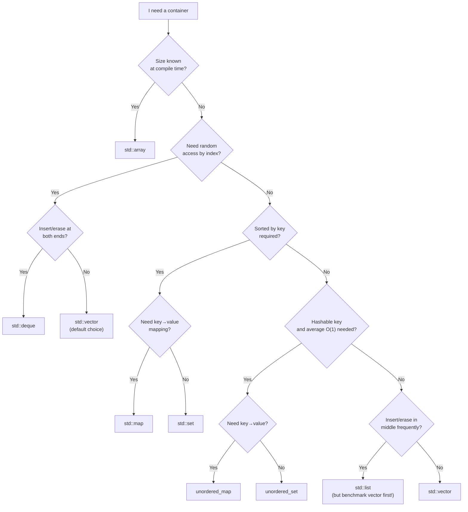

# Containers Overview

> [!info] Chapter 11 — Note 1 of 9
> This note is the **map** of the entire STL container landscape. The next eight notes drill into each family ([[2. Sequence Containers]], [[3. Associative Containers]], [[4. Unordered Containers]], [[5. Container Adapters]], [[6. Iterators]], [[7. Algorithms]], [[8. Ranges (C++20)]], [[9. Function Objects and Binders]]).

## Why This Matters

The Standard Template Library is the single largest productivity multiplier in modern C++. Roughly 70% of the data structures you would otherwise hand-roll — dynamic arrays, hash maps, balanced trees, ring buffers, priority queues — already exist, are fully tested, and carry **formal complexity contracts** that you can rely on at code-review time. Choosing the wrong container, however, silently ships a slow program: a `std::list<int>` used where a `std::vector<int>` would do can cost 5×–20× the memory and 10×–100× the traversal time on modern hardware because of cache locality. The skill that separates a competent C++ developer from an expert is **container literacy**: knowing the taxonomy, the complexity guarantees, the iterator invalidation rules, and the decision tree that picks the right structure in seconds.

This note gives you the bird's-eye view. Subsequent notes fill in the per-container depth.

## Background

The STL was designed by Alexander Stepanov and Meng Lee at Hewlett-Packard in the early 1990s and adopted into the C++ Standard Library in 1994 (C++98). Its three pillars are:

1. **Containers** — generic data structures that own elements.
2. **Iterators** — generic pointers that decouple algorithms from containers.
3. **Algorithms** — generic functions that operate over iterator ranges.

The genius of the design is that any algorithm works with any container whose iterators satisfy the algorithm's category requirements. `std::sort` needs random-access iterators; `std::find` needs only input iterators. This orthogonality means you compose ~110 algorithms × ~15 containers without writing 1,650 specialized functions.

The STL containers are formally **value-based**: they store *copies* of objects (with move optimization), not references. This guarantees ownership clarity (the container owns its elements) at the cost of requiring elements to be copyable/movable. If you want reference semantics, you store smart pointers (`std::vector<std::unique_ptr<Widget>>`) — see [[../7. Memory Management/5. Smart Pointers]].

## The STL Container Taxonomy

The C++ standard groups containers into four broad families, with a fifth (views) added in C++20.

### Sequence Containers

Elements are stored in a **linear arrangement** that the caller controls. Order reflects insertion order (or position).

| Container | Header | Underlying structure |
|---|---|---|
| `std::array<T, N>` | `<array>` | C-style array, stack or static storage |
| `std::vector<T>` | `<vector>` | Dynamic array, heap |
| `std::deque<T>` | `<deque>` | Array of chunks ("map of arrays") |
| `std::list<T>` | `<list>` | Doubly linked list |
| `std::forward_list<T>` | `<forward_list>` | Singly linked list |
| `std::basic_string` / `std::string` | `<string>` | (Conceptually a sequence container — see [[../3. Strings and Character Data/2. std::string Deep Dive]]) |

### Associative Containers

Elements are stored in **sorted order** keyed by a comparison function. Lookup, insertion, and erasure are **O(log n)**.

| Container | Header | Property |
|---|---|---|
| `std::set<K>` | `<set>` | Unique keys, sorted |
| `std::multiset<K>` | `<set>` | Duplicate keys allowed, sorted |
| `std::map<K, V>` | `<map>` | Unique keys → values, sorted by key |
| `std::multimap<K, V>` | `<map>` | Duplicate keys allowed, sorted |

All four are typically implemented as **red-black trees**.

### Unordered (Hashed) Containers

Added in C++11. Elements are stored in **buckets** indexed by a hash function. Average operations are **O(1)**; worst-case is **O(n)**.

| Container | Header |
|---|---|
| `std::unordered_set<K>` | `<unordered_set>` |
| `std::unordered_multiset<K>` | `<unordered_set>` |
| `std::unordered_map<K, V>` | `<unordered_map>` |
| `std::unordered_multimap<K, V>` | `<unordered_map>` |

### Container Adapters

Adapters are **wrappers** over an underlying sequence container that restrict the interface to a specific discipline (LIFO, FIFO, priority).

| Adapter | Header | Discipline |
|---|---|---|
| `std::stack<T>` | `<stack>` | LIFO — push, pop, top |
| `std::queue<T>` | `<queue>` | FIFO — push, pop, front, back |
| `std::priority_queue<T>` | `<queue>` | Max-heap — push, pop, top |

### Views (C++20)

Views are **non-owning, lazy** ranges. They do not own elements; they reference data owned elsewhere.

| View family | Header |
|---|---|
| `std::span<T>` | `<span>` |
| `std::string_view` | `<string_view>` |
| `std::ranges::view` (filter, transform, iota, ...) | `<ranges>` |

Views are covered in [[8. Ranges (C++20)]] and [[../3. Strings and Character Data/3. string_view and Modern String Handling]].

```mermaid
graph TD
    STL["STL Containers"]
    STL --> SEQ["Sequence Containers"]
    STL --> ASSOC["Associative Containers"]
    STL --> UNORD["Unordered Containers"]
    STL --> ADAPT["Container Adapters"]
    STL --> VIEWS["Views (C++20, non-owning)"]

    SEQ --> ARR["std::array<br/>fixed, stack"]
    SEQ --> VEC["std::vector<br/>dynamic array"]
    SEQ --> DEQ["std::deque<br/>chunked double-ended"]
    SEQ --> LST["std::list<br/>doubly linked"]
    SEQ --> FLST["std::forward_list<br/>singly linked"]

    ASSOC --> SET["std::set / multiset<br/>red-black tree"]
    ASSOC --> MAP["std::map / multimap<br/>red-black tree"]

    UNORD --> USET["unordered_set / multiset<br/>hash table"]
    UNORD --> UMAP["unordered_map / multimap<br/>hash table"]

    ADAPT --> STK["std::stack<br/>LIFO"]
    ADAPT --> QUE["std::queue<br/>FIFO"]
    ADAPT --> PQUE["std::priority_queue<br/>max-heap"]

    VIEWS --> SPAN["std::span"]
    VIEWS --> SV["std::string_view"]
    VIEWS --> RNG["ranges views"]
```



## Complexity Guarantees

The standard mandates these Big-O bounds. **Average** applies to unordered containers (amortized over a good hash); **worst-case** is the formal guarantee.

| Container | Access by index | Access by key | Insert (anywhere) | Insert (end) | Erase | Search |
|---|---|---|---|---|---|---|
| `array` | O(1) | — | — | — | — | O(n) |
| `vector` | O(1) | — | O(n) | O(1) amortized | O(n) | O(n) |
| `deque` | O(1) | — | O(n) | O(1) amortized | O(n) | O(n) |
| `list` | O(n) | — | O(1) given iterator | O(1) | O(1) given iterator | O(n) |
| `forward_list` | O(n) | — | O(1) after position | O(1) | O(1) after position | O(n) |
| `set` / `map` | — | O(log n) | O(log n) | O(log n) | O(log n) | O(log n) |
| `multiset` / `multimap` | — | O(log n) | O(log n) | O(log n) | O(log n) | O(log n) |
| `unordered_set` / `unordered_map` | — | O(1) avg / O(n) worst | O(1) avg / O(n) worst | O(1) avg | O(1) avg | O(1) avg / O(n) worst |
| `unordered_multiset` / `unordered_multimap` | — | O(1) avg / O(n) worst | O(1) avg | O(1) avg | O(1) avg | O(1) avg |
| `stack` | top: O(1) | — | push O(1) | — | pop O(1) | — |
| `queue` | front/back O(1) | — | push O(1) | — | pop O(1) | — |
| `priority_queue` | top O(1) | — | push O(log n) | — | pop O(log n) | — |

> [!note] "Amortized" is not "average"
> Amortized O(1) for `vector::push_back` means: **n** consecutive pushes cost **O(n)** total even though some individual pushes cost O(n) (when reallocation happens). It does **not** mean "usually O(1) but sometimes slower." It is a strict, formal guarantee.

## Iterator Invalidation Rules

This is the single most-tested STL topic in senior interviews. The rules differ per container and per operation:

| Container | Operation | Invalidation |
|---|---|---|
| `array` | any | iterators are pointers; never invalidated, but element lifetime ends with the array |
| `vector` | `reserve`, `push_back` (no realloc) | none |
| `vector` | `push_back` (realloc), `insert`, `erase` | all iterators at/after the point + all references |
| `deque` | `push_front`, `push_back` | iterators invalidated; references to elements stay valid |
| `deque` | `insert`, `erase` (middle) | all iterators and references |
| `list` / `forward_list` | `insert` | none (new iterators valid) |
| `list` / `forward_list` | `erase` | only iterators to erased elements |
| `set` / `map` / `multiset` / `multimap` | `insert` | none |
| `set` / `map` / `multiset` / `multimap` | `erase` | only iterators to erased elements |
| `unordered_*` | `insert` causing rehash | all iterators; references stay valid |
| `unordered_*` | `insert` (no rehash), `erase` | only iterators to erased elements |

> [!warning] The classic trap
> ```cpp
> for (auto it = v.begin(); it != v.end(); ++it) {
>     if (*it == target) v.erase(it);  // UB: it is now invalid
> }
> ```
> Use the **erase-return idiom**: `it = v.erase(it);` (and don't increment). For associative/unordered containers use `it = c.erase(it);` (C++11+).

## Choosing the Right Container

The selection is driven by four questions:

1. **Do I need elements sorted?** → associative (`set`/`map`) vs unordered
2. **Do I know the size at compile time?** → `std::array`
3. **Where do I insert/erase most often?** → front (`deque`/`list`), middle (`list`), back (`vector`/`deque`)
4. **Do I need random access by index?** → `array`/`vector`/`deque` (yes) vs `list`/`forward_list` (no)



> [!tip] Default to `std::vector`
> For ~90% of real-world use cases, `std::vector` is the right answer. It is cache-friendly, has the lowest per-element overhead, and supports random access. Only reach for `list` or `forward_list` after you have benchmarked `vector` and proven it is too slow — the "linked list is faster for middle insertion" intuition is usually wrong on modern hardware because of cache misses.

## Code Example — Comparing Container Behavior

```cpp
#include <vector>
#include <list>
#include <deque>
#include <set>
#include <unordered_set>
#include <iostream>
#include <chrono>

int main() {
    constexpr int N = 1'000'000;

    // Benchmark: insert N elements at the front
    auto bench = [](auto&& factory, const char* name) {
        auto t0 = std::chrono::high_resolution_clock::now();
        auto c = factory();
        for (int i = 0; i < N; ++i) c.push_front(i);  // list/deque only
        auto t1 = std::chrono::high_resolution_clock::now();
        std::cout << name << ": "
                  << std::chrono::duration_cast<std::chrono::milliseconds>(t1 - t0).count()
                  << " ms\n";
    };

    // std::vector has no push_front — would be O(n^2) — skip
    bench([]{ return std::deque<int>{};   }, "deque  push_front");
    bench([]{ return std::list<int>{};    }, "list   push_front");

    // Benchmark: insert N elements at the back
    auto benchBack = [](auto&& factory, const char* name) {
        auto t0 = std::chrono::high_resolution_clock::now();
        auto c = factory();
        for (int i = 0; i < N; ++i) c.push_back(i);
        auto t1 = std::chrono::high_resolution_clock::now();
        std::cout << name << ": "
                  << std::chrono::duration_cast<std::chrono::milliseconds>(t1 - t0).count()
                  << " ms\n";
    };
    benchBack([]{ return std::vector<int>{}; }, "vector push_back");
    benchBack([]{ return std::deque<int>{};  }, "deque  push_back");
    benchBack([]{ return std::list<int>{};   }, "list   push_back");

    // Benchmark: lookup in set vs unordered_set
    std::set<int>           s;
    std::unordered_set<int> u;
    for (int i = 0; i < N; ++i) { s.insert(i); u.insert(i); }

    auto t0 = std::chrono::high_resolution_clock::now();
    volatile bool found = false;
    for (int i = 0; i < N; ++i) found = s.count(i);
    auto t1 = std::chrono::high_resolution_clock::now();
    std::cout << "set           lookup: "
              << std::chrono::duration_cast<std::chrono::milliseconds>(t1 - t0).count() << " ms\n";

    t0 = std::chrono::high_resolution_clock::now();
    for (int i = 0; i < N; ++i) found = u.count(i);
    t1 = std::chrono::high_resolution_clock::now();
    std::cout << "unordered_set lookup: "
              << std::chrono::duration_cast<std::chrono::milliseconds>(t1 - t0).count() << " ms\n";
}
```

Typical output (numbers vary by hardware): `vector push_back` is ~3× faster than `deque push_back` and ~10× faster than `list push_back`. `unordered_set lookup` is ~2×–4× faster than `set lookup` for integer keys, but consumes more memory and has no sorted iteration.

## Memory and Cache Considerations

The Big-O tables above tell only half the story. Modern CPUs are **memory-hierarchy machines**: a cache line is 64 bytes, an L1 hit is ~4 cycles, an L2 hit is ~12 cycles, an L3 hit is ~40 cycles, and a main-memory access is ~200–400 cycles. This means that **constant factors driven by memory layout often dominate asymptotic complexity** for typical container sizes (n ≤ 10⁶).

### Contiguous vs Node-Based — Why It Matters

A `std::vector<int>` of 1 million elements occupies 4 MB of contiguous memory. The CPU prefetcher streams it into L1 cache; full traversal costs roughly 1 million × 4-byte / 64-byte cache-lines × 4 cycles ≈ 250K cycles ≈ 100 µs. A `std::list<int>` of the same elements occupies ~16 MB across 1 million heap nodes. Each `++it` is a pointer dereference to a random address — the prefetcher cannot help — so each step costs ~200 cycles, totaling ~200 million cycles ≈ 80 ms. That's an **800× difference**, all hidden behind identical-looking `for (int x : c)` syntax.

### Memory Overhead Per Element

| Container | Per-element overhead | Notes |
|---|---|---|
| `array` | 0 bytes | No metadata |
| `vector` | 0 bytes (beyond capacity slack, ~50%) | Slack due to geometric growth |
| `deque` | ~0–16 bytes | Pointer to chunk, slack within chunk |
| `list` | 16 bytes (2 pointers) | Per-node allocation |
| `forward_list` | 8 bytes (1 pointer) | Per-node allocation |
| `set`/`map` | ~32–48 bytes | Color + 3 pointers + padding |
| `unordered_*` | ~32–48 bytes | Bucket index + next pointer + payload |

### Capacity Slack

Geometric growth of `vector`/`deque`/`string` implies that, on average, capacity is ~1.5× size. For 1M elements, that's ~2 MB of "wasted" memory. `shrink_to_fit` reclaims it (non-binding but universally honored). Conversely, `reserve(N)` before bulk insertion eliminates the slack entirely and avoids log n reallocations.

## Comparison with Other Languages

| Feature | C++ STL | Java Collections | Python collections |
|---|---|---|---|
| Default array | `std::vector` (contiguous) | `ArrayList` (contiguous) | `list` (array of pointers) |
| Linked list | `std::list` (true linked) | `LinkedList` (doubly linked) | `collections.deque` (block array) |
| Hash map | `std::unordered_map` (separate chaining) | `HashMap` (chain + treeify at 8) | `dict` (open addressing) |
| Sorted map | `std::map` (red-black tree) | `TreeMap` (red-black tree) | (none built-in) |
| Iterator invalidation | Per-container rules | ModCount check → `ConcurrentModificationException` | Most operations invalidate |
| Memory layout | Value types inline | Always boxed (heap objects) | Always boxed (heap objects) |
| Generics mechanism | Templates (reified) | Type erasure | Duck typing |

The C++ STL is unique in storing **values inline** rather than references to boxed objects. This is the single biggest reason C++ containers are typically 3–10× faster than equivalent Java/Python code — but it requires you to think about move semantics, copy elision, and the cost of element construction in a way Java/Python programmers never do.

## Exception Safety Guarantees

The standard mandates three levels of exception safety for container operations:

| Guarantee | Meaning |
|---|---|
| **Basic** | On exception, the container is in a valid but unspecified state; no resources leaked |
| **Strong** | On exception, the container is rolled back to its pre-operation state (commit-or-rollback) |
| **No-throw** | Operation cannot throw (`noexcept`) |

Most operations provide **basic** guarantee at minimum. Strong-guarantee operations include `push_back` on `vector`/`deque`/`list` (when the element type is copyable/movable with the appropriate guarantee). `emplace_back` provides only basic if the constructor throws — but `push_back` of an already-constructed object provides strong because the move can be backed out.

To get strong-guarantee insertion in the middle of a vector, use the **copy-and-swap idiom**: build a copy, modify it, then swap.

## Choosing the Right Container — A Worked Example

You're building an LRU cache. Requirements: O(1) lookup by key, O(1) move-to-front on access, bounded size with eviction of the least-recently-used element.

- **Lookup by key** → hash-based: `unordered_map`.
- **Move-to-front** → need to splice a node without invalidating iterators → `list`.
- **Bounded size + eviction** → `list` pop_front + map erase.

Solution: `unordered_map<K, list<K>::iterator>` paired with a `list<K>`. The list orders by recency (front = most recent); the map stores iterators into the list. Access: lookup in map → splice the iterator's list node to front → return. On insert: if size > capacity, pop_back of list + erase from map.

```cpp
class LRUCache {
    int cap;
    std::list<int> order;                                // front = MRU
    std::unordered_map<int, std::list<int>::iterator> pos;
public:
    LRUCache(int capacity) : cap{capacity} {}
    void touch(int key) {
        auto it = pos.find(key);
        if (it == pos.end()) {
            if ((int)pos.size() == cap) {
                pos.erase(order.back());
                order.pop_back();
            }
            order.push_front(key);
            pos[key] = order.begin();
        } else {
            order.splice(order.begin(), order, it->second);
            it->second = order.begin();
        }
    }
};
```

This idiom — **hash map + intrusive list with iterator values** — is the canonical C++ LRU. It works only because `std::list` iterators are stable across `splice` (a property no other standard container has).

## Common Pitfalls

- **Using `list` for "fast middle insertion"** without accounting for traversal cost. Inserting in the middle of a 1M-element `vector` of `int` is *faster* than in a `list` because moving 500KB of cache-resident integers beats 500KB of pointer chases.
- **Storing iterators past their validity.** Iterators into `vector` are unsafe across any size-changing operation. Cache indices instead.
- **Forgetting `reserve`** when the final size is known. `v.reserve(N)` before `N` `push_back` calls turns O(N log N) reallocation cost into O(N).
- **Hashing custom types without a `std::hash` specialization** yields a compile error for `unordered_*` containers — easy to forget.
- **Mixing `[]` and `at()` on `vector`** — `[]` is unchecked and silently UB on out-of-bounds; `at()` throws `std::out_of_range`. Use `at()` in debug paths.
- **Assuming `unordered_map` iteration order is stable.** It is not — rehashing changes the bucket order. If you need stable order, use `map`.
- **Modifying a key-like field of an element in a `set`.** The standard forbids this; you must `extract` + modify + `insert` (C++11 `extract` was added in C++17).

## Tips and Tricks

- **`shrink_to_fit`** is a non-binding request to reduce `vector`/`deque`/`string` capacity to size. Useful after a build-up phase.
- **`emplace` vs `insert`**: `emplace` constructs in-place, avoiding a temporary. Prefer `emplace_back`/`emplace` for non-trivial types.
- **`extract` (C++17)** lets you move a node out of a `set`/`map`/`unordered_*` without copying, and re-insert it into another container of the same type. This enables **O(1) splice** between associative containers.
- **`merge` (C++17)** splices nodes from one associative/unordered container into another of the same type — also O(n) overall but with no element copies.
- **`try_emplace` (C++11) for `map`** avoids constructing the value if the key already exists — critical when the value type has no default constructor or is expensive to build.
- **`insert_or_assign` (C++17)** is the assignment-style counterpart — like `operator[]` but returns an `inserted` bool.
- **`contains` (C++20)** for all associative and unordered containers — replaces the awkward `c.find(k) != c.end()` idiom.
- **`std::flat_map` (C++23)** is a sorted adapter over a contiguous container (typically `vector`) — gives sorted semantics with cache-friendly storage.
- **Use `pmr` allocators** (`std::pmr::vector<int>`) when you need arena allocation without rewriting your container types — see [[../7. Memory Management/7. Custom Allocators]].

## Active Recall

1. Name the four STL container families and give one example of each.
2. What is the Big-O of `vector::push_back`? Distinguish **amortized** from **worst-case**.
3. List the operations that invalidate iterators into a `std::vector`.
4. Why does `std::deque::push_front` invalidate iterators but **not** references to existing elements?
5. When would you reach for `std::forward_list` instead of `std::list`?
6. What is the **erase-return idiom** and why is it needed?
7. Give two reasons `std::vector` is the recommended default container.
8. Compare `set::count`, `set::find`, and `set::contains` (C++20) — which returns what?
9. What does `std::map::try_emplace` do that `operator[]` does not?
10. Why is "linked list is faster for middle insertion" often wrong on modern CPUs?
11. What is `std::flat_map` and when does it beat `std::map`?
12. What does `extract` (C++17) enable for associative containers?
13. Why must you specialize `std::hash` for custom types used in `unordered_*` containers?
14. List three C++20/23 conveniences added to the container interfaces.

## Next Steps

- Drill into the per-family details: [[2. Sequence Containers]], [[3. Associative Containers]], [[4. Unordered Containers]], [[5. Container Adapters]].
- Learn the iterator abstraction that powers algorithms: [[6. Iterators]].
- Master the ~110 algorithms: [[7. Algorithms]].
- See the C++20 modernization: [[8. Ranges (C++20)]].
- Understand callable machinery used by sorted containers and algorithms: [[9. Function Objects and Binders]].
- For allocator-aware container customization: [[../7. Memory Management/7. Custom Allocators]].
- For move semantics that make containers efficient: [[../8. Modern C++]].
