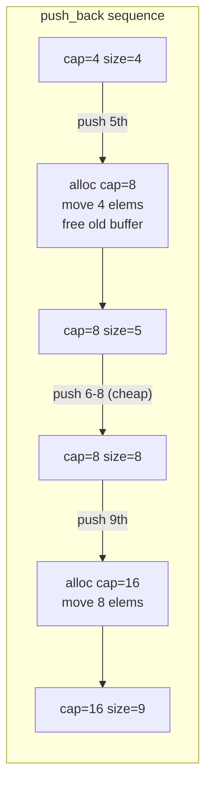
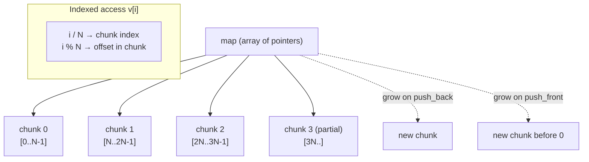
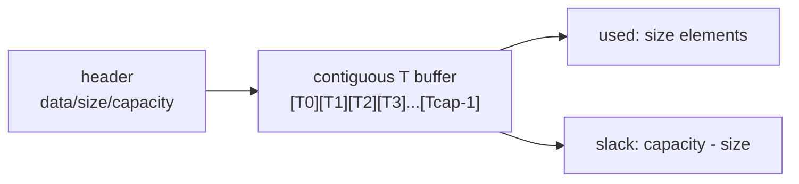
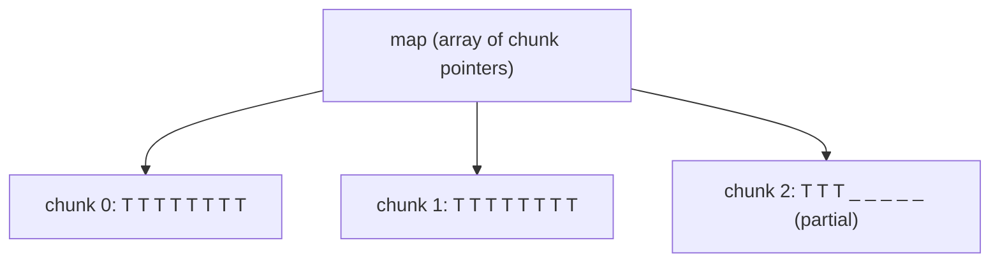

# Sequence Containers

> [!info] Chapter 11 — Note 2 of 9
> Sequence containers store elements in a linear arrangement the caller controls. See also [[1. Containers Overview]], [[3. Associative Containers]], [[4. Unordered Containers]], [[5. Container Adapters]].

## Why This Matters

Sequence containers are the workhorses of everyday C++ code — roughly 80% of all container declarations in production code are `std::vector`. Yet each of the five standard sequence containers (`array`, `vector`, `deque`, `list`, `forward_list`) was designed for a *specific* workload, and choosing the wrong one can cost you an order of magnitude in performance. A `std::list<int>` of one million elements consumes ~16 MB of heap and four cache-misses per traversal step; the same data in a `std::vector<int>` consumes 4 MB and one cache-friendly pass. Worse, the difference is invisible in micro-benchmarks on small data and only emerges under production load. This note gives you the mental model to pick correctly on the first try.

## Background

Sequence containers share a common interface (front/back access, insert/erase, iteration) but differ in:

- **Storage layout**: contiguous vs chunked vs node-based.
- **Iterator category**: random-access (array/vector/deque) vs bidirectional (list) vs forward (forward_list).
- **Invalidation semantics**: contiguously-stored containers invalidate everything on realloc; node-based containers invalidate only erased nodes.
- **Memory overhead per element**: 0 bytes (array), 0 bytes (vector beyond the buffer), 1 pointer per chunk (deque), 2 pointers (list), 1 pointer (forward_list).

The contiguous-storage containers (`array`, `vector`) win on **cache locality** — the CPU prefetcher streams adjacent bytes into L1. Node-based containers (`list`, `forward_list`) win on **stable iterators and references** and on O(1) middle insertion *when you already hold the iterator*.

## std::array — Fixed-Size, Stack-Allocated

`std::array<T, N>` is a thin wrapper over `T[N]`. It adds STL-compatible iterators, bounds-checked `at()`, `size()`, `front()`, `back()`, `fill()`, `swap()`, and tuple-like `get<>`. It has no constructors (it is an aggregate), no destructor, and no allocation overhead.

### Key Properties

- **Size is a template parameter** — known at compile time, cannot grow.
- **Stored on the stack** (or in static storage) when the array itself is a local or static variable; embedded in the containing object when a member.
- **Zero overhead** vs a raw C array — the only member is the array itself.
- **Iterators are raw pointers** (or thin wrappers) — random-access, contiguous (C++20 `contiguous_iterator`).
- **No iterator invalidation** — iterators are essentially pointers and never go invalid; element lifetime ends with the array.

### Complexity

| Operation | Cost |
|---|---|
| `operator[]` / `at()` | O(1) |
| `front()` / `back()` | O(1) |
| `begin()` / `end()` | O(1) |
| `fill()` | O(N) |
| `swap()` | O(N) (element-wise) unless `T` is trivial |
| Search via `std::find` | O(N) |

### When to Use

- Compile-time-known size.
- Stack-resident buffer needed.
- You want the safety of `at()` + `begin/end` + range-for without allocation.
- Returning a fixed-size result from a function (`std::array<double, 3>` for an RGB pixel).

### Code Example

```cpp
#include <array>
#include <algorithm>
#include <iostream>

int main() {
    std::array<int, 5> a{1, 2, 3, 4, 5};          // aggregate init
    std::array<int, 5> b{};                        // all zeros
    b.fill(42);

    // STL-compatible
    std::sort(a.begin(), a.end(), std::greater<>{});
    for (int x : a) std::cout << x << ' ';         // 5 4 3 2 1

    // Tuple-like access
    std::cout << std::get<0>(a);                   // 5
    // std::get<10>(a);                            // compile error: index out of range

    // Bounds-checked
    try { a.at(10); }                              // throws std::out_of_range
    catch (const std::out_of_range&) { /* ... */ }
}
```

## std::vector — Dynamic Array

The single most-used container in C++. Backed by a contiguous `T*` buffer with `size_` and `capacity_` fields.

### Key Properties

- **Contiguous storage** — `&v[0]` is a valid pointer to `size()` contiguous `T` objects (C++03 vector already had this guarantee; C++17 made `data()` official).
- **Random-access iterators** that are essentially `T*` — random-access, contiguous (C++20).
- **Amortized O(1) `push_back`** via geometric growth (typically doubling capacity).
- **Strong exception safety** on `push_back` — if reallocation throws, the vector is unchanged.

### Growth Strategy

When `size == capacity`, the next `push_back` allocates a new buffer of `max(1, capacity * growth_factor)` (growth_factor ≈ 2 in libstdc++/libc++, 1.5 in older MSVC), copies/moves elements, and frees the old buffer. Geometric growth gives amortized O(1) `push_back`:

```
Total cost of n pushes = n + n/2 + n/4 + ... = 2n = O(n)
Average per push       = O(1)
```



### Complexity

| Operation | Cost |
|---|---|
| `operator[]` / `at()` / `front` / `back` | O(1) |
| `push_back` | O(1) amortized, O(n) worst-case |
| `pop_back` | O(1) |
| `insert` / `erase` at position p | O(n - p) |
| `reserve(n)` | O(n) if n > capacity, else O(1) |
| `resize(n)` | O(n) |
| `clear` | O(n) (calls destructors) |

### When to Use

- **Default** for almost any sequence of values.
- Need random access by index.
- Append-heavy workloads (back insertion only).
- Need a contiguous buffer for C interop (`v.data()`).
- Need to feed elements to a C-style API.

### Code Example

```cpp
#include <vector>
#include <ranges>
#include <iostream>

int main() {
    std::vector<int> v;
    v.reserve(1'000'000);            // avoids 20+ reallocations
    for (int i = 0; i < 1'000'000; ++i) v.push_back(i);

    // Safe iteration with erase-return idiom
    for (auto it = v.begin(); it != v.end(); ) {
        if (*it % 2 == 0) it = v.erase(it);
        else              ++it;
    }

    // C++20 idiom: erase_if free function
    std::vector<int> w{1,2,3,4,5,6};
    std::erase_if(w, [](int x){ return x % 2 == 0; });

    // 2D vector
    std::vector<std::vector<int>> grid(10, std::vector<int>(10, 0));

    // Pass to C API
    extern void c_api(int* p, size_t n);
    c_api(v.data(), v.size());

    // shrink_to_fit after building
    v.shrink_to_fit();
}
```

## std::deque — Double-Ended Queue

A `deque` ("deck") provides O(1) amortized `push_front` and `push_back` plus O(1) indexed access — the only sequence container with this combination. It is implemented as a **map of fixed-size chunks** (typically 512 bytes each).

### Chunked Layout



### Key Properties

- **Random access** in O(1) — but slower than `vector` due to one extra pointer indirection.
- **O(1) amortized push/pop at both ends**.
- **References stable** across push/pop at either end (elements are not moved).
- **Iterators invalidated** by any push/pop (the `map` array may grow). This is a frequent surprise.

### Complexity

| Operation | Cost |
|---|---|
| `operator[]` / `at()` | O(1) (two hops) |
| `push_back` / `push_front` | O(1) amortized |
| `pop_back` / `pop_front` | O(1) |
| `insert` / `erase` middle | O(n) |
| Search | O(n) |

### When to Use

- Need O(1) insertion at *both* ends (sliding window, work queue).
- Need random access *and* front insertion (rare but real — e.g. undo buffers).
- Cannot tolerate iterator invalidation on `push_back` for *references* — `deque` keeps element pointers valid; `vector` does not.

### Code Example

```cpp
#include <deque>
#include <iostream>

int main() {
    std::deque<int> d;
    d.push_back(2);
    d.push_front(1);             // d = {1, 2}
    d.push_back(3);              // d = {1, 2, 3}

    int* p = &d[1];              // pointer to element '2'
    d.push_front(0);             // p still valid! iterators are not.
    std::cout << *p << '\n';     // 2

    // But:
    auto it = d.begin();
    d.push_front(-1);            // iterators invalidated
    // *it;                      // UB
}
```

## std::list — Doubly Linked List

A node-based container with bidirectional iterators. Each element lives in its own heap-allocated node holding two pointers (prev, next) plus the payload.

### Key Properties

- **O(1) insert/erase** *given an iterator* — no shifting.
- **Stable iterators and references** except to erased nodes.
- **No random access** — `v[i]` does not exist; traversal is O(n).
- **Splice** in O(1): move a range from one `list` into another without copying.
- **Higher per-element overhead**: ~16 bytes per `int` on 64-bit (8 for payload alignment + 8 for the two pointers).
- **Poor cache locality** — each node is a separate heap allocation.

### Complexity

| Operation | Cost |
|---|---|
| `front` / `back` | O(1) |
| `push_front` / `push_back` | O(1) |
| `pop_front` / `pop_back` | O(1) |
| `insert` / `erase` at iterator | O(1) |
| `splice` | O(1) |
| `size()` | O(1) since C++11 (was O(n) in C++03) |
| `sort()` member | O(n log n) |
| Search | O(n) |
| Index access | O(n) — must walk |

### When to Use

- Frequent middle insertion/erasure *when you already hold the iterator* (e.g. an LRU cache with a tracker).
- Need stable iterators/references across modifications.
- Need to **splice** ranges between lists without copying.
- Elements are very large (so per-element overhead is negligible).

> [!warning] Almost always the wrong choice
> For `int`/`double`/small PODs, `vector` beats `list` even for middle insertion because cache locality dominates. Bjarne Stroustrup's "vector vs list" lectures show `vector` winning at all sizes up to ~10,000 elements for sorted insertion. Benchmark before choosing `list`.

### Code Example

```cpp
#include <list>
#include <iostream>

int main() {
    std::list<int> a{1, 2, 3, 4, 5};
    std::list<int> b{10, 20};

    auto it = std::next(a.begin(), 2);   // points to 3
    a.splice(it, b);                      // a = {1,2,10,20,3,4,5}, b = {}

    // Stable iterators
    auto saved = a.begin();               // points to 1
    a.push_front(0);                      // saved still valid
    std::cout << *saved;                  // 1

    a.sort(std::greater<>{});
    a.unique();                            // removes consecutive duplicates
    a.reverse();
}
```

## std::forward_list — Singly Linked List

Added in C++11. A node-based container with **forward-only** iterators and one pointer per node (half the overhead of `list`). Deliberately omits `size()` to keep nodes minimal.

### Key Properties

- **O(1) `push_front` / `pop_front` / `insert_after` / `erase_after`**.
- **No `push_back`** — would be O(n) without a tail pointer, so the standard omits it to keep the data structure honest.
- **No `size()`** — computing it is O(n); the committee decided not to lie about it.
- **`before_begin()`** iterator lets you `insert_after`/`erase_after` the head.
- Forward iterators only — no `--`.

### Complexity

| Operation | Cost |
|---|---|
| `front` | O(1) |
| `push_front` / `pop_front` | O(1) |
| `insert_after` / `erase_after` | O(1) |
| `splice_after` | O(1) |
| Search | O(n) |
| `sort()` member | O(n log n) |
| `size()` via `std::distance` | O(n) |

### When to Use

- Memory-constrained environments where every byte matters (embedded).
- Need stable iterators/references with minimal overhead.
- Workload is front-loaded (push_front / pop_front only).

### Code Example

```cpp
#include <forward_list>
#include <iostream>

int main() {
    std::forward_list<int> f{1, 2, 3, 4, 5};

    f.push_front(0);                       // {0,1,2,3,4,5}
    f.insert_after(f.before_begin(), -1);  // {-1,0,1,2,3,4,5}

    // Erase after a position
    auto it = f.begin();
    f.erase_after(it);                     // removes 0 → {-1,1,2,3,4,5}

    // Walking requires forward iteration only
    for (int x : f) std::cout << x << ' ';

    // No size(): must compute
    auto n = std::distance(f.begin(), f.end());
}
```

## Comparison Table — All Five

| Property | `array` | `vector` | `deque` | `list` | `forward_list` |
|---|---|---|---|---|---|
| Size known at compile time |  |  |  |  |  |
| Random access |  |  |  |  |  |
| Iterator category | random+contig | random+contig | random | bidirectional | forward |
| `push_back` O(1) amortized | — |  |  |  |  |
| `push_front` O(1) | — |  |  |  |  |
| Middle insert/erase O(1) given iter | — |  |  |  |  (after) |
| Stable iterators |  |  | partial |  |  |
| Stable references |  |  |  |  |  |
| Contiguous memory |  |  |  |  |  |
| Per-element overhead | 0 | 0 | small | 2 ptrs | 1 ptr |
| `size()` O(1) |  |  |  |  |  |

## Memory Layout Deep Dive

The choice between contiguous and node-based storage has second-order effects beyond raw cache locality. Let's examine each layout:

### `vector` — One Big Buffer



A `vector<int>` of 4 ints is exactly 16 bytes of payload, with a header of `{ T* data; size_t size; size_t capacity; }` (typically 24 bytes on 64-bit). The header may live on the stack (if the vector is a local) or in another object; the buffer is always heap-allocated (unless empty).

### `deque` — Map of Chunks



A `deque<int>` of 20 ints with 8-element chunks needs 3 chunks. The map array can grow at either end (typically by reallocating with extra slack at the grown side). Indexed access requires two pointer dereferences: `map[i/chunk_size][i%chunk_size]`.

### `list` — Doubly Linked Nodes

Each `list<int>` element is a separate heap allocation holding `{ Node* prev; Node* next; int payload; }` — about 16 bytes per int on 64-bit, plus allocator metadata per allocation (typically 16+ bytes overhead per node). The nodes are scattered across the heap in arbitrary order; only the `prev`/`next` pointers connect them.

### `forward_list` — Singly Linked Nodes

Half the per-node overhead of `list` (one pointer instead of two) but no backward traversal. Each node holds `{ int payload; Node* next; }` — about 12 bytes per int on 64-bit, padded to 16.

## Real-World Use Cases

### `vector` — The Default
- Reading a file's contents into memory.
- Building a result set incrementally.
- Any random-access workload.
- Polymorphic collections: `vector<unique_ptr<Shape>>`.
- Numerical compute: SIMD-friendly, passes to BLAS via `data()`.

### `deque` — Work Queues
- A job queue with producer at back, consumer at front.
- Undo history (push/pop at both ends).
- Sliding-window algorithms where you need indexed access to the window.

### `list` — When You Need Stable Iterators
- LRU cache (paired with `unordered_map<K, list<K>::iterator>`).
- Memory pool with free-list.
- Subscription lists where each subscriber holds an iterator to itself for O(1) unsubscribe.

### `forward_list` — Embedded / Constrained
- Free-list allocators (one pointer overhead).
- Lock-free queues (intrusive singly-linked).
- Embedded systems with tight memory budgets.

### `array` — Fixed-Size, Stack-Resident
- Mathematical vectors (`array<double, 3>` for 3D points).
- Lookup tables compiled at compile time.
- Return values where the size is part of the contract.

## The Erase-Remove Idiom — Why It Exists

`std::remove` does not (and cannot) erase from a container, because it only sees iterators, not the container itself. The algorithm rearranges the range so that all "kept" elements are at the front, then returns an iterator to the new logical end. The "removed" elements (now past the new end) are still there; you must call `container.erase(new_end, end)` to actually shrink.

```cpp
std::vector<int> v{1, 2, 3, 4, 5, 6};
auto new_end = std::remove_if(v.begin(), v.end(),
                              [](int x){ return x % 2 == 0; });
v.erase(new_end, v.end());  // v = {1, 3, 5}
```

This two-step dance is so common that C++20 introduced `std::erase_if(v, pred)` as a uniform free function across `vector`, `deque`, `list`, `forward_list`, `set`, `map`, `unordered_*`.

## Exception Safety in Sequence Containers

| Operation | Guarantee |
|---|---|
| `vector::push_back` (copyable T) | Strong (rollback on throw) |
| `vector::push_back` (movable T) | Strong if move is no-throw, else Basic |
| `vector::emplace_back` | Basic (constructed in-place; cannot roll back) |
| `vector::insert` middle | Basic (or Strong via copy-and-swap) |
| `list::insert` | Strong |
| `deque::push_front/back` | Strong (if move is no-throw) |
| `forward_list::insert_after` | Strong |

To make `emplace_back` strong-guarantee, first construct the element locally, then `push_back(std::move(elem))` — but this only helps if the move is no-throw (mark it `noexcept`).

## Common Pitfalls

- **Using `list` "for fast middle insertion" without benchmarking.** Almost always loses to `vector` due to cache effects.
- **Forgetting `reserve`** for known-size vector build-up — turns O(n) into O(n log n).
- **Caching `vector` iterators across mutations** — invalidates silently.
- **Calling `deque::push_back` and then dereferencing an old iterator** — iterators are invalidated even though references are not.
- **Expecting `forward_list::size()`** — it does not exist; use `std::distance`.
- **`insert_after`/`erase_after` instead of `insert`/`erase`** in `forward_list` — only the `_after` variants exist; trying to insert *before* a node is O(n).
- **`vector<bool>`** is a template specialization that packs bits — it is **not** a container in the formal sense (`operator[]` returns a proxy, not `bool&`). Prefer `std::vector<char>` or `std::bitset` if you need a real container of bools.
- **Splicing a node into a list of the wrong allocator type** — splice requires identical allocators (or `propagate_on_container_swap`).

## Tips and Tricks

- **`reserve` + `resize`**: `reserve` changes capacity (no element construction); `resize` changes size (default-constructs extras).
- **`emplace_back` over `push_back`** for non-trivial types to avoid a temporary.
- **`shrink_to_fit`** is non-binding but every major implementation honors it.
- **`vector::assign(n, v)`** replaces contents in one call — cleaner than `clear` + `resize` + `fill`.
- **`vector::insert` with iterator range** can move-construct if the source is an rvalue range (use `std::make_move_iterator`).
- **`list::remove` / `remove_if`** are member functions (not `std::remove` + `erase`) because the standard `remove` algorithm cannot actually erase from a list — the member versions do.
- **`list::sort` is a member** (not `std::sort`) because `std::sort` requires random access — list's is typically a merge sort.
- **`std::erase` / `std::erase_if` for `vector`/`deque`/`list`/`forward_list`** (C++20) — uniform free functions for the erase-remove idiom.
- **`std::span<const T>`** is the right "borrow a vector" parameter type — see [[../3. Strings and Character Data/3. string_view and Modern String Handling]] for the analogous string case.
- **`vector` of `unique_ptr`** gives you polymorphic storage with automatic cleanup — but loses cache locality; consider `std::variant` + SoA layouts for hot paths.

## Active Recall

1. Why is `std::array` "zero overhead" compared to a raw C array?
2. Explain the **amortized O(1)** argument for `vector::push_back` with geometric growth.
3. What is the default growth factor in libstdc++/libc++? What is the trade-off of 1.5 vs 2?
4. List three operations that invalidate `vector` iterators.
5. Why does `deque::push_front` invalidate iterators but not references?
6. Give two reasons `list` is usually the wrong choice for `int` data.
7. Why does `forward_list` not have `size()` or `push_back`?
8. How do you erase all even elements from a `vector` in C++20?
9. What is the erase-return idiom and why is it needed for `vector::erase` in a loop?
10. What does `vector::splice` do? (Trick question — it doesn't exist; explain why.)
11. Why does `std::list` have its own `sort` member instead of using `std::sort`?
12. What is `vector<bool>` and why is it not a real container?
13. When is `deque` the correct choice over `vector`?
14. Compare per-element overhead across the five sequence containers.

## Next Steps

- Continue with [[3. Associative Containers]] for sorted-key containers.
- Read [[4. Unordered Containers]] for hash-based alternatives.
- Read [[6. Iterators]] to understand iterator categories each container exposes.
- For allocator-aware sequences: [[../7. Memory Management/7. Custom Allocators]].
- For the algorithm side: [[7. Algorithms]].
