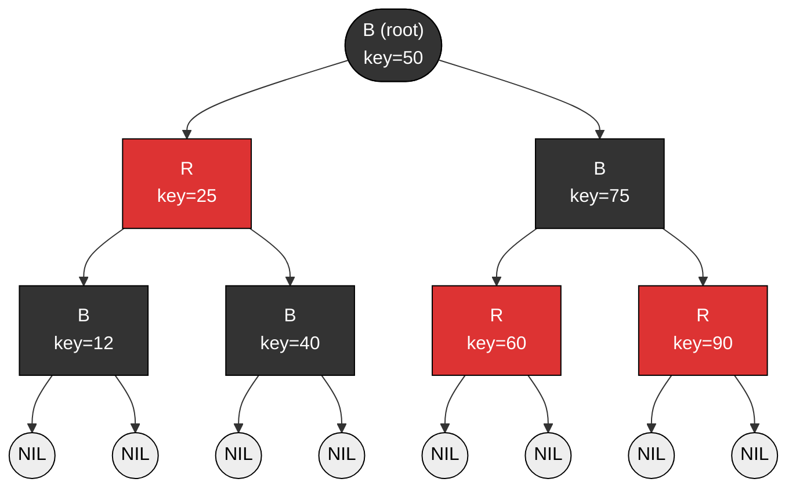
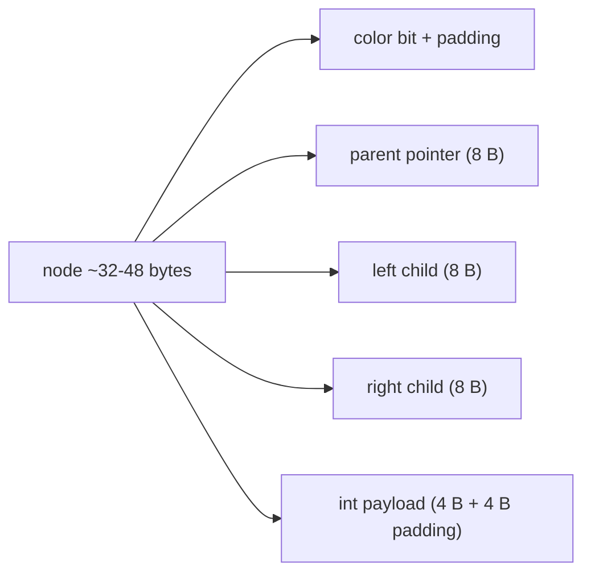

# Associative Containers

> [!info] Chapter 11 — Note 3 of 9
> Sorted-key containers built on balanced trees. See also [[1. Containers Overview]], [[2. Sequence Containers]], [[4. Unordered Containers]], [[9. Function Objects and Binders]].

## Why This Matters

Associative containers — `set`, `multiset`, `map`, `multimap` — are the C++ answer to "I need a collection keyed by something, and I need it sorted." They give you **O(log n) lookup, insertion, and erasure** with **sorted iteration** out of the box, plus **stable iterators** that survive nearly every mutation. Whenever you reach for "I'll just keep a sorted vector and binary-search it," consider whether `std::set` or `std::map` expresses the intent more clearly — and whether you need C++23's `std::flat_map` instead.

The deep advantage of associative containers over the unordered (hash) alternatives is **determinism**: the iteration order is fully determined by the comparison function, never perturbed by rehashing, and immune to algorithmic-complexity attacks against a hash function. The deep disadvantage is the per-element allocation cost (each node is a heap object) and the O(log n) floor that no amount of caching can break.

## Background

The standard associative containers are **always** implemented as **red-black trees** in practice. The standard does not mandate this — it mandates O(log n) bounds and stable iteration — but every major implementation (libstdc++, libc++, MSVC) uses red-black trees because they offer:

- O(log n) worst-case for search, insert, erase (not just amortized).
- O(1) recoloring + at most one rotation on insert.
- O(1) recoloring + at most three rotations on erase.
- Simple in-order traversal yields sorted order.

Alternative balanced trees (AVL, weight-balanced, scapegoat, treap) were considered but red-black trees won on the basis of insertion/erasure simplicity.

The four containers come in two axes:

|  | Unique keys | Duplicate keys allowed |
|---|---|---|
| **Set** (no value, key only) | `std::set<K>` | `std::multiset<K>` |
| **Map** (key → value) | `std::map<K, V>` | `std::multimap<K, V>` |

All four live in `<set>` and `<map>` respectively, and share a near-identical interface.

## Red-Black Tree Internals

A red-black tree is a binary search tree with one extra color bit per node and five invariants:

1. Every node is either **red** or **black**.
2. The root is **black**.
3. Every **null leaf** is considered black.
4. A red node has **no red children** (no two reds in a row on any root-to-leaf path).
5. Every path from a node down to a null leaf contains the **same number of black nodes** (the "black-height").

These invariants guarantee the tree's height is at most `2 log₂(n + 1)`, which bounds every operation to O(log n).



### In-Order Traversal Yields Sorted Output

Visiting left subtree → node → right subtree produces keys in ascending order. This is what makes `for (auto& [k, v] : my_map)` iterate in sorted order "for free."

### Node Structure (typical libstdc++ layout)

Each `std::map<K, V>` node holds:
- A color bit.
- Parent, left child, right child pointers (3 × 8 = 24 bytes).
- The `std::pair<const K, V>` payload.

Total: ~32 bytes + payload, all heap-allocated.

## The Four Containers

### std::set / std::multiset

Stores **keys only**. `set` rejects duplicates; `multiset` accepts them.

```cpp
std::set<int> s{3, 1, 4, 1, 5, 9, 2, 6};
// s contains: {1, 2, 3, 4, 5, 6, 9} (sorted, dupes removed)

std::multiset<int> ms{3, 1, 4, 1, 5, 9, 2, 6};
// ms contains: {1, 1, 2, 3, 4, 5, 6, 9} (sorted, dupes kept)
```

### std::map / std::multimap

Stores **key→value pairs**. `map` enforces unique keys; `multimap` allows multiple values per key. `map::operator[]` returns a reference to the value, default-constructing one if the key is absent — a powerful but easy-to-misuse feature.

```cpp
std::map<std::string, int> ages;
ages["Alice"]   = 30;   // inserts {Alice, 30}
ages["Bob"]     = 25;
ages["Alice"]   = 31;   // updates existing

std::multimap<std::string, std::string> phonebook;
phonebook.insert({"Alice", "555-1000"});
phonebook.insert({"Alice", "555-2000"});  // OK — multimap
auto [begin, end] = phonebook.equal_range("Alice");
for (auto it = begin; it != end; ++it) std::cout << it->second << '\n';
```

## Common Interface

Every associative container exposes:

- `find(k)` — iterator to the matching element or `end()`.
- `count(k)` — number of matching elements (0 or 1 for `set`/`map`; ≥ 0 for `multi*`).
- `contains(k)` (C++20) — boolean.
- `lower_bound(k)` — first element ≥ k.
- `upper_bound(k)` — first element > k.
- `equal_range(k)` — `pair{lower_bound, upper_bound}`.
- `insert(value)`, `insert(first, last)`, `insert(ilist)`.
- `emplace(args...)` — construct in place.
- `erase(k)` (size-based), `erase(it)` (returns next iterator), `erase(first, last)`.
- `clear()`.
- `extract` (C++17) — unlinks a node without freeing; returns a **node handle**.
- `merge(other)` (C++17) — splices nodes from another container of the same type.
- `key_comp()` / `value_comp()` — access the comparator.

## Complexity

| Operation | Cost |
|---|---|
| `find` / `count` / `contains` | O(log n) |
| `insert` single | O(log n) |
| `insert` hint | O(log n) worst, O(1) amortized if hint is correct |
| `emplace` | O(log n) |
| `erase` single | O(log n) |
| `erase` range | O(log n + size of range) |
| `lower_bound` / `upper_bound` / `equal_range` | O(log n) |
| Iteration (`begin → end`) | O(n) in sorted order |
| `extract` / `merge` | O(log n) for extract, O(n log n) for merge |

## Comparison: Associative vs Unordered

| Property | `set`/`map` | `unordered_set`/`unordered_map` |
|---|---|---|
| Lookup | O(log n) | O(1) avg, O(n) worst |
| Insert | O(log n) | O(1) avg |
| Erase | O(log n) | O(1) avg |
| Iteration order | Sorted | Unspecified, may change on rehash |
| Memory per element | ~32B + payload (node) | ~32B + payload (bucket entry + node) |
| Stable iterators across insert | Yes | No (rehash invalidates) |
| Hash function needed | No | Yes |
| Comparator needed | Yes (`less<K>` default) | No (`equal_to<K>` default for equality) |
| Resistant to hostile input | Yes | Only with secure hash + salting |
| Use case | Need sorted order, range queries, prefix queries | Need raw lookup speed, don't care about order |

## Code Examples

### Basic set / map usage

```cpp
#include <set>
#include <map>
#include <string>
#include <iostream>

int main() {
    std::set<std::string> dict{"apple", "banana", "cherry"};
    auto [it, inserted] = dict.insert("apple");      // inserted == false
    std::cout << inserted << ' ' << *it << '\n';     // 0 apple

    // Range queries via lower/upper bound
    for (auto it = dict.lower_bound("a"); it != dict.upper_bound("c"); ++it)
        std::cout << *it << '\n';

    // C++20 contains
    if (dict.contains("banana")) std::cout << "yes\n";

    std::map<std::string, int> freq;
    for (char c : std::string{"hello world"})
        ++freq[std::string{c}];   // operator[] default-constructs int = 0, then ++

    // Structured bindings (C++17) — sorted iteration
    for (const auto& [k, v] : freq)
        std::cout << k << ':' << v << ' ';
}
```

### Custom comparator

```cpp
struct CaseInsensitive {
    bool operator()(std::string_view a, std::string_view b) const noexcept {
        return std::lexicographical_compare(
            a.begin(), a.end(), b.begin(), b.end(),
            [](char x, char y){ return std::tolower(x) < std::tolower(y); });
    }
};
std::set<std::string, CaseInsensitive> ci_set{"Hello", "world", "HELLO"};
// ci_set.size() == 2 (Hello and HELLO are equal under CaseInsensitive)
```

### extract + modify + reinsert (safe key mutation)

```cpp
std::map<int, std::string> m{{1, "one"}, {2, "two"}, {3, "three"}};
auto node = m.extract(2);          // unlinks {2, "two"}
node.key() = 20;                    // mutate key — only safe via extract
m.insert(std::move(node));          // re-insert as {20, "two"}
```

### merge between containers

```cpp
std::set<int> a{1, 2, 3};
std::set<int> b{3, 4, 5};
a.merge(b);                          // a = {1,2,3,4,5}, b = {3} (dup not moved)
```

### Hinted insert

```cpp
std::set<int> s;
auto last = s.end();
for (int x : {1, 2, 3, 4, 5}) {
    last = s.insert(last, x);   // correct hint → amortized O(1) per insert
}
```

## Multimap — Multiple Values Per Key

`multimap` has **no `operator[]`** (because it would be ambiguous). Use `equal_range`:

```cpp
std::multimap<std::string, int> scores;
scores.insert({"Alice", 90});
scores.insert({"Alice", 85});
scores.insert({"Bob", 70});

auto [b, e] = scores.equal_range("Alice");
for (auto it = b; it != e; ++it)
    std::cout << it->first << ": " << it->second << '\n';
```

## Use Case Patterns

### Frequency Counter

`std::map<K, int>` (or `std::unordered_map`) is the canonical frequency counter:

```cpp
std::map<std::string, int> freq;
for (const auto& word : tokens) ++freq[word];
```

Use `map` if you need alphabetical output; use `unordered_map` if you need raw speed and don't care about order.

### Autocomplete / Prefix Query

A `std::set<std::string>` (or `std::map`) supports prefix queries via `lower_bound`:

```cpp
std::set<std::string> dict{/* ... */};
auto lo = dict.lower_bound(prefix);
for (auto it = lo; it != dict.end() && it->compare(0, prefix.size(), prefix) == 0; ++it)
    std::cout << *it << '\n';
```

This is O(log n + k) where k is the number of matches — sub-linear in the dictionary. For deeper prefix queries, a `trie` is better, but `set` is often good enough.

### Interval Map

A `std::map<boundary, value>` with `lower_bound` queries gives an interval map: "find the value for any point by finding the greatest key ≤ point."

```cpp
std::map<int, std::string> timezone_offset{
    {-12, "Baker"}, {-11, "Samoa"}, {-10, "Hawaii"}, /* ... */ {14, "Line"}
};
auto it = timezone_offset.lower_bound(query_offset);
if (it != timezone_offset.begin()) --it;  // step back to the matching interval
std::cout << it->second;
```

### Tagged Multimap — Inverted Index

`std::multimap<word, doc_id>` is an inverted index for full-text search:

```cpp
std::multimap<std::string, int> index;
for (const auto& [doc_id, text] : corpus)
    for (const auto& word : tokenize(text))
        index.emplace(word, doc_id);

// Query
auto [b, e] = index.equal_range("cat");
for (auto it = b; it != e; ++it) std::cout << it->second << '\n';
```

### Stable Handles via Iterators

If clients need a stable handle to a stored element, `std::set<T>`/`std::map<K, V>` are ideal because their iterators are stable across insert. Clients can hold a `std::set<T>::iterator` indefinitely.

## Red-Black Tree — Why It Wins

Several balanced BSTs exist (AVL, weight-balanced, scapegoat, treap, skip-list). The standard does not mandate a particular implementation, but every major STL vendor uses **red-black trees**. Why?

| Tree | Insert rotations | Erase rotations | Lookup balance | Implementation complexity |
|---|---|---|---|---|
| AVL | ≤ 2 | ≤ 2 | Strictest (best lookup) | High |
| Red-black | ≤ 2 | ≤ 3 | Looser than AVL | Moderate |
| Weight-balanced | O(log n) | O(log n) | Moderate | Moderate |
| Scapegoat | 0 amortized | 0 | Rebuilds on threshold | Low |
| Treap | Expected O(1) | Expected O(1) | Random | Low |

Red-black trees hit the sweet spot: O(log n) worst-case, ≤ 3 rotations per operation (so erase is cheap), and the recoloring logic is manageable. AVL trees give slightly tighter balance (height ≤ 1.44 log n vs ≤ 2 log n for red-black), so lookups are marginally faster — but insertion/erasure is more expensive due to more rotations. For the STL's workload (mixed insert/erase/lookup), red-black wins.

## Memory Layout Per Node

A `std::set<int>` node in libstdc++ has the following layout (64-bit):



For 1 million ints, that's ~32 MB of node storage plus allocator overhead (typically 16 bytes per allocation) = ~48 MB total — vs ~4 MB for `std::vector<int>`. This 12× memory blow-up is the price of O(log n) operations + stable iterators + sorted iteration.

## Benchmark — When to Pay the Tree Tax

Rule of thumb benchmarks on a modern desktop for `int` keys:

| n | `vector<int>` find | `set<int>` find | `unordered_set<int>` find |
|---|---|---|---|
| 100 | ~50 ns | ~30 ns | ~20 ns |
| 10,000 | ~500 ns (linear) | ~70 ns | ~30 ns |
| 1,000,000 | ~50 µs (linear) | ~120 ns | ~50 ns |
| 1,000,000 (sorted vector + binary_search) | ~100 ns | ~120 ns | ~50 ns |

For read-heavy workloads with infrequent mutation, a **sorted `vector` + `std::lower_bound`** beats both `set` and `unordered_set` due to cache locality. C++23's `std::flat_map` codifies this idiom — see [[1. Containers Overview]].

## Allocator-Aware Containers

Every standard container is an **allocator-aware container**: it takes an `Allocator` template parameter (default `std::allocator<T>`) and uses it for all internal allocations. This enables:

- **Short-string optimization (SSO)**: `std::string` is technically not in `<allocator>` but uses an allocator for its heap allocations.
- **Polymorphic memory resources** (`std::pmr`): `std::pmr::vector<int>` uses a `std::pmr::memory_resource*` selected at runtime. Switch resources to swap between arena, pool, monotonic, and default allocators — see [[../7. Memory Management/7. Custom Allocators]].
- **Custom per-instance allocators**: useful for embedded systems or NUMA-aware code.

## Polymorphic Memory Resources (C++17)

`std::pmr` provides four resource types:

| Resource | Behavior |
|---|---|
| `std::pmr::monotonic_buffer_resource` | Bump-allocator; never frees until destroyed; fastest |
| `std::pmr::synchronized_pool_resource` | Thread-safe pool of fixed-size chunks |
| `std::pmr::unsynchronized_pool_resource` | Single-thread pool |
| `std::pmr::null_memory_resource` | Always throws on allocate (useful for testing) |

Example: build a vector using an arena, then let the arena go:

```cpp
std::pmr::monotonic_buffer_resource arena{1024 * 1024};  // 1 MB
std::pmr::vector<int> v{&arena};
for (int i = 0; i < 100'000; ++i) v.push_back(i);
// All allocations come from the arena — no per-element heap calls
```

## Working with Heterogeneous Lookup (C++14 Transparent Comparators)

If you have `std::set<std::string, std::less<>>` (note the `<>` — transparent), you can look up by any type whose comparison with `std::string` is defined, without constructing a temporary `std::string`:

```cpp
std::set<std::string, std::less<>> dict{/* ... */};

// Lookup with string_view — no allocation!
std::string_view key = "hello";
if (dict.contains(key)) { /* ... */ }

// Lookup with const char*
if (dict.contains("world")) { /* ... */ }
```

This is a 2×–10× speed-up for short-string lookups because it eliminates the `std::string` constructor's allocation. The same trick works for `std::map`, `std::unordered_map` (with a transparent hash — `std::hash<std::string>` and friends are transparent since C++14/C++20).

## Common Pitfalls

- **Modifying a key in-place in a `set`/`map`.** This breaks the tree invariant. Use `extract` + modify + `insert` (C++17) instead. For `map`, only the **value** is mutable through the iterator (`it->second = ...`); the key is `const`.
- **Using `operator[]` carelessly on `map`.** It **inserts a default value** if the key is missing — silent bug if you only intended to read. Use `find` or `contains` for read-only access.
- **Expecting `multimap::operator[]`.** It does not exist; use `equal_range`.
- **Storing iterators past an erase.** Use the erase-return idiom: `it = c.erase(it);` (C++11+).
- **Forgetting the comparator type in the template parameter** — `std::set<K, Comp>` requires `Comp` as a type and an instance in the constructor if it has state.
- **Assuming `lower_bound(k)` returns a matching element** — it returns the first element **≥ k**, which may be strictly greater.
- **Trusting hint to make insert O(1)** — only correct hints (just *before* the new element's position) help; incorrect hints are O(log n).
- **Using `set<pair<int,int>>` for a sparse 2D grid** — better to use `map<int, map<int, T>>` or `unordered_map` for performance; or `vector<vector<T>>` if the grid is dense.
- **Comparing `unordered_map` and `map` purely on lookup speed** — `map`'s sorted iteration and `lower_bound`/`upper_bound` are major features, not footnotes.

## Tips and Tricks

- **`std::map<K, V>` is essentially a sorted `std::vector<std::pair<const K, V>>` with O(log n) ops** — but with per-node overhead. If you only do lookups and rarely mutate, prefer `std::flat_map` (C++23) which uses contiguous storage.
- **`extract` enables a unique style of mutation**: unlink, modify key, reinsert — without copies.
- **`merge`** is the O(n) way to union two sorted associative containers with **no copies** — only pointer splices.
- **Custom comparators should be `std::function`-free** for performance — a function pointer or stateless functor inlines; `std::function` does not.
- **`transparent comparators` (C++14)**: specialize `std::less<void>` to allow heterogeneous lookup, e.g. `set<std::string, std::less<>>` lets you `find("literal"sv)` without allocating a `std::string`.
- **`try_emplace` (C++11)** does not construct the value if the key already exists — critical when the value is non-default-constructible or expensive.
- **`insert_or_assign` (C++17)** is `operator[]` with an `inserted` bool return — use when you need to know if a new element was added.
- **`contains` (C++20)** is shorter and clearer than `find(k) != end()`.
- **`equal_range` for `set`/`map`** with unique keys returns either an empty range or a single-element range — useful for template code that works on both unique and multi containers.
- **For prefix queries** (autocomplete), use `lower_bound(prefix)` and iterate while `it->first` starts with `prefix`. This is O(log n + matches).
- **For range queries** `[lo, hi)` use `equal_range({lo}, {hi})` semantics — or just walk from `lower_bound(lo)` to `lower_bound(hi)`.

## Active Recall

1. Which balanced tree does every major implementation use for `std::set`/`std::map`?
2. State the five red-black tree invariants.
3. Why is the height of a red-black tree bounded by `2 log₂(n+1)`?
4. Why does `std::map::operator[]` insert on missing key, and what default value does it use?
5. How do you safely modify a key inside a `std::set` without breaking the tree invariant?
6. What is `merge` for associative containers, and what is its complexity?
7. Give two operations `multimap` lacks that `map` has, and explain why.
8. What does `lower_bound(k)` return for a key not in the container?
9. Why is `try_emplace` preferable to `operator[]` for non-default-constructible values?
10. What is a **transparent comparator** (`std::less<>`) and what problem does it solve?
11. When does `insert(hint, value)` achieve amortized O(1)?
12. Compare `std::map` and `std::flat_map` (C++23) on three axes.
13. Why are associative-container iterators stable across insert? Across erase?
14. Give two scenarios where `map` beats `unordered_map` despite the O(log n) floor.

## Next Steps

- Continue with [[4. Unordered Containers]] for the hash-based counterpart.
- Read [[5. Container Adapters]] for LIFO/FIFO/priority wrappers.
- Read [[9. Function Objects and Binders]] for comparator mechanics.
- Read [[8. Ranges (C++20)]] for composable range-based queries.
- For move semantics used by `extract`/`merge`: [[../8. Modern C++]].
