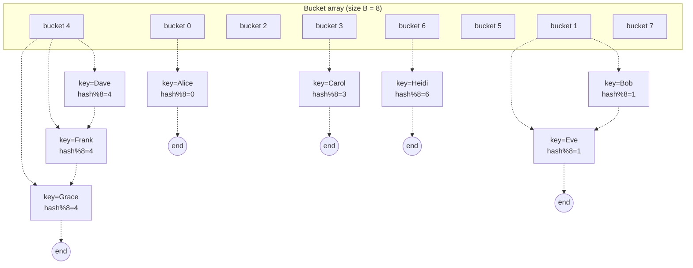

# Unordered Containers

> [!info] Chapter 11 — Note 4 of 9
> Hash-table containers added in C++11. See also [[1. Containers Overview]], [[3. Associative Containers]], [[5. Container Adapters]].

## Why This Matters

Unordered containers — `unordered_set`, `unordered_multiset`, `unordered_map`, `unordered_multimap` — give you **average O(1) lookup, insertion, and erasure**, which is asymptotically faster than the O(log n) of `std::set`/`std::map`. For typical workloads with hundreds of thousands of keys, this is a 5×–20× speed-up. The trade-off is the **worst case**: a hostile input or a poor hash function degrades operations to **O(n)**, and there is no sorted iteration. The two failure modes (silent slowdowns on hostile data, missing ordering) make unordered containers a sharp tool — they cut fast but they cut both ways. This note shows you how to wield them safely: choose the right hash, size buckets correctly, recognize rehashing, and know when to fall back to the ordered alternative.

## Background

The C++11 standard introduced the four unordered containers in `<unordered_set>` and `<unordered_map>`. They are conceptually similar to `std::set` and `std::map` (same key/value model, same `multi*` variants) but the underlying data structure is a **hash table with separate chaining** rather than a balanced tree.

Three template parameters control behavior:

```cpp
template <
    class Key,
    class Hash          = std::hash<Key>,
    class KeyEqual      = std::equal_to<Key>,
    class Allocator     = std::allocator<Key>
> class unordered_set;
```

- **Hash** — function object computing `std::size_t` from a key.
- **KeyEqual** — function object comparing two keys for equality (defaults to `operator==`).
- **Allocator** — node allocator.

The standard library provides `std::hash` specializations for all arithmetic types, pointers, `std::string`, `std::wstring`, `std::string_view`, `std::thread::id`, and (C++17+) `std::variant`/`std::optional`. For your own types, you must specialize `std::hash` (or pass a custom `Hash` template argument).

## Hash Table Internals — Separate Chaining

The standard requires **separate chaining** (a.k.a. open hashing with linked lists per bucket) rather than open addressing (linear probing). Each bucket is a singly linked list of nodes whose keys hash to that bucket index.



### Key Operations

- **Insert**: compute `bucket = hash(key) % bucket_count()`, walk the chain, append if absent. Average O(1) when load factor is small.
- **Find**: compute bucket, walk chain comparing with `KeyEqual`. Average O(1 + load_factor).
- **Erase**: same as find, then unlink the node.
- **Rehash**: when `size > max_load_factor * bucket_count`, allocate a new larger bucket array (typically doubled) and re-place every node. **O(n)** but amortized over many inserts.

### Load Factor

```
load_factor     = size() / bucket_count()
max_load_factor = threshold above which rehash triggers (default 1.0)
```

You can tune `max_load_factor` (e.g., set to 0.5 to trade memory for speed). You can also call `reserve(n)` to pre-bucket for `n` elements, and `recount(n)` to set the bucket count directly.

## The Four Containers

### std::unordered_set / unordered_multiset

Stores keys only. `unordered_set` rejects duplicates; `unordered_multiset` keeps them.

```cpp
std::unordered_set<int> s{1, 2, 3, 2, 1};
// s.size() == 3 (dupes removed)
std::unordered_multiset<int> ms{1, 2, 3, 2, 1};
// ms.size() == 5
```

### std::unordered_map / unordered_multimap

Key→value with hashing.

```cpp
std::unordered_map<std::string, int> ages{{"Alice", 30}, {"Bob", 25}};
ages["Carol"] = 40;       // operator[] works like map's

std::unordered_multimap<std::string, std::string> phonebook;
phonebook.insert({"Alice", "555-1000"});
phonebook.insert({"Alice", "555-2000"});
auto [b, e] = phonebook.equal_range("Alice");
for (auto it = b; it != e; ++it) std::cout << it->second << '\n';
```

## Common Interface (differences from associative containers)

Unordered containers share most of the associative-container interface (`find`, `count`, `contains`, `insert`, `emplace`, `erase`, `extract`, `merge`, `equal_range`) but **drop** `lower_bound` and `upper_bound` (no ordering) and **add** bucket-inspection API:

- `bucket_count()` — current number of buckets.
- `max_bucket_count()` — implementation limit.
- `bucket_size(n)` — number of elements in bucket n.
- `bucket(key)` — which bucket would hold `key`.
- `local_begin(n)` / `local_end(n)` — iterators within bucket n.
- `load_factor()` / `max_load_factor()` / `max_load_factor(f)`.
- `rehash(n)` — set bucket count to ≥ n.
- `reserve(n)` — set bucket count sufficient for n elements at current `max_load_factor`.

## Complexity

| Operation | Average | Worst case |
|---|---|---|
| `find` / `count` / `contains` | O(1) | O(n) |
| `insert` single | O(1) | O(n) |
| `erase` single | O(1) | O(n) |
| `equal_range` | O(1 + matches) average | O(n) |
| `rehash` | O(n) | O(n) |
| `reserve(n)` | O(n) | O(n) |
| Iteration (`begin → end`) | O(n) (order unspecified) | O(n) |
| `extract` / `merge` | O(1) / O(n) average | O(n) |

## Custom Hash Function

For a user-defined type, provide either a `std::hash` specialization or a custom `Hash` template argument:

```cpp
struct Point {
    int x, y;
    bool operator==(const Point& o) const noexcept { return x == o.x && y == o.y; }
};

// Option 1: specialize std::hash
namespace std {
    template<> struct hash<Point> {
        size_t operator()(const Point& p) const noexcept {
            // Boost-style hash_combine
            size_t h = std::hash<int>{}(p.x);
            h ^= std::hash<int>{}(p.y) + 0x9e3779b9 + (h << 6) + (h >> 2);
            return h;
        }
    };
}
std::unordered_set<Point> pts;

// Option 2: custom Hash functor
struct PointHash {
    size_t operator()(const Point& p) const noexcept {
        return std::hash<long long>{}((long long(p.x) << 32) | unsigned(p.y));
    }
};
std::unordered_set<Point, PointHash> pts2;
```

> [!tip] Boost's `hash_combine` magic constant
> `0x9e3779b9` is the fractional part of the golden ratio `(√5 - 1) / 2`, expressed as a 32-bit fixed-point. It produces well-distributed bit mixing when XORed with shifted hashes. Use it (or the simpler `hash ^= other_hash + 0x9e3779b9 + (h<<6) + (h>>2)`) when combining field hashes.

## Worst-Case O(n) — The Hash Collision Trap

A bad hash function (e.g., always returning 0) forces every element into a single bucket, degrading all operations to O(n). Worse, an **adversary who knows your hash function** can craft inputs that all collide — a **hash-flooding DoS attack**. This was a famous problem for PHP, Python, and Java web servers in the 2000s: an attacker sent a JSON payload with many colliding keys and turned a 1 ms parse into a 30 s CPU burn.

Mitigations:

1. **Use a randomized/salted hash** per process. C++ standard `std::hash<int>` is **not** randomized by default — it's the identity function. libstdc++ provides `__gnu_cxx::hash<int>` and an optional `-frandomize-layout` style salted hash in newer versions.
2. **Use `std::unordered_map` only for trusted input**. For untrusted input, either use a randomized hash (Boost.HashCombine with a per-process random salt) or fall back to `std::map` (which has guaranteed O(log n) and is immune to this attack).
3. **Limit the number of distinct keys** at the application layer.

## Performance: Unordered vs Ordered

| Scenario | Winner |
|---|---|
| Integer key, point lookups, hot loop | `unordered_map` (~2×-5× faster) |
| String key, point lookups | `unordered_map` (but `std::hash<std::string>` is non-trivial) |
| Need sorted iteration / range queries | `map` (only option) |
| Need prefix queries (autocomplete) | `map` (lower_bound) |
| Adversarial / untrusted input | `map` (deterministic) |
| Tiny container (< 20 elements) | `vector<pair<K,V>>` + linear search |
| Memory-constrained | `flat_map` (C++23) or `vector` |
| Need stable iteration order | `map` |

## Code Example — A Real Use Case

```cpp
#include <unordered_map>
#include <string>
#include <iostream>
#include <fstream>

int main() {
    std::unordered_map<std::string, int> word_count;
    word_count.reserve(50'000);                 // avoid rehashes during build-up
    word_count.max_load_factor(0.7f);           // trade 30% memory for fewer collisions

    std::ifstream in{"input.txt"};
    std::string word;
    while (in >> word) ++word_count[word];       // operator[] default-constructs int = 0

    // Iteration order is unspecified — do not depend on it
    for (const auto& [w, n] : word_count)
        std::cout << w << ": " << n << '\n';

    // Top-10 by count: copy to vector and sort
    std::vector<std::pair<std::string, int>> top{
        word_count.begin(), word_count.end()
    };
    std::ranges::sort(top, [](auto& a, auto& b){ return a.second > b.second; });
    for (size_t i = 0; i < 10 && i < top.size(); ++i)
        std::cout << top[i].first << " = " << top[i].second << '\n';

    // Bucket inspection (debugging)
    std::cout << "buckets=" << word_count.bucket_count()
              << " load_factor=" << word_count.load_factor()
              << " max_load_factor=" << word_count.max_load_factor() << '\n';
}
```

## Custom Type with Custom Hash and Equality

```cpp
struct Employee {
    int id;
    std::string name;
    bool operator==(const Employee& o) const noexcept { return id == o.id; }
};

struct EmployeeHash {
    size_t operator()(const Employee& e) const noexcept {
        return std::hash<int>{}(e.id);          // hash by id only
    }
};

std::unordered_set<Employee, EmployeeHash> emps;
emps.insert(Employee{42, "Alice"});
emps.insert(Employee{42, "Alice 2"});   // rejected — same id, equality says equal
```

## Hash Function Design — A Deep Dive

A good hash function has four properties:

1. **Deterministic**: same input → same output, always.
2. **Uniform**: outputs distributed uniformly across the output space.
3. **Avalanche**: a 1-bit change in input changes ~50% of output bits.
4. **Fast**: hashing should be O(1) and ideally branch-free.

The standard `std::hash<int>` is the **identity function** — property (1) yes, (4) yes, but (2) and (3) only when the input distribution is uniform. For sequential integers, `hash(i) = i` is fine — buckets distribute well. For pathologically clustered keys (e.g., multiples of 8 with bucket count 8), it's catastrophic.

### Hashing Composite Types

For a `struct Person { std::string name; int age; std::string city; }`, combine field hashes with `hash_combine`:

```cpp
struct PersonHash {
    size_t operator()(const Person& p) const noexcept {
        size_t h = std::hash<std::string>{}(p.name);
        h ^= std::hash<int>{}(p.age)     + 0x9e3779b9 + (h << 6) + (h >> 2);
        h ^= std::hash<std::string>{}(p.city) + 0x9e3779b9 + (h << 6) + (h >> 2);
        return h;
    }
};
```

Order matters — different order produces different hashes (so `(name, age)` and `(age, name)` get distinct hashes, which is usually what you want).

### Hashing Floating-Point

`std::hash<double>` typically hashes the bit pattern, so `+0.0` and `-0.0` produce different hashes (they have different sign bits) but compare equal with `operator==`. If you want them treated as equal, your `KeyEqual` must handle the sign, or you normalize the input.

### Hashing Smart Pointers

`std::hash<unique_ptr<T>>` and `std::hash<shared_ptr<T>>` hash the **pointer**, not the pointee. Two smart pointers to the same object (e.g., two `shared_ptr`s created from raw pointer) hash differently. If you want identity-by-pointee, use a custom hash that dereferences and hashes the pointee.

### Hashing Tuples and Pairs

The standard deliberately omits `std::hash<std::pair<T,U>>` and `std::hash<std::tuple<...>>`. You must provide your own — typically via the Boost.HashCombine pattern. Boost provides `boost::hash<std::pair<T,U>>` and `boost::hash<std::tuple<...>>` out of the box.

## Bucket Tuning and Rehash Strategy

### Manual Bucket Control

```cpp
std::unordered_map<int, int> m;

m.reserve(1000);                  // allocate buckets for 1000 elements
                                  // at current max_load_factor (default 1.0)
                                  // → ~1000 buckets (rounded up to prime)

m.max_load_factor(0.5f);          // rehash when load > 0.5
                                  // uses ~2x memory but ~30% fewer collisions

m.rehash(2048);                   // force bucket count to >= 2048
                                  // (typically rounded up to a prime)
```

Most implementations choose prime bucket counts to spread sequential keys across buckets (since `prime % sequential` cycles through all residues). Some use powers of two with bit-mixing hash finalizers instead.

### When to Tune

- **Read-heavy, fixed-size**: lower `max_load_factor` (0.5) — trade 2× memory for 30% faster lookups.
- **Memory-constrained**: raise `max_load_factor` (2.0) — 50% memory savings at cost of more collisions.
- **Bulk build then long query phase**: `reserve(N)` once, never rehash.
- **Frequent insert/erase with size swings**: leave default — auto-rehash is well-tuned.

## Implementation Comparison Across Vendors

| Vendor | Default bucket growth | Hash for `int` | SBO for nodes? |
|---|---|---|---|
| libstdc++ | Prime (~2x) | identity | No (heap-alloc per node) |
| libc++ | Prime (~2x) | identity | No |
| MSVC | Prime (~2x) | identity | No |

All three use **separate chaining with singly-linked lists** per bucket. The node allocator is typically the container's allocator, defaulting to `std::allocator`.

## Memory Layout

A `std::unordered_map<K, V>` has two allocations:

1. The **bucket array** — `Bucket[]` where each `Bucket` is typically a `Node*` (8 bytes).
2. The **nodes** — one heap allocation per element: `{ size_t hash; Node* next; std::pair<const K, V> payload; }` ≈ 32 + payload bytes.

For 1M `int → int` entries: 8 MB bucket array (1M × 8B) + ~40 MB nodes (1M × ~40B) = ~48 MB — vs ~8 MB for `std::vector<std::pair<int,int>>`. The 6× memory blow-up is the price of average O(1) operations.

## Real-World Performance Tuning

```cpp
// Before (naive)
std::unordered_map<std::string, int> m;
for (auto& s : lots_of_strings) ++m[s];   // rehashes multiple times

// After (tuned)
std::unordered_map<std::string, int> m;
m.reserve(lots_of_strings.size());        // one-shot rehash
for (auto& s : lots_of_strings) ++m[s];   // zero rehashes
```

A typical 5× speed-up just from `reserve`. Similarly, dropping `max_load_factor` to 0.5 on a read-heavy map can give another 30%.

## Anti-Hash-Flood Techniques in Practice

For untrusted input (web request bodies, JSON, URL params), `std::unordered_map<std::string, T>` is a DoS risk. Three mitigations:

### 1. Per-Process Random Salt

Mix a per-process random value into every hash:

```cpp
struct SaltedStringHash {
    static inline const size_t salt = []{
        std::random_device rd;
        return (static_cast<size_t>(rd()) << 32) | rd();
    }();
    size_t operator()(const std::string& s) const noexcept {
        size_t h = std::hash<std::string>{}(s);
        h ^= salt + 0x9e3779b9 + (h << 6) + (h >> 2);
        return h;
    }
};
std::unordered_map<std::string, T, SaltedStringHash> safe_map;
```

An attacker who doesn't know `salt` cannot construct colliding inputs. The salt must be initialized once per process at startup.

### 2. Use `std::map` for Untrusted Keys

If you don't want to maintain a salted hash, just use `std::map<std::string, T>` for untrusted input. The O(log n) worst case is slower than O(1) average, but it's **immune to hash flooding**. For web request bodies with ~100 keys, the 100 ns vs 30 ns difference is irrelevant.

### 3. Use SipHash or a Cryptographic Hash

For high-security applications, use SipHash (used by Rust, Python, Perl, Ruby, Haskell) or a cryptographic hash like BLAKE3. The `absl::flat_hash_map` with `absl::Hash` uses SipHash by default in some configurations.

## Debugging Hash Collisions

To inspect a hash table's distribution:

```cpp
std::unordered_map<int, int> m;
// ... fill m ...
std::cout << "bucket_count=" << m.bucket_count() << '\n';
std::cout << "load_factor=" << m.load_factor() << '\n';
size_t max_bucket = 0;
for (size_t i = 0; i < m.bucket_count(); ++i)
    max_bucket = std::max(max_bucket, m.bucket_size(i));
std::cout << "max_bucket_size=" << max_bucket << '\n';
// If max_bucket_size >> avg = size/bucket_count, you have a collision problem.
```

A well-distributed hash should keep `max_bucket_size` close to `load_factor + small constant` (e.g., ≤ 5 for typical load factors). If `max_bucket_size` is 100+ while load_factor is 1.0, your hash is broken.

## Common Pitfalls

- **Using `std::hash<int>` for security-sensitive code.** The identity function is trivial to predict and flood.
- **Specializing `std::hash` in the global namespace for a type you don't own.** UB risk; specialize in `namespace std` and only for your own types.
- **Forgetting `operator==` for the key type** — required by `KeyEqual`; without it, no compile.
- **Trusting iteration order.** It changes after a rehash. If you need stable order, use `map` or copy + sort.
- **Caching iterators across an insert that triggers rehash** — they get invalidated. Use references or indices instead.
- **Setting `max_load_factor` too low** (e.g., 0.1) — wastes memory; too high (e.g., 10) — guarantees collisions.
- **Calling `reserve` after the container is already large** — triggers a one-time O(n) rehash; usually worth it, but know the cost.
- **Using `unordered_map<K, unique_ptr<V>>` and then needing to move elements out** — `extract` is the right tool (returns a node handle owning the unique_ptr).
- **Comparing `unordered_map` and `map` on lookup speed alone** when the workload also iterates frequently — `map`'s sorted iteration is dramatically more cache-friendly.
- **Specializing `std::hash` for `std::pair<T,U>`.** The standard does not provide one (deliberately, because there are multiple reasonable hash-combine strategies). Define your own Hash functor or use Boost.HashCombine.

## Tips and Tricks

- **`reserve(n)` before a known-size build-up** — eliminates rehashing entirely.
- **`max_load_factor(0.5)` trades ~2× memory for ~30% fewer collisions** — often worth it for read-heavy workloads.
- **`extract` + `insert`** lets you move a node between two `unordered_*` containers of the same type with no copy.
- **`merge`** splices all elements from one `unordered_*` into another — O(n) average, no copies.
- **`try_emplace`** for `unordered_map` — same semantics as `map::try_emplace`.
- **`insert_or_assign`** for `unordered_map` — same as `map::insert_or_assign`.
- **`contains` (C++20)** for all unordered containers — clearer than `find(k) != end()`.
- **`std::unordered_set<std::string_view, StringHash, StringEqual>`** with a transparent hash lets you look up by `const char*` or `std::string` without allocating a temporary `std::string` (C++20 transparent hash).
- **`std::pmr::unordered_map<K, V>`** uses a polymorphic allocator — useful when you want arena allocation without rewriting the container type — see [[../7. Memory Management/7. Custom Allocators]].
- **For heterogeneous lookup**: provide a `std::hash<std::string>`-compatible `is_transparent` typedef on your hash functor (C++14/C++20).
- **Profile before assuming `unordered_map` is faster.** For small containers (n < 50), `std::vector<std::pair<K,V>>` + linear search is often faster — no hashing, no allocation, perfect cache locality.
- **For very large maps with stable iteration needs**, consider `absl::btree_map` or `boost::container::flat_map` — sorted, contiguous, often faster than `std::map` and `std::unordered_map` both.

## Active Recall

1. Which hashing scheme does the C++ standard require for unordered containers — open addressing or separate chaining?
2. What is the formula for **load factor**? What is the default `max_load_factor`?
3. When does a rehash trigger?
4. Give two operations that `unordered_map` has but `map` lacks, and two operations `map` has but `unordered_map` lacks.
5. Why does `std::hash<int>` return the identity? What security implication does this have?
6. Explain the **hash-flooding DoS attack** and three mitigations.
7. Why is there no `std::hash<std::pair<T,U>>` in the standard?
8. Write a `hash_combine` for two `size_t` values using the golden-ratio constant.
9. List the bucket-inspection API.
10. What does `reserve(n)` do, and how does it differ from `rehash(n)`?
11. Compare `unordered_map` vs `map` on: lookup speed, iteration order, memory per element, resistance to hostile input.
12. What is the **transparent hash** optimization and when does it help?
13. Why is `unordered_map<K, unique_ptr<V>>` legal but tricky to use with `extract`?
14. When is `vector<pair<K,V>>` + linear search faster than `unordered_map`?

## Next Steps

- Continue with [[5. Container Adapters]] for stack/queue/priority_queue.
- Read [[9. Function Objects and Binders]] for hash functor mechanics.
- Read [[6. Iterators]] to see why unordered containers only have forward iterators.
- For allocator-aware variants: [[../7. Memory Management/7. Custom Allocators]].
- For more on hashing in C++: [[../8. Modern C++]] and Boost.HashCombine documentation.
