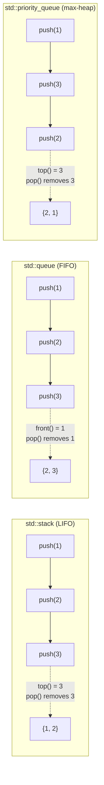
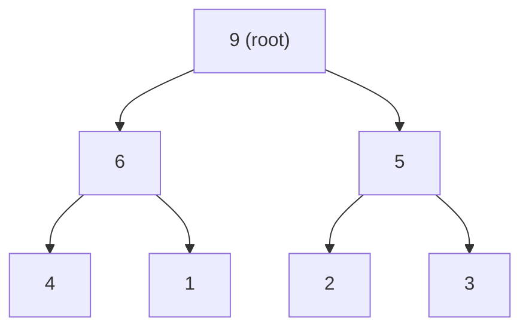

# Container Adapters

> [!info] Chapter 11 — Note 5 of 9
> Stack, queue, and priority_queue: thin wrappers over sequence containers. See also [[1. Containers Overview]], [[2. Sequence Containers]], [[9. Function Objects and Binders]].

## Why This Matters

`std::stack`, `std::queue`, and `std::priority_queue` are not containers in the strict sense — they are **container adapters**: thin interface restrictors layered over an underlying sequence container. They exist because raw access to a container's full API is a liability when your algorithm calls for a specific discipline. An undo buffer is a LIFO; a work queue is FIFO; a scheduler is a priority queue. If callers can poke the middle of the buffer, they will. Adapters **enforce** the discipline at compile time by exposing only the operations that make sense.

The downside is the same as for any abstraction: if you do not understand the underlying machinery, you will choose the wrong default (e.g., `priority_queue` defaults to a max-heap, which surprises every newcomer), pay unnecessary indirection costs, or get bitten by quirks like the lack of iteration. This note gives you the mental model — the underlying container choice, the comparator choice, and the operation complexity — to use adapters confidently.

## Background

The C++ standard defines three container adapters in `<stack>` and `<queue>`:

| Adapter | Header | Discipline | Underlying default |
|---|---|---|---|
| `std::stack<T>` | `<stack>` | LIFO | `std::deque<T>` |
| `std::queue<T>` | `<queue>` | FIFO | `std::deque<T>` |
| `std::priority_queue<T>` | `<queue>` | Max-heap (top is largest) | `std::vector<T>` |

Each adapter is a template:

```cpp
template <class T, class Container = std::deque<T>>
class stack;

template <class T, class Container = std::deque<T>>
class queue;

template <class T, class Container = std::vector<T>,
          class Compare = std::less<typename Container::value_type>>
class priority_queue;
```

The adapter exposes only the operations that match its discipline. It deliberately **omits** iteration, indexing, and middle insertion.

## The Three Disciplines



## std::stack — LIFO

The simplest adapter. Only four meaningful operations:

- `push(value)` / `emplace(args...)` — add to top.
- `pop()` — remove top (no return value).
- `top()` — reference to top element.
- `empty()` / `size()`.

### Underlying Container Requirements

Any container exposing `back()`, `push_back()`, `pop_back()` qualifies: `vector`, `deque`, `list`, `string` (technically).

### Why default to `deque`?

`std::deque` was chosen over `std::vector` because:
- `deque` does not invalidate references on `push_back`/`pop_back` (safer for callers that hold references).
- `deque` has O(1) `pop_back` without ever shrinking — `vector` shrinks poorly.
- `deque`'s chunked growth avoids large contiguous allocations.

In practice, if you know the maximum size, `std::stack<T, std::vector<T>>` followed by `reserve` is fine and often faster.

### Complexity

| Operation | Cost |
|---|---|
| `push` / `emplace` | O(1) amortized |
| `pop` | O(1) |
| `top` | O(1) |
| `empty` / `size` | O(1) |

### Example

```cpp
#include <stack>
#include <iostream>
#include <string>

bool isBalanced(std::string_view s) {
    std::stack<char> st;
    for (char c : s) {
        if (c == '(' || c == '[' || c == '{') st.push(c);
        else if (c == ')' || c == ']' || c == '}') {
            if (st.empty()) return false;
            char open = st.top(); st.pop();
            if ((c == ')' && open != '(') ||
                (c == ']' && open != '[') ||
                (c == '}' && open != '{')) return false;
        }
    }
    return st.empty();
}

int main() {
    std::cout << isBalanced("{[()]}") << ' '    // 1
              << isBalanced("{[(])}") << '\n';  // 0
}
```

## std::queue — FIFO

Operations:

- `push(value)` / `emplace(args...)` — add to back.
- `pop()` — remove front.
- `front()` — reference to front element.
- `back()` — reference to back element.
- `empty()` / `size()`.

### Underlying Container Requirements

Must support `front()`, `back()`, `push_back()`, `pop_front()`. This rules out `vector` (no `pop_front`). Valid choices: `deque` (default), `list`.

### Why default to `deque`?

`deque` has O(1) `push_back` AND `pop_front` with reference stability — uniquely suited. `list` works but has higher per-element overhead.

### Complexity

| Operation | Cost |
|---|---|
| `push` / `emplace` | O(1) amortized |
| `pop` | O(1) |
| `front` / `back` | O(1) |
| `empty` / `size` | O(1) |

### Example — BFS

```cpp
#include <queue>
#include <vector>
#include <iostream>

void bfs(const std::vector<std::vector<int>>& adj, int start) {
    std::vector<bool> visited(adj.size(), false);
    std::queue<int> q;
    q.push(start);
    visited[start] = true;
    while (!q.empty()) {
        int u = q.front(); q.pop();
        std::cout << u << ' ';
        for (int v : adj[u]) {
            if (!visited[v]) {
                visited[v] = true;
                q.push(v);
            }
        }
    }
}
```

## std::priority_queue — Heap

A **max-heap** by default: `top()` returns the **largest** element. (This surprises newcomers who expect a FIFO-with-priorities semantic.)

Operations:

- `push(value)` / `emplace(args...)` — insert, O(log n).
- `pop()` — remove top, O(log n).
- `top()` — reference to top, O(1).
- `empty()` / `size()`.

No iteration, no `clear` (until C++23's `erase_if` for `priority_queue`).

### Underlying Container Requirements

Random-access iterator + `front()`, `push_back()`, `pop_back` + move-constructible. Valid choices: `vector` (default), `deque`. `list` is not random-access.

The adapter uses `std::make_heap` / `push_heap` / `pop_heap` to maintain the heap property over the underlying container — see [[7. Algorithms]] for heap algorithm details.

### Custom Comparator — Min-Heap and Beyond

Pass `Compare` as the third template argument. The comparator defines "less than" for heap purposes; the **largest** element under `Compare` ends up on top. So:

- `std::less<T>` (default) → max-heap (largest on top).
- `std::greater<T>` → min-heap (smallest on top).

```cpp
#include <queue>
#include <functional>
#include <iostream>

int main() {
    std::priority_queue<int> maxh;                     // max-heap
    for (int x : {3, 1, 4, 1, 5, 9, 2, 6}) maxh.push(x);
    while (!maxh.empty()) { std::cout << maxh.top() << ' '; maxh.pop(); }
    // 9 6 5 4 3 2 1 1

    std::priority_queue<int, std::vector<int>, std::greater<int>> minh;  // min-heap
    for (int x : {3, 1, 4, 1, 5, 9, 2, 6}) minh.push(x);
    while (!minh.empty()) { std::cout << minh.top() << ' '; minh.pop(); }
    // 1 1 2 3 4 5 6 9
}
```

### Custom Comparator for Custom Types

```cpp
struct Task {
    int priority;
    std::string name;
};

// Higher priority first
struct TaskCompare {
    bool operator()(const Task& a, const Task& b) const noexcept {
        return a.priority < b.priority;   // less → max-heap by priority
    }
};

std::priority_queue<Task, std::vector<Task>, TaskCompare> pq;
pq.push({5, "write"});
pq.push({1, "eat"});
pq.push({3, "sleep"});
// top() is "write"
```

### Complexity

| Operation | Cost |
|---|---|
| `push` / `emplace` | O(log n) |
| `pop` | O(log n) |
| `top` | O(1) |
| Construction from a range (C++23) | O(n) (heapify) |
| `empty` / `size` | O(1) |

### Example — Top-K with a Min-Heap

A classic use case: keep only the top-K largest elements seen so far. A min-heap of size K, evicting the smallest whenever size exceeds K, gives O(N log K).

```cpp
#include <queue>
#include <functional>
#include <vector>
#include <iostream>

std::vector<int> topK(std::vector<int> nums, size_t k) {
    std::priority_queue<int, std::vector<int>, std::greater<int>> h;
    for (int x : nums) {
        h.push(x);
        if (h.size() > k) h.pop();    // evict smallest
    }
    std::vector<int> result;
    while (!h.empty()) { result.push_back(h.top()); h.pop(); }
    std::ranges::sort(result, std::greater<>{});
    return result;
}
```

### Example — Dijkstra's Shortest Path

```cpp
#include <queue>
#include <vector>
#include <limits>

struct Edge { int to, weight; };

auto dijkstra(const std::vector<std::vector<Edge>>& adj, int src) {
    const int INF = std::numeric_limits<int>::max();
    std::vector<int> dist(adj.size(), INF);
    using P = std::pair<int,int>;   // (distance, node)
    std::priority_queue<P, std::vector<P>, std::greater<P>> pq;  // min-heap by distance
    dist[src] = 0;
    pq.push({0, src});
    while (!pq.empty()) {
        auto [d, u] = pq.top(); pq.pop();
        if (d > dist[u]) continue;  // stale entry — skip
        for (auto [v, w] : adj[u]) {
            if (dist[u] + w < dist[v]) {
                dist[v] = dist[u] + w;
                pq.push({dist[v], v});
            }
        }
    }
    return dist;
}
```

## Comparison Table

| Property | `stack` | `queue` | `priority_queue` |
|---|---|---|---|
| Discipline | LIFO | FIFO | Max-heap (default) |
| Default underlying | `deque` | `deque` | `vector` |
| `push` cost | O(1) amortized | O(1) amortized | O(log n) |
| `pop` cost | O(1) | O(1) | O(log n) |
| `top` / `front` / `back` | `top` O(1) | `front`/`back` O(1) | `top` O(1) |
| Custom comparator | N/A | N/A | Yes (3rd template arg) |
| Iteration | No | No | No |
| `clear` | No (until C++23 `erase_if`) | No (until C++23) | No (until C++23) |
| `swap` | Yes | Yes | Yes |

## Implementation Details — How `priority_queue` Maintains the Heap

`std::priority_queue` is a thin wrapper around three heap-algorithm calls: `make_heap`, `push_heap`, `pop_heap` (declared in `<algorithm>`).

- On construction from a range (C++23), calls `std::make_heap(c.begin(), c.end(), comp)` in O(n).
- On `push(value)`: `c.push_back(value); std::push_heap(c.begin(), c.end(), comp);` — O(log n).
- On `pop()`: `std::pop_heap(c.begin(), c.end(), comp); c.pop_back();` — O(log n).

`pop_heap` swaps the first (top) and last elements, then sifts the new first down the heap. The popped element is now at the back; `c.pop_back()` removes it.

This implementation has a useful property: the underlying container is a valid heap at all times. If you ever need to peek beyond `top()`, you can access the protected member `c` by subclassing — or you can use the heap algorithms directly on your own `vector` (see [[7. Algorithms]]).

## Heap Property — Visual

A max-heap stored in a vector `[9, 6, 5, 4, 1, 2, 3]` looks like this:



The vector is a **level-order traversal** of the tree: index 0 is root, index 2*i+1 is left child, index 2*i+2 is right child, index (i-1)/2 is parent. Every parent is ≥ its children — that's the max-heap property.

## Comparison of Adapters vs Raw Containers

Why use `std::stack<int>` instead of `std::deque<int>` directly?

- **Type safety**: the adapter exposes only `push`, `pop`, `top`, `empty`, `size`. Callers cannot accidentally index or middle-insert. Bugs that would compile against `deque` are caught at compile time against `stack`.
- **Self-documenting code**: `std::stack<int>` says "LIFO discipline enforced here." A `std::deque<int>` could be anything.
- **Algorithmic clarity**: when reading code, the adapter's discipline tells you what invariants to expect.

The cost is a 1-line wrapper. Almost always worth it.

## Adapter Idioms and Patterns

### Pattern: Stack-Based Backtracking

DFS, expression evaluation, undo/redo, and parser state machines all naturally use `std::stack`:

```cpp
std::stack<Node*> dfs_stack;
dfs_stack.push(root);
while (!dfs_stack.empty()) {
    Node* n = dfs_stack.top(); dfs_stack.pop();
    if (n == target) return true;
    for (Node* child : n->children) dfs_stack.push(child);
}
```

### Pattern: Queue-Based BFS / Job Queue

BFS, work queues, and producer-consumer pipelines use `std::queue`:

```cpp
std::queue<Job> work_queue;
while (!work_queue.empty()) {
    Job j = work_queue.front(); work_queue.pop();
    process(j);
    for (Job& child : j.dependencies()) work_queue.push(child);
}
```

### Pattern: Priority Scheduler

Dijkstra, A*, Huffman coding, event simulation, and task scheduling use `std::priority_queue`:

```cpp
struct Event { double time; std::function<void()> action; };
auto cmp = [](const Event& a, const Event& b) { return a.time > b.time; };
std::priority_queue<Event, std::vector<Event>, decltype(cmp)> event_queue{cmp};
while (!event_queue.empty()) {
    Event e = event_queue.top(); event_queue.pop();
    e.action();
}
```

### Pattern: Monotonic Queue (Sliding Window Min/Max)

This pattern does **not** use `std::queue` directly — it uses `std::deque` to allow middle-element removal:

```cpp
// Sliding window maximum for window size k
std::vector<int> maxSlidingWindow(const std::vector<int>& nums, int k) {
    std::vector<int> result;
    std::deque<int> dq;  // indices, front = max
    for (int i = 0; i < (int)nums.size(); ++i) {
        while (!dq.empty() && dq.front() <= i - k) dq.pop_front();
        while (!dq.empty() && nums[dq.back()] <= nums[i]) dq.pop_back();
        dq.push_back(i);
        if (i >= k - 1) result.push_back(nums[dq.front()]);
    }
    return result;
}
```

This is O(n) amortized — better than a `priority_queue` which would be O(n log k).

### Pattern: Custom Adapter with `boost::heap`

If you need a priority queue with **increase-key** (essential for Dijkstra with decrease-key), the standard `priority_queue` is insufficient. Use `boost::fibonacci_heap` or `boost::d_ary_heap`, or maintain an indexed heap manually with a `vector` + `unordered_map<K, size_t>`.

## Adapter Benchmarks (Typical, Modern Desktop)

| Adapter + Operation | n=1K | n=1M |
|---|---|---|
| `stack<T, vector<T>>::push` | ~5 ns | ~5 ns |
| `stack<T, deque<T>>::push` | ~10 ns | ~10 ns |
| `queue<T, deque<T>>::push` | ~10 ns | ~10 ns |
| `priority_queue<int, vector<int>>::push` | ~50 ns | ~80 ns |
| `priority_queue<int, vector<int>>::pop` | ~60 ns | ~90 ns |
| `priority_queue<string, vector<string>>::push` | ~200 ns | ~300 ns |

For `stack`/`queue`, the per-operation cost is dominated by the underlying container's `push_back`/`pop_back` — so the choice between `vector` and `deque` is mostly about reference stability and growth strategy. For `priority_queue`, the heap re-heapify dominates, and the choice of underlying container is fixed by the random-access requirement.

## Custom Adapters

Adapters are easy to write yourself. Example: a thread-safe `ts_queue`:

```cpp
template <class T>
class ts_queue {
    std::queue<T> q_;
    std::mutex m_;
public:
    void push(T x) {
        std::lock_guard lk(m_);
        q_.push(std::move(x));
    }
    bool try_pop(T& out) {
        std::lock_guard lk(m_);
        if (q_.empty()) return false;
        out = std::move(q_.front());
        q_.pop();
        return true;
    }
};
```

The adapter pattern — wrap an existing container with a restricted, opinionated interface — is one of the most reusable C++ design ideas.

## When to Use an Adapter vs a Plain Container

Use an adapter when:
- The **discipline** (LIFO/FIFO/priority) is part of the type contract — you want the compiler to enforce it.
- The interface **should not** expose iteration, indexing, or middle mutation.
- The code reads more clearly with adapter-specific names (`push`/`pop`/`top` vs `push_back`/`pop_back`/`back`).

Use a plain container when:
- You need **iteration** or **indexed access** — adapters don't expose these.
- You need **multiple access patterns** on the same data (e.g., both LIFO and FIFO at different points).
- You need **bulk operations** like `clear`, `assign`, `resize` — adapters lack these (until C++23 `erase_if`).
- You need **custom allocation** beyond the underlying container's allocator (e.g., arena).

A common pattern: use a plain `std::vector` internally in a class, expose a `push`/`pop`/`top` API publicly — your class becomes a custom adapter, but with full control over the storage.

## Common Pitfalls

- **Assuming `priority_queue` is a min-heap** by default. It is a **max-heap**. To get a min-heap, use `std::greater<T>` as the comparator.
- **Calling `pop()` on an empty adapter** — undefined behavior. Always check `empty()` first.
- **Reading the popped element**: `pop()` returns `void`. Read `top()`/`front()` before calling `pop()`.
- **Expecting to iterate a `priority_queue`** — it does not expose iterators. If you need iteration, use a `vector` + `make_heap`/`push_heap`/`pop_heap` directly — see [[7. Algorithms]].
- **Storing references/iterators into the underlying container** — adapters do not expose it. If you need access, write your own thin wrapper or use the heap algorithms directly.
- **Forgetting that `priority_queue::pop` is O(log n)** — bulk removal is O(n log n); consider clearing by re-assigning an empty adapter.
- **Using `vector` as the underlying container for `queue`** — fails to compile (no `pop_front`). Use `deque` or `list`.
- **Using `list` as the underlying container for `priority_queue`** — fails to compile (no random access). Use `vector` or `deque`.
- **Custom comparator direction confusion**: the comparator returns `true` if `a` should come **before** `b` in heap order; the **largest under the comparator** rises to `top()`. So `less` gives max-heap, `greater` gives min-heap.
- **`stack`/`queue` do not have a `clear()` method** — assign `stack<T>()` or call `while (!s.empty()) s.pop();`.
- **Comparing adapters with `==`** — works (member-wise comparison of underlying containers), but is O(n).

## Tips and Tricks

- **Use `std::greater<T>` to make a min-heap `priority_queue`.** Memorize: "greater = min on top."
- **`priority_queue` constructor accepts a range (C++23)** — `priority_queue<int>(f, l)` builds a heap in O(n) instead of O(n log n).
- **For "top-K" problems**, a min-heap of size K beats a max-heap of size N — O(N log K) vs O(N log N).
- **For "scheduler" patterns**, prefer `priority_queue<pair<priority, task>>` over a custom struct + comparator — simpler to read.
- **Custom comparators as stateless functors** inline better than `std::function` — prefer the former for hot paths.
- **For intrusive reference-stability** (you need to update a task's priority), `priority_queue` is the wrong tool — use `boost::fibonacci_heap` or a custom indexed heap.
- **`std::erase_if` for `priority_queue` (C++23)** lets you remove elements matching a predicate; re-heapify is automatic.
- **Avoid `priority_queue<unique_ptr<T>>`** if you ever need to remove a specific element — you cannot. Use `vector<unique_ptr<T>>` + heap algorithms.
- **`std::stack` is great for parsing** (bracket matching, expression evaluation, backtracking); `std::queue` for BFS and work-stealing; `priority_queue` for greedy algorithms, schedulers, Dijkstra/A*.
- **`std::stack<T, std::vector<T>>` + `reserve`** if you know the max size — avoids reallocation.
- **For monotonic-queue patterns** (sliding-window min/max), `std::deque` directly beats `std::queue` — adapters can't express the middle-erase needed.
- **For circular buffers**, `boost::circular_buffer` or `std::deque` directly beats `std::queue` — `queue` does not expose iteration.

## Active Recall

1. What three container adapters does C++ provide, and which headers?
2. What is the **default underlying container** for each adapter?
3. Why does `std::queue` default to `deque` rather than `vector`?
4. Why does `std::priority_queue` default to `vector` rather than `deque`?
5. Is `std::priority_queue<int>` a min-heap or max-heap? How do you make it the other?
6. What is the complexity of `priority_queue::push` and `::pop`?
7. Why doesn't `priority_queue` expose iterators?
8. Write a custom comparator that makes `priority_queue<Task>` put the highest-priority task on top.
9. Why does `pop()` return `void`? How do you read the popped element?
10. Can you iterate a `std::stack`? A `std::queue`? A `std::priority_queue`?
11. How do you "clear" a `std::stack`?
12. Write the top-K algorithm using a min-heap and explain why it is O(N log K).
13. Why does `std::priority_queue` need random-access iterators in its underlying container?
14. Give a real-world use case for each of the three adapters.

## Next Steps

- Read [[6. Iterators]] to see why adapters don't expose them.
- Read [[7. Algorithms]] for the heap algorithms (`make_heap`, `push_heap`, `pop_heap`, `sort_heap`) that `priority_queue` is built on.
- Read [[9. Function Objects and Binders]] for comparator mechanics.
- For allocator-aware adapters and `std::pmr`: [[../7. Memory Management/7. Custom Allocators]].
