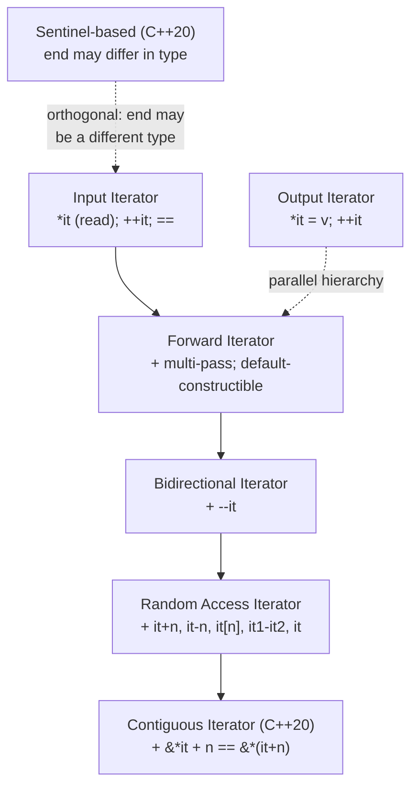

# Iterators

> [!info] Chapter 11 — Note 6 of 9
> Iterators are the glue between containers and algorithms. See also [[1. Containers Overview]], [[7. Algorithms]], [[8. Ranges (C++20)]].

## Why This Matters

Iterators are the **abstraction** that makes the STL's orthogonality possible. A single `std::find` algorithm works on `std::vector`, `std::list`, `std::set`, raw C arrays, `std::istream`, and any user-defined container — because it speaks only the *iterator* vocabulary. Without this layer, you would need 110 algorithms × 15 containers = 1,650 specialized functions. With it, you need 110 algorithms and 15 containers, and they compose freely.

But iterators have a darker side: **invalidation rules** differ per container, **categories** determine which algorithms work, and the C++20 introduction of **sentinels** and **concepts** has subtly changed how iterator code should be written. This note covers the categories, the standard iterator utilities, the invalidation rules per container, and the modern C++20 additions.

## Background

An iterator is a generalized pointer. The core operations are:

- `*it` — dereference (read or write the element).
- `++it` / `it++` — advance to the next element.
- `it != end` — check whether the range is exhausted.
- (For some categories) `--it`, `it + n`, `it[n]`, `it1 - it2`.

The standard defines **six categories** (five before C++20), each adding operations to the previous. An algorithm's template parameter constraint specifies the minimum category required:

```cpp
template <class InputIt, class T>
InputIt find(InputIt first, InputIt last, const T& value);  // needs InputIterator
```

The C++20 `<iterator>` header formalized categories as **concepts** (`std::input_iterator`, `std::forward_iterator`, etc.), but the underlying hierarchy is unchanged.

## Iterator Category Hierarchy



### Output Iterator

- Supports `*it = value` and `++it`.
- **Single-pass**: each position is written once.
- Examples: `std::back_insert_iterator`, `std::ostream_iterator`, `std::front_insert_iterator`.

### Input Iterator

- Supports `*it` (read), `++it`, `==`/`!=`.
- **Single-pass**: you cannot revisit a position.
- Examples: `std::istream_iterator<T>`, iterators over a generator.

### Forward Iterator

- Adds **multi-pass**: copies of the iterator are guaranteed to refer to the same position.
- Default-constructible.
- Examples: `std::forward_list::iterator`, `std::unordered_set::iterator`.

### Bidirectional Iterator

- Adds `--it` (decrement).
- Examples: `std::list::iterator`, `std::set::iterator`, `std::map::iterator`.

### Random Access Iterator

- Adds `it + n`, `it - n`, `it[n]`, `it1 - it2`, `it1 < it2`, etc.
- Examples: `std::vector::iterator`, `std::deque::iterator`, raw `T*`.

### Contiguous Iterator (C++20)

- A random access iterator where `&*it + n == &*(it + n)` — i.e., elements are stored contiguously in memory.
- Examples: `std::vector::iterator`, `std::array::iterator`, raw `T*`, `std::string::iterator`.
- Enables optimizations: memcpy, vectorization, passing to C APIs.

### Sentinel-Based Iteration (C++20)

Before C++20, `begin()` and `end()` returned the **same type**. C++20 relaxed this: a range is `[begin, sentinel)` where the sentinel may have a different type. This enables **delimited ranges** (e.g., "iterate until null terminator" or "iterate until stream EOF") without artificial type erasure.

```cpp
// C-style string as a range
std::ranges::for_each("hello", [](char c){ std::cout << c; });
// 'end' is a std::default_sentinel_t-style sentinel that compares equal when \0 is hit
```

## begin / end / rbegin / rend and Free-Function Forms

Every standard container exposes:

- `begin()` / `end()` — forward iterators.
- `cbegin()` / `cend()` — const forward iterators.
- `rbegin()` / `rend()` — reverse iterators (bidirectional or random-access containers only).
- `crbegin()` / `crend()` — const reverse.

The C++11 free-function forms work on any range (including built-in arrays):

```cpp
int arr[5] = {1, 2, 3, 4, 5};
auto it  = std::begin(arr);            // int*
auto end = std::end(arr);
std::for_each(std::begin(arr), std::end(arr), [](int x){ std::cout << x; });
```

C++17 added `std::size`, `std::empty`, `std::data` — uniform across containers and built-in arrays. C++20's `std::ranges::begin/end/size/empty/data` extend this to sentinel-based ranges.

## Iterator Utility Functions

`<iterator>` provides:

| Function | Effect | Category required |
|---|---|---|
| `std::next(it, n = 1)` | Returns iterator advanced by n | Input (n=1) / Forward+ (n>1) / Random+ (n<0) |
| `std::prev(it, n = 1)` | Returns iterator decremented by n | Bidirectional |
| `std::advance(it, n)` | Advances `it` in-place by n (may be negative) | Input+ |
| `std::distance(first, last)` | Returns `last - first` (input: O(n), random: O(1)) | Input |
| `std::iter_value_t<It>` | Type alias for the value type | Type trait |
| `std::iter_reference_t<It>` | Type alias for `*it` | Type trait |

```cpp
std::list<int> l{1, 2, 3, 4, 5};
auto it = l.begin();
std::advance(it, 2);             // it -> 3 (O(2) on a list)
auto it2 = std::next(it);        // it2 -> 4
auto it3 = std::prev(it);        // it3 -> 2
auto d = std::distance(l.begin(), l.end());  // 5, O(n) on list

std::vector<int> v{10, 20, 30};
auto vit = v.begin();
std::advance(vit, 2);            // O(1) on vector
auto dv = std::distance(v.begin(), v.end()); // O(1) on vector
```

## Special Iterators

### Insert Iterators

Adapter that turns assignment into insertion:

- `std::back_insert_iterator<C>` — calls `c.push_back(value)`.
- `std::front_insert_iterator<C>` — calls `c.push_front(value)`.
- `std::insert_iterator<C>` — calls `c.insert(pos, value)`.

Helper functions: `std::back_inserter(c)`, `std::front_inserter(c)`, `std::inserter(c, pos)`.

```cpp
std::vector<int> src{1, 2, 3};
std::vector<int> dst;
std::copy(src.begin(), src.end(), std::back_inserter(dst));   // dst = {1,2,3}
```

### Stream Iterators

- `std::istream_iterator<T>` — reads `T`s from an `istream` until EOF.
- `std::ostream_iterator<T>` — writes `T`s to an `ostream`, optionally with a separator.

```cpp
// Read all ints from stdin into a vector
std::vector<int> v{std::istream_iterator<int>{std::cin},
                   std::istream_iterator<int>{}};

// Write a vector to stdout, comma-separated
std::copy(v.begin(), v.end(),
          std::ostream_iterator<int>{std::cout, ", "});
```

### Reverse Iterators

`std::reverse_iterator<It>` wraps a bidirectional iterator and reverses its direction. `rbegin()` returns `reverse_iterator(end())`; `rend()` returns `reverse_iterator(begin())`.

```cpp
std::vector<int> v{1, 2, 3, 4, 5};
for (auto it = v.rbegin(); it != v.rend(); ++it) std::cout << *it << ' ';
// 5 4 3 2 1
```

### Move Iterators (C++11)

`std::make_move_iterator(it)` wraps an iterator and turns `*it` into an rvalue reference, enabling range-based move:

```cpp
std::vector<std::string> src{"a", "b", "c"};
std::vector<std::string> dst{
    std::make_move_iterator(src.begin()),
    std::make_move_iterator(src.end())
};
// src now contains empty strings (moved-from)
```

### Counted / Sentinel Iterators (C++20)

`std::counted_iterator<It>` wraps an iterator and a count; `std::default_sentinel` marks the end. Useful for taking first-N elements.

```cpp
int arr[] = {1, 2, 3, 4, 5, 6, 7, 8, 9, 10};
std::counted_iterator<int*> it{arr, 5};
for (; it != std::default_sentinel; ++it) std::cout << *it << ' ';
// 1 2 3 4 5
```

## Iterator Invalidation Rules Per Container

This is the most-tested STL topic in interviews. Memorize the table:

| Container | Insert | Erase |
|---|---|---|
| `array` | (no insert) | (no erase; only via assignment to elements) |
| `vector` | If realloc: **all** iterators and references. Else: only those at/after the insert point. | All iterators and references **at/after** the erase point. End iterator always invalidated. |
| `deque` | All iterators invalidated. References to elements stay valid unless the insert is in the middle. | All iterators and references invalidated if erase is in the middle; only erased-element iterators if at front/back. |
| `list` / `forward_list` | **No** invalidation. | Only iterators/references to erased elements. |
| `set` / `map` / `multiset` / `multimap` | **No** invalidation. | Only iterators/references to erased elements. |
| `unordered_*` | If rehash: **all** iterators; references stay valid. Else: no invalidation. | Only iterators/references to erased elements. |

> [!warning] The erase-loop trap
> ```cpp
> for (auto it = v.begin(); it != v.end(); ++it)
>     if (pred(*it)) v.erase(it);   // UB: it is now invalid
> ```
> Use the erase-return idiom for `vector`/`deque`/`list`/`forward_list`:
> ```cpp
> for (auto it = v.begin(); it != v.end(); )
>     if (pred(*it)) it = v.erase(it);
>     else ++it;
> ```
> For associative and unordered containers, the C++11+ idiom is the same: `it = c.erase(it);`.
> Even better in C++20: `std::erase_if(container, pred);` — a uniform free function.

## Sentinel-Based Iteration (C++20 deep dive)

Before C++20, an iterator and its end had to be the **same type**. This forced artificial designs:

- `std::istream_iterator<T>` was an iterator that compared equal to a **default-constructed** instance to signal EOF — a hack.
- C-strings needed `strlen` to compute `end`.

C++20 introduced **sentinels**: a sentinel is any type that can be compared to an iterator with `==`. The sentinel does not need to support `*` or `++`. This unlocks:

- Iterating a C-string without `strlen`:
  ```cpp
  std::ranges::for_each(std::ranges::subrange{arr, std::unreachable_sentinel},
      [](char c){ /* ... */ });
  ```
  (In practice, `std::ranges::subrange<char*, std::unreachable_sentinel>` is the C++ idiom; a more idiomatic pattern uses `std::c_string`-style helpers.)
- Reading from a stream until EOF with a typed sentinel.
- Lazy infinite ranges (e.g., `std::views::iota(0)`).

```cpp
// Infinite range — bounded only by take_view
for (int i : std::views::iota(1) | std::views::take(10))
    std::cout << i << ' ';   // 1 2 3 4 5 6 7 8 9 10
```

## Code Example — All Iterator Categories in One Place

```cpp
#include <vector>
#include <list>
#include <forward_list>
#include <set>
#include <unordered_set>
#include <iterator>
#include <iostream>

template <std::input_iterator It>
void print(It first, It last, const char* tag) {
    std::cout << tag << ": ";
    for (; first != last; ++first) std::cout << *first << ' ';
    std::cout << '\n';
}

int main() {
    std::vector<int> v{1, 2, 3, 4, 5};
    std::list<int> l{1, 2, 3, 4, 5};
    std::forward_list<int> f{1, 2, 3, 4, 5};
    std::set<int> s{1, 2, 3, 4, 5};
    std::unordered_set<int> u{1, 2, 3, 4, 5};

    print(v.begin(), v.end(), "vector");            // random-access + contiguous
    print(l.begin(), l.end(), "list");              // bidirectional
    print(f.begin(), f.end(), "forward_list");      // forward
    print(s.begin(), s.end(), "set");               // bidirectional
    print(u.begin(), u.end(), "unordered_set");     // forward

    // Insert iterators
    std::vector<int> dst;
    std::copy(v.begin(), v.end(), std::back_inserter(dst));
    print(dst.begin(), dst.end(), "back_inserter");

    // Reverse
    print(v.rbegin(), v.rend(), "vector reversed");

    // Move iterators
    std::vector<std::string> src{"a", "b", "c"};
    std::vector<std::string> moved{
        std::make_move_iterator(src.begin()),
        std::make_move_iterator(src.end())
    };

    // Stream iterators
    std::istringstream iss{"1 2 3 4 5"};
    std::vector<int> from_stream{
        std::istream_iterator<int>{iss},
        std::istream_iterator<int>{}
    };
    print(from_stream.begin(), from_stream.end(), "stream");

    // C++20: counted_iterator
    int arr[] = {1, 2, 3, 4, 5, 6, 7, 8, 9, 10};
    print(std::counted_iterator{arr, 5},
          std::default_sentinel,
          "counted (first 5)");

    // C++20: ranges::for_each with sentinel-friendly range
    std::ranges::for_each(std::views::iota(1) | std::views::take(3),
        [](int x){ std::cout << x << ' '; });
    std::cout << '\n';
}
```

## Writing Custom Iterators

When you write your own container or view, you typically need an iterator. The minimum for a forward iterator is:

```cpp
class MyIterator {
public:
    using iterator_category = std::forward_iterator_tag;
    using value_type        = int;
    using difference_type   = std::ptrdiff_t;
    using pointer           = const int*;
    using reference         = const int&;

    reference operator*() const;
    pointer   operator->() const;
    MyIterator& operator++();
    MyIterator  operator++(int);
    bool operator==(const MyIterator&) const = default;  // C++20
};
```

C++20 simplified this dramatically with **concepts**: instead of the five typedefs, you can satisfy `std::forward_iterator<MyIterator>` directly with `operator*`, `operator++`, `operator==`, and the iterator's value type is deduced via `std::iter_value_t`. The typedefs are still required for pre-C++20 code and for compatibility with SFINAE-based traits.

### Iterator Traits

`std::iterator_traits<It>` extracts the five typedefs uniformly. For raw pointers (`T*`), it specializes to provide them automatically:

```cpp
std::iterator_traits<int*>::iterator_category  // std::random_access_iterator_tag
std::iterator_traits<int*>::value_type          // int
std::iterator_traits<int*>::pointer             // int*
std::iterator_traits<int*>::reference           // int&
std::iterator_traits<int*>::difference_type     // std::ptrdiff_t
```

Generic algorithms use these traits to declare temporaries, return types, and dispatch on category.

### Sentinel Iterators in C++20

A sentinel is any type comparable to an iterator with `==`. It does not need to support `*` or `++`. To write your own sentinel, define a type and an `operator==` with your iterator:

```cpp
struct NullTerminatedSentinel {
    bool operator==(const char* p) const { return *p == '\0'; }
};

std::ranges::subrange<const char*, NullTerminatedSentinel> c_string_range(const char* s) {
    return {s, NullTerminatedSentinel{}};
}

for (char c : c_string_range("hello")) std::cout << c;  // h e l l o
```

### Reverse Iterators

`std::reverse_iterator<It>` is a wrapper that swaps the meaning of `++` and `--`. It requires a bidirectional iterator. Implementation sketch:

```cpp
template <class It>
class reverse_iterator {
    It current;
public:
    reference operator*() const { auto tmp = current; return *--tmp; }
    reverse_iterator& operator++() { --current; return *this; }
    reverse_iterator& operator--() { ++current; return *this; }
    // ...
};
```

Note the off-by-one in `operator*`: a reverse iterator at position N dereferences element N-1. This is the famous `rbegin() == reverse_iterator(end())` quirk.

## C++20 Iterator Concepts

C++20 introduced formal **concepts** for iterator categories. They are stricter and clearer than the old typedefs:

| Concept | Old typedef equivalent | Key requirements |
|---|---|---|
| `std::input_iterator` | `input_iterator_tag` | `*it`, `++it`, `it != end`, `it == it` |
| `std::output_iterator` | `output_iterator_tag` | `*it = v`, `++it` |
| `std::forward_iterator` | `forward_iterator_tag` | Multi-pass, default-constructible |
| `std::bidirectional_iterator` | `bidirectional_iterator_tag` | `--it` |
| `std::random_access_iterator` | `random_access_iterator_tag` | `it + n`, `it - it`, `it[n]`, `it < it` |
| `std::contiguous_iterator` | (no equivalent) | `&*it + n == &*(it + n)` |
| `std::sentinel_for<It>` | (no equivalent) | `it == sentinel` |
| `std::sized_sentinel_for<It>` | (no equivalent) | `sentinel - it` is O(1) |

Concepts give much better error messages than the old SFINAE-based traits — a violation points directly at the missing operation rather than producing a 500-line template spew.

## Iterators vs Pointers — When to Use Which

| Need | Use |
|---|---|
| Iterate a `vector<T>` in a tight loop | Raw `T*` (via `v.data()`) — fastest, simplest |
| Iterate any STL container | Container's `iterator` type |
| Generic algorithm over any range | Template `It` parameter constrained by `std::input_iterator<It>` |
| Pass a position to a function | Iterator (for containers) or index (for `vector`/`deque`) |
| Store a position across mutations | Index (safer than iterator for `vector`) or `std::list::iterator` (stable) |
| C-API interop | `T*` via `.data()` (contiguous containers only) |

## Iterator Debugging and Validation

Most STL implementations ship with a **debug mode** that checks iterator validity at runtime:

- **libstdc++**: compile with `-D_GLIBCXX_DEBUG` — checks iterator validity, range correctness, and reports UB.
- **libc++**: compile with `-D_LIBCPP_DEBUG=1` (similar checks).
- **MSVC**: project properties → C/C++ → Code Generation → **C++ Standard Library** → set to **Debug** (`/iteratorDebugLevel=2` in `<iterator>`).

These checks turn silent UB into immediate crashes with helpful diagnostics — invaluable for catching invalidation bugs. They typically add 2×–10× runtime overhead, so enable them in debug builds and CI, disable in release.

### Sanitizer Backstop

AddressSanitizer (ASan) catches many iterator bugs — use-after-free, heap-buffer-overflow on `vector::operator[]` out-of-bounds, etc. Combine with `_GLIBCXX_DEBUG` for maximum coverage. See [[../15. Debugging and Profiling]].

## Common Pitfalls

- **Caching `vector` iterators across mutations** — they get invalidated silently. Use indices.
- **Comparing iterators from different containers** — UB unless both are `begin`/`end` of an "empty" container; the standard says behavior is unspecified.
- **Using `std::advance` on a forward iterator with a negative n** — undefined; only bidirectional iterators support `--`.
- **`std::distance(first, last)` when `last` is not reachable from `first`** — UB.
- **Dereferencing `end()`** — UB. The classic off-by-one.
- **Dereferencing a default-constructed iterator** — UB. (Default-constructed iterators are valid as *values* but not dereferenceable.)
- **`std::reverse_iterator` on a forward iterator** — fails to compile (requires bidirectional).
- **`std::back_inserter` on a container without `push_back`** — fails to compile (e.g., `std::set`).
- **`std::front_inserter` on `std::vector`** — fails to compile (no `push_front`).
- **Trusting `vector::end()` to be a stable "last-element" pointer** across `push_back` — invalidated by realloc.
- **Forgetting that `std::erase_if` is the modern (C++20) way** — avoids the manual erase-return dance.
- **`std::advance(it, n)` vs `it += n`**: prefer `+=` for random-access iterators (clearer); use `advance` in generic code that works on lower categories.
- **`std::next(it, 0)` returns a copy of `it`**, not `it` itself — fine, but don't expect identity.

## Tips and Tricks

- **Use `std::next` / `std::prev` instead of `++` / `--` chains** — clearer intent, works in expressions.
- **Use `std::advance` in generic code** — works for any input iterator; the compiler picks the optimal implementation.
- **`std::distance` is O(1) on random-access and O(n) on others** — be aware when your hot loop calls it.
- **`std::back_inserter` is the canonical "append to vector" idiom** for `std::copy`/`std::transform` — and the compiler usually inlines it perfectly.
- **`std::ostream_iterator<T>(os, sep)`** is the shortest way to print a range, though `std::ranges::copy` + `ostream_iterator` is now idiomatic.
- **Move iterators** are the cleanest way to move-construct a container from a source range.
- **C++20 `std::counted_iterator`** lets you create a "first N elements" view without copying.
- **C++20 `std::ranges::begin/end`** works on sentinel-based ranges (the older `std::begin/end` do not).
- **For C-strings, prefer `std::string_view`** to manual `char*`/`strlen` iteration — see [[../3. Strings and Character Data/3. string_view and Modern String Handling]].
- **Concepts (`std::input_iterator`, etc.) make template constraints far clearer than SFINAE** — use them in C++20+.
- **`std::iter_value_t<It>`** is the canonical way to extract an iterator's value type in C++20+.
- **`std::common_iterator<It, Sentinel>`** converts a sentinel-based range to a plain iterator pair for legacy algorithms.

## Active Recall

1. List the six iterator categories in order from weakest to strongest (including C++20's contiguous).
2. What operations does a **forward** iterator add over an input iterator?
3. What operations does a **random access** iterator add over bidirectional?
4. What is the difference between a random-access iterator and a contiguous iterator?
5. What is a **sentinel**, and what new capability did sentinels unlock in C++20?
6. List the iterator invalidation rules for `vector` insert and erase.
7. Why does `deque::push_front` invalidate iterators but not references?
8. Write the **erase-return idiom** for a `vector` in a loop.
9. What does `std::back_inserter(c)` do, and what methods must `c` have?
10. What does `std::make_move_iterator` do, and when would you use it?
11. Give an example of using `std::istream_iterator` and explain what the default-constructed instance means.
12. Why is `std::distance` O(1) on `vector` but O(n) on `list`?
13. What is `std::counted_iterator` and what sentinel does it compare against?
14. Why does `std::reverse_iterator` not work with `std::forward_list::iterator`?

## Next Steps

- Read [[7. Algorithms]] to see how iterators power the ~110 standard algorithms.
- Read [[8. Ranges (C++20)]] for the modernization that builds on sentinels.
- Read [[1. Containers Overview]] for the per-container invalidation table.
- Read [[4. Unordered Containers]] for why unordered containers only have forward iterators.
- For iterator customization for your own types: [[../10. Templates and Metaprogramming]].
