# Algorithms

> [!info] Chapter 11 — Note 7 of 9
> The ~110 standard algorithms in `<algorithm>` and `<numeric>`. See also [[6. Iterators]], [[8. Ranges (C++20)]], [[9. Function Objects and Binders]].

## Why This Matters

The STL ships roughly **110 algorithms** that operate over iterator ranges. They are the single most reusable piece of C++ ever written — `std::sort` works on a vector, a deque, a raw C array, a custom container exposing random-access iterators, or any range C++20 accepts. Mastering them means you spend your time *describing* computation ("find the first element matching predicate, then remove duplicates, then partition by parity") rather than *re-implementing* it with hand-rolled loops.

The cost of not knowing them is high: a 30-line hand-written loop that finds and removes duplicates is bug-prone, slow, and unreadable; `std::sort` + `std::unique` + `erase` is 3 lines, often 2×–10× faster, and self-documenting. This note catalogs the algorithms by category with complexity, signature, and a worked example for each major family.

## Background

`<algorithm>` was the third pillar of the original STL (with containers and iterators). It provides:

- **Non-modifying** operations — read a range without changing it (`find`, `count`, `for_each`).
- **Modifying** operations — write to a range (`copy`, `transform`, `replace`, `remove`, `unique`, `rotate`).
- **Sorting & partitioning** — `sort`, `stable_sort`, `partial_sort`, `nth_element`, `partition`.
- **Binary search** on sorted ranges — `lower_bound`, `upper_bound`, `equal_range`, `binary_search`.
- **Heap operations** — `make_heap`, `push_heap`, `pop_heap`, `sort_heap`.
- **Min/max** — `min`, `max`, `minmax`, `clamp`, `min_element`, `max_element`.
- **Set operations on sorted ranges** — `merge`, `set_union`, `set_intersection`, `set_difference`.
- **Permutation & comparison** — `is_permutation`, `next_permutation`, `lexicographical_compare`.

`<numeric>` (separate header) provides:

- **Sums & products** — `accumulate`, `inner_product`, `reduce` (C++17, parallel), `transform_reduce`.
- **Scans** — `partial_sum`, `inclusive_scan`, `exclusive_scan`, `transform_inclusive_scan`, `transform_exclusive_scan`.
- **Differences** — `adjacent_difference`.

C++17 added **parallel overloads** (`std::execution::par`, `std::execution::par_unseq`, `std::execution::seq`) for ~70 algorithms. C++20 added **ranges-based** versions that take a range directly (no `begin()`/`end()` pair) — see [[8. Ranges (C++20)]].

```mermaid
flowchart TB
    ALG["<algorithm>"]
    ALG --> NM["Non-modifying<br/>find, count, all_of, for_each, search"]
    ALG --> MOD["Modifying<br/>copy, move, transform, replace, remove, unique, rotate, shuffle"]
    ALG --> SORT["Sorting & Partitioning<br/>sort, stable_sort, partial_sort, nth_element, partition"]
    ALG --> BIN["Binary Search (sorted range)<br/>lower_bound, upper_bound, equal_range, binary_search"]
    ALG --> HEAP["Heap ops<br/>make_heap, push_heap, pop_heap, sort_heap"]
    ALG --> MM["Min/Max<br/>min, max, minmax, clamp, min_element, max_element"]
    ALG --> SET["Set ops (sorted ranges)<br/>merge, set_union, set_intersection, set_difference"]
    ALG --> PERM["Permutations<br/>next_permutation, is_permutation, lexicographical_compare"]
    NUM["<numeric>"]
    NUM --> ACC["accumulate, inner_product, reduce, transform_reduce"]
    NUM --> SCAN["partial_sum, inclusive_scan, exclusive_scan"]
    NUM --> DIFF["adjacent_difference"]
```



## Non-Modifying Algorithms

| Algorithm | Effect | Complexity |
|---|---|---|
| `for_each(first, last, f)` | Apply `f` to each element | O(n) |
| `count(first, last, v)` | Count occurrences of `v` | O(n) |
| `count_if(first, last, p)` | Count elements matching predicate | O(n) |
| `find(first, last, v)` | First element == v | O(n) |
| `find_if(first, last, p)` | First element matching predicate | O(n) |
| `find_if_not(first, last, p)` | First element not matching | O(n) |
| `find_end`, `find_first_of`, `adjacent_find` | Specialized searches | O(n) or O(n·m) |
| `all_of`, `any_of`, `none_of(first, last, p)` | Boolean predicate over range | O(n) worst, may short-circuit |
| `search(first, last, sf, sl)` | Find sub-range | O(n·m) typical, O(n+m) with Boyer-Moov (some impls) |
| `mismatch` | First position where two ranges differ | O(n) |
| `equal` | Range equality | O(n) |

```cpp
std::vector<int> v{1, 2, 3, 4, 5, 6};
bool hasEven   = std::any_of(v.begin(), v.end(), [](int x){ return x%2 == 0; });
bool allPos    = std::all_of(v.begin(), v.end(), [](int x){ return x > 0; });
int  nEven     = std::count_if(v.begin(), v.end(), [](int x){ return x%2 == 0; });
auto it        = std::find(v.begin(), v.end(), 4);  // -> 4
```

> [!tip] `all_of` / `any_of` / `none_of` short-circuit
> They return as soon as the answer is determined — unlike `count_if` which always scans the whole range.

## Modifying Algorithms

| Algorithm | Effect | Complexity |
|---|---|---|
| `copy`, `copy_if`, `copy_n`, `copy_backward` | Copy elements | O(n) |
| `move`, `move_backward` | Move elements | O(n) |
| `transform(first, last, out, f)` | Apply `f` to each, write to `out` | O(n) |
| `transform(first1, last1, first2, out, f)` | Binary transform | O(n) |
| `replace`, `replace_if`, `replace_copy`, `replace_copy_if` | Replace | O(n) |
| `remove`, `remove_if`, `remove_copy`, `remove_copy_if` | "Remove" — see below | O(n) |
| `unique`, `unique_copy` | Remove consecutive duplicates | O(n) |
| `reverse`, `reverse_copy` | Reverse | O(n) |
| `rotate`, `rotate_copy` | Rotate | O(n) |
| `shuffle(first, last, g)` | Random shuffle with URBG | O(n) |
| `sample(first, last, out, n, g)` | Random sample (C++17) | O(n) or O(n·log n) |
| `fill`, `fill_n` | Assign value to range | O(n) |
| `generate`, `generate_n` | Assign result of function | O(n) |
| `swap_ranges` | Swap two ranges element-wise | O(n) |

### The Erase-Remove Idiom

`std::remove` does **not** erase anything — it cannot, because it does not have access to the container. Instead, it **moves** non-removed elements forward and returns an iterator to the new logical end. The elements past the new end are unspecified garbage. You must then call `container.erase(new_end, container.end())` to actually shrink.

```cpp
std::vector<int> v{1, 2, 3, 4, 5, 6};
auto new_end = std::remove_if(v.begin(), v.end(),
                              [](int x){ return x % 2 == 0; });
v.erase(new_end, v.end());          // v = {1, 3, 5}
```

C++20 collapses this to `std::erase_if(v, pred);` — uniform across `vector`, `deque`, `list`, `forward_list`, `set`, `map`, `unordered_*`.

### `transform` — the map of the STL

```cpp
std::vector<int> v{1, 2, 3, 4, 5};
std::vector<int> squared;
std::transform(v.begin(), v.end(), std::back_inserter(squared),
               [](int x){ return x * x; });               // squared = {1,4,9,16,25}

// In-place transform
std::transform(v.begin(), v.end(), v.begin(),
               [](int x){ return x * 2; });                // v = {2,4,6,8,10}

// Binary transform: zip two ranges
std::vector<int> a{1, 2, 3}, b{10, 20, 30}, sum(3);
std::transform(a.begin(), a.end(), b.begin(), sum.begin(),
               std::plus<>{});                              // sum = {11, 22, 33}
```

## Sorting & Partitioning

| Algorithm | Effect | Complexity | Notes |
|---|---|---|---|
| `sort` | Sort range | O(n log n) avg, O(n²) worst for introsort | Not stable |
| `stable_sort` | Stable sort | O(n log n) or O(n log² n) | Stable; preserves equal-element order |
| `partial_sort(first, mid, last)` | Sort first `(mid-first)` smallest | O(n log m) | |
| `partial_sort_copy` | Copy + partial sort | O(n log m) | |
| `nth_element(first, nth, last)` | Place `nth`-largest at position `nth` | O(n) avg | Quickselect-based |
| `is_sorted`, `is_sorted_until` | Check sortedness | O(n) | |
| `partition(first, last, p)` | Reorder so predicate-true come first | O(n) | Not stable |
| `stable_partition` | Stable partition | O(n) or O(n log n) | |
| `partition_point` | Find partition boundary (assumed partitioned) | O(log n) | |

```cpp
std::vector<int> v{5, 3, 1, 9, 7, 2, 8, 4, 6};

// Full sort
std::sort(v.begin(), v.end());                       // 1 2 3 4 5 6 7 8 9

// Top-3 smallest
std::partial_sort(v.begin(), v.begin() + 3, v.end());

// Median without full sort
std::nth_element(v.begin(), v.begin() + v.size()/2, v.end());
int median = v[v.size()/2];

// Custom comparator
std::sort(v.begin(), v.end(), std::greater<>{});    // descending

// Partition: evens first
auto piv = std::partition(v.begin(), v.end(),
                          [](int x){ return x % 2 == 0; });
// v = [evens..., odds...]; piv points to first odd
```

> [!note] `std::sort` is **introsort**
> libstdc++ and libc++ implement `std::sort` as **introsort**: quicksort with depth limit, falling back to heapsort when depth exceeds `2·log₂(n)`. This guarantees O(n log n) worst case while keeping quicksort's cache-friendly average behavior.

## Binary Search (on sorted ranges)

| Algorithm | Effect | Complexity |
|---|---|---|
| `lower_bound(first, last, v)` | First element **≥** v | O(log n) |
| `upper_bound(first, last, v)` | First element **>** v | O(log n) |
| `equal_range(first, last, v)` | `[lower, upper)` of v | O(log n) |
| `binary_search(first, last, v)` | Boolean: v present? | O(log n) |

```cpp
std::vector<int> v{1, 2, 3, 3, 3, 4, 5, 6};
auto lo = std::lower_bound(v.begin(), v.end(), 3);  // -> first 3
auto hi = std::upper_bound(v.begin(), v.end(), 3);  // -> 4
auto [b, e] = std::equal_range(v.begin(), v.end(), 3);
// [b, e) is the range of all 3s
bool present = std::binary_search(v.begin(), v.end(), 4);  // true
```

> [!tip] `lower_bound` is more useful than `binary_search`
> It returns an iterator (not a bool), so you can use it to find the *insertion point* for a new element keeping the range sorted: `v.insert(std::lower_bound(v.begin(), v.end(), x), x);` — though this is O(n) for `vector` due to shifting.

## Heap Operations

`std::priority_queue` is built on these four free functions, which expose the heap directly on any random-access range:

| Algorithm | Effect | Complexity |
|---|---|---|
| `make_heap(first, last, cmp = less)` | Rearrange into a max-heap | O(n) |
| `push_heap(first, last, cmp = less)` | Re-heapify after pushing the last element | O(log n) |
| `pop_heap(first, last, cmp = less)` | Swap first/last and re-heapify the prefix | O(log n) |
| `sort_heap(first, last, cmp = less)` | Sort a heap into ascending order | O(n log n) |
| `is_heap`, `is_heap_until` | Check heap property | O(n) |

```cpp
std::vector<int> h{3, 1, 4, 1, 5, 9, 2, 6};
std::make_heap(h.begin(), h.end());             // h is now a max-heap
// Top is h.front()
h.push_back(8);
std::push_heap(h.begin(), h.end());             // 8 sifts up
std::pop_heap(h.begin(), h.end());              // swap top to end
int max = h.back(); h.pop_back();               // extract 9
std::sort_heap(h.begin(), h.end());             // ascending sort
```

> [!note] Why the heap ops are exposed
> Direct heap access lets you (a) iterate the underlying storage, (b) `reserve` capacity once, (c) peek beyond the top, (d) build a "two-ended priority queue" by combining min and max heaps — none of which `priority_queue` allows.

## Numeric Algorithms (`<numeric>`)

| Algorithm | Effect | Complexity |
|---|---|---|
| `accumulate(first, last, init, op = plus)` | `init = op(init, *it)` for each | O(n) |
| `inner_product(first, last, first2, init, op1, op2)` | Dot product generalization | O(n) |
| `partial_sum(first, last, out, op = plus)` | Prefix sums | O(n) |
| `adjacent_difference(first, last, out, op = minus)` | Differences of adjacent pairs | O(n) |
| `reduce(first, last, init = T{}, op = plus)` (C++17) | Parallel-friendly accumulate | O(n) |
| `transform_reduce(first, last, init, op, unary)` (C++17) | Map-reduce | O(n) |
| `inclusive_scan` / `exclusive_scan` (C++17) | Parallel prefix scans | O(n) |
| `gcd`, `lcm` (C++17) | Greatest common divisor, LCM | O(log min(a,b)) |
| `midpoint(a, b)` (C++20) | Safe midpoint without overflow | O(1) |

```cpp
std::vector<int> v{1, 2, 3, 4, 5};
int sum   = std::accumulate(v.begin(), v.end(), 0);             // 15
int prod  = std::accumulate(v.begin(), v.end(), 1, std::multiplies<>{});  // 120

std::vector<int> prefix(v.size());
std::partial_sum(v.begin(), v.end(), prefix.begin());           // {1,3,6,10,15}

// C++17 parallel reduce
#include <execution>
int par_sum = std::reduce(std::execution::par, v.begin(), v.end(), 0);

// C++17 transform_reduce: sum of squares
int sq_sum = std::transform_reduce(v.begin(), v.end(), 0,
                                   std::plus<>{}, [](int x){ return x*x; });
```

> [!warning] `accumulate` initial value type matters
> `std::accumulate(v.begin(), v.end(), 0)` uses `int` as the accumulator even if `v` is `vector<double>` — silent truncation. Always pass an `init` of the correct type: `0.0` for doubles, `0LL` for `long long`.

## Min/Max

| Algorithm | Effect |
|---|---|
| `min(a, b)` / `max(a, b)` | Returns const ref to min/max of two |
| `min({a, b, c, ...})` / `max(...)` | Initializer-list version (variadic) |
| `minmax(a, b)` | `pair{min, max}` |
| `min_element(first, last)` / `max_element(...)` | Iterator to min/max element |
| `minmax_element(first, last)` | `pair{min_it, max_it}` in one pass |
| `clamp(v, lo, hi)` (C++17) | Clamp `v` to `[lo, hi]` |

```cpp
int x = std::min(3, 7);                                  // 3
int y = std::max({3, 7, 2, 9, 4});                       // 9
auto [mn, mx] = std::minmax({3, 7, 2, 9, 4});            // (2, 9)

std::vector<int> v{5, 2, 8, 1, 9, 3};
auto [mit, xit] = std::minmax_element(v.begin(), v.end()); // -> {1, 9}

int clamped = std::clamp(15, 0, 10);                     // 10
```

## Code Example — A Composite Pipeline

A realistic example: parse a CSV of integers, deduplicate, sort descending, take top 5, and print comma-separated.

```cpp
#include <algorithm>
#include <vector>
#include <iostream>
#include <sstream>
#include <iterator>

int main() {
    std::string csv = "3,1,4,1,5,9,2,6,5,3,5,8,9,7,9";
    std::istringstream iss{csv};

    // Parse ints (skip commas)
    std::vector<int> v;
    int x;
    char c;
    while (iss >> x) { v.push_back(x); iss >> c; }   // c swallows the comma

    // Deduplicate + sort
    std::sort(v.begin(), v.end());
    v.erase(std::unique(v.begin(), v.end()), v.end());

    // Take top 5 descending
    std::reverse(v.begin(), v.end());
    if (v.size() > 5) v.resize(5);

    // Print
    std::copy(v.begin(), v.end(),
              std::ostream_iterator<int>{std::cout, ", "});
    std::cout << '\n';
    // 9, 8, 7, 6, 5,
}
```

The same in C++20 ranges (see [[8. Ranges (C++20)]]):

```cpp
auto top5 = v
          | std::views::filter([](int a, int b){ return a != b; })  // not quite — see ranges note
          | std::views::take(5);
// ... (full pipeline in [[8. Ranges (C++20)]])
```

## Parallel Algorithms (C++17)

C++17 added parallel overloads to ~70 algorithms. Pass an execution policy as the first argument:

```cpp
#include <execution>

std::sort(std::execution::par, v.begin(), v.end());               // parallel
std::sort(std::execution::par_unseq, v.begin(), v.end());         // parallel + vectorized
std::sort(std::execution::seq, v.begin(), v.end());               // explicit sequential
std::for_each(std::execution::par, v.begin(), v.end(), f);
```

| Policy | Meaning | Constraints |
|---|---|---|
| `seq` | Sequential, no parallelism | Function calls may not be interleaved |
| `par` | Parallel, may run on multiple threads | Function calls may overlap in different threads; user must ensure thread-safe |
| `par_unseq` | Parallel + vectorized (SIMD) | Function calls may overlap on same thread (no locks, no atomics — `noexcept` only) |

### When Parallel Algorithms Help

- **n ≥ 10⁶**: parallel overhead is amortized.
- **Element operation is non-trivial** (≥ 100 ns): otherwise overhead dominates.
- **No shared state**: each iteration is independent.
- **No exceptions**: `par_unseq` requires `noexcept` (throwing leads to `std::terminate`).

For small n or trivial operations, parallel algorithms often run **slower** due to thread-pool setup cost.

## Algorithm Complexity Cheat Sheet

| Operation | Algorithm | Complexity |
|---|---|---|
| Linear scan | `find`/`count`/`for_each` | O(n) |
| Sort | `sort` | O(n log n) avg |
| Stable sort | `stable_sort` | O(n log n) |
| Top-K | `partial_sort` | O(n log k) |
| K-th element | `nth_element` | O(n) avg |
| Binary search | `lower_bound`/`upper_bound` | O(log n) |
| Heap build | `make_heap` | O(n) |
| Heap push/pop | `push_heap`/`pop_heap` | O(log n) |
| Set union/intersection | `set_union`/`set_intersection` | O(n + m) |
| Permutation | `next_permutation` | O(n) |
| Median | `nth_element` + pick | O(n) avg |
| Min/Max element | `min_element`/`max_element` | O(n) |
| Min + Max in one pass | `minmax_element` | O(n) |

## Algorithm Selection — A Decision Tree

1. **Need to find a value?** → `find` (unsorted) or `lower_bound` (sorted).
2. **Need to count?** → `count`/`count_if`.
3. **Need to test all/any/none?** → `all_of`/`any_of`/`none_of` (short-circuit).
4. **Need to copy with transformation?** → `transform` or `copy_if`.
5. **Need to remove?** → `remove_if` + `erase` (or `std::erase_if` in C++20).
6. **Need to deduplicate?** → `sort` + `unique` + `erase`.
7. **Need to sort?** → `sort` (fast, unstable) or `stable_sort` (slower, stable).
8. **Need top-K?** → `partial_sort` (sorts top-K) or `nth_element` (partitions, doesn't sort).
9. **Need median?** → `nth_element` + pick middle.
10. **Need a priority queue?** → `priority_queue` or `make_heap` + `push_heap`/`pop_heap`.
11. **Need to merge sorted ranges?** → `merge` (out-of-place) or `inplace_merge`.
12. **Need to compute prefix sums?** → `partial_sum` or `inclusive_scan` (parallel).
13. **Need a sum/product?** → `accumulate` (sequential) or `reduce` (parallel).
14. **Need min/max?** → `min`/`max`/`minmax` (two values) or `min_element`/`max_element` (range).

## Common Pitfalls

- **Forgetting the erase half of erase-remove** — `remove` does not shrink the container.
- **`accumulate` with wrong `init` type** — silent truncation. Use `0.0` for doubles.
- **Calling `binary_search` on an unsorted range** — UB; result is meaningless.
- **Using `lower_bound` with a different comparator than the one used to sort** — UB.
- **`std::sort` is not stable** — equal elements may be reordered. Use `stable_sort` if order matters.
- **`std::sort` on `std::list`** — does not compile (needs random access). Use `list::sort` member.
- **Reading `remove`'s return value as an iterator to the first "removed" element** — it is the new logical end, not the first removed.
- **`unique` removes only *consecutive* duplicates** — sort first.
- **`for_each` does not guarantee order** in C++17 parallel overloads; for ordered effects, use sequential `for_each`.
- **Passing a stateful functor to a parallel algorithm** — data races; use stateless functors or atomics.
- **`std::fill` on `std::list<int>` of 1M elements** — O(n) but with poor cache behavior. Consider clearing and re-emplacing.
- **`partial_sort` with `mid == last`** — equivalent to `sort`; no benefit.
- **`nth_element`'s `nth` outside `[first, last)`** — UB.

## Tips and Tricks

- **`std::erase_if` (C++20)** replaces erase-remove uniformly — use it.
- **`std::reduce` over `std::accumulate`** when parallelism is desired — `reduce` allows reassociation.
- **`std::transform_reduce`** is the canonical map-reduce primitive — prefer it to manual loops.
- **`std::clamp(v, lo, hi)`** is clearer than `std::max(lo, std::min(v, hi))`.
- **`std::midpoint(a, b)`** (C++20) avoids `(a+b)/2` overflow — use it for binary search.
- **`std::lerp(a, b, t)`** (C++20) is the standard linear interpolation.
- **Pass function objects, not function pointers** — functors inline; function pointers usually do not. `std::plus<>{}` beats `std::plus<int>{}` in C++14+ because of transparent call operator.
- **`std::sort` with `std::greater<>{}`** (transparent) is more efficient than `std::greater<int>{}`.
- **`std::partition_point` is O(log n)** after `partition` — faster than `find_if_not` which is O(n).
- **`is_sorted_until`** to find the longest sorted prefix in O(n).
- **`std::sample` (C++17)** for reservoir sampling in O(n).
- **`std::shuffle` replaces `std::random_shuffle`** (removed in C++17) — always pass a URBG like `std::mt19937`.
- **C++17 parallel algorithms**: include `<execution>` and pass `std::execution::par` — but benchmark! Contention often beats the parallel speed-up for small N.
- **Use `std::views` (C++20)** to compose algorithm pipelines lazily — see [[8. Ranges (C++20)]].
- **Concepts in C++20** let you write constrained templates: `template <std::forward_iterator It> ...`.

## Active Recall

1. Name the eight algorithm categories in `<algorithm>` and one member of each.
2. What does `std::remove` actually do, and why must you call `erase` afterward?
3. Why is `std::sort` not stable? What is the stable alternative?
4. What algorithm gives you the median in O(n) average?
5. What does `std::lower_bound` return for a key not present in the range?
6. Why must the comparator passed to `binary_search` match the one used to sort?
7. List the four heap operations and their complexities.
8. Write a one-liner to compute the sum of squares of a vector using `transform_reduce`.
9. Why is `std::accumulate(v.begin(), v.end(), 0)` a bug when `v` is `vector<double>`?
10. What is introsort, and what worst-case complexity does it guarantee?
11. What does `std::unique` require as a precondition for "remove all duplicates" semantics?
12. What is the erase-remove idiom and what C++20 feature replaces it?
13. What is the difference between `std::reduce` and `std::accumulate`?
14. Give three algorithms that require random-access iterators.

## Next Steps

- Read [[8. Ranges (C++20)]] for the modern, composable alternative to iterator-pair algorithms.
- Read [[6. Iterators]] to understand the category requirements each algorithm imposes.
- Read [[9. Function Objects and Binders]] for the functor machinery used as predicates and comparators.
- Read [[5. Container Adapters]] for `priority_queue`'s relationship to heap algorithms.
- For parallel algorithm execution policies and `std::execution`: [[../14. Concurrency and Multithreading]].
