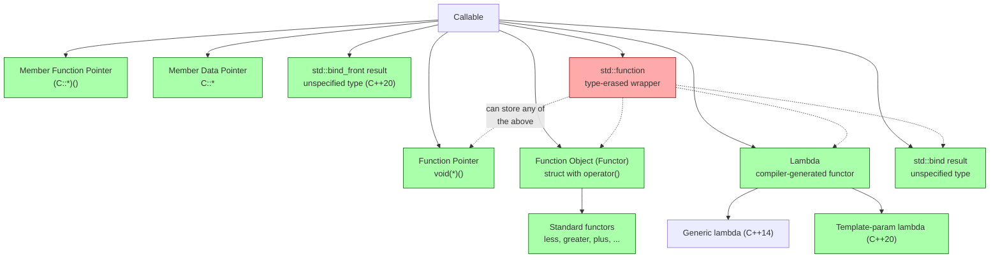

# Function Objects and Binders

> [!info] Chapter 11 — Note 9 of 9
> Callables in the STL: functors, `std::bind`, lambdas, `std::function`, `std::invoke`. See also [[7. Algorithms]], [[8. Ranges (C++20)]], [[../4. Functions and Program Structure/5. Function Pointers and Lambdas]].

## Why This Matters

The STL is fundamentally a **generic** library: `std::sort` works on any element type, with any comparator. To express "any callable" generically, the STL relies on a long lineage of mechanisms: function pointers (C), function objects / functors (early C++), `std::bind` and `std::function` (C++11/TR1), lambdas (C++11), `std::invoke` and `std::bind_front` (C++17/20), and generic lambdas with template parameters (C++20). Each mechanism has different trade-offs in **performance, flexibility, type-erasure overhead, and readability**. Knowing the differences lets you pick the right tool — a stateless functor that inlines for hot loops, a `std::function` for type-erased storage, a lambda for one-off predicates, or `std::bind_front` for partial application.

This note covers all of them, their relationships, and the modern best practices that have largely displaced the older machinery.

## Background

The C++ standard library treats **any type with `operator()`** as a callable. This includes:

- **Function pointers** — `void (*fp)(int)`.
- **Functors** — classes with `operator()`.
- **Lambda expressions** — syntactic sugar for compiler-generated functors.
- **Members functions** — invoked via `.*`/`->*` or `std::invoke`.
- **Member data pointers** — also callable through `std::invoke`.

The standard library ships a set of pre-defined functors in `<functional>`: arithmetic, comparison, and logical operators. These let you say "compare two ints" as `std::less<int>{}` rather than writing a lambda.

## Function Objects (Functors)

A function object is any class with `operator()` defined. The simplest example:

```cpp
struct AddOne {
    int operator()(int x) const { return x + 1; }
};

AddOne f;
int y = f(42);   // 43 — calls operator()
```

Functors have three properties that distinguish them from function pointers:

1. **Inlinability**: the compiler sees the functor's type at the call site, so `operator()` is a candidate for inlining. Function pointers usually are not.
2. **State**: functors can hold member data, allowing stateful behavior across calls.
3. **Polymorphism**: virtual `operator()` enables runtime dispatch.

### Stateful Functor Example

```cpp
struct Counter {
    int n = 0;
    int operator()() { return ++n; }
};

Counter c;
c(); c(); c();
std::cout << c.n;   // 3
```

### Standard Library Functors

`<functional>` provides:

**Arithmetic** (binary): `plus<T>`, `minus<T>`, `multiplies<T>`, `divides<T>`, `modulus<T>`.
**Arithmetic** (unary): `negate<T>`.
**Comparison**: `equal_to<T>`, `not_equal_to<T>`, `greater<T>`, `less<T>`, `greater_equal<T>`, `less_equal<T>`.
**Logical**: `logical_and<T>`, `logical_or<T>`, `logical_not<T>`.
**Bitwise** (C++20): `bit_and<T>`, `bit_or<T>`, `bit_xor<T>`, `bit_not<T>`.

```cpp
std::plus<int>{}(3, 4);       // 7
std::greater<int>{}(5, 3);    // true
std::logical_and<bool>{}(true, false);  // false
```

### Transparent Functors (C++14)

`std::less<void>` (and friends) are **transparent**: they deduce the parameter types from the arguments. This eliminates the verbosity of `std::less<int>` and, more importantly, enables **heterogeneous lookup** in `std::set<std::string, std::less<>>` — you can `find("literal"sv)` without constructing a temporary `std::string`.

```cpp
std::sort(v.begin(), v.end(), std::less<>{});   // transparent — works for any comparable types
```

Always prefer the transparent versions (`std::less<>{}`, `std::greater<>{}`, etc.) in modern code.

## std::bind and Placeholders

`std::bind` (C++11, evolved from Boost.Bind / TR1 `bind1st`/`bind2nd`) creates a callable by **fixing** some arguments of an existing callable. The placeholders `_1`, `_2`, ... (`std::placeholders::_1`) name the arguments of the resulting callable.

```cpp
#include <functional>

int add(int a, int b, int c) { return a + b + c; }

auto f = std::bind(add, 10, std::placeholders::_1, 20);
f(5);   // 10 + 5 + 20 = 35
```

### What `bind` Actually Does

`bind` returns an **unspecified type** that stores:
- A copy of the target callable.
- A copy of each bound argument.
- The placeholders for the unbound arguments.

When called, the unspecified type invokes the target with the bound arguments and substitutes the call's arguments for the placeholders.

### Member Function Binding

```cpp
struct Widget {
    int value = 0;
    void add(int x) { value += x; }
};

Widget w;
auto add5 = std::bind(&Widget::add, &w, 5);
add5();   // w.value == 5
```

### When to Use `bind` vs Lambdas

> [!warning] Lambdas have largely superseded `bind`
> Effective Modern C++ (Scott Meyers, Item 34) recommends lambdas over `std::bind` in almost every case. Lambdas:
> - Are more readable (you see the call expression directly).
> - Support move-only capture (bind cannot).
> - Support `auto` parameters (bind cannot, without `std::function`).
> - Inline better (bind's unspecified type is harder to optimize).
> - Have clearer evaluation order (bind's placeholders are evaluated lazily; subtle bugs result).

```cpp
// bind version — verbose, surprising
auto f = std::bind(add, 10, std::placeholders::_1, 20);

// lambda version — clear, idiomatic
auto f = [](int x) { return add(10, x, 20); };
```

Use `bind` only when:
- You need to forward a varying number of arguments (`std::bind` handles N placeholders cleanly).
- You need to compose existing callables without writing a lambda (rare).

Otherwise, prefer lambdas.

## Lambdas (cross-reference)

Lambdas are syntactic sugar for **anonymous functor types** generated by the compiler. The compiler synthesizes a class with `operator()` and creates an instance.

```cpp
auto square = [](int x) { return x * x; };
// Equivalent to:
struct __lambda {
    int operator()(int x) const { return x * x; }
};
__lambda square;
```

### Capture Modes

| Capture | Effect |
|---|---|
| `[]` | No capture |
| `[=]` | Capture all by value (deprecated in C++20 for `this`-capture warnings) |
| `[&]` | Capture all by reference |
| `[x]` | Capture `x` by value |
| `[&x]` | Capture `x` by reference |
| `[this]` | Capture `this` pointer (member access) |
| `[*this]` | Capture `*this` by value (C++17) — copy of the object |
| `[name = expr]` | Init-capture (C++14) — moves or computes a value into the closure |

### Generic Lambdas (C++14)

```cpp
auto plus = [](auto a, auto b) { return a + b; };   // operator() is a template
plus(1, 2);       // 3
plus(1.5, 2.5);   // 4.0
plus(std::string{"a"}, std::string{"b"});  // "ab"
```

### Template-parameter Lambdas (C++20)

```cpp
auto f = []<typename T>(std::vector<T> v) { return v.size(); };
// Explicit template parameter list — useful for constraining
```

### Mutable Lambdas

By default, `operator()` is `const`. `mutable` removes the const:

```cpp
int counter = 0;
auto count = [counter]() mutable { return ++counter; };
count(); count(); count();   // 1, 2, 3 — but only inside the closure
// 'counter' outside is still 0
```

For deeper coverage of lambdas: [[../4. Functions and Program Structure/5. Function Pointers and Lambdas]] and [[../8. Modern C++]].

## std::function — Type-Erased Callable Storage

`std::function<R(Args...)>` (C++11) is a **type-erased** wrapper that can hold any callable matching the signature `R(Args...)`. It is the C++ equivalent of a "function object" interface.

```cpp
#include <functional>
#include <vector>

std::function<int(int)> f;

f = [](int x) { return x + 1; };        // lambda
f = std::negate<int>{};                  // functor
f = [](int x) { return x * 2; };         // different lambda
int y = f(10);                            // 20

// Store heterogeneous callables
std::vector<std::function<int(int)>> fs{
    [](int x){ return x + 1; },
    [](int x){ return x * 2; },
    std::negate<>{}
};
for (auto& fn : fs) std::cout << fn(5) << '\n';   // 6, 10, -5
```

### When to Use `std::function`

- You need to **store** callables of heterogeneous types in a single container.
- You need a callable as a **member** of a class with stable type (you can't have `auto` members).
- You need a callable in a **non-template interface** (e.g., a C-style API callback, an event handler).
- You need to register a callback that may be replaced at runtime.

### Costs of `std::function`

- **Indirect call**: always goes through a vtable-like mechanism, preventing inlining.
- **Allocation**: may heap-allocate if the wrapped callable is large (most implementations use SBO — small-buffer optimization — for ~16-32 bytes; beyond that, heap).
- **Type erasure overhead**: 16-32 bytes of storage even for empty callables.
- **Exception on empty call**: calling an empty `std::function` throws `std::bad_function_call`.

> [!warning] `std::function` is not zero-cost
> Never use `std::function` in hot inner loops or for short predicates. Lambdas (as template parameters) inline perfectly; `std::function` does not. Use `std::function` for storage and interfaces, not for algorithms.

## std::invoke and std::bind_front

### std::invoke (C++17)

A uniform way to call anything callable — function pointer, functor, lambda, member function pointer, member data pointer.

```cpp
struct Widget {
    int value = 0;
    int add(int x) const { return value + x; }
};

Widget w{42};
std::invoke(&Widget::add, w, 10);       // 52 — calls w.add(10)
std::invoke(&Widget::value, w);         // 42 — accesses w.value
```

`std::invoke` is what every ranges algorithm uses internally — and what you should use in generic code that may receive a member pointer.

### std::invoke_result_t (C++17)

The type trait to query the result of invoking a callable with given argument types:

```cpp
using R = std::invoke_result_t<decltype(fn), Arg1, Arg2>;
```

### std::bind_front (C++20)

A modern, simpler alternative to `std::bind` for the common case of **fixing the leading arguments** of a callable:

```cpp
int add(int a, int b, int c) { return a + b + c; }

auto f = std::bind_front(add, 10, 20);   // f(c) = add(10, 20, c)
f(5);   // 35
```

Unlike `std::bind`:
- `bind_front` is simpler (no placeholders).
- `bind_front` returns a type that perfectly forwards.
- `bind_front` handles member pointers correctly via `std::invoke`.

`std::bind_back` was added in C++23 for fixing trailing arguments.

## Callable Types — Comparison



### Comparison Table

| Type | Inlines? | Stateful? | Type-erased? | Allocates? | Move-only OK? |
|---|---|---|---|---|---|
| Function pointer | Sometimes | No | Yes (single type) | No | No |
| Functor | Yes | Yes | No | No | Yes |
| Lambda | Yes | Yes (capture) | No | No | Yes |
| `std::bind` result | Maybe | Yes (bound args) | No | Maybe | Maybe |
| `std::bind_front` result | Yes | Yes (bound args) | No | No | Yes |
| `std::function` | No | Yes | Yes | Maybe (SBO) | No (copyable required) |
| Member ptr | Sometimes | No | Yes | No | No |

## Code Example — Putting It All Together

```cpp
#include <functional>
#include <algorithm>
#include <vector>
#include <iostream>

struct IsEven {
    bool operator()(int x) const noexcept { return x % 2 == 0; }
};

struct Multiplier {
    int factor;
    int operator()(int x) const noexcept { return x * factor; }
};

int main() {
    std::vector<int> v{1, 2, 3, 4, 5, 6, 7, 8, 9, 10};

    // 1. Functor
    int even_count = std::count_if(v.begin(), v.end(), IsEven{});

    // 2. Standard functor
    auto max_it = std::max_element(v.begin(), v.end(), std::less<>{});

    // 3. Lambda
    int big_count = std::count_if(v.begin(), v.end(),
                                  [](int x){ return x > 5; });

    // 4. Stateful lambda
    int threshold = 5;
    auto over = [threshold](int x){ return x > threshold; };
    int big2  = std::count_if(v.begin(), v.end(), over);

    // 5. std::function for storage
    std::vector<std::function<int(int)>> transforms{
        [](int x){ return x + 1; },
        Multiplier{10},
        std::negate<>{}
    };
    for (auto& f : transforms) std::cout << f(5) << '\n';   // 6, 50, -5

    // 6. std::bind_front (C++20)
    auto add10 = std::bind_front([](int a, int b){ return a + b; }, 10);
    std::cout << add10(5) << '\n';   // 15

    // 7. std::invoke with member pointer
    struct Pair { int a; int b; };
    std::vector<Pair> ps{{1, 2}, {3, 4}};
    std::ranges::sort(ps, {}, &Pair::a);    // projection via member ptr — uses invoke

    // 8. Generic lambda
    auto print = [](auto x){ std::cout << x << '\n'; };
    print(42);
    print("hello");
}
```

## Historical Timeline of STL Callable Facilities

| Era | Mechanism | Notes |
|---|---|---|
| C++98 | Function pointers, hand-written functors | Verbose but inlinable |
| C++98 | `std::bind1st`/`bind2st` | Limited to binary functions; removed in C++17 |
| TR1 (2005) | `std::tr1::bind`, `std::tr1::function` | Boost-origin; pre-standardization |
| C++11 | `std::bind`, `std::function`, lambdas | Major breakthrough: lambdas || C++14 | Generic lambdas, transparent functors | `auto` params in lambdas; `std::less<>` |
| C++17 | `std::invoke`, `std::invoke_result_t`, `std::not_fn` | Uniform invocation; replaces bind negators |
| C++20 | `std::bind_front`, template-parameter lambdas, `std::ranges` projections | Modern partial application; ranges built on invoke |
| C++23 | `std::move_only_function`, `std::bind_back`, `std::function_ref` (proposed) | Move-only callables; trailing-argument binding |

The trend is clear: each standard pushes toward **lambdas + `std::invoke`** as the universal mechanism, with `std::function` reserved for storage and `std::bind` mostly displaced by `std::bind_front` and lambdas.

## `std::function` Implementation — Type Erasure Sketch

`std::function<R(Args...)>` is conceptually:

```cpp
template <class Signature> class function;

template <class R, class... Args>
class function<R(Args...)> {
    // Type-erased storage:
    //   - Small-buffer optimization (SBO): ~16-32 bytes inline
    //   - Heap allocation for larger callables
    struct Concept {  // vtable-like
        virtual R invoke(Args...) = 0;
        virtual ~Concept() = default;
    };
    template <class F>
    struct Model : Concept {
        F f;
        R invoke(Args... args) override { return f(std::forward<Args>(args)...); }
    };
    std::unique_ptr<Concept> ptr_;   // (real impls use SBO)
public:
    template <class F>
    function& operator=(F&& f) {
        ptr_ = std::make_unique<Model<std::decay_t<F>>>(std::forward<F>(f));
        return *this;
    }
    R operator()(Args... args) { return ptr_->invoke(std::forward<Args>(args)...); }
};
```

Every call goes through a virtual dispatch → no inlining. The SBO optimization avoids the heap for small callables (typically ≤ 16-32 bytes — varies by vendor). Larger callables heap-allocate.

## Why `std::function` Cannot Hold Move-Only Callables

`std::function` requires the callable to be **copyable**, because `std::function` itself is copyable (and copying must copy the held callable). A lambda capturing a `unique_ptr` is move-only — it cannot be copied, so it cannot be stored in `std::function`.

C++23 added `std::move_only_function<R(Args...)>` which is move-only and can hold move-only callables. Use it for storing callbacks that own resources.

## Function Pointer to Lambda Conversion

A stateless lambda (no captures) can be converted to a function pointer:

```cpp
auto lambda = [](int x) { return x + 1; };
int (*fp)(int) = lambda;       // implicit conversion
int (*fp2)(int) = +lambda;     // explicit via unary +
```

This is essential for passing lambdas to C APIs that take function pointers.

## Common Pitfalls

- **Using `std::function` in hot loops** — prevents inlining; can be 5×-20× slower than a lambda template parameter.
- **Calling an empty `std::function`** — throws `std::bad_function_call`. Always check `if (fn)` first.
- **`std::bind` with overloaded functions** — ambiguous; you must cast to the specific overload pointer first.
- **Capturing `this` in a lambda whose lifetime exceeds the object** — classic dangling closure bug. Capture `[*this]` (C++17) for a copy, or rethink ownership.
- **`[=]` capturing `this` implicitly** — deprecated in C++20; be explicit with `[this]` or `[*this]`.
- **Mutating captured values without `mutable`** — the closure's `operator()` is `const` by default.
- **Comparing `std::function` objects with `==`** — does not compile (no general way to compare callables).
- **Storing a lambda capturing a reference in a `std::function` member** — the reference may dangle.
- **`std::bind` argument order surprises** — placeholders re-order arguments; subtle bugs when mixing bind and partial application.
- **Forgetting that `std::function` requires copyable callables** — `std::function` cannot wrap a lambda capturing a `unique_ptr`. Use `std::move_only_function` (C++23) or `std::function_ref` (proposed).
- **Comparing transparent functors (`std::less<>`) with non-transparent ones (`std::less<int>`)** in the same `set` — different types; mixing them is a compile error.
- **Forgetting `operator()` should usually be `const`** — non-const `operator()` prevents use with `const` instances and many STL algorithms.
- **Member function pointers across base/derived classes** — must cast to the correct class pointer; safe but easy to get wrong.

## Tips and Tricks

- **Prefer lambdas to `std::bind`** in nearly all cases (clearer, inlines better).
- **Prefer `std::bind_front` over `std::bind`** when you only fix leading arguments (C++20+).
- **Prefer transparent functors** (`std::less<>{}`, `std::greater<>{}`) — clearer and enables heterogeneous lookup.
- **Use `std::function` only for storage and interfaces** — never for algorithm predicates in hot paths.
- **Use `std::move_only_function` (C++23)** when you need to store a move-only callable.
- **`std::function_ref` (C++26 proposal)** — non-owning, lightweight, no allocation; ideal for function parameters.
- **Stateless lambdas convert to function pointers**: `auto fp = +[](int x){ ... };` (the `+` triggers conversion to `void(*)(int)`).
- **Generic lambdas** are the easiest way to write a one-off functor template.
- **Init-captures** (`[p = std::move(ptr)]`) let you move into a closure — essential for capturing `unique_ptr`.
- **`[*this]` (C++17)** captures the object by value — safe for asynchronous callbacks that may outlive `this`.
- **`std::invoke`** in generic code handles member pointers transparently — use it whenever the callable may be a member pointer.
- **`std::not_fn` (C++17)** negates a predicate: `std::not_fn(pred)(x)` is `!pred(x)`. Cleaner than `std::unary_negate`/`binary_negate` (removed in C++20).
- **`std::bind_front` returns a perfect-forwarding callable** — no allocation, no type erasure, inlines well.
- **Use `if constexpr` in generic lambdas** to dispatch on argument types without SFINAE.

## Active Recall

1. What is a **function object**? What three properties distinguish it from a function pointer?
2. List the six standard functor categories in `<functional>` and one member each.
3. What is a **transparent functor** (`std::less<>`), and what two benefits does it offer?
4. What does `std::bind` return? Why is the type unspecified?
5. Why are lambdas generally preferred over `std::bind`?
6. What does `std::bind_front` (C++20) do, and how does it differ from `std::bind`?
7. List the lambda capture modes: `[]`, `[=]`, `[&]`, `[x]`, `[&x]`, `[this]`, `[*this]`, `[name=expr]`.
8. Why is `operator()` usually `const`? When do you need `mutable`?
9. What is `std::function<R(Args...)>`? When should you use it, and when must you avoid it?
10. What exception is thrown when calling an empty `std::function`?
11. Why can't `std::function` wrap a lambda capturing a `unique_ptr`? What's the C++23 fix?
12. What does `std::invoke` unify that direct calls cannot?
13. How does `std::ranges::sort(v, {}, &Class::field)` use `std::invoke`?
14. List the costs of `std::function` vs a lambda template parameter.
15. Convert a stateless lambda to a function pointer in one line.

## Next Steps

- Read [[../4. Functions and Program Structure/5. Function Pointers and Lambdas]] for deeper coverage of lambdas and function pointers.
- Read [[7. Algorithms]] for how predicates and comparators are used by STL algorithms.
- Read [[8. Ranges (C++20)]] for projections and pipelines built on `std::invoke`.
- Read [[3. Associative Containers]] for comparator usage in sorted containers.
- Read [[4. Unordered Containers]] for hash functor usage.
- For C++23's `std::move_only_function` and `std::function_ref` proposal: [[../8. Modern C++]] and [[../20. Advanced C++ Topics]].

---

> [!success] Chapter 11 Complete
> You have finished the STL Deep Dive chapter. The nine notes form a complete tour:
> 1. [[1. Containers Overview]] — the taxonomy and complexity map
> 2. [[2. Sequence Containers]] — array, vector, deque, list, forward_list
> 3. [[3. Associative Containers]] — set, multiset, map, multimap (red-black trees)
> 4. [[4. Unordered Containers]] — hash tables
> 5. [[5. Container Adapters]] — stack, queue, priority_queue
> 6. [[6. Iterators]] — the six categories and invalidation rules
> 7. [[7. Algorithms]] — the ~110 standard algorithms
> 8. [[8. Ranges (C++20)]] — lazy, composable pipelines
> 9. [[9. Function Objects and Binders]] — functors, bind, lambdas, function, invoke
>
> Suggested next chapters: [[../10. Templates and Metaprogramming]], [[../14. Concurrency and Multithreading]], [[../19. Performance Optimization]].
