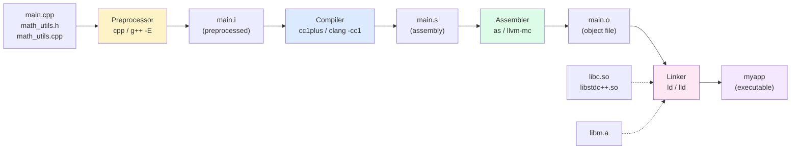
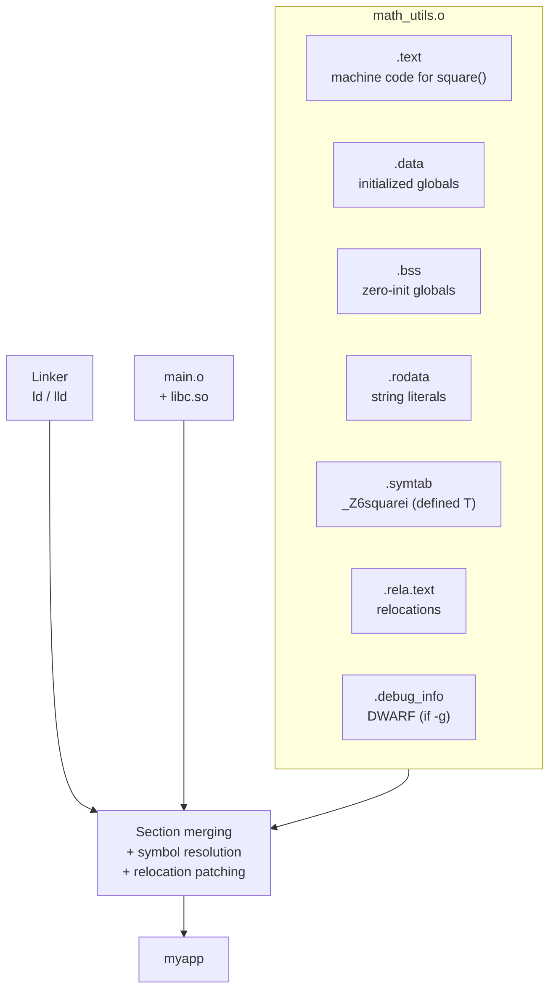

# 1. Compilation Process

> [!info] Cross-reference
> This note expands on the pipeline introduced in [[6. The Compilation Pipeline]] from Chapter 1. Read that first for the conceptual overview; here we drill into *each stage's tooling, intermediate artifacts, and the flags you actually type*.

## Why This Matters

Every C++ build — whether it is a one-file homework assignment or a 50,000-translation-unit behemoth like Chromium — funnels through the same four-stage pipeline: **preprocess → compile → assemble → link**. Build systems like Make, CMake, Ninja, Bazel, and MSBuild are, at their core, glorified schedulers that orchestrate invocations of `cc1`/`cc1plus`/`clang -cc1`, the assembler, and the linker. If you cannot mentally simulate one `g++` invocation, you cannot debug a failing CMake build, read linker errors, or profile incremental build times.

Three real-world consequences flow from understanding this pipeline:

1. **Incremental builds** only re-run stages whose inputs changed. Knowing which stage owns which artifact tells you why touching a single header can force a full rebuild.
2. **Linker errors** (`undefined reference`, `multiple definition`) are emitted only at the final stage and have nothing to do with your code's syntax. Misdiagnosing them as compile errors wastes hours.
3. **Binary size and startup time** are determined by what the linker decides to include. A stray `#include <iostream>` in a header can pull 1.8 MB of locale code into your final `.so`.

## Background

A C++ compiler driver (e.g. `g++`, `clang++`, `cl.exe`) is not a single program. It is a *dispatcher* that runs a pipeline of subprograms:

| Stage    | GNU program   | LLVM program      | Output                | Typical flag |
| -------- | ------------- | ----------------- | --------------------- | ------------ |
| Preprocess | `cpp` / `g++ -E` | `clang++ -E`      | `.i` (preprocessed C) | `-E`         |
| Compile  | `cc1plus`     | `clang -cc1` (frontend) | `.s` (assembly)       | `-S`         |
| Assemble | `as`          | `llvm-mc` / system `as` | `.o` (object file)    | `-c`         |
| Link     | `ld` / `collect2` | `lld` / system `ld`   | executable / `.so` / `.a` | *(default)*  |

The driver hides this choreography. When you type `g++ main.cpp`, all four stages run, intermediate files are placed in `/tmp`, and the final executable lands in `a.out`. The flags `-E`, `-S`, `-c` are the "stop the pipeline here" switches — they hand you the intermediate artifact instead of continuing.

## The Four Stages in Detail

### Stage 1 — Preprocessing

The preprocessor is a *purely textual* pass: it has no notion of C++ types, scopes, or templates. Its job is to produce a single self-contained translation unit by:

- Recursively inlining `#include`d files (both `<>` system headers and `""` user headers).
- Expanding object-like and function-like macros (`#define`).
- Evaluating `#if` / `#ifdef` / `#ifndef` / `#elif` / `#else` / `#endif` conditionals.
- Handling `#pragma` directives (some, like `#pragma once`, are compiler-specific).
- Removing comments (replacing them with a single space).
- Tri-graph and digraph translation (largely historical).
- Line marker insertion (so later stages can report errors in terms of original file/line).

Stop the pipeline here with `-E`:

```bash
g++ -E main.cpp -o main.i       # produce preprocessed source
wc -l main.i                    # often 30k-50k lines even for "hello world"
```

Preprocessing is the reason `#include <iostream>` "feels heavy": the entire iostream machinery (locales, facets, stream buffers) is textually pasted into your TU. The classical counter-measure is the **precompiled header** (`.gch` / `.pch`) — a serialized in-memory representation of the preprocessed header tree that the preprocessor can mmap instead of re-tokenizing.

> [!warning] The preprocessor is not C++
> Macro expansion ignores scopes and namespaces. The classic `#define min(a,b) ((a)<(b)?(a):(b))` will silently break `std::min` calls and double-evaluate arguments with side effects. Prefer `constexpr` templates; see [[4. Inline, Constexpr, Consteval]].

Useful preprocessing-only flags:

- `-DNAME[=value]` — define a macro from the command line (great for build-config toggles like `-DNDEBUG`).
- `-Uname` — undefine a macro.
- `-I<path>` — add a directory to the user-include search path.
- `-isystem <path>` — add a directory to the system-include search path (suppresses warnings from those headers).
- `-H` — print the include tree as it is parsed (invaluable for diagnosing "why is my header pulled in?").
- `-dM` — print every macro defined at the end of preprocessing.

### Stage 2 — Compilation (Proper)

This stage is what most people picture when they say "the compiler." It takes a preprocessed `.i` file and produces assembly `.s`. Internally it runs:

1. **Lexing** — source characters → tokens.
2. **Parsing** — tokens → an abstract syntax tree (AST). C++'s grammar is famously context-sensitive ("the most vexing parse"), so parsing interleaves with name lookup.
3. **Semantic analysis** — type checking, overload resolution, template instantiation, `constexpr` evaluation. This is where the bulk of C++-specific diagnostics come from.
4. **IR generation** — GCC lowers to GIMPLE; Clang lowers to LLVM IR. Both perform middle-end optimizations (inlining, constant propagation, loop transformations) on this IR.
5. **Code generation** — IR → target assembly (x86-64, ARM64, RISC-V, …).
6. **Assembly-level optimizations** — peephole, branch relaxation, register allocation.

Stop here with `-S`:

```bash
g++ -S -O2 main.cpp -o main.s
clang++ -S -O2 -fverbose-asm main.cpp -o main.s   # adds helpful comments
```

Compilation flags you will use weekly:

| Flag                       | Effect                                                            |
| -------------------------- | ---------------------------------------------------------------- |
| `-std=c++20`               | Set language standard. Add `-gnu++20` for GNU extensions.        |
| `-O0` `-O1` `-O2` `-O3` `-Os` `-Ofast` | Optimization level. `-O0` keeps variables in memory (debugger-friendly); `-O2` is the production sweet spot. |
| `-g` `-g3` `-gdwarf-5`     | Emit DWARF debug info. `-g3` includes macro definitions.         |
| `-Wall -Wextra -Wpedantic` | Warnings. Treat as required, not optional.                       |
| `-Werror`                  | Promote warnings to errors in CI.                                |
| `-Wshadow -Wconversion`    | Catch subtle bugs (variable shadowing, narrowing conversions).  |
| `-fsanitize=address,undefined` | ASan + UBSan instrumentation. Use in debug builds.          |
| `-pthread`                 | Link against the pthreads library (also a link flag).            |
| `-march=native`            | Generate code using all CPU features available on the build host. |
| `-flto`                    | Whole-program link-time optimization (also a link flag).         |

### Stage 3 — Assembly

A thin pass: translate the textual `.s` assembly into a binary **object file** `.o`. The assembler has no notion of types or scopes; it just emits machine code, fix-ups, and a **symbol table**.

```bash
g++ -c main.cpp -o main.o     # compile + assemble in one shot (the usual path)
as main.s -o main.o           # assemble an existing .s file directly
```

#### What is inside a `.o` file?

An object file (ELF on Linux, Mach-O on macOS, COFF/PE on Windows) is a container of **sections**:

- `.text` — executable machine code.
- `.data` — initialized global/static variables.
- `.bss` — zero-initialized globals (occupies no space in the file; the loader reserves it).
- `.rodata` — read-only constants (string literals, `constexpr` tables).
- `.symtab` / `.strtab` — symbol and string tables.
- `.rela.text` / `.rela.data` — **relocation entries** (placeholders the linker must patch).
- `.debug_*` — DWARF debug info sections (only with `-g`).

The most important concept is the **symbol**. A symbol is a name plus an address (or, in an object file, an address *relative to its section*). There are three flavors:

1. **Defined** — this object file *contains* the symbol's definition. The symbol is "exported."
2. **Undefined** — this object file *uses* the symbol but does not define it. The linker must find a definition elsewhere.
3. **Weak** — defined, but the linker is allowed to silently override it with a strong definition from another object file. (Used for `__attribute__((weak))`, vtables in some ABIs, and COMDAT folding of inline functions.)

Inspect symbols with `nm`:

```bash
$ nm main.o
                 U __cxa_atexit           # U = undefined (libc provided)
                 U __libc_start_main
0000000000000000 T main                    # T = defined, in .text
0000000000000000 W _Z3fooi                 # W = weak (inline function)
0000000000000000 D global_counter          # D = defined, in .data
```

The mangled name `_Z3fooi` decodes to `foo(int)`. Use `c++filt` or `nm -C` to demangle.

#### Relocations

When the compiler generates code that calls `foo()` or reads `global_counter`, it doesn't yet know the final addresses — those depend on how the linker arranges sections. So it emits a **relocation**: a note to the linker saying "patch these 4 bytes at offset N in `.text` with the address of symbol `foo`."

```bash
$ readelf -r main.o
Relocation section '.rela.text' at offset 0x... contains 3 entries:
  Offset          Info           Type           Sym. Value    Sym. Name + Addend
00000000000c  000a00000002 R_X86_64_PC32     0000000000000000 foo - 4
000000000014  00050000000b R_X86_64_PLT32    0000000000000000 std::cout - 4
```

`R_X86_64_PC32` is a 32-bit PC-relative relocation; `R_X86_64_PLT32` says "go through the procedure linkage table" (used for calls to shared libraries).

### Stage 4 — Linking

The linker takes one or more object files (and libraries) and produces the final executable or library. Its three jobs are:

1. **Symbol resolution** — for every undefined symbol in every object file, find exactly one definition across all provided inputs. Failures produce `undefined reference to foo`.
2. **Section merging** — concatenate `.text` sections, `.data` sections, etc., from all inputs into the output. COMDAT folding (used for templates and inline functions) collapses identical sections.
3. **Relocation processing** — walk every relocation entry, compute final addresses, patch the bytes in the merged sections.

Linkers come in many flavors:

- **GNU ld** — the classic System V linker.
- **GNU gold** — faster, ELF-only, less featureful (largely deprecated).
- **LLVM lld** — fast, modern, the default on macOS (`ld64`) and a common choice on Linux (`ld.lld`).
- **Microsoft link.exe** — Windows COFF/PE linker.

Stop here is impossible — linking is the final stage. But you can drive the linker directly with `ld` (rarely useful) or with `gcc`/`clang++` as a wrapper:

```bash
g++ main.o utils.o -lboost_system -lpthread -o myapp
```

#### Static vs Dynamic Linking

- **Static linking** (`libfoo.a` on Unix, `libfoo.lib` on Windows): the linker copies the *needed* object files out of the archive into your executable. The executable is self-contained but larger, and bug fixes in the library require re-linking.
- **Dynamic linking** (`libfoo.so` on Linux, `libfoo.dylib` on macOS, `foo.dll` on Windows): the linker records a dependency. At load time (or runtime via `dlopen`), the dynamic loader (`ld.so`) maps the shared library into memory and resolves symbols. The executable is smaller, multiple processes share one in-memory copy of the library, and the library can be upgraded without recompiling consumers — but you must ship the `.so` files and worry about ABI compatibility.

See [[3. Static vs Shared Libraries]] for the deep dive.

## Putting It All Together: A Three-File Example

```cpp
// math_utils.h
#pragma once
int square(int x);

// math_utils.cpp
#include "math_utils.h"
int square(int x) { return x * x; }

// main.cpp
#include <iostream>
#include "math_utils.h"
int main() { std::cout << square(7) << '\n'; }
```

Run each stage explicitly:

```bash
# 1. Preprocess
g++ -E main.cpp -o main.i
g++ -E math_utils.cpp -o math_utils.i

# 2. Compile to assembly
g++ -S main.i -o main.s
g++ -S math_utils.i -o math_utils.s

# 3. Assemble to object files
g++ -c main.s -o main.o
g++ -c math_utils.s -o math_utils.o

# 4. Link
g++ main.o math_utils.o -o myapp

./myapp    # prints 49
```

In practice you skip the `.i` and `.s` intermediates:

```bash
g++ -c main.cpp -o main.o
g++ -c math_utils.cpp -o math_utils.o
g++ main.o math_utils.o -o myapp
```

## Mermaid — The Full Pipeline



## Mermaid — Anatomy of an Object File



## Common Pitfalls

> [!danger] Undefined reference at link time
> The compiler was happy because the *declaration* in `math_utils.h` matched, but the linker cannot find the *definition*. Causes: forgot to compile `math_utils.cpp`, forgot to add it to the link line, mismatched `extern "C"` decoration, or ABI mismatch between the header and the compiled library. Diagnose with `nm math_utils.o | c++filt` — if `square(int)` is missing or has the wrong mangled name, that is your bug.

> [!danger] Multiple definition
> Two translation units define the same non-inline function or non-`inline` global variable. The ODR forbids this. Fixes: declare `inline`, move the definition to a `.cpp`, or use `static` / anonymous namespace for internal linkage. See [[2. Headers, Include Guards, Modules]].

> [!warning] "It compiles but doesn't run"
> A clean compile + link only proves the program is well-formed, not that it is correct. Logic errors, undefined behavior (`-fsanitize=undefined`), and memory bugs (`-fsanitize=address`) live entirely at runtime. See [[6. Memory Leaks and Dangling Pointers]].

> [!warning] Build succeeds on one machine, fails on another
> Almost always an include-path or library-version issue. Use `g++ -H` to print the include tree and `ldd myapp` to print shared library dependencies. Pin your toolchain in CI.

> [!warning] Precompiled headers cause subtle bugs
> A `.gch` is invalidated only when the original header's *content* changes by timestamp. If you `#define` something differently on the command line vs the PCH build, you can get ODR violations across TUs. Always rebuild PCHs in the same command as the consuming TU or with identical flags.

## Tips and Tricks

- **Inspect what the compiler actually sees** with `g++ -E -dD main.cpp | less`. The `-dD` keeps `#define` lines visible. This is the canonical way to debug "why is my macro not doing what I expect?"
- **Read assembly like a human**: `clang++ -S -O2 -fverbose-asm -mllvm --x86-asm-syntax=intel` produces annotated Intel-syntax assembly. The Godbolt Compiler Explorer does this in a browser — see [[5. Compile-time vs Runtime]].
- **Use `--save-temps`** to dump every intermediate file from a single `g++` invocation: `g++ --save-temps main.cpp`. You get `main.ii`, `main.s`, `main.o`, and `a.out` in the current directory.
- **Profile build times** with `-ftime-report` (GCC) or `-ftime-trace` (Clang). Clang's flag produces a JSON file viewable in `chrome://tracing` — it tells you per-function template instantiation costs.
- **Force a specific linker**: `g++ -fuse-ld=lld main.o -o myapp`. `lld` is often 2-5× faster than GNU `ld`.
- **Demangle on the fly**: pipe any mangled output through `c++filt`. `nm main.o | c++filt`.
- **Find which object file defines a symbol**: `nm -C --defined-only *.o | grep square`.
- **List shared library dependencies**: `ldd myapp` (Linux), `otool -L myapp` (macOS), `dumpbin /dependents myapp.exe` (Windows).
- **Verify ABI compatibility** before shipping a `.so`: `abi-compliance-checker` and `abi-dumper` produce HTML reports of changed symbols.
- **Use Unity Builds** (a.k.a. jumbo builds) to amortize preprocessing cost: concatenate all `.cpp` files into one TU. Often 3-10× faster compiles, at the cost of stricter ODR discipline.

## Active Recall

1. Name the four stages of the C++ compilation pipeline and the flag that stops the driver after each.
2. What is the difference between `-E` and `-M`? When would you use each?
3. Why does the assembler not need to know about C++ types?
4. List the four major sections of an ELF object file and what each holds.
5. What is a *relocation*? Why are they necessary?
6. Decode `nm` symbol types `T`, `U`, `W`, `D`, `B`. Which indicates an undefined reference?
7. Why does `#include <iostream>` blow up build times? Name two mitigations.
8. What does `--save-temps` produce, and why is it useful for debugging?
9. Name three differences between static and dynamic linking that affect end users.
10. Why is `g++ -fuse-ld=lld` often recommended for large projects?
11. Explain the difference between `-I`, `-isystem`, and `-iquote`.
12. What is COMDAT folding and why does it matter for templates?
13. Why can linker errors not be diagnosed from the `.cpp` source alone?
14. Give two reasons `-O0` is the default for debug builds and not just "no optimization."

## Next Steps

- Continue to [[2. Headers, Include Guards, Modules]] — the preprocessor is the largest contributor to build time, and headers are where the real fights happen.
- Then [[3. Static vs Shared Libraries]] — the linker's behavior changes dramatically when shared libraries are involved.
- Move on to [[4. Make and Makefiles]] and [[5. CMake Basics]] to see how the four-stage pipeline is automated across hundreds of TUs.
- Cross-reference [[6. The Compilation Pipeline]] in Chapter 1 for the conceptual companion, and [[5. Compile-time vs Runtime]] for why we care which stage does what.
- For runtime debugging tools, see [[6. Memory Leaks and Dangling Pointers]] in the Memory chapter.
