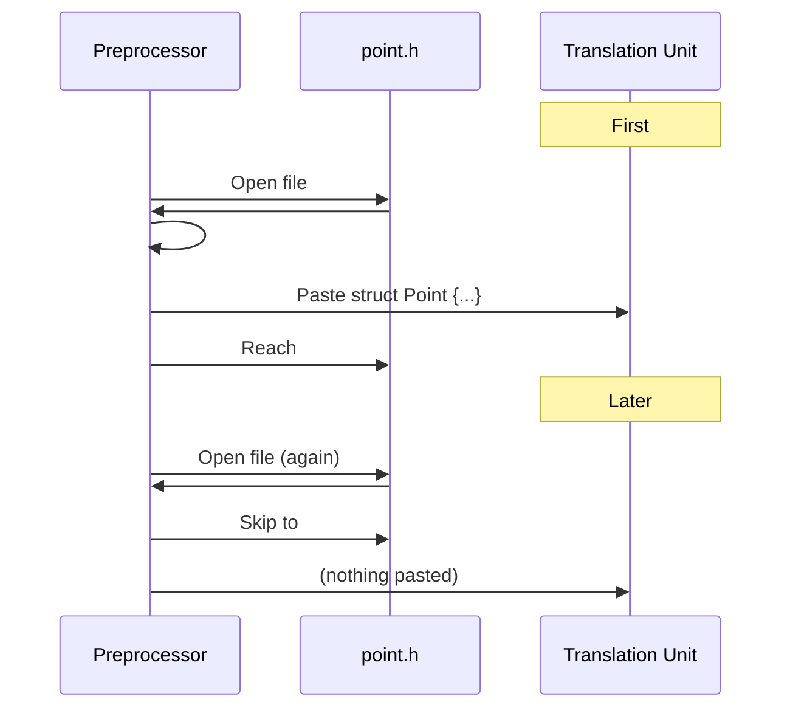
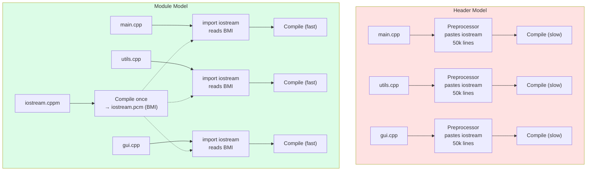

# 2. Headers, Include Guards, Modules

> [!info] Cross-reference
> This note expands the header-related discussion from [[6. The Compilation Pipeline]] in Chapter 1 and motivates the C++20 modules feature first introduced in the Modern C++ chapter.

## Why This Matters

The C++ header model is older than most C++ programmers. It was inherited from C in 1985 and is the single largest contributor to:

- **Slow builds.** A typical C++ TU preprocesses 30,000 to 50,000 lines of header content for a few hundred lines of real source. Repeating this work for every TU is what makes C++ builds slower than Go or Rust.
- **Macro pollution.** A `#define` in one header leaks into every file that includes it, even transitively. `#define` ignores namespaces and scopes.
- **Order-dependence.** Whether your code compiles can depend on which headers came before it. This is intolerable at scale.
- **ODR violations.** The One Definition Rule says each entity must have exactly one definition across the program. Headers make it trivially easy to violate ODR with careless inline definitions, template instantiations, or non-inline member functions declared in headers.

The C++20 **modules** feature was designed to fix all four problems at once. But modules are not yet universally available (compiler support landed in GCC 11+, Clang 16+, MSVC 19.30+; build-system support in CMake 3.28+). For the foreseeable future, you will use both headers and modules, so you must understand both.

## Background

### The `#include` directive

`#include` is a *preprocessor* directive, not a language feature. It performs pure textual substitution: the contents of the named file are pasted verbatim into the TU at that point. There are two forms:

```cpp
#include <header>     // search system include paths (-I, -isystem, system dirs)
#include "header"     // search the current file's directory first, then system paths
```

The exact search algorithm is implementation-defined, but the conventional behavior is:

1. For `"..."`: search the directory of the file containing the `#include` line. Then fall through to the `<>` algorithm.
2. For `<...>`: search each directory in the `-I` / `-isystem` paths in command-line order, then the compiler's built-in system directories (`/usr/include`, `/usr/local/include`, etc.).

The convention is:

- `<...>` for standard library and third-party headers you do not own.
- `"..."` for your own project's headers.

> [!tip] Quoted-include includes can find system headers too
> Many style guides (Google's, for instance) mandate that *all* project-local includes use the project's root as the include path, written as `#include "myproject/foo/bar.h"` from anywhere in the codebase. This makes refactoring moves painless.

### Why headers exist at all

C++ inherited a two-file-per-unit convention from C: a `.h` (declarations) and a `.cpp` (definitions). The motivation was 1970s memory constraints — the compiler could not hold an entire program in memory, so it processed one TU at a time and let the linker stitch them together. To compile `main.cpp` that calls `foo()` defined in `foo.cpp`, `main.cpp` needs to see `foo`'s *signature*. That signature lives in `foo.h`, which both files include.

Modern languages (Rust, Go, Swift, Java) do not have this split: the compiler reads the whole source file (or crate / module) and figures out signatures on its own. C++20 modules finally bring this to C++.

## The Multiple Inclusion Problem

Because `#include` is pure text substitution, a header pulled in twice (transitively, e.g. `a.h` → `b.h` → `a.h`) gets pasted twice. This causes redefinition errors:

```cpp
// point.h
struct Point { int x, y; };

// shape.h
#include "point.h"
struct Shape { Point center; };

// main.cpp
#include "point.h"   // first inclusion — OK
#include "shape.h"   // shape.h includes point.h again — redefinition error!
```

The fix is an **include guard** (a.k.a. macro guard, header guard).

### Pattern 1 — The Classic `#ifndef` Guard

```cpp
// point.h
#ifndef PROJECT_POINT_H
#define PROJECT_POINT_H

struct Point { int x, y; };

#endif // PROJECT_POINT_H
```

The mechanism:

1. First inclusion: `PROJECT_POINT_H` is undefined, so `#ifndef` is true. Define the macro, then process the rest of the file.
2. Second inclusion: `PROJECT_POINT_H` is now defined, so `#ifndef` is false. The entire body is skipped up to `#endif`.

The macro name must be **globally unique** across the project and any libraries you use. Conventions:

- Prefix with the project name: `MYPROJECT_POINT_H`.
- Include the path: `MYPROJECT_GEOMETRY_POINT_H`.
- Some projects use a generated hash: `POINT_H_5F3A2B`.

> [!danger] Name collisions across libraries
> If two libraries both `#define UTILS_H`, including both will silently disable the second one's content. This is why all the major libraries use long, ugly, prefixed guard names. Always prefix your project's guards.

### Pattern 2 — `#pragma once`

```cpp
// point.h
#pragma once

struct Point { int x, y; };
```

`#pragma once` is a non-standard but universally supported directive that tells the compiler "do not include this file more than once in a single TU." It is supported by GCC, Clang, MSVC, Intel, and every other compiler you will encounter. Advantages over `#ifndef` guards:

- No need to invent a unique macro name.
- Slightly faster: the compiler can skip the file entirely based on inode/identity, without even opening it (compilers maintain a "files already included" table).
- Less error-prone (no copy-paste of the wrong guard name).

Disadvantages:

- Technically non-standard (though de facto standard).
- Can fail in pathological cases involving symlinks or network filesystems where the same physical file is reachable via two paths the compiler cannot recognize as identical. In practice, this is extremely rare.

> [!tip] Modern advice
> Use `#pragma once` in new code. Use `#ifndef` guards only when you need maximum portability (e.g. header-only library consumed by exotic compilers). Many large projects (LLVM, Boost) use `#ifndef` guards for historical reasons; new sub-projects within them often mix in `#pragma once`.

### Pattern 3 — Both (defense in depth)

```cpp
// point.h
#pragma once
#ifndef PROJECT_POINT_H
#define PROJECT_POINT_H
// ... contents ...
#endif
```

This pattern appears in some safety-critical and library code. The cost is negligible and the benefit is robustness against any environment where one of the two mechanisms fails.

## The One Definition Rule (ODR)

The ODR is C++'s most important structural rule. It states:

> Every program shall contain exactly one definition of every non-inline function or variable that is odr-used; no diagnostic required.

Key points:

- **"ODR-used"** means the program takes the address of, binds a reference to, or otherwise requires the definition to exist.
- **"No diagnostic required"** means the compiler is not obligated to detect violations. If you violate ODR across TUs, you may get a linker error, you may get a runtime crash, or you may get silent corruption. **The standard imposes no requirement.**
- **Inline functions, templates, and `constexpr` variables are exempt** — they may be defined in multiple TUs *as long as every definition is token-for-token identical*.

Practical implications for headers:

```cpp
// point.h
#pragma once

struct Point {
    int x, y;
    // OK: implicitly inline (defined inside class body)
    int sum() const { return x + y; }
};

// OK: explicitly marked inline
inline int distance(const Point& a, const Point& b) {
    return (a.x - b.x) * (a.x - b.x) + (a.y - b.y) * (a.y - b.y);
}

// WRONG: not inline, will violate ODR if included in 2+ TUs
int bad_global = 42;

// WRONG: not inline, ODR violation
int bad_function(const Point& p) { return p.x + p.y; }

// OK: constexpr implies const, and const at namespace scope has internal linkage
// in C++ (and is implicitly inline since C++17)
constexpr int kMax = 100;

// OK since C++17: inline variable
inline int global_counter = 0;
```

The `inline` keyword has two meanings that are easy to confuse:

1. **ODR relaxation**: "it's OK if this appears in multiple TUs, the linker will pick one."
2. **A hint to inline-expand** (largely ignored by modern optimizers, which decide inlining based on their own heuristics).

Since C++17, `inline` works on variables too, not just functions. This is the canonical way to define a constant in a header that needs an address (e.g. `inline const std::string kVersion = "1.0";`).

## Forward Declarations vs. Includes

Often you do not need the full definition of a type — only its name. A **forward declaration** tells the compiler the name exists without showing its layout:

```cpp
// foo.h
class Bar;                  // forward declaration — no #include "bar.h" needed
class Foo {
    Bar* bar_;              // OK: pointer to incomplete type
    Bar& bar_ref_;          // OK: reference to incomplete type
    std::unique_ptr<Bar> bar_ptr_;  // OK: as long as the dtor is out-of-line
public:
    void use(Bar b);        // OK: parameter type only needs declaration
    Bar make();             // OK: return type only needs declaration
    // Bar bar_value_;      // WRONG: needs full definition (size unknown)
};
```

Forward declarations are the cheapest way to reduce include dependencies. A header that uses only `Bar*` and `Bar&` should forward-declare `Bar`, not include `bar.h`. This is the foundation of the **PImpl idiom** ("pointer to implementation"):

```cpp
// widget.h
#pragma once
#include <memory>

class Widget {
public:
    Widget();
    ~Widget();              // must be declared in header, defined in .cpp
    Widget(Widget&&) noexcept;
    Widget& operator=(Widget&&) noexcept;
private:
    class Impl;
    std::unique_ptr<Impl> impl_;
};

// widget.cpp
#include "widget.h"
#include "expensive_lib.h"   // private dependency, hidden from consumers

class Widget::Impl {
    // ... lots of private state using expensive_lib ...
};

Widget::Widget() : impl_(std::make_unique<Impl>()) {}
Widget::~Widget() = default;            // defined here so Impl is complete
Widget::Widget(Widget&&) noexcept = default;
Widget& Widget::operator=(Widget&&) noexcept = default;
```

PImpl gives you:

- **ABI stability**: changing `Widget::Impl` does not change `sizeof(Widget)`, so consumers do not need to recompile.
- **Faster builds**: consumers of `widget.h` never see `expensive_lib.h`.
- **True encapsulation**: the private members are not even visible in the header.

Costs: one extra heap allocation per Widget, one extra pointer indirection per call.

## C++20 Modules

Modules replace the preprocessor-based include model with a semantic one. A module is a named unit of compilation that explicitly declares what it exports.

### Module syntax

```cpp
// math.cppm  (module interface unit — note the .cppm extension is conventional)
export module math;

export int square(int x) { return x * x; }      // exported: visible to importers
int helper(int x) { return x * x * x; }         // not exported: module-internal

// main.cpp
import math;
int main() {
    return square(7);     // OK, exported
    // return helper(7);  // ERROR: helper not exported
}
```

Three kinds of module units:

1. **Module interface unit** (`export module foo;`): declares the module and its exports. Compiles to a `.pcm` / `.gcm` / `.ifc` file (compiler-specific binary format).
2. **Module implementation unit** (`module foo;` without `export`): can see the module's non-exported declarations but does not add to its interface.
3. **Module partition** (`export module foo:part;`): a sub-module that can be composed into the primary interface with `import :part;`.

A module can span multiple files via partitions and header units, and can import other modules.

### Building with modules

Modules fundamentally break the Make / CMake "compile each `.cpp` independently" model. The compiler must compile `math.cppm` first, producing a binary module interface (BMI), before it can compile any `main.cpp` that does `import math`. This is a topological dependency that classical build systems cannot infer from file timestamps alone.

```bash
# GCC
g++ -std=c++20 -fmodules-ts -c math.cppm -o math.gcm    # produces BMI
g++ -std=c++20 -fmodules-ts -c main.cpp -o main.o       # uses BMI
g++ main.o -o myapp

# Clang
clang++ -std=c++20 --precompile math.cppm -o math.pcm
clang++ -std=c++20 -fprebuilt-module-path=. -c main.cpp -o main.o

# MSVC
cl /std:c++20 /interface /c math.ifx    # produces .ifc and .obj
cl /std:c++20 /reference math=math.ifc /c main.cpp
```

CMake 3.28+ added first-class module support; older CMake requires `CMAKE_EXPERIMENTAL_CXX_MODULE_CMAKE_API` opt-in. As of 2025, large-scale module adoption is still rare in production because the toolchain story is immature.

### Modules vs Headers

| Aspect                | Headers (`#include`)              | Modules (`import`)                |
| --------------------- | --------------------------------- | --------------------------------- |
| Mechanism             | Textual paste                    | Semantic, binary interface file    |
| Same TU, multiple times | Re-preprocessed (guarded away) | Imported once, cached             |
| Build speed           | Slow (re-parse everything)        | Fast (BMI is read once)           |
| Macros                | Leak across includes              | Do not leak (clean boundary)      |
| Include order         | Matters (can break builds)        | Does not matter                   |
| Need include guards   | Yes                              | No                                |
| Need forward decls    | Often                            | Less often (export what you need) |
| Tooling maturity      | 40 years, rock-solid             | Still maturing (CMake 3.28+)      |
| ABI stability         | Fragile (header changes rebuild) | Better (BMI carries signatures)   |

### Header units (a bridge)

C++20 also defines **header units**: `import <iostream>;` instead of `#include <iostream>`. This converts an existing header into a module-like unit. It is a transition path for legacy code but inherits many of the same limitations.

## Mermaid — Include Guard Mechanism



## Mermaid — Modules vs Headers Comparison



## Common Pitfalls

> [!danger] Missing include guard
> A header without a guard (or `#pragma once`) will trigger redefinition errors when included transitively. The error message ("redefinition of struct Point") is confusing because it points to the line in the header, not the include chain. Always start new headers with `#pragma once` before writing anything else.

> [!danger] Pragma once with symlinks
> On some filesystems, two paths to the same physical file (via symlinks or bind mounts) are treated as different files by `#pragma once`, leading to duplicate inclusion. Fix with `#ifndef` guards or by avoiding symlinked include trees.

> [!danger] ODR violation via inline function with different definitions
> If `inline int foo()` is defined differently in two TUs (e.g. one was edited but the other's build was skipped), behavior is undefined. Always rebuild from clean when modifying inline functions or templates. CI should detect this with `g++ -fno-merging-namespace-scope` or similar strict checks.

> [!warning] Include what you use
> A common build-robustness bug: file `a.cpp` happens to compile because `b.h` transitively pulled in `vector`, but you never `#include <vector>` directly. Then someone refactors `b.h` to drop the include and `a.cpp` breaks. Use the `include-what-you-use` tool (built on Clang) to enforce direct includes.

> [!warning] Cyclic dependencies between headers
> If `a.h` includes `b.h` and `b.h` includes `a.h`, include guards prevent an infinite loop, but one of the two will see an incomplete type on first pass. The cure is forward declarations plus moving the include to the `.cpp`. This is a structural problem, not a syntax problem.

> [!warning] Macro collisions across libraries
> Two libraries both `#define SMALL 1`. Including both silently disables the second's enum or constant. Always prefix macros (`MYLIB_SMALL`), prefer `constexpr` over `#define`, and use `#undef` cautiously.

## Tips and Tricks

- **Always use `#pragma once` in new code** unless you have a specific reason not to.
- **Prefix include guard macros** with the project name and path: `MYPROJ_NET_HTTP_SERVER_H`.
- **Forward-declare aggressively.** The PImpl idiom can cut compile times by 30-60% in template-heavy code.
- **Use the PImpl idiom** for any class whose private members depend on libraries you do not want to leak into your public API.
- **Run `include-what-you-use`** in CI. It catches both missing and unnecessary includes.
- **For C++20 modules**, start with header units (`import <vector>;`) as a low-risk migration path before converting your own headers to modules.
- **Measure include cost**: `g++ -H -c main.cpp 2>&1 | grep -c '\.'` counts the number of headers pulled in. A typical project TU should pull in fewer than 200 headers; if it pulls in 1000+, you have a build-time problem.
- **Use precompiled headers** for stable, heavyweight headers like `<iostream>`, `<vector>`, `<boost/...>`. PCHs can cut build time by 30-70% for header-heavy projects. CMake: `target_precompile_headers(target PRIVATE [["common.h"]])`.
- **Avoid `using namespace std;` in headers.** It pollutes every consumer's global namespace and can cause silent ambiguity.
- **Mark single-translation-unit helpers `static` or in an anonymous namespace** to give them internal linkage. This avoids polluting the global symbol space and lets the optimizer inline them aggressively.
- **Use `inline` for free functions defined in headers**, not just for member functions. Without `inline`, you get ODR violations.

## Active Recall

1. What is the difference between `#include <foo.h>` and `#include "foo.h"`?
2. Why are include guards necessary? What problem do they solve?
3. Give two advantages and one disadvantage of `#pragma once` over `#ifndef` guards.
4. State the One Definition Rule in your own words.
5. What does "no diagnostic required" mean? Why is it dangerous?
6. Which kinds of definitions are exempt from the ODR's "exactly one definition" rule, and what condition must they satisfy instead?
7. Explain the two meanings of the `inline` keyword.
8. What is a forward declaration? When can you use one in place of an `#include`?
9. Describe the PImpl idiom. What benefits does it provide? What does it cost?
10. Why do C++20 modules require a topological build order that classical Make cannot infer?
11. Name three things modules solve that headers do not.
12. What is a module interface unit? A module implementation unit? A module partition?
13. What is a header unit, and why was it added to C++20?
14. Why is `using namespace std;` in a header considered bad practice?

## Next Steps

- Continue to [[3. Static vs Shared Libraries]] — once you understand how headers compose across TUs, the next question is how compiled code is bundled and consumed.
- Then [[4. Make and Makefiles]] for the canonical way to drive multi-file builds.
- Cross-reference [[6. The Compilation Pipeline]] in Chapter 1 for the high-level pipeline of which headers are a part.
- See [[7. Project Structure]] for how to lay out headers vs sources in a real codebase.
- For more on PImpl and ABI stability, see the OOP chapter.
- For modern C++ features like `constexpr`, `consteval`, and `constinit`, see [[4. Inline, Constexpr, Consteval]].
