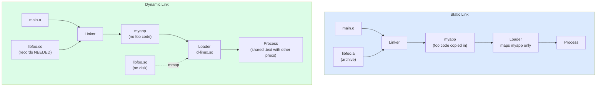
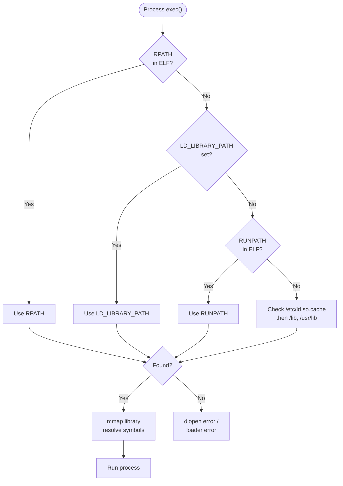

# 3. Static vs Shared Libraries

> [!info] Cross-reference
> This note extends the linking discussion from [[1. Compilation Process]] and [[6. The Compilation Pipeline]]. Read those first for the basics of symbol resolution and relocation.

## Why This Matters

Choosing between static and shared libraries is one of the few architectural decisions in C++ that you cannot easily reverse. It affects:

- **Binary size** (and the size of every dependent).
- **Startup time** (shared libraries must be relocated at load time).
- **Memory footprint across processes** (shared libs can be mmap'd read-only and shared between processes; static libs cannot).
- **Update-ability** (a shared library can be patched without recompiling consumers; a static library requires re-linking).
- **Security posture** (a vulnerable shared lib on `LD_LIBRARY_PATH` is an attack surface; a static lib is baked in).
- **Distribution** (shipping an executable plus N `.so` files vs a single self-contained binary).
- **ABI stability requirements** (shared lib authors must commit to ABI; static lib authors only need source compatibility).

Real-world examples:

- **`libc` is almost always shared** so the kernel and every process can share one in-memory copy.
- **`libstdc++` is shared** for the same reason, but you can statically link it (`-static-libstdc++`) for portable single-binary distribution.
- **CUDA / cuDNN ship as shared libs** because the ABI is enormous and changes per driver version.
- **`fmt` and many header-only Boost libs are typically static** because their code is small and per-TU inlining helps optimization.
- **Game engines ship statically** to prevent tampering and ensure reproducible performance.

## Background

A **library** is just a collection of object files packaged for convenient reuse. Two packaging schemes exist:

1. **Static archive** (`.a` on Unix, `.lib` on Windows): created by the `ar` archiver. It is literally a concatenation of `.o` files with an index of symbols. The linker pulls out only the `.o` files that resolve undefined symbols (this is the **extract rule**).
2. **Shared object** (`.so` on Linux, `.dylib` on macOS, `.dll` on Windows): a single ELF/Mach-O/PE file that can be mapped into a process at load time or runtime. The dynamic linker (`ld.so` / `dyld` / the Windows loader) resolves symbols at process start.

There is also a third flavor, **header-only libraries** (e.g. many Boost libs, `fmt` before 9.x, `nlohmann/json`). These are not really libraries at all — every consumer compiles the code into its own binary. They are statically linked by definition, but with per-TU code duplication unless templates or `inline` functions are used.

## Static Libraries in Detail

### Creating one

```bash
# Compile sources to objects
g++ -c math_utils.cpp -o math_utils.o
g++ -c string_utils.cpp -o string_utils.o

# Archive into libmyutils.a
ar rcs libmyutils.a math_utils.o string_utils.o
```

The `ar` flags:

- `r` — insert/replace files in the archive.
- `c` — create the archive silently (do not print "creating archive").
- `s` — write the symbol index (the `ranlib` step that older Unix required separately; without `s`, the linker cannot use the archive).

Verify:

```bash
ar t libmyutils.a          # list members
nm -s libmyutils.a | head  # show symbol index
```

### Linking against a static library

```bash
g++ main.cpp -L. -lmyutils -o myapp
```

- `-L.` adds the current directory to the library search path.
- `-lmyutils` looks for `libmyutils.a` (or `libmyutils.so` if both exist, prefer `.so` unless `-static` is given).

The linker's **extract rule**: walk the command-line libraries in order. For each, pull out only those `.o` files that resolve currently-undefined symbols. This means **order matters**: if `main.cpp` references `libA`, and `libA` references `libB`, you must write `-lA -lB`, not `-lB -lA`. With circular dependencies, use `-Wl,--start-group -lA -lB -Wl,--end-group`.

### Pros and cons

| Pro                                          | Con                                                         |
| -------------------------------------------- | ----------------------------------------------------------- |
| Self-contained binary; no runtime deps       | Larger executable                                           |
| No load-time relocation overhead             | Bug fix in library requires full rebuild of consumers       |
| Easier cross-platform distribution           | Multiple binaries each carry their own copy (memory waste)  |
| Optimizer sees all code at link time (LTO)   | Reproducible builds harder if library changes per machine   |
| No ABI compatibility headaches               | Cannot upgrade library without re-deploying binary          |

## Shared Libraries in Detail

### Position-Independent Code (PIC)

Shared library code is mapped at a runtime-determined address. Direct absolute addressing would require the loader to patch every instruction that references a global, which is expensive and breaks page sharing (the kernel shares mmap'd pages between processes only if they are unmodified). The fix is **position-independent code**: every reference to a global is indirected through the GOT (Global Offset Table), and every call through a function goes through the PLT (Procedure Linkage Table). These tables live in writable data pages, one set per process.

Compile objects with `-fPIC` (or `-fpic` for smaller but more limited GOTs on some platforms):

```bash
g++ -c -fPIC math_utils.cpp -o math_utils.o
g++ -c -fPIC string_utils.cpp -o string_utils.o
g++ -shared -o libmyutils.so math_utils.o string_utils.o
```

> [!warning] Linking non-PIC objects into a shared lib
> On x86-64 you can sometimes get away with it (the linker emits text relocations). On ARM64 or with hardened kernels (`-Wl,-z,relro -Wl,-z,now`), it will fail outright. Always use `-fPIC` for objects destined for a `.so`.

### The `-shared` link

`g++ -shared` invokes the linker with `-shared` (ELF) / `-dynamiclib` (Mach-O) / `/DLL` (PE). The output is an ELF shared object that can be:

- Linked into an executable (records a `NEEDED` entry).
- Loaded at runtime with `dlopen` / `LoadLibrary` / `dlsym`.

### SONAME and versioning

Every shared library has a **SONAME** (shared object name), embedded in the file. The conventional Linux naming scheme is:

```
libfoo.so          → symlink to libfoo.so.1
libfoo.so.1        → symlink to libfoo.so.1.2 (the SONAME)
libfoo.so.1.2      → symlink to libfoo.so.1.2.3
libfoo.so.1.2.3    → the actual file
```

- The **real file** carries the full version (1.2.3).
- The **SONAME** is `libfoo.so.1` — the ABI major version. The linker records *this name* in the executable's `NEEDED` entry.
- The unversioned `libfoo.so` symlink is the **development symlink**, used only at link time.

The SONAME is set at link time:

```bash
g++ -shared -Wl,-soname,libfoo.so.1 -o libfoo.so.1.2.3 ...
```

You can inspect the SONAME embedded in a library:

```bash
readelf -d libfoo.so.1.2.3 | grep SONAME
```

And the libraries an executable depends on:

```bash
readelf -d myapp | grep NEEDED
ldd myapp                       # human-readable form
```

The convention: bump the SONAME major version (1 → 2) when you make an **ABI-breaking change** (changed function signatures, changed struct layout, removed symbols). Patch releases and minor additions can keep the same SONAME.

### Runtime search path

When a process starts, the dynamic linker searches for `NEEDED` libraries in:

1. `RPATH` (deprecated; baked into the executable; cannot be overridden by env).
2. `LD_LIBRARY_PATH` (environment variable; unsafe in production).
3. `RUNPATH` (modern; baked into the executable; can be overridden by `LD_LIBRARY_PATH`).
4. The default system paths: `/lib`, `/usr/lib`, `/etc/ld.so.cache` lookup.

Set `RUNPATH` at link time:

```bash
g++ main.cpp -L. -lfoo -Wl,-rpath,/opt/myapp/lib -o myapp
# Or relative to the executable location (handy for relocatable bundles):
g++ main.cpp -L. -lfoo -Wl,-rpath,'$ORIGIN/lib' -o myapp
```

`$ORIGIN` is a special token the dynamic linker expands to the directory containing the executable. It is the standard way to ship "self-contained" application bundles on Linux without touching system paths.

Inspect:

```bash
readelf -d myapp | grep -E 'RPATH|RUNPATH'
```

> [!tip] Prefer RUNPATH over RPATH
> Use `-Wl,--enable-new-dtags` (default on modern distros) to emit `RUNPATH` instead of `RPATH`. RUNPATH is overrideable and is the modern standard.

> [!danger] Security: LD_LIBRARY_PATH
> Never rely on `LD_LIBRARY_PATH` in production. Any user who can set it can override your libraries with malicious ones. Set RPATH/RUNPATH at link time instead. See the chapter on Security.

### `dlopen` runtime loading

```cpp
#include <dlfcn.h>
#include <iostream>

int main() {
    void* handle = dlopen("./libfoo.so", RTLD_NOW);
    if (!handle) { std::cerr << dlerror() << '\n'; return 1; }

    using foo_t = int(*)(int);
    auto* foo = reinterpret_cast<foo_t>(dlsym(handle, "foo"));
    if (!foo) { std::cerr << dlerror() << '\n'; return 1; }

    std::cout << foo(7) << '\n';
    dlclose(handle);
}
```

Compile with `-ldl`. Use `RTLD_NOW` to resolve all symbols at load time (fail fast) or `RTLD_LAZY` to resolve on first use (faster startup, possible late failures).

### Cross-platform caveats

| Platform | Suffix     | Compile PIC flag | Link flag                | Loader         |
| -------- | ---------- | ---------------- | ------------------------ | -------------- |
| Linux    | `.so`      | `-fPIC`          | `-shared`                | `ld-linux.so`  |
| macOS    | `.dylib`   | `-fPIC` (always) | `-dynamiclib`            | `dyld`         |
| Windows  | `.dll` + `.lib` (import lib) | `/LD`            | `/LD` (cl) / `-shared` (mingw) | Windows loader |
| MinGW    | `.dll` + `.dll.a` | `-fPIC` (always on x86-64) | `-shared`              | Windows loader |

Windows is unique in requiring an **import library** (`.lib` or `.dll.a`) — a small static archive containing the PLT stubs that the linker needs to resolve symbols at link time. The actual code lives in the `.dll` at runtime. Tools like `dlltool` (MinGW) or `dumpbin /exports` + `lib /def` (MSVC) generate the import library from a `.dll`.

### Symbol visibility

By default, every symbol in a `.so` is exported. This pollutes the symbol table and risks collisions with other libraries. Best practice: compile with `-fvisibility=hidden` and explicitly mark exported symbols:

```cpp
#if defined(_WIN32)
  #define MYLIB_EXPORT __declspec(dllexport)
#else
  #define MYLIB_EXPORT __attribute__((visibility("default")))
#endif

class MYLIB_EXPORT Calculator {
public:
    int add(int a, int b);
};
```

On Linux, you can also use a **version script** (`-Wl,--version-script,libfoo.ver`) to declaratively control which symbols are exported.

## Mermaid — Static vs Dynamic Linking at Load Time



## Mermaid — Shared Library Search Path (Load Time)



## Building a Shared Library — End-to-End Example

Project layout:

```
mylib/
├── include/mylib/calculator.h
├── src/calculator.cpp
└── Makefile
```

```cpp
// include/mylib/calculator.h
#pragma once

#if defined(_WIN32)
  #ifdef MYLIB_BUILDING
    #define MYLIB_API __declspec(dllexport)
  #else
    #define MYLIB_API __declspec(dllimport)
  #endif
#else
  #define MYLIB_API __attribute__((visibility("default")))
#endif

class MYLIB_API Calculator {
public:
    int add(int a, int b) const;
    int divide(int a, int b) const;  // throws on b == 0
};
```

```cpp
// src/calculator.cpp
#include "mylib/calculator.h"
#include <stdexcept>

int Calculator::add(int a, int b) const { return a + b; }
int Calculator::divide(int a, int b) const {
    if (b == 0) throw std::runtime_error("divide by zero");
    return a / b;
}
```

```makefile
# Makefile
CXX      ?= g++
CXXFLAGS  = -std=c++20 -Wall -Wextra -O2 -fPIC -fvisibility=hidden \
            -Iinclude -DMYLIB_BUILDING
LDFLAGS   = -shared -Wl,-soname,libmylib.so.1

VERSION   = 1.0.0
MAJOR     = 1
LIBNAME   = libmylib.so

all: $(LIBNAME).$(MAJOR).$(VERSION)

$(LIBNAME).$(MAJOR).$(VERSION): src/calculator.cpp
	$(CXX) $(CXXFLAGS) $(LDFLAGS) -o $@ $<
	ln -sf $@ $(LIBNAME).$(MAJOR)
	ln -sf $(LIBNAME).$(MAJOR) $(LIBNAME)

install: all
	install -Dm755 $(LIBNAME).$(MAJOR).$(VERSION) \
	    $(DESTDIR)/usr/lib/$(LIBNAME).$(MAJOR).$(VERSION)
	ln -sf $(LIBNAME).$(MAJOR).$(VERSION) $(DESTDIR)/usr/lib/$(LIBNAME).$(MAJOR)
	ln -sf $(LIBNAME).$(MAJOR) $(DESTDIR)/usr/lib/$(LIBNAME)
	install -Dm644 include/mylib/calculator.h \
	    $(DESTDIR)/usr/include/mylib/calculator.h
	ldconfig
```

Consumer:

```bash
g++ app.cpp -I/usr/include -L/usr/lib -lmylib -o myapp
ldd myapp          # → libmylib.so.1 => /usr/lib/libmylib.so.1
```

## Common Pitfalls

> [!danger] Forgetting -fPIC
> The error is usually `relocation R_X86_64_32 against `.text' can not be used when making a shared object; recompile with -fPIC`. Re-compile every object that goes into the `.so` with `-fPIC`. Some distros now ship PIC-only compilers (Debian's `gcc` defaults to PIC), so this is rarer than it used to be.

> [!danger] Missing SONAME
> Without `-Wl,-soname,...`, the linker records the full filename you passed (`libfoo.so.1.2.3`) in the consumer's `NEEDED` entry, which breaks upgrades. Always set the SONAME.

> [!danger] Cannot open shared object file
> The dynamic loader cannot find your library at runtime. Diagnose with `ldd myapp` (look for "not found"), then fix by installing the library to a system path, setting `RUNPATH`, or (last resort) exporting `LD_LIBRARY_PATH` in a wrapper script.

> [!danger] Symbol versioning mismatches
> Your library was built against `libfoo.so.1`, but the user has `libfoo.so.2` installed. You will see `symbol lookup error: undefined symbol: ...`. This is why we have SONAMEs — a mismatch should fail at load time, not silently bind to the wrong library.

> [!warning] Static + shared mix
> Linking the same library both statically and dynamically into the same process (e.g. your `.so` and your executable both contain `libfoo.a`) leads to two copies of every static variable, two vtables, and bizarre identity bugs. Use one or the other, never both.

> [!warning] C++ ABI across compiler versions
> `libstdc++.so.6` has been ABI-stable for over a decade, but cross-vendor ABI (e.g. between libstdc++ and libc++) is not guaranteed. If you ship a `.so` built with Clang/libc++ to a GCC/libstdc++ consumer, you will see link errors around `std::string` and `std::vector`. Test with the consumer's toolchain.

> [!warning] Global constructors in shared libs
> Static initializers in a `.so` run at `dlopen` time, not at process start. If a global object's constructor throws, `dlopen` fails. Be wary of non-trivial globals in shared libraries.

## Tips and Tricks

- **Use `-fvisibility=hidden` by default** and explicitly export only the public API. This shrinks the `.so`, speeds up loading, and prevents accidental ABI exposure.
- **Generate the export list automatically** with `nm` + a version script: `nm -C --defined-only libfoo.so | grep ' T ' | awk '{print $3}'`.
- **Track ABI changes** with `abi-tracker` and `abi-compliance-checker`. Bump the SONAME on any break.
- **Use `-Wl,-z,defs`** when building a `.so` to fail if any symbol is undefined. This catches missing dependencies early.
- **Use `-Wl,-z,now` (BIND_NOW)** for full RELRO — resolves all PLT entries at load time, eliminating a common ROP-gadget attack surface.
- **Use `-Wl,--as-needed`** to drop libraries from the `NEEDED` list if no symbols are actually used. Prevents spurious runtime dependencies.
- **Ship with `chrpath`** or `patchelf` to fix RPATH/RUNPATH post-build, useful for repackaging.
- **Static-link libstdc++ for portable binaries** with `-static-libstdc++ -static-libgcc`. Combine with `-static` for a fully static binary (but you lose NSS plugins, locale, and dlopen).
- **Use `LD_DEBUG=files ldd ./myapp`** to see every file the loader opens. `LD_DEBUG=bindings` shows every symbol resolution.
- **Cross-compile** with `--sysroot` and a target triplet; see [[2. GCC and g++]].
- **Use `-Wl,-Map,myapp.map`** to dump a link map showing where every symbol landed. Indispensable for size optimization.
- **For plugins**, use `dlopen` with `RTLD_NOW | RTLD_LOCAL` (do not pollute the global symbol namespace). Plugin discovery via `extern "C"` factory functions avoids C++ name mangling.

## Active Recall

1. What is the difference between `.a` and `.so` files at the file-format level?
2. Why must objects destined for a shared library be compiled with `-fPIC`?
3. Explain the SONAME convention. What are the three filenames typically used, and what does each point to?
4. When the dynamic linker resolves a `NEEDED` library, in what order does it search?
5. What is `$ORIGIN` and why is it useful?
6. Why is `LD_LIBRARY_PATH` considered unsafe in production?
7. What does `-fvisibility=hidden` do? Why is it the recommended default?
8. Describe the extract rule for static libraries. Why does command-line order matter?
9. What is an import library on Windows, and why is it needed?
10. Give two reasons to bump the SONAME major version.
11. What does `-Wl,-z,now` do, and what security benefit does it provide?
12. Explain why mixing a library's static and shared forms in one process is dangerous.
13. How would you inspect the libraries an executable depends on at runtime?
14. What is a version script, and when would you use one?

## Next Steps

- Continue to [[4. Make and Makefiles]] for the canonical way to automate multi-library builds.
- Then [[5. CMake Basics]] and [[6. CMake Advanced]] for the modern way to declare and build libraries.
- For runtime plugin loading with `dlopen`, see [[4. Function Basics]] and the OOP chapter.
- For ABI stability techniques (PImpl, hidden visibility), see [[2. Headers, Include Guards, Modules]] and the OOP chapter.
- For security implications of `LD_LIBRARY_PATH`, see the Security chapter.
- For symbol versioning in depth, the Linux Program Library HOWTO and the GNU ld manual are the canonical references.
