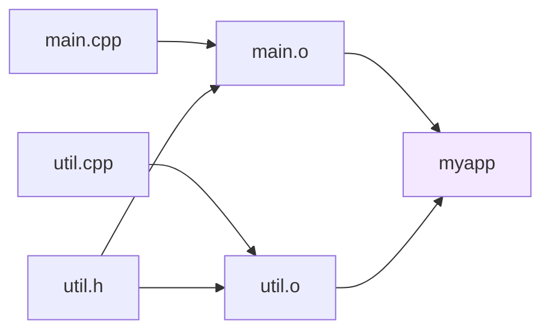
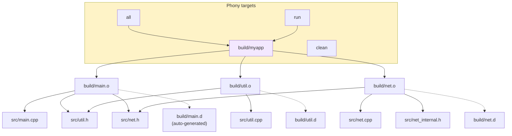

# 4. Make and Makefiles

> [!info] Cross-reference
> The Makefile example in [[2. GCC and g++]] from Chapter 1 introduced the basic skeleton. Here we drill into every construct, the implicit rules, the automatic variables, and the failure modes that bite every C++ developer at least once.

## Why This Matters

`make` is the oldest surviving build tool in widespread use (Stuart Feldman, 1976, Bell Labs). It is also the lingua franca of C and C++ builds: every other build system you will encounter — CMake, Autotools, Meson, Bazel — eventually emits a Makefile (or Ninja file) under the hood. Knowing Make means you can:

- Read the build commands that CMake generates, which is essential for debugging.
- Hand-write a build for a small project in 30 seconds without ceremony.
- Understand the historical reason behind every "modern" build feature (target-based, dependency scanning, phony targets).
- Diagnose the most common build failure: "I changed a header and `make` didn't rebuild."

Make is also a great example of a **declarative, dependency-driven** tool — the same conceptual model that powers spreadsheets, build systems, and reactive programming frameworks. Understanding its model transfers to many other tools.

## Background

Make solves two problems:

1. **Avoiding redundant work.** If you have 200 source files and you edited one, you do not want to recompile all 200. Make tracks file timestamps and rebuilds only what is out-of-date.
2. **Encoding build knowledge.** The commands and flags required to build a project are written down once, in a `Makefile`, rather than re-typed by every developer.

The mental model: a Makefile is a graph of **targets** and **prerequisites**. Each target has a **recipe** — a shell command — that runs when the target is older than any of its prerequisites.



## Anatomy of a Rule

```makefile
target: prerequisites
	recipe
```

- **Target** — usually a file name, but can be a phony label like `clean` or `all`.
- **Prerequisites** — files (or other targets) the target depends on.
- **Recipe** — one or more shell command lines, **each preceded by a TAB character** (not spaces!). This is Make's most famous gotcha.

When you run `make target`, Make:

1. Recursively builds each prerequisite (depth-first).
2. Compares the target's modification time against each prerequisite's. If the target is missing or older than any prerequisite, run the recipe.

## Variables

Make variables are textual substitution (think preprocessor macros, not C++ variables). Define with `=`, `:=`, `?=`, or `+=`, and reference with `$(VAR)` or `${VAR}`.

```makefile
CXX      = g++                       # recursive expansion (lazy)
CXXFLAGS := -std=c++20 -Wall -Wextra # immediate expansion (eager)
CXXFLAGS += -O2                      # append
DEBUG   ?= 0                         # only set if not already in environment
```

- `=` — recursively expanded; the right-hand side is re-evaluated every time the variable is used. Slow and surprising.
- `:=` — simply expanded; the right-hand side is evaluated once, at the point of definition. Preferred.
- `?=` — set only if undefined; useful for overridable defaults like `CXX ?= g++`.
- `+=` — append (works on both `=` and `:=` variables).

Variables can come from the command line (`make CXX=clang++`), the environment, or the Makefile. Command-line values override Makefile assignments; you can override command-line values with `override VAR = ...` inside the Makefile.

## Automatic Variables

These are the heart of concise Makefiles. They are set per-recipe and refer to the current rule's elements.

| Variable | Meaning                                                        |
| -------- | -------------------------------------------------------------- |
| `$@`     | The target name.                                               |
| `$<`     | The first prerequisite.                                        |
| `$^`     | All prerequisites, deduplicated.                               |
| `$+`     | All prerequisites, with duplicates (rarely used).              |
| `$?`     | Prerequisites newer than the target (the ones that triggered the rebuild). |
| `$*`     | The stem of a pattern rule (the `%` match).                    |
| `$$`     | A literal `$` (for shell variables in recipes).                |

Example:

```makefile
main.o: main.cpp util.h
	g++ -std=c++20 -c $< -o $@
# Equivalent to: g++ -std=c++20 -c main.cpp -o main.o
```

## Pattern Rules

Pattern rules use `%` as a wildcard. They are how you avoid writing one rule per source file.

```makefile
%.o: %.cpp
	$(CXX) $(CXXFLAGS) -c $< -o $@
```

This rule says: "any file ending in `.o` can be built from the file with the same stem ending in `.cpp`." When Make needs to build `main.o`, it looks for a rule that matches, finds this pattern, and applies it with the stem `main`.

You can chain patterns:

```makefile
%.o: %.cpp
	$(CXX) $(CXXFLAGS) -c $< -o $@

%.s: %.cpp
	$(CXX) $(CXXFLAGS) -S $< -o $@

%: %.o
	$(CXX) $(LDFLAGS) $^ -o $@
```

## Implicit Rules

GNU Make has built-in implicit rules. If you write `main: main.o`, Make will use its built-in `%.o: %.cpp` rule with default flags (`CXX=cc` and `CXXFLAGS=` — note: `cc`, not `g++`). This is convenient but error-prone: the default flags are minimal. Always override `CXX`, `CXXFLAGS`, and `LDFLAGS` explicitly.

To see all built-in rules: `make -p | less`.

## Phony Targets

A target that is not a file (e.g. `clean`, `all`, `test`, `install`) is **phony**. Declare it with `.PHONY`:

```makefile
.PHONY: all clean test install

all: myapp

clean:
	rm -f $(OBJS) $(TARGET)

test: myapp
	./myapp --run-tests
```

Why `.PHONY`? If a file named `clean` happened to exist in your directory, Make would see the `clean` target as up-to-date and skip the recipe. `.PHONY` forces Make to always run the recipe.

## A Complete Modern Makefile

Here is the canonical template that scales from 2 to 200 files:

```makefile
# --- Configuration ---
CXX      ?= g++
CXXFLAGS := -std=c++20 -Wall -Wextra -Wpedantic -Wshadow -Wconversion \
            -g -O0 -fsanitize=address,undefined
LDFLAGS  := -fsanitize=address,undefined -lpthread

# --- Source discovery ---
SRCDIR    := src
BUILDDIR  := build
TARGET    := $(BUILDDIR)/myapp

SRCS      := $(wildcard $(SRCDIR)/*.cpp)
OBJS      := $(patsubst $(SRCDIR)/%.cpp,$(BUILDDIR)/%.o,$(SRCS))
DEPS      := $(OBJS:.o=.d)

# --- Default target ---
.PHONY: all clean run
all: $(TARGET)

# --- Link ---
$(TARGET): $(OBJS)
	@mkdir -p $(@D)
	$(CXX) $(LDFLAGS) $^ -o $@

# --- Compile (with header dependency tracking) ---
$(BUILDDIR)/%.o: $(SRCDIR)/%.cpp
	@mkdir -p $(@D)
	$(CXX) $(CXXFLAGS) -MMD -MP -c $< -o $@

-include $(DEPS)

# --- Convenience targets ---
run: $(TARGET)
	$(TARGET)

clean:
	rm -rf $(BUILDDIR)
```

Dissecting this:

- `wildcard` and `patsubst` are Make functions for file globbing and text substitution. They run at Makefile-parse time.
- `@mkdir -p $(@D)` creates the build directory on demand. The `@` suppresses the echo.
- `-MMD -MP` makes the compiler emit a `.d` file per `.o`, listing the headers it depends on. `-include $(DEPS)` pulls these in. **This is the only correct way to track header dependencies in Make.** Without it, changing a header does not trigger recompiles.
- `$(@D)` is the directory part of `$@`.
- `clean` removes the entire `build/` tree.

## Header Dependency Tracking

Without `-MMD -MP`, this scenario breaks:

1. Edit `util.h` (add a new field to a struct).
2. Run `make`.
3. `make` sees `main.o` is newer than `main.cpp`, so it does not recompile.
4. The executable is built from stale `main.o` that still uses the old `util.h` layout.
5. **Undefined behavior at runtime** — usually a crash, often silent corruption.

The `-MMD -MP` flags solve this:

- `-MMD` — generate a `.d` file next to the `.o`, containing a rule of the form `main.o: main.cpp util.h math.h`.
- `-MP` — add a phony target for each header, so deleting a header does not break the next build with "No rule to make target `util.h`".

When `-include $(DEPS)` is added, Make knows that `main.o` depends on `main.cpp` *and* `util.h`, and will rebuild `main.o` when either changes. The `-` prefix suppresses the error if no `.d` files exist yet (first build).

## Recursive Make

For projects with subdirectories, the classic approach is recursive Make: a top-level Makefile invokes Make in each subdirectory.

```makefile
SUBDIRS := util net gui

.PHONY: all clean $(SUBDIRS)
all: $(SUBDIRS)

$(SUBDIRS):
	$(MAKE) -C $@ all

clean: $(SUBDIRS)
	$(MAKE) -C $@ clean
```

`$(MAKE) -C dir` runs Make in `dir`. Using `$(MAKE)` (rather than literal `make`) propagates the parent's flags and job-server handles, enabling parallelism across directories (`make -j8`).

> [!warning] Recursive make considered harmful
> Peter Miller's 1998 paper "Recursive Make Considered Harmful" demonstrated that recursive Make loses dependency information across subdirectories, leading to over-building or under-building. The modern recommendation is a **non-recursive Makefile** with `wildcard` over the whole tree, or — more commonly — switching to CMake/Ninja. See [[5. CMake Basics]].

## Parallel Builds

`make -j4` runs up to 4 recipes concurrently. `make -j` runs as many as there are independent prerequisites (unbounded). On modern multicore machines, `-j$(nproc)` typically gives 4-10× speedups for clean builds.

Job server: GNU Make implements a job server that distributes the parallelism budget across recursive sub-makes. This is why you must use `$(MAKE)` and not bare `make` for recursion — bare `make` will not inherit the job-server pipe.

## Mermaid — Make Dependency Graph



## Common Pitfalls

> [!danger] Spaces instead of TABs in recipes
> The error: `*** missing separator. Stop.` The cause: a recipe line begins with spaces instead of a TAB. Make has required TABs since 1976 and cannot be configured to accept spaces (GNU Make 4.4+ has `.RECIPEPREFIX` to change it, but it's rarely used). Configure your editor to show whitespace.

> [!danger] Missing or stale header dependencies
> Without `-MMD -MP` (or equivalent), Make cannot know that `main.o` depends on `util.h`. Editing `util.h` will not trigger a rebuild of `main.o`, leading to mysterious runtime bugs from ABI mismatches. Always use compiler-generated dependency files.

> [!danger] Forgetting .PHONY
> If a file named `clean` ever appears in your directory (e.g. someone runs `touch clean`), `make clean` will do nothing. Always declare phony targets. Use `.PHONY: all clean test install ...`.

> [!warning] Linking in the wrong order
> `g++ main.o -lfoo -lbar` works if `main.o` uses `foo` and `foo` uses `bar`. The reverse — `g++ -lbar -lfoo main.o` — fails because the linker processes inputs left-to-right and discards unused symbols. With static libraries, order matters; with shared libraries, it usually does not. Use `--start-group ... --end-group` for cyclic dependencies.

> [!warning] Wildcards in recipes vs in variable definitions
> `SRCS := $(wildcard src/*.cpp)` works at parse time. `SRCS := src/*.cpp` puts a literal glob string into `SRCS`, which is then expanded by the shell when the recipe runs — usually doing the right thing but losing Make's file-tracking. Always use `$(wildcard ...)` for source lists.

> [!warning] Variable scope and recursion
> Recursive `make` does not inherit Makefile variables automatically. Use `export VAR` to push variables into the environment, or pass `VAR=value` on the `$(MAKE)` command line. The cleaner approach is a single non-recursive Makefile.

> [!warning] Patterns too greedy
> A pattern rule `%.o: %.cpp` will match `foo/bar.o: foo/bar.cpp`. But if you also have `%.o: %.cc`, Make may pick the wrong one. Be explicit when you mix extensions.

> [!warning] Modifying CXXFLAGS in recipes
> Adding `CXXFLAGS += -DNDEBUG` inside a recipe (shell command) does not affect Make's understanding of `CXXFLAGS` — it modifies a shell variable that is immediately discarded. Set Make-level variables at the Makefile or command-line level only.

## Tips and Tricks

- **Always include `clean` and `distclean` targets.** `clean` removes build artifacts; `distclean` additionally removes generated configuration files (for Autotools projects).
- **Use `:=` (simple assignment) by default.** Reserve `=` for cases where you genuinely want lazy evaluation, which is rare.
- **Use `$(wildcard)` and `$(patsubst)`** to discover sources automatically. Combined with `-MMD -MP`, this gives you a Makefile that requires no editing when you add new sources.
- **Split configuration into `config.mk`** for user-overridable settings (`CXX`, `CXXFLAGS`), and keep the main `Makefile` in version control.
- **Use the `--no-builtin-rules` and `--no-builtin-variables`** flags in production Makefiles to eliminate surprises from Make's defaults. Add `MAKEFLAGS += --no-builtin-rules --no-builtin-variables` at the top.
- **Add a `help` target** that prints the available targets: `help: ; @grep -E '^[a-zA-Z_-]+:.*##' $(MAKEFILE_LIST)`. Use `##` comments to document each target.
- **Use `make -n` (dry run)** to see what Make would do without running anything. Invaluable for debugging.
- **Use `make -t` (touch)** to mark targets as up-to-date without rebuilding. Useful when you know the build is OK but Make disagrees (e.g. after a clock skew).
- **Use `make -j$(nproc)`** for parallel builds. For CMake-generated Makefiles, prefer Ninja (`-G Ninja`) — see [[5. CMake Basics]].
- **Use the `MAKEFLAGS` variable** to set defaults: `MAKEFLAGS += --no-builtin-rules --warn-undefined-variables`.
- **Generate a graph of your dependencies**: `make -nd | make2graph | dot -Tpng -o deps.png` (requires the `make2graph` script).
- **For tests**, use a `test` target that depends on the binary and runs it. Integrate with CTest if you're using CMake — see [[6. CMake Advanced]].

## Active Recall

1. Name the four parts of a Make rule.
2. What is the difference between `=` and `:=` assignment? Which is preferred, and why?
3. List the five most common automatic variables and what each expands to.
4. What is a pattern rule? Give an example that compiles `.cpp` to `.o`.
5. Why must you use a TAB character to indent recipes?
6. What does `.PHONY` do? What goes wrong if you skip it?
7. Explain what `-MMD -MP` does and why every modern Makefile uses them.
8. Why does the order of static libraries on the link line matter?
9. What does `make -j8` do? How does the job server propagate parallelism across recursive makes?
10. Name three things that go wrong with recursive Make (per Miller's "Recursive Make Considered Harmful").
11. What is the `wildcard` function for? Why not just write `src/*.cpp` directly?
12. Give two reasons to use `$(MAKE)` instead of literal `make` in recursive invocations.
13. How would you make a target that creates a subdirectory if it doesn't exist?
14. What is `$(@D)` and when would you use it?

## Next Steps

- Continue to [[5. CMake Basics]] — CMake generates Makefiles (or Ninja files, or VS solutions, or Xcode projects) from a higher-level, cross-platform description.
- Then [[6. CMake Advanced]] for `find_package`, imported targets, and CTest.
- For the original GCC Makefile skeleton that inspired this note, see [[2. GCC and g++]] in Chapter 1.
- For the dependency-tracking mechanism in detail, see the GCC manual sections on `-MMD`, `-MP`, `-MF`, `-MT`.
- For modern alternatives to recursive Make, see the Ninja build system documentation — CMake can generate Ninja files instead of Makefiles for a further 2-10× speedup.
- Cross-reference [[1. Compilation Process]] to understand exactly what commands Make is driving.
