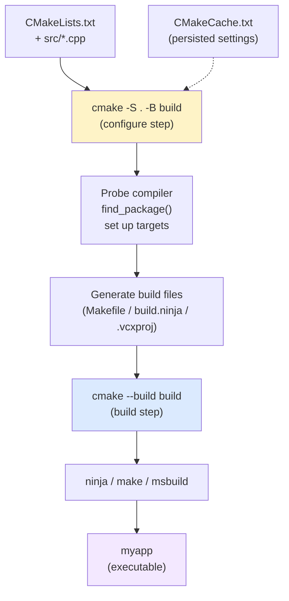
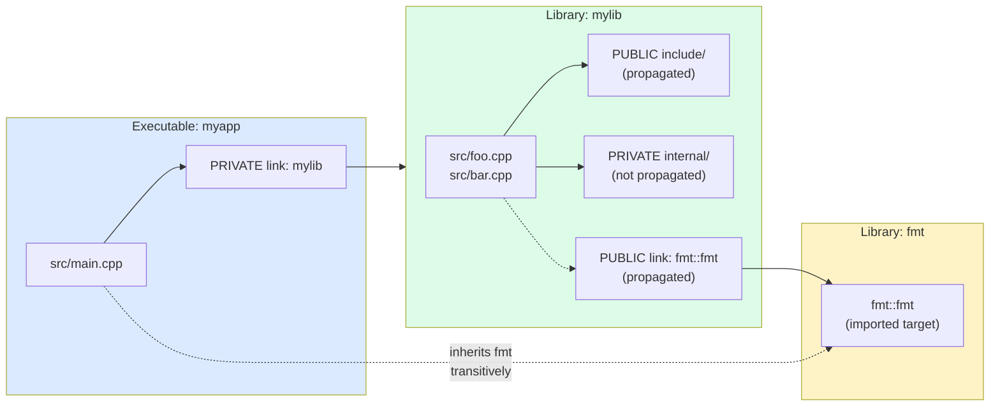

# 5. CMake Basics

> [!info] Cross-reference
> This is the modern replacement for hand-written Makefiles discussed in [[4. Make and Makefiles]]. CMake does not build code — it generates build files (Makefiles, Ninja files, VS solutions, Xcode projects) that do the actual building.

## Why This Matters

CMake is the de facto standard C++ build system. It is used by Boost, LLVM, OpenCV, Qt, KDE, the ROS robotics framework, Blender, MySQL, and literally thousands of other projects. Knowing CMake is non-negotiable for a modern C++ developer because:

- **Cross-platform.** One `CMakeLists.txt` produces Makefiles on Linux, Ninja files anywhere, Visual Studio solutions on Windows, Xcode projects on macOS. You write once, build everywhere.
- **Package discovery.** `find_package(Boost)` works whether Boost was installed by apt, brew, vcpkg, or built from source.
- **IDE integration.** VS Code, CLion, Visual Studio, and Xcode all speak CMake natively. CLion's entire project model is CMake.
- **Modern target-based design.** Since CMake 2.8.12 (2013), you describe properties on targets — executables and libraries — not on global variables. This is the single biggest improvement over classic Make.
- **Ecosystem.** vcpkg, Conan, Hunter, and most package managers integrate with CMake. See [[8. Package Managers (vcpkg, Conan)]].

The cost: CMake's scripting language is its own thing (a mix of shell-like and Lisp-like syntax with surprising scoping rules). It has historical warts. But the modern target-based subset is clean and expressive.

## Background

CMake was created by Kitware in 2000 for the ITK/VTK medical imaging projects. The original problem: writing portable Makefiles for VTK across Irix, Solaris, HP-UX, Linux, and Windows was impossible. CMake introduced a declarative, build-system-agnostic description language that generates native build files.

CMake is a **meta-build system** or **build-system generator**. It runs the `cmake` command once to *configure* the project (read `CMakeLists.txt`, probe the system, generate build files), then runs `cmake --build` to invoke the underlying build tool.

```
CMakeLists.txt  →  [cmake]  →  Makefile / build.ninja / .vcxproj  →  [make/ninja/msbuild]  →  executable
```

The two-step model is important because configuration is slow (probing compilers, finding libraries) but only needs to run when the build configuration changes. The build step runs frequently and is fast.

## A Minimal CMakeLists.txt

```cmake
cmake_minimum_required(VERSION 3.20)
project(MyApp
    VERSION 1.0.0
    DESCRIPTION "A demonstration"
    LANGUAGES CXX)

set(CMAKE_CXX_STANDARD 20)
set(CMAKE_CXX_STANDARD_REQUIRED ON)
set(CMAKE_CXX_EXTENSIONS OFF)

add_executable(myapp src/main.cpp src/util.cpp)
target_include_directories(myapp PRIVATE include)
```

Walkthrough:

- `cmake_minimum_required(VERSION 3.20)` — pins the CMake version. Older CMake will refuse to run; newer CMake will behave compatibly. Always set this — it gates policy behavior and prevents silent breakage.
- `project(MyApp ...)` — declares the project name, version, and languages. The `project()` call defines variables like `MyApp_VERSION`, `PROJECT_SOURCE_DIR`, and triggers compiler detection for the listed languages.
- `set(CMAKE_CXX_STANDARD 20)` — set the C++ standard. Combine with `_REQUIRED ON` (fail if the compiler doesn't support it) and `_EXTENSIONS OFF` (use pure standard C++, no GNU extensions like `__int128`).
- `add_executable(myapp ...)` — declare an executable target with its sources.
- `target_include_directories(myapp PRIVATE include)` — add an include directory to the target. The `PRIVATE` keyword means: only consumers of `myapp` (none, since it's an executable) get this; the directory is used only to build `myapp` itself.

## Building

The "out-of-source" build is the only sane workflow. Never build in your source tree — it pollutes your source directory with build artifacts that are hard to clean and impossible to git-ignore perfectly.

```bash
# Configure (one-time, or whenever CMakeLists.txt changes)
cmake -S . -B build -DCMAKE_BUILD_TYPE=Debug

# Build (incremental)
cmake --build build -j8

# Run tests
ctest --test-dir build

# Install (optional)
cmake --install build
```

- `-S .` — source directory (where `CMakeLists.txt` lives).
- `-B build` — build directory (where everything generated goes).
- `-DCMAKE_BUILD_TYPE=Debug` — set a cache variable. Common values: `Debug`, `Release`, `RelWithDebInfo`, `MinSizeRel`.

You can re-run `cmake --build build` as many times as you want; CMake regenerates the build files automatically if `CMakeLists.txt` changed.

## Variables and Cache Variables

CMake has two scopes for variables:

1. **Normal variables** — set with `set(VAR value)`. They live in the current directory's scope and below (in subdirectories added via `add_subdirectory`). They do not persist between CMake runs.
2. **Cache variables** — set with `set(VAR value CACHE STRING "doc")` or via `-DVAR=value` on the command line. They persist in `CMakeCache.txt` across runs and are visible to all scopes. The cache is the canonical place for user-configurable settings.

```cmake
# Normal variable — local, fast, does not persist
set(MY_SOURCES main.cpp util.cpp)

# Cache variable — persistent, user-overridable
set(BUILD_TESTS ON CACHE BOOL "Build unit tests")

# Environment variable access
message("Compiler: $ENV{CXX}")
```

> [!tip] Use option() for booleans
> `option(BUILD_TESTS "Build unit tests" ON)` is the idiomatic way to declare a user-toggleable boolean. It creates a cache variable with a sensible default.

## Targets — The Heart of Modern CMake

A **target** is a logical build unit: an executable (`add_executable`), a static library (`add_library(foo STATIC ...)`), a shared library (`add_library(foo SHARED ...)`), an interface library (`add_library(foo INTERFACE ...)`), or an object library (`add_library(foo OBJECT ...)`).

Each target carries **properties**: include directories, compile definitions, compile options, link libraries, link options, etc. The modern target-based API sets these on the target itself, not globally.

### `target_include_directories`

```cmake
target_include_directories(myapp
    PRIVATE
        include           # used to build myapp, not exposed to consumers
        src               # (myapp is an exe so PRIVATE/PUBLIC is moot, but idiomatic)
    PUBLIC
        public_include    # used by myapp AND any consumer (if it were a library)
    INTERFACE
        interface_only    # only exposed to consumers, not used to build myapp
)
```

The three keywords:

- `PRIVATE` — used to build this target, not propagated.
- `INTERFACE` — propagated to consumers, not used to build this target.
- `PUBLIC` — both: used to build this target AND propagated.

### `target_link_libraries`

```cmake
add_library(mylib STATIC src/foo.cpp src/bar.cpp)
target_include_directories(mylib PUBLIC include)

add_executable(myapp src/main.cpp)
target_link_libraries(myapp PRIVATE mylib)
```

When `myapp` links `mylib` PRIVATEly, it inherits `mylib`'s `PUBLIC` and `INTERFACE` include directories and link libraries transitively. This is the killer feature of modern CMake: **dependencies propagate automatically**. If `mylib` publicly depends on `fmt`, and `myapp` privately links `mylib`, then `myapp` can `#include <fmt/format.h>` without ever mentioning `fmt` itself.

### `target_compile_features` and `target_compile_definitions`

```cmake
target_compile_features(mylib PUBLIC cxx_std_20)   # require C++20 from consumers
target_compile_definitions(mylib PRIVATE NDEBUG=1)  # only when building mylib
target_compile_options(mylib PRIVATE -Wall -Wextra -Werror)
```

`target_compile_features(... PUBLIC cxx_std_20)` is the modern alternative to `set(CMAKE_CXX_STANDARD 20)`. It propagates the C++ standard requirement to consumers of `mylib`.

## Build Types and Multi-Config Generators

CMake distinguishes **single-config** generators (Make, Ninja) from **multi-config** generators (Visual Studio, Xcode, Ninja Multi-Config).

- **Single-config**: you pick `CMAKE_BUILD_TYPE` at configure time. To switch between Debug and Release, you reconfigure or use separate build directories.
- **Multi-config**: you pick the config at build time. `cmake --build build --config Release`.

```bash
# Single-config (Linux/Mac Makefile or Ninja)
cmake -S . -B build-debug   -DCMAKE_BUILD_TYPE=Debug
cmake -S . -B build-release -DCMAKE_BUILD_TYPE=Release
cmake --build build-debug
cmake --build build-release

# Multi-config (Visual Studio)
cmake -S . -B build -G "Visual Studio 17 2022"
cmake --build build --config Debug
cmake --build build --config Release
```

## Generators

CMake supports many **generators** — the underlying build system it targets. List them with `cmake --help`.

| Generator                | Use case                                          |
| ------------------------ | ------------------------------------------------- |
| `Unix Makefiles`         | Default on Linux/macOS. Familiar but slower.      |
| `Ninja`                  | Fast, modern. Recommended for single-config.      |
| `Ninja Multi-Config`     | Ninja with multi-config support. Best of both.    |
| `Visual Studio 17 2022`  | Windows native MSBuild.                           |
| `Xcode`                  | macOS Xcode projects.                             |
| `CodeBlocks - Ninja`     | IDE project files.                                |
| `Sublime Text 2 - Ninja` | IDE project files.                                |

For day-to-day work, **Ninja is the recommended generator** unless you specifically need IDE integration:

```bash
cmake -S . -B build -G Ninja -DCMAKE_BUILD_TYPE=Release
cmake --build build
```

Ninja is 2-10× faster than Make for incremental builds because it parallelizes aggressively and tracks dependencies precisely.

## Mermaid — CMake Build Generation Flow



## Mermaid — Modern Target-Based CMake



## A Slightly Larger Example

Project structure:

```
myproject/
├── CMakeLists.txt
├── include/mylib/
│   └── calculator.h
├── src/
│   ├── calculator.cpp
│   └── main.cpp
└── tests/
    └── test_calculator.cpp
```

Top-level `CMakeLists.txt`:

```cmake
cmake_minimum_required(VERSION 3.20)
project(CalculatorApp VERSION 1.0.0 LANGUAGES CXX)

# Global settings
set(CMAKE_CXX_STANDARD 20)
set(CMAKE_CXX_STANDARD_REQUIRED ON)
set(CMAKE_CXX_EXTENSIONS OFF)

if(NOT CMAKE_BUILD_TYPE)
    set(CMAKE_BUILD_TYPE Debug CACHE STRING "" FORCE)
endif()

# Common options
option(BUILD_TESTING "Build unit tests" ON)

# Warnings as a reusable interface library
add_library(warnings INTERFACE)
target_compile_options(warnings INTERFACE
    $<$<OR:$<CXX_COMPILER_ID:GNU>,$<CXX_COMPILER_ID:Clang>>:-Wall;-Wextra;-Wpedantic;-Wconversion>
    $<$<CXX_COMPILER_ID:MSVC>:/W4>
)

# The library
add_library(calculator STATIC
    src/calculator.cpp
)
target_include_directories(calculator PUBLIC
    ${CMAKE_CURRENT_SOURCE_DIR}/include
)
target_link_libraries(calculator PUBLIC warnings)

# The executable
add_executable(calculator_app src/main.cpp)
target_link_libraries(calculator_app PRIVATE calculator)

# Tests
if(BUILD_TESTING)
    enable_testing()
    add_subdirectory(tests)
endif()

# Install
include(GNUInstallDirs)
install(TARGETS calculator calculator_app
    RUNTIME DESTINATION ${CMAKE_INSTALL_BINDIR}
    ARCHIVE DESTINATION ${CMAKE_INSTALL_LIBDIR}
    LIBRARY DESTINATION ${CMAKE_INSTALL_LIBDIR}
)
install(DIRECTORY include/ DESTINATION ${CMAKE_INSTALL_INCLUDEDIR})
```

`tests/CMakeLists.txt`:

```cmake
add_executable(test_calculator test_calculator.cpp)
target_link_libraries(test_calculator PRIVATE calculator)
add_test(NAME test_calculator COMMAND test_calculator)
```

This is a complete, modern, idiomatic CMake project. Note how:

- `warnings` is an `INTERFACE` library — it has no source files, just properties to propagate.
- `calculator` exposes its include directory `PUBLIC`ly, so `calculator_app` automatically gets `-Iinclude` when it links `calculator`.
- Tests are conditional on `BUILD_TESTING` and use `enable_testing()` + `add_test()`.
- Install rules use `GNUInstallDirs` for portable paths.

## Common Pitfalls

> [!danger] Using `include_directories` instead of `target_include_directories`
> The global `include_directories()` and `link_libraries()` commands apply to every target defined after them in the same scope. They were the only API before CMake 2.8.12 and persist in old tutorials. Always use the `target_*` variants in new code.

> [!danger] Globbing sources
> `file(GLOB SOURCES src/*.cpp)` is tempting, but CMake does not re-glob when you add a new file. You must re-run CMake manually. The modern workaround is `file(GLOB ... CONFIGURE_DEPENDS)`, but the CMake maintainers recommend listing sources explicitly. Explicit is also more build-cache-friendly.

> [!danger] Forgetting `cmake_minimum_required`
> Without it, CMake uses old policies, and modern commands may behave differently. Always pin a version, ideally 3.20+ for modern features.

> [!warning] In-source builds
> Building in your source tree (`cmake .`) creates `CMakeCache.txt`, `CMakeFiles/`, and other artifacts alongside your sources. Always use a separate build directory: `cmake -S . -B build`. To enforce this, you can `set(CMAKE_DISABLE_SOURCE_CHANGES ON)` and `set(CMAKE_DISABLE_IN_SOURCE_BUILD ON)`.

> [!warning] Mixing `add_definitions` and `target_compile_definitions`
> `add_definitions(-DFOO=1)` is the old, global API. `target_compile_definitions(foo PRIVATE FOO=1)` is the modern, target-scoped one. Don't mix them in the same project.

> [!warning] Not using imported targets
> `find_package(Threads)` gives you either `Threads::Threads` (modern imported target) or just `CMAKE_THREAD_LIBS_INIT` (old variable). Always use the imported target form. See [[6. CMake Advanced]].

> [!warning] Cache variable types
> Cache variables have types (`BOOL`, `FILEPATH`, `PATH`, `STRING`, `INTERNAL`). Skipping the type makes CMake GUI tools display them as untyped strings, which is ugly and confusing. Always specify: `set(FOO ON CACHE BOOL "doc")`.

## Tips and Tricks

- **Always set `CMAKE_EXPORT_COMPILE_COMMANDS ON`** in your root CMakeLists. This generates `compile_commands.json`, which `clangd`, `ccls`, and other language servers use for code intelligence. Editor setup becomes one-click.
- **Use the Ninja generator** for fastest builds: `cmake -G Ninja -S . -B build`.
- **Use presets** (CMake 3.19+). `CMakePresets.json` lets you define named configurations:
  ```json
  {
    "version": 3,
    "configurePresets": [
      { "name": "debug", "binaryDir": "build/debug", "cacheVariables": { "CMAKE_BUILD_TYPE": "Debug" } },
      { "name": "release", "binaryDir": "build/release", "cacheVariables": { "CMAKE_BUILD_TYPE": "Release" } }
    ]
  }
  ```
  Then `cmake --preset debug && cmake --build --preset debug`.
- **Use `ccmake`** (TUI) or `cmake-gui` to interactively edit cache variables.
- **Print variables during debugging** with `message(STATUS "VAR=${VAR}")`. Use `--log-level=DEBUG` for verbose output.
- **Use generator expressions** for per-config options: `target_compile_options(foo PRIVATE $<$<CONFIG:Debug>:-O0;-g>)`. See [[6. CMake Advanced]].
- **Group related properties** into INTERFACE libraries for reuse. The `warnings` example above is the canonical case.
- **Use `cmake_print_variables()` and `cmake_print_properties()`** from the `CMakePrintHelpers` module for debugging.
- **Use `FetchContent`** (CMake 3.11+) to pull dependencies at configure time without a package manager. See [[6. CMake Advanced]].
- **Always build out-of-source**. Use `set(CMAKE_DISABLE_IN_SOURCE_BUILD ON)` to enforce it.
- **Pin compiler features with `target_compile_features`** instead of `set(CMAKE_CXX_STANDARD ...)` when building libraries — the requirement propagates to consumers.
- **Avoid `add_subdirectory` for external projects**; use `FetchContent` or a package manager instead.
- **Use `cmake --build build -j$(nproc)`** for parallel builds. With Makefiles, this passes `-j` to make; with Ninja, parallelism is automatic.
- **Use `cmake --build build --target clean`** for cleaning. This is generator-agnostic.
- **For cross-compilation**, write a toolchain file and pass `-DCMAKE_TOOLCHAIN_FILE=toolchain.cmake`. See [[2. GCC and g++]] for cross-compilation triplets.

## Active Recall

1. What is the difference between CMake's configure step and build step?
2. Why should you always do out-of-source builds? How do you enforce it?
3. Explain the difference between `PRIVATE`, `PUBLIC`, and `INTERFACE` in `target_link_libraries`.
4. What does `cmake_minimum_required(VERSION 3.20)` actually do beyond version checking?
5. What is an INTERFACE library, and what is it useful for?
6. Why is `file(GLOB)` discouraged for listing sources? What is the modern workaround?
7. How does dependency propagation work in modern CMake? Give an example.
8. Distinguish single-config and multi-config generators. Give an example of each.
9. What is `CMAKE_EXPORT_COMPILE_COMMANDS` and why is it useful?
10. What is the difference between `set(VAR value)` and `set(VAR value CACHE STRING "doc")`?
11. How would you declare a user-toggleable boolean option in CMake?
12. What does `CMAKE_BUILD_TYPE` do? Where does it not apply?
13. Why is Ninja recommended over Makefiles for CMake-generated builds?
14. What are CMake presets and what problem do they solve?

## Next Steps

- Continue to [[6. CMake Advanced]] for `find_package`, imported targets, generator expressions, install rules, and CTest.
- See [[4. Make and Makefiles]] for what CMake generates under the hood.
- See [[8. Package Managers (vcpkg, Conan)]] for integrating external dependencies with CMake.
- For test integration, see the CTest section in [[6. CMake Advanced]].
- For modern C++ project layout, see [[7. Project Structure]].
- The canonical reference is *Professional CMake: A Practical Guide* by Craig Scott, and the official CMake tutorial at cmake.org.
