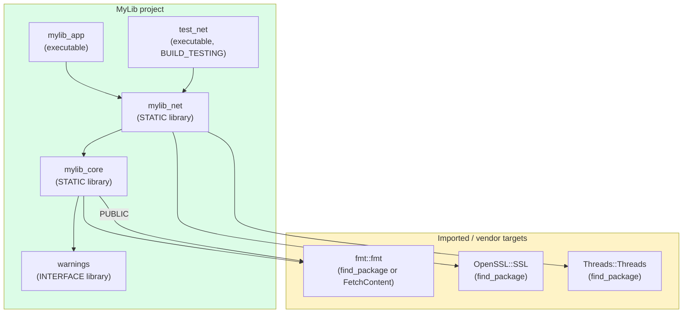
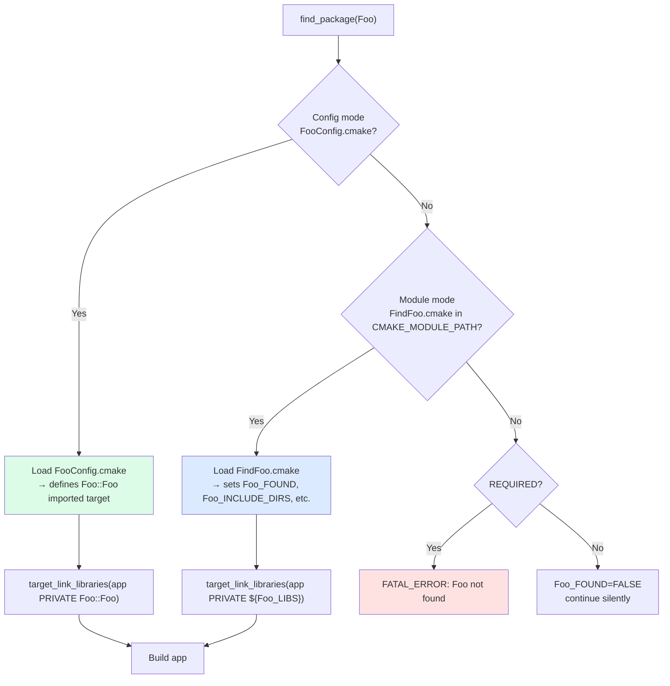

# 6. CMake Advanced

> [!info] Cross-reference
> Builds on [[5. CMake Basics]]. Read that first for target-based design, build types, and generators. This note covers the features that matter for real-world, multi-dependency, cross-platform projects.

## Why This Matters

Once your project grows past a handful of files and pulls in external libraries, the basic CMake constructs (`add_executable`, `target_link_libraries`) are not enough. You need to:

- **Find and use external libraries** (`find_package`, imported targets).
- **Generate files at configure time** (config headers, version files).
- **Install your library** so others can `find_package` it.
- **Run tests** through CTest.
- **Express conditional logic** that depends on platform, compiler, or configuration.
- **Use generator expressions** for per-config, per-target, per-platform options.

Mastering these features is the difference between a CMake setup that scales to 1000 targets and one that collapses into a maintenance nightmare at 50.

## `find_package` and Imported Targets

`find_package(Foo)` searches for a library called `Foo` and, if found, creates variables and/or imported targets you can use. Two mechanisms exist:

1. **Module mode**: CMake looks for `FindFoo.cmake` in its module path (or your `CMAKE_MODULE_PATH`). These are CMake-shipped finders (e.g. `FindThreads`, `FindOpenSSL`, `FindBoost`).
2. **Config mode**: the library ships `FooConfig.cmake` (typically installed in `<prefix>/lib/cmake/Foo/`). This is the modern, library-author-provided mechanism.

```cmake
# Old style — variables, no propagation
find_package(Threads REQUIRED)
add_executable(myapp main.cpp)
target_link_libraries(myapp PRIVATE ${CMAKE_THREAD_LIBS_INIT})

# Modern style — imported targets, propagation works
find_package(Threads REQUIRED)
target_link_libraries(myapp PRIVATE Threads::Threads)
```

Always prefer the imported target form (`Threads::Threads`, `OpenSSL::SSL`, `Boost::system`, `ZLIB::ZLIB`). Imported targets carry their include paths, compile definitions, and transitive dependencies automatically — `target_link_libraries(myapp PRIVATE Threads::Threads)` is one line that handles everything.

```cmake
find_package(Boost 1.80 REQUIRED COMPONENTS system filesystem regex)
add_executable(myapp main.cpp)
target_link_libraries(myapp PRIVATE
    Boost::system
    Boost::filesystem
    Boost::regex
)
```

If a package is optional, omit `REQUIRED` and check the `<Pkg>_FOUND` variable:

```cmake
find_package(OpenSSL)
if(OpenSSL_FOUND)
    target_compile_definitions(myapp PRIVATE HAVE_OPENSSL=1)
    target_link_libraries(myapp PRIVATE OpenSSL::SSL OpenSSL::Crypto)
endif()
```

### Writing a `*-Config.cmake` package

If you ship a library, the modern way to make it `find_package`-able is to install a config package. CMake provides helpers:

```cmake
# In your library's CMakeLists.txt
include(GNUInstallDirs)
include(CMakePackageConfigHelpers)

install(TARGETS mylib
    EXPORT MyLibTargets
    ARCHIVE DESTINATION ${CMAKE_INSTALL_LIBDIR}
    LIBRARY DESTINATION ${CMAKE_INSTALL_LIBDIR}
    RUNTIME DESTINATION ${CMAKE_INSTALL_BINDIR}
    INCLUDES DESTINATION ${CMAKE_INSTALL_INCLUDEDIR}
)

install(DIRECTORY include/ DESTINATION ${CMAKE_INSTALL_INCLUDEDIR})

install(EXPORT MyLibTargets
    FILE MyLibTargets.cmake
    NAMESPACE MyLib::
    DESTINATION ${CMAKE_INSTALL_LIBDIR}/cmake/MyLib
)

configure_package_config_file(
    cmake/MyLibConfig.cmake.in
    ${CMAKE_CURRENT_BINARY_DIR}/MyLibConfig.cmake
    INSTALL_DESTINATION ${CMAKE_INSTALL_LIBDIR}/cmake/MyLib
)

write_basic_package_version_file(
    ${CMAKE_CURRENT_BINARY_DIR}/MyLibConfigVersion.cmake
    VERSION ${PROJECT_VERSION}
    COMPATIBILITY SameMajorVersion
)

install(FILES
    ${CMAKE_CURRENT_BINARY_DIR}/MyLibConfig.cmake
    ${CMAKE_CURRENT_BINARY_DIR}/MyLibConfigVersion.cmake
    DESTINATION ${CMAKE_INSTALL_LIBDIR}/cmake/MyLib
)
```

After installation, consumers write `find_package(MyLib 1.0 REQUIRED)` and use `MyLib::mylib` as an imported target.

## Generator Expressions

Generator expressions are CMake's templating mechanism for *values that depend on build context*. They are evaluated at *generation* time (after configure), so they can branch on configuration, platform, compiler, and target properties without re-running CMake.

Syntax: `$<condition:value>` or `$<expression>`.

Common forms:

| Expression                              | Meaning                                                          |
| --------------------------------------- | ---------------------------------------------------------------- |
| `$<CONFIG:Debug>`                       | True if building in Debug configuration.                         |
| `$<PLATFORM_ID:linux>`                  | True on Linux.                                                   |
| `$<CXX_COMPILER_ID:GNU>`                | True if compiler is GCC.                                         |
| `$<BOOL:value>`                         | True if `value` is a CMake-true value.                           |
| `$<TARGET_FILE:myapp>`                  | Path to the built target's binary.                               |
| `$<TARGET_PROPERTY:mylib,INCLUDE_DIRECTORIES>` | Value of a target property.                              |
| `$<IF:cond,true_val,false_val>`         | Ternary.                                                         |
| `$<JOIN:list,sep>`                      | Join a list with a separator.                                    |
| `$<ANGLE-R>` / `$<COMMA>`               | Escape a `>` or `,` inside a generator expression.              |

Examples:

```cmake
# Per-config optimization
target_compile_options(myapp PRIVATE
    $<$<CONFIG:Debug>:-O0;-g;-fsanitize=address>
    $<$<CONFIG:Release>:-O3;-DNDEBUG>
)

# Per-compiler flags
target_compile_options(myapp PRIVATE
    $<$<CXX_COMPILER_ID:GNU,Clang>:-Wall;-Wextra;-Wpedantic>
    $<$<CXX_COMPILER_ID:MSVC>:/W4>/permissive->
)

# Embed build directory into the binary
target_compile_definitions(myapp PRIVATE
    BUILD_DIR="$<TARGET_FILE_DIR:myapp>"
)

# Generate a list with semicolons (not CMake's default)
target_compile_options(myapp PRIVATE
    "$<$<CXX_COMPILER_ID:MSVC>:/external:I${EXTERNAL_INCLUDE_DIR}>"
)
```

> [!tip] Generator expressions in custom commands
> Generator expressions are essential in `add_custom_command` because they let you reference build artifacts (e.g. `$<TARGET_FILE:myapp>`) that don't exist at configure time.

## Custom Targets and Custom Commands

`add_custom_command` and `add_custom_target` let you run arbitrary commands during the build.

### `add_custom_command` (OUTPUT form)

Run a command to produce a specific file:

```cmake
find_program(PROTOC protoc)
add_custom_command(
    OUTPUT ${CMAKE_CURRENT_BINARY_DIR}/foo.pb.cc
           ${CMAKE_CURRENT_BINARY_DIR}/foo.pb.h
    COMMAND ${PROTOC}
        --cpp_out=${CMAKE_CURRENT_BINARY_DIR}
        --proto_path=${CMAKE_CURRENT_SOURCE_DIR}/protos
        ${CMAKE_CURRENT_SOURCE_DIR}/protos/foo.proto
    DEPENDS ${CMAKE_CURRENT_SOURCE_DIR}/protos/foo.proto
    VERBATIM
)
add_library(foo_proto STATIC ${CMAKE_CURRENT_BINARY_DIR}/foo.pb.cc)
```

### `add_custom_command` (TARGET form)

Attach a command to a target's lifecycle (PRE_BUILD, PRE_LINK, POST_BUILD):

```cmake
add_executable(myapp main.cpp)
add_custom_command(TARGET myapp POST_BUILD
    COMMAND ${CMAKE_COMMAND} -E copy_directory
        ${CMAKE_SOURCE_DIR}/assets
        $<TARGET_FILE_DIR:myapp>/assets
    COMMENT "Copying assets"
)
```

### `add_custom_target`

A target that always runs its commands (think phony Make target):

```cmake
add_custom_target(run
    COMMAND $<TARGET_FILE:myapp>
    DEPENDS myapp
    WORKING_DIRECTORY ${CMAKE_BINARY_DIR}
    COMMENT "Running myapp"
)
```

`add_custom_target` does not produce a file, so it always runs. Use it for `run`, `docs`, `lint`, `format` targets.

## FetchContent

`FetchContent` (CMake 3.11+) downloads external projects at configure time and adds them via `add_subdirectory`. It's the no-package-manager way to consume header-only or CMake-built libraries.

```cmake
include(FetchContent)

FetchContent_Declare(
    fmt
    GIT_REPOSITORY https://github.com/fmtlib/fmt.git
    GIT_TAG        10.1.1
)
FetchContent_MakeAvailable(fmt)

add_executable(myapp main.cpp)
target_link_libraries(myapp PRIVATE fmt::fmt)
```

`FetchContent_MakeAvailable` (CMake 3.14+) downloads, configures, and adds the subdirectory in one call. It's the modern replacement for the older `FetchContent_Populate` + `add_subdirectory` two-step.

For larger projects, prefer a real package manager (vcpkg or Conan) — see [[8. Package Managers (vcpkg, Conan)]] — but `FetchContent` is excellent for one-off dependencies.

## Install Rules

CMake's `install()` command declares what to install and where. The `install(TARGETS ...)` form is the most common:

```cmake
include(GNUInstallDirs)

install(TARGETS mylib myapp
    EXPORT MyLibTargets              # export for downstream find_package
    ARCHIVE DESTINATION ${CMAKE_INSTALL_LIBDIR}    # static libs
    LIBRARY DESTINATION ${CMAKE_INSTALL_LIBDIR}    # shared libs
    RUNTIME DESTINATION ${CMAKE_INSTALL_BINDIR}    # executables
    INCLUDES DESTINATION ${CMAKE_INSTALL_INCLUDEDIR}
)

install(DIRECTORY include/ DESTINATION ${CMAKE_INSTALL_INCLUDEDIR})

install(FILES
    ${CMAKE_CURRENT_BINARY_DIR}/mylib-config.h
    DESTINATION ${CMAKE_INSTALL_INCLUDEDIR}/mylib
)
```

`GNUInstallDirs` provides portable paths: `CMAKE_INSTALL_BINDIR`, `CMAKE_INSTALL_LIBDIR`, `CMAKE_INSTALL_INCLUDEDIR`, `CMAKE_INSTALL_DATADIR`, etc. On 64-bit Linux these typically resolve to `bin`, `lib` or `lib64`, `include`, `share`.

Build with install support:

```bash
cmake -S . -B build -DCMAKE_INSTALL_PREFIX=/usr/local
cmake --build build
cmake --install build            # installs to /usr/local
cmake --install build --prefix staging-dir    # override prefix for staging
```

## CTest

CTest is CMake's test runner. Define tests with `add_test`:

```cmake
enable_testing()   # in the top-level CMakeLists.txt

add_executable(test_calculator test_calculator.cpp)
target_link_libraries(test_calculator PRIVATE calculator Catch2::Catch2WithMain)

add_test(
    NAME test_calculator
    COMMAND test_calculator
)
```

Run tests:

```bash
ctest --test-dir build              # run all tests
ctest --test-dir build -j8          # parallel
ctest --test-dir build -R calc      # regex filter
ctest --test-dir build --output-on-failure
ctest --test-dir build -T Coverage  # generate coverage
```

For framework-based tests (GoogleTest, Catch2, Boost.Test), CMake 3.10+ provides `gtest_discover_tests` and 3.14+ provides `catch_discover_tests` that auto-register each test case as a separate CTest entry:

```cmake
include(GoogleTest)
add_executable(mytests test_main.cpp)
target_link_libraries(mytests PRIVATE GTest::gtest_main)
gtest_discover_tests(mytests)
```

Now each `TEST(...)` becomes its own CTest entry, runnable independently with `ctest -R TestName`.

## Multi-Config vs Single-Config

We covered this in [[5. CMake Basics]]. The advanced implications:

- **Output paths** differ. With Make/Ninja (single-config), binaries go in `build/`. With Visual Studio (multi-config), they go in `build/Debug/` and `build/Release/`.
- **Generator expressions involving `$<CONFIG>`** are essential for multi-config.
- **`CMAKE_RUNTIME_OUTPUT_DIRECTORY`** can be set to flatten the layout if you need consistent paths across generators.

```cmake
set(CMAKE_RUNTIME_OUTPUT_DIRECTORY ${CMAKE_BINARY_DIR}/bin)
set(CMAKE_LIBRARY_OUTPUT_DIRECTORY ${CMAKE_BINARY_DIR}/lib)
set(CMAKE_ARCHIVE_OUTPUT_DIRECTORY ${CMAKE_BINARY_DIR}/lib)
```

## Modern CMake Principles

The "Modern CMake" movement (championed by Daniel Pfeifer, Craig Scott, and others) advocates:

1. **Target-based, not global.** Use `target_*` commands, never the directory-scoped `include_directories`, `add_definitions`, `link_libraries`.
2. **No CMake variables for include paths.** Variables don't propagate; targets do.
3. **PUBLIC vs PRIVATE matters.** If a header in your library's public interface includes `<fmt/format.h>`, then `fmt` is a PUBLIC dependency. If only your `.cpp` files include it, it's PRIVATE.
4. **Imported targets over variables.** Always use `Threads::Threads`, not `${CMAKE_THREAD_LIBS_INIT}`.
5. **Properties over variables.** Use `get_target_property`, `set_target_properties`, etc., instead of inventing naming conventions.
6. **Avoid `add_subdirectory` for external code.** Use `FetchContent` or `find_package`.
7. **Pin `cmake_minimum_required` to a recent version.** 3.20+ gives you modern features and policy behavior.
8. **Use `CMakePresets.json`** for reproducible configurations.
9. **Treat `CMakeLists.txt` as code.** Format it, review it, test it.
10. **Export your library.** Always provide an install + export + config package so others can `find_package` you.

## Mermaid — CMake Target Dependency Graph



## Mermaid — `find_package` Resolution



## A Full Example: Library with Install + Tests + Dependencies

```cmake
cmake_minimum_required(VERSION 3.20)
project(HttpLib VERSION 2.1.0 LANGUAGES CXX)

# ---- Settings ----
set(CMAKE_CXX_STANDARD 20)
set(CMAKE_CXX_STANDARD_REQUIRED ON)
set(CMAKE_CXX_EXTENSIONS OFF)
set(CMAKE_EXPORT_COMPILE_COMMANDS ON)

if(NOT CMAKE_BUILD_TYPE AND NOT CMAKE_CONFIGURATION_TYPES)
    set(CMAKE_BUILD_TYPE Release CACHE STRING "" FORCE)
endif()

# ---- Options ----
option(BUILD_TESTING "Build tests" ON)
option(BUILD_SHARED_LIBS "Build shared instead of static" ON)

# ---- Dependencies ----
find_package(OpenSSL REQUIRED)
find_package(Threads REQUIRED)
find_package(ZLIB REQUIRED)

# ---- Library ----
add_library(httplib
    src/client.cpp
    src/server.cpp
    src/url.cpp
)
add_library(HttpLib::httplib ALIAS httplib)

target_include_directories(httplib
    PUBLIC
        $<BUILD_INTERFACE:${CMAKE_CURRENT_SOURCE_DIR}/include>
        $<INSTALL_INTERFACE:include>
)
target_compile_features(httplib PUBLIC cxx_std_20)
target_link_libraries(htplib
    PUBLIC
        OpenSSL::SSL
        OpenSSL::Crypto
        Threads::Threads
        ZLIB::ZLIB
)
target_compile_options(htplib PRIVATE
    $<$<CXX_COMPILER_ID:GNU,Clang>:-Wall;-Wextra;-Wpedantic>
    $<$<CXX_COMPILER_ID:MSVC>:/W4>
)

# ---- Config header (generated at configure time) ----
configure_file(
    ${CMAKE_CURRENT_SOURCE_DIR}/cmake/httplib-config.h.in
    ${CMAKE_CURRENT_BINARY_DIR}/include/httplib/config.h
    @ONLY
)

# ---- Tests ----
if(BUILD_TESTING)
    enable_testing()
    add_subdirectory(tests)
endif()

# ---- Install + export ----
include(GNUInstallDirs)
include(CMakePackageConfigHelpers)

install(TARGETS httplib
    EXPORT HttpLibTargets
    LIBRARY DESTINATION ${CMAKE_INSTALL_LIBDIR}
    ARCHIVE DESTINATION ${CMAKE_INSTALL_LIBDIR}
    RUNTIME DESTINATION ${CMAKE_INSTALL_BINDIR}
    INCLUDES DESTINATION ${CMAKE_INSTALL_INCLUDEDIR}
)
install(DIRECTORY include/ DESTINATION ${CMAKE_INSTALL_INCLUDEDIR})
install(FILES ${CMAKE_CURRENT_BINARY_DIR}/include/httplib/config.h
    DESTINATION ${CMAKE_INSTALL_INCLUDEDIR}/httplib
)

install(EXPORT HttpLibTargets
    FILE HttpLibTargets.cmake
    NAMESPACE HttpLib::
    DESTINATION ${CMAKE_INSTALL_LIBDIR}/cmake/HttpLib
)

configure_package_config_file(
    cmake/HttpLibConfig.cmake.in
    ${CMAKE_CURRENT_BINARY_DIR}/HttpLibConfig.cmake
    INSTALL_DESTINATION ${CMAKE_INSTALL_LIBDIR}/cmake/HttpLib
)
write_basic_package_version_file(
    ${CMAKE_CURRENT_BINARY_DIR}/HttpLibConfigVersion.cmake
    VERSION ${PROJECT_VERSION}
    COMPATIBILITY SameMajorVersion
)
install(FILES
    ${CMAKE_CURRENT_BINARY_DIR}/HttpLibConfig.cmake
    ${CMAKE_CURRENT_BINARY_DIR}/HttpLibConfigVersion.cmake
    DESTINATION ${CMAKE_INSTALL_LIBDIR}/cmake/HttpLib
)
```

This is a complete production-grade CMake setup. A consumer writes:

```cmake
find_package(HttpLib 2.1 REQUIRED)
add_executable(myapp main.cpp)
target_link_libraries(myapp PRIVATE HttpLib::httplib)
```

…and gets OpenSSL, Threads, ZLIB, and the C++20 standard propagated automatically.

## Common Pitfalls

> [!danger] Using variables instead of imported targets
> `target_link_libraries(app PRIVATE ${OPENSSL_LIBRARIES})` loses propagation. Always use `OpenSSL::SSL`. If your find module does not provide an imported target, write a wrapper or upgrade the module.

> [!danger] Missing `$<INSTALL_INTERFACE:...>`
> When exporting a library, include paths must be specified with both `$<BUILD_INTERFACE:...>` (for in-tree builds) and `$<INSTALL_INTERFACE:...>` (for installed consumers). Without this, downstream users get the wrong (or no) include paths.

> [!danger] Forgetting `enable_testing()` in the top-level file
> `add_test()` silently does nothing if `enable_testing()` was not called. Always put `enable_testing()` in the top-level CMakeLists.txt, not in subdirectories.

> [!warning] Hardcoded absolute paths
> `${CMAKE_SOURCE_DIR}/include` is fine for in-tree builds but breaks when installed. Use `$<BUILD_INTERFACE:${CMAKE_CURRENT_SOURCE_DIR}/include>` and `$<INSTALL_INTERFACE:include>`.

> [!warning] Generator expressions in `set()`
> `set(FLAGS "$<CONFIG:Debug>")` stores the *literal string*, not the evaluated value. Generator expressions only work in target properties and command arguments, not in `set()`.

> [!warning] Mixing `add_subdirectory` and `install`
> If an external project you `add_subdirectory`'d has its own install rules, your `cmake --install` will install its files too. Use `EXCLUDE_FROM_ALL` on `add_subdirectory` if you don't want this.

> [!warning] `find_package` COMPONENTS not checked
> `find_package(Boost REQUIRED COMPONENTS system)` does not fail if `filesystem` is missing — you only asked for `system`. If you use `Boost::filesystem` without listing it as a COMPONENT, you get a confusing "target not found" error.

## Tips and Tricks

- **Use `add_library(alias ALIAS real)`** to give targets a `Namespace::Name` form even before installation. This makes consumer-side code identical whether the library is built in-tree or installed.
- **Use `BUILD_INTERFACE` / `INSTALL_INTERFACE`** generator expressions for include directories. The pattern is mandatory for shipped libraries.
- **Use `set_target_properties` for properties that don't have a `target_*` command**, like `POSITION_INDEPENDENT_CODE`, `CXX_VISIBILITY_PRESET`, `VISIBILITY_INLINES_HIDDEN`.
- **Use `target_compile_features(foo PUBLIC cxx_std_20)`** to propagate language requirements transitively.
- **Enable PCH** with `target_precompile_headers(foo PRIVATE [["pch.h"]])`. CMake 3.16+.
- **Enable Unity Builds** with `set_target_properties(foo PROPERTIES UNITY_BUILD ON)`. CMake 3.16+. Great speedup for template-heavy code, but can mask ODR bugs.
- **Use `source_group(TREE ...)`** to organize files into IDE folders that match the filesystem layout.
- **Use `cmake_path()`** (CMake 3.19+) for portable path manipulation. It's much better than the old `get_filename_component` family.
- **Use `add_compile_definitions`/`add_link_options`** only when you really want global scope. Prefer `target_*` forms.
- **Use `cmake_policy(SET CMP0077 NEW)`** to enable the modern behavior where `option()` honors normal variables set before the `option()` call.
- **For sanitizers**, wrap flags in a reusable INTERFACE library so every target gets them consistently.
- **Profile configure time** with `cmake --profiling-format=google-proto --profiling-output=profile.data`. Useful for projects with hundreds of targets.
- **Use `--preset` and `CMakePresets.json`** for reproducible local builds and CI configurations.

## Active Recall

1. What is the difference between `find_package` in module mode and config mode?
2. Why should you always use imported targets (e.g. `Threads::Threads`) rather than variables?
3. What does `$<CONFIG:Debug>` evaluate to in a Release build?
4. Explain the difference between `BUILD_INTERFACE` and `INSTALL_INTERFACE`.
5. What does `gtest_discover_tests` do, and why is it better than `add_test`?
6. What is `FetchContent_MakeAvailable` and how does it differ from `find_package`?
7. Name three "Modern CMake" principles.
8. How do you make your library `find_package`-able after installation?
9. What is `GNUInstallDirs` and what variables does it provide?
10. Why must `enable_testing()` be called in the top-level CMakeLists.txt?
11. What is the difference between `add_custom_command(OUTPUT ...)` and `add_custom_target`?
12. How do you express "compile with `-O3` only in Release" using a generator expression?
13. What does `CMAKE_EXPORT_COMPILE_COMMANDS` produce, and why is it useful?
14. What is an ALIAS target, and why use one?

## Next Steps

- See [[7. Project Structure]] for how to lay out a CMake-based project.
- See [[8. Package Managers (vcpkg, Conan)]] for managing third-party dependencies instead of `FetchContent`.
- See [[5. CMake Basics]] if any of the basic syntax was unclear.
- Cross-reference [[4. Make and Makefiles]] — CMake generates Makefiles or Ninja files; understanding both helps debugging.
- For testing in depth, see the Testing chapter (to be written).
- The canonical references: *Professional CMake: A Practical Guide* by Craig Scott, and the CMake documentation at cmake.org.
