# 7. Project Structure

> [!info] Cross-reference
> This note ties together everything in [[5. CMake Basics]], [[6. CMake Advanced]], [[2. Headers, Include Guards, Modules]], and [[3. Static vs Shared Libraries]]. The directory layout is the physical embodiment of your CMake target graph.

## Why This Matters

A poorly-organized C++ project is harder to maintain than the equivalent in Python, Go, or Rust because C++ amplifies structure mistakes:

- A header in the wrong place forces `#include` paths that break portability.
- Mixing public and private headers in one directory leaks implementation details to consumers.
- A flat `src/` directory becomes unmanageable past 50 files; a poorly-chosen nested tree becomes unmanageable past 500.
- Build files (`CMakeLists.txt`) that don't mirror the source tree fight against `add_subdirectory` and `file(GLOB)`.
- Tests scattered through `src/` get linked into the production binary by accident.

A good project structure serves three audiences simultaneously:

1. **The build system** — must be able to find sources, group them into targets, and track dependencies.
2. **The IDE** — must be able to navigate, refactor, and provide IntelliSense.
3. **The human reader** — must be able to find things quickly, understand module boundaries at a glance, and know where to add a new feature.

## Background

C++ does not prescribe a project structure. The standard is silent on where files go, what they're named, or how they're built. Every project invents its own conventions. This is in contrast to Rust (where `src/main.rs` and `src/lib.rs` are normative) or Go (where the package directory *is* the import path).

Over four decades, the community has converged on a set of conventions that work. The recommended layout below is the consensus among Boost, LLVM, OpenCV, Qt, Abseil, fmt, nlohmann/json, and most other production-quality projects.

## The Recommended Layout

```
myproject/
├── CMakeLists.txt              # Top-level: project(), options, find_package, add_subdirectory
├── CMakePresets.json           # Named build configurations
├── README.md
├── LICENSE
├── .clang-format
├── .clang-tidy
├── .gitignore
├── cmake/                      # CMake helper modules, *.in templates
│   ├── MyLibConfig.cmake.in
│   └── FindMyDep.cmake
├── include/                    # PUBLIC headers — installed, exposed to consumers
│   └── mylib/
│       ├── calculator.h
│       ├── parser.h
│       └── detail/             # sub-namespace headers
│           └── tokenizer.h
├── src/                        # PRIVATE implementation files — not installed
│   ├── calculator.cpp
│   ├── parser.cpp
│   └── detail/
│       └── tokenizer.cpp
├── tests/                      # Unit and integration tests
│   ├── CMakeLists.txt
│   ├── test_calculator.cpp
│   ├── test_parser.cpp
│   └── data/                   # Test fixtures
│       └── sample.json
├── examples/                   # Usage examples — built but not installed
│   ├── CMakeLists.txt
│   ├── basic_usage.cpp
│   └── advanced_usage.cpp
├── benchmarks/                 # Performance benchmarks (Google Benchmark, etc.)
│   ├── CMakeLists.txt
│   └── bench_calculator.cpp
├── docs/                       # Documentation source (Doxygen, Sphinx, mdbook)
│   ├── CMakeLists.txt
│   └── Doxyfile.in
├── third_party/               # Vendored or FetchContent'd external code
│   └── fmt/
├── scripts/                   # Build/release/dev scripts
│   └── release.sh
├── tools/                     # Code generators, linters, formatters
│   └── codegen.py
└── build/                     # Generated by CMake — gitignored
```

### Why this exact layout?

- **`include/` is for public headers.** Whatever lives here gets installed to `<prefix>/include/`. By convention, files live in a subdirectory named after the project (`include/mylib/`) so they're included as `#include <mylib/calculator.h>` and don't collide with other libraries.
- **`src/` is for private source files.** Anything here is compiled into the library but not exposed. Helper classes, internal utilities, and `.cpp` files for headers in `include/` go here.
- **`tests/` is separate** so test code can never accidentally end up in the production binary.
- **`examples/` is separate** so example binaries don't pollute the main library target list.
- **`benchmarks/` is separate** because benchmark frameworks (Google Benchmark, Catch2's benchmarking) add link-time and compile-time overhead.
- **`docs/` is separate** so Doxygen/Sphinx configuration doesn't interfere with C++ compilation.
- **`third_party/` is for vendored code.** Keeping it in one place makes license audits and updates easy.
- **`cmake/` holds CMake-specific files** — `*-config.cmake.in` templates, custom `Find*.cmake` modules, helper `.cmake` files.
- **`build/` is always gitignored.** Never commit build artifacts.

## Public vs Private Headers

A **public header** is one that consumers of your library `#include`. It forms part of your API. A **private header** is one used only inside your library to implement the public API.

Examples:

| Public                       | Private                          |
| ---------------------------- | -------------------------------- |
| `mylib/calculator.h`         | `detail/lexer.h`                 |
| `mylib/parser.h`             | `detail/ast_nodes.h`             |
| `mylib/types.h` (POD types)  | `detail/platform.h` (`#ifdef`s)  |

Conventions:

- Public headers live in `include/mylib/`.
- Private headers live in `src/` (alongside their `.cpp` files) or in `include/mylib/detail/` if they need to be visible across multiple `.cpp` files.
- Some projects use a separate `include_private/` directory to make the distinction explicit at the filesystem level.
- The `detail` (or `internal`, `impl`) namespace and subdirectory is the community's standard signal for "do not depend on this; it may change without notice."

```cpp
// include/mylib/parser.h  (PUBLIC)
#pragma once
#include <memory>
#include <string>
namespace mylib {
class Parser {
public:
    Parser();
    ~Parser();
    explicit Parser(std::string source);
    int parse();
private:
    class Impl;
    std::unique_ptr<Impl> impl_;
};
}  // namespace mylib
```

```cpp
// src/detail/tokenizer.h  (PRIVATE)
#pragma once
#include <string_view>
namespace mylib::detail {
enum class TokenType { Number, Plus, Minus, Eof };
struct Token { TokenType type; std::string_view text; };
class Tokenizer { /* ... */ };
}  // namespace mylib::detail
```

Consumers of `mylib` include only `<mylib/parser.h>`. The `detail/` headers are an implementation detail that can change freely.

## Header/Source Separation — Why?

The two-file convention (`.h` + `.cpp`) predates C++. It survives because it solves three problems:

1. **Faster builds.** Headers are preprocessed into every TU that includes them. By putting implementations in `.cpp` files, changes to an implementation recompile only that one TU, not every consumer.
2. **Information hiding.** A `.cpp` file's contents are invisible to consumers. This is C++'s only true encapsulation mechanism (the `private:` keyword is a *language-level* convention; the linker does not enforce it).
3. **ABI stability.** If a class's private members are in the header, changing them changes `sizeof(Class)`, which breaks ABI. The PImpl idiom (see [[2. Headers, Include Guards, Modules]]) hides them in the `.cpp`, making ABI independent of internal layout.

The cost: more files to maintain, and a class split across two files is harder to navigate without IDE support.

### When to deviate

- **Header-only libraries** are appropriate for template-heavy code, small utilities, and libraries that must be trivially distributable (e.g. `nlohmann/json`, `fmt` before v9). The cost is longer compile times for consumers.
- **Single-header libraries** (the `stb_*` style) are a packaging convenience. Internally they typically `#include` their own private pieces conditionally.
- **Source files for templates** sometimes live in `.ipp` or `-inl.h` files included at the bottom of the public header.

## src-layout vs Flat layout

Two competing conventions for organizing source files:

### Flat layout

```
mylib/
├── calculator.h
├── calculator.cpp
├── parser.h
├── parser.cpp
└── ...
```

All files in one directory. Simple, but does not scale past ~30 files and provides no module boundaries.

### src-layout (recommended)

```
mylib/
├── include/mylib/
│   ├── calculator.h
│   └── parser.h
└── src/
    ├── calculator.cpp
    ├── parser.cpp
    └── detail/
        └── tokenizer.cpp
```

Separates public API from implementation. Scales to thousands of files. Standard for libraries.

### Application vs Library layout

Applications often skip `include/` and put everything in `src/`:

```
myapp/
├── CMakeLists.txt
└── src/
    ├── main.cpp
    ├── ui/
    │   ├── window.cpp
    │   └── window.h
    └── core/
        ├── engine.cpp
        └── engine.h
```

This is fine for executables that do not expose a public API. The distinction is: if it ships as a library, use the src-layout; if it ships as a binary, flat `src/` is acceptable.

## Real-World Examples

### LLVM

```
llvm-project/
├── llvm/
│   ├── include/llvm/        # public headers
│   ├── lib/                 # implementation, subdirs per module (IR, CodeGen, ...)
│   ├── tools/               # executables (llc, opt, lli)
│   ├── unittests/
│   └── test/                # lit-based functional tests
├── clang/
├── lld/
└── ...
```

LLVM uses `lib/` instead of `src/` (older convention) and `unittests/` for GoogleTest-based tests.

### Boost

Boost is a collection of independently-versioned libraries, each with its own structure:

```
boost/
├── boost/                   # all public headers (flat)
│   ├── asio.hpp
│   ├── filesystem.hpp
│   └── ...
├── libs/
│   ├── filesystem/
│   │   ├── include/boost/filesystem/
│   │   ├── src/
│   │   ├── test/
│   │   └── ...
│   └── ...
└── tools/
```

Boost's flat `boost/` include directory is a historical artifact of being a "meta-library"; modern individual Boost libraries follow the src-layout internally.

### fmt

```
fmt/
├── include/fmt/         # public headers
│   ├── format.h
│   ├── format-inl.h     # inline implementations (included at bottom of format.h)
│   └── ...
├── src/                 # private sources
│   ├── format.cc
│   └── os.cc
├── test/
├── doc/
└── CMakeLists.txt
```

`fmt` uses `.cc` extension (Google convention) and `format-inl.h` for inline template implementations.

## Modern Alternatives: Modules

C++20 modules (see [[2. Headers, Include Guards, Modules]]) eliminate the strict header/source split. With modules, you can put declarations and definitions together in a module interface unit:

```cpp
// math.cppm
export module math;

export int square(int x) { return x * x; }       // both decl and def in one place
export class Calculator {
public:
    int add(int a, int b) const { return a + b; }
};
```

Modules don't require the `.h`/`.cpp` split because the binary module interface (BMI) carries the necessary declarations without requiring textual re-inclusion. You can still use the split if you prefer, but it's no longer required.

As of 2025, module adoption is still ramping up. CMake 3.28+ supports modules, but most production code still uses headers. The recommended structure for a modules-based project:

```
mylib/
├── CMakeLists.txt
├── modules/
│   ├── math.cppm
│   ├── io.cppm
│   └── detail/
│       └── lexer.cppm
├── src/             # implementation units (module foo; without export)
│   └── math_impl.cpp
└── tests/
```

## .gitignore Essentials

```
# Build directories
build/
out/
[Bb]in/
[Oo]bj/

# IDE files
.vscode/
.idea/
*.user
.DS_Store

# CMake
CMakeCache.txt
CMakeFiles/
cmake_install.cmake
CMakeScripts/
compile_commands.json   # or commit it for clangd users — your choice

# Compiled objects
*.o
*.obj
*.so
*.dylib
*.dll
*.a
*.lib

# Executables
*.exe
*.out
```

## Mermaid — Recommended Project Tree

```mermaid
flowchart TB
    ROOT["myproject/"]
    ROOT --> CML["CMakeLists.txt"]
    ROOT --> PRE["CMakePresets.json"]
    ROOT --> README["README.md, LICENSE"]
    ROOT --> DOT[".clang-format, .clang-tidy, .gitignore"]

    ROOT --> CMAKE["cmake/<br/>Config templates,<br/>Find modules"]
    ROOT --> INCLUDE["include/mylib/<br/>PUBLIC headers"]
    INCLUDE --> I1["calculator.h"]
    INCLUDE --> I2["parser.h"]
    INCLUDE --> IDET["detail/<br/>sub-headers"]
    ROOT --> SRC["src/<br/>PRIVATE sources"]
    SRC --> S1["calculator.cpp"]
    SRC --> S2["parser.cpp"]
    SRC --> SDET["detail/<br/>tokenizer.cpp"]
    ROOT --> TESTS["tests/<br/>unit + integration tests"]
    ROOT --> EXAMPLES["examples/<br/>usage examples"]
    ROOT --> BENCH["benchmarks/<br/>perf benchmarks"]
    ROOT --> DOCS["docs/<br/>Doxygen, Sphinx"]
    ROOT --> THIRD["third_party/<br/>vendored deps"]
    ROOT --> SCRIPTS["scripts/"]
    ROOT --> BUILD["build/<br/>(gitignored)"]

    style INCLUDE fill:#dcfce7
    style SRC fill:#dbeafe
    style TESTS fill:#fef3c7
    style BUILD fill:#fee2e2
```



## A Complete CMakeLists.txt with Subdirectories

Top-level:

```cmake
cmake_minimum_required(VERSION 3.20)
project(MyLib VERSION 1.0.0 LANGUAGES CXX)

set(CMAKE_CXX_STANDARD 20)
set(CMAKE_CXX_STANDARD_REQUIRED ON)
set(CMAKE_CXX_EXTENSIONS OFF)
set(CMAKE_EXPORT_COMPILE_COMMANDS ON)

option(BUILD_TESTING "Build tests" ON)
option(BUILD_EXAMPLES "Build examples" ON)
option(BUILD_BENCHMARKS "Build benchmarks" OFF)

if(NOT CMAKE_BUILD_TYPE AND NOT CMAKE_CONFIGURATION_TYPES)
    set(CMAKE_BUILD_TYPE Release CACHE STRING "" FORCE)
endif()

add_subdirectory(src)

if(BUILD_TESTING)
    enable_testing()
    add_subdirectory(tests)
endif()

if(BUILD_EXAMPLES)
    add_subdirectory(examples)
endif()

if(BUILD_BENCHMARKS)
    add_subdirectory(benchmarks)
endif()

add_subdirectory(cmake)        # install rules + config package
```

`src/CMakeLists.txt`:

```cmake
add_library(mylib STATIC
    calculator.cpp
    parser.cpp
    detail/tokenizer.cpp
)
add_library(MyLib::mylib ALIAS mylib)

target_include_directories(mylib
    PUBLIC
        $<BUILD_INTERFACE:${CMAKE_SOURCE_DIR}/include>
        $<INSTALL_INTERFACE:include>
    PRIVATE
        ${CMAKE_CURRENT_SOURCE_DIR}
)

target_compile_features(mylib PUBLIC cxx_std_20)

if(CMAKE_CXX_COMPILER_ID MATCHES "GNU|Clang")
    target_compile_options(mylib PRIVATE -Wall -Wextra -Wpedantic)
endif()
```

`tests/CMakeLists.txt`:

```cmake
add_executable(test_calculator test_calculator.cpp)
target_link_libraries(test_calculator PRIVATE MyLib::mylib GTest::gtest_main)
add_test(NAME test_calculator COMMAND test_calculator)
```

## Common Pitfalls

> [!danger] Putting `.cpp` files in `include/`
> Source files in include directories will be picked up by `file(GLOB)` patterns and may compile multiple times. Keep `.cpp` files in `src/` only.

> [!danger] Public and private headers in the same directory
> Consumers cannot tell which headers are part of the API. Use `include/mylib/` for public and `src/` (or `include/mylib/detail/`) for private.

> [!danger] Naming headers after the project's namespace prefix
> `#include "mylib/mylib.h"` is redundant. Use `#include "mylib/api.h"` or just `#include "mylib.h"` if it's the umbrella header.

> [!warning] Forgetting the project subdirectory in `include/`
> `include/calculator.h` collides with every other library that has a `calculator.h`. Always use `include/mylib/calculator.h` so includes are namespaced.

> [!warning] Mixing tests with sources
> Putting test files in `src/` and conditionally compiling them with `#ifdef TESTING` is a recipe for accidentally shipping test code in production. Always use a separate `tests/` directory and a separate target.

> [!warning] Committing `build/` or `CMakeCache.txt`
> These are machine-specific. Always gitignore them. Add a CI check that fails if `git status` shows build artifacts.

> [!warning] Absolute paths in CMake
> `${CMAKE_SOURCE_DIR}/include` is fine, but `${CMAKE_CURRENT_SOURCE_DIR}/include` is more local-correct. Avoid `${CMAKE_BINARY_DIR}/.../something` for source-tree references — it breaks when someone uses a different build directory.

> [!warning] Unconventional file extensions
> `.cc` vs `.cpp` vs `.cxx`, `.hpp` vs `.h` vs `.hxx` — pick one convention and stick with it. Mixing them frustrates `file(GLOB)` patterns and IDE features.

## Tips and Tricks

- **Use `CMakePresets.json`** to encode canonical build configurations. This eliminates "what flags do I pass?" questions in code review.
- **Add a top-level `Makefile` or `justfile`** with shortcut targets like `make build`, `make test`, `make format`. Even if your project uses CMake, a thin shell wrapper makes onboarding one step shorter.
- **Use `.clang-format` and `.clang-tidy`** in the project root. Configure your editor to format-on-save and run `clang-tidy` on file save.
- **Pin compiler versions in CI** with a Dockerfile or a toolchain file. Reproducibility is impossible otherwise.
- **Add `README.md`** with build instructions, even if "obvious." Future-you will thank you.
- **Use `CONTRIBUTING.md`** to document coding standards, branch naming, and PR checklist.
- **Use `LICENSE`** (not `LICENSE.txt`) — most license-scanning tools look for the no-extension name.
- **Vendored dependencies in `third_party/`** should each be a git submodule or a `FetchContent` declaration, never a copy-paste.
- **Keep `tests/` close to `src/`** if your project is small enough that cross-references are common. Mirror the `src/` subdirectory structure in `tests/`.
- **Use `include/mylib/version.h.in`** with `configure_file` to inject the project version at configure time. This avoids hardcoding version numbers.
- **Tag releases with semantic versioning** (`v1.2.3`). CMake's `project(VERSION ...)` and `write_basic_package_version_file(COMPATIBILITY SameMajorVersion)` make this trivial to enforce.
- **Document module boundaries** in a top-level `ARCHITECTURE.md`. State which directories depend on which, and which directions are forbidden.

## Active Recall

1. List the eight top-level directories in the recommended C++ project layout.
2. Why are public and private headers separated into different directories?
3. What is the `detail` or `internal` namespace convention signaling?
4. Give two reasons the `.h`/`.cpp` split survives in modern C++.
5. When is a header-only library appropriate? When is it not?
6. What is the difference between the flat layout and the src-layout?
7. Why should `include/` contain a project-named subdirectory?
8. Name three things that should always be in `.gitignore`.
9. Why are tests kept in a separate `tests/` directory rather than `#ifdef`'d in `src/`?
10. How does C++20 modules change (or not change) the project structure?
11. What is the role of `cmake/` directory?
12. Why should `CMakeCache.txt` never be committed?
13. Give an example of a public API decision that ABI stability considerations force you to make.
14. What is `ARCHITECTURE.md` and why have one?

## Next Steps

- See [[5. CMake Basics]] and [[6. CMake Advanced]] for the build system that drives this structure.
- See [[2. Headers, Include Guards, Modules]] for how public/private headers interact with include guards and modules.
- See [[8. Package Managers (vcpkg, Conan)]] for how to distribute your well-structured library.
- See [[3. Static vs Shared Libraries]] for the implications of project structure on library packaging.
- For specific real-world references, browse the source trees of [fmt](https://github.com/fmtlib/fmt), [nlohmann/json](https://github.com/nlohmann/json), and [abseil-cpp](https://github.com/abseil/abseil-cpp).
