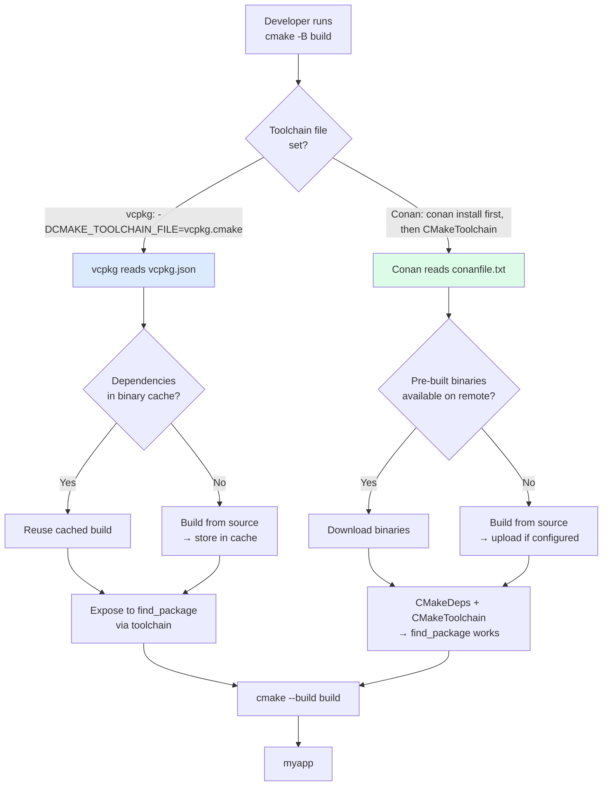

# 8. Package Managers (vcpkg, Conan)

> [!info] Cross-reference
> This note covers the modern alternatives to `FetchContent` (see [[6. CMake Advanced]]) and vendoring (`third_party/`, see [[7. Project Structure]]). Read those first to understand the build-system context into which package managers fit.

## Why This Matters

Every non-trivial C++ project depends on libraries written by other people. Without a package manager, you have three bad options:

1. **Hand-build and install dependencies on every developer's machine.** This works for two developers and fails at ten. Different versions, different install paths, different compiler ABIs.
2. **Vendor dependencies into `third_party/`.** This works for a few small libraries and collapses under a hundred-megabyte Boost or a CUDA dependency. Upgrades become a manual git-submodule dance.
3. **Use system packages** (`apt install libboost-dev`). This works for stable, system-provided libraries and fails for anything else: you get whatever ancient version the distro ships, with no control over build options, and you cannot have two versions side by side.

Package managers solve this by:

- **Reproducing dependencies** from a manifest file committed to your repo.
- **Building from source** with consistent flags (or downloading pre-built binaries).
- **Integrating with CMake** so `find_package(fmt)` "just works" without manual `CMAKE_PREFIX_PATH` configuration.
- **Tracking versions and licenses** automatically.
- **Handling transitive dependencies** — fmt, OpenSSL, ZLIB all pulled in with one declaration.

In 2025, the C++ package manager landscape has effectively consolidated around **vcpkg** (Microsoft) and **Conan** (JFrog). Both are mature, both integrate with CMake, and which one you pick is mostly a matter of preference and ecosystem fit.

## Background

C++ package management is hard for three reasons that other languages don't have:

1. **No standard ABI.** A library built with GCC 13 may not work with GCC 12, let alone Clang. CMake profiles, compiler versions, C++ standard, and even build type affect binary compatibility.
2. **No standard build system.** Some libraries use CMake, some Autotools, some hand-written Makefiles, some Bazel. A package manager must invoke each in its own way.
3. **No standard binary distribution.** Unlike npm or PyPI, there's no universal registry of pre-built C++ binaries that just work.

Go (modules), Rust (Cargo), Python (pip), Node (npm) all solve this with a single canonical package registry and an opinionated build system. C++ cannot, so vcpkg and Conan take different approaches.

## vcpkg

### Overview

vcpkg is Microsoft's C++ package manager, open-sourced in 2016. It is:

- **Source-based**: every library is built from source on your machine (or downloaded from a binary cache).
- **CMake-centric**: every vcpkg port is a CMake-based build script.
- **Manifest-mode**: a `vcpkg.json` file (committed to your repo) lists dependencies and versions, like `package.json` or `Cargo.toml`.
- **Cross-platform**: Linux, macOS, Windows, ARM, x86.
- **Trivial CMake integration**: a single toolchain file (`-DCMAKE_TOOLCHAIN_FILE=.../vcpkg.cmake`) makes vcpkg-installed libraries visible to `find_package`.

### Installation

```bash
git clone https://github.com/microsoft/vcpkg.git
cd vcpkg
./bootstrap-vcpkg.sh        # Linux/macOS
# or: .\bootstrap-vcpkg.bat  on Windows
```

This produces a `vcpkg` executable and the toolchain file at `vcpkg/scripts/buildsystems/vcpkg.cmake`.

### Classic mode (single-shot installs)

```bash
./vcpkg install fmt
./vcpkg install boost-system boost-filesystem
```

This installs packages globally into vcpkg's `installed/` directory. **Classic mode is deprecated; use manifest mode for new projects.** Mentioned here only because you'll encounter it in old tutorials.

### Manifest mode (the modern way)

Create a `vcpkg.json` next to your `CMakeLists.txt`:

```json
{
  "name": "myapp",
  "version": "1.0.0",
  "dependencies": [
    "fmt",
    {
      "name": "boost-system",
      "version>=": "1.83.0"
    },
    {
      "name": "openssl",
      "features": ["ssl3"]
    }
  ],
  "builtin-baseline": "2024-01-01"
}
```

Then configure CMake with the vcpkg toolchain:

```bash
cmake -S . -B build \
    -DCMAKE_TOOLCHAIN_FILE=$VCPKG_ROOT/scripts/buildsystems/vcpkg.cmake
cmake --build build
```

On the first configure, vcpkg reads `vcpkg.json`, downloads and builds every dependency, and makes them available to `find_package`. On subsequent configures, it uses the cache.

```cmake
# CMakeLists.txt
find_package(fmt CONFIG REQUIRED)
find_package(Boost 1.83 REQUIRED COMPONENTS system filesystem)

add_executable(myapp src/main.cpp)
target_link_libraries(myapp PRIVATE fmt::fmt Boost::system Boost::filesystem)
```

### Versioning and baselines

vcpkg versions work via a **baseline**: a git commit hash of the vcpkg repository that pins the version of every port. The `"builtin-baseline"` field in `vcpkg.json` says "use the versions from this commit." This guarantees reproducible builds across machines.

Without a baseline, vcpkg uses whatever versions are in your local checkout. With one, it pulls a known-good snapshot. Always commit a baseline.

### Binary caching

vcpkg caches built packages in `~/.cache/vcpkg` (Linux), `~/AppData/Local/vcpkg/archives` (Windows), or a configurable location. Subsequent projects that need the same library (same version, same triplet, same compiler) reuse the cache — builds go from minutes to seconds.

For teams, set up a shared binary cache (NuGet feed, GitHub Packages, or a plain HTTP server) so CI caches propagate to all developers.

### Triplets

A **triplet** describes the build target: platform, architecture, library linkage (static/dynamic). vcpkg ships many built-in triplets:

- `x64-linux` — Linux, x86-64, dynamic libs
- `x64-linux-static` — Linux, x86-64, static libs
- `x64-windows` — Windows, x86-64, dynamic MSVC
- `x64-osx` — macOS, x86-64
- `arm64-osx` — macOS, Apple Silicon
- `arm64-android` — Android, ARM64

Select a triplet via `VCPKG_TARGET_TRIPLET`:

```bash
cmake -S . -B build -DVCPKG_TARGET_TRIPLET=x64-linux-static \
    -DCMAKE_TOOLCHAIN_FILE=$VCPKG_ROOT/scripts/buildsystems/vcpkg.cmake
```

Custom triplets live in a `triplets/` directory in your project; vcpkg discovers them via `VCPKG_OVERLAY_TRIPLET`.

### Feature flags

Some packages have optional features. Specify them in the manifest:

```json
{
  "dependencies": [
    { "name": "boost-filesystem", "features": ["openssl"] }
  ]
}
```

### Pros and cons of vcpkg

| Pro                                       | Con                                                       |
| ----------------------------------------- | --------------------------------------------------------- |
| Trivial CMake integration (one toolchain) | Linux/macOS-only tools must be installed manually       |
| Source builds for full debug-ability     | First-time build can be slow (builds OpenSSL from source) |
| Binary caching speeds up rebuilds        | Binary caches are per-triplet (compiler ABI matters)      |
| Active Microsoft-backed development       | Less flexible than Conan for non-CMake projects          |
| Massive port catalog (~2500 libraries)   | No native support for non-CMake builds (Autotools wrapped) |
| Manifest mode is reproducible             | Requires a vcpkg clone on every dev machine              |

## Conan

### Overview

Conan is a JFrog-maintained C++ package manager, open-sourced in 2015. It is:

- **Python-based**: the `conan` command is a Python script. Recipes are Python files.
- **More flexible**: recipes can drive any build system (CMake, Autotools, Meson, Bazel, custom).
- **Profile-based**: a `profile` file describes compiler, version, ABI, build type, etc.
- **Decentralized**: supports multiple remotes (ConanCenter, JFrog Artifactory, local).
- **Binary-centric**: packages can be uploaded as pre-built binaries for specific configurations.

### Installation

```bash
pip install conan
conan config init        # creates ~/.conan/ with default profiles
```

### Profiles

A Conan profile captures the build configuration. Example `~/.conan/profiles/default`:

```ini
[settings]
os=Linux
os_build=Linux
arch=x86_64
arch_build=x86_64
compiler=gcc
compiler.version=13
compiler.libcxx=libstdc++11
compiler.cppstd=20
build_type=Release
[options]
[system_requires]
[env]
[conf]
tools.cmake.cmaketoolchain:generator=Ninja
```

Profiles can be selected on the command line: `conan install . -pr=debug` or `-pr:b=default -pr:h=arm64-android` (separate build and host profiles for cross-compilation).

### conanfile.txt and conanfile.py

Two ways to declare dependencies. `conanfile.txt` is for consumers:

```ini
[requires]
fmt/10.1.1
boost/1.83.0
openssl/3.2.0

[generators]
CMakeDeps
CMakeToolchain

[layout]
cmake_layout

[options]
boost/*:shared=True
```

`conanfile.py` is for libraries that themselves become packages:

```python
from conan import ConanFile
from conan.tools.cmake import CMake, cmake_layout

class MyLibConan(ConanFile):
    name = "mylib"
    version = "1.0.0"
    package_type = "library"
    settings = "os", "compiler", "build_type", "arch"
    options = {"shared": [True, False], "fPIC": [True, False]}
    default_options = {"shared": False, "fPIC": True}

    exports_sources = "CMakeLists.txt", "include/*", "src/*"

    def requirements(self):
        self.requires("fmt/10.1.1")
        self.requires("boost/1.83.0")

    def layout(self):
        cmake_layout(self)

    def build(self):
        cmake = CMake(self)
        cmake.configure()
        cmake.build()

    def package(self):
        cmake = CMake(self)
        cmake.install()

    def package_info(self):
        self.cpp_info.libs = ["mylib"]
```

### Workflow

```bash
# Install dependencies (generates CMakeDeps + CMakeToolchain files)
conan install . --output-folder=build -s build_type=Release --build=missing

# Configure (uses the generated toolchain)
cmake -S . -B build -DCMAKE_TOOLCHAIN_FILE=build/build/Release/generators/conan_toolchain.cmake

# Build
cmake --build build
```

`--build=missing` tells Conan to build from source any package that doesn't have a pre-built binary matching your profile. Without it, Conan errors out.

### Conan Center and remotes

ConanCenter is the central public registry (`https://center.conan.io`). It hosts ~1800 packages. You can add private remotes (Artifactory, Nexus) for internal packages:

```bash
conan remote add mycompany https://artifactory.mycompany.com/artifactory/api/conan/conan-local
conan upload mylib/1.0.0@mycompany/stable -r=mycompany
```

### Pros and cons of Conan

| Pro                                          | Con                                                      |
| -------------------------------------------- | -------------------------------------------------------- |
| Python-based, very flexible                   | Steeper learning curve than vcpkg                        |
| Works with any build system                   | More setup boilerplate (profiles, conanfile, generators) |
| Pre-built binary packages                     | Binary compatibility per profile can be tricky           |
| Decentralized remotes (good for enterprises)  | Recipes are more complex to write than vcpkg ports       |
| Maturity (since 2015), large ecosystem        | CMake integration requires CMakeToolchain + CMakeDeps    |

## Comparison: vcpkg vs Conan

| Aspect                  | vcpkg                                | Conan                                       |
| ----------------------- | ------------------------------------ | ------------------------------------------- |
| Backed by               | Microsoft                            | JFrog                                       |
| Implementation language | C++ / CMake                          | Python                                       |
| Build system support    | CMake-centric (others wrapped)       | Any (CMake, Autotools, Meson, Bazel, ...)    |
| Manifest format         | `vcpkg.json` (JSON)                  | `conanfile.txt` or `conanfile.py`            |
| Version pinning         | Baseline (git commit)                | Profile + recipe versions                   |
| Binary distribution     | Binary cache (per-triplet)           | Pre-built binaries per profile              |
| CMake integration       | Toolchain file (one flag)            | CMakeToolchain + CMakeDeps generators        |
| Cross-platform          | Linux, macOS, Windows                | Linux, macOS, Windows                       |
| Cross-compilation       | Triplets                             | Build/host profiles                         |
| Private packages        | Limited (NuGet feed, local cache)    | First-class (any Conan remote)              |
| Learning curve          | Gentler                              | Steeper                                     |
| Best for                | CMake-only projects, Microsoft stack | Mixed build-system, enterprise, private pkgs|

### When to choose which

- **Pick vcpkg if** your project is CMake-only, you want minimal setup, you're on Windows or mixed environments, or you work in a Microsoft-oriented stack.
- **Pick Conan if** you have non-CMake dependencies, you need private package hosting, you're building a library that will be consumed by other Conan users, or you need fine-grained control over binary distribution.

Both tools have equivalent coverage for the most popular libraries (Boost, fmt, OpenSSL, ZLIB, libcurl, etc.).

## Other Package Managers

### Hunter

Hunter is an older, CMake-only package manager based on `ExternalProject_Add`. It was popular before vcpkg matured. Today it is largely maintenance-only; new projects should use vcpkg or Conan.

### Build2

Build2 is an opinionated, integrated build system and package manager. It is its own build tool (not based on CMake). It is elegant and consistent but has a smaller ecosystem than vcpkg/Conan. Worth considering for greenfield projects that value tooling consistency over library availability.

### Spack

Spack is a package manager popular in HPC (high-performance computing). It supports multiple versions of the same library coexisting, with complex dependency graphs. Less common in general-purpose software development.

### system package managers (apt, brew, vcpkg-as-system)

`apt`, `brew`, `pacman`, etc. are fine for system libraries (`libc`, `libssl`) but bad for application-level dependencies. They offer no version control (you get what the distro ships) and no isolation between projects.

### Pre-built binaries from vendors

Some libraries (CUDA, cuDNN, Intel MKL) ship their own installers and are typically not in vcpkg/Conan. These usually integrate via `find_package` with their own `.cmake` files.

## Mermaid — Package Manager Workflow



## Example: A Complete vcpkg Project

Project layout:

```
myapp/
├── CMakeLists.txt
├── vcpkg.json
├── vcpkg-configuration.json
└── src/
    └── main.cpp
```

`vcpkg.json`:

```json
{
  "name": "myapp",
  "version": "1.0.0",
  "dependencies": [
    "fmt",
    { "name": "boost-program-options", "version>=": "1.83.0" },
    { "name": "nlohmann-json" }
  ],
  "builtin-baseline": "2024-07-01-abc123def456..."
}
```

`vcpkg-configuration.json` (optional, for team-specific settings):

```json
{
  "default-registry": {
    "kind": "git",
    "repository": "https://github.com/microsoft/vcpkg",
    "baseline": "2024-07-01-abc123def456..."
  },
  "registries": [
    {
      "kind": "git",
      "repository": "https://github.com/mycompany/private-registry",
      "packages": ["mycompany-*"]
    }
  ]
}
```

`CMakeLists.txt`:

```cmake
cmake_minimum_required(VERSION 3.20)
project(MyApp LANGUAGES CXX)

set(CMAKE_CXX_STANDARD 20)
set(CMAKE_CXX_STANDARD_REQUIRED ON)

find_package(fmt CONFIG REQUIRED)
find_package(Boost 1.83 REQUIRED COMPONENTS program_options)
find_package(nlohmann_json CONFIG REQUIRED)

add_executable(myapp src/main.cpp)
target_link_libraries(myapp PRIVATE
    fmt::fmt
    Boost::program_options
    nlohmann_json::nlohmann_json
)
```

`src/main.cpp`:

```cpp
#include <fmt/core.h>
#include <boost/program_options.hpp>
#include <nlohmann/json.hpp>
#include <iostream>
#include <fstream>

namespace po = boost::program_options;
using json = nlohmann::json;

int main(int argc, char** argv) {
    po::options_description desc("Options");
    desc.add_options()
        ("help,h", "show help")
        ("config,c", po::value<std::string>()->required(), "config file");

    po::variables_map vm;
    po::store(po::parse_command_line(argc, argv, desc), vm);
    if (vm.count("help")) { std::cout << desc; return 0; }
    po::notify(vm);

    std::ifstream in(vm["config"].as<std::string>());
    json config = json::parse(in);

    fmt::print("Hello, {}!\n", config["name"].get<std::string>());
    return 0;
}
```

Build:

```bash
export VCPKG_ROOT=/path/to/vcpkg
cmake -S . -B build -DCMAKE_TOOLCHAIN_FILE=$VCPKG_ROOT/scripts/buildsystems/vcpkg.cmake
cmake --build build -j8
```

The first configure will take a few minutes (downloading and building Boost from source). Subsequent projects that need the same Boost version will reuse the cache.

## Common Pitfalls

> [!danger] Mixing vcpkg and system packages
> If you have `libfmt-dev` installed via `apt` and also install `fmt` via vcpkg, `find_package(fmt)` may pick up either, depending on `CMAKE_PREFIX_PATH` order. Use `find_package(fmt CONFIG REQUIRED)` (the `CONFIG` keyword) to force CMake to use the package config file (vcpkg's) rather than a system `Findfmt.cmake` module.

> [!danger] Forgetting the baseline
> Without `"builtin-baseline"`, vcpkg uses your local checkout's versions. Two developers on different vcpkg commits get different dependencies. Always commit a baseline.

> [!danger] Compiler ABI mismatch
> A binary built with GCC 13 may not load libraries built with GCC 12. Always match your vcpkg/Conan compiler with your project's compiler. With Conan, set `compiler.version` and `compiler.libcxx` carefully. With vcpkg, the triplet's compiler detection handles this automatically as long as you use the same compiler.

> [!warning] Wrong libcxx with Conan
> Pre-C++11 ABI (`libstdc++`) vs C++11 ABI (`libstdc++11`) is the classic Conan gotcha. Modern Linux uses `libstdc++11` by default; old profiles may still say `libstdc++`. The error is usually a link error about `std::string` symbols. Always set `compiler.libcxx=libstdc++11` for modern GCC.

> [!warning] Classic mode vcpkg
> If you see `vcpkg install fmt` (not via manifest), you're using deprecated classic mode. New projects should always use manifest mode with a `vcpkg.json` file.

> [!warning] Missing `--build=missing` in Conan
> Conan will refuse to use a package if no pre-built binary matches your profile. Add `--build=missing` (or `--build=*` to force) so Conan builds from source when needed.

> [!warning] CMake's `find_package` not finding vcpkg packages
> If `find_package(fmt CONFIG REQUIRED)` fails, check that the toolchain file was set correctly: `cmake -DCMAKE_TOOLCHAIN_FILE=$VCPKG_ROOT/scripts/buildsystems/vcpkg.cmake`. Without it, CMake doesn't know about vcpkg's installed packages.

> [!warning] Static vs dynamic linkage mismatch
> If your project links dynamically but vcpkg installed static libs (or vice versa), you'll get link errors. Select the right triplet: `x64-linux` (dynamic) vs `x64-linux-static` (static). With Conan, set `*:shared=True/False` in `[options]`.

## Tips and Tricks

- **Pin everything** in your manifest (vcpkg.json baseline, Conan profile). Reproducibility is the whole point.
- **Set up a shared binary cache** for your team: vcpkg supports NuGet feeds and HTTP caches; Conan supports Artifactory.
- **Use `vcpkg integrate install`** on Windows to make vcpkg packages visible to Visual Studio projects automatically.
- **With Conan, use `cmake_layout`** in your conanfile to get the conventional build folder structure.
- **Use `conan lock`** to generate lock files for fully reproducible installs. Lock files pin exact versions of every transitive dependency.
- **For CMake-only projects, prefer vcpkg** — it's the simplest setup. For polyglot or enterprise environments, Conan.
- **Use `vcpkg x-update-baseline`** to bump your baseline to the latest commit and re-resolve versions.
- **Use `conan graph info . --format=json`** to inspect the dependency tree. Useful for debugging version conflicts.
- **Document your package manager setup** in `README.md` or `CONTRIBUTING.md`. New developers should be able to build with one command after cloning.
- **In CI, cache your vcpkg/Conan build directories** to avoid rebuilding from source every commit. GitHub Actions has official actions for both.
- **Use feature flags** to enable optional functionality: `vcpkg.json`'s `"features"` array or Conan's `options` section.
- **For private/internal packages**, vcpkg supports overlay ports (a local directory of custom ports) and Conan supports private remotes.
- **Audit licenses**: vcpkg ships `vcpkg install --x-feature=*` and `vcpkg list` for license info; Conan has `conan graph info . --format=json | jq '.[].license'`.
- **Cross-compile by selecting a different triplet/profile** rather than reconfiguring your toolchain. vcpkg: `-DVCPKG_TARGET_TRIPLET=arm64-android`. Conan: `-pr:h=arm64-android`.

## Active Recall

1. Why is C++ package management harder than in Python, Rust, or Go?
2. What are the three "bad" alternatives to using a package manager?
3. Describe vcpkg's manifest mode and its key file.
4. What is a vcpkg baseline, and why must you commit one?
5. What is a vcpkg triplet? Name three built-in triplets.
6. How does vcpkg integrate with CMake? What single CMake flag enables it?
7. What is a Conan profile, and what does it contain?
8. Compare `conanfile.txt` and `conanfile.py`. When would you use each?
9. What does `--build=missing` do in Conan, and why is it needed?
10. What is the classic `libstdc++` vs `libstdc++11` Conan gotcha?
11. Name three other C++ package managers besides vcpkg and Conan.
12. Give two reasons to choose vcpkg over Conan, and two to choose Conan over vcpkg.
13. Why should you avoid mixing vcpkg packages with system packages (`apt install`)?
14. How would you share pre-built binaries across a team using vcpkg? Using Conan?

## Next Steps

- See [[6. CMake Advanced]] for `find_package`, `FetchContent`, and imported targets — the foundation that package managers build on.
- See [[7. Project Structure]] for where `vcpkg.json` / `conanfile.txt` should live in your repo.
- For deeper coverage:
  - vcpkg documentation: https://learn.microsoft.com/en-us/vcpkg/
  - Conan documentation: https://docs.conan.io/
  - Both have excellent examples and tutorials.
- For vendored dependencies as a fallback, see `FetchContent` in [[6. CMake Advanced]].
- For ABI compatibility considerations, see [[3. Static vs Shared Libraries]].
