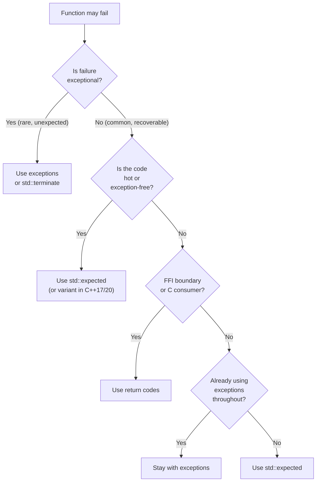

# 1. Error Handling Strategies

> [!info] Cross-reference
> This note is the umbrella for the entire Error Handling chapter. The next four notes drill into specific mechanisms: [[2. Exceptions Basics]], [[3. Exception Safety Guarantees]], [[4. Custom Exceptions]], and [[5. std expected and std error code]].

## Why This Matters

Error handling is the single largest divider between code that runs in production and code that works in the demo. Every non-trivial function has at least three outcomes: success, expected failure (the file does not exist, the network is down, the user typed bad input), and unexpected failure (invariant violation, out-of-memory, corruption). How you signal these outcomes — and how every caller must respond — determines whether your system is robust, debuggable, and composable.

C++ is unusual in giving you **four mainstream mechanisms** for error handling, each with different costs and trade-offs:

1. **Return codes** (the C way).
2. **Exceptions** (the C++ way, pre-C++23).
3. **`std::expected<T, E>`** (the C++23 way, borrowed from Rust).
4. **`std::variant<T, Error>`** / `std::optional<T>` (the type-sum way, used when full `expected` is unavailable).

Each is the right answer in some contexts and the wrong answer in others. Knowing which to use — and *not* mixing them inconsistently — is one of the highest-leverage architectural decisions you make.

## Background

Every error-handling mechanism must answer three questions:

1. **How is failure signaled?** (A magic return value? A thrown object? A union type?)
2. **How is failure propagated?** (Manually up the call stack? Automatically? Via a type-system channel?)
3. **How is failure handled?** (What does the caller have to do to acknowledge it? What happens if they don't?)

Different languages make different trade-offs:

| Language    | Primary mechanism             | Failure acknowledgment       |
| ----------- | ----------------------------- | ---------------------------- |
| C           | Return codes, `errno`         | Caller must check (often skipped) |
| C++         | Exceptions (default), return codes, `expected` | Caller may ignore (try/catch not mandatory) |
| Java        | Checked + unchecked exceptions | Checked exceptions enforced by compiler |
| Go          | Multiple return values, `error` | Caller must check `if err != nil` |
| Rust        | `Result<T, E>`                | Compiler enforces `.unwrap()` or `?` |
| Swift       | `throws` + `try`              | Compiler enforces `try` |
| Haskell     | `Either` / `Maybe` monads     | Type system enforces handling |

The deep insight from 50 years of language design: **the failure acknowledgment mechanism matters more than the failure signaling mechanism**. Languages that let callers silently ignore failures (C, Python) produce bug-prone code at scale. Languages that force acknowledgment (Rust, Swift, Java's checked exceptions) produce verbose but more reliable code.

C++ historically sat in the "caller may ignore" camp (exceptions can be uncaught, return codes can be ignored). C++23's `std::expected` brings it closer to the "type-system enforces acknowledgment" camp.

## Strategy 1 — Return Codes

### Pattern

```cpp
enum class Status { Ok, NotFound, PermissionDenied, IoError };

Status read_file(const std::string& path, std::string& out_content);

Status s = read_file("/etc/passwd", content);
if (s != Status::Ok) {
    // handle error
    return;
}
// use content
```

Or, with `errno`-style out-of-band signaling:

```cpp
int fd = open("/etc/passwd", O_RDONLY);
if (fd < 0) {
    perror("open");   // errno has the reason
    return;
}
```

### Pros

- **Zero runtime overhead.** No stack unwinding, no heap allocation.
- **Predictable control flow.** Every code path is visible in the source; no hidden returns.
- **Easy to disable at boundaries.** A C++ function calling a C function gets a return code with no exceptions crossing the boundary.
- **Embedded-friendly.** Exceptions require runtime support (`__cxa_*` from libstdc++/libc++/libunwind); return codes do not. Many embedded and game-development environments disable exceptions (`-fno-exceptions`).
- **Easy to translate to other languages** via FFI (Python, Go, Rust all deal with return codes more naturally than C++ exceptions).

### Cons

- **Easily ignored.** Nothing forces the caller to check. `(void)read_file(...);` compiles. The classic C bug.
- **Pollutes the signature.** A function that should return `std::string` instead returns `Status` and takes an out-parameter, which is awkward and prevents chaining.
- **Verbose at every call site.** `if (err) return err;` repeated 100 times per file.
- **No automatic propagation.** Each function in the chain must explicitly forward the error. Easy to forget.
- **Composability is poor.** Combining two operations that each return `Status` requires nested `if`s or early returns at every level.

### When to use

- At FFI boundaries (talking to C, Rust, Python).
- In embedded or real-time systems where exceptions are disabled.
- For expected, non-exceptional conditions where the caller will routinely handle them (a parse function returning "end of input" is not an error).
- When the function already has a natural out-of-band channel (`errno`, `WSAGetLastError`).

## Strategy 2 — Exceptions

### Pattern

```cpp
std::string read_file(const std::string& path);  // throws std::runtime_error on failure

try {
    std::string content = read_file("/etc/passwd");
    // use content
} catch (const std::exception& e) {
    std::cerr << "Error: " << e.what() << '\n';
}
```

### Pros

- **Clean signatures.** `read_file` returns `std::string` directly, no out-parameters.
- **Automatic propagation.** An exception bubbles up the call stack until caught. Functions that don't care about a particular failure don't need any error-handling code.
- **Cannot be silently ignored.** An uncaught exception terminates the program. There is no "forgot to check the return value" failure mode.
- **Composable with RAII.** Stack unwinding calls destructors, which release resources. See [[4. RAII]] in the Memory chapter.
- **Carries rich context.** Exception objects can hold arbitrary data: error messages, stack traces, error codes, source location.

### Cons

- **Hidden control flow.** A function call may throw from anywhere; you cannot tell from the signature. This is the basis of the "exceptions considered harmful" argument.
- **Runtime overhead.** Even with zero-cost exceptions (table-driven unwinding), throwing has measurable cost (~1-10 microseconds per throw, more with deep stacks). Code that throws in hot loops is slow.
- **Binary size.** Exception tables (`.eh_frame`) bloat binaries by 10-20%.
- **Not available everywhere.** Embedded, kernel, and some game engines disable exceptions. Code that uses them is non-portable to those environments.
- **Hard to do correctly.** Exception safety guarantees (see [[3. Exception Safety Guarantees]]) require careful design. The strong guarantee via copy-and-swap is non-trivial.
- **Bad interaction with concurrency.** An exception in a `std::thread` calls `std::terminate`. An exception in `std::async` is stored and rethrown on `get()` — easy to miss.

### When to use

- When failure is genuinely exceptional (rare, unexpected, requires stack unwinding to a handler far up).
- When RAII is in use and stack unwinding cleans up resources automatically.
- In application-level code where the binary-size and runtime costs are acceptable.
- When the alternative (return codes or `expected`) would clutter every call site.

### When NOT to use

- In embedded or real-time systems with `-fno-exceptions`.
- In hot inner loops where the throw cost matters.
- Across FFI boundaries (exceptions must not propagate into C, Rust, Python).
- Across DLL/SO boundaries if the consumer might be built with a different compiler (ABI incompatibility).
- For expected, non-exceptional outcomes (use `expected` or return codes).

## Strategy 3 — `std::expected<T, E>` (C++23)

### Pattern

```cpp
#include <expected>
#include <string>

enum class FileError { NotFound, PermissionDenied, IoError };

std::expected<std::string, FileError> read_file(const std::string& path);

auto result = read_file("/etc/passwd");
if (!result) {
    switch (result.error()) {
        case FileError::NotFound: /* ... */ break;
        case FileError::PermissionDenied: /* ... */ break;
        case FileError::IoError: /* ... */ break;
    }
    return;
}
std::string content = *result;
```

### Pros

- **Type-system enforced.** You must check `result` before dereferencing. The error channel is part of the type signature.
- **No runtime overhead.** No exceptions, no heap allocation. Just a tagged union.
- **Composable.** Monadic operations `and_then`, `or_else`, `transform` chain operations without ladder-style `if` checks.
- **Self-documenting.** The signature `expected<T, E>` tells you the function may fail and what the error type is.
- **Works without exceptions.** Drop-in for environments where exceptions are disabled.

### Cons

- **Verbose at every call site** (same as return codes) unless you lean heavily on monadic chaining.
- **C++23 only.** Older compilers and codebases need to wait or use `tl::expected` (a backport).
- **Propagation is manual** unless you use `and_then`/`or_else` (which is unfamiliar to many C++ programmers).
- **No automatic stack unwinding.** If you forget to forward an error, the caller may silently use a default-constructed `T`. (Though `*result` on an unexpected `expected` is UB, which is at least diagnosable.)

### When to use

- For expected, recoverable failures (file not found, parse error, validation failure).
- In performance-critical code where exceptions are too expensive.
- In APIs that need to be self-documenting about failure modes.
- When working in environments where exceptions are disabled.

### When NOT to use

- For genuinely exceptional conditions (out-of-memory, invariant violation) — those should be exceptions or `std::terminate`.
- Across FFI boundaries where the consumer doesn't understand `expected` (use a flat return code instead).

See [[5. std expected and std error code]] for the full deep dive.

## Strategy 4 — `std::variant<T, Error>` / `std::optional<T>`

### Pattern

Before C++23, `std::variant<T, Error>` was the closest thing to `expected`:

```cpp
std::variant<std::string, FileError> read_file(const std::string& path);

auto result = read_file("/etc/passwd");
if (std::holds_alternative<FileError>(result)) {
    handle_error(std::get<FileError>(result));
    return;
}
std::string content = std::get<std::string>(result);
```

Or `std::optional<T>` when you don't care about the specific error:

```cpp
std::optional<std::string> read_file(const std::string& path);

auto content = read_file("/etc/passwd");
if (!content) { /* something went wrong */ return; }
use(*content);
```

### Pros

- Available in C++17 (no need for C++23).
- Self-documenting (variant makes the "two outcomes" explicit).
- Zero-cost (tagged union).

### Cons

- No monadic operations until C++23's `and_then`/`transform` on `optional`/`variant`.
- `optional` loses the error reason; you have to remember why it failed.
- Verbose to use correctly: `std::get<T>` throws (or `std::get_if` returns nullptr), both are clunky.

### When to use

- In C++17/20 codebases that need `expected` semantics but can't use C++23.
- As a stepping stone to migrate code toward `expected`.

## Cross-Language Comparison

### Go

```go
content, err := readFile("/etc/passwd")
if err != nil {
    return err
}
```

Go's `if err != nil` is the explicit-return-code pattern enforced by culture and linters. Pros: simple, no magic. Cons: 50% of Go code is `if err != nil`. The compiler doesn't enforce checking — `_, _ = readFile(...)` is legal — but linters (`errcheck`, `golangci-lint`) catch it.

### Rust

```rust
let content: String = read_file("/etc/passwd")?;  // ? propagates the error
```

Rust's `Result<T, E>` plus the `?` operator is the gold standard. The compiler enforces that you check the result; `?` propagates errors automatically. This is what `std::expected` is modeled after, though C++ lacks the `?` operator (you write `and_then` chains or use macros).

### Java

```java
String content = readFile("/etc/passwd");  // throws IOException
```

Java's checked exceptions are compiler-enforced: the function signature declares what it throws, and the caller must catch or declare. This is the closest mainstream language to type-enforced error handling. Controversial in practice — many Java codebases wrap everything in `RuntimeException` to escape the boilerplate, defeating the purpose.

## Choosing a Strategy

Use this decision tree as a starting point; local conventions and team experience matter.



## A Comparative Example

Imagine a function that parses an integer from a string. Four implementations:

### Return code

```cpp
bool parse_int(const std::string& s, int& out) {
    try { size_t pos; out = std::stoi(s, &pos); return pos == s.size(); }
    catch (...) { return false; }
}

int value;
if (!parse_int(str, value)) { /* error */ }
```

### Exception

```cpp
int parse_int(const std::string& s) {
    size_t pos;
    int v = std::stoi(s, &pos);
    if (pos != s.size()) throw std::invalid_argument("trailing chars");
    return v;
}

try { int value = parse_int(str); }
catch (const std::exception& e) { /* error */ }
```

### `std::expected`

```cpp
std::expected<int, std::errc> parse_int(std::string_view s) {
    try {
        size_t pos;
        int v = std::stoi(std::string(s), &pos);
        if (pos != s.size()) return std::unexpected(std::errc::invalid_argument);
        return v;
    } catch (...) {
        return std::unexpected(std::errc::invalid_argument);
    }
}

auto result = parse_int(str);
if (!result) { /* use result.error() */ }
int value = *result;
```

### Monadic chaining (the killer feature of `expected`)

```cpp
auto result =
    parse_int(str)
        .and_then([](int n) { return validate(n); })           // -> expected<int, errc>
        .transform([](int n) { return n * 2; })                // -> expected<int, errc>
        .or_else([](auto e) -> std::expected<int, std::errc> {
            return 0;  // fallback on error
        });

int value = result.value_or(0);
```

The monadic version has no nested `if` checks and no exceptions thrown. The error propagates through the chain automatically. This is the style `std::expected` was designed for.

## Mixing Strategies

Real codebases will mix strategies. The rules:

1. **Pick one primary strategy per layer.** The application layer, the domain layer, and the I/O layer can each have a different strategy, but within a layer, be consistent.
2. **Translate at boundaries.** If `parse_int` returns `expected` and `caller` uses exceptions, the translation is `if (!result) throw MyError(result.error())`.
3. **Never silently swallow.** A function that returns `expected` must propagate or handle the error; ignoring it is UB.
4. **Document the choice.** Use `noexcept` to mark functions that will not throw. Use `[[nodiscard]]` on functions returning `expected` or error codes to force the caller to look at the result.

## Common Pitfalls

> [!danger] Mixing strategies inconsistently
> Some functions throw, some return codes, some return `optional` — and the caller has no way to know without reading the docs. Pick one strategy per layer and translate at boundaries.

> [!danger] Throwing in destructors
> Destructors called during stack unwinding that throw lead to `std::terminate`. Destructors must be `noexcept` (the default since C++11). See [[2. Exceptions Basics]].

> [!danger] Catching and ignoring
> `catch (...) {}` swallows the error with no logging, no recovery. At minimum, log it. Better: rethrow or translate to a richer error type.

> [!danger] Using exceptions for control flow
> "Throw to break out of a deeply nested loop" works but is slow and obscures intent. Use a labeled break, a sentinel return value, or restructure the code.

> [!warning] `expected` ignored
> `parse_int(str);` — the discarded `expected` is UB if it contains an error. Mark the function `[[nodiscard]]` to get a compiler warning.

> [!warning] Exceptions across thread boundaries
> An exception thrown in `std::thread` calls `std::terminate`. Wrap thread entry functions in try/catch and propagate the error via `std::promise`/`std::future` or a custom channel.

> [!warning] Catching by value
> `catch (std::exception e)` slices derived exceptions. Always `catch (const std::exception& e)`. See [[2. Exceptions Basics]].

> [!warning] Cross-compiler exception ABI
> A shared library built with GCC may not throw exceptions that a Clang-built executable can catch correctly. Don't let exceptions cross DLL/SO boundaries. See [[3. Static vs Shared Libraries]].

## Tips and Tricks

- **Use `[[nodiscard]]`** on functions returning `expected`, `optional`, or error codes. The compiler will warn if the caller discards the result.
- **Mark functions `noexcept`** when they truly cannot throw. This enables optimizations and documents intent. See [[2. Exceptions Basics]].
- **For embedded / `-fno-exceptions` codebases**, standardize on `std::expected` (or `tl::expected` in pre-C++23) or return codes.
- **Reserve exceptions for truly exceptional cases**: invariant violations, unrecoverable I/O failures, programmer errors. Use `expected` for expected failures.
- **Log at the catch site, not at the throw site.** The throw site doesn't know whether the error is recoverable.
- **Translate errors at layer boundaries**. A network layer's `boost::system::error_code` becomes a domain-layer `DomainError` becomes a UI-layer localized string.
- **Use `std::error_code`** for cross-library error interoperability. See [[5. std expected and std error code]].
- **For new C++23 codebases**, prefer `std::expected` for recoverable errors and exceptions for invariant violations. This is the modern consensus.
- **Profile before optimizing**. The cost of exceptions is rarely the bottleneck; the cost of *checking* return codes everywhere can be (in code complexity, not CPU).
- **Use Result-style types in APIs that ship as libraries**. Consumers can always convert to exceptions or `expected` as they see fit.

## Active Recall

1. Name the four main error-handling strategies in modern C++.
2. Give two pros and two cons of each.
3. Why does the "failure acknowledgment" mechanism matter more than the "failure signaling" mechanism?
4. Compare Go's error model with Rust's. Which is closer to `std::expected`?
5. When is using return codes the right choice? When is it the wrong choice?
6. When is using exceptions the right choice? When is it the wrong choice?
7. What does `[[nodiscard]]` do, and why is it useful for error-returning functions?
8. Explain the rule for mixing strategies across layers.
9. Why is throwing in a destructor a problem?
10. What is the `?` operator in Rust, and what is its closest C++ equivalent?
11. Give an example of a "truly exceptional" error vs. an "expected" error.
12. Why are exceptions problematic across DLL/SO boundaries?
13. What is "zero-cost exceptions"? Are they really zero-cost?
14. How does `std::expected` enable monadic chaining? Give a small example.

## Next Steps

- Continue to [[2. Exceptions Basics]] for the mechanics of `try`/`throw`/`catch`, `noexcept`, and stack unwinding.
- Then [[3. Exception Safety Guarantees]] for the Abrahams guarantees (basic, strong, nothrow).
- Then [[4. Custom Exceptions]] for designing exception hierarchies.
- Finally [[5. std expected and std error code]] for the C++23 modern alternative.
- Cross-reference [[4. RAII]] in the Memory chapter — RAII is the foundation of exception safety.
- For concurrency + error handling, see the Concurrency chapter (to be written).
- For real-world examples, study the error models of `std::filesystem` (uses `std::error_code` overloads), `Boost.Asio` (uses `boost::system::error_code`), and Rust's `std::fs` (uses `Result`).
