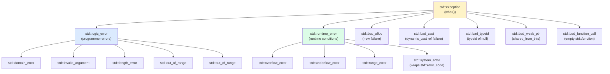
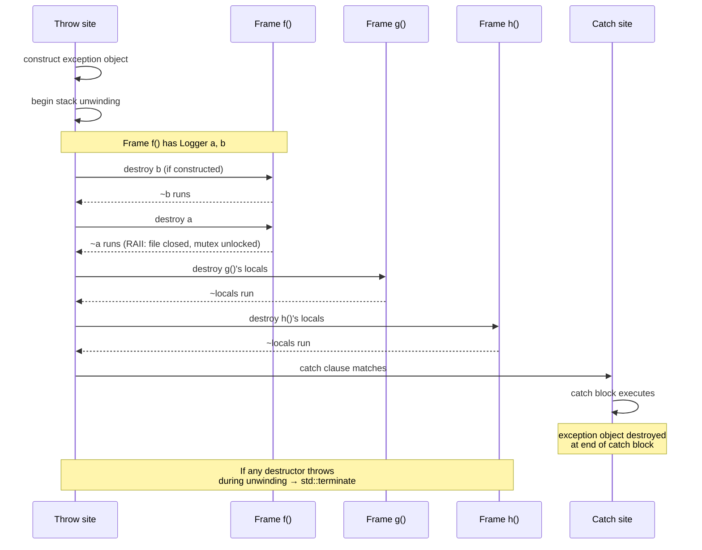

# 2. Exceptions Basics

> [!info] Cross-reference
> This is the mechanics note. For strategy and trade-offs, see [[1. Error Handling Strategies]]. For exception-safety guarantees, see [[3. Exception Safety Guarantees]]. For designing your own exception types, see [[4. Custom Exceptions]].

## Why This Matters

C++ exceptions are deceptively simple to use and notoriously difficult to use correctly. The `try`/`throw`/`catch` syntax is three keywords; the semantics involve stack unwinding, destructor calls, copy elision, the exception object's lifetime, the catch-clause ordering, the `noexcept` contract, and the catastrophic interaction with destructors and concurrency.

A solid grasp of these mechanics is the difference between:

- A function that cleans up correctly on every path.
- A function that leaks resources, double-frees, or calls `std::terminate` under load.

## Background

C++ exceptions were introduced in 1989 (CFront 2.0) to solve three problems with C-style error handling:

1. **Return codes get ignored.** `(void)fclose(f);` silently drops the error.
2. **Error propagation clutters every call site.** Half of C code is `if (err) goto cleanup;`.
3. **Destructors don't run on early return.** C has no RAII, so manual cleanup is required at every error site.

Exceptions solve all three by providing a *separate channel* for error propagation. A throw creates an exception object, copies it to a safe location, and begins *stack unwinding*: each stack frame between the throw and the matching catch is destroyed, with destructors running automatically. The exception object is delivered to the catch clause, which can inspect, log, rethrow, or translate it.

The key insight: **stack unwinding is RAII's partner**. Together they make C++ code leak-free by construction, without the manual `goto cleanup` of C. See [[4. RAII]] in the Memory chapter.

## The Three Keywords

### `throw`

`throw expr;` constructs an exception object from `expr` (by copy/move) and begins stack unwinding. The exception object's type is the *static* type of `expr` after decay — `throw "hello"` throws a `const char*`, not a `std::string`.

```cpp
throw std::runtime_error("disk full");   // throws std::runtime_error
throw 42;                                  // legal but bad style: throws int
throw;                                     // rethrows the current exception (only valid in catch)
```

> [!warning] Throwing non-class types
> Throwing `int`, `const char*`, or other primitive types compiles but is bad style. Always throw a class derived from `std::exception` so callers can `catch (const std::exception&)` to handle everything. See [[4. Custom Exceptions]].

### `try` / `catch`

```cpp
try {
    risky_operation();
} catch (const std::runtime_error& e) {
    std::cerr << "runtime: " << e.what() << '\n';
} catch (const std::logic_error& e) {
    std::cerr << "logic: " << e.what() << '\n';
} catch (const std::exception& e) {
    std::cerr << "other: " << e.what() << '\n';
} catch (...) {
    std::cerr << "unknown exception\n";
}
```

The catch clauses are tried **in order**. The first one whose declared type matches (or is a base class of) the thrown type wins. This is why **most-derived classes must come first** — if you put `catch (const std::exception&)` first, it would catch everything and the more specific clauses would be unreachable.

`catch (...)` catches any exception, including non-`std::exception` types (a `throw 42;` from legacy code). You cannot inspect the exception object inside `catch (...)` except by rethrowing it and catching it again with a typed handler.

### Catch by reference, not by value

**Always** catch by `const` reference:

```cpp
// GOOD
catch (const std::exception& e) { /* e is the actual thrown object */ }

// BAD — slicing
catch (std::exception e) { /* e is a copy with the derived part sliced off */ }

// BAD — unnecessary non-const
catch (std::exception& e) { /* fine but you usually don't need to modify */ }

// BAD — pointer (only works if someone threw a pointer, which is bad style)
catch (std::exception* e) { /* don't do this */ }
```

Catching by value **slices** the exception: if a `std::runtime_error` was thrown and you catch `std::exception e`, the `runtime_error` part is gone and `e.what()` returns the generic `std::exception` message. Catching by reference preserves the dynamic type.

## The `std::exception` Hierarchy

C++ provides a standard hierarchy in `<stdexcept>`. All derive from `std::exception` (defined in `<exception>`):



The two main branches:

- **`std::logic_error`** — represents *programmer* errors: preconditions violated, invariants broken, invalid arguments. These should be preventable by correct code; catching them is usually a code smell.
- **`std::runtime_error`** — represents *runtime* conditions: I/O failures, network errors, parse errors. These are expected to occur in production and must be caught.

Other notable standard exceptions:

- `std::bad_alloc` — thrown by `new` on out-of-memory. Almost never caught (what would you do?).
- `std::bad_cast` — thrown by `dynamic_cast<Ref>` on failure.
- `std::bad_typeid` — thrown by `typeid` on a dereferenced null pointer.
- `std::bad_weak_ptr` — thrown when constructing a `shared_ptr` from an expired `weak_ptr`.
- `std::bad_function_call` — thrown when calling an empty `std::function`.
- `std::system_error` — wraps a `std::error_code`; thrown by `<system_error>` and `<filesystem>`.

## Rethrowing

### `throw;` (the right way)

Inside a `catch` block, `throw;` (with no operand) rethrows the *current* exception, preserving its original dynamic type. This is the canonical way to translate, log, or partially handle an exception:

```cpp
try {
    risky();
} catch (const std::exception& e) {
    log_error(e);
    throw;   // rethrows with original type
}
```

### `throw e;` (the wrong way)

`throw e;` (with an operand) constructs a *new* exception by copying `e`. Since `e` is declared as `const std::exception&`, this slices the exception to `std::exception`, losing the derived type. The rethrown exception now reports `"std::exception"` from `what()` instead of the original message.

```cpp
try {
    throw std::runtime_error("disk full");
} catch (const std::exception& e) {
    throw e;   // BAD: rethrows std::exception, not std::runtime_error
}
// Caller catches std::runtime_error? NO — caller catches std::exception.
```

**Always use `throw;` to rethrow, never `throw e;`.**

## Stack Unwinding

When an exception is thrown, the runtime walks up the call stack, destroying each stack frame's local objects in reverse construction order. Each destructor runs. When a matching `catch` is found, unwinding stops and the catch block executes.

```cpp
struct Logger {
    std::string name;
    Logger(std::string n) : name(std::move(n)) {
        std::cout << "construct " << name << "\n";
    }
    ~Logger() { std::cout << "destruct " << name << "\n"; }
};

void f() {
    Logger a("a");
    throw std::runtime_error("boom");
    Logger b("b");   // never constructed
}

int main() {
    try { f(); }
    catch (const std::exception& e) { std::cout << "caught: " << e.what() << "\n"; }
}
// Output:
// construct a
// destruct a
// caught: boom
```

`a`'s destructor runs as the stack unwinds through `f`. `b` is never constructed because the throw precedes its declaration.

### Unwinding and RAII

This is why RAII matters. If `a` were a `std::ifstream` or a `std::lock_guard`, the file would be closed and the mutex unlocked automatically. With raw `fopen`/`pthread_mutex_lock`, you'd need explicit cleanup at every throw point — exactly the C problem exceptions were meant to solve.

## Exceptions During Stack Unwinding → `std::terminate`

If a destructor called during stack unwinding *itself* throws, the runtime calls `std::terminate`. This is because there is no good behavior: the runtime is already in the middle of handling one exception; throwing a second would leave the program in an undefined state.

```cpp
struct Bad {
    ~Bad() {
        throw std::runtime_error("kaboom");   // WRONG
    }
};

void f() {
    Bad b;
    throw std::logic_error("first");
}

int main() {
    try { f(); }
    catch (...) { /* never reached */ }
    // std::terminate called → abort()
}
```

Since C++11, destructors are implicitly `noexcept`. A throwing destructor calls `std::terminate` immediately. The fix: wrap any throwing operation in a destructor with `try { ... } catch (...) { /* swallow */ }`.

> [!danger] Destructors must not throw
> This is one of the few absolute rules in C++. If you must perform a fallible operation in a destructor (flush a buffer, close a socket), catch and log the error yourself. The destructor's contract is "always succeed."

## `noexcept` (C++11)

`noexcept` is a function specifier that promises the function will not throw. It serves two purposes:

1. **Documentation.** Tells callers they can rely on no exceptions.
2. **Optimization.** The compiler does not need to emit exception-handling tables for `noexcept` functions; if an exception *does* escape, `std::terminate` is called directly (no unwinding).

```cpp
void swap(int& a, int& b) noexcept {
    int t = a; a = b; b = t;
}

// Conditional noexcept — depends on the operations of T
template <typename T>
void my_swap(T& a, T& b) noexcept(noexcept(a.swap(b))) {
    a.swap(b);
}
```

The `noexcept(expr)` form makes the noexcept-ness depend on a compile-time boolean expression. The standard library uses this pervasively:

```cpp
// std::vector growth uses move only if the move is noexcept; otherwise copy
template <typename T>
void vector<T>::reserve(size_t n) {
    if (is_nothrow_move_constructible_v<T>)
        // move existing elements → strong exception safety
    else
        // copy existing elements → strong exception safety
}
```

This is why **marking your move constructor `noexcept` matters**: it lets `std::vector` use moves instead of copies during reallocation, dramatically improving performance.

### `noexcept(false)` and explicit throw lists

Pre-C++11, C++ had *exception specifications*: `void f() throw(std::runtime_error);`. These were removed in C++11 (use `noexcept` and runtime checks instead). `throw()` (empty) was kept as deprecated equivalent to `noexcept` until C++20, where it was removed entirely.

### `noexcept` violations

Calling `std::terminate` is the consequence of a `noexcept` function throwing. This is by design: the program is in an unrecoverable state. There is no `catch` for `noexcept` violations.

```cpp
void f() noexcept {
    throw std::runtime_error("oops");   // calls std::terminate
}

int main() {
    try { f(); } catch (...) {}   // does NOT catch
    // program already terminated
}
```

You can install a custom `std::terminate_handler` via `std::set_terminate` to log diagnostics before aborting.

## Mermaid — Exception Flow



## Mermaid — Catch Clause Matching

```mermaid
flowchart TB
    THROW["throw std::runtime_error(\"x\")"] --> SEARCH["Search call stack for catch"]
    SEARCH --> C1{"Catch<br/>(const std::logic_error&)<br/>?"}
    C1 -->|"No match"| C2{"Catch<br/>(const std::runtime_error&)<br/>?"}
    C2 -->|"MATCH"| RUN["Execute runtime_error<br/>catch block"]
    C1 -->|"would match if first<br/>but order matters!"| ORDER["Order matters:<br/>most-derived first"]
    C2 -->|"No match"| C3{"Catch<br/>(const std::exception&)<br/>?"}
    C3 -->|"match (base)"| EXC["Execute exception<br/>catch block"]
    C3 -->|"No match"| C4{"Catch (...) ?"}
    C4 -->|"match"| ELLIP["Execute catch-all"]
    C4 -->|"No match"| UNCAUGHT["std::terminate"]

    style RUN fill:#dcfce7
    style UNCAUGHT fill:#fee2e2
```

## Active Recall

1. What are the three keywords for exception handling in C++?
2. Why must catch clauses be ordered most-derived first?
3. What is "slicing"? Why does catching by value cause it?
4. Give the correct form of a catch clause for `std::exception`.
5. What is the difference between `throw;` and `throw e;`? Which should you use?
6. What happens during "stack unwinding"?
7. What is `std::terminate` and when is it called?
8. Why must destructors not throw?
9. What does `noexcept` do? What happens if a `noexcept` function throws?
10. Why does marking your move constructor `noexcept` matter for `std::vector` performance?
11. What is conditional `noexcept`? Give a syntax example.
12. Name five standard exception types derived from `std::exception`.
13. What is the difference between `std::logic_error` and `std::runtime_error`?
14. What does `catch (...)` catch that `catch (const std::exception&)` does not?

## Common Pitfalls

> [!danger] `throw e;` instead of `throw;`
> This slices the exception and loses the original type. Always `throw;` to rethrow.

> [!danger] Catching by value
> `catch (std::exception e)` slices. Always catch by `const` reference.

> [!danger] Throwing from a destructor
> Calls `std::terminate` during stack unwinding. Wrap fallible operations in `try/catch` inside the destructor.

> [!danger] Wrong catch order
> `catch (const std::exception&)` before `catch (const std::runtime_error&)` makes the second unreachable. Compiler may warn; don't rely on it.

> [!warning] Throwing in `noexcept` functions
> Calls `std::terminate`. Audit your `noexcept` annotations carefully, especially on move constructors and destructors.

> [!warning] `catch (...)` swallowing
> `catch (...) {}` silently eats everything, including `std::bad_alloc`. At minimum, log; usually, rethrow.

> [!warning] Exceptions across thread boundaries
> An uncaught exception in `std::thread` calls `std::terminate`. Always wrap thread entry functions in `try/catch` and forward errors via `std::promise`/`std::future`.

> [!warning] Throwing during construction
> If a constructor throws, the destructor is *not* called (because the object was never fully constructed). Member subobjects already constructed are destroyed in reverse order. Use RAII members, not raw pointers, to avoid leaks.

## Tips and Tricks

- **Always catch by `const` reference** unless you need to modify the exception (rare).
- **Use `throw;` to rethrow**, never `throw e;`.
- **Mark move constructors and destructors `noexcept`** — this enables standard library optimizations.
- **Use conditional `noexcept`** for templates: `noexcept(noexcept(...))`.
- **Document which exceptions a function may throw** in comments or `noexcept`. Modern code increasingly uses `noexcept` everywhere exceptions are not expected.
- **Translate at layer boundaries**: catch low-level exceptions, throw higher-level ones with context.
- **Use `std::exception_ptr`** to capture and rethrow exceptions across thread boundaries (or store them for later inspection). This is what `std::future` uses internally.
- **Avoid throwing in hot loops.** If you expect a failure to occur frequently, use `expected` or return codes instead.
- **Compile with `-fno-exceptions`** in environments where exceptions are forbidden; the compiler will reject `try`/`throw`/`catch`, making the constraint enforceable.
- **Catch by reference in main**: `int main() { try { ... } catch (const std::exception& e) { std::cerr << e.what() << '\n'; return 1; } catch (...) { return 2; } }` — the last line of defense.
- **Use `std::rethrow_exception(std::current_exception())`** to transport an exception across an API boundary that does not allow exceptions (rare; usually for cross-thread).
- **Profile with `-fno-exceptions`** to see the binary size savings; decide if it's worth the constraint.
- **For library code**, provide both throwing and non-throwing overloads: `void f()` throws on error, `void f(std::error_code& ec) noexcept` sets `ec` on error. `std::filesystem` is the model.

## Next Steps

- Continue to [[3. Exception Safety Guarantees]] — knowing the mechanics is half the battle; the other half is writing code that maintains invariants in the presence of exceptions.
- See [[4. Custom Exceptions]] for designing your own exception types.
- See [[5. std expected and std error code]] for the modern, non-throwing alternative.
- Cross-reference [[4. RAII]] in the Memory chapter — RAII makes exception-safe code possible.
- See [[5. Smart Pointers]] for how `unique_ptr` and `shared_ptr` interact with exceptions (hint: they make life easy).
- For exceptions and concurrency, see the Concurrency chapter.
