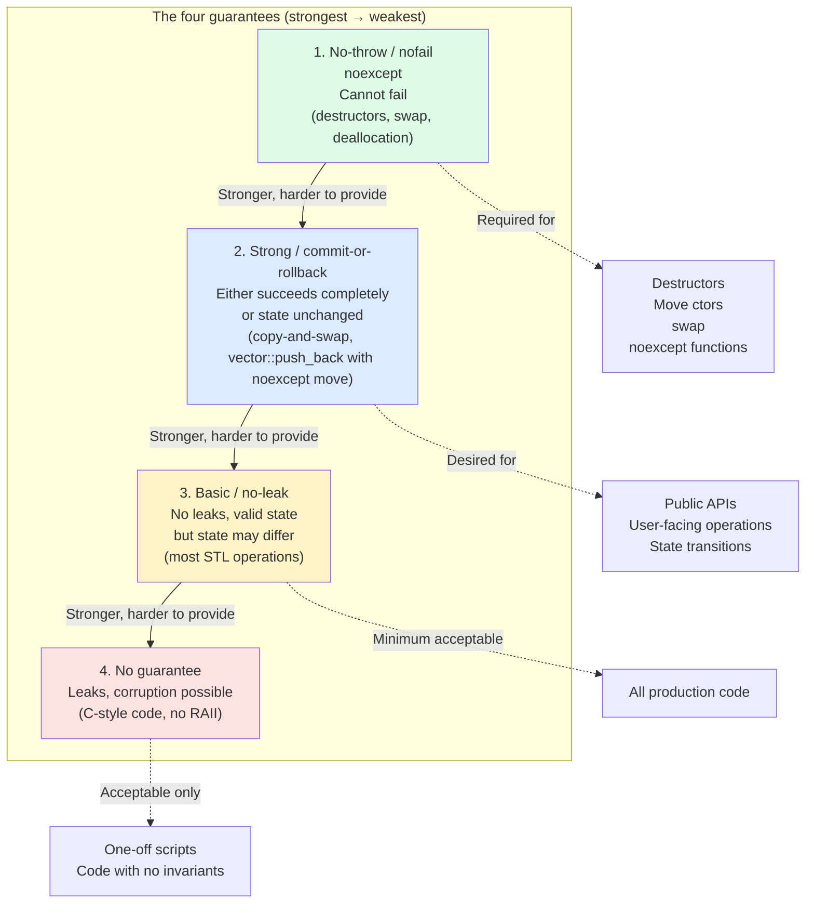
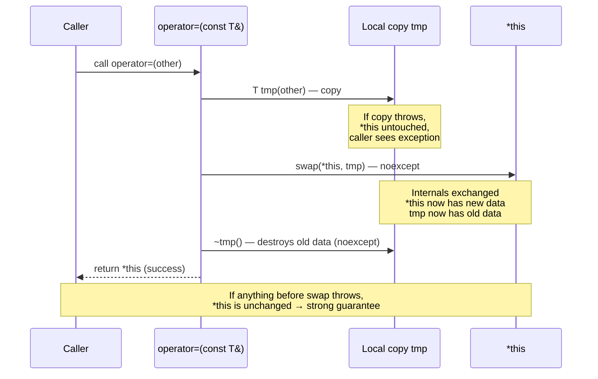
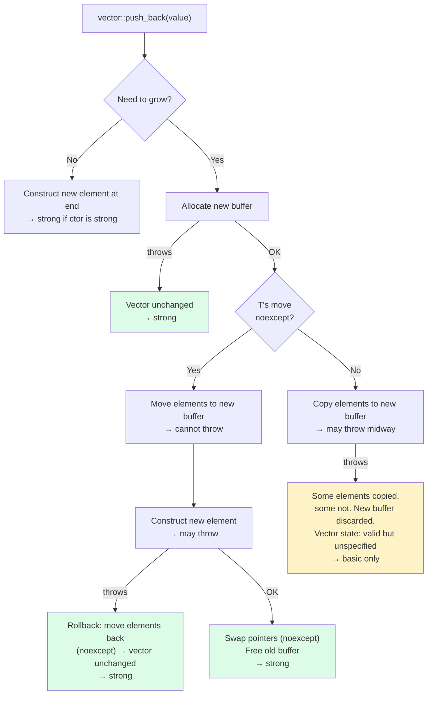

# 3. Exception Safety Guarantees

> [!info] Cross-reference
> Builds directly on [[2. Exceptions Basics]]. Read that first for the mechanics of `try`/`throw`/`catch`, `noexcept`, and stack unwinding. This note covers the *contractual* side: what guarantees your code provides to its callers in the presence of exceptions.

## Why This Matters

When a function reports failure via an exception, the caller needs to know what state the program is in. Can they retry the call? Must they abort? Are resources leaked? Are invariants intact? Without answers to these questions, exception-handling code cannot be written correctly.

David Abrahams (Boost founder, Python C API architect) formalized the answer in 1999 with his **Exception Safety Guarantees**. Every function provides one of four guarantees — explicitly or implicitly. The four guarantees form a hierarchy: stronger guarantees are easier for callers to reason about but harder for the function to provide.

Mastering these guarantees is what separates a C++ developer who *uses* exceptions from one who *designs* with exceptions. Code that provides only the basic guarantee can leak or be in an inconsistent state after an exception, requiring the caller to clean up. Code that provides the strong guarantee is *transactional*: either it succeeds completely, or it has no effect. Code that provides the no-throw guarantee can be called from contexts (destructors, move constructors, `noexcept` functions) where exceptions are forbidden.

## Background

The four guarantees are:

1. **No-throw (a.k.a. nofail)** — the function cannot fail. Marked `noexcept`.
2. **Strong (a.k.a. commit-or-rollback)** — if the function fails, the program state is exactly as it was before the call.
3. **Basic (a.k.a. no-leak)** — if the function fails, no resources are leaked and all objects remain in a valid (but unspecified) state.
4. **No guarantee** — anything can happen. Only acceptable for code that has no invariants to maintain.

Most standard library functions provide either the basic or the strong guarantee. The strong guarantee is the gold standard for "operations that should be atomic" — like `std::vector::push_back` (which is strong if the move is `noexcept`, otherwise basic).

## The Four Guarantees in Detail

### 1. No-throw guarantee

The function never throws. If it somehow does, `std::terminate` is called. Mark with `noexcept`.

Examples:

- Destructors (implicitly `noexcept` since C++11).
- Move constructors of standard types (`std::string`, `std::vector`).
- `swap` functions of well-behaved types.
- Memory deallocation (`operator delete`, `free`).
- `std::lock_guard`'s constructor (acquires mutex; `pthread_mutex_lock` does not throw C++ exceptions).

```cpp
void swap(MyClass& a, MyClass& b) noexcept {
    std::swap(a.ptr_, b.ptr_);
    std::swap(a.size_, b.size_);
}
```

The no-throw guarantee is required for code that runs during stack unwinding (destructors) or that the standard library uses in exception-sensitive contexts (`noexcept` move is required for `std::vector::reserve` to use moves rather than copies).

> [!tip] Move constructors should be `noexcept`
> If your move constructor is not `noexcept`, `std::vector` will *copy* your objects during reallocation (to preserve the strong guarantee — copy cannot throw if the type is `CopyConstructible`). This can turn a fast `vector<MyType>` into a slow one. Always mark move constructors `noexcept` when possible.

### 2. Strong guarantee (commit-or-rollback)

If the function fails (throws), the program state is exactly as it was before the call. No partial mutations, no leaks, no inconsistent objects. The function is *transactional*.

Examples:

- `std::vector::push_back` — strong if `T`'s move is `noexcept` (or if `T` is `CopyConstructible`).
- `std::list::insert` — strong.
- `std::map::insert` — strong.
- Assignment operators written with copy-and-swap — strong.
- `std::sort` — strong (uses swap, which must not throw for the comparator).

```cpp
template <typename T>
void strong_push(std::vector<T>& v, const T& value) {
    // strong guarantee: either v has the new element, or v is unchanged
    v.push_back(value);
}
```

The strong guarantee is what callers want for "user-facing" operations. If `bank.transfer(amount)` is strong, a failure leaves the bank account unchanged — no partial transfer.

#### How to achieve the strong guarantee: copy-and-swap

The canonical idiom:

```cpp
class String {
public:
    String& operator=(const String& other) {
        if (this != &other) {
            String tmp(other);    // 1. Copy — may throw, but *this untouched
            using std::swap;
            swap(*this, tmp);     // 2. Swap — must be noexcept
        }                          // 3. tmp (old data) destroyed — must be noexcept
        return *this;
    }
    // ...
private:
    char* data_;
    size_t size_;
    size_t capacity_;
};

void swap(String& a, String& b) noexcept {
    std::swap(a.data_, b.data_);
    std::swap(a.size_, b.size_);
    std::swap(a.capacity_, b.capacity_);
}
```

Walkthrough:

1. **Copy** — `String tmp(other)` allocates and copies. If allocation throws, `*this` is untouched.
2. **Swap** — `swap(*this, tmp)` exchanges the internals. Must be `noexcept` (pointer swaps are).
3. **Destroy** — `tmp`'s destructor frees the old `*this` data. Must be `noexcept` (destructors are by default).

If any step throws, only `tmp` is affected, and `*this` is unchanged. This is the strong guarantee.

C++11 made this even cleaner with move semantics:

```cpp
String& operator=(String other) noexcept {   // take by value (copy or move)
    swap(*this, other);
    return *this;
}
```

The parameter `other` is constructed by the caller (either copy or move). If that construction throws, the call never enters `operator=` and `*this` is untouched. Inside, the `noexcept` swap completes the assignment.

### 3. Basic guarantee (no-leak, valid state)

If the function fails, no resources are leaked and all objects remain in a *valid* state — but the state may be different from before the call. The caller cannot expect to retry the operation without inspecting state.

Examples:

- `std::vector::push_back` — basic guarantee if `T`'s move can throw (rare; usually move is `noexcept`). The vector may be in a valid but unspecified state.
- `std::vector::reserve(n)` — basic if `T`'s move can throw; some elements may have been moved, some not.
- Most container operations when the element type's operations can throw.

```cpp
template <typename T>
void basic_push(std::vector<T>& v, const T& value) {
    // basic guarantee: if push_back throws, v is in a valid state (no leak),
    // but the contents may have been re-arranged
    v.push_back(value);
}
```

The basic guarantee is the minimum acceptable for production code. Without it, an exception can leave the program in a corrupted state where even cleanup code can't run safely.

### 4. No guarantee

The function may leak resources, leave objects in an invalid state, or violate invariants if it throws. Acceptable only for code that has no invariants — typically low-level C-style code where the caller is expected to do manual cleanup.

```cpp
// BAD — no guarantee
void risky_init(int** out) {
    *out = static_cast<int*>(malloc(sizeof(int)));
    if (!*out) throw std::bad_alloc();   // *out is null but caller may not check
    **out = 42;
    // If second_op() throws below, *out is allocated but never freed.
    second_operation_that_might_throw();
}
```

This function leaks `*out` if `second_operation_that_might_throw` throws. Refactor with RAII:

```cpp
void safer_init(std::unique_ptr<int>& out) {
    out = std::make_unique<int>(42);    // out owns the int
    second_operation_that_might_throw();  // if it throws, unique_ptr cleans up
}
```

Now we have at least the basic guarantee (no leak).

## Examples for Each Guarantee

### Strong: copy-and-swap assignment

Already shown above. The gold standard for assignment operators.

### Strong: two-phase commit

```cpp
void build_and_publish(Config& cfg) {
    Config draft = cfg;                  // local copy
    draft.apply_changes();               // mutate the draft; may throw
    draft.validate();                    // may throw — *this untouched
    using std::swap;
    swap(cfg, draft);                    // noexcept swap commits the change
}
```

All the fallible work happens on a local draft. The final commit is a `noexcept` swap.

### Basic: vector with throwing move

```cpp
struct ThrowingMove {
    ThrowingMove(ThrowingMove&&) { /* may throw */ }
    ThrowingMove(const ThrowingMove&) { /* may throw */ }
};

std::vector<ThrowingMove> v;
v.push_back(ThrowingMove{});   // basic guarantee only
```

Because `ThrowingMove`'s move can throw, `std::vector::push_back` cannot guarantee rollback — some elements may have been moved into the new buffer when the throw happens. The vector is in a valid state, but its contents are unspecified.

### No-throw: swap

```cpp
class Buffer {
public:
    Buffer(size_t n) : data_(new char[n]), size_(n) {}
    ~Buffer() { delete[] data_; }
    Buffer(Buffer&& o) noexcept
        : data_(o.data_), size_(o.size_) { o.data_ = nullptr; o.size_ = 0; }
    friend void swap(Buffer& a, Buffer& b) noexcept {
        std::swap(a.data_, b.data_);
        std::swap(a.size_, b.size_);
    }
private:
    char* data_;
    size_t size_;
};
```

`swap` is `noexcept` because it only swaps two pointers and two integers — operations that cannot fail.

## Mermaid — Exception Safety Levels



## Mermaid — Copy-and-Swap Achieving Strong Guarantee



## Mermaid — push_back Strong vs Basic



## Common Pitfalls

> [!danger] Modifying state before fallible operations
> ```cpp
> void bad(Container& c) {
>     c.clear();              // 1. mutation
>     c.add(load_data());     // 2. fallible — if it throws, c is now empty!
> }
> ```
> The strong guarantee is broken: if `load_data` throws, `c` is cleared but not repopulated. Fix: load into a local first, then commit with a `noexcept` swap.

> [!danger] Two fallible operations in sequence without rollback
> ```cpp
> void transfer(Account& from, Account& to, int amount) {
>     from.debit(amount);      // 1. OK
>     to.credit(amount);       // 2. if this throws, `from` lost money!
> }
> ```
> Strong guarantee is broken. Fix: do both operations on temporaries, then commit.

> [!danger] Move constructors that throw
> A throwing move constructor forces `std::vector` to copy (slower) and breaks the strong guarantee on `push_back`. Always mark moves `noexcept` if at all possible.

> [!warning] `swap` that is not `noexcept`
> Copy-and-swap requires `swap` to be `noexcept`. If your `swap` calls fallible operations, the strong guarantee is broken.

> [!warning] Destructors that throw
> Breaks the basic guarantee. The destructor is the cleanup mechanism — if it can throw, no guarantee is possible. Always catch and log inside destructors.

> [!warning] Calling virtual functions during construction
> Virtual dispatch during construction does not behave as expected (it dispatches to the current type, not the most-derived). If a base constructor throws, derived members are not yet constructed, and unwinding may behave surprisingly.

> [!warning] Forgetting the self-assignment check
> ```cpp
> T& operator=(const T& other) {
>     delete[] data_;                  // if other == *this, we just freed our own data!
>     data_ = new char[strlen(other.data_) + 1];
>     strcpy(data_, other.data_);
>     return *this;
> }
> ```
> Copy-and-swap handles self-assignment naturally (you swap with a copy of yourself), but the naive implementation needs `if (this != &other)`.

## Tips and Tricks

- **Aim for the strong guarantee on public APIs**. Callers can retry, propagate, or recover knowing the state is clean.
- **Accept the basic guarantee internally** when the strong guarantee would double the work (e.g., re-allocating a vector that already grew).
- **Always provide `noexcept` swap** for your types. It unlocks copy-and-swap and STL optimizations.
- **Always mark move constructors `noexcept`** when the move is just pointer swaps.
- **Use copy-and-swap for assignment operators**. It's the easiest way to get the strong guarantee and self-assignment safety in one shot.
- **Two-phase commit**: do fallible work on a local, commit with a `noexcept` swap. This pattern is universal for strong-guarantee code.
- **Use `std::unique_ptr` for owning members**. Its destructor is `noexcept`, so your destructor is too.
- **Avoid raw `new`/`delete`**. Use `make_unique`, `make_shared`, containers, or RAII wrappers. Every raw `new` is a potential leak if an exception fires between allocation and the assignment to a smart pointer.
- **Document the guarantee** in your function's comment. "Provides the strong guarantee" or "Basic guarantee: state may be partially mutated on failure."
- **Audit code that throws during partial state**: constructors that allocate then construct members, functions that mutate multiple members, functions that take locks then mutate.
- **For container-like types**, model your guarantees on the standard library: strong for single-element insertions, basic for multi-element operations.
- **For `noexcept` functions that call non-`noexcept` functions**, wrap in `try/catch (...)` and translate to `std::terminate` (or rethrow as a different type, but only outside `noexcept`).
- **Use `std::experimental::scope_success` / `scope_fail` / `scope_exit`** (or the equivalent `gsl::finally`) for transactional cleanup. C++26 is expected to standardize these as `std::scope_fail` etc.
- **For complex transactions**, consider the Command pattern: build a list of operations, validate them, then execute them in a way that can be rolled back.

## Active Recall

1. Name the four exception safety guarantees in order from strongest to weakest.
2. Which guarantee is required for destructors? Why?
3. Why does `std::vector::push_back` provide the strong guarantee only when `T`'s move is `noexcept`?
4. Explain the copy-and-swap idiom. Why does it provide the strong guarantee?
5. What is two-phase commit? Give a small example.
6. Why must `swap` be `noexcept` for copy-and-swap to work?
7. What is the minimum acceptable guarantee for production code?
8. Give an example of code that breaks the strong guarantee by mutating state before a fallible operation.
9. Why is a throwing move constructor bad for `std::vector` performance?
10. What happens to a class's destructor if its constructor throws?
11. Why is the basic guarantee sometimes acceptable where the strong is too expensive?
12. Give two patterns for achieving the strong guarantee.
13. Why is it important to mark `swap` and move constructors `noexcept` even if you don't directly call them?
14. What does "no-leak, valid state" mean? Is a vector with an unspecified number of elements a "valid state"?

## Next Steps

- See [[4. Custom Exceptions]] for designing exception types that carry the context needed for callers to act on the guarantee.
- See [[5. std expected and std error code]] for a modern alternative that sidesteps many exception-safety concerns by avoiding exceptions entirely.
- Cross-reference [[4. RAII]] in the Memory chapter — RAII is the foundation on which all exception safety rests.
- See [[5. Smart Pointers]] for how `unique_ptr` and `shared_ptr` make basic and strong guarantees easy.
- For the original formulation, see David Abrahams' "Exception Safety in Generic Components" (1998) and Herb Sutter's "Exceptional C++" books.
- For modern guidelines, see the C++ Core Guidelines (GSL) sections on error handling.
