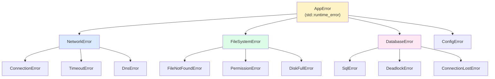
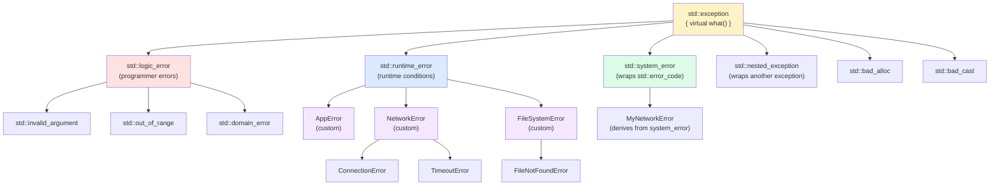

# 4. Custom Exceptions

> [!info] Cross-reference
> Builds on [[2. Exceptions Basics]] (the standard hierarchy and the mechanics of throw/catch) and supports [[3. Exception Safety Guarantees]] (the contract you provide to callers). Read those first.

## Why This Matters

The standard `<stdexcept>` exceptions (`std::runtime_error`, `std::logic_error`, etc.) carry only a string message. Real applications need much more:

- **Structured error information**: not just "file not found", but *which file*, *which path*, *what errno*, *at what source location*, *with what stack trace*.
- **Domain-specific hierarchies**: a network layer should have `ConnectionError`, `TimeoutError`, `DnsError` — all derived from a `NetworkError` base so callers can `catch (const NetworkError&)` to handle all network issues.
- **Error codes** for translation to other systems (HTTP status, gRPC codes, POSIX errno).
- **Context chaining**: "operation failed because sub-operation failed because syscall failed".
- **Localization**: `what()` may need to return a user-facing, localized message.

Throwing bare `std::runtime_error("foo")` everywhere is the C++ equivalent of writing `printf("error\n")` to stderr — it works for toys, fails for production. Designing a custom exception hierarchy is one of the highest-leverage architectural decisions in a C++ codebase, because every error path will use it.

## Background

The standard library's `<stdexcept>` provides the foundation:

- `std::exception` — the base, with virtual `what()` returning a C-string.
- `std::logic_error` / `std::runtime_error` — two main branches, taking a `std::string` in their constructor.
- `std::system_error` — wraps a `std::error_code` (the modern way to carry OS-level error information).

The conventional wisdom, formalized in the C++ Core Guidelines (E.14), is:

1. **Throw by value, catch by reference.** Throwing by value (e.g., `throw MyError(...)`) avoids leaks (the runtime manages the exception object). Catching by reference avoids slicing.
2. **Derive from `std::exception` (or one of its derived classes).** This lets callers `catch (const std::exception&)` to handle everything.
3. **Use `std::runtime_error` (or `std::exception`) as the base for application exceptions**. Reserve `std::logic_error` for programmer errors that should be fixed in code, not caught at runtime.
4. **Override `what()`** to provide a useful message. Make it `const noexcept` to match the base class signature.
5. **Carry structured data** as members. Expose via accessors.
6. **Keep exceptions copyable and cheap to construct**. The runtime copies the exception object on throw (and may copy again during unwinding); a heavy exception type slows every throw.

## Deriving from `std::exception`

The simplest custom exception:

```cpp
#include <exception>
#include <string>

class AppError : public std::exception {
public:
    explicit AppError(std::string msg) : msg_(std::move(msg)) {}
    const char* what() const noexcept override { return msg_.c_str(); }
private:
    std::string msg_;
};

throw AppError("something went wrong");
```

Notes:

- `what()` is `const noexcept override` — the `noexcept` is required to match the base class signature (and is the right thing for an accessor).
- `msg_` is a `std::string`, not a `const char*`. The base class `std::exception::what()` returns a `const char*`, so we hold the data as `std::string` and return `c_str()`. The string lives as long as the exception object does.
- The constructor takes `std::string` by value — cheap (move) and lets callers pass string literals, `std::string`, `std::string_view`-converted, etc.

### Deriving from `std::runtime_error`

`std::runtime_error` already handles the `std::string` storage for you:

```cpp
#include <stdexcept>

class NetworkError : public std::runtime_error {
public:
    NetworkError(const std::string& msg, int error_code)
        : std::runtime_error(msg), error_code_(error_code) {}
    int code() const noexcept { return error_code_; }
private:
    int error_code_;
};

throw NetworkError("connection refused", 111);
```

`std::runtime_error`'s constructor stores the message; `what()` returns it. We just add the `error_code_` field and accessor.

### When to use `std::logic_error` vs `std::runtime_error`

- **`std::logic_error`** — the error is *preventable by correct code*: a violated precondition, an invalid argument, an out-of-range index. These should be caught only at the top level (in `main`) to log and crash. Catching them elsewhere usually masks bugs.
- **`std::runtime_error`** — the error is *unpreventable at write-time*: I/O failure, network failure, parse failure. These are expected and must be handled by the application.

Use `std::logic_error` (or its derived classes like `std::invalid_argument`) for assertions that fire in production:

```cpp
#include <stdexcept>

double sqrt_checked(double x) {
    if (x < 0) throw std::invalid_argument("sqrt of negative number");
    return std::sqrt(x);
}
```

Use `std::runtime_error` (or your derived class) for environmental failures:

```cpp
throw NetworkError("connection refused", errno);
```

## Custom `what()` Implementation

The default `what()` from `std::runtime_error` returns whatever string you passed to its constructor. If you want a richer message (e.g., one that incorporates the error code), override `what()`:

```cpp
class FileError : public std::runtime_error {
public:
    FileError(const std::string& operation, const std::string& path, int err)
        : std::runtime_error(""), operation_(operation), path_(path), err_(err) {
        // Pre-format the message once, in the constructor.
        formatted_ = operation_ + "('" + path_ + "') failed: " + std::strerror(err_);
    }
    const char* what() const noexcept override { return formatted_.c_str(); }
    const std::string& path() const noexcept { return path_; }
    int err() const noexcept { return err_; }
private:
    std::string operation_;
    std::string path_;
    int err_;
    std::string formatted_;
};

try {
    if (open("/etc/shadow", O_RDONLY) < 0)
        throw FileError("open", "/etc/shadow", errno);
} catch (const FileError& e) {
    std::cerr << e.what() << "\n";        // "open('/etc/shadow') failed: Permission denied"
    std::cerr << "path: " << e.path() << "\n";
    std::cerr << "errno: " << e.err() << "\n";
}
```

Key points:

- We pre-format the message in the constructor so `what()` is O(1) and never throws.
- `what()` is `noexcept`, so it cannot allocate or do anything fallible. Format once, return the cached `c_str()`.
- We expose structured accessors (`path()`, `err()`) so callers can do programmatic recovery, not just print a message.

## Adding Context: Source Location

C++20's `<source_location>` lets you capture the file, line, and function of the throw site:

```cpp
#include <source_location>
#include <stdexcept>

class TraceableError : public std::runtime_error {
public:
    TraceableError(const std::string& msg,
                   const std::source_location& loc = std::source_location::current())
        : std::runtime_error(msg), loc_(loc) {
        formatted_ = std::string(loc_.file_name()) + ":" +
                     std::to_string(loc_.line()) + ": " + msg;
    }
    const char* what() const noexcept override { return formatted_.c_str(); }
    const std::source_location& where() const noexcept { return loc_; }
private:
    std::source_location loc_;
    std::string formatted_;
};

// Usage — default argument captures caller's location:
throw TraceableError("disk full");
```

`std::source_location::current()` as a default argument is the canonical C++20 idiom for capturing call-site information without macros.

## Adding a Stack Trace

`std::stacktrace` (C++23, `<stacktrace>`) provides a portable way to capture a stack trace:

```cpp
#include <stacktrace>
#include <stdexcept>
#include <string>

class TracedError : public std::runtime_error {
public:
    TracedError(const std::string& msg)
        : std::runtime_error(msg),
          trace_(std::stacktrace::current()) {
        formatted_ = msg + "\nStack trace:\n" +
                     std::to_string(trace_);
    }
    const char* what() const noexcept override { return formatted_.c_str(); }
    const std::stacktrace& trace() const noexcept { return trace_; }
private:
    std::stacktrace trace_;
    std::string formatted_;
};
```

Compile with `-std=c++23 -lstdc++_exp` (GCC) or equivalent. On older compilers, use `boost::stacktrace` or the platform-specific `backtrace()` from `<execinfo.h>`.

> [!warning] Capturing a stack trace is expensive
> `std::stacktrace::current()` walks the stack and symbolizes each frame. Cost: 1-100 ms per throw depending on stack depth. Only use for genuinely unexpected errors; for hot-path errors, use `std::expected` or `std::error_code`.

## Exception Hierarchies

A real application typically has a hierarchy:



```cpp
class AppError : public std::runtime_error { /* ... */ };
class NetworkError : public AppError { /* ... */ };
class ConnectionError : public NetworkError { /* ... */ };
class TimeoutError : public NetworkError { /* ... */ };
class DnsError : public NetworkError { /* ... */ };
class FileSystemError : public AppError { /* ... */ };
class FileNotFoundError : public FileSystemError { /* ... */ };
// ... etc.
```

Now callers can handle at any granularity:

```cpp
try {
    download(url);
} catch (const DnsError& e) {
    // Most specific: only DNS failures
    suggest_alternate_dns();
} catch (const TimeoutError& e) {
    // Timeouts
    retry_with_backoff();
} catch (const NetworkError& e) {
    // Any other network error
    log_network_failure(e);
} catch (const AppError& e) {
    // Any application-level error (FS, DB, etc.)
    log_app_error(e);
} catch (const std::exception& e) {
    // Anything else
    log_unknown(e);
}
```

### Designing the hierarchy

- **Make the base class derive from `std::runtime_error`** (or `std::exception`). This integrates with the standard library's catch sites.
- **Group by domain, not by implementation.** A `DatabaseError` covers SQL, NoSQL, and file-based databases; don't call it `SqliteError`.
- **Use intermediate abstract bases** to allow domain-wide catches (`NetworkError`, `FileSystemError`).
- **Don't go too deep.** Three or four levels is usually enough. Deeper hierarchies are harder to navigate and catch correctly.
- **Don't make exceptions too granular.** If `TimeoutError` is caught the same way as `ConnectionError`, they should be one type.
- **Provide `what()` at every level** that adds information. The base provides the message; derived classes can prepend or replace.

## Wrapping `std::error_code` and `std::system_error`

`std::system_error` (in `<system_error>`) is the standard library's bridge between exceptions and `std::error_code`. Use it (or derive from it) when wrapping OS-level errors:

```cpp
#include <system_error>

void open_file(const std::string& path) {
    int fd = ::open(path.c_str(), O_RDONLY);
    if (fd < 0) {
        throw std::system_error(errno, std::system_category(),
                                "open('" + path + "')");
    }
    // ...
}

try { open_file("/etc/shadow"); }
catch (const std::system_error& e) {
    if (e.code() == std::errc::permission_denied) {
        // handle specifically
    } else {
        std::cerr << e.what() << " (code " << e.code().value() << ")\n";
    }
}
```

For your own exception classes that carry an error code, derive from `std::system_error`:

```cpp
class NetworkError : public std::system_error {
public:
    NetworkError(int err, const std::string& op)
        : std::system_error(err, std::system_category(), op) {}
};
```

See [[5. std expected and std error code]] for the deep dive on `std::error_code`.

## Exception Nesting (`std::exception_ptr`)

Sometimes you want to translate an exception while preserving the original:

```cpp
try {
    lower_layer_op();
} catch (const std::exception& e) {
    std::throw_with_nested(HighLevelError("higher layer failed"));
}

// Later, unwrap:
try { /* ... */ }
catch (const HighLevelError& e) {
    try { std::rethrow_if_nested(e); }
    catch (const std::exception& inner) {
        std::cerr << "Caused by: " << inner.what() << "\n";
    }
}
```

`std::throw_with_nested` constructs a `std::nested_exception` mixin that wraps the current exception. `std::rethrow_if_nested` extracts and rethrows the inner exception. This is how the standard library preserves the original `std::system_error` when wrapping filesystem operations.

## Mermaid — `std::exception` Hierarchy (Standard + Custom)



## A Complete Example

```cpp
#include <exception>
#include <stdexcept>
#include <string>
#include <source_location>
#include <sstream>

namespace myapp {

// Base class for all application errors
class AppError : public std::runtime_error {
public:
    AppError(const std::string& msg,
             std::source_location loc = std::source_location::current())
        : std::runtime_error(format(msg, loc)), loc_(loc) {}
    const std::source_location& location() const noexcept { return loc_; }
private:
    static std::string format(const std::string& msg,
                              const std::source_location& loc) {
        std::ostringstream os;
        os << "[" << loc.file_name() << ":" << loc.line() << " " 
           << loc.function_name() << "] " << msg;
        return os.str();
    }
    std::source_location loc_;
};

// Network errors
class NetworkError : public AppError {
public:
    using AppError::AppError;
};
class ConnectionRefusedError : public NetworkError {
public:
    using NetworkError::NetworkError;
};
class TimeoutError : public NetworkError {
public:
    TimeoutError(std::chrono::milliseconds elapsed,
                 std::source_location loc = std::source_location::current())
        : NetworkError("timeout after " + std::to_string(elapsed.count()) + "ms",
                       loc),
          elapsed_(elapsed) {}
    std::chrono::milliseconds elapsed() const noexcept { return elapsed_; }
private:
    std::chrono::milliseconds elapsed_;
};

// Filesystem errors
class FileSystemError : public AppError {
public:
    FileSystemError(const std::string& msg, std::string path,
                    std::source_location loc = std::source_location::current())
        : AppError(msg + " (path: " + path + ")", loc),
          path_(std::move(path)) {}
    const std::string& path() const noexcept { return path_; }
private:
    std::string path_;
};

}  // namespace myapp

// Usage
void fetch_url(const std::string& url) {
    if (url.empty())
        throw myapp::AppError("empty URL");
    if (!dns_lookup(url))
        throw myapp::ConnectionRefusedError("DNS failed for " + url);
    // ...
}

int main() {
    try { fetch_url(""); }
    catch (const myapp::TimeoutError& e) {
        std::cerr << "Timeout: " << e.what() << " (after "
                  << e.elapsed().count() << "ms)\n";
    }
    catch (const myapp::NetworkError& e) {
        std::cerr << "Network: " << e.what() << "\n";
    }
    catch (const myapp::AppError& e) {
        std::cerr << "App: " << e.what() << "\n";
        std::cerr << "At: " << e.location().file_name() << ":"
                  << e.location().line() << "\n";
    }
    catch (const std::exception& e) {
        std::cerr << "Unknown: " << e.what() << "\n";
    }
}
```

This is a production-ready foundation. Note how:

- The base `AppError` automatically captures source location.
- Domain-specific subclasses (`NetworkError`, `FileSystemError`) carry domain-specific data.
- Callers can catch at any level of the hierarchy.
- The `using` declarations (`using NetworkError::NetworkError;`) inherit constructors, reducing boilerplate.

## Common Pitfalls

> [!danger] Throwing a pointer
> `throw new MyError("foo");` allocates on the heap and throws a pointer. The runtime does not free it, leading to a leak, and `catch (const MyError&)` won't match a `MyError*`. Always throw by value: `throw MyError("foo");`.

> [!danger] Throwing a non-class type
> `throw 42;` is legal but you must `catch (int)`, which is fragile. Always throw a class derived from `std::exception`.

> [!danger] Not deriving from `std::exception`
> A custom exception class that does not derive from `std::exception` cannot be caught by `catch (const std::exception&)`, breaking the universal catch in `main`. Always derive from `std::exception` (or `std::runtime_error`).

> [!danger] `what()` that allocates
> `what()` is `noexcept`. If it builds the string on the fly and the string allocation throws, `std::terminate` is called. Pre-format in the constructor and return a cached `c_str()`.

> [!danger] Slicing in catch clauses
> `catch (std::exception e)` slices. Always `catch (const std::exception& e)`. See [[2. Exceptions Basics]].

> [!warning] Deep hierarchies
> Six levels of exception inheritance (`AppError` → `IoError` → `NetworkError` → `HttpError` → `HttpClientError` → `HttpClientTimeoutError`) is a code smell. Callers can't remember the order. Three or four levels is enough.

> [!warning] Too many exception types
> If every error has its own type, you have hundreds of types and no one knows which to catch. Group similar errors under a common base.

> [!warning] Carrying non-copyable data
> The runtime copies the exception object on throw. If your exception holds a `std::unique_ptr` or other non-copyable member, the throw won't compile. Use `std::shared_ptr` or a copyable wrapper.

> [!warning] Carrying huge data
> Throwing a 100 KB exception object is wasteful and slow. Exceptions should carry diagnostics, not data. For large error payloads, use `std::expected` or a side channel.

> [!warning] Catching too high in the hierarchy
> `catch (const std::exception&)` swallows everything, including `std::bad_alloc` and `std::logic_error`. Catch the most specific type that makes sense at each level.

## Tips and Tricks

- **Derive from `std::runtime_error` for application errors**, `std::logic_error` for programmer errors, `std::system_error` for OS-error-wrapping types.
- **Override `what()` to return a pre-formatted message** built in the constructor.
- **Carry structured data** (paths, error codes, source locations) as members with `const` accessors.
- **Use `std::source_location::current()` as a default argument** to capture throw-site info without macros.
- **Use `std::throw_with_nested`** to wrap lower-level exceptions while preserving context.
- **Define a base class per application domain** (`AppError`, `LibraryError`) so callers can catch at the domain level.
- **Keep exceptions small and copyable**. Avoid heavy data members; use a `std::shared_ptr<std::vector<...>>` if you must carry large context.
- **Provide both throwing and non-throwing overloads**: `void f()` throws on error; `void f(std::error_code& ec)` sets `ec`. `std::filesystem` is the model.
- **Document which exceptions a function may throw**, ideally with `noexcept` (for the none case) or Doxygen comments.
- **Use a single `format` helper** for messages: `throw AppError(fmt::format("foo {} bar {}", a, b));`. The base class can accept a `std::string`.
- **Test your exception hierarchy**: every `throw` site should be reachable from a test that catches and asserts on the type and message.
- **Log at the catch site, not the throw site**. The throw site doesn't know if the error is recoverable; the catch site does.
- **Consider `std::exception_ptr` for cross-thread propagation**: capture in the worker thread, store in a `std::promise`, rethrow in the consumer thread.

## Active Recall

1. Why should custom exceptions derive from `std::exception` (or one of its derived classes)?
2. What is the correct signature for an overridden `what()`?
3. Why must `what()` not allocate?
4. How do you carry a string in a custom exception? Where do you store it?
5. Show how to use `std::source_location::current()` to capture the throw site.
6. What is `std::throw_with_nested` for? When would you use it?
7. What is `std::exception_ptr` and what is it used for?
8. Why is throwing a pointer (`throw new MyError();`) bad?
9. Give two reasons to use `std::runtime_error` over `std::logic_error` as the base for your custom exceptions.
10. When would you derive from `std::system_error` instead of `std::runtime_error`?
11. Why does the runtime copy the exception object on throw? What constraint does this place on your exception type?
12. What is the "catch by const reference" rule? What goes wrong if you catch by value?
13. How do `using Base::Base;` declarations reduce boilerplate in exception hierarchies?
14. Give three tips for designing an exception hierarchy.

## Next Steps

- See [[5. std expected and std error code]] for the modern, non-throwing alternative that combines well with custom error types.
- See [[1. Error Handling Strategies]] for when to use exceptions vs. other mechanisms.
- See [[2. Exceptions Basics]] for the mechanics of throw/catch.
- See [[3. Exception Safety Guarantees]] for how your exception types interact with the strong and basic guarantees.
- Cross-reference the OOP chapter (to be written) for inheritance and virtual functions.
- For real-world examples, study `<boost/system/system_error.hpp>`, `<boost/beast/http/error.hpp>`, and the standard `<filesystem>` exception design.
