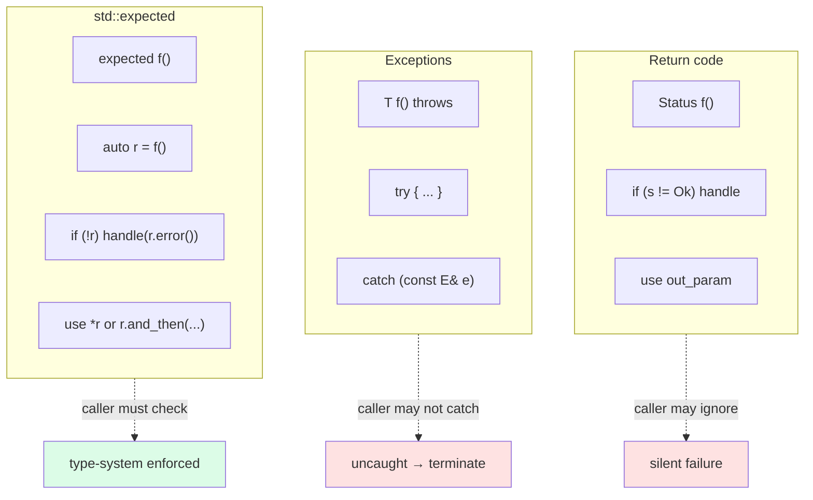

# 5. std::expected and std::error_code

> [!info] Cross-reference
> This is the modern, non-throwing alternative to [[2. Exceptions Basics]] and [[4. Custom Exceptions]]. Read [[1. Error Handling Strategies]] first for when to use `expected` vs. exceptions.

## Why This Matters

C++23 finally shipped `std::expected<T, E>`, the type-sum-based error-handling mechanism that Rust developers have enjoyed since 1.0 (as `Result<T, E>`) and Haskell developers since forever (as `Either E T`). `std::expected` is the most significant error-handling addition to C++ since exceptions themselves.

Combined with `std::error_code` (a lightweight, ABI-stable error value that has been in the standard since C++11), `std::expected` lets you write code that:

- **Cannot silently ignore errors** — the type system forces the caller to check.
- **Has zero runtime overhead** compared to exceptions (no stack unwinding, no exception tables).
- **Works without exceptions enabled** (`-fno-exceptions`), making it suitable for embedded and real-time systems.
- **Composes via monadic operations** — `and_then`, `or_else`, `transform` — eliminating ladder-style `if` checks.
- **Interoperates across libraries** via `std::error_code`'s category-based design.

If you are writing new C++23 code, `std::expected` is the recommended primary error-handling mechanism for *recoverable* errors. Exceptions remain for *exceptional* errors (invariant violations, unrecoverable state). `std::error_code` is the bridge between them and the rest of the system (errno, OS APIs, cross-language FFI).

## Background

### The path to `std::expected`

| Year | Event |
| ---- | ----- |
| 2008 | Rust announces; `Result<T, E>` is its error type from day one. |
| 2014 | C++14 ships; no monadic error type. |
| 2017 | `std::variant` and `std::optional` ship in C++17, providing building blocks. |
| 2018 | `tl::expected` (a third-party library by Simon Brand) becomes the de facto reference. |
| 2020 | `std::expected` proposal (P0323) enters C++23 working draft. |
| 2023 | C++23 ships `std::expected` with monadic operations. |
| 2024+ | Major compilers (GCC 13+, Clang 16+, MSVC 19.36+) ship full support. |

### The path to `std::error_code`

`std::error_code` has been in C++ since C++11, designed by Christopher Kohlhoff (the Boost.Asio author). It is the foundation for `<system_error>` and `<filesystem>`. Despite being over a decade old, it remains underused — many C++ developers reach for exceptions or `int`-errno even when `std::error_code` would be a better fit.

## `std::expected<T, E>` Basics

`std::expected<T, E>` is a tagged union: it holds either a value of type `T` or an error of type `E`. The signature alone tells you the function can fail and what the error type is.

### Construction and access

```cpp
#include <expected>
#include <string>

enum class ParseError { Empty, InvalidChar, OutOfRange };

std::expected<int, ParseError> parse_int(std::string_view s) {
    if (s.empty()) return std::unexpected(ParseError::Empty);
    int result = 0;
    for (char c : s) {
        if (c < '0' || c > '9') return std::unexpected(ParseError::InvalidChar);
        result = result * 10 + (c - '0');
        if (result > 1000000) return std::unexpected(ParseError::OutOfRange);
    }
    return result;   // implicit conversion to expected<int, ParseError>
}

auto r = parse_int("42");
if (r.has_value()) {
    std::cout << *r << "\n";          // 42
} else {
    std::cout << "error: " << static_cast<int>(r.error()) << "\n";
}
```

API summary:

| Operation                | Meaning                                              |
| ------------------------ | --------------------------------------------------- |
| `expected<T, E> e(val)`  | Construct with a success value.                     |
| `expected<T, E> e(std::unexpected(err))` | Construct with an error.               |
| `e.has_value()` / `static_cast<bool>(e)` | True if success.                  |
| `*e`                     | Dereference to access the value (UB if error).      |
| `e.value()`              | Access the value; throws (or `terminate` if no exceptions) if error. |
| `e.error()`              | Access the error (UB if success).                   |
| `e.value_or(default)`    | Value if success, otherwise `default`.              |
| `e.error_or(default)`    | Error if failure, otherwise `default`.              |
| `e.and_then(f)`          | Monadic bind: call `f` on the value if success.     |
| `e.or_else(f)`           | Call `f` on the error if failure.                   |
| `e.transform(f)`         | Map: apply `f` to the value if success.             |
| `e.transform_error(f)`   | Map: apply `f` to the error if failure.             |

### `std::unexpected`

`std::unexpected<E>` is a wrapper used to construct the error variant of `expected`. Without it, `expected<int, MyError>` couldn't distinguish "construct from a value of type `MyError`" (which would be ambiguous if `MyError` is convertible to `int`) from "construct the error variant". `std::unexpected(err)` explicitly says "this is the error".

## Monadic Operations

The killer feature. Instead of nested `if` checks:

```cpp
std::expected<int, ParseError> a = parse_int("1");
if (!a) return a;  // propagate
std::expected<int, ParseError> b = parse_int("2");
if (!b) return b;
std::expected<int, ParseError> c = parse_int("3");
if (!c) return c;
return a.value() + b.value() + c.value();
```

You write:

```cpp
return parse_int("1")
    .and_then([&](int a) { return parse_int("2").transform([a](int b) { return a + b; }); })
    .and_then([&](int ab) { return parse_int("3").transform([ab](int c) { return ab + c; }); });
```

OK, that's not actually clearer. The monadic style shines when you have a chain of independent operations on the same value:

```cpp
std::expected<User, Error> get_user(int id);
std::expected<Email, Error> get_email(const User&);
std::expected<void, Error> send_email(const Email&);

auto result = get_user(42)
    .and_then(get_email)
    .and_then(send_email);
```

Each `and_then` receives the success value and returns a new `expected`. If any step fails, the chain short-circuits and the final `result` contains the error. This is the Rust `?` operator, expressed as method calls.

### `transform` vs `and_then`

- **`transform(f)`**: `f` returns a plain `U`. Result is `expected<U, E>`. Use for pure transformations.
- **`and_then(f)`**: `f` returns an `expected<U, E>`. Result is `expected<U, E>`. Use for fallible operations.

```cpp
auto r = parse_int("42")
    .transform([](int n) { return n * 2; })           // int -> int
    .and_then([](int n) { return validate(n); });     // int -> expected<int, Error>
```

### `or_else` and `transform_error`

- **`or_else(f)`**: `f` returns an `expected<T, F>`. Called only on error. Use for recovery or error translation.
- **`transform_error(f)`**: `f` returns a plain `F`. Maps the error type.

```cpp
auto r = parse_int("abc")
    .or_else([](ParseError e) -> std::expected<int, ParseError> {
        if (e == ParseError::InvalidChar) return 0;  // recover with default
        return std::unexpected(e);
    })
    .transform_error([](ParseError e) { return std::string("parse failed"); });
// r is expected<int, std::string>
```

## Comparison with Rust's `Result`

| Aspect                       | C++ `std::expected<T, E>`      | Rust `Result<T, E>`             |
| ---------------------------- | ------------------------------ | ------------------------------- |
| Syntax                       | `std::expected<T, E>`          | `Result<T, E>`                  |
| Construct success            | `expected(val)`                | `Ok(val)`                       |
| Construct error              | `std::unexpected(err)`         | `Err(err)`                      |
| Check                        | `e.has_value()` / `bool(e)`    | `matches!(e, Ok(_))` / `is_ok()`|
| Access value                 | `*e` / `e.value()`             | `e.unwrap()` / `e?`             |
| Access error                 | `e.error()`                    | `e.unwrap_err()`                |
| Propagate (early return)     | manual `if (!e) return e;`     | `e?` operator (auto-propagate)  |
| Monadic bind                 | `and_then(f)`                  | `and_then(f)`                   |
| Map                          | `transform(f)`                 | `map(f)`                        |
| Map error                    | `transform_error(f)`           | `map_err(f)`                    |
| Default if error             | `value_or(dflt)`               | `unwrap_or(dflt)`               |

The biggest difference: Rust's `?` operator auto-propagates errors. C++ has no equivalent; you either write `if (!e) return std::unexpected(e.error());` explicitly or chain with `and_then`. Several proposals (P2561 `??` operator, P2927 `try` expression) aim to bring this to C++26 or later.

## `std::error_code`

`std::error_code` is a small, ABI-stable value type that represents an OS- or library-level error. It has two components:

- An `int value()` — the error number.
- A `const std::error_category& category()` — the "namespace" for the value.

Two `error_code`s are equal only if both `value()` and `category()` match. This lets multiple libraries use error value `1` without collision: library A's `1` is in `A's_category`, library B's `1` is in `B's_category`.

```cpp
#include <system_error>
#include <cerrno>
#include <cstring>

std::error_code ec;
FILE* f = fopen("/nonexistent", "r");
if (!f) {
    ec = std::error_code(errno, std::system_category());
    std::cerr << "Error " << ec.value() << ": " << ec.message() << "\n";
    // "Error 2: No such file or directory"
}
```

### `std::errc` — standard error conditions

`<system_error>` defines `std::errc`, an enum of portable error conditions mapped from POSIX errno values:

```cpp
if (ec == std::errc::no_such_file_or_directory) {
    // portable check
}
```

`std::errc::no_such_file_or_directory` is a `std::error_condition` (a portable abstraction), not an `error_code`. The comparison `ec == std::errc::xxx` works because `error_category::equivalent` is defined to map between them.

### `std::error_condition` vs `std::error_code`

- **`std::error_code`** — concrete, platform-specific. `errno` 2 on Linux, `ERROR_FILE_NOT_FOUND` (2) on Windows.
- **`std::error_condition`** — abstract, portable. `std::errc::no_such_file_or_directory` means the same thing on every platform.

The pattern: produce `error_code` at the OS boundary, compare against `error_condition` (via `std::errc`) for portable logic.

### Custom error categories

Define your own category for library-specific errors:

```cpp
#include <system_error>

enum class MyLibError {
    Success = 0,
    InvalidInput,
    NetworkDown,
    Timeout,
};

class MyLibErrorCategory : public std::error_category {
public:
    const char* name() const noexcept override {
        return "mylib";
    }
    std::string message(int ev) const override {
        switch (static_cast<MyLibError>(ev)) {
            case MyLibError::Success:       return "success";
            case MyLibError::InvalidInput:  return "invalid input";
            case MyLibError::NetworkDown:   return "network down";
            case MyLibError::Timeout:       return "operation timed out";
        }
        return "unknown";
    }
    // Map MyLibError to a portable std::errc for cross-library comparison
    std::error_condition default_error_condition(int ev) const noexcept override {
        switch (static_cast<MyLibError>(ev)) {
            case MyLibError::InvalidInput:
                return std::errc::invalid_argument;
            case MyLibError::Timeout:
                return std::errc::timed_out;
            default:
                return {ev, *this};
        }
    }
};

const std::error_category& mylib_category() {
    static MyLibErrorCategory instance;
    return instance;
}

std::error_code make_error_code(MyLibError e) {
    return {static_cast<int>(e), mylib_category()};
}

// Register MyLibError as an error_code enum:
namespace std {
    template<>
    struct is_error_code_enum<MyLibError> : true_type {};
}
```

Now you can write:

```cpp
std::error_code ec = MyLibError::NetworkDown;   // implicit conversion
if (ec == MyLibError::Timeout) { /* ... */ }
if (ec == std::errc::invalid_argument) { /* ... */ }  // via default_error_condition
```

This is the canonical pattern. `std::error_code` is the lingua franca for OS-style errors; every library that produces errors should define its own category and enum.

## `std::expected` + `std::error_code`

The combination is the modern idiom for recoverable errors:

```cpp
std::expected<int, std::error_code> parse_int(std::string_view s) {
    if (s.empty()) return std::unexpected(make_error_code(std::errc::invalid_argument));
    int result = 0;
    for (char c : s) {
        if (c < '0' || c > '9')
            return std::unexpected(make_error_code(std::errc::invalid_argument));
        result = result * 10 + (c - '0');
    }
    return result;
}

auto r = parse_int("42");
if (!r) {
    if (r.error() == std::errc::invalid_argument) {
        std::cerr << "bad input\n";
    }
    return 1;
}
std::cout << *r << "\n";
```

Using `std::error_code` as the error type gives you:

- Cross-library comparability (`ec == std::errc::xxx`).
- A standard `message()` method for human-readable strings.
- A clean path to throw a `std::system_error` if needed (it accepts an `error_code`).

## When to use `expected` vs exceptions

| Use `std::expected` when...                       | Use exceptions when...                           |
| ------------------------------------------------- | ------------------------------------------------ |
| Failure is expected and recoverable               | Failure is exceptional and rare                  |
| Performance matters (hot paths)                   | Performance of error paths doesn't matter        |
| The function signature should advertise failures  | The function should have a clean signature        |
| Code runs with `-fno-exceptions`                  | Code can use exceptions                          |
| The caller is expected to handle the error        | The error should propagate far up the stack      |
| You want type-system-enforced error handling      | You want RAII-driven cleanup                     |
| Cross-FFI (Rust, Go, C)                           | Same-language, same-binary                       |
| Errors carry structured data                      | Errors carry stack traces and rich context        |

The modern consensus: **`std::expected` for expected failures, exceptions for invariant violations**.

## Mermaid — `std::expected` Monadic Operations

```mermaid
flowchart LR
    START["expected<T, E><br/>e"] --> HAS{"has_value()?"}

    HAS -->|"yes (value v)"| T1["transform(f)"]
    HAS -->|"yes (value v)"| T2["and_then(f)"]
    HAS -->|"no (error err)"| T3["or_else(f)"]
    HAS -->|"no (error err)"| T4["transform_error(f)"]

    T1 --> T1R["expected<U, E><br/>holds f(v)"]
    T2 --> T2R["expected<U, E><br/>= f(v)<br/>(if f returns ok)")
    T2 -.->|"f returns error"| T2R2["expected<U, E><br/>= f(v)<br/>(propagated error)"]
    T3 --> T3R["expected<T, F><br/>= f(err)<br/>(recovery)"]
    T4 --> T4R["expected<T, F><br/>holds f(err)"]

    HAS -->|"yes"| SKIP1["or_else(f)<br/>skipped<br/>returns same e"]
    HAS -->|"no"| SKIP2["transform(f)<br/>skipped<br/>returns same e as expected<U, E>"]

    style T1R fill:#dcfce7
    style T2R fill:#dcfce7
    style T2R2 fill:#fef3c7
    style T3R fill:#dbeafe
    style T4R fill:#dbeafe
```

## Mermaid — `expected` vs Exceptions vs Return Codes



## A Complete Example: File I/O with `expected`

```cpp
#include <expected>
#include <system_error>
#include <fstream>
#include <string>
#include <string_view>

namespace mylib {

enum class FileError {
    NotFound,
    PermissionDenied,
    IoError,
    Unknown,
};

class FileErrorCategory : public std::error_category {
public:
    const char* name() const noexcept override { return "mylib.file"; }
    std::string message(int ev) const override {
        switch (static_cast<FileError>(ev)) {
            case FileError::NotFound:         return "file not found";
            case FileError::PermissionDenied: return "permission denied";
            case FileError::IoError:          return "I/O error";
            case FileError::Unknown:          return "unknown error";
        }
        return "unknown";
    }
    std::error_condition default_error_condition(int ev) const noexcept override {
        switch (static_cast<FileError>(ev)) {
            case FileError::NotFound:         return std::errc::no_such_file_or_directory;
            case FileError::PermissionDenied: return std::errc::permission_denied;
            case FileError::IoError:          return std::errc::io_error;
            default:                          return {ev, *this};
        }
    }
};

inline const std::error_category& file_error_category() {
    static FileErrorCategory instance;
    return instance;
}

inline std::error_code make_error_code(FileError e) {
    return {static_cast<int>(e), file_error_category()};
}

}  // namespace mylib

namespace std {
template<>
struct is_error_code_enum<mylib::FileError> : true_type {};
}

namespace mylib {

std::expected<std::string, std::error_code> read_file(std::string_view path) {
    std::ifstream in(std::string{path}, std::ios::binary);
    if (!in) {
        if (errno == ENOENT) return std::unexpected(FileError::NotFound);
        if (errno == EACCES) return std::unexpected(FileError::PermissionDenied);
        return std::unexpected(FileError::IoError);
    }
    std::ostringstream contents;
    contents << in.rdbuf();
    if (in.bad()) return std::unexpected(FileError::IoError);
    return contents.str();
}

}  // namespace mylib

// Usage
int main(int argc, char** argv) {
    auto content = mylib::read_file(argv[1])
        .or_else([](std::error_code ec) -> std::expected<std::string, std::error_code> {
            std::cerr << "Warning: " << ec.message() << ", using default\n";
            return std::string{"default content"};
        })
        .transform([](std::string s) {
            // Process the file content
            for (auto& c : s) c = std::toupper(static_cast<unsigned char>(c));
            return s;
        });

    if (!content) {
        std::cerr << "Fatal: " << content.error().message() << "\n";
        return 1;
    }

    std::cout << *content << "\n";
    return 0;
}
```

This example shows:

- A custom error category for the library.
- `is_error_code_enum` specialization to enable implicit conversion.
- `read_file` returning `expected<string, error_code>`.
- `or_else` for recovery (fall back to default content).
- `transform` for chaining (uppercase the content).
- The final check is only needed if any step failed and recovery didn't kick in.

Compare this to an exceptions-based version: it would be a `try`/`catch` block, with no compile-time enforcement that the caller handled the error.

## Backports

If you're on C++17 or C++20, you can use **`tl::expected`** (https://github.com/TartanLlama/expected), a single-header library that backports `std::expected` with near-identical API. Migration to `std::expected` is a find-and-replace of `tl::` to `std::`.

## Common Pitfalls

> [!danger] Accessing `*e` on an error
> `*e` and `e.error()` are UB if the expected holds the wrong variant. Always check `has_value()` first, or use `value()` / `value_or()` which are safe.

> [!danger] Using `value()` with exceptions disabled
> `e.value()` throws `std::bad_expected_access<E>` on error if exceptions are enabled. With `-fno-exceptions`, it calls `std::terminate`. Prefer `*e` after a `has_value()` check in exception-free code.

> [!danger] Forgetting to propagate
> ```cpp
> auto r = parse_int(s);
> if (!r) { /* log */ }
> use(*r);  // UB if r was an error!
> ```
> Always `return` on error, not just log and continue.

> [!danger] `expected<bool, E>` ambiguity
> `expected<bool, E>` has surprising conversions — `bool(exp)` is `has_value()`, not the contained bool. Always use `*e` or `e.value()` explicitly.

> [!warning] Wrong error type
> If you use `expected<T, int>` and store raw errno values, you lose the category information. Always use `std::error_code` or a custom error type, not raw ints.

> [!warning] Heavy error types
> `expected<Big, Big>` doubles the size of the return type. Use small error types (enums, `error_code`) and put big payloads in `shared_ptr` if needed.

> [!warning] Forgetting `[[nodiscard]]`
> A discarded `expected` is a silent failure. Always mark `expected`-returning functions `[[nodiscard]]`:
> ```cpp
> [[nodiscard]] std::expected<int, Error> parse_int(std::string_view s);
> ```

> [!warning] Mixing `expected` and exceptions inconsistently
> If `f()` returns `expected` and `g()` throws, the caller has to handle both. Pick one strategy per layer.

> [!warning] Throwing from `and_then`'s callable
> `and_then` does not catch exceptions. If your callable throws, the exception propagates. Don't mix throwing and `expected` in the same chain.

> [!warning] `value_or` evaluating eagerly
> `e.value_or(expensive_computation())` evaluates the argument eagerly, even on the success path. Use `or_else` with a lambda for lazy defaults:
> ```cpp
> e.or_else([](auto) { return expected<T, E>(expensive()); })
> ```

## Tips and Tricks

- **Mark `expected`-returning functions `[[nodiscard]]`** to get a compiler warning if the caller discards.
- **Prefer `std::error_code` as the error type** for cross-library interoperability.
- **Define your own `error_category`** for library-specific errors, with `default_error_condition` mapping to `std::errc`.
- **Use `and_then` for fallible chaining, `transform` for pure transforms.**
- **Use `or_else` for recovery, `transform_error` for error translation.**
- **Keep error types small** — the `expected` size is `max(sizeof(T), sizeof(E))` plus a discriminator. Big error types bloat every return slot.
- **Use `tl::expected` as a C++17/20 backport** with identical API. Migration to `std::expected` is trivial.
- **Translate at boundaries**: catch exceptions and return `std::unexpected(std::make_error_code(...))` at API entry points; throw `std::system_error(ec)` when leaving a no-throw zone.
- **Combine with `std::source_location`** for richer error context:
> ```cpp
> [[nodiscard]] std::expected<T, Error> f(std::source_location loc = std::source_location::current());
> ```
- **Provide a `try_` macro** if you want Rust-style propagation. (Or wait for `??` in C++26.)
- **Test error paths explicitly**: every `return std::unexpected(...)` should be exercised by a test that asserts the error.
- **Profile before optimizing**: `expected` has zero cost on the success path (no allocations, no unwinding), but the size of the return type can affect ABI and cache behavior.
- **Use `std::expected<void, E>`** for operations that may fail but produce no value.
- **For complex error chains**, use `std::throw_with_nested`-style nesting: store the original error in the new error type as `std::error_code original`.

## Active Recall

1. What is `std::expected<T, E>` and what problem does it solve?
2. How do you construct an `expected` with an error value?
3. What is the difference between `*e` and `e.value()`?
4. What does `e.and_then(f)` do? What signature must `f` have?
5. What does `e.transform(f)` do? How is it different from `and_then`?
6. How do you recover from an error in a chain? What method do you use?
7. What is the difference between `std::error_code` and `std::error_condition`?
8. What is `std::errc`? Give three example values.
9. How do you create a custom error category? What methods must you implement?
10. Why would you specialize `std::is_error_code_enum` for your enum?
11. Compare `std::expected` with Rust's `Result`. What's the biggest missing feature in C++?
12. Why should `expected`-returning functions be marked `[[nodiscard]]`?
13. Give two reasons to use `expected` over exceptions.
14. Give one reason to use exceptions over `expected`.

## Next Steps

- This is the final note in the Error Handling chapter. Loop back to [[1. Error Handling Strategies]] for the umbrella view.
- See [[2. Exceptions Basics]] and [[4. Custom Exceptions]] for the exception-based alternative.
- See [[3. Exception Safety Guarantees]] for how exceptions interact with state — `expected` sidesteps many of these concerns because there's no stack unwinding.
- Cross-reference [[4. RAII]] in the Memory chapter — `expected` and RAII are complementary: `expected` for error propagation, RAII for resource cleanup.
- For real-world `expected`-style APIs, study Rust's `std::fs`, Haskell's `Data.Either`, and `tl::expected`'s documentation.
- For C++26 proposals on `?`-style propagation, see P2561 (`??` operator) and P2927 (`try` expression).
