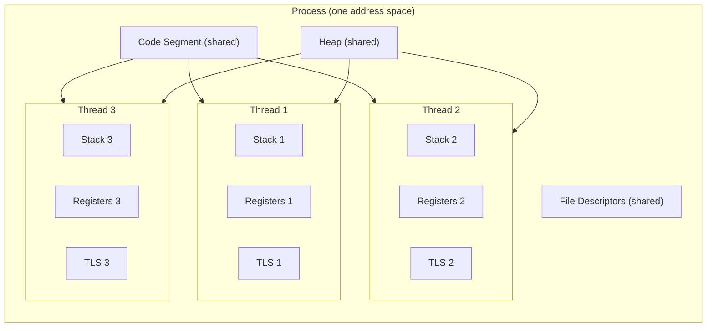
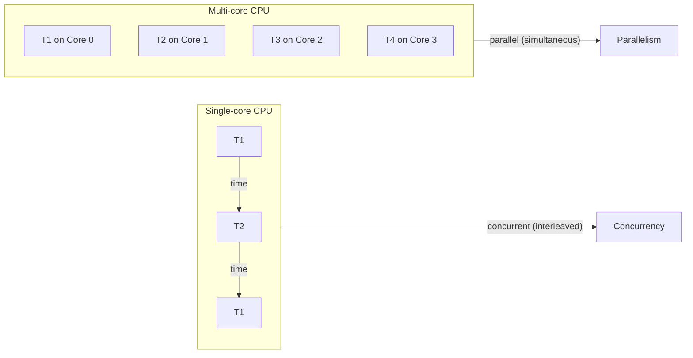
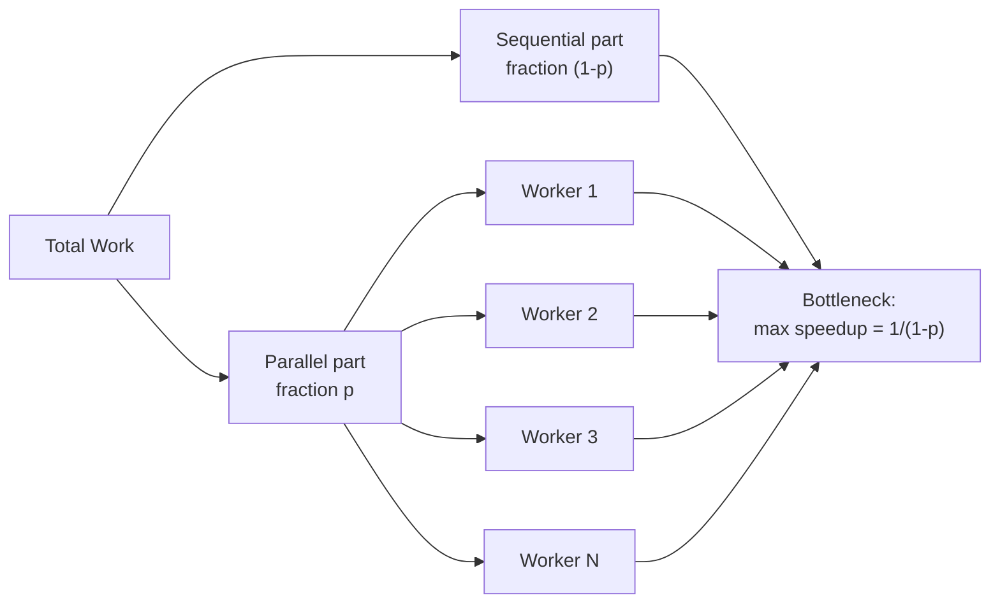
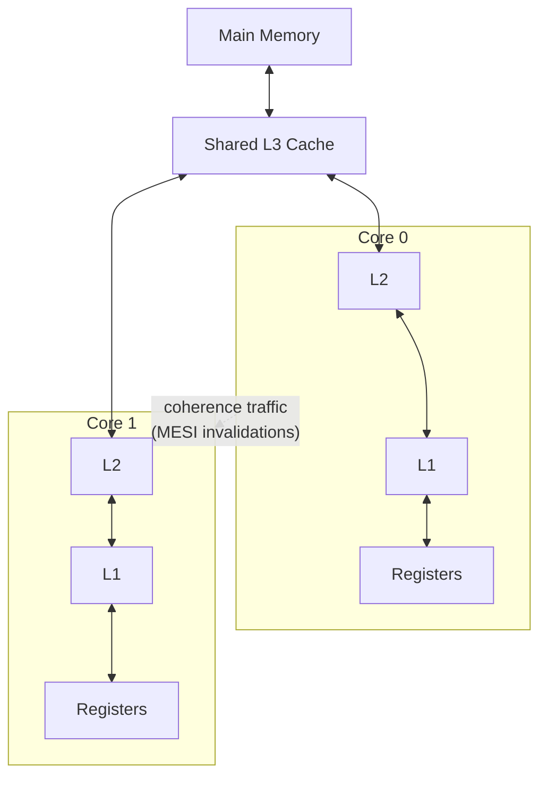

# 1. Introduction to Multithreading

> [!note] Why this chapter exists
> Modern CPUs no longer get faster by raising clock speeds; they get faster by adding cores. To use those cores you must write **concurrent** code. This note is the conceptual foundation for every other note in [[14. Concurrency and Multithreading]] — if you skip it, the rest will feel like a bag of tricks instead of a coherent mental model.

## Why It Matters

Single-threaded C++ programs top out at the speed of one core. On a 16-core machine, that means you are paying for 15 cores you never use. Multithreading lets you:

- **Speed up CPU-bound work** — divide a large computation across cores (parallelism).
- **Keep UIs responsive** — push blocking I/O (disk, network, database) onto a background thread.
- **Model concurrent problems naturally** — a web server handling 1000 clients *is* a concurrent system; pretending it is sequential makes the code harder, not easier.

But multithreading also introduces an entire category of bugs that *do not exist* in single-threaded code: **data races**, **deadlocks**, **livelocks**, **spurious wakeups**, **memory-ordering bugs**, and the worst of all — bugs that only reproduce once in ten thousand runs. The rest of this chapter teaches the tools; this note teaches you *why* those tools exist.

## Background

### Process vs Thread

A **process** is an operating-system abstraction for a running program. Each process has:

- Its own **virtual address space** (code, heap, stack, mapped files).
- Its own **file descriptor table**.
- Its own **credentials** (uid, gid).
- A **kernel object** representing its scheduling state.

A **thread** is a unit of execution *inside* a process. Threads in the same process share:

- The **heap** (everything `new`/`malloc`'d).
- The **code segment** (the compiled instructions).
- The **open file descriptors**.
- The **process credentials**.

But each thread has its own:

- **Stack** (local variables, return addresses).
- **Register state** (including the program counter).
- **Thread-local storage** (`thread_local` variables in C++).

This sharing is what makes threads powerful (cheap communication through shared memory) and dangerous (cheap communication through shared memory).



### Concurrency vs Parallelism

These two words are constantly conflated. They are *related* but not the same.

- **Concurrency** — a program is *structured* to deal with multiple things at once. It is about *composition*. A concurrent program can run on a single core via time-slicing.
- **Parallelism** — a program is *executing* multiple things at once. It is about *execution*. Parallelism requires hardware (multiple cores, SIMD units, GPUs).

> [!quote] Rob Pike
> Concurrency is about dealing with lots of things at once. Parallelism is about doing lots of things at once.

A single-core machine can run a concurrent program (the OS time-slices threads so they appear to progress simultaneously). It cannot run a parallel program. A 16-core machine can run both, but a sequential program on it uses one core.



### Why Multithreading

| Use case | Benefit | Example |
|----------|---------|---------|
| **CPU-bound parallelism** | Finish faster by using N cores | Image processing, ray tracing, matrix multiply |
| **I/O-bound responsiveness** | Don't block the main/UI thread | GUI app, web server, database client |
| **Throughput** | Overlap I/O with compute | Async file copy, batch image encoder |
| **Natural modeling** | Code matches the real-world concurrency | Game loop, network protocol stack |

The classic case for parallelism is **CPU-bound** work: rendering a frame, training a model, compressing a file, simulating physics. Split the work into chunks, give each chunk to a thread, run on N cores, get up to N× speedup (in theory).

The classic case for concurrency without parallelism is **I/O-bound** work: a web server handling 10 000 mostly-idle connections. Each connection spends 99% of its time waiting for the network. One thread per connection works because the OS context-switches efficiently between blocked threads.

### Amdahl's Law

If a fraction $p$ of your program is parallelizable and the fraction $1-p$ is strictly sequential, then the maximum speedup on $N$ processors is:

$$
\text{Speedup}(N) = \frac{1}{(1 - p) + \frac{p}{N}}
$$

Even with infinite processors, the speedup is bounded by $\frac{1}{1-p}$. If 10% of your program is sequential, you can never go faster than 10×, no matter how many cores you buy.



> [!warning] Practical implication
> Before parallelizing, profile and shrink the sequential portion. Amdahl's law is unforgiving: the sequential 5% is the ceiling, not the floor.

### Race Conditions and Data Races

A **race condition** is any situation where the behavior of the program depends on the relative timing of events in different threads. Not all race conditions are bugs — some are intentional (e.g., a "first one wins" cache fill).

A **data race** is a specific, well-defined kind of race condition. Per the C++ memory model ([intro.races]), a data race occurs when:

1. Two or more threads access the same memory location, **and**
2. At least one of the accesses is a **write**, **and**
3. The accesses are **not synchronized** (no happens-before relationship via a mutex, atomic, or similar).

A data race is **undefined behavior** in C++. The compiler is allowed to do anything — produce the "wrong" answer, crash, appear to work, or work today and break tomorrow when you upgrade the compiler.

The classic demonstration is unsynchronized `counter++`:

```cpp
#include <iostream>
#include <thread>
#include <vector>

int counter = 0;          // shared, not synchronized

void bump() {
    for (int i = 0; i < 100'000; ++i) {
        counter++;        // read + add + write — NOT atomic
    }
}

int main() {
    std::vector<std::thread> ts;
    for (int i = 0; i < 10; ++i) ts.emplace_back(bump);
    for (auto& t : ts) t.join();
    std::cout << counter << '\n';   // expected 1,000,000; gets ~600,000 and varies
}
```

`counter++` looks like one operation but is three: **load** the value, **add** one, **store** the result. Two threads can both load the same value (say, 5), both add one (both get 6), and both store 6. One increment is lost. Multiply by millions of iterations and the final answer is far below 1 000 000.

The three traditional fixes are:

1. **Mutex** — wrap the increment in a critical section. See [[3. Mutexes and Locks]].
2. **Atomic** — use `std::atomic<int>` so the read-modify-write is indivisible. See [[6. Atomics and Memory Ordering]].
3. **No sharing** — give each thread its own counter, sum at the end.

### Critical Sections

A **critical section** is a region of code that accesses shared mutable data and must not be executed by more than one thread at a time. The mechanism that enforces this is called **mutual exclusion** (hence "mutex").

Properties of a good critical section:

- **Short** — hold the lock for the minimum time necessary. Long critical sections serialize the program and destroy the parallelism benefit.
- **Focused** — do only the shared-memory access inside; do I/O, computation, and allocations outside.
- **Exception-safe** — use RAII so the lock is released even if an exception is thrown. See [[3. Mutexes and Locks]].
- **Deadlock-free** — never acquire two locks in different orders in different threads. See [[3. Mutexes and Locks]].

```cpp
std::mutex m;
int shared = 0;

void safe_bump() {
    for (int i = 0; i < 100'000; ++i) {
        std::lock_guard<std::mutex> lk(m);   // enter critical section
        ++shared;                            // critical section body
    }                                        // RAII leaves critical section
}
```

### The C++ Concurrency Toolkit at a Glance

| Header | Provides | Used for |
|--------|----------|----------|
| `<thread>` | `std::thread`, `std::jthread` | Creating threads |
| `<mutex>` | `std::mutex`, `std::recursive_mutex`, `std::shared_mutex`, `std::lock_guard`, `std::unique_lock`, `std::scoped_lock`, `std::call_once` | Mutual exclusion |
| `<shared_mutex>` | `std::shared_mutex`, `std::shared_lock` | Reader/writer locking (C++17) |
| `<condition_variable>` | `std::condition_variable`, `std::condition_variable_any` | Waiting for conditions |
| `<future>` | `std::future`, `std::promise`, `std::async`, `std::packaged_task`, `std::shared_future` | Asynchronous results |
| `<atomic>` | `std::atomic<T>` and memory orders | Lock-free primitives |
| `<semaphore>` | `std::counting_semaphore`, `std::binary_semaphore` | Counted permits (C++20) |
| `<barrier>` | `std::barrier` | Phase synchronization (C++20) |
| `<latch>` | `std::latch` | One-shot countdown (C++20) |
| `<stop_token>` | `std::stop_token`, `std::stop_source` | Cooperative cancellation (C++20) |
| `<coroutine>` | Coroutine machinery | Stackless coroutines (C++20) |

## Main Content

### The Cost of a Thread

A thread is not free. Creating a thread on Linux typically costs ~20–50 µs and allocates a stack (default 8 MB on Linux, 1 MB on Windows — virtual, only touched pages consume RAM). Context switching costs ~1–10 µs. For 10 long-running threads this is negligible; for 10 000 short tasks it is a disaster. This is why thread pools exist — see [[7. Thread Pools]].

### The Memory Model in One Paragraph

C++ has a formal memory model since C++11. It says: a program has a set of threads, each executing its instructions in program order, but the *observable* behavior is the result of an "happens-before" relation established by synchronization operations (mutex lock/unlock, atomic operations with appropriate memory ordering, thread creation/join). Without synchronization, the compiler and CPU may reorder, cache, or eliminate memory accesses freely. With synchronization, you get guarantees. See [[6. Atomics and Memory Ordering]].

### Hardware Reality: Cores, Caches, Coherence

A multi-core CPU has, per core:

- An L1 cache (fast, ~1 ns, ~32 KB I + 32 KB D)
- An L2 cache (slower, ~4 ns, ~256 KB–1 MB)
- Often a private L2 but shared L3 (~12 ns, several MB)

**Cache coherence** (MESI/MOESI protocols) keeps the caches consistent, but it is not free: writing to a cache line that is also cached on another core forces an invalidation and a re-fetch. This is the physical reason why false sharing (two threads writing to adjacent fields in the same 64-byte cache line) destroys performance.



## Code Examples

### A first concurrent program

```cpp
#include <iostream>
#include <thread>

void say(const char* msg) {
    for (int i = 0; i < 3; ++i) std::cout << msg << '\n';
}

int main() {
    std::thread t1(say, "hello");
    std::thread t2(say, "world");
    t1.join();
    t2.join();
}
```

You may see interleaved lines like `helhellolo` because `std::cout` is thread-safe per *character*, not per *line*. We will fix this in [[3. Mutexes and Locks]].

### Amdahl's law in code

```cpp
#include <iostream>
#include <thread>
#include <vector>
#include <chrono>

double speedup(double p, int n) {
    return 1.0 / ((1.0 - p) + p / n);
}

int main() {
    for (double p : {0.5, 0.9, 0.95, 0.99}) {
        std::cout << "p=" << p << '\n';
        for (int n : {1, 2, 4, 8, 16, 32, 64, 1024}) {
            std::cout << "  N=" << n << "  speedup=" << speedup(p, n) << '\n';
        }
    }
}
```

### Demonstrating a data race (do not ship this)

```cpp
#include <atomic>
#include <iostream>
#include <thread>
#include <vector>

int unsafe = 0;
std::atomic<int> safe{0};

void worker() {
    for (int i = 0; i < 200'000; ++i) {
        ++unsafe;          // data race: UB
        ++safe;            // correct
    }
}

int main() {
    std::vector<std::thread> ts;
    for (int i = 0; i < 8; ++i) ts.emplace_back(worker);
    for (auto& t : ts) t.join();
    std::cout << "unsafe = " << unsafe << '\n';   // varies
    std::cout << "safe   = " << safe.load() << '\n';   // always 1,600,000
}
```

Compile with `-fsanitize=thread` (see [[4. Sanitizers (ASan, UBSan, TSan)]]) to make the race fail loudly instead of silently corrupting state.

## Common Pitfalls

> [!danger] Pitfall 1 — Assuming `++x` is atomic
> It is not. Even on x86, where `inc` exists, the standard does not require it. The compiler may load, increment, and store — three steps, interruptible. Use `std::atomic<T>`.

> [!danger] Pitfall 2 — Assuming threads run on separate cores
> The OS may time-slice them on one core. A 2-thread program is not guaranteed to use 2 cores. Worse, the OS may migrate a thread between cores mid-run, blowing the cache.

> [!danger] Pitfall 3 — "It works on my machine"
> Data races are **undefined behavior**, not "wrong results". They can pass tests for years and fail in production under load. The only correct test is one with [[4. Sanitizers (ASan, UBSan, TSan)]] enabled.

> [!danger] Pitfall 4 — Confusing concurrency with parallelism
> Adding threads to an I/O-bound program does not make it "parallel" in any meaningful CPU sense. It makes it concurrent. The win is responsiveness, not CPU utilization.

> [!danger] Pitfall 5 — Forgetting Amdahl
> If 20% of your program is sequential, the maximum speedup is 5×. Spending two weeks making the other 80% infinitely parallel is wasted effort compared to optimizing the 20%.

## Tips and Tricks

- **Profile first, parallelize second.** A 10× single-threaded optimization beats a 2× parallelization.
- **Prefer immutability.** Immutable data needs no synchronization.
- **Prefer message passing over shared memory** when feasible. A thread-safe queue is easier to reason about than five mutexes.
- **Use `std::jthread`** (C++20) instead of `std::thread` so you never forget to `join()` — see [[2. std thread and std jthread]].
- **Keep critical sections short.** If your lock is held for >1 ms in a hot path, you have a performance bug.
- **Align hot shared counters** to cache lines (`alignas(64)`) to avoid false sharing.
- **Always enable TSan in CI** for any code that touches shared memory.
- **Read the C++ memory model** before writing lock-free code. Start with [[6. Atomics and Memory Ordering]].

## Active Recall

1. What is the difference between a process and a thread, in terms of memory?
2. Define *concurrency* and *parallelism* in one sentence each. Give an example of a program that is concurrent but not parallel.
3. State Amdahl's law. If 5% of a program is sequential, what is the maximum possible speedup?
4. What is a *data race*? Is it always a bug? What does the C++ standard say about its behavior?
5. What is a *critical section*? List three properties of a well-designed critical section.
6. Why does `counter++` produce wrong results when called from multiple threads, even on x86?
7. Name four synchronization primitives the C++ standard library provides and one use case for each.
8. Why is "it works on my machine" especially dangerous for concurrent code?
9. What is false sharing, and how do you fix it?
10. When would you use threads for *throughput* vs *responsiveness*?

## Next Steps

- Continue to [[2. std thread and std jthread]] — the lowest-level C++ threading API.
- Then [[3. Mutexes and Locks]] to protect shared data.
- Then [[5. Futures, Promises, Async]] for return values from threads.
- Cross-reference [[15. Debugging and Profiling/4. Sanitizers (ASan, UBSan, TSan)]] — TSan is your single most valuable tool for finding data races.
- Cross-reference [[7. Memory Management/2. Memory Layout of a Program]] for stack/heap/TLS details.
