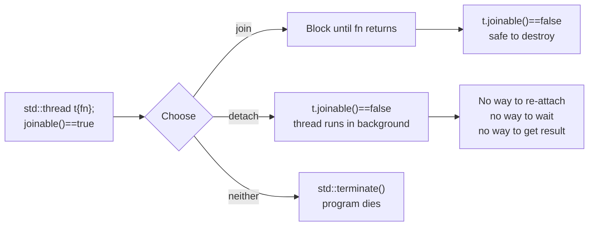
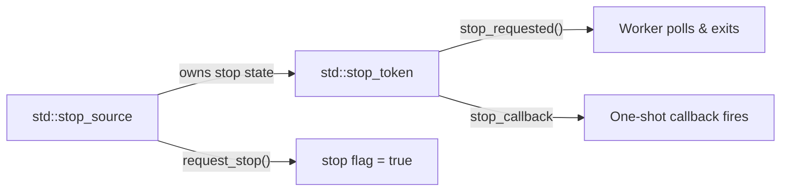

# 2. std::thread and std::jthread

> [!note] Why this note exists
> `std::thread` is the lowest-level, most flexible, and most error-prone concurrency primitive in C++. Most of your pain with concurrency will come from mismanaging `std::thread` lifetimes, arguments, and exceptions. `std::jthread` (C++20) fixes the most common footguns. Read this carefully before going further.

## Why It Matters

`std::thread` is the standard, portable, OS-agnostic way to launch a new thread of execution in C++. Without it, you'd be calling `pthread_create` on POSIX and `CreateThread` on Windows. With it, the same source compiles on both.

But `std::thread` is a *low-level* tool. It does not:

- Return a value from the thread function.
- Propagate exceptions to the caller.
- Guarantee the thread is joined when the `std::thread` object is destroyed.
- Support cancellation.

Each of those limitations has a higher-level tool (see [[5. Futures, Promises, Async]] and [[9. Coroutines (C++20)]]) or a C++20 fix (`std::jthread`). Knowing when to use which is the mark of a competent C++ developer.

## Background

### Threads in C++ before C++11

Before C++11, the language had no thread concept. The standard said "the implementation may execute the program in any order consistent with the abstract machine" — meaning *single-threaded*. To get threads you used POSIX (`pthread`), Windows (`CreateThread`), or Boost.Thread. All non-portable, all subtly different.

C++11 added:

- A memory model (so the language could say what "happens-before" means).
- `std::thread` and friends in `<thread>`.
- `std::mutex`, `std::condition_variable`, `std::atomic`, `std::future`.

C++20 added:

- `std::jthread` — RAII-joined thread with cooperative cancellation.
- `std::stop_token`, `std::stop_source`, `std::stop_callback`.
- `std::counting_semaphore`, `std::latch`, `std::barrier`.

### The `std::thread` Object Model

A `std::thread` object is a **handle** to a thread of execution. The thread itself is an OS-level kernel object; the `std::thread` is a C++ object that *may or may not* own one.

States of a `std::thread`:

| State | `joinable()` | What it means |
|-------|--------------|---------------|
| Default-constructed | `false` | No thread is associated. |
| Owning a thread | `true` | The object manages a running thread. |
| After `join()` | `false` | The thread has finished and the handle is released. |
| After `detach()` | `false` | The thread is running but no longer associated with this object. |
| After `std::move`-from | `false` | Ownership transferred to the new object. |

The destructor of a `joinable` `std::thread` calls `std::terminate()`. This is harsh but deliberate: there is no safe default for "what should happen to a running thread when its handle dies".

## Main Content

### Constructing a `std::thread`

`std::thread`'s constructor accepts any **Callable** — a function pointer, a function object (functor), a lambda, or a member function pointer — followed by the arguments to pass.

```cpp
#include <iostream>
#include <thread>

void free_fn(int x)                    { std::cout << "free_fn " << x << '\n'; }
struct Functor    { void operator()(int x) const { std::cout << "functor " << x << '\n'; } };
struct Widget     { void work(int x) const       { std::cout << "member "  << x << '\n'; } };

int main() {
    int v = 42;

    std::thread t1(free_fn, v);             // 1. free function
    std::thread t2(Functor{}, v);           // 2. functor
    std::thread t3([v]{ std::cout << "lambda " << v << '\n'; });  // 3. lambda
    std::thread t4{ &Widget::work, Widget{}, v };                  // 4. member fn

    t1.join(); t2.join(); t3.join(); t4.join();
}
```

> [!tip] Prefer lambdas
> Lambdas give you in-line, type-safe argument capture. They avoid the `std::ref`/decay gotchas (see below) and are easier to read than functors.

### Argument Passing — The Big Trap

Arguments to the thread function are **copied** into the thread's internal storage and then **forwarded** to the callable. This has two surprising consequences.

#### Trap 1: Arguments decay

`const char*` literal becomes `const char*` (fine), but `T[N]` decays to `T*`, and function names decay to function pointers. Usually harmless, but sometimes surprising.

```cpp
void takes_string(const std::string&);

std::thread t(takes_string, "hello");   // "hello" is const char*, then converted
                                         // to std::string inside the thread.
```

This conversion happens *in the new thread*, not in the calling thread. If the new thread is created but the literal's lifetime ends before the conversion happens (rare but possible with `detach`), you get UB.

#### Trap 2: By-value means by-value

```cpp
void modify(std::string& s) { s = "modified"; }

std::string s = "original";
std::thread t(modify, s);          // Compile error! s would be copied as const.
t.join();
```

The copy mechanism refuses to bind a non-const reference. To pass by reference, wrap in `std::ref` (or `std::cref` for const):

```cpp
#include <functional>
std::thread t(modify, std::ref(s));   // OK — s is passed by reference
```

> [!warning] `std::ref` is a footgun
> If you `detach()` the thread, the referenced object may be destroyed before the thread reads it. The reference is **not** lifetime-extended.

#### Trap 3: Move-only types

`std::unique_ptr` cannot be copied, so you must move it explicitly:

```cpp
void sink(std::unique_ptr<int> p);

auto p = std::make_unique<int>(7);
std::thread t(sink, std::move(p));   // OK — moved into thread storage
```

### `join()` vs `detach()`

| Operation | Effect | After |
|-----------|--------|-------|
| `join()` | Blocks the calling thread until the spawned thread finishes. | `joinable() == false` |
| `detach()` | Releases the thread to run independently. | `joinable() == false` |
| (destructor on `joinable()` thread) | **Calls `std::terminate`** | Program dies |



> [!danger] Almost never `detach()`
> A detached thread cannot be joined, cannot be cancelled, cannot return a value, and cannot safely reference any stack data from the spawning thread. In practice, detached threads cause more bugs than they solve. Prefer:
> - `std::jthread` (RAII join).
> - A thread pool (see [[7. Thread Pools]]).
> - `std::async` (see [[5. Futures, Promises, Async]]).

If you absolutely must detach, ensure the thread:
1. Does not access any caller-stack data.
2. Does not access any global that may be destroyed at program exit (use a "quick exit" gate or `atexit` ordering).
3. Logs its own errors — you cannot catch them anymore.

### `joinable()` and `get_id()`

```cpp
std::thread t;                 // default — not joinable
assert(!t.joinable());

t = std::thread([]{});
assert(t.joinable());

std::thread::id id = t.get_id();
std::cout << "Thread id: " << id << '\n';

t.join();
assert(!t.joinable());
```

`std::thread::id` is a small, comparable, hashable, printable opaque type. Use it to:
- Identify the current thread: `std::this_thread::get_id()`.
- Distinguish a "main thread" from workers (compare against a stored id).
- Build per-thread maps keyed by id.

A default-constructed `std::thread::id{}` represents "no thread". Any `std::thread::id` obtained from a non-joinable `std::thread` (or after `join()`) is also "no thread".

### `std::this_thread` utilities

```cpp
namespace std::this_thread {
    thread::id get_id() noexcept;
    void yield() noexcept;
    void sleep_until(...);     // time point
    void sleep_for(...);       // duration
}
```

- `yield` — hint to the scheduler: "I have nothing useful to do right now, give my quantum to someone else." Useful in spin-waits, but be careful: on many implementations it is essentially a no-op.
- `sleep_for(d)` — block for at least `d`. Not a real-time guarantee; may be longer due to scheduling.

```cpp
using namespace std::chrono;
std::this_thread::sleep_for(50ms);    // C++14 duration literals
```

### Returning Values from a Thread

`std::thread` has **no built-in way** to return a value. To get one you must:

1. Use `std::future`/`std::promise` (see [[5. Futures, Promises, Async]]).
2. Use `std::async`.
3. Pass a pointer/reference (with synchronization) to be filled in.

Option 3 is the most error-prone:

```cpp
int result = 0;
std::mutex m;
std::thread t([&]{ int r = compute(); std::lock_guard<std::mutex> lk(m); result = r; });
// ... do other work ...
t.join();
// Now `result` is valid.
```

This pattern is fine, but `std::async` does the same thing with less boilerplate.

### Exceptions in Threads

If a thread function throws and the exception is not caught, `std::terminate` is called. **The exception does not propagate to the joining thread.**

To propagate, catch the exception in the thread and store it in a `std::promise` via `set_exception`:

```cpp
#include <future>
#include <iostream>
#include <thread>

void worker(std::promise<int> p) {
    try {
        throw std::runtime_error("boom");
    } catch (...) {
        p.set_exception(std::current_exception());
    }
}

int main() {
    std::promise<int> p;
    auto f = p.get_future();
    std::thread t(worker, std::move(p));
    try {
        std::cout << f.get() << '\n';     // re-throws in main thread
    } catch (const std::exception& e) {
        std::cout << "caught: " << e.what() << '\n';
    }
    t.join();
}
```

`std::async` does this automatically — see [[5. Futures, Promises, Async]].

### `std::jthread` (C++20)

`std::jthread` ("joining thread") is `std::thread` with two improvements:

1. **RAII join.** The destructor calls `join()` automatically if the thread is still joinable.
2. **Cooperative cancellation** via `std::stop_token`.

```cpp
#include <thread>
#include <iostream>
#include <chrono>

void worker(std::stop_token st, int id) {
    while (!st.stop_requested()) {
        std::cout << "worker " << id << " alive\n";
        std::this_thread::sleep_for(std::chrono::milliseconds(200));
    }
    std::cout << "worker " << id << " exiting cleanly\n";
}

int main() {
    std::jthread t1(worker, 1);
    std::jthread t2(worker, 2);

    std::this_thread::sleep_for(std::chrono::seconds(1));
    t1.request_stop();          // ask t1 to stop; does NOT block
    // t2 will be asked to stop by its destructor

}   // <- t1.join() and t2.join() happen automatically here
```

#### The `stop_token` model



- A `std::jthread` owns a `std::stop_source`.
- The thread function receives the matching `std::stop_token` (as the first parameter if it accepts one).
- The function periodically checks `st.stop_requested()` and exits gracefully when true.
- `request_stop()` is **cooperative**: it sets a flag; it does not kill the thread.

> [!tip] When the function ignores `stop_token`
> If the thread function does not take a `stop_token` parameter, the `jthread` still works — you just lose cancellation. The RAII-join benefit remains.

### Thread Lifecycle Summary

```mermaid
stateDiagram-v2
    [*] --> Constructed: std::thread t{fn}
    Constructed --> Running: scheduler picks it up
    Running --> Blocked: mutex/condition/sleep
    Blocked --> Running: resource available
    Running --> Finished: fn returns/throws
    Finished --> Joined: t.join() returns
    Constructed --> Detached: t.detach()
    Detached --> [*]: runs independently
    Joined --> [*]: safe to destroy
    Constructed --> Terminated: ~t while joinable
    Terminated --> [*]: std::terminate
```

### Hardware Concurrency Hint

```cpp
unsigned int n = std::thread::hardware_concurrency();
// Returns the number of concurrent threads the hardware supports.
// Returns 0 if it cannot determine. Treat 0 as "use a sensible default".
```

This is a **hint**, not a guarantee. It does not account for other processes using cores. Use it to size a thread pool, not to spawn that many threads directly.

## Code Examples

### Worker pool with a vector of threads

```cpp
#include <thread>
#include <vector>
#include <numeric>
#include <iostream>

void partial_sum(const std::vector<int>& v, std::size_t begin, std::size_t end, long long& out) {
    out = std::accumulate(v.begin() + begin, v.begin() + end, 0LL);
}

int main() {
    std::vector<int> data(1'000'000);
    for (std::size_t i = 0; i < data.size(); ++i) data[i] = i;

    const int N = 4;
    std::vector<std::thread> ts;
    std::vector<long long> partials(N, 0);
    std::size_t chunk = data.size() / N;

    for (int i = 0; i < N; ++i) {
        std::size_t b = i * chunk;
        std::size_t e = (i == N - 1) ? data.size() : (i + 1) * chunk;
        ts.emplace_back(partial_sum, std::cref(data), b, e, std::ref(partials[i]));
    }
    for (auto& t : ts) t.join();

    long long total = std::accumulate(partials.begin(), partials.end(), 0LL);
    std::cout << "total = " << total << '\n';
}
```

Note `std::cref(data)` for the const reference, and `std::ref(partials[i])` for the mutable result slot.

### jthread with cancellation

```cpp
#include <chrono>
#include <iostream>
#include <thread>

using namespace std::chrono_literals;

void countdown(std::stop_token st, int from) {
    for (int i = from; i > 0; --i) {
        if (st.stop_requested()) {
            std::cout << "aborted at " << i << '\n';
            return;
        }
        std::cout << i << '\n';
        std::this_thread::sleep_for(500ms);
    }
    std::cout << "liftoff\n";
}

int main() {
    std::jthread t(countdown, 10);
    std::this_thread::sleep_for(2s);
    t.request_stop();         // graceful — destructor joins
}
```

## Common Pitfalls

> [!danger] Pitfall 1 — Forgetting to `join()` or `detach()`
> The destructor of a joinable `std::thread` calls `std::terminate`. Use `std::jthread` instead.

> [!danger] Pitfall 2 — Passing by reference without `std::ref`
> The compiler catches this with a confusing template error. Always remember: thread args are copied.

> [!danger] Pitfall 3 — Capturing by reference in a detached lambda
> ```cpp
> std::thread([&]{ use(local); }).detach();
> ```
> `local` is on the caller's stack. The detached thread may access it after the caller returns. UB.

> [!danger] Pitfall 4 — Reading from a moved-from `std::thread`
> After `std::thread b = std::move(a);`, `a` is in a default-constructed state. Calling `a.join()` does nothing; calling `a.get_id()` returns the "no thread" id.

> [!danger] Pitfall 5 — Expecting thread start order
> Creating `t1` before `t2` does not mean `t1`'s function starts first. The OS scheduler decides.

> [!danger] Pitfall 6 — Spawning too many threads
> One thread per task is fine for 10 tasks. For 10 000 tasks it over-subscribes and thrashes. Use a pool — see [[7. Thread Pools]].

> [!danger] Pitfall 7 — Uncaught exceptions in threads
> An uncaught exception calls `std::terminate`. Catch at the top of every thread function, or use `std::async` which propagates exceptions to the future.

## Tips and Tricks

- **Use `std::jthread` for new code.** It is strictly safer than `std::thread` with no downside.
- **Always pass `std::stop_token` first** if you want cancellation support.
- **Capture by value in lambdas** when starting a thread. If you must capture by reference, ensure the lifetime is managed (e.g., a `shared_ptr`).
- **Use `std::thread::hardware_concurrency()`** to size pools, but cap the result (some VMs report absurd values).
- **Name your threads** (Linux: `pthread_setname_np`; no portable C++ API). It makes `top -H`, `perf`, and debugger threads lists far more readable.
- **Move, don't copy** thread objects into containers. `std::vector<std::thread>` is the canonical worker pool container.
- **Prefer `std::async`** for one-shot parallel work that returns a value. See [[5. Futures, Promises, Async]].
- **Set a stack size** if you have deeply recursive thread functions — `pthread_attr_setstacksize` on POSIX, but it is not exposed by `std::thread`. For that you need platform APIs or `boost::thread`.

## Active Recall

1. What happens if a `std::thread` is destroyed while `joinable() == true`?
2. How do you pass a `std::string` by reference to a thread function? Why is this not the default?
3. What is the difference between `join()` and `detach()`? When (if ever) is `detach()` appropriate?
4. How can you get a return value out of a `std::thread`?
5. What happens to an uncaught exception thrown inside a thread function?
6. Name three differences between `std::thread` and `std::jthread`.
7. How does `std::jthread` cancellation actually stop a thread? Is it preemptive?
8. What does `std::thread::hardware_concurrency()` return? Is it reliable?
9. What does `std::this_thread::yield()` do? Is it useful for correctness or only for performance?
10. Why is `std::vector<std::thread>` a sensible container for a worker pool, given that `std::thread` is not copyable?

## Next Steps

- Read [[3. Mutexes and Locks]] next — you will need it the moment your threads share data.
- Read [[5. Futures, Promises, Async]] for the higher-level, safer alternative to raw threads.
- Read [[7. Thread Pools]] for the production pattern when you have many short tasks.
- Cross-reference [[14. Concurrency and Multithreading/1. Introduction to Multithreading]] for the broader concurrency vocabulary.
- Cross-reference [[15. Debugging and Profiling/1. GDB]] for how to inspect a multi-threaded program in a debugger.
