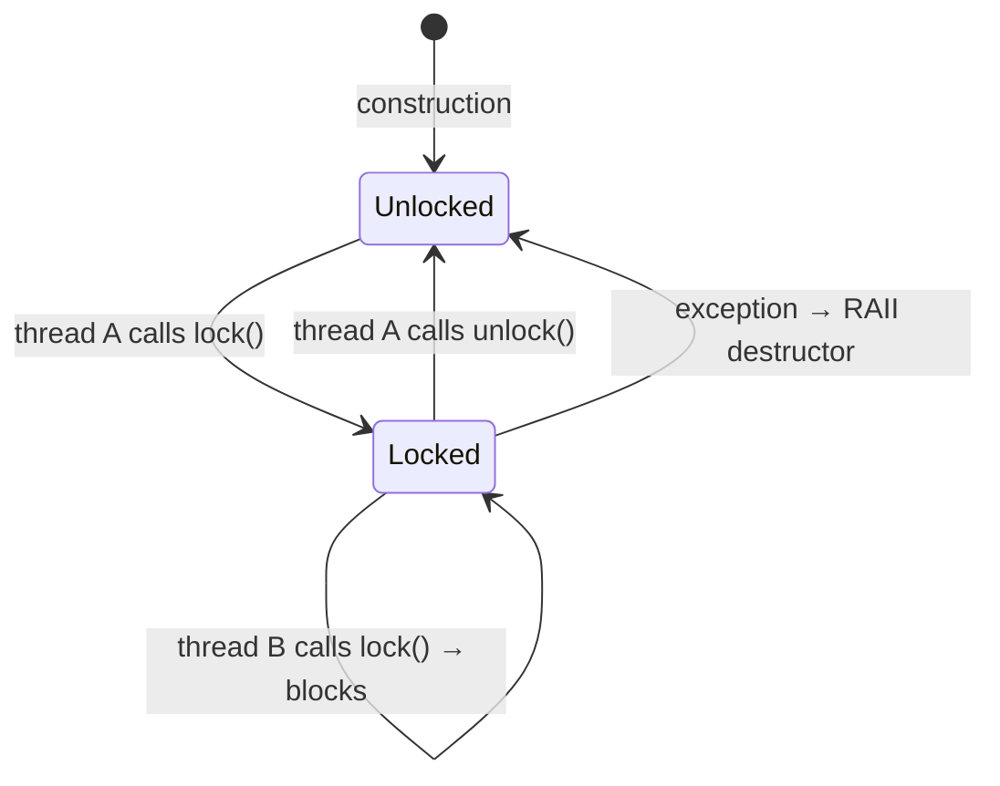
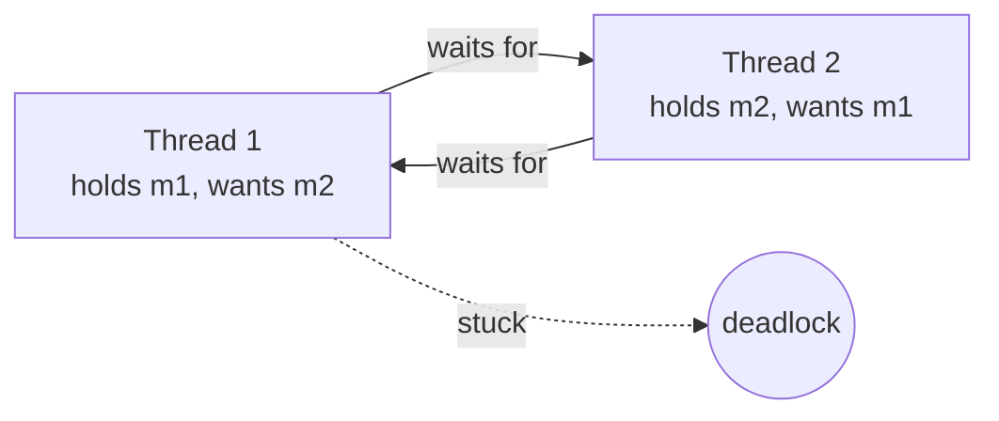
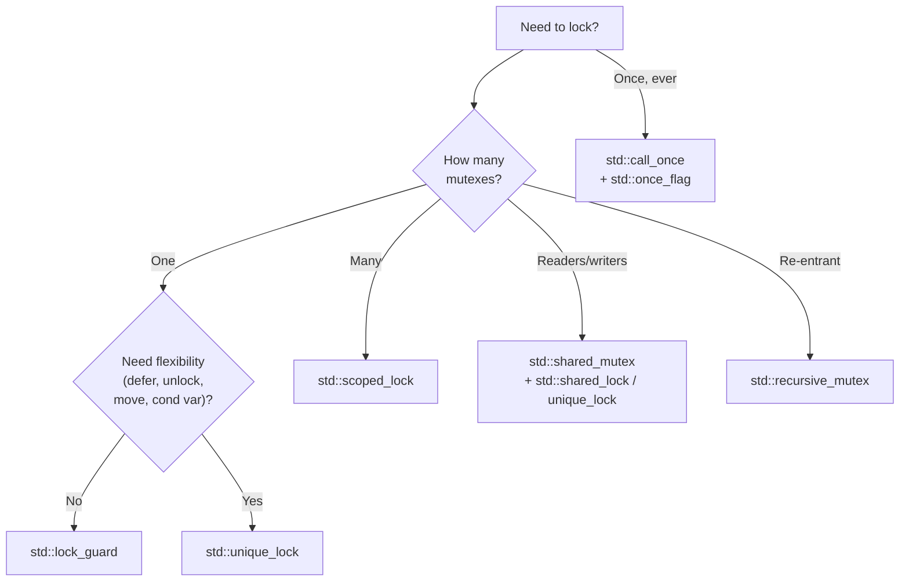

# 3. Mutexes and Locks

> [!note] Why this note exists
> Once two threads touch the same mutable memory, you need **mutual exclusion**. This note covers every standard mutex and every standard lock guard, when to use each, and — most importantly — how to avoid deadlocks. It is the foundation for everything in [[4. Condition Variables]] and a prerequisite for understanding [[8. Lock-Free Programming]].

## Why It Matters

Without synchronization, shared mutable data leads to **data races** (see [[1. Introduction to Multithreading]]), which are undefined behavior. The standard solution is the **mutex**: a primitive that lets only one thread at a time enter a **critical section**.

A mutex by itself is dangerous. Calling `lock()` and `unlock()` manually is a recipe for deadlocks and leaks on exception. C++ provides **RAII lock guards** that acquire in the constructor and release in the destructor — this is the single most important habit to learn in concurrent C++.

Beyond plain mutexes, C++ gives you:

- `std::recursive_mutex` (same thread can lock N times).
- `std::shared_mutex` (multiple readers OR one writer) — C++17.
- `std::timed_mutex` / `std::recursive_timed_mutex` (try to lock for a duration).
- `std::once_flag` + `std::call_once` (run something exactly once, thread-safely).

And a stack of lock wrappers:

- `std::lock_guard` — simplest, one mutex, no flexibility.
- `std::unique_lock` — flexible, can lock/unlock/transfer.
- `std::scoped_lock` — variadic, deadlock-free acquisition of multiple mutexes — C++17.
- `std::shared_lock` — read-lock for `shared_mutex` — C++17.

Choosing correctly is the difference between a 200-line file that never has a concurrency bug and one that has a deadlock reported once a quarter.

## Background

### What a Mutex Is, Physically

A mutex is typically a single atomic word plus a queue. The fast path (uncontended) is a single atomic compare-exchange — ~10–20 ns on modern x86. The slow path (contended) is a syscall into the kernel to park the thread on a wait queue — ~1–5 µs.

- **User-space fast path**: `lock cmpxchg` on a `std::atomic<int>`-like field.
- **Kernel slow path**: `futex_wake` / `futex_wait` on Linux, similar on Windows.

This means an *uncontended* mutex is cheap — almost as cheap as an atomic. A *contended* mutex is expensive — the OS context-switches you out. **The right optimization is not "avoid mutexes" but "keep critical sections short so they are rarely contended."**

### Mutex States



A `std::mutex` has these operations:

- `lock()` — block until acquired. Throws `std::system_error` on error.
- `unlock()` — release. **Must** be called by the thread that locked it. UB otherwise.
- `try_lock()` — acquire if immediately available; return `true`/`false`. Never blocks.
- (no timed operations on `std::mutex` — use `std::timed_mutex` for those)

A `std::mutex` is **not** recursive: re-locking from the same thread is UB. Use `std::recursive_mutex` if you genuinely need that.

### Why Manual `lock()`/`unlock()` Is Wrong

```cpp
std::mutex m;
void bad() {
    m.lock();
    do_work();          // if this throws...
    m.unlock();         // ...this never runs → deadlock
}
```

Even without exceptions:

```cpp
void bad2() {
    m.lock();
    if (x) return;      // forgot to unlock — deadlock
    m.unlock();
}
```

Every manual lock needs a matching unlock on **every** exit path. Humans cannot maintain this. RAII does it for free.

## Main Content

### `std::lock_guard` — The Default Choice

The simplest RAII lock. Constructor locks; destructor unlocks. Nothing else.

```cpp
#include <mutex>

std::mutex m;
int counter = 0;

void bump() {
    for (int i = 0; i < 100'000; ++i) {
        std::lock_guard<std::mutex> lk(m);
        ++counter;
    }   // ~lock_guard → m.unlock()
}
```

Use `std::lock_guard` whenever:

- You need to lock exactly one mutex.
- You don't need to unlock it mid-scope.
- You don't need to transfer it.

That is **90% of all use cases**. Default to this.

### `std::unique_lock` — The Flexible Choice

`std::unique_lock` is heavier (one extra pointer + one bool) but can:

- Be **constructed without locking** (`std::defer_lock`) and locked later.
- Be **constructed trying to lock** (`std::try_to_lock`).
- Be **constructed with a timeout** (`try_lock_for` / `try_lock_until`) — for timed mutexes.
- **Unlock** and **re-lock** within the scope.
- Be **moved** between scopes.
- Be **passed to `std::condition_variable::wait`** (which needs to unlock/relock internally).

```cpp
std::mutex m;

void worker() {
    std::unique_lock<std::mutex> lk(m, std::defer_lock);
    // ... do some prep ...
    lk.lock();
    // ... critical section ...
    lk.unlock();
    // ... do some non-critical work ...
    lk.lock();
    // ... critical section again ...
}   // unlocked if locked
```

`std::condition_variable::wait` requires `std::unique_lock` because `wait` needs to release the mutex while waiting and re-acquire before returning. `std::lock_guard` cannot do this. See [[4. Condition Variables]].

### `std::scoped_lock` — Multiple Mutexes, Deadlock-Free (C++17)

The crown jewel of C++17 concurrency. `std::scoped_lock` takes any number of mutexes and acquires them all using a deadlock-avoidance algorithm (a variant of "lock both, retry on conflict").

```cpp
std::mutex a, b;

void transfer(account& from, account& to, int amount) {
    std::scoped_lock lk(a, b);     // deadlocks impossible — even if another
                                    // thread does scoped_lock(b, a)
    from.balance -= amount;
    to.balance   += amount;
}
```

Before C++17 you would use `std::lock(a, b)` followed by `std::lock_guard` with `std::adopt_lock` — verbose and easy to get wrong. `std::scoped_lock` replaces all of that.

> [!tip] Always prefer scoped_lock for ≥2 mutexes
> Even if you "know" your code locks in a consistent order today, someone will refactor tomorrow. `std::scoped_lock` makes the deadlock class of bug impossible by construction.

### `std::shared_mutex` and `std::shared_lock` — Reader/Writer Locks (C++17)

If a data structure is **read often and written rarely**, a plain mutex serializes all the readers — wasteful. `std::shared_mutex` allows **many readers OR one writer**, but not both.

```cpp
#include <shared_mutex>

std::shared_mutex rw;
std::vector<int> data;

int reader() {
    std::shared_lock lk(rw);           // shared (read) lock
    return data.empty() ? -1 : data.front();
}

void writer(int v) {
    std::unique_lock lk(rw);           // exclusive (write) lock
    data.push_back(v);
}
```

| Operation | Requires | Effect |
|-----------|----------|--------|
| `std::shared_lock` | no exclusive holder | acquires shared (read) lock; multiple allowed |
| `std::unique_lock` | no holders at all | acquires exclusive (write) lock; sole access |
| `rw.lock_shared()` / `unlock_shared()` | (raw) | same as shared_lock, manual |

> [!warning] Reader/writer locks are not a free lunch
> - They are heavier than plain mutexes (more atomic ops, more contention tracking).
> - Writers can starve under heavy read load unless the implementation favors writers.
> - In practice, for very fast critical sections, a plain `std::mutex` is often faster because of lower overhead. Benchmark.

### `std::recursive_mutex`

A `std::recursive_mutex` can be locked multiple times by the **same thread**. Each `lock()` must be matched by an `unlock()`. Useful when a function may call itself (directly or indirectly) while holding the lock.

```cpp
std::recursive_mutex m;

void tree_walk(node* n) {
    std::lock_guard<std::recursive_mutex> lk(m);
    process(n);
    if (n->left)  tree_walk(n->left);
    if (n->right) tree_walk(n->right);
}
```

> [!warning] Recursive mutexes are usually a design smell
> If you need one, your code probably has implicit locking coupling. Prefer to:
> - Split the public method (which locks) from a private method (which doesn't).
> - Have callers hold the lock explicitly when calling multiple operations.

### `std::timed_mutex`

`std::timed_mutex` adds `try_lock_for(duration)` and `try_lock_until(time_point)`. Useful when you'd rather give up than block indefinitely (e.g., a watchdog timer).

```cpp
std::timed_mutex m;

bool try_work() {
    if (!m.try_lock_for(std::chrono::milliseconds(100)))
        return false;             // someone else is hogging it
    std::lock_guard<std::timed_mutex> lk(m, std::adopt_lock);
    do_work();
    return true;
}
```

### `std::call_once` and `std::once_flag`

Run a callable exactly once across all threads, like `pthread_once` but type-safe. The classic use is lazy initialization:

```cpp
std::once_flag init_flag;
Config* config = nullptr;

const Config& get_config() {
    std::call_once(init_flag, []{
        config = new Config(load_from_disk());
    });
    return *config;
}
```

Equivalent to `static` local initialization (which is thread-safe since C++11), but more flexible — you can use it for non-local state and even conditionally skip initialization.

```cpp
const Config& get_config() {
    static Config instance = load_from_disk();   // also thread-safe in C++11+
    return instance;
}
```

Prefer the `static` local form when it fits.

### Deadlocks

A **deadlock** is a cycle of "thread A waits for resource X held by thread B, thread B waits for resource Y held by thread A". The classic example:

```cpp
std::mutex m1, m2;

void f1() {
    std::lock_guard<std::mutex> a(m1);
    std::lock_guard<std::mutex> b(m2);   // ← if another thread is here with m2 first...
    // ...
}

void f2() {
    std::lock_guard<std::mutex> a(m2);   // ← ...we're deadlocked
    std::lock_guard<std::mutex> b(m1);
    // ...
}
```



#### The four Coffman conditions

For a deadlock to occur, all four must hold:

1. **Mutual exclusion** — resources cannot be shared.
2. **Hold and wait** — a thread holds one resource while requesting another.
3. **No preemption** — resources cannot be forcibly taken.
4. **Circular wait** — a cycle of waiting threads.

Break any condition and deadlocks are impossible. Standard techniques:

- **Lock ordering** — always acquire mutexes in the same global order. Breaks circular wait.
- **`std::scoped_lock`** — atomic multi-acquisition. Breaks hold-and-wait.
- **`try_lock` + backoff** — release everything and retry if you can't get them all. Breaks hold-and-wait.
- **Single mutex** — if all critical sections share one mutex, no cycle is possible. (But this serializes everything.)

### Lock Ordering in Practice

If you cannot use `std::scoped_lock` (e.g., pre-C++17, or you must lock them one at a time for a reason), establish a **total order** on mutexes and never violate it. The easiest way is to give each mutex an integer id and lock in id-ascending order.

```cpp
struct OrderedMutex {
    std::mutex m;
    int id;
};

void lock_two(OrderedMutex& a, OrderedMutex& b) {
    if (a.id < b.id) {
        a.m.lock(); b.m.lock();
    } else {
        b.m.lock(); a.m.lock();
    }
}
```

### Lock Types Comparison



## Code Examples

### Thread-safe queue with mutex + condition variable preview

```cpp
#include <condition_variable>
#include <mutex>
#include <queue>
#include <optional>

template <class T>
class ThreadSafeQueue {
    std::queue<T> q_;
    std::mutex m_;
    std::condition_variable cv_;
public:
    void push(T v) {
        {
            std::lock_guard<std::mutex> lk(m_);
            q_.push(std::move(v));
        }
        cv_.notify_one();
    }
    std::optional<T> try_pop() {
        std::lock_guard<std::mutex> lk(m_);
        if (q_.empty()) return std::nullopt;
        T v = std::move(q_.front());
        q_.pop();
        return v;
    }
    // pop() that blocks is in [[4. Condition Variables]]
};
```

### Deadlock-free money transfer

```cpp
struct Account {
    std::mutex m;
    long balance;
};

void transfer(Account& from, Account& to, long amount) {
    if (&from == &to) return;
    std::scoped_lock lk(from.m, to.m);    // deadlock-free
    from.balance -= amount;
    to.balance   += amount;
}
```

### Lazy singleton three ways

```cpp
// 1. Magic statics (preferred)
Config& config_v1() {
    static Config c = load();
    return c;
}

// 2. std::call_once
Config* p = nullptr;
std::once_flag flag;
Config& config_v2() {
    std::call_once(flag, []{ p = new Config(load()); });
    return *p;
}

// 3. std::atomic<Config*> + double-checked locking
// (Don't — see [[6. Atomics and Memory Ordering]]; just use magic statics.)
```

### Avoiding deadlock by ordering

```cpp
class Fork {
public:
    std::mutex m;
    int id;
    Fork(int i) : id(i) {}
};

void philosopher(Fork& left, Fork& right) {
    // Always pick up the lower-id fork first.
    Fork& first  = left.id  < right.id ? left  : right;
    Fork& second = left.id  < right.id ? right : left;
    std::scoped_lock lk(first.m, second.m);
    eat();
}
```

This is the classic fix for the dining philosophers problem.

## Common Pitfalls

> [!danger] Pitfall 1 — Manual `lock()` / `unlock()`
> Every exit path (return, throw, break) must unlock. RAII does this for free. Never call them directly unless you're wrapping a mutex in a custom RAII type.

> [!danger] Pitfall 2 — Locking two mutexes in sequence
> `std::lock_guard<std::mutex> a(m1); std::lock_guard<std::mutex> b(m2);` is a deadlock waiting to happen. Use `std::scoped_lock lk(m1, m2);`.

> [!danger] Pitfall 3 — Returning while holding a lock
> `std::unique_lock lk(m); return data;` keeps the lock held until the return value is constructed. Usually fine, but if `data` is a big copy, you hold the lock during the copy. Return-after-unlock by constructing into a local first.

> [!danger] Pitfall 4 — Recursive `std::mutex`
> Locking a non-recursive mutex from a thread that already holds it is UB. Use `std::recursive_mutex` if you genuinely need recursion — but better, refactor.

> [!danger] Pitfall 5 — Holding a lock across I/O
> Holding a mutex while doing disk/network I/O serializes every thread that needs that mutex. Move the I/O outside the lock.

> [!danger] Pitfall 6 — Using `std::shared_mutex` when a plain mutex would do
> For very short critical sections the overhead of `shared_mutex` exceeds the parallelism benefit. Benchmark before adopting.

> [!danger] Pitfall 7 — Destroying a `std::mutex` while locked
> The standard says the behavior is undefined. Make sure the mutex outlives all threads that may touch it.

> [!danger] Pitfall 8 — Deadlock by `std::lock_guard` member init order
> Member `std::lock_guard` fields are constructed in declaration order, destroyed in reverse. Two classes with opposite orders can deadlock. Use `std::scoped_lock` in a single member, or factor out.

## Tips and Tricks

- **Default to `std::lock_guard`.** Upgrade to `std::unique_lock` only when you need its features.
- **Default to `std::scoped_lock` for ≥2 mutexes.** It is variadic — works for one mutex too, but `lock_guard` is shorter.
- **Lock granularity**: prefer fine-grained locks for parallelism, but never so fine that you spend more time locking than working. Measure.
- **Keep critical sections under ~10 µs** if possible. Longer means more contention.
- **Use `std::adopt_lock`** when you've already locked manually (e.g., with `std::lock(a, b)`) and want RAII to take over.
- **Avoid `std::recursive_mutex`.** It usually indicates a design smell.
- **Hold locks as short as possible**: lock, copy out, unlock, then process.
- **Consider `std::shared_mutex`** for read-heavy, write-rare caches — but benchmark.
- **Use `std::call_once`** or magic statics for one-shot init.
- **Pair every mutex with the data it protects** as a member. Don't have a global mutex for unrelated globals.
- **Test under TSan** (see [[15. Debugging and Profiling/4. Sanitizers (ASan, UBSan, TSan)]]) to catch races you didn't realize you had.

## Active Recall

1. Why is calling `lock()` and `unlock()` manually dangerous, even in the absence of exceptions?
2. When should you use `std::unique_lock` instead of `std::lock_guard`?
3. How does `std::scoped_lock` prevent deadlocks when locking multiple mutexes? What algorithm does it use?
4. What are the four Coffman conditions for deadlock? How does `std::scoped_lock` break one of them?
5. Why is `std::recursive_mutex` often considered a design smell? Give a refactoring that eliminates the need.
6. What is the difference between `std::shared_lock` and `std::unique_lock` when used with a `std::shared_mutex`?
7. When would you choose `std::timed_mutex` over `std::mutex`?
8. What does `std::call_once` do? How is it different from a C++11 magic static?
9. Why is holding a lock across a `return value` sometimes a performance bug?
10. Give two strategies to break the "circular wait" condition for deadlock.

## Next Steps

- Read [[4. Condition Variables]] next — it builds directly on `std::unique_lock`.
- Read [[6. Atomics and Memory Ordering]] for the lock-free alternative for simple types.
- Read [[8. Lock-Free Programming]] when mutexes are too slow.
- Cross-reference [[14. Concurrency and Multithreading/1. Introduction to Multithreading]] for the race condition context.
- Cross-reference [[15. Debugging and Profiling/4. Sanitizers (ASan, UBSan, TSan)]] — TSan catches lock-order inversions you didn't think of.
