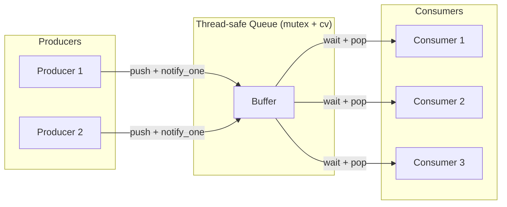
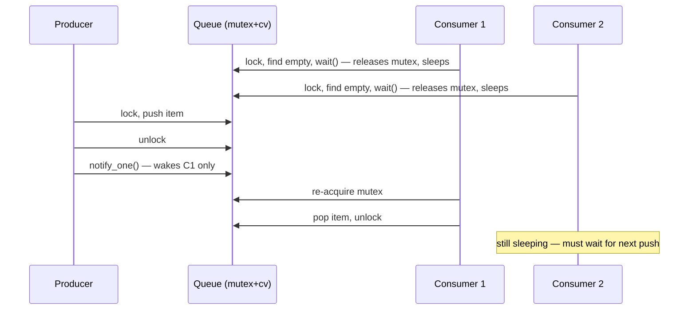

# 4. Condition Variables

> [!note] Why this note exists
> A mutex alone is not enough. Sometimes a thread needs to wait until *some condition* on shared data becomes true — not just until it can acquire a lock. Polling in a loop wastes CPU; sleeping wastes latency. **Condition variables** let a thread sleep until another thread signals that something interesting happened. This note covers the mechanism, the producer-consumer pattern, and the spurious-wakeup trap.

## Why It Matters

Consider a thread-safe queue. The pop operation should:

1. Acquire the lock.
2. If the queue is empty, **wait** until something is pushed.
3. Pop the front element.
4. Release the lock.

Step 2 is the problem. If you write:

```cpp
while (q_.empty()) { /* spin or sleep? */ }
```

you either burn a CPU core (spinning) or sleep for an arbitrary time and add latency. The right primitive is a **condition variable**: a way for the waiting thread to atomically release the mutex and sleep, and for the pushing thread to wake it once the condition is true.

Without condition variables you cannot write efficient producer-consumer queues, thread pools, semaphores, futures, or any of the high-level concurrency primitives that the standard library is built on. They sit beneath `std::future`, `std::async`, `std::latch`, and `std::barrier`.

## Background

### The Mechanics

A `std::condition_variable` (in `<condition_variable>`) is always used **together with a mutex**. The four operations are:

| Operation | Effect |
|-----------|--------|
| `wait(unique_lock)` | Atomically: unlock the mutex, block the thread, wait for notify. On wakeup, re-lock the mutex and return. |
| `wait(unique_lock, pred)` | Same, but loops until `pred()` returns true. (Handles spurious wakeups.) |
| `notify_one()` | Wake up one (arbitrary) waiting thread. |
| `notify_all()` | Wake up *all* waiting threads. They race to re-acquire the mutex. |

The key insight is the **atomicity** of "release mutex + sleep". If these were two separate steps, you'd lose wakeups:

```text
T1: while (q_.empty()) { /* about to wait */ }
T2: q_.push(x);   // but T1 hasn't started waiting yet
T2: cv.notify();  // nobody is waiting — lost wakeup
T1: cv.wait();    // sleeps forever
```

The OS-level primitive (e.g., `futex` or `pthread_cond_t`) makes "release mutex + sleep" atomic. `std::condition_variable` exposes that.

### Spurious Wakeups

POSIX and the C++ standard explicitly allow `wait` to return **even if no one called `notify_*`**. This is called a **spurious wakeup**. It is rare but legal, and your code must handle it.

The fix is to **always re-check the condition after waking**:

```cpp
std::unique_lock<std::mutex> lk(m);
while (q_.empty()) {           // re-check on every wakeup
    cv.wait(lk);
}
```

Or, equivalently, use the **predicate form** which does the loop for you:

```cpp
std::unique_lock<std::mutex> lk(m);
cv.wait(lk, [&]{ return !q_.empty(); });
```

> [!danger] Never assume `wait` returns because of a notify
> Always loop. Always use the predicate form if you can. The "wait returns because someone signaled" mental model is wrong.

### Why `std::unique_lock`?

`wait` needs to unlock the mutex while sleeping and re-lock it on wakeup. `std::lock_guard` cannot unlock; `std::unique_lock` can. That is the entire reason `wait` requires a `std::unique_lock<std::mutex>`.

## Main Content

### The Producer-Consumer Pattern

The canonical example. One or more **producer** threads push items; one or more **consumer** threads pop them. A bounded version also signals when there is room to push.



#### Unbounded version

```cpp
#include <condition_variable>
#include <mutex>
#include <queue>
#include <optional>

template <class T>
class BlockingQueue {
    std::queue<T> q_;
    std::mutex m_;
    std::condition_variable cv_;
public:
    void push(T v) {
        {
            std::lock_guard<std::mutex> lk(m_);
            q_.push(std::move(v));
        }
        cv_.notify_one();
    }

    T pop() {
        std::unique_lock<std::mutex> lk(m_);
        cv_.wait(lk, [this]{ return !q_.empty(); });
        T v = std::move(q_.front());
        q_.pop();
        return v;
    }
};
```

Notes:

- We use `std::lock_guard` in `push` (no waiting, simple).
- We use `std::unique_lock` in `pop` (must wait).
- The `notify_one` happens **after** unlocking — see "Notify under lock or not?" below.
- The predicate `[this]{ return !q_.empty(); }` is evaluated under the lock.

#### Bounded version (also signals "not full")

```cpp
template <class T>
class BoundedQueue {
    std::queue<T> q_;
    std::size_t cap_;
    std::mutex m_;
    std::condition_variable not_full_;
    std::condition_variable not_empty_;
public:
    explicit BoundedQueue(std::size_t cap) : cap_(cap) {}

    void push(T v) {
        std::unique_lock<std::mutex> lk(m_);
        not_full_.wait(lk, [this]{ return q_.size() < cap_; });
        q_.push(std::move(v));
        lk.unlock();
        not_empty_.notify_one();
    }

    T pop() {
        std::unique_lock<std::mutex> lk(m_);
        not_empty_.wait(lk, [this]{ return !q_.empty(); });
        T v = std::move(q_.front());
        q_.pop();
        lk.unlock();
        not_full_.notify_one();
        return v;
    }
};
```

Two condition variables: one for "not full" (producers wait on it), one for "not empty" (consumers wait on it). After pushing, we notify "not empty". After popping, we notify "not full".

### `notify_one` vs `notify_all`

- `notify_one()` wakes **one** waiting thread. The OS picks which. Use when:
  - Each notification enables exactly one unit of progress (one item pushed → one consumer can pop).
  - You want to avoid the "thundering herd" of waking all consumers when only one can do work.

- `notify_all()` wakes **all** waiting threads. They race for the mutex; all but one re-block. Use when:
  - The state change may satisfy multiple waiters (e.g., a barrier release).
  - The predicate may be true for several waiters.



### Notify Under Lock or Not?

There are two valid styles:

**Style A — notify while holding the lock:**
```cpp
{
    std::lock_guard<std::mutex> lk(m_);
    q_.push(x);
}   // unlock first
cv.notify_one();   // then notify
```

**Style B — notify under the lock:**
```cpp
{
    std::lock_guard<std::mutex> lk(m_);
    q_.push(x);
    cv.notify_one();   // notify while holding lock
}
```

Both are **correct**. Style A is usually faster on some platforms because the woken thread can grab the mutex the instant it's free, instead of being blocked by the still-holding notifier. Style B is simpler and the overhead rarely matters. Benchmark if it matters.

### `std::condition_variable_any`

`std::condition_variable` works only with `std::unique_lock<std::mutex>`. If you need to wait with a different lock type (e.g., `std::shared_lock` for a reader/writer pattern, or a custom lock), use `std::condition_variable_any`.

```cpp
std::shared_mutex rw;
std::condition_variable_any cv;
std::vector<int> data;

void wait_until_nonempty_as_reader() {
    std::shared_lock<std::shared_mutex> lk(rw);
    cv.wait(lk, [&]{ return !data.empty(); });
    // now hold the shared lock and read
}
```

The cost is higher: `condition_variable_any` allocates internally and has more overhead. Use only when you cannot use the plain `condition_variable`.

### Waiting with a Deadline

`wait_for` and `wait_until` return `false` if the timeout expires before the predicate is satisfied. (They can still wake spuriously, so always use the predicate form.)

```cpp
std::unique_lock<std::mutex> lk(m);
bool got = cv.wait_for(lk, std::chrono::milliseconds(100),
                       [&]{ return !q_.empty(); });
if (!got) {
    // timeout expired; queue still empty
    return std::nullopt;
}
// got == true; queue has something
```

This is the basis for "pop with timeout" APIs.

### The Predicate Form, Dissected

```cpp
cv.wait(lk, pred);
```

is equivalent to:

```cpp
while (!pred()) {
    cv.wait(lk);
}
```

Two things to notice:

1. `pred()` is called **under the mutex** (the lock is held during the call).
2. The loop handles spurious wakeups automatically.

This is the form you should always use unless you have a very specific reason not to. It is shorter, clearer, and bug-free.

### Condition Variables Are Not Semaphores

A `std::condition_variable` does **not** count notifications. If you `notify_one()` twice and there are no waiters at the time, the notifications are **lost**. The condition variable is a *signal* that "something may have changed; re-check your predicate".

If you need "count N signals", use:

- `std::counting_semaphore<N>` (C++20).
- A counter + condition variable (the predicate `count > 0`).

### A Common Bug: Lost Wakeup

```cpp
// BROKEN
std::unique_lock<std::mutex> lk(m);
if (q_.empty()) {              // ← wrong: should be `while`
    cv.wait(lk);
}
```

Why is `if` wrong? Because between the wakeup and the re-acquisition of the mutex, another consumer may have popped the item. You wake up, the queue is empty again, and you crash on `q_.front()`.

The `while` loop (or the predicate form) handles this by re-checking after wakeup. This is also why you cannot rely on `notify_one` meaning "exactly one consumer will succeed".

## Code Examples

### Producer-consumer

```cpp
#include <condition_variable>
#include <iostream>
#include <mutex>
#include <queue>
#include <thread>
#include <vector>

BlockingQueue<int> q;

void producer(int from, int to) {
    for (int i = from; i < to; ++i) q.push(i);
}

void consumer(int id) {
    for (int i = 0; i < 100; ++i) {
        int v = q.pop();
        std::cout << "c" << id << " got " << v << '\n';
    }
}

int main() {
    std::vector<std::thread> ts;
    ts.emplace_back(producer, 0,    500);
    ts.emplace_back(producer, 1000, 1500);
    ts.emplace_back(consumer, 1);
    ts.emplace_back(consumer, 2);
    for (auto& t : ts) t.join();
}
```

### Sentinel-based shutdown

A common pattern: producers push a "sentinel" (e.g., `nullptr` or a special value) to tell consumers to stop.

```cpp
void consumer() {
    while (true) {
        auto v = q.pop();
        if (v == SENTINEL) break;
        process(*v);
    }
}
```

Each consumer must receive its own sentinel. If you have N consumers, push N sentinels.

### Thread-safe logger with notify_all

```cpp
class Logger {
    std::queue<std::string> pending_;
    std::mutex m_;
    std::condition_variable cv_;
    std::atomic<bool> stop_{false};
    std::jthread writer_;
public:
    Logger() : writer_([this]{ run(); }) {}

    void log(std::string s) {
        {
            std::lock_guard<std::mutex> lk(m_);
            pending_.push(std::move(s));
        }
        cv_.notify_one();
    }

    void shutdown() {
        stop_ = true;
        cv_.notify_all();
    }

private:
    void run() {
        while (true) {
            std::unique_lock<std::mutex> lk(m_);
            cv_.wait(lk, [this]{ return stop_ || !pending_.empty(); });
            if (stop_ && pending_.empty()) return;
            auto batch = std::move(pending_);
            lk.unlock();
            for (const auto& s : batch) write_to_disk(s);
        }
    }
};
```

## Common Pitfalls

> [!danger] Pitfall 1 — Using `if` instead of `while`
> `if (q_.empty()) cv.wait(lk);` is wrong. Between wakeup and re-acquire, another consumer may grab the item. Always use `while` or the predicate form.

> [!danger] Pitfall 2 — Forgetting the predicate form
> `cv.wait(lk)` without a predicate can return spuriously. Always pass a predicate, or wrap in a `while` loop.

> [!danger] Pitfall 3 — Notifying before locking / before changing state
> If you `notify_one()` *before* modifying the shared state, a woken thread checks the predicate, finds it false, and goes back to sleep. Order: lock, modify, unlock, notify.

> [!danger] Pitfall 4 — Using `std::lock_guard` with `wait`
> `wait` requires `std::unique_lock` because it must unlock/relock. The compiler will tell you, but the error is ugly.

> [!danger] Pitfall 5 — Holding the mutex during `notify_one`
> It's not *wrong* (correctness-wise), but it may slow down the woken thread, which now has to wait for you to release. Usually better to unlock first.

> [!danger] Pitfall 6 — Assuming `notify_all` wakes everyone instantly
> They wake, race for the mutex, and only one progresses at a time. The losers re-check the predicate and re-sleep. This is the "thundering herd" problem.

> [!danger] Pitfall 7 — Condition variable as a counter
> "I notified twice, so two `wait` calls should return." No. Notifications are not counted. Use a semaphore or a counter in the predicate.

> [!danger] Pitfall 8 — Destroying a condition variable with waiters
> UB. Make sure the cv outlives all threads that wait on it.

## Tips and Tricks

- **Always use the predicate form**: `cv.wait(lk, [&]{ return ...; })`. It is shorter and bug-free.
- **Notify after unlock** when latency matters; benchmark if you're unsure.
- **Use `notify_one`** when each notification allows one unit of progress. **Use `notify_all`** when the state change may unblock multiple waiters.
- **For bounded queues**, use two condition variables (one for "not full", one for "not empty") to avoid waking the wrong kind of waiter.
- **Prefer `std::counting_semaphore`** (C++20) for plain "N permits" use cases.
- **Prefer `std::latch`** (C++20) for one-shot "wait for N threads to arrive".
- **Prefer `std::barrier`** (C++20) for recurring phase synchronization.
- **Test under TSan** — it catches some, though not all, condition-variable races. See [[15. Debugging and Profiling/4. Sanitizers (ASan, UBSan, TSan)]].
- **Sentinels are a clean shutdown mechanism** for queues — but make sure you push one per consumer.
- **Beware the "lost wakeup" subtlety**: `notify` followed by `wait` is fine, but `notify` *while not holding the lock* can race with the predicate check.

## Active Recall

1. Why does `std::condition_variable::wait` require a `std::unique_lock<std::mutex>` rather than `std::lock_guard`?
2. What is a spurious wakeup? Why does the standard permit it?
3. Write the equivalent expansion of `cv.wait(lk, pred)`.
4. When do you use `notify_one` vs `notify_all`? Give one example of each.
5. Why is `if (q_.empty()) cv.wait(lk);` wrong? What is the correct pattern?
6. Why are notifications not "counted"? What primitive does count?
7. Does it matter whether you `notify_one` before or after unlocking the mutex? Why?
8. What is the "thundering herd" problem? How do you avoid it?
9. What is `std::condition_variable_any`, and when would you need it?
10. How would you implement a "pop with timeout" using `wait_for`?

## Next Steps

- Read [[5. Futures, Promises, Async]] — `std::future` is implemented in terms of condition variables internally.
- Read [[7. Thread Pools]] — every pool uses a queue + condition variable exactly like the example above.
- Read [[14. Concurrency and Multithreading/3. Mutexes and Locks]] if you skipped it; you need it here.
- Read about C++20 `std::counting_semaphore`, `std::latch`, `std::barrier` for higher-level primitives that often replace hand-rolled condition variables.
