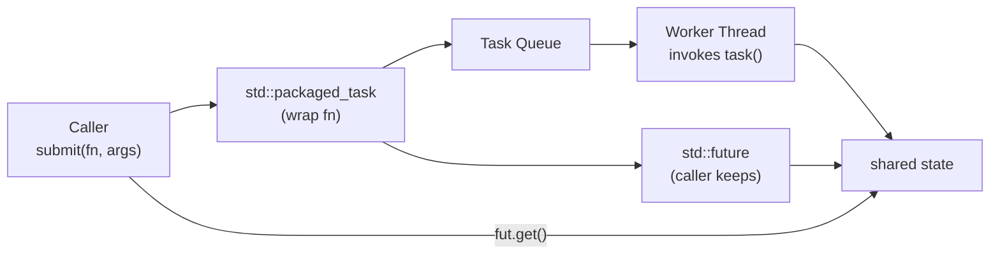
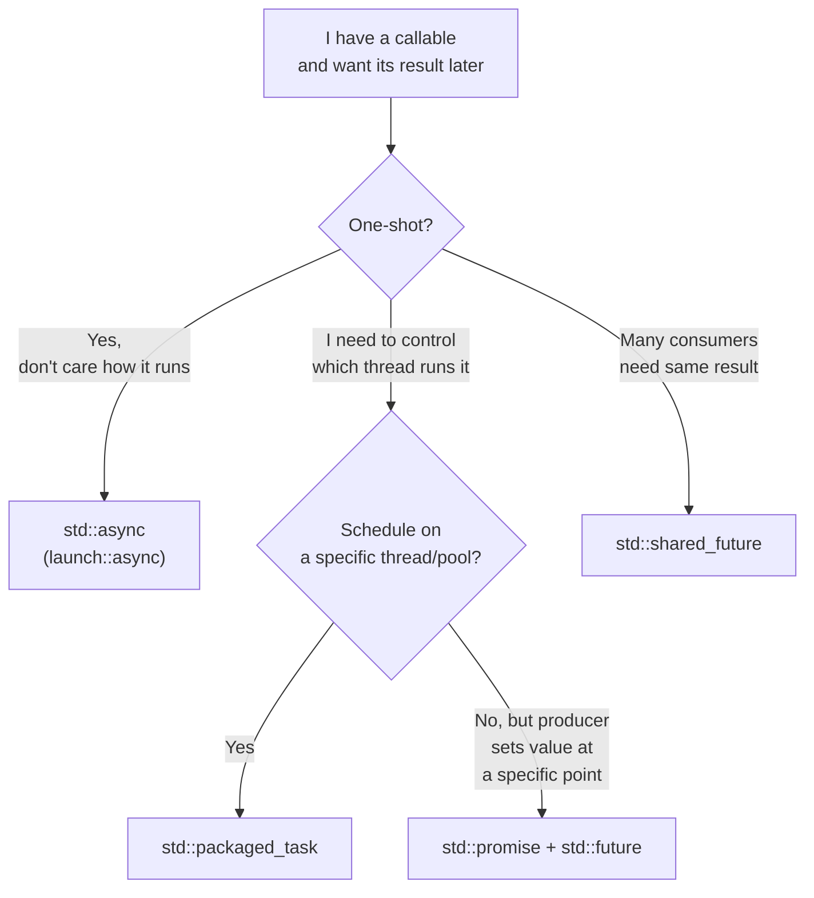

# 5. Futures, Promises, Async

> [!note] Why this note exists
> `std::thread` cannot return a value and cannot propagate exceptions to its caller. That makes it a poor fit for "run this function asynchronously and give me the answer later". This note covers the higher-level machinery — `std::future`, `std::promise`, `std::async`, `std::packaged_task`, and `std::shared_future` — that fills those gaps. These are the tools you should reach for *before* raw `std::thread`.

## Why It Matters

A "future" is a handle to a value that **does not exist yet but will**. The canonical use case is asynchronous computation:

```text
  Main thread           Worker thread
  ─────────────         ─────────────
  start compute() ────► runs compute()
  do other work           (long)
  ...
  need result ◄────── stores result
  use result
```

Without futures, you'd pass a pointer to a slot, lock a mutex, signal a condition variable, and join — about 30 lines of boilerplate. With `std::async` it is one line.

Futures also solve the **exception propagation** problem. If a worker thread throws, you want to catch it where you started the work, not crash the program. `std::future::get` re-throws the stored exception.

## Background

### The Shared State

Every future/promise pair is connected by a **shared state** — a small heap-allocated object that holds:

- The value (or exception) once set.
- A flag: not ready / ready.
- A mutex + condition variable for blocking `get()`.


The shared state is reference-counted. When the last reference drops (both promise and future destroyed), it is freed. If a promise is destroyed without setting a value, the future's `get()` throws `std::future_error(broken_promise)`.

### The Four Mechanisms

| Mechanism | What it does | When to use |
|-----------|--------------|-------------|
| `std::promise<T>` + `std::future<T>` | Manual producer/consumer. Move-only. | Lower-level building block; thread functions that need to set the result later. |
| `std::async(policy, fn, args...)` | Convenience: spawns thread (or defers), returns future. | One-shot "run this and give me the result". |
| `std::packaged_task<Fn>` | Wraps a callable into something that produces a future. | Scheduling: package a task, then run it on a specific thread / pool later. |
| `std::shared_future<T>` | Like `std::future<T>` but copyable; multiple consumers. | Fan-out: many threads need the same result. |

All four share the same shared-state plumbing.

## Main Content

### `std::async` — The Easy Button

```cpp
#include <future>
#include <iostream>

int long_calc() {
    std::this_thread::sleep_for(std::chrono::seconds(2));
    return 42;
}

int main() {
    auto fut = std::async(std::launch::async, long_calc);
    // do other work...
    std::cout << fut.get() << '\n';   // blocks until ready, returns 42
}
```

`std::async` returns a `std::future<R>` where `R` is the return type of the callable. `get()` blocks until the result is ready, then returns it. If the callable threw an exception, `get()` re-throws it in the caller's thread.

#### Launch policies

| Policy | Behavior |
|--------|----------|
| `std::launch::async` | Spawn a new thread *immediately*. The task runs concurrently. |
| `std::launch::deferred` | Lazy: don't start until `get()` (or `wait()`) is called. Then run on the calling thread. |
| `std::launch::async \| std::launch::deferred` (default) | Implementation chooses. Most implementations always pick `deferred`, which is **not what you want** if you expected parallelism. |

> [!danger] Always pass `std::launch::async`
> The default policy may run your task on the calling thread, defeating the purpose. Always write `std::async(std::launch::async, ...)` unless you specifically want deferred.

#### `get()` blocks

`future::get()` is a **one-shot** blocking call:

- If the result is ready, returns it immediately.
- If not, blocks until ready.
- After `get()`, the future is **invalid** — calling `get()` again throws `std::future_error`.

`wait()` is the non-value version: blocks until ready, returns `void`. `wait_for(d)` and `wait_until(tp)` return a `std::future_status` (`ready`, `timeout`, `deferred`).

#### `wait_for` and the deferred trap

```cpp
auto fut = std::async(std::launch::deferred, work);
auto status = fut.wait_for(std::chrono::seconds(1));
// status == std::future_status::deferred — task hasn't started, and never will
// until you call get() (which runs it on this thread)
```

If you used the default policy and got `deferred`, `wait_for` will return `deferred` instantly — never `timeout`. Always check `status == std::future_status::deferred` separately.

#### The destructor of `std::async`'s future blocks

A subtle gotcha:

```cpp
std::async(std::launch::async, []{ long_work(); });   // future not saved
```

The returned `std::future` is a temporary. Its destructor runs at the end of the full expression — and **blocks** until the async task finishes (since C++11, the standard effectively requires this for `std::launch::async`). So this code is fully synchronous. Always save the future if you want concurrency:

```cpp
auto fut = std::async(std::launch::async, []{ long_work(); });
// do other work concurrently
fut.wait();
```

### `std::promise` and `std::future` — The Manual Way

When you need more control than `std::async` — e.g., the producing thread is doing many things and only sets the result at some specific point — use `std::promise`.

```cpp
#include <future>
#include <iostream>
#include <thread>

void worker(std::promise<int> p) {
    try {
        int result = compute();
        p.set_value(result);
    } catch (...) {
        p.set_exception(std::current_exception());
    }
}

int main() {
    std::promise<int> p;
    std::future<int> f = p.get_future();
    std::thread t(worker, std::move(p));   // promise is move-only
    t.detach();                             // or join later
    // ... do other work ...
    try {
        std::cout << f.get() << '\n';
    } catch (const std::exception& e) {
        std::cerr << "task failed: " << e.what() << '\n';
    }
    // (need to join if not detached)
}
```

Key points:

- `std::promise` is **move-only**. Pass it into the worker thread by `std::move`.
- `set_value()` can be called exactly once. A second call throws.
- If the promise is destroyed without `set_value` or `set_exception`, the future sees `broken_promise`.
- `set_exception(std::current_exception())` rethrows the current exception in the consumer.

### `std::packaged_task`

A `std::packaged_task<R(Args...)>` wraps a callable so that calling it stores the result into a future. It's the bridge between "I have a function" and "I want to schedule this function on a specific thread later".

```cpp
#include <future>
#include <iostream>
#include <thread>

int add(int a, int b) { return a + b; }

int main() {
    std::packaged_task<int(int,int)> task(add);
    std::future<int> f = task.get_future();
    std::thread t(std::move(task), 3, 4);   // run task with args 3, 4
    t.detach();
    std::cout << f.get() << '\n';           // 7
}
```

`packaged_task` is the building block for thread pools: the pool stores `packaged_task`s in a queue, workers pop and invoke them, the original caller holds the futures.



### `std::shared_future`

A `std::future<T>` is move-only and **single-consumer**: only one thread can call `get()`. If multiple consumers need the same result (e.g., broadcasting a computed config to N worker threads), use `std::shared_future<T>`.

```cpp
std::promise<int> p;
std::shared_future<int> sf = p.get_future().share();
// sf is copyable
std::vector<std::thread> ts;
for (int i = 0; i < 5; ++i) {
    ts.emplace_back([sf]{ std::cout << sf.get() << '\n'; });   // each gets a copy
}
p.set_value(42);
for (auto& t : ts) t.join();
```

`shared_future::get()` can be called multiple times by multiple threads. It blocks until the value is ready, then returns a const reference (or a copy for scalar types) to every caller.

### When to Use What



### Futures vs Threads

| Property | `std::thread` | `std::future` |
|----------|---------------|---------------|
| Return value | No | Yes (`get()`) |
| Exception propagation | No (terminates) | Yes (`get()` re-throws) |
| Cancellation | No (use `jthread`) | No (only via `promise` destruction) |
| Reuse | No | No (one-shot) |
| Backpressure | None | None |
| Default scheduling | New thread | New thread (with `launch::async`) or lazy |

For one-shot parallel work with a return value, **`std::async` is the right default**. For long-lived background workers, use `std::jthread` with a queue. For pools, see [[7. Thread Pools]].

## Code Examples

### Parallel sum of a vector

```cpp
#include <algorithm>
#include <future>
#include <numeric>
#include <vector>

long long parallel_sum(const std::vector<int>& v) {
    if (v.size() < 10'000)
        return std::accumulate(v.begin(), v.end(), 0LL);

    auto mid = v.begin() + v.size() / 2;
    auto left  = std::async(std::launch::async,
                            [&]{ return std::accumulate(v.begin(), mid, 0LL); });
    auto right = std::accumulate(mid, v.end(), 0LL);
    return left.get() + right;
}
```

This recursively splits the work in half and runs the left half in parallel. For very large vectors you'd want to limit recursion depth to avoid spawning too many threads — see [[7. Thread Pools]] for a better approach.

### Async with timeout

```cpp
auto fut = std::async(std::launch::async, []{
    std::this_thread::sleep_for(std::chrono::seconds(5));
    return 42;
});

if (fut.wait_for(std::chrono::seconds(1)) != std::future_status::ready) {
    std::cerr << "timeout\n";
    // fut still valid — but the task keeps running in the background.
    // The destructor of fut will block at end of scope. There is no
    // standard way to cancel an std::async task.
} else {
    std::cout << fut.get() << '\n';
}
```

> [!warning] No standard cancellation
> `std::async` tasks cannot be cancelled. If the task is infinite or very long, it will keep running and the future's destructor will block. Use `std::jthread` with `stop_token` if you need cancellation, or roll your own with a flag + atomic.

### Exception propagation

```cpp
auto fut = std::async(std::launch::async, []() -> int {
    throw std::runtime_error("boom");
});
try {
    int x = fut.get();              // re-throws here
    (void)x;
} catch (const std::exception& e) {
    std::cerr << "caught: " << e.what() << '\n';
}
```

This is the **single most important reason to prefer futures over raw threads**. Errors propagate naturally across the thread boundary.

### Promises with multiple worker stages

```cpp
#include <future>
#include <iostream>
#include <thread>

void stage1(std::promise<int> p) {
    int x = read_input();
    p.set_value(x);
}

void stage2(std::shared_future<int> in, std::promise<int> out) {
    int x = in.get();
    out.set_value(transform(x));
}

int main() {
    std::promise<int> p1;
    std::shared_future<int> f1 = p1.get_future().share();

    std::promise<int> p2;
    std::future<int> f2 = p2.get_future();

    std::thread t1(stage1, std::move(p1));
    std::thread t2(stage2, f1, std::move(p2));

    t1.join();
    t2.join();

    std::cout << f2.get() << '\n';
}
```

This is the building block of pipelines. Real-world pipelines are easier with `std::execution` (proposed) or libraries like Intel TBB flow graphs.

### Broken promise

```cpp
std::future<int> f;
{
    std::promise<int> p;
    f = p.get_future();
    // p destroyed without set_value
}
try {
    f.get();
} catch (const std::future_error& e) {
    // e.code() == std::future_errc::broken_promise
    std::cerr << "broken promise\n";
}
```

This is how the standard library tells you "the producer died without producing". Always handle it.

## Common Pitfalls

> [!danger] Pitfall 1 — Default `std::async` policy
> Without `std::launch::async`, the implementation may defer the task. Your "parallel" code is sequential. Always pass the policy explicitly.

> [!danger] Pitfall 2 — Discarded future
> `std::async(std::launch::async, fn);` (no `auto fut =`) — the temporary future blocks in its destructor. Code is synchronous. Always save the future.

> [!danger] Pitfall 3 — Calling `get()` twice
> The future is invalid after the first `get()`. The second call throws `std::future_error`. Use `std::shared_future` if you need multiple gets.

> [!danger] Pitfall 4 — Using `wait_for` without checking `deferred`
> `wait_for` on a deferred task returns `deferred` instantly — never `timeout`. Your timeout logic is broken. Check the status explicitly.

> [!danger] Pitfall 5 — No cancellation
> You cannot cancel an `std::async` task. The future's destructor blocks until the task finishes. For cancellable work, use `std::jthread` with `stop_token`, or a custom flag.

> [!danger] Pitfall 6 — `set_value` twice
> `promise::set_value` is one-shot. The second call throws. Make sure your producer has a single exit point, or use `set_value_at_thread_exit`.

> [!danger] Pitfall 7 — Forgetting to handle `broken_promise`
> If a promise is destroyed without setting a value, the consumer's `get()` throws. If you don't catch it, your program dies. Either set a value, or set an exception, or document that destruction is intentional.

> [!danger] Pitfall 8 — Holding futures in containers that may move
> `std::future` is move-only. Storing in a `std::vector` works, but once you move the vector, the moved-from futures are invalid. Use `std::shared_future` if you need stability.

## Tips and Tricks

- **Default to `std::async(std::launch::async, ...)`** for one-shot parallel work. It is the simplest, exception-safe, RAII-managed option.
- **Save the future** in a variable if you want concurrency. Don't let it be a temporary.
- **Use `std::promise`** when the producing side needs to set the value at a specific point in time and/or from a specific thread.
- **Use `std::packaged_task`** when wrapping a callable for submission to a queue or pool.
- **Use `std::shared_future`** for fan-out: one result, many consumers.
- **Always handle `broken_promise`** at the consumer.
- **Don't expect cancellation** — use `std::jthread` + `stop_token` if you need it.
- **For large numbers of tasks, use a thread pool** (see [[7. Thread Pools]]) — `std::async` may spawn one thread per call, which is wasteful.
- **Combine `std::async` with a small number of futures** for divide-and-conquer parallelism (e.g., parallel `std::transform`). Limit the recursion depth.
- **`std::future_status::deferred`** is a possible `wait_for` result — always check.
- **Test under TSan** (see [[15. Debugging and Profiling/4. Sanitizers (ASan, UBSan, TSan)]]) — shared-state races are subtle.
- **Prefer coroutines** (see [[9. Coroutines (C++20)]]) for asynchronous I/O chains. Futures compose poorly; coroutines compose well.

## Active Recall

1. What three things does `std::future` provide that raw `std::thread` does not?
2. Why must you pass `std::launch::async` to `std::async`?
3. What happens if you ignore (don't store) the future returned by `std::async(std::launch::async, ...)`?
4. How many times can you call `std::future::get()`? What if you need multiple consumers?
5. What is `broken_promise` and when does it happen?
6. Write the difference between `std::async`, `std::promise`, and `std::packaged_task` in one sentence each.
7. How does `std::shared_future` differ from `std::future`? When do you need it?
8. What does `std::future::wait_for` return for a deferred task? Why is this a trap?
9. How do exceptions thrown inside an `std::async` task reach the caller?
10. Why is `std::async` a poor choice for a long-running background service?

## Next Steps

- Read [[7. Thread Pools]] — futures compose naturally with a pool.
- Read [[9. Coroutines (C++20)]] for the modern alternative to chains of futures.
- Read [[14. Concurrency and Multithreading/2. std thread and std jthread]] for the lower-level mechanism.
- Cross-reference [[14. Concurrency and Multithreading/4. Condition Variables]] — futures are built on top of condition variables.
- Cross-reference [[15. Debugging and Profiling/4. Sanitizers (ASan, UBSan, TSan)]] — TSan catches use-after-free on shared state.
