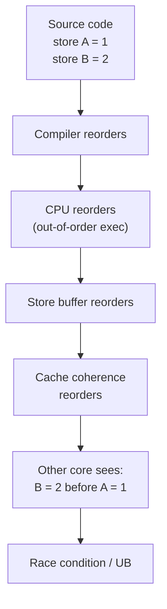
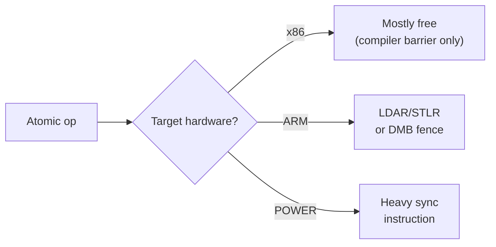
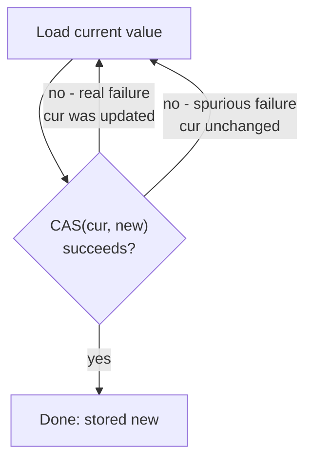
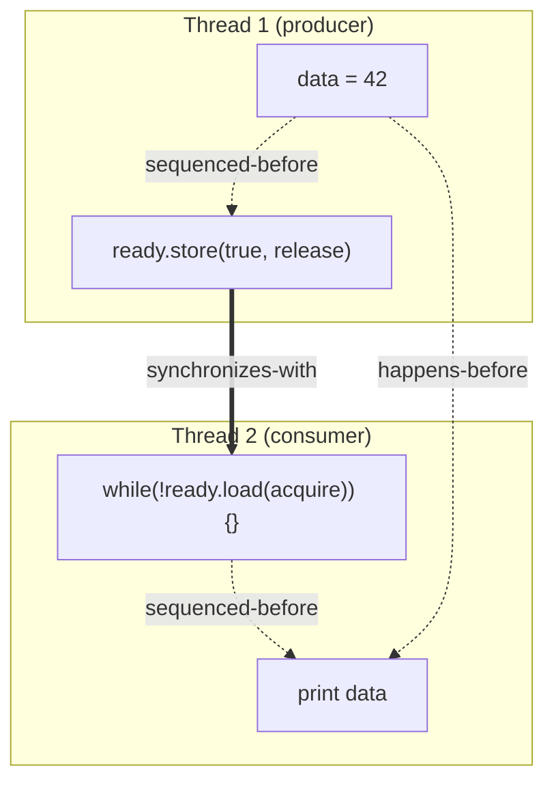

# 6. Atomics and Memory Ordering

> [!note] Why this note exists
> Atomics are the **lowest-level** synchronization primitive in C++. They are how lock-free code is written (see [[8. Lock-Free Programming]]), and they are also how mutexes are *implemented*. But "atomic" alone is not enough — the C++ memory model gives you six **memory orderings** that control how the compiler and CPU may reorder *other* memory accesses around the atomic. Choosing the wrong one causes bugs that pass tests for years and fail in production. This note is the foundation for understanding lock-free code, `std::mutex` internals, and `std::future`.

## Why It Matters

Consider:

```cpp
bool ready = false;
int value = 0;

// Thread 1
value = 42;
ready = true;

// Thread 2
while (!ready) {}
std::cout << value << '\n';   // 42? Maybe. Maybe 0. UB.
```

Without synchronization, the compiler and CPU are **free to reorder** the two stores in Thread 1. They may also reorder the two loads in Thread 2. The result is undefined behavior: Thread 2 may print 0.

The fix:

```cpp
std::atomic<bool> ready{false};
int value = 0;

// Thread 1
value = 42;
ready.store(true, std::memory_order_release);

// Thread 2
while (!ready.load(std::memory_order_acquire)) {}
std::cout << value << '\n';   // guaranteed 42
```

The `release` store and `acquire` load form a **synchronizes-with** relationship: every memory operation that happened-before the `release` store is visible to every operation that happens-after the matching `acquire` load.

This is the **memory model**: the rules by which threads agree on the order of memory operations.

## Background

### Why Memory Reordering Happens

Three layers may reorder your memory accesses:

1. **Compiler** — optimizes freely as long as the *single-threaded* observable behavior is unchanged. A store to `ready` may be hoisted above a store to `value` if the compiler thinks it's faster.
2. **CPU** — out-of-order execution. Modern CPUs execute instructions in data-flow order, not program order, then commit results in order. But stores to memory may be visible to other cores in arbitrary order due to store buffers.
3. **Cache hierarchy** — even if the CPU commits stores in order, the coherence protocol may propagate them in arbitrary order to other cores.



### The C++ Memory Model (since C++11)

The standard defines a set of allowed reorderings and a set of synchronization operations that *disallow* them. The atomic operations are the synchronization points; the memory orderings specify how strong the synchronization is.

The model is built on the **happens-before** relation, which is composed of:

- **sequenced-before**: within a single thread, the order of statements.
- **synchronizes-with**: a release store synchronizes-with an acquire load on the same atomic.
- **happens-before**: the transitive closure of sequenced-before and synchronizes-with.

If operation A happens-before operation B in another thread, then B can observe A's effects. If not, the relationship is undefined — anything goes.

### The Six Memory Orderings

| Ordering | Effect |
|----------|--------|
| `memory_order_relaxed` | No ordering; only atomicity. Useful for counters where you don't care about ordering of other memory. |
| `memory_order_consume` | (Effectively `acquire` on all real implementations; rarely used.) Data-dependency ordering. |
| `memory_order_acquire` | A load that, after it, no *subsequent* memory op in this thread can be reordered before it. Pairs with `release`. |
| `memory_order_release` | A store that, before it, no *prior* memory op in this thread can be reordered after it. Pairs with `acquire`. |
| `memory_order_acq_rel` | A read-modify-write (e.g., `exchange`, `compare_exchange`) that is both `acquire` and `release`. |
| `memory_order_seq_cst` | Sequential consistency. Like `acq_rel` plus a single global total order of all `seq_cst` operations. The default and the safest. |

The default is `memory_order_seq_cst`. It is the most expensive but the most intuitive. If in doubt, use the default.

### x86 vs ARM Memory Models

Hardware memory models differ dramatically:

- **x86 / x86-64** is **strongly ordered** (TSO — Total Store Order). Every store is a release; every load is an acquire. `seq_cst` is essentially free at the load/store level (only `MFENCE` is needed for some RMW sequences). The compiler must still respect the ordering, but the hardware rarely needs extra fences.
- **ARM / ARM64** is **weakly ordered**. Loads and stores may be reordered freely. `acquire` loads need an `LDAR` instruction; `release` stores need a `STLR`. `seq_cst` needs more.
- **POWER** is even weaker.

This means: code that "works" on x86 may fail on ARM. **Always use the correct memory ordering; never rely on hardware being strongly ordered.**



## Main Content

### `std::atomic<T>`

```cpp
#include <atomic>

std::atomic<int> counter{0};
std::atomic<bool> flag{false};
std::atomic<int*> ptr{nullptr};
```

Specializations exist for all integral types, pointers, and (since C++20) `std::shared_ptr` (deprecated; use `std::atomic<std::shared_ptr<T>>`), and `std::shared_ptr`'s `load`/`store` (also deprecated in favor of atomic smart pointers).

`std::atomic<T>` is guaranteed lock-free when `T` is `bool`, a character type, an integral type, or a pointer, *if* `T` is at most the native word size. For larger types, the implementation may use a hidden mutex (`std::atomic<T>::is_always_lock_free` is a compile-time constant; `instance.is_lock_free()` is a runtime check).

### Basic Operations

| Operation | Description |
|-----------|-------------|
| `load(order)` | Atomically read the value. |
| `store(v, order)` | Atomically write `v`. |
| `exchange(v, order)` | Atomically write `v`, return old value. |
| `compare_exchange_strong(expected, desired, succ_order, fail_order)` | If `*this == expected`, store `desired` and return `true`. Else load `*this` into `expected` and return `false`. (CAS — see below.) |
| `compare_exchange_weak` | Same, but may **fail spuriously** even when `*this == expected`. Use in a loop; it's slightly faster on some architectures. |
| `fetch_add(n, order)` / `fetch_sub` / `fetch_or` / `fetch_and` / `fetch_xor` | Atomic RMW. Returns the old value. |
| `operator++` / `operator--` | Sugar for `fetch_add(1)` / `fetch_sub(1)`. Default `seq_cst`. |
| `operator T()` | Sugar for `load()`. |
| `operator=(v)` | Sugar for `store(v)`. |

### The CAS Loop

Compare-Exchange-Swap is the fundamental primitive of lock-free programming. The pattern:

```cpp
std::atomic<int> a{0};

void bump_to_at_least(int new_val) {
    int cur = a.load(std::memory_order_relaxed);
    while (cur < new_val) {
        if (a.compare_exchange_weak(cur, new_val, std::memory_order_acq_rel))
            break;
        // CAS failed: cur was reloaded with the current value. Loop.
    }
}
```

`compare_exchange_weak` is preferred in loops because on some architectures (notably ARM/POWER) the "strong" version requires an extra fence. The "spurious failure" (returns false even though `cur` matches) is fine in a loop — you just retry.



### Memory Ordering Visualization



This is the **release/acquire pattern**: the producer writes data, then signals readiness with a release store. The consumer loops on an acquire load; once it observes `true`, every prior write by the producer (the data write) is visible.

### When to Use Each Ordering

#### `memory_order_relaxed`

No ordering; just atomicity. Use for counters where you don't care about ordering of *other* memory.

```cpp
std::atomic<int> hits{0};
void on_hit() { hits.fetch_add(1, std::memory_order_relaxed); }
```

#### `memory_order_acquire` / `memory_order_release`

The classic producer/consumer pattern above. Use for flag-based synchronization: one thread writes data + sets a flag (release), another reads the flag (acquire) and then reads the data.

```cpp
std::atomic<int> seq{0};
int data = 0;

void producer() {
    data = 42;
    seq.store(1, std::memory_order_release);
}

void consumer() {
    int s;
    while ((s = seq.load(std::memory_order_acquire)) == 0) {}
    // s == 1, data == 42 guaranteed
    std::cout << data << '\n';
}
```

#### `memory_order_acq_rel`

For read-modify-write operations (CAS, `fetch_add`, `exchange`). Both directions need ordering because the op reads *and* writes.

```cpp
std::atomic<int> lock{0};
void lock_it() {
    while (lock.exchange(1, std::memory_order_acq_rel) != 0) {
        // spin
    }
}
void unlock_it() {
    lock.store(0, std::memory_order_release);
}
```

#### `memory_order_seq_cst`

The default. Adds a single global order on all `seq_cst` operations. Use when:

- You're not sure what to use.
- The correctness argument requires a global order (rare; usually acquire/release is enough).
- You're writing a mutex implementation that must interoperate with other `seq_cst` code.

The cost is one fence per `seq_cst` operation on weak architectures (ARM, POWER), and an `MFENCE` or `LOCK`-prefixed instruction on x86 in some cases.

#### `memory_order_consume`

In theory: like `acquire` but only for *data-dependent* operations. In practice: every major compiler treats it as `acquire` because the standard's definition is hard to implement correctly. Avoid; use `acquire` instead.

### Fences

Sometimes you need to enforce ordering without a specific atomic operation. `std::atomic_thread_fence` provides standalone fences:

```cpp
data = 42;
std::atomic_thread_fence(std::memory_order_release);
ready.store(true, std::memory_order_relaxed);
```

Equivalent to the release-store version, but separates the fence from the store. Useful when the store and the fence cannot be on the same line (e.g., the store is a non-atomic store to a known-aligned location you're managing manually).

> [!warning] Fences are not a free lunch
> Fences are easy to misuse. Prefer ordering arguments on the atomic operations themselves; only fall back to standalone fences when you have a specific reason.

### `volatile` Is Not `atomic`

A common C mistake:

```cpp
volatile int counter = 0;   // WRONG: not atomic, not memory-ordered
```

`volatile` in C++ means **"do not optimize away accesses to this memory"**. It does *not* mean atomic, and it does *not* provide any memory ordering. It is for memory-mapped I/O and signal handlers, not for multithreading. **Never use `volatile` for thread synchronization.** Use `std::atomic`.

### `std::atomic_ref<T>` (C++20)

Sometimes you cannot change the type of a variable (e.g., it's a member of a third-party struct). `std::atomic_ref<T>` lets you treat a non-atomic `T` as atomic for the lifetime of the reference.

```cpp
int x = 0;
{
    std::atomic_ref<int> ax(x);
    ax.store(42, std::memory_order_relaxed);
}
// x == 42 now
```

All accesses to `x` during the `atomic_ref`'s lifetime must go through an `atomic_ref` (or be otherwise synchronized). Mixing atomic and non-atomic accesses is a data race.

## Code Examples

### A thread-safe counter

```cpp
#include <atomic>

class Counter {
    std::atomic<long long> v_{0};
public:
    void inc()   { v_.fetch_add(1, std::memory_order_relaxed); }
    void dec()   { v_.fetch_sub(1, std::memory_order_relaxed); }
    long long get() const { return v_.load(std::memory_order_relaxed); }
};
```

`relaxed` is correct because we don't synchronize anything else on the counter.

### A simple spinlock

```cpp
#include <atomic>

class Spinlock {
    std::atomic_flag flag_ = ATOMIC_FLAG_INIT;
public:
    void lock() {
        while (flag_.test_and_set(std::memory_order_acquire)) {
            // spin — in real code: _mm_pause() on x86, yield() occasionally
        }
    }
    void unlock() {
        flag_.clear(std::memory_order_release);
    }
};
```

`std::atomic_flag` is the only type guaranteed to be lock-free on every implementation. It has only `test_and_set` and `clear`. This is the canonical spinlock.

> [!warning] Spinlocks are almost always wrong in user-space code
> They burn CPU while waiting. They perform terribly when the holder is preempted (the spinner burns a full quantum). Use `std::mutex` unless you have benchmarked evidence.

### Release/acquire message passing

```cpp
std::atomic<int> ready{0};
int payload = 0;

void producer() {
    payload = 42;
    ready.store(1, std::memory_order_release);
}

void consumer() {
    while (ready.load(std::memory_order_acquire) == 0)
        std::this_thread::yield();
    std::cout << "payload = " << payload << '\n';   // 42, guaranteed
}
```

### Double-checked locking, done right

```cpp
#include <atomic>
#include <memory>

class Singleton {
    static std::atomic<Singleton*> instance_;
    static std::mutex mtx_;
public:
    static Singleton* get() {
        Singleton* p = instance_.load(std::memory_order_acquire);
        if (!p) {
            std::lock_guard<std::mutex> lk(mtx_);
            p = instance_.load(std::memory_order_relaxed);
            if (!p) {
                p = new Singleton();
                instance_.store(p, std::memory_order_release);
            }
        }
        return p;
    }
};
std::atomic<Singleton*> Singleton::instance_{nullptr};
```

Or just use a magic static — same effect, no code:

```cpp
Singleton& get() {
    static Singleton instance;
    return instance;
}
```

### CAS-based lock-free push (preview of [[8. Lock-Free Programming]])

```cpp
template <class T>
struct Stack {
    struct Node { T v; Node* next; };
    std::atomic<Node*> head_{nullptr};

    void push(T v) {
        Node* n = new Node{std::move(v), nullptr};
        n->next = head_.load(std::memory_order_relaxed);
        while (!head_.compare_exchange_weak(n->next, n,
                                             std::memory_order_release,
                                             std::memory_order_relaxed)) {
            // n->next was reloaded; loop
        }
    }
};
```

Note the **two** memory orders on `compare_exchange`: the success order and the failure order. The failure order cannot be stronger than the success order, and cannot be `release` or `acq_rel` (since failure is a load, not a store).

## Common Pitfalls

> [!danger] Pitfall 1 — `volatile` for threading
> `volatile` is for hardware/signal handlers, not threads. Use `std::atomic`.

> [!danger] Pitfall 2 — Assuming `seq_cst` is "always safe"
> It is safe, but it can be 10× slower than `relaxed` on ARM. Don't pay for what you don't need.

> [!danger] Pitfall 3 — Assuming `relaxed` is enough
> `relaxed` provides no ordering. If you read a flag and then read data based on it, you have a data race.

> [!danger] Pitfall 4 — Wrong failure order on CAS
> `compare_exchange(expected, desired, release, seq_cst)` is illegal — failure order cannot be `release`. Use `relaxed` or `acquire` for failure.

> [!danger] Pitfall 5 — Assuming `is_lock_free` is always `true`
> `std::atomic<SomeBigStruct>` may use a hidden mutex internally. Check `is_always_lock_free` if you care.

> [!danger] Pitfall 6 — Mixing atomic and non-atomic accesses
> Once you've decided a variable is atomic, all accesses must be atomic (or otherwise synchronized). A plain read while another thread does an atomic write is a data race.

> [!danger] Pitfall 7 — Assuming x86 behavior is portable
> x86's strong TSO masks many ordering bugs. The same code may fail on ARM. Always test on multiple architectures, or use TSan (which simulates a weaker model).

> [!danger] Pitfall 8 — Spurious CAS failures vs spurious wakeups
> `compare_exchange_weak` may fail spuriously (it's designed to). `condition_variable::wait` may wake spuriously (it's designed to). Both are handled by looping.

## Tips and Tricks

- **Default to `memory_order_seq_cst`**. Only optimize down to `acquire/release/relaxed` when you have a benchmark showing it matters.
- **Use `compare_exchange_weak` in loops**, `compare_exchange_strong` outside loops.
- **`std::atomic_flag`** is the only always-lock-free type. Use for spinlocks.
- **`alignas(64)`** hot atomic counters in different threads to avoid false sharing.
- **Atomic ops on the same cache line are not free** — coherence traffic is expensive. Spread hot counters across cache lines.
- **`std::atomic_ref`** (C++20) is the modern way to atomically access a non-atomic variable (e.g., a `struct` member you don't control).
- **`is_always_lock_free`** is a `constexpr` you can `static_assert` on. Do so for types where lock-freedom is a hard requirement.
- **Always run TSan** (see [[15. Debugging and Profiling/4. Sanitizers (ASan, UBSan, TSan)]]) — it models a weak memory model and catches ordering bugs that pass on x86.
- **`std::atomic_init`** is deprecated; just initialize with the constructor.
- **Avoid standalone fences** unless you have a specific reason.
- **Read the standard's [atomics.order]** section once. It's the canonical reference.

## Active Recall

1. Why does the compiler/CPU reorder memory accesses? Is it always a bug?
2. What does `memory_order_relaxed` guarantee? What does it not guarantee?
3. State the release/acquire pattern. What is "synchronizes-with"?
4. Why is `compare_exchange_weak` preferred in loops?
5. What is the difference between `seq_cst` and `acq_rel`? When does each matter?
6. Why does x86 "mask" many memory ordering bugs? Why is this a problem for portability?
7. Is `volatile` a substitute for `std::atomic`? Why or why not?
8. What is `std::atomic_ref`? When would you use it?
9. What is false sharing in the context of atomic counters? How do you fix it?
10. Write a double-checked-locked singleton using atomics. Then explain why a magic static is simpler.

## Next Steps

- Read [[8. Lock-Free Programming]] — built entirely on the CAS primitive.
- Read [[14. Concurrency and Multithreading/3. Mutexes and Locks]] — a mutex is just an atomic with a kernel fallback.
- Read [[14. Concurrency and Multithreading/7. Thread Pools]] — atomic counters track work queues.
- Cross-reference [[15. Debugging and Profiling/4. Sanitizers (ASan, UBSan, TSan)]] — TSan simulates a weak memory model.
- Cross-reference [[14. Concurrency and Multithreading/1. Introduction to Multithreading]] for the broader context.
