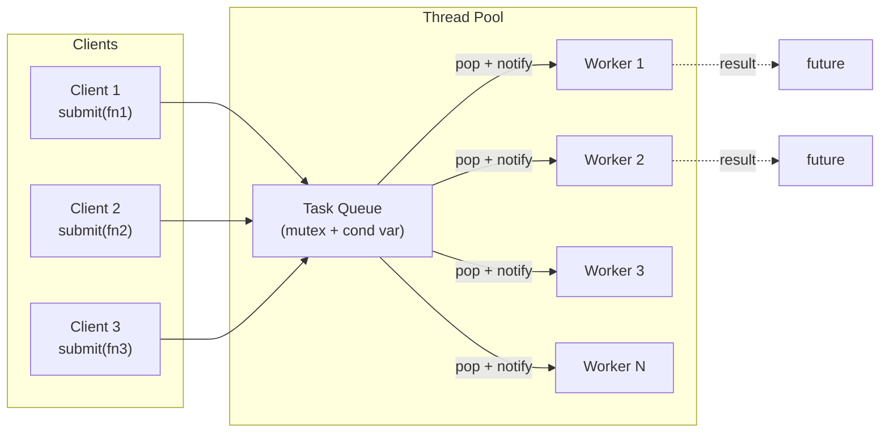
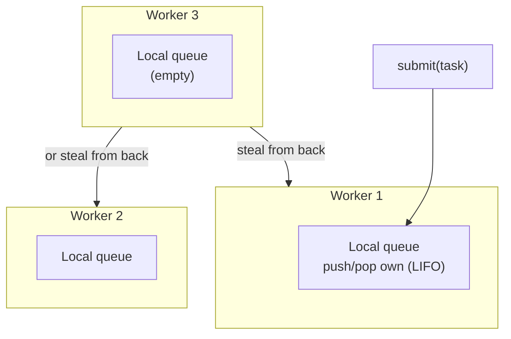

# 7. Thread Pools

> [!note] Why this note exists
> Creating a `std::thread` per task is wasteful: each thread costs ~20–50 µs to spawn and reserves a stack (often 8 MB virtual). For 10 000 short tasks, you'd spend more time creating and destroying threads than doing work. A **thread pool** solves this by creating N worker threads once and feeding them tasks from a queue. This note covers the design, the gotchas, and the production-ready alternatives (BS::thread_pool, Intel TBB, Boost.Asio).

## Why It Matters

Almost every non-trivial C++ program that does parallel work eventually needs a thread pool. The patterns:

- **Server** — one thread per request is fine for 100 req/s; for 100 000 req/s you need a pool of N workers.
- **Game engine** — frame budget is 16 ms; you cannot afford to spawn threads per frame.
- **Image processing** — process tiles in parallel; same threads reused for every frame.
- **Compiler/Build system** — parallel file compilation; one thread per file is fine for 10 files, not for 10 000.
- **Batch data processing** — parallel map over a million records.

A well-designed pool gives you:

1. **Bounded concurrency** — never more than N threads, so no thread-thrashing.
2. **Low task overhead** — task submission is one mutex lock + one notify; ~1 µs.
3. **Work queueing** — back-pressure when the system is overloaded.
4. **Optional work-stealing** — keep all cores busy even when tasks vary in duration.

## Background

### The Cost of Thread Creation

| Operation | Cost on Linux |
|-----------|---------------|
| `std::thread` constructor | ~20–50 µs |
| Thread stack reservation | 8 MB virtual, ~4 KB physical at start |
| Kernel thread object | ~10 KB |
| Context switch | ~1–5 µs |
| Mutex lock/unlock (uncontended) | ~25 ns |
| Condition variable notify + wake | ~5–10 µs |

If your task is 100 µs of work, the overhead of a `std::thread` is 20–50% of the total. For 10 µs tasks, the overhead dominates. For 10 000 such tasks, you spend 200 ms just spawning threads — entirely wasted.

### The Basic Architecture

A thread pool has three parts:

1. **Worker threads** — N long-lived threads that loop: pop a task, run it, repeat.
2. **Task queue** — a thread-safe FIFO of `std::function`-like callables.
3. **Submission API** — a `submit(fn)` method that adds to the queue and notifies a worker.



### Choosing N

The pool size is usually one of:

- `std::thread::hardware_concurrency()` — for CPU-bound work.
- A larger fixed number (e.g., 4× cores) — for I/O-bound work where most threads are blocked.
- Dynamic — grow on demand, shrink when idle (rare in C++; the JVM and Go do this).

> [!tip] Rule of thumb
> - Pure CPU work: N = cores.
> - Mixed CPU + I/O: N = 2× to 4× cores.
> - Pure I/O: N = number of concurrent I/O operations you expect.

## Main Content

### A Minimal Thread Pool

```cpp
#include <condition_variable>
#include <functional>
#include <future>
#include <mutex>
#include <queue>
#include <thread>
#include <vector>

class ThreadPool {
    std::vector<std::thread> workers_;
    std::queue<std::function<void()>> tasks_;
    std::mutex m_;
    std::condition_variable cv_;
    bool stop_ = false;

public:
    explicit ThreadPool(std::size_t n) {
        for (std::size_t i = 0; i < n; ++i) {
            workers_.emplace_back([this] {
                for (;;) {
                    std::function<void()> task;
                    {
                        std::unique_lock<std::mutex> lk(m_);
                        cv_.wait(lk, [this]{ return stop_ || !tasks_.empty(); });
                        if (stop_ && tasks_.empty()) return;
                        task = std::move(tasks_.front());
                        tasks_.pop();
                    }
                    task();   // run outside the lock
                }
            });
        }
    }

    ~ThreadPool() {
        {
            std::lock_guard<std::mutex> lk(m_);
            stop_ = true;
        }
        cv_.notify_all();
        for (auto& t : workers_) t.join();
    }

    template <class F>
    std::future<void> submit(F&& f) {
        auto task = std::make_shared<std::packaged_task<void()>>(std::forward<F>(f));
        auto fut = task->get_future();
        {
            std::lock_guard<std::mutex> lk(m_);
            tasks_.emplace([task]{ (*task)(); });
        }
        cv_.notify_one();
        return fut;
    }
};
```

Notes:

- The worker loop is the standard pattern: lock, wait for work or stop, pop, unlock, run.
- The destructor sets `stop_`, notifies all, and joins. The condition `stop_ && tasks_.empty()` ensures pending tasks finish before shutdown.
- `submit` returns a `std::future<void>` — extend to return any type with a template return type.

### Returning Values from Tasks

A more general `submit` that returns a future of any type:

```cpp
template <class F, class... Args>
auto submit(F&& f, Args&&... args)
    -> std::future<std::invoke_result_t<F, Args...>>
{
    using R = std::invoke_result_t<F, Args...>;
    auto task = std::make_shared<std::packaged_task<R()>>(
        [f = std::forward<F>(f),
         args_tuple = std::make_tuple(std::forward<Args>(args)...)]() mutable {
            return std::apply(std::move(f), std::move(args_tuple));
        }
    );
    auto fut = task->get_future();
    {
        std::lock_guard<std::mutex> lk(m_);
        tasks_.emplace([task]{ (*task)(); });
    }
    cv_.notify_one();
    return fut;
}
```

Now you can write:

```cpp
ThreadPool pool(4);
auto f1 = pool.submit([]{ return 42; });
auto f2 = pool.submit(add, 3, 4);
std::cout << f1.get() << ' ' << f2.get() << '\n';   // 42 7
```

### Graceful Shutdown

A pool must:

1. Stop accepting new tasks (or have a "drain" mode).
2. Let queued tasks finish (or have a "cancel" mode).
3. Join all worker threads before destructing.

The simple version above drains by default: workers exit only when `stop_ && tasks_.empty()`. This is usually what you want. For "abort" semantics, drop the queue and signal workers to exit immediately.

### Work Stealing

The basic pool has one global queue protected by one mutex. With many cores and many short tasks, that mutex becomes a bottleneck. **Work stealing** solves this:

- Each worker has its own local queue (deque, LIFO for cache locality).
- A worker pushes/pops from its own queue (no contention).
- When its queue is empty, it tries to **steal** from the back of another worker's queue.



Each local queue is contended only between its owner (push/pop front) and potential stealers (pop back). With a lock-free deque (e.g., Chase-Lev), this scales to dozens of cores.

Work stealing is non-trivial to implement correctly. **Use a library.**

### Job Stealing vs Work Sharing

- **Work stealing** (above): idle workers steal from busy ones.
- **Work sharing**: a global scheduler pushes tasks to whichever worker has the smallest queue.

Stealing is more common in modern pools (TBB, Fork/Join, Go's scheduler) because it has lower overhead in the common case (no work needed if everyone is busy).

### Production Pools

Writing your own pool is educational. For production, use one of:

#### BS::thread_pool

A lightweight, header-only C++17 pool with optional work stealing. Easy to drop into any project. ~1000 lines, MIT license. Good default choice.

```cpp
#include "BS_thread_pool.hpp"
BS::thread_pool pool;
auto fut = pool.submit([]{ return compute(); });
pool.push_task([]{ background_work(); });   // fire-and-forget
```

#### Intel TBB (Threading Building Blocks)

Mature, high-performance, work-stealing. Provides:

- `tbb::parallel_for` — parallelize a loop.
- `tbb::parallel_reduce` — parallel reduction.
- `tbb::flow::graph` — pipeline / DAG of tasks.
- `tbb::task_arena` — isolate work into a sub-pool.

```cpp
#include <tbb/parallel_for.h>
tbb::parallel_for(0, N, [&](int i){ work(i); });
```

TBB is the gold standard for CPU-bound parallelism in C++. Used by many high-performance libraries.

#### Boost.Asio thread pool

Designed for I/O-bound work. The pool runs an `io_context`; tasks post handlers; handlers may chain further async operations. Integrates naturally with networking code.

```cpp
boost::asio::thread_pool pool(4);
boost::asio::post(pool, []{ do_io(); });
pool.join();
```

#### OpenMP

Not a "pool" per se, but a pragma-based parallelism layer with a runtime-managed pool. Compiled-in with `-fopenmp`.

```cpp
#pragma omp parallel for
for (int i = 0; i < N; ++i) {
    work(i);
}
```

Easy for loops; less flexible for complex task graphs.

#### std::execution (C++26)

The upcoming senders/receivers proposal provides a standard, composable async framework. When it lands, it will be the portable way to express pipelines of work.

### When Not to Use a Pool

- **One-shot parallelism** with a few large tasks — `std::async(std::launch::async, ...)` is simpler.
- **I/O-bound work with thousands of connections** — an event loop (Boost.Asio without threads, libuv, libevent) may scale better than a thread-per-connection pool.
- **Real-time work** — pool scheduling is non-deterministic; you need dedicated pinning.
- **Latency-sensitive workloads where a task might be enqueued behind many others** — direct submission to a pinned thread may be required.

## Code Examples

### Parallel map over a vector

```cpp
ThreadPool pool(std::thread::hardware_concurrency());

template <class T, class F>
std::vector<T> parallel_map(const std::vector<T>& in, F f) {
    std::vector<T> out(in.size());
    std::vector<std::future<void>> futs;
    const std::size_t chunk = std::max<std::size_t>(1, in.size() / pool.size());
    for (std::size_t i = 0; i < in.size(); i += chunk) {
        std::size_t end = std::min(i + chunk, in.size());
        futs.push_back(pool.submit([&, i, end]{
            for (std::size_t j = i; j < end; ++j) out[j] = f(in[j]);
        }));
    }
    for (auto& f : futs) f.get();
    return out;
}
```

### Parallel reduce

```cpp
template <class T, class BinOp>
T parallel_reduce(const std::vector<T>& in, T init, BinOp op) {
    if (in.empty()) return init;
    std::vector<std::future<T>> partials;
    const std::size_t chunk = std::max<std::size_t>(1, in.size() / pool.size());
    for (std::size_t i = 0; i < in.size(); i += chunk) {
        std::size_t end = std::min(i + chunk, in.size());
        partials.push_back(pool.submit([&, i, end]{
            T acc = in[i];
            for (std::size_t j = i + 1; j < end; ++j) acc = op(acc, in[j]);
            return acc;
        }));
    }
    T acc = init;
    for (auto& f : partials) acc = op(acc, f.get());
    return acc;
}
```

### Dynamic load balancing with future-based dependencies

```cpp
// Build a small DAG of tasks with dependencies
auto a = pool.submit([]{ return load_a(); });
auto b = pool.submit([]{ return load_b(); });
auto c = pool.submit([&]{
    int va = a.get();   // blocks until a is ready
    int vb = b.get();
    return combine(va, vb);
});
auto d = pool.submit([&]{
    int vc = c.get();
    return finalize(vc);
});
std::cout << d.get() << '\n';
```

This works because `submit` returns a future; the task body calls `.get()` on its dependency, blocking the worker until it's ready. **Caveat**: blocking a worker inside a task can starve the pool. For deep dependency graphs, prefer a work-stealing pool (TBB, BS) or coroutines (see [[9. Coroutines (C++20)]]).

### Pinned threads (CPU affinity)

For latency-sensitive work, pin each worker to a specific core so the OS doesn't migrate it:

```cpp
#include <pthread.h>
#include <sched.h>

void pin_to_core(int cpu) {
    cpu_set_t cs;
    CPU_ZERO(&cs);
    CPU_SET(cpu, &cs);
    pthread_setaffinity_np(pthread_self(), sizeof(cs), &cs);
}

// In each worker:
pin_to_core(my_cpu_id);
```

Linux-specific (POSIX). On Windows use `SetThreadAffinityMask`.

## Common Pitfalls

> [!danger] Pitfall 1 — Too many tasks, too small
> Submitting 1 000 000 tasks of 1 µs each wastes most of the time on queue contention. Chunk into ~N×10 larger tasks.

> [!danger] Pitfall 2 — Blocking inside tasks
> If a task calls `fut.get()` and the future isn't ready, the worker blocks. With M workers and M blocked tasks, the pool is deadlocked even if there's other work to do. Use work-stealing or coroutines.

> [!danger] Pitfall 3 — Throwing in a task and forgetting to consume the future
> If a `packaged_task` throws and the future is never `.get()`'d, the exception is silently swallowed (or stored forever). Always consume futures.

> [!danger] Pitfall 4 — Submitting from inside a task to the same pool
> Can deadlock if the pool is full of tasks waiting for the inner tasks. Use `try_submit` (returns false if full) or a separate pool for inner work.

> [!danger] Pitfall 5 — Global queue as a bottleneck
> At 32+ cores, the single mutex becomes the bottleneck. Switch to work-stealing (TBB, BS).

> [!danger] Pitfall 6 — Forgetting to drain on shutdown
> If you don't wait for queued tasks, you may lose work — and any captured references may dangle after the pool's destructor returns.

> [!danger] Pitfall 7 — Capturing references to stack data
> `pool.submit([&]{ use(local); });` followed by leaving the scope: `local` is destroyed before the task runs. UB. Capture by value, or use `shared_ptr`.

> [!danger] Pitfall 8 — Pool size = number of tasks
> Don't size the pool to the number of tasks; size it to the number of cores (or 2–4× for I/O). Tasks queue; threads don't.

## Tips and Tricks

- **Use a library** for production code. BS::thread_pool for simple cases, TBB for heavy parallelism, Boost.Asio for I/O.
- **Chunk your work**: aim for ~100 µs–10 ms per task. Smaller: overhead dominates. Larger: load imbalance.
- **Use `std::future` to chain dependencies**, but watch for blocking inside tasks.
- **Prefer `parallel_for`** (TBB, OpenMP) over hand-rolled chunking for loops.
- **Pin threads** for latency-sensitive work.
- **Name your threads** (pthread_setname_np) for easier debugging.
- **Set a stack size** for recursive tasks (Boost.Asio and TBB allow this; `std::thread` does not expose it portably).
- **Avoid detaching workers** — they should be joined at pool destruction.
- **Use `try_submit` with a bounded queue** for back-pressure; reject work when the queue is full.
- **Benchmark with realistic loads** — synthetic benchmarks mislead.
- **Consider coroutines** (see [[9. Coroutines (C++20)]]) for I/O-bound pools with chained dependencies; they don't block worker threads.
- **Enable sanitizers** in CI (see [[15. Debugging and Profiling/4. Sanitizers (ASan, UBSan, TSan)]]) to catch use-after-free in captured references.

## Active Recall

1. Why is creating a `std::thread` per task wasteful for 10 000 short tasks?
2. What are the three components of a thread pool?
3. Write the worker loop pattern (lock, wait, pop, unlock, run).
4. How do you choose N, the number of worker threads, for CPU-bound vs I/O-bound work?
5. What is work stealing? When does it help?
6. Why is `submit` returning a `std::future` better than passing an output pointer?
7. Why is blocking on a future inside a task a problem? How do coroutines solve it?
8. Name three production thread pool libraries for C++ and one strength of each.
9. What happens if a `packaged_task` throws and the future is never `get()`'d?
10. How do you pin a thread to a specific core on Linux? Why would you?

## Next Steps

- Read [[14. Concurrency and Multithreading/5. Futures, Promises, Async]] — pools return futures.
- Read [[9. Coroutines (C++20)]] — the modern alternative to blocking-future-based chains.
- Read [[8. Lock-Free Programming]] — for high-performance lock-free task queues.
- Cross-reference [[15. Debugging and Profiling/5. perf and Flamegraphs]] — pools need profiling to size correctly.
- Cross-reference [[14. Concurrency and Multithreading/4. Condition Variables]] — the worker loop is built on a condition variable.
