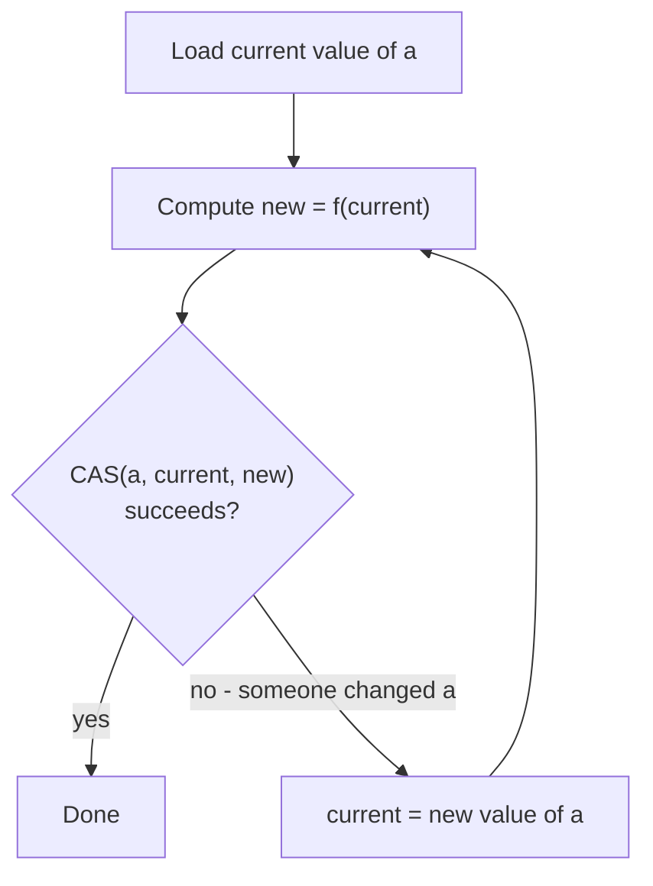
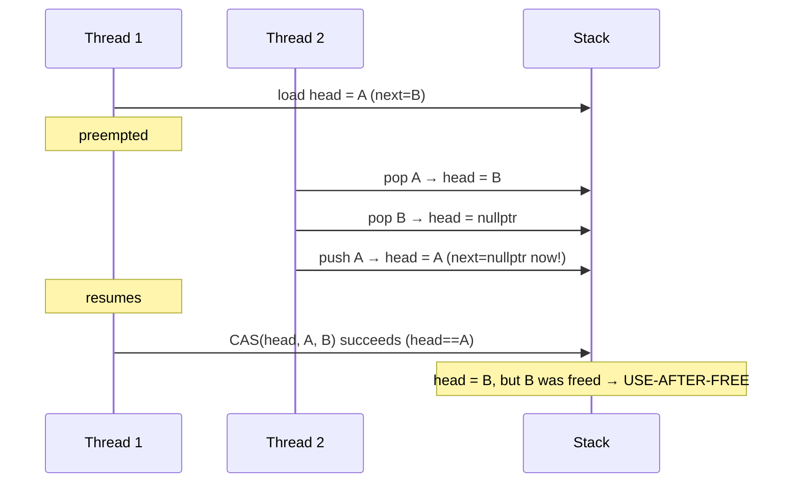
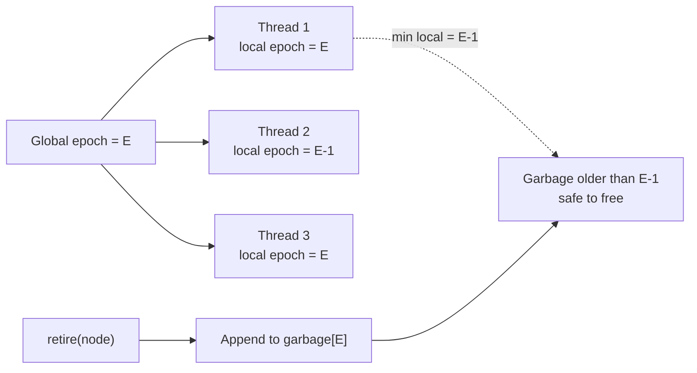
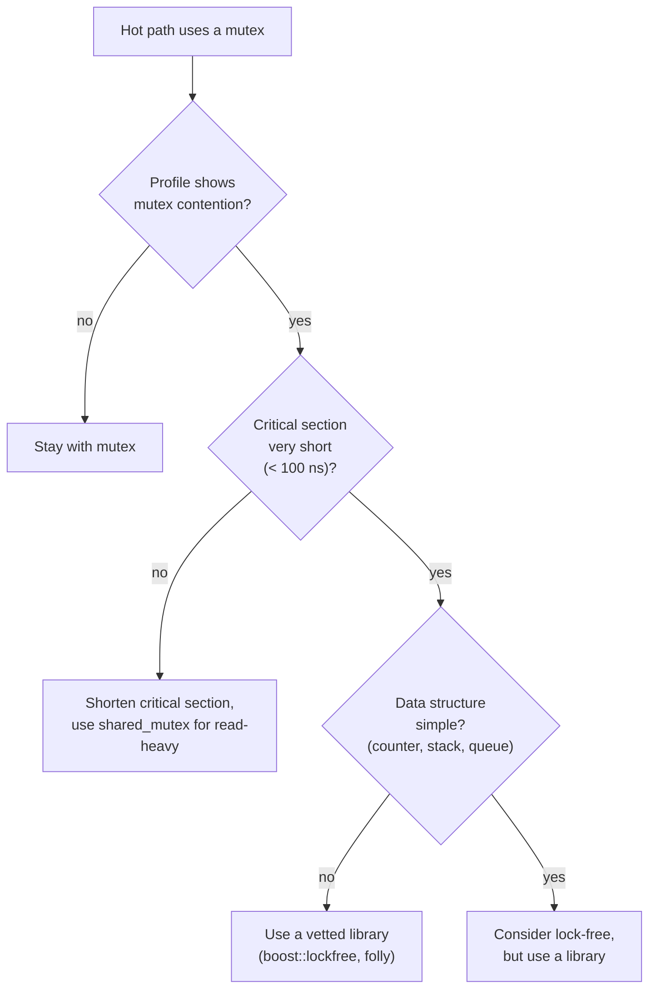

# 8. Lock-Free Programming

> [!note] Why this note exists
> Lock-free programming is the art of writing concurrent data structures that don't use mutexes. It is harder, more error-prone, and *often slower* than mutex-based code — but in specific situations (high contention on small operations, hard-real-time systems where mutexes are forbidden, interrupt handlers) it is the right tool. This note covers CAS loops, the ABA problem, hazard pointers, a lock-free queue, and — most importantly — **when NOT to go lock-free**.

## Why It Matters

A "lock-free" data structure guarantees **system-wide progress**: at least one thread is making progress at any time. Contrast with mutex-based code, where a thread holding the lock can be preempted, blocking all others. Lock-free structures:

- **Cannot deadlock** — there are no locks.
- **No kernel involvement** — pure user-space atomic ops; no context switch on contention.
- **Survive thread termination** — if a thread dies, others still progress. (With a mutex, a thread dying while holding the lock deadlocks everyone.)

But:

- **Harder to write correctly** — memory ordering, ABA, reclamation, all interact.
- **Often slower** in low contention — atomics have hidden costs (cache line bouncing, fences).
- **No fairness** — starvation is possible.
- **Hard to debug** — bugs are non-deterministic and TSan doesn't catch all of them.

> [!warning] Default to mutexes
> A correct mutex-based implementation is almost always preferable to a buggy lock-free one. Only go lock-free when you have *measured* a mutex bottleneck and confirmed lock-free would help.

## Background

### Progress Guarantees

| Property | Definition |
|----------|------------|
| **Blocking** | A thread can prevent all others from progressing (e.g., mutex). |
| **Lock-free** | At least one thread makes progress in a finite number of steps. |
| **Wait-free** | Every thread makes progress in a finite number of its own steps. (Strongest.) |

Most lock-free algorithms use CAS (compare-exchange) loops, which are *lock-free* but not *wait-free*: a thread can keep losing the CAS to other threads indefinitely. Wait-free algorithms exist but are much more complex; reserve them for the rare cases where starvation matters.

### The CAS Primitive

The fundamental lock-free operation. See [[6. Atomics and Memory Ordering]] for the API.

```cpp
template <class T>
bool cas(std::atomic<T>& a, T expected, T desired) {
    return a.compare_exchange_strong(
        expected, desired,
        std::memory_order_acq_rel,
        std::memory_order_relaxed);
}
```

The CAS loop pattern:

```cpp
T cur = a.load();
while (!cas(a, cur, f(cur))) {
    // cas failed; cur was updated to the new value of a; retry
}
```



## Main Content

### A Lock-Free Stack (Treiber Stack)

The simplest non-trivial lock-free data structure. Push and pop are single CAS operations on the head pointer.

```cpp
template <class T>
class LockFreeStack {
    struct Node {
        T value;
        Node* next;
    };
    std::atomic<Node*> head_{nullptr};

public:
    void push(T v) {
        Node* n = new Node{std::move(v), nullptr};
        n->next = head_.load(std::memory_order_relaxed);
        while (!head_.compare_exchange_weak(
                    n->next, n,
                    std::memory_order_release,
                    std::memory_order_relaxed)) {
            // n->next was reloaded; loop
        }
    }

    bool pop(T& out) {
        Node* old = head_.load(std::memory_order_acquire);
        while (old && !head_.compare_exchange_weak(
                    old, old->next,
                    std::memory_order_acquire,
                    std::memory_order_relaxed)) {
            // old was reloaded; loop
        }
        if (!old) return false;
        out = std::move(old->value);
        delete old;     // ← PROBLEM: see "Memory Reclamation" below
        return true;
    }
};
```

This is the **Treiber stack** (1986). It works, but it has two serious problems we'll address:

1. **Memory reclamation** — when can we safely `delete old`? Another thread might still be reading it.
2. **ABA problem** — see below.

### The ABA Problem

Consider `pop`:

1. Thread 1 reads `head = A`.
2. Thread 1 is about to CAS `head` from `A` to `A->next` (say, `B`).
3. Thread 1 is preempted.
4. Thread 2 pops `A`, pops `B`, pushes `A` back. Now `head = A` again, but `A->next` has changed (or `A` has been freed and re-allocated).
5. Thread 1 resumes. CAS sees `head == A` (true!), succeeds, sets `head = B`. But `B` was already popped and possibly freed — `head` now points to garbage.



ABA can happen whenever:

- A node can be freed and re-allocated to the same address.
- A CAS compares only the pointer, not a "version".

#### Solutions to ABA

1. **Tagged pointers** — pack a version counter alongside the pointer (`atomic<uintptr_t>` with low bits = version). Each successful operation increments the version. Requires 16-byte atomics or pointer compression.
2. **Hazard pointers** — readers announce "I'm using this pointer"; reclaimers wait until no one is using it.
3. **Epoch-based reclamation (EBR)** — readers enter/leave epochs; reclaimers free memory only when no thread is in an older epoch.
4. **Never reuse nodes** — allocate each node from a pool that never recycles memory until "safe" (similar to hazard pointers).
5. **DCAS / double-word CAS** — atomic CAS on (pointer, counter) pairs. x86 has `CMPXCHG16B` for 16-byte CAS; portable code can't rely on it.

### Hazard Pointers

Each reader thread owns a small set of "hazard pointers" — atomic pointers to nodes it is currently using. Before reclaiming a node, a writer checks all hazard pointers; if any matches, it defers reclamation.

```cpp
// Per-thread hazard slots
std::atomic<Node*> hazards[MAX_THREADS][MAX_HAZARDS];

Node* acquire_hazard(int slot, std::atomic<Node*>& src) {
    Node* p;
    do {
        p = src.load(std::memory_order_acquire);
        hazards[my_thread_id][slot].store(p, std::memory_order_release);
    } while (p != src.load(std::memory_order_acquire));   // verify
    return p;
}

bool is_hazardous(Node* p) {
    for (int t = 0; t < MAX_THREADS; ++t)
        for (int s = 0; s < MAX_HAZARDS; ++s)
            if (hazards[t][s].load() == p) return true;
    return false;
}

void reclaim(Node* p) {
    if (!is_hazardous(p)) delete p;
    else defer_for_later(p);   // retry on next operation
}
```

The "verify" step is crucial: between the load and the store, another thread might have freed `p` and put it in the hazard slot. We re-load `src`; if it changed, we retry.

Hazard pointers are correct but expensive (one load per hazard slot per reclamation). Modern alternatives:

- **EBR** — much faster in practice; readers do almost nothing (an epoch counter increment per "critical section").
- **Quiescent-state-based reclamation (QSBR)** — readers announce "I'm not in any critical section"; reclaimers wait for all threads to pass a quiescent state.

These are the basis of `std::rcu` (proposed) and are widely used in Linux kernel RCU.

### Epoch-Based Reclamation (EBR)

Each thread has a local epoch number. Readers increment when entering a critical section. Reclaimers collect a node into a "garbage list" tagged with the current global epoch. Periodically the global epoch advances; garbage from epochs older than the minimum of all threads' epochs is safe to free.



EBR is very fast for readers (one atomic store per critical section entry). It's used by Crossbeam (Rust) and Folly (Facebook C++).

### A Lock-Free Queue: Michael-Scott

The classic MPMC (multi-producer, multi-consumer) lock-free queue. The trick: enqueue is a CAS on `tail`, dequeue is a CAS on `head`. A "dummy" node avoids the empty queue special case.

```cpp
template <class T>
class LockFreeQueue {
    struct Node {
        std::atomic<T*> value;
        std::atomic<Node*> next;
        Node() : value(nullptr), next(nullptr) {}
    };
    std::atomic<Node*> head_;
    std::atomic<Node*> tail_;

public:
    LockFreeQueue() {
        Node* dummy = new Node;
        head_.store(dummy);
        tail_.store(dummy);
    }

    void enqueue(T v) {
        Node* node = new Node;
        T* vp = new T(std::move(v));
        node->value.store(vp);
        Node* tail;
        for (;;) {
            tail = tail_.load(std::memory_order_acquire);
            Node* next = tail->next.load(std::memory_order_acquire);
            if (tail == tail_.load(std::memory_order_acquire)) {
                if (next == nullptr) {
                    if (tail->next.compare_exchange_weak(
                            next, node,
                            std::memory_order_release,
                            std::memory_order_relaxed)) {
                        // enqueued; try to advance tail
                        tail_.compare_exchange_strong(
                            tail, node,
                            std::memory_order_release,
                            std::memory_order_relaxed);
                        return;
                    }
                } else {
                    // tail lagged; help advance
                    tail_.compare_exchange_strong(
                        tail, next,
                        std::memory_order_release,
                        std::memory_order_relaxed);
                }
            }
        }
    }

    bool dequeue(T& out) {
        Node* head;
        for (;;) {
            head = head_.load(std::memory_order_acquire);
            Node* tail = tail_.load(std::memory_order_acquire);
            Node* next = head->next.load(std::memory_order_acquire);
            if (head == head_.load(std::memory_order_acquire)) {
                if (head == tail) {
                    if (next == nullptr) return false;   // empty
                    // tail lagged; help advance
                    tail_.compare_exchange_strong(
                        tail, next,
                        std::memory_order_release,
                        std::memory_order_relaxed);
                } else {
                    T* vp = next->value.load(std::memory_order_acquire);
                    if (head_.compare_exchange_weak(
                            head, next,
                            std::memory_order_release,
                            std::memory_order_relaxed)) {
                        out = std::move(*vp);
                        delete vp;
                        // reclaim `head` later (hazard/EBR)
                        return true;
                    }
                }
            }
        }
    }
};
```

Notes:

- The `head == tail == nullptr` case is avoided by always having a dummy node.
- The "help advance tail" step is what makes this lock-free (not wait-free): if one thread is slow, another thread can advance `tail` for it.
- Reclamation is still a problem — `head` (the old dummy) cannot be freed immediately. Use hazard pointers or EBR.

> [!tip] Don't write this from scratch
> Michael-Scott is ~80 lines and the source of countless bugs in production. Use a vetted library:
> - `boost::lockfree::queue`
> - `folly::MPMCQueue`
> - `moodycamel::ConcurrentQueue`

### Memory Ordering for Lock-Free Code

Most lock-free algorithms use `acq_rel` for CAS and `acquire`/`release` for loads/stores. `relaxed` is sometimes safe for "I don't care about other memory" cases (e.g., a counter). `seq_cst` is the default and safest, but expensive on ARM/POWER.

> [!danger] Subtle correctness bugs
> Lock-free algorithms are extremely sensitive to memory ordering. Changing an `acquire` to `relaxed` may pass all tests on x86 and fail on ARM after a week in production. See [[6. Atomics and Memory Ordering]].

### When NOT to Go Lock-Free

- **You haven't measured a mutex bottleneck.** Mutexes are fast in the uncontended case (~25 ns). Going lock-free before profiling is premature optimization.
- **The data structure is complex** (balanced tree, hash map with resize). Lock-free versions are research papers, not engineering. Use a `std::shared_mutex`-protected `std::unordered_map`.
- **You need fairness or priority.** Lock-free algorithms are inherently unfair.
- **Memory reclamation is hard.** Hazard pointers / EBR add complexity. Sometimes a mutex + `unique_ptr` is just better.
- **The team doesn't have lock-free experience.** Code review cannot catch all bugs; the cost of a subtle race is enormous.



## Code Examples

### A lock-free counter (real use of relaxed)

```cpp
class AtomicCounter {
    std::atomic<long long> v_{0};
public:
    void inc() { v_.fetch_add(1, std::memory_order_relaxed); }
    void dec() { v_.fetch_sub(1, std::memory_order_relaxed); }
    long long get() const { return v_.load(std::memory_order_relaxed); }
};
```

`relaxed` is correct here — we don't synchronize anything else on the counter.

### Fetch-and-add pattern for unique IDs

```cpp
std::atomic<int> next_id{0};
int allocate_id() {
    return next_id.fetch_add(1, std::memory_order_relaxed);
}
```

### A bounded spinlock (when you really need one)

```cpp
class Spinlock {
    std::atomic_flag lock_ = ATOMIC_FLAG_INIT;
public:
    void acquire() {
        while (lock_.test_and_set(std::memory_order_acquire)) {
            // hint to CPU: don't waste full pipeline
#if defined(__x86_64__)
            __builtin_ia32_pause();
#elif defined(__aarch64__)
            asm volatile("yield");
#endif
        }
    }
    void release() {
        lock_.clear(std::memory_order_release);
    }
};
```

Use only when you have measured that `std::mutex` is too slow. Spinlocks are usually wrong in user space — see [[6. Atomics and Memory Ordering]].

### Lock-free singly-linked list push (Treiber, recap)

```cpp
void push(T v) {
    Node* n = new Node{std::move(v), nullptr};
    n->next = head_.load(std::memory_order_relaxed);
    while (!head_.compare_exchange_weak(
                n->next, n,
                std::memory_order_release,
                std::memory_order_relaxed)) {}
}
```

## Common Pitfalls

> [!danger] Pitfall 1 — ABA
> CAS compares only the pointer. If the pointer was changed and changed back, CAS succeeds when it shouldn't. Use tagged pointers, hazard pointers, or EBR.

> [!danger] Pitfall 2 — Use-after-free
> Popping a node and immediately `delete`-ing it while another thread still holds a pointer to it. Always use a reclamation scheme (hazard / EBR).

> [!danger] Pitfall 3 — Wrong memory ordering
> `relaxed` where you need `acquire`/`release`. Passes on x86, fails on ARM. See [[6. Atomics and Memory Ordering]].

> [!danger] Pitfall 4 — CAS loop without re-loading
> `while (!cas(a, cur, f(cur))) {}` — but `cas` updates `cur` on failure, so this works. If you use a manual version, you must reload `cur` from `a` on failure.

> [!danger] Pitfall 5 — Assuming `compare_exchange_weak` is always correct in a loop
> It is, but only if you re-check the loaded value. The standard guarantees that on failure, `expected` is updated with the current value. Don't ignore it.

> [!danger] Pitfall 6 — Memory ordering too strong
> Using `seq_cst` everywhere on ARM can be 5–10× slower than necessary. Profile.

> [!danger] Pitfall 7 — Reclamation in destructors
> When the queue/stack is destroyed, retired nodes in the garbage list may still be referenced. Drain the garbage list at thread-exit or use a quiescent state.

> [!danger] Pitfall 8 — False sharing
> Two atomics on the same cache line cause coherence thrashing. `alignas(64)` per hot atomic.

## Tips and Tricks

- **Default to mutexes.** Use lock-free only with measured evidence.
- **Use a vetted library** (`boost::lockfree`, `folly`, `moodycamel`). Don't roll your own MPMC queue.
- **Hazard pointers / EBR** are mandatory for any non-trivial lock-free structure with reclamation.
- **Tagged pointers** solve ABA at the cost of pointer compression (or 16-byte atomics).
- **`alignas(64)`** per hot atomic to avoid false sharing.
- **`compare_exchange_weak` in loops** — it's slightly cheaper than `strong` on ARM/POWER.
- **Use `relaxed`** for counters, `acquire/release` for synchronization, `seq_cst` only when you need a global order.
- **Always run TSan** (see [[15. Debugging and Profiling/4. Sanitizers (ASan, UBSan, TSan)]]) — it simulates weak memory models and catches some (not all) lock-free bugs.
- **Test on ARM** if you can — x86 masks many bugs. A Raspberry Pi or an AWS Graviton instance is cheap.
- **Stress test with millions of iterations** under varying core counts. Bugs appear at high contention.
- **Read the original papers**: Treiber 1986 (stack), Michael-Scott 1996 (queue), Herlihy & Shavit's textbook "The Art of Multiprocessor Programming".
- **Prefer wait-free over lock-free** for hard real-time, where starvation = deadline missed.

## Active Recall

1. What is the difference between lock-free and wait-free?
2. Describe the ABA problem. Give a concrete scenario in a stack.
3. Name three solutions to ABA.
4. What are hazard pointers? How do they prevent use-after-free in lock-free code?
5. What is epoch-based reclamation (EBR)? Why is it faster than hazard pointers?
6. Why does the Michael-Scott queue have a "dummy" node?
7. Why is `compare_exchange_weak` preferred in CAS loops?
8. When should you NOT go lock-free?
9. Why might a lock-free data structure be slower than a mutex-protected one?
10. What memory ordering is appropriate for a lock-free counter that doesn't synchronize anything else?

## Next Steps

- Read [[6. Atomics and Memory Ordering]] — the foundation.
- Read [[14. Concurrency and Multithreading/3. Mutexes and Locks]] — the alternative you should usually pick.
- Read [[14. Concurrency and Multithreading/7. Thread Pools]] — pools use mutexes or simple atomics, not lock-free queues, in most production code.
- Cross-reference [[15. Debugging and Profiling/4. Sanitizers (ASan, UBSan, TSan)]] — TSan catches many lock-free bugs.
- Cross-reference [[15. Debugging and Profiling/5. perf and Flamegraphs]] — measure before optimizing.
- Read Herlihy & Shavit, "The Art of Multiprocessor Programming" — the canonical textbook.
