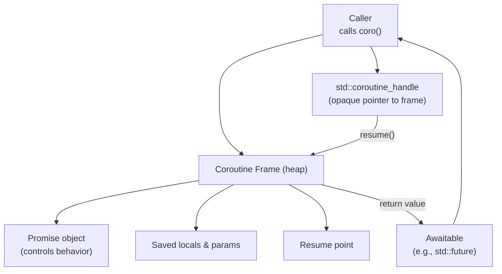
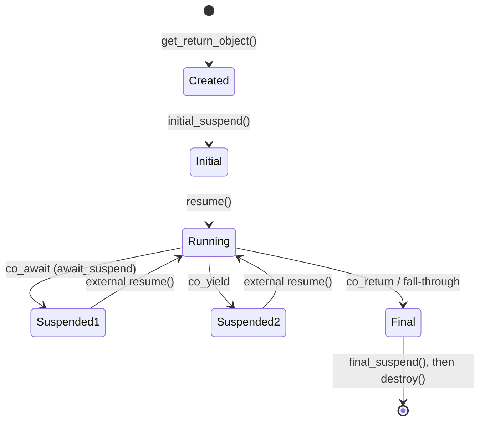

# 9. Coroutines (C++20)

> [!note] Why this note exists
> C++20 introduced **stackless coroutines** — functions that can suspend and resume without losing their local state. They make asynchronous I/O code look sequential instead of a tangle of callbacks. They are also one of the most misunderstood features in modern C++, because the standard provides only the *machinery* — the *library* (ready-to-use types) is left to third parties. This note covers the mental model, the keywords, the promise type, a generator example, and the libraries you should reach for.

## Why It Matters

Pre-coroutines, asynchronous C++ had two styles, both painful:

1. **Callback style** — pass a lambda to be invoked when the operation finishes. Composing two async steps means nesting two lambdas. Composing ten means pyramid-shaped code ("callback hell").
2. **Future style** — chain `.then()` calls. Better than callbacks, but each `.then()` allocates a future and may block a worker thread waiting for its dependency.

Coroutines solve both:

- **Sequential-looking code** — write `co_await read(socket);` and the function suspends until the read completes, then resumes with the result. No callbacks, no nesting.
- **No thread blocking** — a suspended coroutine frees its thread to do other work. The thread pool can serve thousands of concurrent coroutines with N cores.
- **No allocation per step** — the compiler transforms the coroutine into a state machine; suspension is just a saved-IP-and-registers operation.

The cost: a new mental model (the "promise type"), new keywords (`co_await`, `co_yield`, `co_return`), and the lack of a standard library of awaitables. You need a third-party library (cppcoro, coro, Boost.Asio's C++20 support) for real work today.

## Background

### Stackful vs Stackless

| Property | Stackful | Stackless (C++20) |
|----------|----------|-------------------|
| Each coroutine has its own stack | Yes (typically 64 KB–1 MB) | No — only a small frame |
| Can suspend from any frame in the call chain | Yes | No — only from the coroutine itself |
| Implementation | User-space threads, fibers (Boost.Fiber, POSIX ucontext) | Compiler transformation to a state machine |
| Allocation | One stack per coroutine | One frame per coroutine (often elided) |
| Cost to suspend | Context switch (~µs) | Save pointer + registers (~ns) |

C++20 chose stackless for two reasons:

1. **Efficiency** — no per-coroutine stack, no context switch.
2. **Zero-overhead principle** — C++ won't pay for what it doesn't use; a suspended coroutine should be as cheap as a struct on the heap.

The cost: you cannot suspend a coroutine from inside a regular function it calls. The suspension must be in the coroutine body itself (or in another coroutine it `co_await`s).

### The Three Keywords

| Keyword | Meaning |
|---------|---------|
| `co_await expr` | Suspend until the awaitable `expr` is ready; resume with its value. |
| `co_yield expr` | Suspend, producing a value to the caller (generator pattern). |
| `co_return expr` | End the coroutine, producing the final value. |

A function is a coroutine if its body contains any one of these. Once it does, its return type and behavior are constrained by the **promise type**.

### The Promise Type and the Coroutine Frame

When the compiler sees a coroutine, it synthesizes:

1. A **coroutine frame** on the heap (usually) holding: parameters, locals, the suspend/resume points, and a promise object.
2. A **state machine** that, at each suspension point, saves its state and returns; at each resume, jumps to the right point.

The **promise type** is determined by the return type of the coroutine. For `std::future<T>` it's `std::promise<T>`; for a generator it's whatever the generator's `promise_type` is.



### The `promise_type` Interface

The promise type must provide these methods (a subset; library-specific):

| Method | Called by the compiler to... |
|--------|------------------------------|
| `get_return_object()` | Construct the value returned to the caller (the future / generator). |
| `initial_suspend()` | Decide whether to suspend at start. Returns an awaitable. |
| `final_suspend()` noexcept` | Decide whether to suspend at end (needed before destruction). |
| `return_value(v)` / `return_void()` | Handle `co_return v;` or `co_return;`. |
| `yield_value(v)` | Handle `co_yield v;`. Returns an awaitable. |
| `unhandled_exception()` | Handle an exception escaping the coroutine body. |

The compiler calls these at specific points. The promise type is the **library author's** concern; most users just use the coroutines a library provides.

## Main Content

### A Generator

The simplest useful coroutine: a function that produces a stream of values.

```cpp
#include <coroutine>
#include <iostream>

template <class T>
struct Generator {
    struct promise_type {
        T current;
        Generator get_return_object() {
            return Generator{std::coroutine_handle<promise_type>::from_promise(*this)};
        }
        std::suspend_always initial_suspend() { return {}; }
        std::suspend_always final_suspend() noexcept { return {}; }
        std::suspend_always yield_value(T v) { current = v; return {}; }
        void return_void() {}
        void unhandled_exception() { std::terminate(); }
    };

    using handle_type = std::coroutine_handle<promise_type>;
    handle_type h_;
    Generator(handle_type h) : h_(h) {}
    ~Generator() { if (h_) h_.destroy(); }
    Generator(const Generator&) = delete;
    Generator& operator=(const Generator&) = delete;
    Generator(Generator&& other) noexcept : h_(other.h_) { other.h_ = nullptr; }

    struct iterator {
        handle_type h;
        iterator& operator++() { h.resume(); return *this; }
        T& operator*() { return h.promise().current; }
        bool operator!=(iterator other) const {
            return !other.h.done() || !h.done();
        }
    };
    iterator begin() { h_.resume(); return {h_}; }
    iterator end()   { return {h_}; }
};

Generator<int> naturals(int from = 0) {
    while (true) {
        co_yield from++;
    }
}

int main() {
    for (int x : naturals()) {
        if (x > 5) break;
        std::cout << x << ' ';
    }
    std::cout << '\n';
    // Output: 0 1 2 3 4 5
}
```

What's happening:

1. `naturals()` returns a `Generator<int>`. The compiler builds a coroutine frame with a `promise_type`.
2. `initial_suspend()` returns `suspend_always` — the coroutine doesn't start running until `begin()` resumes it.
3. Each `co_yield from++` calls `yield_value`, stores the value, and suspends.
4. `operator++` on the iterator resumes the coroutine.
5. When the iterator is destroyed, the generator's destructor calls `h_.destroy()` to free the frame.

### `co_await`

`co_await expr` is the **suspend-until-ready** operation. `expr` must be an **awaitable** — a type with three methods (or matching protocol):

| Method | Purpose |
|--------|---------|
| `await_ready()` | Returns `true` if no need to suspend (e.g., result already available). |
| `await_suspend(handle)` | Suspend; arrange for `handle.resume()` to be called later. May also resume immediately, or transfer to another coroutine. |
| `await_resume()` | Return the value to the coroutine (the result of `co_await`). |

```cpp
struct AlwaysReady {
    bool await_ready() { return true; }
    void await_suspend(std::coroutine_handle<>) {}
    int  await_resume() { return 42; }
};

int main() {
    auto coro = []() -> AlwaysReady {
        int x = co_await AlwaysReady{};
        std::cout << x << '\n';   // 42
        return;   // wait — this is not a coroutine unless it returns a coroutine type
    };
}
```

(That snippet is illustrative — a real coroutine returns a coroutine-return-type, not the awaitable directly. See the cppcoro / coro libraries for ready-made awaitables.)

### `co_return`

Ends the coroutine and provides its final value.

```cpp
Generator<int> just_one() {
    co_yield 1;
    co_return;          // optional; reaching the end is implicit
}

std::future<int> compute() {
    co_return 42;       // calls promise.return_value(42)
}
```

### The Coroutine State Machine

The compiler transforms a coroutine into an explicit state machine. Conceptually:



Each suspend point is a `goto` label; each `resume()` jumps to the right label. The frame stores all live variables across the suspend.

### Async I/O with Coroutines

The classic win: asynchronous network I/O that looks synchronous.

```cpp
// Conceptual — uses a hypothetical "socket.await_read(n)" awaitable
Task<std::string> read_line(Socket& s) {
    std::string line;
    while (true) {
        char c = co_await s.read(1);   // suspends until 1 byte arrives
        if (c == '\n') break;
        line += c;
    }
    co_return line;
}

Task<void> server(Socket s) {
    while (true) {
        auto line = co_await read_line(s);
        if (line.empty()) break;
        co_await s.write(process(line));
    }
}
```

If `read` and `write` are awaitables that suspend until the OS signals readiness, then a single worker thread can run thousands of `server` coroutines concurrently. This is the model of Boost.Asio's C++20 support, and of C++ frameworks like `cppcoro::io_service`.

### `std::future` as a Coroutine Return Type (C++23)

C++23 added `std::future` and `std::coroutine_handle` integration so `std::future<T>` is a valid coroutine return type:

```cpp
#include <future>
std::future<int> compute() {
    co_return 42;
}
```

This makes the boundary between futures and coroutines seamless. You can `co_await` a future inside a coroutine and return a future from it.

### Libraries

The C++20 standard provides the **machinery** (the keywords, `coroutine_handle`, `suspend_always`, `suspend_never`) but **no ready-to-use awaitables** beyond those. For real work, use a library:

- **cppcoro** (Lewis Baker) — the canonical reference library. `cppcoro::task<T>`, `cppcoro::generator<T>`, `cppcoro::async_generator<T>`, `cppcoro::io_service`. Hasn't seen recent updates but is conceptually clean.
- **coro** (Gavin Lowe / Jbcoe) — modern alternative; similar API.
- **Boost.Asio** — `co_spawn`, awaitable sockets, awaitable timers. Most production-ready for I/O.
- **folly** — Facebook's library; `folly::coro::Task`, integrated with their I/O stack.
- **libunifex / std::execution** — the proposed C++26 senders/receivers framework, which subsumes much of what coroutines do for structured concurrency.

For a generator, the ~30-line `Generator<T>` above is often enough — no library needed.

### Coroutines vs Threads vs Futures

| Use case | Tool |
|----------|------|
| Long-running CPU work | `std::thread` / `std::jthread` / thread pool |
| One-shot parallel compute with a return value | `std::async` |
| Many concurrent I/O operations | Coroutines (on an I/O event loop) |
| Pipeline / DAG of dependent async operations | Coroutines (`co_await` chains) |
| Producer-consumer with backpressure | Coroutines (`async_generator`) |

Coroutines shine when you have **many** (1000s) of **mostly-waiting** operations and a **fixed** pool of worker threads. They don't help for CPU-bound parallelism — use a pool for that.

## Code Examples

### Generator: Fibonacci

```cpp
Generator<long long> fib() {
    long long a = 0, b = 1;
    while (true) {
        co_yield a;
        auto next = a + b;
        a = b;
        b = next;
    }
}

int main() {
    int n = 0;
    for (long long x : fib()) {
        if (n++ >= 10) break;
        std::cout << x << ' ';
    }
    // Output: 0 1 1 2 3 5 8 13 21 34
}
```

### Generator: filtering

```cpp
Generator<int> evens(Generator<int> src) {
    for (int x : src) {
        if (x % 2 == 0) co_yield x;
    }
}

int main() {
    auto e = evens(naturals(1));
    for (int x : e) {
        if (x > 10) break;
        std::cout << x << ' ';
    }
    // Output: 2 4 6 8 10
}
```

### Custom awaitable: a one-shot event

```cpp
#include <coroutine>
#include <optional>

struct Event {
    std::coroutine_handle<> waiter;
    bool fired = false;

    struct awaiter {
        Event& e;
        bool await_ready() { return e.fired; }
        void await_suspend(std::coroutine_handle<> h) { e.waiter = h; }
        void await_resume() {}
    };
    awaiter operator co_await() { return awaiter{*this}; }

    void fire() {
        fired = true;
        if (waiter) waiter.resume();
    }
};
```

A coroutine can `co_await my_event;` and will resume when someone calls `my_event.fire()`.

### Recursive generator (asymmetric)

```cpp
Generator<int> walk(Tree* t) {
    if (!t) co_return;
    co_yield t->value;
    // C++20 doesn't have built-in "yield from" — manually iterate:
    for (int v : walk(t->left))  co_yield v;
    for (int v : walk(t->right)) co_yield v;
}
```

Each `co_yield v` re-yields from the inner generator. This works but is slower than a true "yield-from" (which C++ does not have). cppcoro's `recursive_generator` is faster.

## Common Pitfalls

> [!danger] Pitfall 1 — Returning a coroutine handle to a destroyed frame
> If you store a `coroutine_handle` and use it after the frame is destroyed, you get UB. Always pair the handle with a RAII wrapper that calls `destroy()`.

> [!danger] Pitfall 2 — Forgetting `final_suspend() noexcept`
> The final suspend must be `noexcept` and must suspend (not return `suspend_never`) if the coroutine's promise is to be safely observed after completion. Getting this wrong causes crashes.

> [!danger] Pitfall 3 — Awaiting a moved-from awaitable
> Once you `co_await` an awaitable, it's typically consumed. Awaiting again is UB.

> [!danger] Pitfall 4 — Heap allocation of the coroutine frame
> The compiler may elide the heap allocation if it can prove the lifetime is bounded — but it doesn't always. For high-throughput code, customize the `operator new` of the promise type, or use a pool allocator.

> [!danger] Pitfall 5 — Suspend-and-never-resume leaks
> If a coroutine suspends and is never resumed or destroyed, the frame leaks. RAII handles fix this; raw handles do not.

> [!danger] Pitfall 6 — Treating coroutines as threads
> A coroutine does not run on its own thread. It runs on whatever thread calls `resume()`. If you await something that never calls `resume()`, your coroutine hangs forever.

> [!danger] Pitfall 7 — Mixing `co_return` with regular `return`
> A coroutine cannot use a plain `return` with a value; it must use `co_return`. (A plain `return;` is allowed for `return_void`.)

> [!danger] Pitfall 8 — Not understanding `await_suspend`'s return type
> `await_suspend` can return `void` (suspend, caller resumes later), `bool` (true = suspend, false = resume immediately), or another `coroutine_handle` (transfer to that coroutine). Getting this wrong causes subtle scheduling bugs.

## Tips and Tricks

- **Start with a library** (`cppcoro`, `coro`, Boost.Asio) — don't write your own `promise_type` until you understand them.
- **Generators are the easy win** — ~30 lines of `Generator<T>` replaces `iterator` boilerplate and is more readable.
- **Use `co_await` for I/O**, not for CPU-bound work — a suspended coroutine doesn't free a thread, but `co_await` on a CPU task wouldn't either; just use a pool.
- **Pair every `coroutine_handle` with RAII** — `unique_handle` that calls `destroy()` in its destructor.
- **Customize `operator new`** for the promise if you're in a hot path; the default heap allocation may dominate.
- **`final_suspend()` should suspend** — this lets the caller observe the result via the promise before destruction.
- **Use `std::suspend_never` for `initial_suspend`** if you want the coroutine to start immediately (rare).
- **Coroutines compose** — `co_await` another coroutine's task to chain them. No callbacks.
- **C++23's `std::future` integration** makes futures and coroutines interoperate cleanly.
- **Watch for the proposed C++26 `std::execution`** — it may become the recommended way to express structured concurrency, replacing much of what coroutines are used for today.
- **Profile** — coroutine frame allocation and resume cost are not zero. If you're not getting better throughput than the thread-pool version, you may be holding it wrong.

## Active Recall

1. What is the difference between a stackful and a stackless coroutine? Which one does C++20 provide?
2. Name the three coroutine keywords and what each does.
3. What is a "promise type"? How does the compiler find it for a given coroutine?
4. Write the four required methods of a `promise_type` for a generator.
5. What is an "awaitable"? Name its three required methods.
6. Why must `final_suspend()` be `noexcept` and (usually) return `suspend_always`?
7. Why don't coroutines need a per-coroutine stack?
8. Can a coroutine run on multiple threads? What determines which thread `resume()` runs on?
9. Why is `std::future<T>` a useful coroutine return type (C++23)?
10. Name two libraries that provide ready-to-use awaitables / task types.

## Next Steps

- Read [[14. Concurrency and Multithreading/5. Futures, Promises, Async]] — futures integrate with coroutines in C++23.
- Read [[14. Concurrency and Multithreading/7. Thread Pools]] — coroutines run on pool worker threads.
- Read [[14. Concurrency and Multithreading/2. std thread and std jthread]] — for the contrast with OS threads.
- Cross-reference [[8. Modern C++/6. Lambdas Deep Dive]] — lambdas and coroutines share the "function with state" idea.
- Read the CppCoro README and Lewis Baker's coroutine blog posts for the canonical reference.
- Read the Boost.Asio C++20 coroutine documentation for production I/O patterns.
- Keep an eye on the C++26 `std::execution` proposal (P2300) — it will likely reshape this space.
