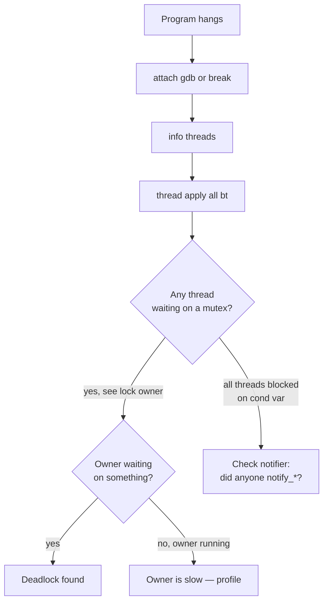
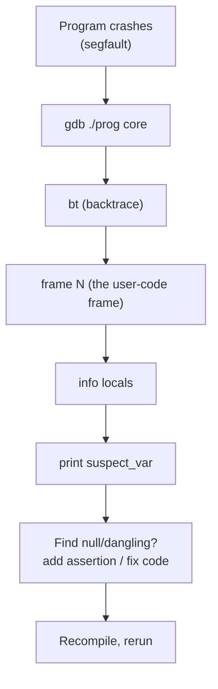

# 1. GDB

> [!note] Why this note exists
> The GNU Debugger (GDB) is the canonical source-level debugger for C and C++ on POSIX systems. When your program crashes, hangs, or produces wrong output, GDB is the first tool you reach for. This note covers the essential commands, multi-threaded debugging, pretty-printing STL containers, conditional breakpoints, watchpoints, and reverse debugging. After reading this, you should be able to walk into any debugging session with confidence.

## Why It Matters

Without a debugger you debug with `printf` — slow, indirect, and useless for memory corruption. With GDB you can:

- **Pause** a running program at any line and inspect every variable.
- **Walk the call stack** to see how you got to the current line.
- **Inspect memory** at any address, dereference pointers, view arrays.
- **Catch crashes** (segfaults, throws) and inspect the state at the moment of failure.
- **Debug multi-threaded** programs: switch between threads, see what each is doing.
- **Replay** a recording backward to find when a variable was first corrupted.

GDB is the lingua franca of C++ debugging on Linux. Most IDEs (CLion, VS Code with the C++ extension, Eclipse CDT) are GUIs over GDB or LLDB. Knowing the underlying commands is irreplaceable when the GUI doesn't show what you need.

## Background

### What GDB Does

GDB runs your program as a child process under `ptrace` (on Linux). It can:

- Read and write the child's memory.
- Read the child's registers (including the program counter).
- Intercept signals (SIGSEGV, SIGTRAP).
- Set breakpoints by patching the code with an `INT3` instruction.
- Single-step the child instruction-by-instruction or line-by-line.

It reads DWARF debug info (produced by `-g`) to map machine addresses to source lines, variable locations, and types.

### Compilation with `-g`

```bash
g++ -g -O0 -Wall main.cpp -o main
```

- `-g` — emit DWARF debug info. Without it, GDB sees only raw addresses.
- `-O0` — disable optimization. Optimized code reorders, inlines, and eliminates variables — GDB cannot show you what doesn't exist. Always debug unoptimized builds if possible.
- `-Og` (GCC) — "debug-friendly" optimization; better than `-O0` for performance-sensitive code while keeping debuggability.

If you must debug an optimized build (`-O2`), expect:

- Variables to be "optimized out".
- Lines to execute out of order.
- Function calls to be inlined (no separate stack frame).
- The instruction pointer to jump around in surprising ways.

### The Three Modes of Using GDB

1. **Run a fresh program**: `gdb ./myprog` then `run [args]`.
2. **Attach to a running process**: `gdb -p <pid>`.
3. **Inspect a core dump**: `gdb ./myprog core` (after a crash).

## Main Content

### Starting GDB

```bash
$ gdb ./myprog
(gdb) run arg1 arg2
```

Or, with arguments pre-set:

```bash
$ gdb --args ./myprog arg1 arg2
(gdb) run
```

To attach to a running process (you may need elevated permissions):

```bash
$ gdb -p $(pidof myprog)
```

To load a core dump (after enabling core dumps with `ulimit -c unlimited`):

```bash
$ gdb ./myprog core
```

### Essential Commands

| Command (abbrev) | Effect |
|------------------|--------|
| `run` (`r`) | Start the program from the beginning. |
| `continue` (`c`) | Continue execution until next breakpoint or signal. |
| `next` (`n`) | Step **over** function calls (next line in same function). |
| `step` (`s`) | Step **into** function calls. |
| `finish` (`fin`) | Run until the current function returns. |
| `until` (`u`) | Run until a line *after* the current one (useful for escaping loops). |
| `break` (`b`) LOC | Set a breakpoint at a line, function, or address. |
| `tbreak` LOC | Set a temporary (one-shot) breakpoint. |
| `delete` (`d`) N | Delete breakpoint N (or all if no arg). |
| `disable` / `enable` N | Disable/enable a breakpoint without deleting it. |
| `print` (`p`) EXPR | Evaluate EXPR in the current context and print it. |
| `info locals` | Show all local variables. |
| `info args` | Show function arguments. |
| `backtrace` (`bt`) | Show the call stack. |
| `frame` (`f`) N | Switch to stack frame N. |
| `up` / `down` | Move one frame up/down the stack. |
| `list` (`l`) | Show source around the current line. |
| `display` EXPR | Print EXPR every time the program stops. |
| `quit` (`q`) | Exit GDB. |

### Breakpoints

```gdb
(gdb) break main                    # function name
(gdb) break main.cpp:42             # file:line
(gdb) break MyClass::method         # method (with overload resolution if needed)
(gdb) break MyClass::method(int)    # specific overload
(gdb) break 0x401234                # raw address
(gdb) break +5                      # 5 lines ahead of current
```

List breakpoints:

```gdb
(gdb) info break
Num     Type           Disp Enb Address    What
1       breakpoint     keep y   0x00401234 in main at main.cpp:42
2       breakpoint     keep y   0x00405678 in MyClass::method(int) at myclass.cpp:17
```

### Conditional Breakpoints

Stop only when a condition is true:

```gdb
(gdb) break main.cpp:42 if i == 1000
(gdb) condition 1 i == 2000         # change condition on bp #1
(gdb) condition 1                   # remove condition from bp #1
```

Incredibly useful when a bug appears only on the 1000th iteration. Without conditional breakpoints you'd `print i` and `continue` a thousand times.

### Watchpoints

Stop when a memory location changes:

```gdb
(gdb) watch counter                 # stop when `counter` is written
(gdb) rwatch counter                # stop when `counter` is read
(gdb) awatch counter                # stop on read or write
(gdb) watch *(int*)0x7fffffffdf3c   # raw memory address
```

Watchpoints are slow (GDB single-steps and checks after each instruction) but invaluable for finding memory corruption: "who is writing garbage into this variable?".

### Inspecting Data

```gdb
(gdb) print x
$1 = 42
(gdb) print/x x                     # hexadecimal
$2 = 0x2a
(gdb) print arr                     # whole array (if size is known)
$3 = {1, 2, 3, 4, 5}
(gdb) print arr@5                   # first 5 elements (for pointers)
$4 = {1, 2, 3, 4, 5}
(gdb) print *ptr@10                 # 10 elements starting at *ptr
(gdb) print sizeof(MyStruct)        # compile-time sizeof
(gdb) print mymap                   # STL map — needs pretty-printer (see below)
(gdb) info locals
(gdb) info args
(gdb) display x                     # auto-print at every stop
(gdb) display/x *ptr@10
```

### The Call Stack

```gdb
(gdb) backtrace
#0  compute (x=42) at compute.cpp:17
#1  0x00401234 in main (argc=1, argv=0x7fffffffdf98) at main.cpp:42
#2  0x007890ab in __libc_start_main () from /lib/libc.so.6
#3  0x00401101 in _start ()
```

Switch frames:

```gdb
(gdb) frame 1                       # go to main's frame
(gdb) info locals                   # now we see main's locals
(gdb) up                            # move toward outer frames
(gdb) down                          # move toward inner frames
```

### Multi-Threaded Debugging

```gdb
(gdb) info threads
  Id   Target Id          Frame
* 1    Thread 0x7f... "myprog"  compute (x=42) at compute.cpp:17
  2    Thread 0x7f... "myprog"  pthread_cond_wait (...) at ...
  3    Thread 0x7f... "myprog"  worker (arg=0x...) at worker.cpp:25
```

The `*` marks the current thread. Switch with `thread N`:

```gdb
(gdb) thread 2
[Switching to thread 2]
(gdb) bt                             # backtrace of thread 2
(gdb) thread apply all bt            # backtrace of ALL threads — invaluable
(gdb) thread apply all print x       # print x in every thread
```

`thread apply all bt` is the single most useful command for diagnosing deadlocks — you see what every thread is waiting for at once.



### Pretty Printers for STL

By default, GDB shows raw internal layout of `std::vector`, `std::map`, etc. — useless. Install the GCC STL pretty-printers:

```gdb
# in ~/.gdbinit
python
import sys
sys.path.insert(0, '/usr/share/gcc-12/python')
from libstdcxx.v6.printers import register_libstdcxx_printers
register_libstdcxx_printers(None)
end
```

After this:

```gdb
(gdb) print v
$1 = std::vector of length 5, capacity 8 = {1, 2, 3, 4, 5}
(gdb) print m
$2 = std::map with 3 elements = {
  ["a"] = 1,
  ["b"] = 2,
  ["c"] = 3
}
```

Many distros ship this configured by default. If `print v` shows a `_M_impl` tree, install the pretty-printer.

### The `.gdbinit` File

GDB reads `~/.gdbinit` on startup. Useful content:

```gdb
set print pretty on
set print object on
set print static-members on
set print elements 200
set pagination off
set history save on
set history size 10000

# Skip STL internals when stepping
skip -gfi /usr/include/c++/*/*
skip -gfi /usr/include/*/bits/*

# Catch C++ exceptions
catch throw
catch catch

# Auto-load STL pretty printers
python
import sys
sys.path.insert(0, '/usr/share/gcc-12/python')
from libstdcxx.v6.printers import register_libstdcxx_printers
register_libstdcxx_printers(None)
end
```

### Catching Exceptions

```gdb
(gdb) catch throw             # break when any exception is thrown
(gdb) catch throw std::runtime_error   # break only on this type
(gdb) catch catch            # break when an exception is caught
(gdb) catch rethrow          # break on rethrow
```

Invaluable when an exception is propagating and you don't know where it was thrown.

### Catching Signals

By default GDB stops on `SIGSEGV`, `SIGABRT`, etc. You can change this:

```gdb
(gdb) handle SIGUSR1 stop        # stop on USR1
(gdb) handle SIGUSR2 nostop      # don't stop
(gdb) handle SIGPIPE nostop print    # log but continue
```

### Reverse Debugging

GDB can **record** execution and **play it backward**. This is invaluable for "the bug already happened, where?" problems.

```gdb
(gdb) break main
(gdb) run
(gdb) record                     # start recording
(gdb) continue                   # run forward
... program crashes ...
(gdb) reverse-step               # step backward
(gdb) reverse-continue           # run backward until previous breakpoint
(gdb) reverse-finish             # run backward to caller
(gdb) checkpoint                 # save state
```

> [!warning] Performance
> Recording is slow (10–100×) and memory-intensive. Use it for short repro scenarios only. For long-running programs, set a checkpoint before the suspicious area, then record from there.

### Debugging at a Crash — The Standard Workflow



## Code Examples

### A crash to debug

```cpp
// crash.cpp
#include <vector>
int main() {
    std::vector<int> v;
    for (int i = 0; i < 1000000; ++i) v.push_back(i);
    int x = v[2000000];          // out of bounds — UB
    return x;
}
```

```bash
$ g++ -g -O0 crash.cpp -o crash
$ gdb ./crash
(gdb) run
Program received signal SIGSEGV, Segmentation fault.
0x0000000000401136 in main () at crash.cpp:5
5           int x = v[2000000];
(gdb) print v.size()
$1 = 1000000
(gdb) print v[2000000]
Cannot access memory at address 0x...
```

(GCC's `_GLIBCXX_DEBUG` macro or `-fsanitize=address` would catch this before the segfault — see [[4. Sanitizers (ASan, UBSan, TSan)]].)

### A deadlock to debug

```cpp
// deadlock.cpp
#include <mutex>
#include <thread>
std::mutex a, b;
void f1() { std::lock_guard<std::mutex> la(a); std::lock_guard<std::mutex> lb(b); }
void f2() { std::lock_guard<std::mutex> lb(b); std::lock_guard<std::mutex> la(a); }
int main() {
    std::thread t1(f1), t2(f2);
    t1.join(); t2.join();
}
```

```bash
$ gdb ./deadlock
(gdb) run
^C                       # interrupt the hung program
(gdb) thread apply all bt

Thread 2:
#0  __lll_lock_wait () ...
#1  __GI___pthread_mutex_lock ...
#2  __gthread_mutex_lock ...
#3  std::lock_guard::lock_guard (this=..., m=...) at /usr/include/c++/12/mutex:...
#4  f2 () at deadlock.cpp:5
...

Thread 1:
#0  __lll_lock_wait () ...
#1  ...
#2  f1 () at deadlock.cpp:4
...
```

You can see: Thread 1 is in `f1` waiting on a mutex; Thread 2 is in `f2` waiting on a mutex. Cross-reference and you find the lock-order inversion.

### Conditional breakpoint on a loop

```gdb
(gdb) break process.cpp:42 if i == 1000000 && items[i].id == 0xbad
```

### Watching a global variable

```gdb
(gdb) watch g_state
Hardware watchpoint 1: g_state
(gdb) continue
Hardware watchpoint 1: g_state
Old value = 0
New value = 42
0x0000000000401234 in update_state (s=42) at state.cpp:17
17          g_state = s;
```

## Common Pitfalls

> [!danger] Pitfall 1 — Debugging optimized code
> With `-O2`, GDB shows "value optimized out", lines jump around, frames are missing. Always use `-O0` or `-Og` for debugging builds.

> [!danger] Pitfall 2 — No `-g`
> Without debug info, GDB can only show addresses, not source. Always compile with `-g`.

> [!danger] Pitfall 3 — Wrong binary
> If you recompile but don't reload in GDB, breakpoints may be wrong. Use `run` after recompiling; GDB warns "Source file is more recent than executable".

> [!danger] Pitfall 4 — `next` over the buggy line
> If the bug is in a called function, `next` skips it. Use `step` to dive in. Or `finish` to run to the end of the current function.

> [!danger] Pitfall 5 — Stepping into STL
> `step` into `std::vector::push_back` is rarely useful. Configure `skip -gfi /usr/include/c++/*/*` or just use `next` when on an STL call.

> [!danger] Pitfall 6 — Forgetting `info threads` for hangs
> A "hang" is almost always a deadlock or an infinite loop. `thread apply all bt` reveals which.

> [!danger] Pitfall 7 — Watching stack variables
> Watchpoints on stack variables are lost when the variable goes out of scope. Watch global/static variables instead, or set the watchpoint each time the function is entered.

> [!danger] Pitfall 8 — Ignoring the "first" SIGSEGV
> Some programs intentionally dereference null in signal handlers. Use `handle SIGSEGV nostop` if you know that's the case.

## Tips and Tricks

- **Compile with `-g -O0`** for debugging builds. Use a separate build dir.
- **Use `-ggdb3`** instead of `-g` for maximal debug info (including macros).
- **Enable core dumps** in your shell: `ulimit -c unlimited` (or `ulimit -c unlimited` in systemd unit files via `LimitCORE=infinity`).
- **Keep a `~/.gdbinit`** with pretty-printers and `skip` rules configured.
- **`tui enable`** for a curses-based source view inside GDB.
- **`layout split`** shows both source and assembly.
- **`disassemble`** to see the assembly of the current function.
- **`info sharedlibrary`** to see loaded shared libraries.
- **`catch throw`** to break on any C++ exception.
- **`thread apply all bt`** is the magic command for hangs.
- **`set scheduler-locking step`** to freeze other threads while stepping in one.
- **`set follow-fork-mode child`** to debug the child after `fork()`.
- **`set detach-on-fork off`** to debug both parent and child.
- **Use `gdb -tui`** or **`gdbgui`** for a more visual experience.
- **Combine with `coredumpctl`** (systemd) for easy core-dump management: `coredumpctl debug`.
- **For long-running servers**: attach with `gdb -p <pid>` instead of running under GDB.
- **`script`** a debugging session: `gdb -batch -ex "break main" -ex "run" -ex "bt" ./prog` for repeatable diagnostics.
- **For production debugging**: ship `-g` builds, then `strip` only the symbols you don't need. Keep the unstripped binary for analysis.
- See [[2. LLDB]] for the macOS/Clang equivalent.

## Active Recall

1. What compilation flags do you need for the best GDB experience?
2. What is the difference between `next` and `step`?
3. How do you set a breakpoint that fires only when `i == 1000`?
4. What command shows you the call stack of every thread at once? Why is this the first command you run on a hang?
5. What is a watchpoint? When would you use one?
6. Why is `print v` (for a `std::vector`) useless without pretty-printers? How do you enable them?
7. How do you catch a C++ exception at the point it is thrown?
8. What does `record` enable in GDB? Why is it expensive?
9. How do you debug a forked child process?
10. You see `value optimized out` in GDB. What happened, and how do you fix it?

## Next Steps

- Read [[2. LLDB]] for the macOS equivalent — many commands carry over.
- Read [[3. Valgrind]] and [[4. Sanitizers (ASan, UBSan, TSan)]] for memory-error detection that GDB alone cannot do.
- Read [[6. Debugging Strategies]] for the higher-level debugging process.
- Cross-reference [[14. Concurrency and Multithreading/2. std thread and std jthread]] — multi-threaded debugging builds on those concepts.
- Cross-reference [[14. Concurrency and Multithreading/3. Mutexes and Locks]] — deadlocks are diagnosed with `thread apply all bt`.
