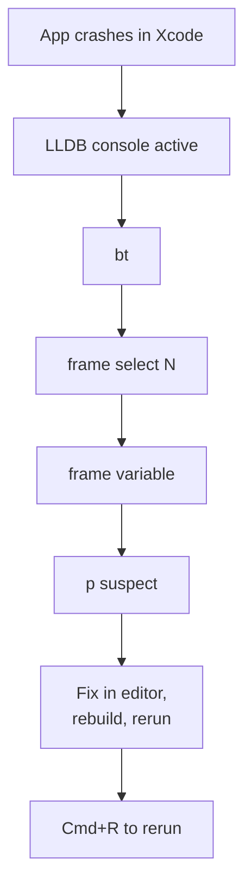
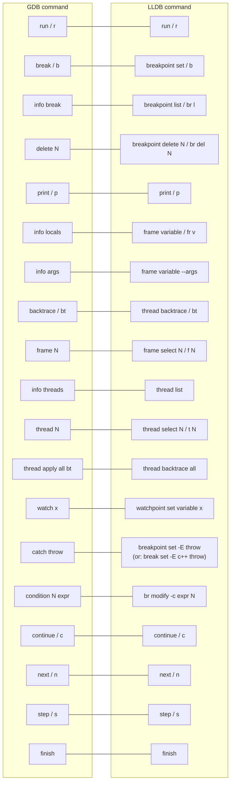

# 2. LLDB

> [!note] Why this note exists
> LLDB is the debugger in the LLVM project. It is the default debugger on macOS (used by Xcode), ships with `clang`, and is increasingly common on Linux. The concepts are the same as GDB (see [[1. GDB]]), but the command syntax differs. This note covers the LLDB command set, Xcode integration, multi-threaded debugging, and the GDB-to-LLDB translation table.

## Why It Matters

If you work on macOS, LLDB is your only first-class debugger — GDB works but is awkward to install and out-of-date. If you work on Linux with `clang`, LLDB is often a better choice for Clang-built binaries (better DWARF handling, better integration with `libc++`). And inside Xcode, the debugger UI is LLDB under the hood — knowing the underlying commands lets you do things the UI doesn't expose.

LLDB also has a clean Python scripting API, a stable ABI, and a more modular architecture than GDB. Some IDEs (VS Code, CLion) can use either; LLDB is often faster.

## Background

### LLDB vs GDB

| Property | GDB | LLDB |
|----------|-----|------|
| Project | GNU | LLVM |
| Default on | Linux (historically) | macOS, BSD |
| Architecture | Monolithic | Modular (libraries: `liblldb`) |
| Scripting | Python (via `python` command) | Python (first-class, via `script` and SB API) |
| License | GPL | LLVM (permissive) |
| Speed | Slower startup on large binaries | Generally faster |
| STL pretty-printing | Needs manual config | Built-in for `libc++` and `libstdc++` |
| Formatters | Python scripts | Native "synthetic children" + Python |
| Multi-threaded | Yes | Yes, with `thread select` |
| Reverse debugging | Yes (`record`) | Limited (via `process record`, less mature) |

LLDB was designed to fix GDB's perceived weaknesses: slow startup, awkward scripting, monolithic architecture, and GPL licensing that prevents embedding in proprietary tools. The result is a debugger that is faster to start, easier to script, and embeddable (used by Xcode, IntelliJ, VS Code).

### The LLDB Command Parser

LLDB commands have a structured syntax: `command subcommand [options] [args]`. For example:

```
breakpoint set --file main.cpp --line 42 --condition 'i==1000'
```

But LLDB also accepts GDB-like abbreviations for convenience:

```
b main.cpp:42              # equivalent to: breakpoint set --file main.cpp --line 42
```

You can mix and match. The structured form is more scriptable; the abbreviated form is faster for interactive use.

## Main Content

### Starting LLDB

```bash
$ lldb ./myprog
(lldb) run arg1 arg2
```

With arguments pre-set:

```bash
$ lldb -- ./myprog arg1 arg2
(lldb) run
```

Attach to a running process:

```bash
$ lldb -p $(pidof myprog)
```

Load a core dump:

```bash
$ lldb ./myprog -c /path/to/core
```

### Essential Commands

| LLDB command | GDB equivalent | Effect |
|---------------|----------------|--------|
| `run` (`r`) | `run` | Start the program. |
| `continue` (`c`) | `continue` | Continue execution. |
| `next` (`n`) | `next` | Step over. |
| `step` (`s`) | `step` | Step into. |
| `finish` | `finish` | Step out. |
| `breakpoint set --name main` (`b main`) | `break main` | Breakpoint by function. |
| `b main.cpp:42` | `break main.cpp:42` | Breakpoint by file:line. |
| `breakpoint list` (`br l`) | `info break` | List breakpoints. |
| `breakpoint delete 1` | `delete 1` | Delete breakpoint 1. |
| `print x` (`p x`) | `print x` | Print a variable. |
| `frame variable` (`fr v`) | `info locals` | Show all locals. |
| `frame variable --args` | `info args` | Show arguments. |
| `thread backtrace` (`bt`) | `backtrace` | Show call stack. |
| `frame select 2` (`f 2`) | `frame 2` | Switch to frame 2. |
| `thread list` | `info threads` | List threads. |
| `thread select 2` (`t 2`) | `thread 2` | Switch to thread 2. |
| `quit` (`q`) | `quit` | Exit. |

### Breakpoints

```lldb
(lldb) b main                       # function
(lldb) b main.cpp:42                # file:line
(lldb) b MyClass::method            # method (with overload resolution)
(lldb) b -n method -i false         # case-insensitive name match off
(lldb) b -S 0x401234                # address (uses --script or --address)
(lldb) br l                         # list
(lldb) br del 1                     # delete #1
(lldb) br dis 1                     # disable
(lldb) br en 1                      # enable
```

### Conditional Breakpoints

```lldb
(lldb) b main.cpp:42 -c 'i == 1000'
(lldb) br modify -c 'i == 2000' 1   # change condition on bp #1
```

Or in the structured form:

```lldb
(lldb) breakpoint set --file main.cpp --line 42 --condition 'i == 1000'
```

### Watchpoints

```lldb
(lldb) watchpoint set variable counter
(lldb) watchpoint set variable counter --watch read       # read watch
(lldb) watchpoint set variable counter --watch write      # write watch (default)
(lldb) watchpoint list
(lldb) watchpoint delete 1
```

LLDB prefers hardware watchpoints when possible (faster than software single-stepping).

### Inspecting Data

```lldb
(lldb) p x
(int) $0 = 42
(lldb) p/x x                       # hex
(lldb) p/d x                       # decimal
(lldb) p arr                       # array (if size known)
(lldb) p *(int*)0x7fff...           # dereference raw address
(lldb) frame variable              # all locals
(lldb) frame variable --args        # arguments
(lldb) frame variable this          # `this` pointer (in a method)
(lldb) frame variable this->member  # access a member
(lldb) type summary add --summary-string "${svar%s}" MyClass  # custom formatter
```

### The Frame and Thread Model

```lldb
(lldb) thread backtrace            # current thread's stack
(lldb) thread backtrace all        # ALL threads' stacks — like gdb's "thread apply all bt"
(lldb) thread list
(lldb) thread select 2             # switch to thread 2
(lldb) thread step-over            # same as `next`
(lldb) thread step-in              # same as `step`
(lldb) thread step-out             # same as `finish`
(lldb) thread continue             # same as `continue`, but only for current thread
(lldb) frame select 2              # move to frame 2
(lldb) frame info                  # show current frame info
```

### Multi-Threaded Debugging

```lldb
(lldb) thread list
  thread #1: tid = 0x12345, 0x... `myprog`::compute(x=42), ...
  thread #2: tid = 0x12346, 0x... `myprog`::worker(arg=0x...), ...
* thread #3: tid = 0x12347, 0x... `myprog`::main(argc=1, ...), stop reason = breakpoint 1.1

(lldb) thread select 2
(lldb) bt
(lldb) thread backtrace all
```

To freeze other threads while stepping (LLDB equivalent of GDB's `set scheduler-locking step`):

```lldb
(lldb) settings set target.process.thread.step-out-avoid-nodebug true
(lldb) settings set target.process.thread.step-in-avoid-nodebug true
```

### Variable Formatting and Synthetic Children

LLDB has built-in formatters for `libc++` and `libstdc++` containers:

```lldb
(lldb) p v
(std::vector<int>) size=5 {
  [0] = 1
  [1] = 2
  [2] = 3
  [3] = 4
  [4] = 5
}
(lldb) p m
(std::map<std::string, int>) size=3 {
  [0] = {
    first = "a"
    second = 1
  }
  ...
}
```

If a formatter isn't right, add your own:

```lldb
(lldb) type summary add --summary-string "x=${var.x}, y=${var.y}" Point
(lldb) p point
(Point) point = x=3, y=4
```

Or use Python for complex types:

```python
# ~/.lldbinit
def Point_Summary(valobj, internal_dict):
    x = valobj.GetChildMemberWithName('x').GetValue()
    y = valobj.GetChildMemberWithName('y').GetValue()
    return f"({x}, {y})"

def __lldb_init_module(debugger, internal_dict):
    debugger.HandleCommand('type summary add -F mymodule.Point_Summary Point')
```

### Xcode Integration

In Xcode, the LLDB console is at the bottom of the debug area. All LLDB commands work. Useful extras:

- The **Variables View** uses LLDB formatters.
- The **View Debugger** (`Debug → View Debugging → Capture View Hierarchy`) is Xcode-specific.
- `po` (print object) calls the object's `debugDescription` (Objective-C/Swift) or `description`. For C++ it falls back to `print`.
- `expression` (`e`) lets you evaluate arbitrary expressions, including calling functions: `e (int)printf("hello\n")`.
- `expr @import MyModule` (Swift) or just `expr` for C++ side-effects.



### Python Scripting

LLDB has a first-class Python API (the SB API — Scripted Bridge):

```python
# ~/.lldbinit
import lldb

def list_threads(debugger, command, result, internal_dict):
    target = debugger.GetSelectedTarget()
    process = target.GetProcess()
    for t in process:
        result.PutCString(f"thread {t.GetIndexID()}: {t.GetName()}")

def __lldb_init_module(debugger, internal_dict):
    debugger.HandleCommand('command script add -f mymodule.list_threads lt')
```

Now in LLDB:

```lldb
(lldb) lt
thread 1: myprog
thread 2: worker
...
```

This is far more powerful than GDB's Python API and is the basis for many Xcode features.

### The `.lldbinit` File

```
# ~/.lldbinit
settings set auto-confirm true
settings set use-color true
settings set target.x86-disassembly-flavor intel

# Skip STL when stepping
settings set target.process.thread.step-in-avoid-nodebug true

# Custom prompt
settings set prompt "(lldb) "

# Load Python helpers
command script import ~/.lldb/myhelpers.py
```

Project-specific settings go in `./.lldbinit` (in the project root); LLDB will ask for permission the first time.

### GDB vs LLDB Command Mapping



Most GDB muscle memory transfers with minimal effort. The two notable differences are `info locals` (becomes `frame variable`) and `thread apply all bt` (becomes `thread backtrace all`).

## Code Examples

### A crash to debug

```cpp
#include <vector>
int main() {
    std::vector<int> v;
    for (int i = 0; i < 1000000; ++i) v.push_back(i);
    return v[2000000];        // OOB — UB
}
```

```bash
$ clang++ -g -O0 crash.cpp -o crash
$ lldb ./crash
(lldb) run
Process 12345 stopped
* thread #1, queue = 'com.apple.main-thread', stop reason = EXC_BAD_ACCESS (code=1, address=0x...)
    frame #0: 0x0000000100001136 crash`main at crash.cpp:5:16
   2       std::vector<int> v;
   3       for (int i = 0; i < 1000000; ++i) v.push_back(i);
   4       return v[2000000];
-> 5   }
(lldb) p v.size()
(std::size_t) $0 = 1000000
(lldb) bt
* thread #1, queue = 'com.apple.main-thread', stop reason = EXC_BAD_ACCESS
  * frame #0: 0x... crash`main at crash.cpp:5:16
```

### A deadlock to debug

```cpp
#include <mutex>
#include <thread>
std::mutex a, b;
void f1() { std::lock_guard<std::mutex> la(a); std::lock_guard<std::mutex> lb(b); }
void f2() { std::lock_guard<std::mutex> lb(b); std::lock_guard<std::mutex> la(a); }
int main() { std::thread t1(f1), t2(f2); t1.join(); t2.join(); }
```

```bash
$ lldb ./deadlock
(lldb) run
^C
Process 12345 stopped
(lldb) thread backtrace all
  thread #1
    frame #0: ... __psynch_mutexwait
    frame #1: ... pthread_mutex_lock
    frame #2: ... std::__1::mutex::lock
    frame #3: ... f1() at deadlock.cpp:4
    frame #4: ... std::thread_invoker...
  thread #2
    frame #0: ... __psynch_mutexwait
    frame #1: ... pthread_mutex_lock
    frame #2: ... f2() at deadlock.cpp:5
```

Same pattern as in GDB: see what each thread holds and wants.

### Conditional breakpoint

```lldb
(lldb) b process.cpp:42 -c 'i == 1000000 && items[i].id == 0xbad'
```

### Watchpoint

```lldb
(lldb) b main
(lldb) run
(lldb) watchpoint set variable g_state
(lldb) continue
Watchpoint 1 hit:
old value: 0
new value: 42
Process ... stopped
* thread #1, ...
    frame #0: ... update_state(s=42) at state.cpp:17
```

### Calling a function from the debugger

```lldb
(lldb) p my_helper(x)
(int) $3 = 42
(lldb) expr printf("debug: x=%d\n", x)
debug: x=42
(int) $4 = 11
```

You can call any function visible in the current scope — useful for invoking helper debug functions.

## Common Pitfalls

> [!danger] Pitfall 1 — Typing GDB syntax into LLDB
> `info locals` doesn't work — use `frame variable`. `thread apply all bt` doesn't work — use `thread backtrace all`. Keep the mapping table handy.

> [!danger] Pitfall 2 — Optimized builds
> Same as GDB — compile with `-O0` or `-Og` for debugging. Optimized builds show "variable not available" frequently.

> [!danger] Pitfall 3 — Forgetting to set the target before launching
> `lldb ./prog` sets up everything. `lldb` then `target create ./prog` then `run` is the explicit form. Mixing them up is easy.

> [!danger] Pitfall 4 — Pretty-printer for the wrong STL
> If you build with `libstdc++` but LLDB's formatters are for `libc++` (or vice versa), output looks wrong. LLDB usually auto-detects, but if it doesn't, check `type category list`.

> [!danger] Pitfall 5 — `po` on a C++ object
> `po` (print object) calls `debugDescription`. C++ types don't have one. Use `p` for C++ objects.

> [!danger] Pitfall 6 — Watchpoint limitations
> LLDB only supports a limited number of hardware watchpoints (typically 4 on x86). Setting more falls back to slow software watchpoints.

> [!danger] Pitfall 7 — Missing debug info
> Clang emits less debug info than GCC by default. Use `-g3 -gdwarf-4` to get full info, including macros.

## Tips and Tricks

- **Use `~/.lldbinit`** for permanent settings (auto-confirm, color, custom commands).
- **`command script import`** to load Python helpers.
- **`frame variable --recursive 1`** to expand one level of struct members.
- **`v` (a.k.a. `frame variable`)** is faster than `p` when you just want to see a variable (no expression evaluation).
- **`expr`** for side effects: `expr ++i`, `expr free(malloc(100))`.
- **`gui`** for a curses UI similar to GDB's TUI.
- **`disassemble -n main`** to see the assembly of `main`.
- **`image list`** to see loaded shared libraries.
- **`image lookup -a 0x...`** to resolve an address to a symbol.
- **`settings set target.process.detach-keeps-stopped false`** to keep the process running when detaching.
- **In Xcode**: enable `Debug → Debug Workflow → Always Show Disassembly` for low-level work.
- **`process status`** shows where the program is now (a summary of `bt` first frame).
- **`breakpoint command add`** to attach a command to a breakpoint (e.g., `print i` then `continue` — a logging breakpoint).
- **`stats`** in newer LLDB versions gives timing breakdown — useful for slow startups.
- **For Linux users**: LLDB works fine but is sometimes less tested than GDB on edge cases. If LLDB behaves strangely, try GDB.

## Active Recall

1. What is the LLDB equivalent of GDB's `info locals`?
2. What is the LLDB equivalent of GDB's `thread apply all bt`?
3. How do you set a conditional breakpoint in LLDB? Give two syntaxes.
4. What does `frame variable --args` show?
5. How do you catch a C++ throw in LLDB?
6. How is `po` different from `p` in LLDB? Why does this matter for C++?
7. What is the LLDB way to add a custom pretty-printer for a user-defined type?
8. How do you script LLDB with Python? What is the SB API?
9. What is the `.lldbinit` file, and where can it live?
10. Give two advantages of LLDB over GDB and one advantage of GDB over LLDB.

## Next Steps

- Read [[1. GDB]] — most concepts transfer.
- Read [[3. Valgrind]] and [[4. Sanitizers (ASan, UBSan, TSan)]] for memory errors that debuggers don't catch directly.
- Read [[6. Debugging Strategies]] for the higher-level debugging process.
- Cross-reference [[1. Compiler and Toolchain/3. Clang and LLVM]] for the broader LLVM toolchain.
- Browse the LLDB docs at <https://lldb.llvm.org> and the GDB-to-LLDB command map at <https://lldb.llvm.org/use/map.html>.
