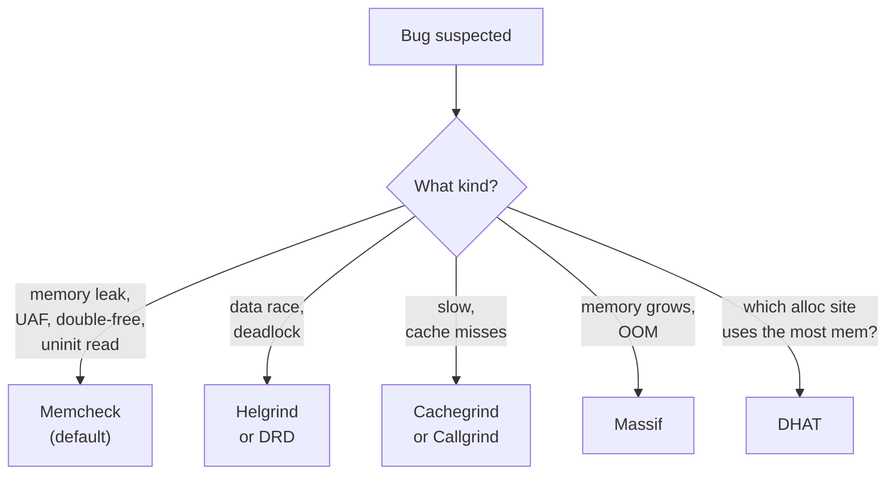

# 3. Valgrind

> [!note] Why this note exists
> Valgrind is a dynamic analysis framework that runs your program inside a synthetic CPU, intercepting every memory access and instruction. Its tools detect memory leaks, use-after-free, uninitialized reads, cache misses, and threading errors — bugs that debuggers like [[1. GDB]] and [[2. LLDB]] cannot systematically find. This note covers the tool suite (Memcheck, Cachegrind, Callgrind, Helgrind, DRD, Massif), how to read the output, and the trade-offs vs [[4. Sanitizers (ASan, UBSan, TSan)]].

## Why It Matters

A debugger tells you *where* a crash happens. Valgrind tells you *whether your program has memory errors at all* — even ones that haven't crashed yet. The standard C++ bug categories Valgrind catches:

- **Memory leaks** — `new` without `delete`.
- **Use-after-free** — accessing memory after `delete`.
- **Double-free** — `delete`-ing the same pointer twice.
- **Uninitialized reads** — reading a `char` before assigning it.
- **Out-of-bounds access** — `v[10]` on a 5-element vector.
- **Mismatched `malloc`/`delete`** — `free`-ing a `new`'d pointer.
- **Data races** — via Helgrind/DRD.
- **Cache misses** — via Cachegrind.
- **Heap growth** — via Massif.

These are the bugs that cause "works on my machine" failures, security vulnerabilities (most CVEs are memory bugs), and unexplained crashes days after the actual corruption.

## Background

### How Valgrind Works

Valgrind is a **virtual machine**. It does not run your code on the real CPU; it interprets every instruction in software, tracking metadata along the way:

1. Your binary is loaded into Valgrind.
2. Each instruction is translated into Valgrind's internal IR (VEX), instrumented by the active tool, then JIT-compiled back to native code.
3. The instrumented code runs, and Valgrind tracks every memory access against shadow memory.

This is why Valgrind is slow (10–50× slowdown) but extremely accurate. It catches bugs that compile-time analysis and address sanitizers cannot.


### The Tool Suite

| Tool | What it detects | Slowdown |
|------|-----------------|----------|
| **Memcheck** | Memory leaks, use-after-free, double-free, uninitialized reads, OOB, mismatched malloc/free | 10–30× |
| **Cachegrind** | L1/L2 cache misses, instruction count | 20–100× |
| **Callgrind** | Cachegrind + call graph (function-level attribution) | 20–100× |
| **Helgrind** | Data races, lock-order errors (deadlocks), misuses of pthread APIs | 20–50× |
| **DRD** | Data races (alternative implementation; lighter than Helgrind) | 10–40× |
| **Massif** | Heap memory usage over time; identifies allocation hotspots | 10–20× |
| **DHAT** | Dynamic heap analysis — which allocation sites use the most memory | 10–20× |
| **BBV** | Basic block vector — for architecture simulation | varies |

You select a tool with `--tool=NAME`. The default (no flag) is Memcheck.



### When to Use Valgrind vs Sanitizers

| Property | Valgrind | Sanitizers (ASan/TSan/etc.) |
|----------|----------|------------------------------|
| Recompile needed? | No | Yes |
| Slowdown | 10–50× | ~2× (ASan), ~5–15× (TSan) |
| Memory overhead | ~3× | ~3× (ASan) |
| Catches OOB on stack | Yes | Yes (ASan) |
| Catches OOB on heap | Yes | Yes (ASan) |
| Catches uninit reads | Yes | Yes (MSan) |
| Catches leaks | Yes | Yes (ASan `detect_leaks=1`) |
| Catches data races | Yes (Helgrind/DRD) | Yes (TSan) |
| Works with any binary | Yes | No — must rebuild |
| CPU cache profiling | Yes (Cachegrind) | No |
| Suitable for production | No | Sometimes (limited) |

**Rule of thumb**: use sanitizers (see [[4. Sanitizers (ASan, UBSan, TSan)]]) as your primary tool — they are much faster and integrate into CI. Use Valgrind when:

- You cannot recompile (third-party library).
- You need cache/heap profiling.
- Sanitizers miss a bug and you want a second opinion.

## Main Content

### Memcheck — The Default

Run it:

```bash
$ valgrind --leak-check=full --show-leak-kinds=all ./myprog arg1 arg2
```

Useful flags:

| Flag | Effect |
|------|--------|
| `--leak-check=full` | Run the leak detector at exit, show each leak. |
| `--show-leak-kinds=all` | Show definite, indirect, possible, and reachable leaks. |
| `--track-origins=yes` | Track where uninitialized bytes came from (slower but more useful). |
| `--undef-value-errors=yes` | Report reads of uninitialized values. |
| `--track-fds=yes` | Track open file descriptors. |
| `--error-exitcode=42` | Exit code if any errors found (useful in CI). |
| `--log-file=valgrind.log` | Write output to a file instead of stderr. |
| `--suppressions=foo.supp` | Suppress known false positives. |
| `--verbose` | More context. |

### Reading Memcheck Output

```text
==12345== Memcheck, a memory error detector
==12345== Copyright (C) ..., GNU GPL'd
==12345== Using Valgrind-3.20.0 and LibVEX
==12345== Command: ./myprog
==12345==
--12345-- run: /usr/bin/ld.so
==12345== Invalid read of size 4
==12345==    at 0x401136: main (main.cpp:5)
==12345==  Address 0x5a2c0b8 is 0 bytes after a block of size 40 alloc'd
==12345==    at 0x483BE63: operator new[](unsigned long) (vg_replace_malloc.c:631)
==12345==    by 0x40112A: main (main.cpp:3)
```

What it tells you:

1. **Error type**: "Invalid read of size 4" — reading 4 bytes that you don't own.
2. **Where**: `main.cpp:5` — the line that did the bad read.
3. **Where the memory was allocated**: `main.cpp:3` via `new[]`.
4. **Where exactly the bad access is**: "0 bytes after a block of size 40" — you read just past the end of a 40-byte array.

### Memory Leak Categories

Memcheck categorizes leaks:

| Category | Meaning |
|----------|---------|
| **definitely lost** | No pointer to the block exists. A real leak. |
| **indirectly lost** | Lost because the only pointer to it is in a definitely-lost block. |
| **possibly lost** | A pointer to the middle of the block exists, but not the start. Often a real leak. |
| **still reachable** | A pointer exists; the block was not freed but is still accessible at exit. Usually intentional (globals, caches). |

Focus on **definitely lost** and **possibly lost**. **Still reachable** is usually fine.

### Cachegrind — Cache Profiling

```bash
$ valgrind --tool=cachegrind ./myprog
```

Output:

```text
==12345== I   refs:      1,234,567,890
==12345== I1  misses:            1,234
==12345== LLi misses:              56
==12345== D   refs:        567,890,123  (456,789,012 rd   + 111,101,111 wr)
==12345== D1  misses:        2,345,678  (  2,123,456 rd   +   222,222 wr)
==12345== LLd misses:           34,567  (     12,345 rd   +    22,222 wr)
==12345==
==12345==  LL refs:           2,346,912  (  2,124,690 rd   +   222,222 wr)
==12345==  LL misses:            34,623  (     12,401 rd   +    22,222 wr)
```

- `I refs` — instructions executed.
- `I1 misses` — L1 instruction cache misses.
- `D1 misses` — L1 data cache misses.
- `LLd misses` — last-level (L3) data cache misses.

A high `LL misses` rate means your code is thrashing the cache — usually a sign that you should change your data layout (struct-of-arrays vs array-of-structs) or improve locality.

Use `cg_annotate` for line-by-line attribution:

```bash
$ cg_annotate cachegrind.out.12345
```

### Callgrind — Function-Level Profiling

```bash
$ valgrind --tool=callgrind ./myprog
$ callgrind_annotate callgrind.out.12345
```

Or, much better, open it in **KCachegrind** / **QCachegrind** for a GUI:

```bash
$ kcachegrind callgrind.out.12345
```

You see:

- Per-function instruction count.
- Per-function cache misses.
- Call graph (who called whom, how many times).
- Self vs inclusive cost.

This is the foundation of profile-guided optimization. See [[5. perf and Flamegraphs]] for the lighter-weight alternative.

### Helgrind and DRD — Thread Error Detection

```bash
$ valgrind --tool=helgrind ./myprog
$ valgrind --tool=drd ./myprog
```

Both detect:

- **Data races** — concurrent unsynchronized access.
- **Lock-order errors** — potential deadlocks.
- **Misuses of pthread APIs** — unlocking an unlocked mutex, etc.

Helgrind tracks happens-before edges via intercepted pthread calls. DRD uses a similar approach but is generally faster and lower-overhead.

Output example:

```text
==12345== Possible data race during read of size 4 at 0x... by thread #3
==12345== Locks held: none
==12345==    at 0x401234: worker (worker.cpp:10)
==12345==
==12345== This conflicts with a previous write of size 4 by thread #2
==12345== Locks held: 1, at address 0x... by thread #2
==12345==    at 0x401456: writer (writer.cpp:15)
```

Compare with TSan (see [[4. Sanitizers (ASan, UBSan, TSan)]]) — TSan is much faster and integrates with sanitizers, but only works with recompiled code.

### Massif — Heap Profiling

```bash
$ valgrind --tool=massif ./myprog
$ ms_print massif.out.12345
```

Output is a graph of heap usage over time:

```text
    MB
1.234^                                                                       #
     |                                                                       #
     |                                                                      @#
     |                                                                      @#
     |                                                                     @@#
     ...
     |                                              @                        @#
     |                                             @@@                       @#
     |                                          @@@@@@@@@                    @#
   0 +----------------------------------------------------------------------->Mi
     0                                                                   123.4
```

Useful for:

- Finding the peak heap size.
- Finding which allocation site dominates memory.
- Tracking down memory growth / OOM.

`ms_print` also shows the top allocation sites at the peak.

### DHAT — Dynamic Heap Analysis

```bash
$ valgrind --tool=dhat ./myprog
```

Tells you, per allocation site: total bytes allocated, total bytes accessed, average lifetime, max bytes alive at once. Useful for finding allocations that are big but barely used (candidates for elimination).

### Suppressions

Sometimes Valgrind reports errors in libraries you don't control. Suppress them:

```
# mylib.supp
{
   libfoo_uninit_read
   Memcheck:Cond
   fun:foo_library_internal
   ...
}
```

```bash
$ valgrind --suppressions=mylib.supp ./myprog
```

Most distros ship system suppressions for glibc and other common libs.

### The Performance Cost

| Tool | Slowdown | Memory overhead |
|------|----------|-----------------|
| Memcheck | 10–30× | ~3× |
| Helgrind | 20–50× | ~5× |
| DRD | 10–40× | ~3× |
| Cachegrind | 20–100× | ~1.5× |
| Callgrind | 20–100× | ~1.5× |
| Massif | 10–20× | ~1.5× |

This is why Valgrind is a *development-time* tool, not a production tool. For production, use sanitizers — see [[4. Sanitizers (ASan, UBSan, TSan)]].

## Code Examples

### Memory leak

```cpp
// leak.cpp
int main() {
    int* p = new int[100];
    p[0] = 42;
    return p[0];   // forgot to delete[] p
}
```

```bash
$ valgrind --leak-check=full ./leak
==12345== 40 bytes in 1 blocks are definitely lost in loss record 1 of 1
==12345==    at 0x483BE63: operator new[](unsigned long) (vg_replace_malloc.c:631)
==12345==    by 0x401136: main (leak.cpp:2)
==12345== LEAK SUMMARY:
==12345==    definitely lost: 40 bytes in 1 blocks
==12345==    indirectly lost: 0 bytes in 0 blocks
==12345==      possibly lost: 0 bytes in 0 blocks
==12345==    still reachable: 0 bytes in 0 blocks
==12345==         suppressed: 0 bytes in 0 blocks
```

Fix: use `std::vector<int>` or `std::unique_ptr<int[]>`.

### Use-after-free

```cpp
// uaf.cpp
int main() {
    int* p = new int(42);
    delete p;
    return *p;   // UB
}
```

```bash
$ valgrind ./uaf
==12345== Invalid read of size 4
==12345==    at 0x401136: main (uaf.cpp:4)
==12345==  Address 0x... is 4 bytes inside a block of size 4 free'd
==12345==    at 0x483DFAF: operator delete(void*) (vg_replace_malloc.c:...)
==12345==    by 0x40112E: main (uaf.cpp:3)
==12345==  Block was alloc'd at
==12345==    at 0x483BE63: operator new(unsigned long)
==12345==    by 0x401120: main (uaf.cpp:2)
```

### Uninitialized read

```cpp
// uninit.cpp
int main() {
    int x;
    return x;   // never assigned
}
```

```bash
$ valgrind --track-origins=yes ./uninit
==12345== Conditional jump or move depends on uninitialised value(s)
==12345==    at 0x401136: main (uninit.cpp:3)
==12345==  Uninitialised value was created by a stack allocation
==12345==    at 0x401120: main (uninit.cpp:2)
```

### Mismatched free

```cpp
// mismatch.cpp
#include <cstdlib>
int main() {
    int* p = new int[10];
    free(p);   // mismatch — should be delete[]
    return 0;
}
```

```bash
$ valgrind ./mismatch
==12345== Mismatched free() / delete / delete []
==12345==    at 0x483DFAF: free (vg_replace_malloc.c:...)
==12345==    by 0x401136: main (mismatch.cpp:4)
==12345==  Address 0x... is 0 bytes inside a block of size 40 alloc'd
==12345==    at 0x483BE63: operator new[](unsigned long)
==12345==    by 0x401120: main (mismatch.cpp:3)
```

### Data race (Helgrind)

```cpp
// race.cpp
#include <thread>
int counter = 0;
void bump() { for (int i = 0; i < 100000; ++i) ++counter; }
int main() {
    std::thread t1(bump), t2(bump);
    t1.join(); t2.join();
}
```

```bash
$ valgrind --tool=helgrind ./race
==12345== Possible data race during read of size 4 at 0x... by thread #3
==12345== Locks held: none
==12345==    at 0x401234: bump() (race.cpp:4)
==12345== This conflicts with a previous write of size 4 by thread #2
==12345==    at 0x401234: bump() (race.cpp:4)
```

## Common Pitfalls

> [!danger] Pitfall 1 — Running Valgrind in production
> 10–50× slowdown. Valgrind is for development only.

> [!danger] Pitfall 2 — Ignoring "still reachable"
> "Still reachable" is usually intentional, but if your program is supposed to free everything (e.g., a long-running server you want to be restart-safe), it may indicate laziness.

> [!danger] Pitfall 3 — Not using `--track-origins=yes`
> Without this, uninit errors say "stack allocation" with no line number. With it, you get the actual allocation site. Slower but worth it.

> [!danger] Pitfall 4 — False positives in third-party code
> Suppress them rather than ignoring real bugs. Document each suppression.

> [!danger] Pitfall 5 — ASan masks Valgrind bugs
> If you build with `-fsanitize=address`, Valgrind sees the sanitizer's own allocations and reports tons of false positives. Build a separate, sanitizer-free binary for Valgrind.

> [!danger] Pitfall 6 — Not running on a representative workload
> Valgrind only finds bugs in code that actually executes. Run with realistic inputs and run multiple paths.

> [!danger] Pitfall 7 — Helgrind is slow and noisy
> Helgrind's overhead can change timing, sometimes hiding races. Use TSan (see [[4. Sanitizers (ASan, UBSan, TSan)]]) as your primary; use Helgrind as a second opinion.

> [!danger] Pitfall 8 — Cachegrind simulates an idealized CPU
> Cache miss numbers are approximate; they assume a specific cache geometry. Use them for relative comparison, not absolute prediction.

## Tips and Tricks

- **Run Memcheck in CI** with `--error-exitcode=1` to fail builds.
- **Use `--track-origins=yes`** for uninit errors — the cost is worth it.
- **Combine `--leak-check=full --show-leak-kinds=all`** to see every leak.
- **Generate suppressions automatically** with `--gen-suppressions=all` to bootstrap.
- **Profile before optimizing** — use Callgrind + KCachegrind to find hotspots.
- **For data races**, prefer TSan (see [[4. Sanitizers (ASan, UBSan, TSan)]]) — it's faster and integrates with ASan.
- **For memory growth**, use Massif — the time graph is irreplaceable.
- **Run on multiple inputs** to maximize code coverage.
- **Use `valgrind --tool=none`** to test pure instrumentation overhead (rarely useful, but interesting).
- **For long-running servers**, consider periodic Valgrind runs in staging.
- **Pair with `gdb`**: `valgrind --vgdb=yes --vgdb-error=0 ./prog` lets you attach GDB to a Valgrind-run process at the moment an error is detected. See [[1. GDB]].
- **Prefer sanitizers for development** — see [[4. Sanitizers (ASan, UBSan, TSan)]] — and reserve Valgrind for cases sanitizers cannot handle (third-party binaries, cache profiling).

## Active Recall

1. Why is Valgrind so slow (10–50×)? What is it doing internally?
2. What does Memcheck's "definitely lost" leak category mean? What about "still reachable"?
3. What does `--track-origins=yes` do, and why is it useful?
4. What does Cachegrind measure? How is Callgrind different?
5. What does Massif show that no other Valgrind tool does?
6. Why is ASan generally preferable to Memcheck for development? When is Memcheck preferable?
7. Why might Helgrind report a data race that TSan misses (or vice versa)?
8. What is the purpose of `--error-exitcode`?
9. How do you suppress a known false positive?
10. Why should you not run ASan-instrumented binaries under Valgrind?

## Next Steps

- Read [[4. Sanitizers (ASan, UBSan, TSan)]] — the modern, faster alternative for most of what Memcheck and Helgrind do.
- Read [[1. GDB]] — pair Valgrind with GDB via `--vgdb`.
- Read [[5. perf and Flamegraphs]] for production-grade CPU profiling (lighter than Callgrind).
- Read [[6. Debugging Strategies]] for the higher-level process.
- Cross-reference [[7. Memory Management/6. Memory Leaks and Dangling Pointers]] for the bug classes Memcheck catches.
- Cross-reference [[14. Concurrency and Multithreading/1. Introduction to Multithreading]] — Helgrind/DRD catch the data races described there.
