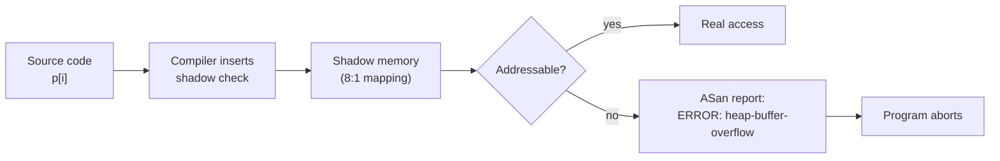
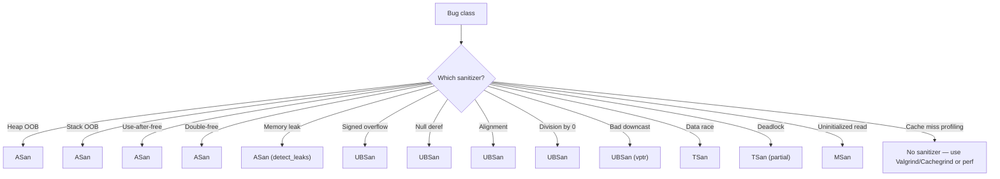

# 4. Sanitizers (ASan, UBSan, TSan)

> [!note] Why this note exists
> Sanitizers are the single biggest improvement to C++ development in the last decade. They catch memory errors, undefined behavior, and data races at runtime — with much less overhead than [[3. Valgrind]] and much more precision than any static analyzer. This note covers the four major sanitizers (ASan, UBSan, TSan, MSan), how to enable them, how to read their output, and how to use them effectively in CI.

## Why It Matters

A typical C++ bug — use-after-free, out-of-bounds read, signed integer overflow, data race — is undefined behavior. The program may appear to work for years, then crash in production under load, or be exploited by an attacker.

Sanitizers turn these silent bugs into loud, immediate failures with precise diagnostics:

- **Where** the bug occurred (file:line).
- **Where** the memory was allocated (for ASan).
- **Where** the conflicting access was (for TSan).
- **What** kind of UB it was (for UBSan).

The cost is small (typically 2× slowdown for ASan, 5–15× for TSan), making them usable in development and CI. Every C++ project should run sanitized builds in CI; many should run them in development too.

## Background

### What Sanitizers Are

A sanitizer is a combination of:

1. **Compiler instrumentation** — extra code inserted at every memory access, every function entry/exit, every arithmetic operation, to check for errors.
2. **Runtime library** — replaces `malloc`/`free`, provides shadow memory (ASan), tracks happens-before edges (TSan), etc.
3. **Standard library recompilation** — the C++ standard library itself must be instrumented to catch errors inside it (libc++ has sanitizer-friendly builds; libstdc++ has them too on most distros).

The sanitizers are a joint project between Google and LLVM, but work in both GCC and Clang. They share infrastructure (the sanitizer common runtime, UBSan's diagnostic format, etc.) but are independent: you pick the ones you need.

### The Four Major Sanitizers

| Sanitizer | Catches | Slowdown | Memory | Compatible with others? |
|-----------|---------|----------|--------|-------------------------|
| **ASan** (Address) | OOB, use-after-free, double-free, leaks (Linux/macOS) | ~2× | ~3× | Only with UBSan |
| **UBSan** (Undefined Behavior) | Signed overflow, null deref, alignment, division by zero, etc. | ~1.2× (with `-fno-sanitize-recover`) | ~1× | Composable |
| **TSan** (Thread) | Data races, deadlocks | ~5–15× | ~5–10× | Only with UBSan |
| **MSan** (Memory) | Reads of uninitialized memory | ~3× | ~3× | Requires entire program (incl. libs) instrumented |

ASan+UBSan is the standard "debug" combination. TSan+UBSan is the standard for multithreaded code. MSan is rarely used because it requires an entirely instrumented standard library.

### Why Sanitizers > Valgrind for Development

| Aspect | Sanitizers | Valgrind |
|--------|------------|----------|
| Recompile needed | Yes | No |
| Slowdown | 2–15× | 10–50× |
| Memory overhead | 3–10× | 3–5× |
| Catches stack OOB | Yes (ASan) | Yes |
| Catches global OOB | Yes (ASan) | Yes |
| Catches uninit reads | Yes (MSan) | Yes (Memcheck) |
| Catches leaks | Yes (ASan) | Yes (Memcheck) |
| Catches UB | Yes (UBSan) | Limited |
| Catches data races | Yes (TSan) | Yes (Helgrind) |
| CPU cache profiling | No | Yes (Cachegrind) |
| Works on any binary | No | Yes |

Sanitizers are faster, catch more (especially UB), and integrate with the compiler. They are the primary tool. Use Valgrind for the cases sanitizers cannot handle: third-party binaries, cache profiling, or as a second opinion.

## Main Content

### Enabling Sanitizers

Compile and link with `-fsanitize=...`:

```bash
# ASan + UBSan (debug build)
g++ -g -O1 -fsanitize=address,undefined -fno-sanitize-recover=all main.cpp

# TSan (thread sanitizer)
g++ -g -O1 -fsanitize=thread main.cpp

# MSan (memory sanitizer — requires entire program instrumented)
clang++ -g -O1 -fsanitize=memory -fno-omit-frame-pointer main.cpp
```

Recommended flags:

- `-g` — debug info so the report has file:line.
- `-O1` — modest optimization. `-O0` works but misses some inlined-call bugs. `-O2` is OK but may inline too aggressively for clear reports.
- `-fno-omit-frame-pointer` — better stack traces.
- `-fno-sanitize-recover=all` — abort on the first error instead of continuing. Better for catching one bug at a time.

### ASan — Address Sanitizer

Catches:

- Heap buffer overflow (`new int[10]`, access `[10]`).
- Stack buffer overflow (local arrays).
- Global buffer overflow (globals).
- Use-after-free (dangling pointer dereference).
- Use-after-return (rare; requires `ASAN_OPTIONS=detect_stack_use_after_return=1`).
- Double-free.
- Memory leaks (Linux/macOS, with `ASAN_OPTIONS=detect_leaks=1`).

ASan uses **shadow memory**: every 8 bytes of application memory get 1 byte of shadow that tracks whether those bytes are addressable. Every memory access is compiled to first check the shadow; if the access is invalid, ASan reports.



#### Example ASan output

```text
=================================================================
==12345==ERROR: AddressSanitizer: heap-buffer-overflow on address 0x602000000034 at pc 0x... bp 0x... sp 0x...
READ of size 4 at 0x602000000034 thread T0
    #0 0x... in main main.cpp:5
    #1 0x... in libc_start_main

0x602000000034 is located 4 bytes after 40-byte region [0x602000000010,0x602000000038)
allocated by thread T0 here:
    #0 0x... in operator new[](unsigned long)
    #1 0x... in main main.cpp:3

SUMMARY: AddressSanitizer: heap-buffer-overflow main.cpp:5 in main
```

Notice:

1. **Error type**: `heap-buffer-overflow`.
2. **Where the bad access is**: `main.cpp:5`.
3. **Where the memory was allocated**: `main.cpp:3`.
4. **Offset**: "4 bytes after 40-byte region" — you read past the end by 4 bytes.

#### Useful ASan options

Set via environment variable before running:

```bash
export ASAN_OPTIONS=detect_leaks=1:abort_on_error=1:halt_on_error=1
export ASAN_OPTIONS=detect_stack_use_after_return=1:color=always
```

Common options:

| Option | Effect |
|--------|--------|
| `detect_leaks=1` | Enable leak detection (default on Linux/macOS). |
| `abort_on_error=1` | `abort()` instead of `exit(1)` — easier to attach a debugger. |
| `halt_on_error=1` | Stop at the first error. |
| `detect_stack_use_after_return=1` | Catch use-after-return (off by default; has overhead). |
| `allocator_may_return_null=1` | Don't abort on `new` failure; return `nullptr` instead. |
| `log_path=asan.log` | Write reports to a file. |
| `suppressions=asan.supp` | Load suppressions. |
| `print_legend=1` | Print the color legend. |

### UBSan — Undefined Behavior Sanitizer

Catches:

- Signed integer overflow (`INT_MAX + 1`).
- Division by zero.
- Null pointer dereference.
- Misaligned loads/stores.
- Shifts by negative or too-large amounts.
- Out-of-range enum values.
- Invalid `static_cast`s (downcast to wrong type).
- VLA bound <= 0.
- Implicit conversions that lose data (`-fsanitize=implicit-conversion`).
- Object size violations (`-fsanitize=object-size`).

UBSan is composable — you can enable subsets:

```bash
g++ -fsanitize=undefined main.cpp                # the default set
g++ -fsanitize=signed-integer-overflow main.cpp  # only signed overflow
g++ -fsanitize=alignment main.cpp                # only alignment
```

#### Example UBSan output

```text
main.cpp:5:5: runtime error: signed integer overflow: 2147483647 + 1 cannot be represented in type 'int'
SUMMARY: UndefinedBehaviorSanitizer: undefined-behavior main.cpp:5:5 in
```

#### `-fno-sanitize-recover`

By default, UBSan prints a warning and **continues**. This hides subsequent errors. Add `-fno-sanitize-recover=all` to abort on the first UB:

```bash
g++ -fsanitize=undefined -fno-sanitize-recover=all main.cpp
```

#### Specific UBSan checks worth enabling

- `-fsanitize=integer` — all integer issues (signed overflow, unsigned overflow, shifts). Includes non-UB checks.
- `-fsanitize=implicit-conversion` — implicit narrowing conversions.
- `-fsanitize=nullability` — nullability annotations (Clang).
- `-fsanitize=vptr` — invalid vtable pointer (catches bad casts).

### TSan — Thread Sanitizer

Catches:

- **Data races** — unsynchronized read/write or write/write on the same memory from different threads.
- Some lock-order errors (deadlocks).

TSan uses a "happens-before" graph (like Helgrind) but is much faster because of compiler instrumentation. It only works on Linux and macOS (not Windows yet).

#### Example TSan output

```text
==================
WARNING: ThreadSanitizer: data race (pid=12345)
  Read of size 4 at 0x... by thread T2:
    #0 worker() race.cpp:4 (exe+0x...)
    #1 ...

  Previous write of size 4 at 0x... by thread T1:
    #0 worker() race.cpp:4 (exe+0x...)
    #1 ...

  Location is global 'counter' of size 4 at 0x...

  Thread T2 (tid=..., running) created by main thread at:
    #0 pthread_create (libtsan+0x...)
    #1 main race.cpp:8

  Thread T1 (tid=..., finished) created by main thread at:
    #0 pthread_create (libtsan+0x...)
    #1 main race.cpp:7
SUMMARY: ThreadSanitizer: data race race.cpp:4 in worker()
==================
```

Notice TSan shows:

1. **Both accesses** — the read AND the previous write.
2. **Where each thread was created** — so you can understand the threading structure.

#### TSan limitations

- Slow (5–15×).
- Does not work with ASan (the two share some shadow memory; pick one).
- Does not catch all orderings (e.g., relaxed-atomic races it sometimes misses).
- Requires the whole program (including libraries) to be instrumented for full coverage. Uninstrumented libraries produce false negatives.

### MSan — Memory Sanitizer

Catches reads of uninitialized memory. Less common because:

1. It requires the entire program (including libc, libstdc++) to be instrumented. Standard distro libraries are not.
2. False positives from uninstrumented code are common.
3. ASan's `-fsanitize=memory` mode requires Clang and a special build of libc++.

When you need it, use Clang's "MSan-friendly" libc++ build. For most projects, just compile with `-ftrivial-auto-var-init=pattern` (GCC 12+, Clang 8+) to initialize all locals to a known pattern — that catches many uninit bugs at zero runtime cost.

### Sanitizer Coverage Matrix



### Combinations and Conflicts

- **ASan + UBSan**: supported and recommended. Use `-fsanitize=address,undefined`.
- **TSan + UBSan**: supported.
- **ASan + TSan**: **incompatible**. Pick one per build.
- **MSan + anything else**: **incompatible**. MSan must be alone.
- **Multiple sanitizer builds**: have separate build configurations for `asan`, `ubsan`, `tsan`, `msan`. Run all of them in CI.

### CMake Integration

```cmake
# CMakeLists.txt
option(ENABLE_ASAN "Enable AddressSanitizer" OFF)
option(ENABLE_UBSAN "Enable UndefinedBehaviorSanitizer" OFF)
option(ENABLE_TSAN "Enable ThreadSanitizer" OFF)

if(ENABLE_ASAN)
    add_compile_options(-fsanitize=address -fno-sanitize-recover=all)
    add_link_options(-fsanitize=address)
endif()
if(ENABLE_UBSAN)
    add_compile_options(-fsanitize=undefined -fno-sanitize-recover=all)
    add_link_options(-fsanitize=undefined)
endif()
if(ENABLE_TSAN)
    add_compile_options(-fsanitize=thread -fno-sanitize-recover=all)
    add_link_options(-fsanitize=thread)
endif()
```

```bash
$ cmake -DENABLE_ASAN=ON -DENABLE_UBSAN=ON ...
```

### Sanitizers in CI

The standard pattern:

1. Build with ASan+UBSan, run the test suite.
2. Build with TSan, run the test suite.
3. (Optional) Build with MSan if you can.
4. Fail the build on any sanitizer error.

Sanitizers report errors with non-zero exit codes, so a CI script just needs to run the tests and check the exit code.

### Sanitizers vs Static Analyzers

Static analyzers (clang-tidy, cppcheck) examine the source without running it. They catch some bugs the sanitizers miss (e.g., uninitialized reads on paths the tests don't cover), but they have false positives and miss bugs the runtime would catch. Use both.

## Code Examples

### ASan: heap-buffer-overflow

```cpp
// asan.cpp
int main() {
    int* p = new int[10];
    p[10] = 0;          // OOB
    delete[] p;
}
```

```bash
$ g++ -g -O1 -fsanitize=address asan.cpp -o asan
$ ./asan
ERROR: AddressSanitizer: heap-buffer-overflow ...
```

### ASan: use-after-free

```cpp
int main() {
    int* p = new int(42);
    delete p;
    return *p;
}
```

```text
ERROR: AddressSanitizer: heap-use-after-free ...
```

### ASan: stack-use-after-scope

```cpp
int main() {
    int* p;
    {
        int x = 42;
        p = &x;
    }
    return *p;          // x is gone
}
```

ASan catches this with `-fsanitize=address` (the default flags). Without it, the bug is silent UB.

### UBSan: signed overflow

```cpp
#include <climits>
int main() {
    int x = INT_MAX;
    return x + 1;       // UB
}
```

```bash
$ g++ -g -O1 -fsanitize=undefined -fno-sanitize-recover=all ub.cpp -o ub
$ ./ub
ub.cpp:4:12: runtime error: signed integer overflow: ...
```

### UBSan: null deref

```cpp
int main() {
    int* p = nullptr;
    return *p;
}
```

### UBSan: bad downcast

```cpp
struct Base { virtual ~Base() = default; };
struct A : Base { int a; };
struct B : Base { int b; };

int main() {
    A a;
    Base* bp = &a;
    B* bad = static_cast<B*>(bp);   // UB — bp actually points to an A
    return bad->b;
}
```

UBSan with `-fsanitize=vptr` catches this.

### TSan: data race

```cpp
#include <thread>
int counter = 0;
void bump() { for (int i = 0; i < 100000; ++i) ++counter; }
int main() {
    std::thread t1(bump), t2(bump);
    t1.join(); t2.join();
}
```

```bash
$ g++ -g -O1 -fsanitize=thread tsan.cpp -o tsan
$ ./tsan
WARNING: ThreadSanitizer: data race ...
```

### Leak detection with ASan

```cpp
int main() {
    int* p = new int[100];
    p[0] = 42;
    return p[0];            // forgot delete[] p
}
```

```bash
$ ASAN_OPTIONS=detect_leaks=1 ./asan
=================================================================
==12345==ERROR: LeakSanitizer: detected memory leaks

Direct leak of 400 byte(s) in 1 object(s) allocated from:
    #0 0x... in operator new[]
    #1 0x... in main asan.cpp:2
SUMMARY: AddressSanitizer: 400 byte(s) leaked in 1 allocation(s).
```

### Suppressions

For a known false positive (e.g., in a third-party library):

```
# asan.supp
interceptor_via_lib:libfoo.so
```

```bash
$ ASAN_OPTIONS=suppressions=asan.supp ./myprog
```

TSan suppressions are similar:

```
# tsan.supp
race:known_race_function
```

## Common Pitfalls

> [!danger] Pitfall 1 — Mixing ASan and TSan
> They are mutually exclusive. Build separate binaries for each.

> [!danger] Pitfall 2 — Running sanitized binaries in production
> 2–15× slowdown. Use only in development, tests, and staging.

> [!danger] Pitfall 3 — Not recompiling the standard library
> For full coverage (especially MSan), libc++/libstdc++ must be instrumented. Otherwise bugs inside the library are missed. Most distros ship ASan/UBSan-friendly stdlib; MSan-friendly requires a custom build.

> [!danger] Pitfall 4 — `-fsanitize-recover` continuing past errors
> UBSan defaults to continuing. Add `-fno-sanitize-recover=all` so the first error aborts.

> [!danger] Pitfall 5 — ASan missing use-after-return
> Use-after-return detection is off by default. Set `ASAN_OPTIONS=detect_stack_use_after_return=1` if you suspect it.

> [!danger] Pitfall 6 — False positives from inline assembly
> Hand-written assembly may trigger UBSan/ASan false positives. Suppress them.

> [!danger] Pitfall 7 — Not running on multiple inputs
> Sanitizers only catch bugs in executed code. Run with varied inputs, fuzz your code (see [[6. Debugging Strategies]]).

> [!danger] Pitfall 8 — Forgetting to link the sanitizer runtime
> Both compile and link commands must have `-fsanitize=...`. Forgetting the link flag produces mysterious "undefined reference to __asan_init" errors.

> [!danger] Pitfall 9 — TSan false positives from uninstrumented libraries
> If a library is not built with TSan, calls into it create "blind spots" where TSan cannot track synchronization. False positives and false negatives result. Build the library with TSan if possible.

## Tips and Tricks

- **Enable ASan+UBSan in your debug builds** by default. The overhead is bearable and the bug-catching is enormous.
- **Enable TSan in a separate build** for any code that touches shared state.
- **Run sanitized builds in CI** — fail on any error.
- **`-fno-sanitize-recover=all`** to abort on the first error (cleaner reports).
- **`-ftrivial-auto-var-init=pattern`** (Clang 8+, GCC 12+) initializes all locals to a known pattern at zero runtime cost — catches many uninit bugs.
- **Combine with `-fsanitize=undefined,integer`** for the most thorough UB checks.
- **Use `__attribute__((no_sanitize("address")))`** to mark functions that legitimately do unsafe things (rare).
- **Pair with `gdb`**: `ASAN_OPTIONS=abort_on_error=1` lets you attach GDB at the moment of the bug. See [[1. GDB]].
- **Sanitizer-friendly libc++**: on macOS, libc++ is sanitizer-friendly by default. On Linux, use a Clang-built libc++ if you need MSan.
- **Suppress, don't ignore** false positives — and review suppressions periodically.
- **Pair with fuzzing** (libFuzzer, AFL) — sanitizers + fuzzing is the modern bug-finding stack.
- **Run the test suite repeatedly** — some bugs only appear under specific interleavings or allocations.
- **Check `__has_feature(address_sanitizer)`** or `__SANITIZE_ADDRESS__` in your code to disable workarounds in sanitized builds.

## Active Recall

1. What is shadow memory, and how does ASan use it?
2. Which sanitizers are mutually exclusive? Which compose?
3. What does `-fno-sanitize-recover=all` do, and why is it recommended?
4. What is the difference between ASan's leak detection and Valgrind's?
5. What does TSan show that ASan does not? Why can't they be combined?
6. Write the CMake snippet to enable ASan+UBSan on a project.
7. What does UBSan catch that ASan does not? Give three examples.
8. Why is MSan rarely used? What does it require?
9. How do you suppress a known false positive?
10. Why should sanitized builds be a CI step in every C++ project?

## Next Steps

- Read [[3. Valgrind]] for the slower, no-recompile alternative.
- Read [[1. GDB]] for attaching to a sanitized binary at the moment of failure.
- Read [[5. perf and Flamegraphs]] for performance profiling (sanitizers find bugs; perf finds slowness).
- Read [[6. Debugging Strategies]] for how to incorporate sanitizers into your workflow.
- Cross-reference [[7. Memory Management/6. Memory Leaks and Dangling Pointers]] — ASan catches these.
- Cross-reference [[14. Concurrency and Multithreading/1. Introduction to Multithreading]] — TSan catches these.
- Explore **libFuzzer** (in-process fuzzing, integrates with sanitizers) and **OSS-Fuzz** for continuous fuzzing at scale.
