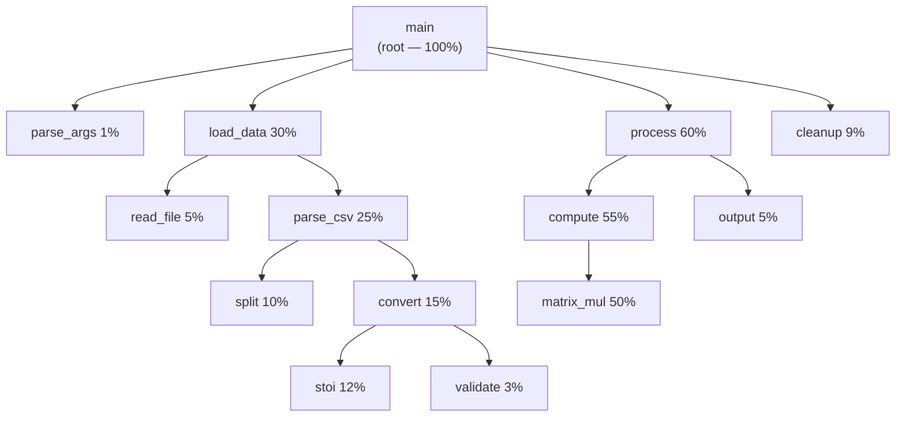
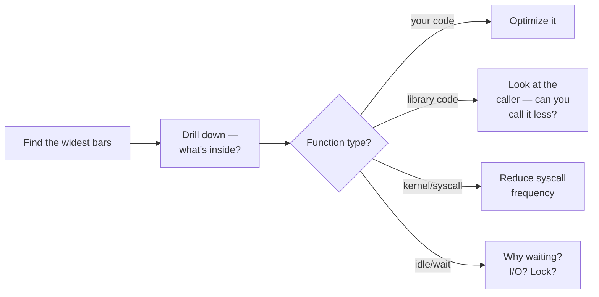
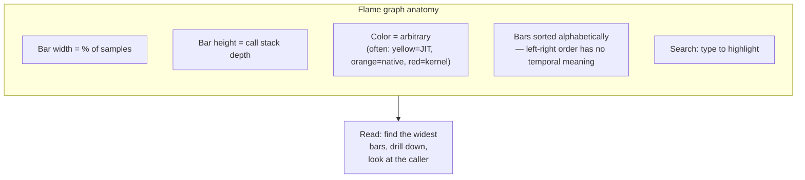

# 5. perf and Flamegraphs

> [!note] Why this note exists
> After your code is correct (thanks to [[4. Sanitizers (ASan, UBSan, TSan)]]) and you've found your bug (thanks to [[1. GDB]]), the next question is "why is it slow?". **perf** is the Linux kernel's profiler — it samples the program's instruction pointer and call stack at hardware intervals, giving you a statistical profile with very low overhead. **Flame graphs** (Brendan Gregg's visualization) turn that profile into a picture you can read in seconds. This note covers `perf stat`, `perf record`, `perf report`, flame graph generation, and alternative profilers (VTune, Instruments).

## Why It Matters

Optimizing without profiling is like doing surgery blindfolded. You'll spend a week micro-optimizing a function that takes 0.1% of the runtime, while the real 30%-of-runtime hotspot sits untouched.

A profiler tells you, with hard data:

- Which functions consume the most CPU cycles.
- Which call paths lead to those functions.
- Which lines of source are hottest.
- Whether the bottleneck is CPU, cache misses, branch mispredicts, or I/O.

`perf` is the standard Linux profiler. It's free, low-overhead, kernel-integrated, and works on any binary (no recompile, though `-g` helps). Flame graphs make its output readable. Together they are the basic toolkit of performance work on Linux.

## Background

### Sampling vs Instrumentation

There are two ways to profile:

- **Instrumentation** — modify the code to call a timer at function entry/exit. Exact call counts and times, but high overhead. (Examples: gprof, `-finstrument-functions`.)
- **Sampling** — at regular intervals (e.g., 999 Hz), the kernel interrupts the program and records the instruction pointer and call stack. Statistical: if function F is in 30% of samples, it uses ~30% of CPU. (Example: `perf`.)

Sampling is the modern default. Overhead is ~1–5%, so you can profile production-like workloads. The cost: you get statistical estimates, not exact counts.

### What perf Samples

`perf` can sample many events:

| Event | What it measures |
|-------|------------------|
| `cpu-cycles` (or `cycles`) | CPU cycles spent (default for CPU profiling). |
| `instructions` | Instructions retired. |
| `cache-misses` | Last-level cache misses. |
| `branch-misses` | Branch mispredictions. |
| `task-clock` | Time the program was running on a CPU. |
| `context-switches` | OS context switches. |
| `page-faults` | Page faults. |
| `sched:sched_switch` | Tracepoint: scheduler switched the task. |

The default is `cycles` for CPU profiling. Use `cache-misses` for memory-bound profiling, `branch-misses` for branchy code.

### Why Stack Sampling Is Hard

To get a call stack at each sample, perf must walk the stack at interrupt time. This requires:

1. **Frame pointers** (`-fno-omit-frame-pointer`) — easiest case.
2. **DWARF debug info** (`-g`) — perf can walk via DWARF, but slowly.
3. **.eh_frame unwinding** — default on modern Linux; works without frame pointers.
4. **JITed code** (Java, V8) — needs special JIT dump integration (`perf inject --jit`).

Modern compilers omit frame pointers by default at `-O2`, which makes stack walking harder. For profiling, either:

- Build with `-fno-omit-frame-pointer`, or
- Use perf's DWARF mode (`--call-graph=dwarf`), which is slower but works without frame pointers.

## Main Content

### Setup and Permissions

On most distros, `perf` is in the `linux-tools-common` package, but you may need `linux-tools-$(uname -r)` for the version-matched tools. To use it without root for most operations:

```bash
echo 1 | sudo tee /proc/sys/kernel/perf_event_paranoid
# 0 = no restrictions (root)
# 1 = allow kernel profiling (root)
# 2 = disallow kernel profiling (default)
# 3 = disallow CPU events
```

Level `-1` is needed for some hardware events. Level `1` or `2` is fine for most user-space profiling.

### `perf stat` — Quick Counter Summary

Run a command and print aggregate counters:

```bash
$ perf stat ./myprog

 Performance counter stats for './myprog':

       1234.56 msec task-clock                #    0.998 CPUs utilized
             12      context-switches          #    9.723 /sec
              0      cpu-migrations            #    0.000 /sec
          1,234      page-faults               #  999.000 /sec
      5,000,000      cycles                    #    4.050 GHz
      2,000,000      instructions              #    0.40  insn per cycle
        100,000      branches                  #   81.000 M/sec
          5,000      branch-misses             #    5.00% of all branches

       1.23683 +- 0.00123 seconds time elapsed
```

What to look for:

- **`insn per cycle`** — IPC. Below 1 = stalled. Above 2–4 = good (modern superscalar). Low IPC often means memory-bound or branch-mispredict bound.
- **`branch-misses`** — high branch misses indicate branchy code or unpredictable data.
- **`cache-misses`** (add `--event cache-misses`) — high means memory-bound.

`perf stat` is great for A/B comparison: "did my optimization actually improve IPC?".

### `perf record` — Sampling Profile

```bash
$ perf record --call-graph dwarf -F 999 -- ./myprog
[ perf record: Woken up 1 times to write data ]
[ perf record: Captured and wrote 0.123 MB perf.data (~5384 samples) ]
```

Flags:

- `--call-graph dwarf` (or `-g dwarf`) — use DWARF for stack walking. Works without frame pointers. Alternative: `lbr` (last-branch-record, fast but limited depth).
- `-F 999` — sample frequency 999 Hz. Higher = more samples = more accuracy but more overhead.
- `-e cycles` — event (default: cycles). Use `-e cache-misses` for memory profiling.
- `-- sleep 10` — profile a running process for 10 seconds.
- `-p PID` — attach to a running process.

### `perf report` — Browse the Profile

```bash
$ perf report
```

An ncurses UI lets you browse:

- Hot functions (by sample count).
- Call chains (who called whom).
- Annotated assembly with sample counts per instruction.

Useful keys: `+`/`-` to expand/collapse call chains, `a` to annotate (show assembly with hot instructions highlighted), `/` to filter by symbol.

### `perf script` — Raw Output for External Tools

```bash
$ perf script > out.perf
```

This dumps the raw sample data, which is the input for **flame graph** generation.

### Flame Graphs

A **flame graph** (Brendan Gregg, 2011) is a visualization of the call-stack samples:

- **Y axis**: stack depth. The bottom is the root (`main` or `_start`); each level up is a callee.
- **X axis**: number of samples (NOT time). Wider = more CPU.
- **Color**: arbitrary (often warm colors for "hot").
- Each rectangle is a function. The width is the percentage of samples in which that function was on the stack.



The key reading rule: **a wide bar is hot**. Drill down into the wide bars to find what to optimize. In the example above, `matrix_mul` is the clear hotspot — 50% of CPU.

#### Generating a Flame Graph

```bash
# 1. Record
perf record --call-graph dwarf -F 999 -- ./myprog

# 2. Dump raw samples
perf script > out.perf

# 3. Fold stacks (one line per sample, semicolon-separated)
git clone https://github.com/brendangregg/FlameGraph
./FlameGraph/stackcollapse-perf.pl out.perf > out.folded

# 4. Generate SVG
./FlameGraph/flamegraph.pl out.folded > flame.svg

# 5. Open in a browser
xdg-open flame.svg
```

Or, use the faster modern alternative:

```bash
# Use the rust flamegraph tool (one command)
cargo install flamegraph
flamegraph -o flame.svg -- ./myprog
```

#### Reading a Flame Graph



Common patterns:

- **Wide plateau at top** — a single function dominates. Optimize it.
- **Tall narrow tower** — deep call chain; usually indicates abstraction overhead.
- **Many small towers** — fine-grained parallelism with overhead per task; consider batching.
- **A bar at the top with no parent** — usually a thread entry point.
- **A gap in the middle** — inlining; the inlined frames are merged into the caller.

### Differential Flame Graphs

Compare two runs (before/after an optimization):

```bash
perf record -o before.perf -- ./myprog_v1
perf record -o after.perf  -- ./myprog_v2

perf script -i before.perf  | stackcollapse-perf.pl > before.folded
perf script -i after.perf   | stackcollapse-perf.pl > after.folded

difffolded.pl before.folded after.folded | flamegraph.pl > diff.svg
```

Red bars = got slower; blue bars = got faster.

### Off-CPU Profiling

`perf record -e sched:sched_switch` samples when the program is *descheduled* — i.e., waiting. This reveals blocking time (I/O, locks, sleeps) that CPU profiling misses.

For more complete off-CPU profiling, use **eBPF tools** (`bpftrace`, `BCC`) — see Brendan Gregg's "BPF Performance Tools".

### `perf top` — Live View

```bash
$ sudo perf top
```

Like `top`, but shows hot functions across the whole system. Useful for finding runaway CPU usage.

### `perf mem` — Memory Access Profiling

```bash
$ sudo perf mem -t load record -- ./myprog
$ sudo perf mem report
```

Samples memory loads with their latency and addresses. Reveals false sharing, cache-line conflicts, and access patterns. Requires hardware support (PEBS on Intel).

### Other Profilers

#### Intel VTune Profiler

Commercial, free for academic use. Best-in-class for:

- Per-instruction timing breakdown.
- Cache hierarchy analysis (L1/L2/LLC miss counts and latencies).
- Memory bandwidth analysis.
- NUMA analysis.
- Microarchitecture exploration (which execution ports are saturated).

Use VTune when `perf` tells you "memory bound" but not exactly where.

#### AMD μProf

AMD's equivalent of VTune. Free.

#### Apple Instruments

macOS only. GUI-based. Includes:

- **Time Profiler** — CPU sampling, like `perf`.
- **Allocations** — heap profiler, like Massif.
- **Leaks** — leak detector.
- **System Trace** — kernel-level events.

For macOS, Instruments is the standard.

#### DTrace / eBPF / bpftrace

System-wide dynamic tracing. Far more powerful than `perf` for specific questions: "show me every `read` syscall with its size and latency". On Linux, use `bpftrace` and the BCC tools.

#### gprof2dot / QCachegrind

For visualizing Callgrind output (see [[3. Valgrind]]).

### Flame Graph Anatomy



## Code Examples

### A slow program to profile

```cpp
// slow.cpp
#include <vector>
#include <random>
#include <algorithm>

double compute(const std::vector<double>& v) {
    double s = 0;
    for (size_t i = 0; i < v.size(); ++i)
        for (size_t j = 0; j < v.size(); ++j)
            s += v[i] * v[j];
    return s;
}

int main() {
    std::vector<double> v(10000);
    std::mt19937 rng;
    std::generate(v.begin(), v.end(), rng);

    volatile double result = compute(v);
    return (int)result;
}
```

```bash
$ g++ -g -O2 slow.cpp -o slow
$ perf record --call-graph dwarf -F 999 -- ./slow
$ perf report
```

In the report, you'll see `compute` at the top, taking ~99% of samples. Drill down with `a` to see the assembly and discover the inner loop is the hotspot.

### Generating a flame graph

```bash
$ perf record --call-graph dwarf -- ./slow
$ perf script > slow.perf
$ ./FlameGraph/stackcollapse-perf.pl slow.perf > slow.folded
$ ./FlameGraph/flamegraph.pl slow.folded > slow.svg
$ xdg-open slow.svg
```

### Cache miss profiling

```bash
$ perf stat -e cache-misses,cache-references,instructions,cycles ./slow

 Performance counter stats for './slow':

    10,000,000      cache-misses              #   50.0% of all cache refs
    20,000,000      cache-references
   200,000,000      instructions              #    0.40  insn per cycle
   500,000,000      cycles
```

50% cache misses + 0.4 IPC = memory-bound. The fix is to improve locality (blocking, tiling, struct-of-arrays) rather than micro-optimizing the loop.

### Profiling a long-running server

```bash
# Attach to a running server for 30 seconds
$ perf record -p $(pidof server) --call-graph dwarf -F 99 -- sleep 30
$ perf script > server.perf
```

### Custom event: branch misses

```bash
$ perf record -e branch-misses --call-graph lbr -- ./branchy
$ perf report
```

Use `lbr` (Last Branch Record) for branch-miss profiling — it's faster than DWARF and captures the actual mispredicted branch path.

## Common Pitfalls

> [!danger] Pitfall 1 — Missing frame pointers
> Without `-fno-omit-frame-pointer` or `--call-graph dwarf`, you get broken stack traces. Always check.

> [!danger] Pitfall 2 — Profiling an optimized-out program
> If the workload finishes in 1 ms, you get 1 sample. Make the workload last at least 1–10 seconds.

> [!danger] Pitfall 3 — Sampling too rarely
> Default frequency may be 99 Hz — too low for short hot functions. Use `-F 999` for higher resolution.

> [!danger] Pitfall 4 — Reading the X axis as time
> The X axis is **sample count**, not wall time. Order is alphabetical, not temporal.

> [!danger] Pitfall 5 — Optimizing the wrong function
> A function that takes 1% of CPU cannot give you more than 1% speedup, no matter how much you optimize it. Pick the widest bar.

> [!danger] Pitfall 6 — Forgetting about I/O
> If your program is I/O-bound, `perf record` will show mostly `read`/`write` syscalls. CPU optimization is pointless; you need to reduce I/O.

> [!danger] Pitfall 7 — Treating JITed code as one symbol
> Java, V8, etc. JIT-compile to native code. Without JIT dump integration, all JITed code shows as a single opaque blob. Use `perf inject --jit` or the runtime's built-in perf integration.

> [!danger] Pitfall 8 — Comparing profiles across different hardware
> Cache geometry, branch predictor, and IPC characteristics differ. Only compare on the same machine.

> [!danger] Pitfall 9 — Confusing self time with inclusive time
> "Self time" = samples where this function is at the top of the stack. "Inclusive time" = samples where this function is anywhere in the stack. Flame graphs show inclusive; `perf report --stdio` shows both.

## Tips and Tricks

- **Profile with realistic workloads** — synthetic benchmarks lie.
- **Build with `-g -fno-omit-frame-pointer`** for clean stack traces.
- **Sample at 999 Hz** (`-F 999`) for short programs; 99 Hz is fine for long-running servers.
- **Use `--call-graph dwarf`** if you can't use frame pointers; use `lbr` for very fast unwinding (limited depth).
- **Generate a flame graph SVG** for every profiling session — they're easy to share and review.
- **Use differential flame graphs** to verify an optimization actually helped.
- **Run `perf stat` before and after** every optimization — quick counter summary.
- **For I/O-bound code**, profile with off-CPU events (`sched:sched_switch`) or use `bpftrace`.
- **For memory-bound code**, profile with `cache-misses` and look at memory layout.
- **VTune for deep dives** when `perf` tells you "memory bound" but not where.
- **Profile in production-like environments** — different hardware reveals different bottlenecks.
- **Combine with sanitizers** in CI: sanitized builds find bugs; perf builds find slowness.
- **Read Brendan Gregg's flame graph documentation** — there are dozens of variants (differential, icicle, off-CPU, mutex, etc.).
- **Automate profiling** — capture a profile on every release; compare to the previous one.
- **Pin to a single core** (`taskset -c 0`) when micro-profiling to reduce noise from migration.

## Active Recall

1. What is the difference between sampling and instrumentation profiling?
2. What does `perf stat` show that `perf record` does not? Give an example.
3. Why are frame pointers useful for profiling? What's the alternative?
4. What does the X axis of a flame graph represent? (Trick question.)
5. How do you generate a flame graph from a `perf.data` file?
6. What does a low "insn per cycle" ratio indicate?
7. How would you profile a long-running server without restarting it?
8. What is off-CPU profiling, and when do you need it?
9. Name two profilers besides `perf` and one situation where each is preferable.
10. After an optimization, how do you verify it actually improved performance?

## Next Steps

- Read [[6. Debugging Strategies]] for how profiling fits into the broader debugging workflow.
- Read [[3. Valgrind]] — Cachegrind/Callgrind give more detail (at higher cost) than `perf`.
- Read [[1. GDB]] — pair with `perf` for "find the bug, then find the slowness".
- Cross-reference [[11. STL Deep Dive/1. Containers Overview]] — cache-friendliness of containers matters; profile to verify.
- Cross-reference [[14. Concurrency and Multithreading/7. Thread Pools]] — thread pool sizing requires profiling.
- Read Brendan Gregg's "Systems Performance" and "BPF Performance Tools" for the canonical deep dive.
