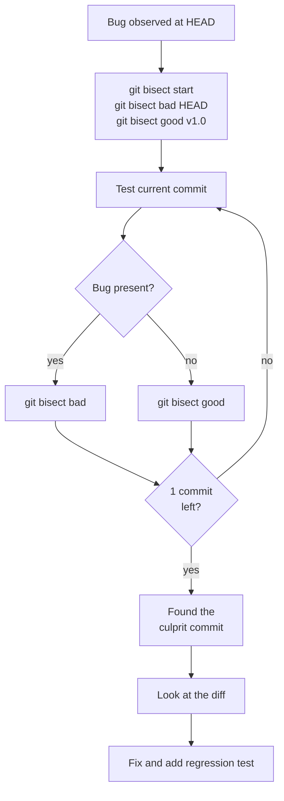
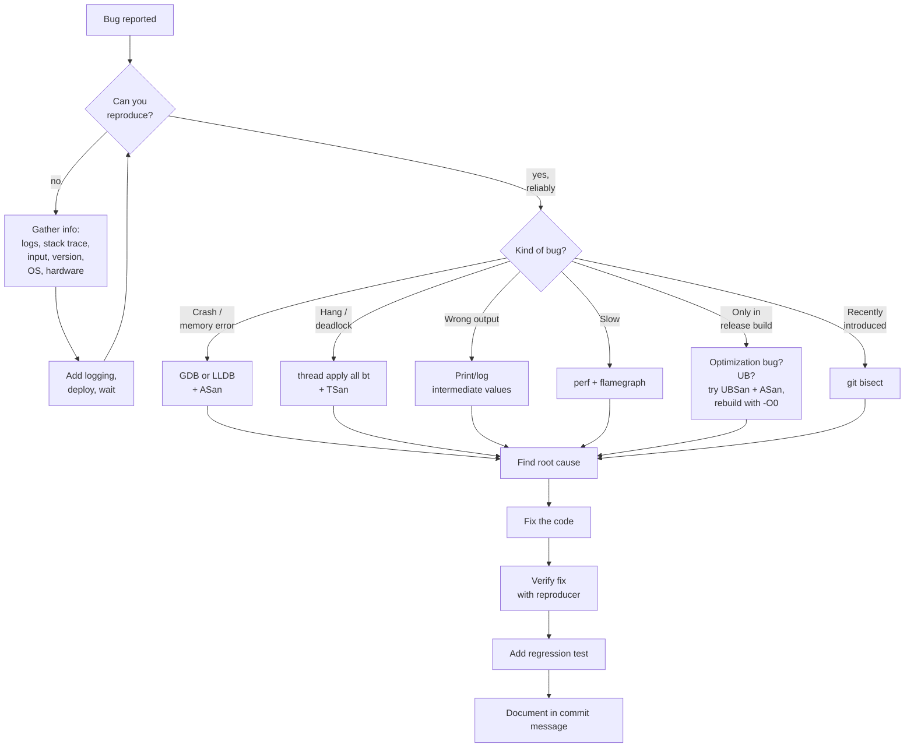

# 6. Debugging Strategies

> [!note] Why this note exists
> The tools in [[1. GDB]], [[2. LLDB]], [[3. Valgrind]], [[4. Sanitizers (ASan, UBSan, TSan)]] and [[5. perf and Flamegraphs]] tell you *what* and *where*. But *how* you approach a bug — the order in which you investigate, the hypotheses you form, the discipline you apply — matters as much as the tools. This note covers the higher-level process: reproducing bugs, bisecting with git, the rubber-duck method, divide-and-conquer, logging strategies, assertions, postmortem debugging, and a debugging decision tree.

## Why It Matters

A junior developer with GDB can spend three days chasing a bug that a senior developer with the same GDB fixes in an hour. The difference is not tool familiarity — it's *strategy*. Good strategy:

- Narrows the search space systematically, not randomly.
- Generates hypotheses that are testable.
- Recognizes the most common failure patterns and skips straight to the likely cause.
- Knows when to stop and gather more data vs when to try a fix.
- Keeps a record so the same bug doesn't recur.

Bad strategy: randomly change things until "it works", then commit without understanding why. This produces "fixes" that don't fix the real bug, that introduce new bugs, and that prevent you from learning.

## Background

### The Bug Lifecycle

Every bug goes through stages:

1. **Introduction** — the change that created the bug (often days or weeks before detection).
2. **Latency** — the bug exists but is invisible.
3. **Detection** — the bug produces an observable failure (crash, wrong output, hang).
4. **Reproduction** — you find a way to trigger it reliably.
5. **Isolation** — you narrow down the cause.
6. **Diagnosis** — you understand why the bug happens.
7. **Fix** — you change the code.
8. **Verification** — you confirm the fix works and doesn't break anything.
9. **Regression test** — you add a test that would have caught the original bug.

Each stage has its own techniques. Most beginners over-invest in 5–7 (randomly trying fixes) and under-invest in 3–4 (reproducing and isolating). A senior developer spends most of their time on 3–4 because once you can reproduce and isolate, the fix is usually obvious.

### Reproducing Is the Hard Part

The hardest part of fixing a bug is **reproducing it**. Once you can reproduce, you can:

- Run it under GDB.
- Run it under ASan.
- Bisect with git.
- Add print statements and observe.

Without reproduction, you're working from a user's vague report ("it crashed when I clicked the button") and you have nothing. Reproduction strategies:

- **Get the exact input**, the exact binary version, the exact OS, the exact hardware.
- **Get the stack trace** if there was a crash.
- **Get the log** if logging exists.
- **Find the smallest input** that triggers it.
- **Find the smallest sequence of actions** that triggers it.

If you cannot reproduce, your options shrink to:

- Read the code and reason about it.
- Add more logging and ship a new build, then wait for the bug to recur.
- Use a fuzzer (libFuzzer, AFL) to try to trigger it automatically.

## Main Content

### Strategy 1: Binary Search / Bisecting with Git

`git bisect` is the most powerful debugging tool when the bug was introduced recently. It uses binary search over commits to find the exact one that introduced the bug.

```bash
$ git bisect start
$ git bisect bad          # current commit is broken
$ git bisect good v1.2.3  # this tag was known good
Bisecting: 50 commits left to test after this
[abc1234] Some commit message
$ # test this commit
$ git bisect good         # or: git bisect bad
Bisecting: 25 commits left...
$ # repeat until done
$ git bisect reset
```

After ~7 iterations, you've narrowed 100 commits down to 1. Then look at the diff of that commit — the bug is usually obvious.



For automated bisection:

```bash
$ git bisect start HEAD v1.0 --
$ git bisect run ./test.sh
```

`test.sh` exits 0 for "good", 1–124 for "bad", 125 for "skip". Git runs it on each commit and finds the culprit automatically.

### Strategy 2: Rubber Duck Debugging

Explain the bug, line by line, to an inanimate object (a rubber duck, a teddy bear, a coworker who isn't really listening). The act of explaining forces you to articulate your assumptions, and the wrong assumption becomes obvious.

It works because:

- Most bugs are caused by an unstated, incorrect assumption.
- Explaining forces you to state your assumptions.
- Stating them aloud reveals the wrong one.

```text
Me: So the loop iterates over the vector, and for each element...
Duck: ...
Me: ...we look up its ID in the map.
Me: Wait, the map is keyed by *name*, not ID.
Me: Oh.
```

This is not a joke. It is the single most effective debugging technique ever invented. Use it before any tool.

### Strategy 3: Divide and Conquer

When you don't know where the bug is, eliminate half the possibilities at each step:

- **Comment out half the code.** If the bug persists, it's in the other half. Repeat.
- **Disable half the modules.** Same idea.
- **Run half the input.** If a 10 GB dataset triggers the bug, try 5 GB. If yes, try 2.5 GB. Find the smallest reproducer.
- **Run on half the threads.** If a 16-thread run has the race, does 2-thread? Does 1-thread (which would mean it's not a race)?

This is **binary search applied to code or data**. It's how you find the bug in a 1 000 000-line codebase without reading all of it.

### Strategy 4: Reproduce Reliably

A bug you can reproduce is a bug you can fix. Strategies:

1. **Reduce the input.** Strip away parts until the bug stops. The last thing you removed contains the trigger.
2. **Fix the random seed.** Random bugs become deterministic.
3. **Pin the schedule.** For race conditions, use TSan; or insert `std::this_thread::sleep_for` calls to make the race more likely.
4. **Replay production traffic.** Capture real inputs and replay them.
5. **Stress test.** Run the workload 10 000 times in a loop with TSan on. Intermittent bugs become visible.

The goal: turn "this crashes once a week in production" into "this crashes every time I run `./repro.sh`".

### Strategy 5: Read Error Messages Carefully

C++ error messages are notoriously long, but the *first* line is usually the most important. Don't scroll past it.

```text
/usr/include/c++/12/bits/stl_vector.h:1123:
  constexpr reference operator[](size_type __n) noexcept {
    return *(begin() + __n);     // ← here
  }

In function 'int main()':
error: no matching function for call to 'std::vector<int>::push_back(<brace-enclosed initializer list>)'
```

The *real* error is at the bottom: "no matching function for call to `push_back`". The rest is the compiler showing you why each candidate didn't match. Read it carefully, especially the candidate signatures.

For runtime errors:

- `Segmentation fault` — null or dangling pointer, OOB access. See [[1. GDB]].
- `Assertion failed` — an `assert` fired. Look at the source line.
- `std::bad_alloc` — out of memory.
- `std::bad_cast` — invalid `dynamic_cast`.
- `std::out_of_range` — `vector::at` or `string::at` with bad index.
- `std::length_error` — exceeded `max_size()`.
- `std::system_error` from thread creation — out of resources, or trying to start a thread while another is still joinable.

### Strategy 6: Use Assertions

```cpp
#include <cassert>

int divide(int a, int b) {
    assert(b != 0 && "divide by zero");
    return a / b;
}
```

Assert liberally. Assertions document your assumptions and turn silent UB into a fast crash with a clear message. Use them for:

- Pre-conditions (input is valid).
- Post-conditions (output is valid).
- Invariants (e.g., loop invariants, class invariants).
- "This line should be unreachable" (`assert(false);` — or `__builtin_unreachable()` if you want no overhead).

```cpp
assert(index < v.size() && "index out of bounds");
assert(ptr != nullptr && "null pointer");
assert(!q.empty() && "queue should not be empty here");
```

> [!tip] Use `assert` with a message
> `assert(cond && "message")` — the string is non-null, so the assertion is `cond`. The string ends up in the error message.

> [!warning] Assertions are removed in NDEBUG builds
> `assert(...)` is a no-op when `NDEBUG` is defined (i.e., release builds). Don't use it for checks that must always run. Use `if (!cond) throw` or your own `CHECK` macro for that.

### Strategy 7: Logging Strategies

Logging is your eyes in production. Good logging:

- **Has levels** — DEBUG, INFO, WARN, ERROR. Each level can be turned on or off.
- **Is structured** — `key=value` pairs or JSON, not free text. Lets you grep by field.
- **Includes context** — `user_id=42 file=foo.csv line=1234`.
- **Is cheap** — avoid logging in hot loops; if you must, log every Nth iteration.
- **Distinguishes "expected" from "unexpected"** — log INFO for normal progress, WARN for surprising-but-recoverable, ERROR for unexpected and likely-broken.

```cpp
spdlog::info("loading config from {}", path);
spdlog::warn("retrying connection (attempt {}/3)", attempt);
spdlog::error("failed to write {}: {}", path, e.what());
```

For debugging, add temporary `LOG_DEBUG` calls around the suspect area. Run the program with `--log-level=debug`. Remove them once the bug is fixed (or keep them — debug logs in non-hot paths are cheap and invaluable next time).

### Strategy 8: Postmortem Debugging (Core Dumps)

When a program crashes in production, capture a **core dump** — a snapshot of the process's memory at the moment of the crash. Load it into GDB later.

```bash
# Enable core dumps
$ ulimit -c unlimited

# Make sure they go somewhere useful
$ sudo sysctl -w kernel.core_pattern=/var/crash/core.%e.%p.%t

# Run, crash, find the core
$ ./myprog
Segmentation fault (core dumped)
$ ls /var/crash
core.myprog.12345.1700000000

# Analyze
$ gdb ./myprog /var/crash/core.myprog.12345.1700000000
(gdb) bt
(gdb) info locals
```

With systemd, use `coredumpctl`:

```bash
$ coredumpctl list
$ coredumpctl debug 12345
$ coredumpctl info 12345
```

For services that run in containers, configure the runtime to capture cores (Docker: `--ulimit core=-1`).

### Strategy 9: The Debugging Decision Tree



### Strategy 10: Heisenbugs

A **Heisenbug** is a bug that disappears when you try to observe it. Common causes:

- The act of compiling with `-g` or `-O0` changes timing or memory layout.
- Adding a `print` statement changes timing (relevant for races).
- Running under GDB changes timing.
- ASan's allocator changes memory layout.

Strategies:

- Use TSan — it's designed to detect races without (much) timing change.
- Use a logging framework with **minimal** per-call overhead (no flushing per line).
- Log to memory, flush on exit.
- Use lock-free logging.
- Reproduce under load to make the race more likely.

### Strategy 11: Don't Fix the Symptom

A common trap: you see "occasionally, the counter is wrong", so you add a mutex. Now it's right. But why was it wrong? Because of a data race you didn't understand. The mutex fixed *this* race; the data race on the *other* shared variable is still there. You fixed the symptom, not the cause.

Always ask "why?" until you understand the root cause. Then fix the root cause. Add a test that would have caught it. Document the diagnosis in the commit message.

### Strategy 12: When Stuck, Take a Break

The subconscious solves problems. If you've been staring at the same bug for two hours, take a 20-minute walk. Often the answer comes unbidden. This is not laziness — it's how the brain works.

## Code Examples

### A reproducer script

```bash
#!/bin/bash
# repro.sh — minimal reproducer for the bug
set -e
cd /tmp
rm -rf repro && mkdir repro && cd repro
cat > main.cpp <<'EOF'
#include <vector>
#include <thread>
int counter = 0;
void bump() { for (int i = 0; i < 100000; ++i) ++counter; }
int main() {
    std::thread t1(bump), t2(bump);
    t1.join(); t2.join();
    return counter == 200000 ? 0 : 1;
}
EOF
g++ -g -O1 -fsanitize=thread main.cpp -o repro
./repro
```

Run it; if it returns non-zero, the bug is reproduced. Use this in `git bisect run`.

### Assertion with context

```cpp
#include <cassert>
#include <format>

template <class T>
T pop(std::vector<T>& v) {
    assert(!v.empty() && "pop() on empty vector");
    T x = std::move(v.back());
    v.pop_back();
    return x;
}
```

### A custom CHECK macro (always-on)

```cpp
[[noreturn]] void check_failed(const char* file, int line, const std::string& msg) {
    std::cerr << file << ':' << line << ": CHECK failed: " << msg << '\n';
    std::abort();
}

#define CHECK(cond, msg) \
    do { if (!(cond)) ::check_failed(__FILE__, __LINE__, msg); } while (0)

int divide(int a, int b) {
    CHECK(b != 0, "divide by zero");
    return a / b;
}
```

`CHECK` runs in release builds too, unlike `assert`.

### Logging with spdlog

```cpp
#include <spdlog/spdlog.h>

void process(const Request& r) {
    spdlog::debug("processing request id={} user={}", r.id, r.user_id);
    try {
        do_work(r);
    } catch (const std::exception& e) {
        spdlog::error("request {} failed: {}", r.id, e.what());
        throw;
    }
    spdlog::info("request {} done", r.id);
}
```

### GDB on a core dump

```bash
$ ulimit -c unlimited
$ ./myprog
Segmentation fault (core dumped)
$ gdb ./myprog core
(gdb) bt
(gdb) frame 3
(gdb) info locals
(gdb) print *ptr
```

### git bisect run with a script

```bash
$ cat > test.sh <<'EOF'
#!/bin/bash
make -j8 || exit 125    # skip if build fails
./run_tests || exit 1   # bad if tests fail
exit 0                  # good
EOF
$ chmod +x test.sh
$ git bisect start HEAD v1.0 --
$ git bisect run ./test.sh
```

### Fuzzing with libFuzzer

```cpp
// fuzz_target.cpp
#include <cstdint>
#include <cstddef>

extern "C" int LLVMFuzzerTestOneInput(const uint8_t* data, size_t size) {
    if (size < 4) return 0;
    int n = *reinterpret_cast<const int*>(data);  // deliberate unsafe read
    return n > 0;
}
```

```bash
$ clang++ -g -O1 -fsanitize=address,fuzzer fuzz_target.cpp -o fuzz
$ ./fuzz
# runs forever, finds inputs that crash
```

Combine with sanitizers for the modern bug-finding stack.

## Common Pitfalls

> [!danger] Pitfall 1 — Fixing the symptom
> "It works now" without understanding why. The bug will recur in a different form. Always find the root cause.

> [!danger] Pitfall 2 — Not reproducing
> "I think the fix is this — let's deploy and see." You can't verify the fix without a reproducer. You also can't add a regression test.

> [!danger] Pitfall 3 — Random changes
> "Let's try adding a sleep here." That's not debugging — that's guessing. Generate a hypothesis, test it, observe.

> [!danger] Pitfall 4 — Skipping the regression test
> Fixed the bug? Add a test that fails without the fix and passes with it. Otherwise the bug comes back in six months.

> [!danger] Pitfall 5 — Debugging optimized code
> Optimized binaries lie: variables are "optimized out", lines jump around. Always debug `-O0` or `-Og` builds. See [[1. GDB]].

> [!danger] Pitfall 6 — Not reading the error message
> The compiler/runtime is telling you what's wrong. Read the *first* line carefully before scrolling.

> [!danger] Pitfall 7 — Working from a vague report
> "It crashed." Get the input, the version, the OS, the stack trace. Without details, you're guessing.

> [!danger] Pitfall 8 — Tunnel vision
> You're sure the bug is in module X. You spend two days on X. The bug is in module Y. Step back, bisect, divide-and-conquer.

> [!danger] Pitfall 9 — Forgetting to commit before experimenting
> Make a checkpoint commit before a big experimental change. `git stash` if you want to abandon it.

> [!danger] Pitfall 10 — Letting the same bug class recur
> If you fixed a use-after-free, audit the codebase for similar patterns. Add a sanitizer check to CI.

## Tips and Tricks

- **Reproduce first.** Everything else is downstream of this.
- **Reduce the reproducer.** Smallest input, smallest sequence, fewest threads.
- **Bisect with git** when the bug is recent. It's almost free and incredibly effective.
- **Rubber-duck every bug** before reaching for a tool. 50% of bugs die at this stage.
- **Read the first line of the error message.** Then the second. Don't skim.
- **Assert liberally** in debug builds. Add `CHECK` macros for always-on checks.
- **Log structured data**, not free text. You'll want to grep by field.
- **Capture core dumps** in production. They're free until you need them.
- **Use sanitizers in CI** — see [[4. Sanitizers (ASan, UBSan, TSan)]].
- **Add a regression test for every fixed bug.**
- **Document the diagnosis** in the commit message — future-you will thank you.
- **Take breaks**. The subconscious solves problems.
- **Pair-debug**. Two people on a bug find it faster than one.
- **Keep a "lessons learned" file** for recurring bug classes in your codebase.
- **When stuck, simplify.** Strip features until the bug is obvious.
- **Use `git bisect run`** with a script — fully automated bisection.
- **For Heisenbugs**, use TSan, lock-free logging, and stress testing.
- **Don't fix production bugs in production.** Reproduce locally, fix, verify, deploy.

## Active Recall

1. Name the nine stages of the bug lifecycle. Which one is hardest for most developers?
2. What is `git bisect`? Write the commands to bisect between `HEAD` (broken) and `v1.0` (good).
3. What is rubber-duck debugging and why does it work?
4. What is divide-and-conquer debugging? Give an example.
5. Why might a bug be a "Heisenbug"? List three causes.
6. What's the difference between `assert` and a `CHECK` macro? When would you use each?
7. What should every bug fix include beyond the code change?
8. Why is reproducing the bug the most important step?
9. What is a core dump? How do you load it in GDB?
10. Give three things to include in a good commit message for a bug fix.

## Next Steps

- Read [[1. GDB]] and [[2. LLDB]] — the tools you'll use most.
- Read [[4. Sanitizers (ASan, UBSan, TSan)]] — the best prevention.
- Read [[3. Valgrind]] — for cases sanitizers can't handle.
- Read [[5. perf and Flamegraphs]] — for "slow" bugs.
- Cross-reference [[14. Concurrency and Multithreading/1. Introduction to Multithreading]] — concurrency bugs need special strategies.
- Cross-reference [[13. Error Handling and Exceptions/1. Error Handling Strategies]] — bugs and error handling are intertwined.
- Read "The Pragmatic Programmer" (Hunt & Thomas) — chapters on debugging.
- Read "Why Programs Fail" (Andreas Zeller) — the canonical academic book on debugging.
