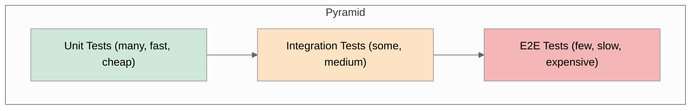
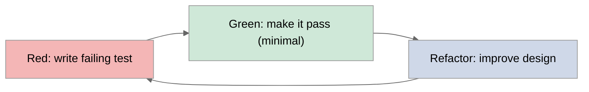
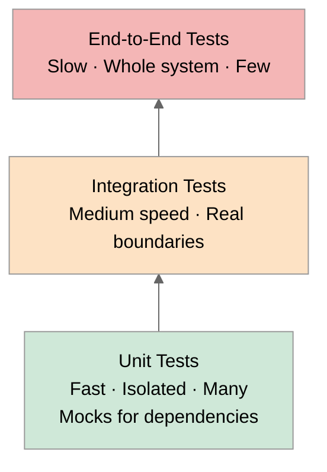
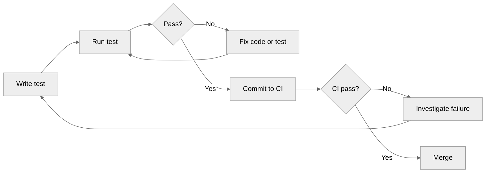
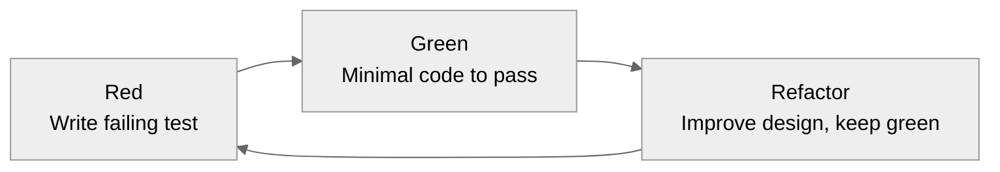

# 1. Testing Concepts

> [!info] Chapter map
> This note establishes the vocabulary and mental models that the rest of the chapter relies on. The next three notes go concrete: [[2. Google Test]], [[3. Catch2]], and [[4. Mocking with gMock]]. If you skip this umbrella note, the framework-specific notes will still execute, but you will not understand *why* you are writing tests in a particular shape.

## Why This Matters

Software without tests is a fossil. It might look complete, but the moment you try to change anything, it crumbles — silently, in production, at 3 a.m. Testing is not a moral virtue imposed by process engineers; it is the **mechanical substrate that makes change cheap**. Without tests, every change is a gamble. With tests, every change is a measured experiment.

In C++ specifically, testing has higher leverage than in dynamically-typed languages because the compiler catches type errors but cannot catch:

- Logic errors inside correctly-typed functions.
- Off-by-one errors in index arithmetic.
- Resource leaks that compile cleanly.
- Concurrency bugs that only manifest under particular thread interleavings.
- API regressions when refactoring a public interface.

A well-tested C++ codebase has a "green bar" you can return to in seconds. A poorly tested codebase has developers who fear refactoring and who manually re-run the application after every change to "make sure it still works." The cost difference between those two organizations is enormous — measured in features shipped per quarter, not in lines of code.

This note covers the universal vocabulary: test types, test pyramid, AAA, TDD, BDD, coverage, property-based testing, and fuzzing. The framework notes apply these concepts using specific tools.

## Background

### A brief history of automated testing

Automated testing as a discipline emerged in the late 1980s and 1990s. Kent Beck's **SUnit** (Smalltalk, 1989) is generally credited as the first xUnit framework. It begat **JUnit** (Java, 1997 by Beck and Erich Gamma), which in turn inspired **CppUnit** (C++, 2000), **NUnit** (.NET), **pytest** (Python), and dozens of others. The shared pattern — `setUp`, `tearDown`, `assert`, test runner reporting — is now so universal that it is almost invisible.

C++ testing had a slower start because of header/source separation, weak reflection, and slow compile times. **CppUnit** was heavyweight. **Boost.Test** (early 2000s) was the first major modern C++ test framework. **Google Test** (2008) became the de facto standard through Google's internal gravity and good ergonomics. **Catch** (2010) and its successor **Catch2** (2017) challenged the model with single-header simplicity and BDD-friendly syntax. **doctest** (2018) is the current champion of compile speed.

### What a test actually is

A test is a small program with three properties:

1. **Deterministic.** Given the same inputs and same environment, it produces the same result.
2. **Isolated.** It does not depend on the order in which tests run or on shared mutable state from other tests.
3. **Self-checking.** It emits a binary pass/fail signal without human inspection.

If any of these three properties break, you do not have a test — you have a flaky, coupled, or manual verification step. Most testing pain in industry comes from violating one of these three properties, not from picking the wrong framework.

## Main Content

### Levels of testing

Tests are typically stratified by scope. Each level catches different bugs and has different costs.

#### Unit tests

A **unit test** exercises the smallest meaningful unit of code — usually a single function or class — in isolation. "Isolation" means all of the unit's dependencies (collaborators, databases, network, filesystem, clock) are replaced with **test doubles** (stubs, fakes, mocks). See [[4. Mocking with gMock]] for the full taxonomy.

Unit tests should:
- Run in microseconds. Hundreds of thousands of them should complete in under a minute.
- Be parallel-safe.
- Have no I/O (no disk, no network, no DB).
- Fail with a clear message pointing at the unit under test.

#### Integration tests

An **integration test** exercises the boundaries between units. It may talk to a real database (in a container), a real filesystem, or a real HTTP server. Integration tests are slower (milliseconds to seconds) and may not be parallel-safe.

The classic integration test catches "contract mismatches" — Unit A thinks the JSON has a field `userId`, Unit B serializes it as `user_id`. The unit tests for both pass; only the integration test exposes the bug.

#### End-to-end (E2E) tests

An **E2E test** drives the entire system from the outside — typically through the HTTP API or the GUI — and asserts on observable behavior. These tests are slow (seconds to minutes), brittle (a single CSS selector change can break 50 tests), and expensive to maintain. They are also uniquely valuable: they are the only tests that prove the entire system, wired together, does what the user expects.

#### Other levels

- **Smoke tests**: a tiny subset of E2E tests run on every deploy to verify the system boots and serves basic traffic.
- **Regression tests**: tests added specifically to lock in a bug fix so the bug cannot recur.
- **Performance tests**: tests that assert on latency, throughput, or memory usage with statistical rigor.
- **Mutation tests**: a meta-testing technique (see below) that verifies your tests actually catch bugs.

### The test pyramid

The **test pyramid** (Mike Cohn, *Succeeding with Agile*, 2009) is a heuristic for the ratio of test types. The original pyramid has three layers:

- **Bottom (many):** unit tests.
- **Middle (some):** integration / service tests.
- **Top (few):** end-to-end / UI tests.

The reasoning is purely economic. Unit tests are cheap to write, fast to run, and cheap to maintain. E2E tests are expensive in all three dimensions. A codebase with a thousand E2E tests and no unit tests is a codebase where the build takes four hours and every test failure requires an archaeologist.

The pyramid has been criticized (the "testing trophy" by Guillermo Rauch emphasizes integration tests, and the "honeycomb" by Spotify is a similar variant), but the underlying principle — **cheaper tests should be more numerous** — remains true.



#### Inverted pyramid anti-pattern

A codebase whose test distribution is **inverted** (mostly E2E, few unit tests) is the most common pathology. Symptoms:
- CI takes 30+ minutes.
- 80% of test failures are flaky (timing, network, missing test data).
- Developers stop trusting CI and merge anyway.
- Bug fixes introduce regressions because the E2E layer cannot cover all branches.

The cure is to push tests down the pyramid: replace each E2E test with several integration tests plus several unit tests covering the same logical paths.

### The AAA pattern (Arrange-Act-Assert)

Almost every good unit test follows the AAA structure:

1. **Arrange** — set up the inputs and collaborators the test needs.
2. **Act** — invoke the unit under test, exactly once.
3. **Assert** — verify the observable result and any side effects.

A canonical example in Catch2 (see [[3. Catch2]]):

```cpp
TEST_CASE("Vector push_back increases size and stores value") {
    // Arrange
    std::vector<int> v{1, 2, 3};

    // Act
    v.push_back(42);

    // Assert
    REQUIRE(v.size() == 4);
    REQUIRE(v.back() == 42);
}
```

Many teams enforce AAA with **blank lines** or **comments** (`// Arrange`, `// Act`, `// Assert`). Some enforce it with structural rules: one assertion per test (debatable), or "the act line should be exactly one statement" (more useful). The point is that a test reader should be able to find the act line in under three seconds.

#### The single-act rule

A test with multiple "act" statements is usually testing multiple behaviors and should be split. For example:

```cpp
// BAD: two acts in one test
TEST_CASE("User can register and log in") {
    auto user = register_user("alice", "p@ss");
    REQUIRE(user.id() != 0);            // assert on register
    auto session = login("alice", "p@ss"); // second act
    REQUIRE(session.is_valid());         // assert on login
}
```

If `register_user` is broken, both tests fail, but the failure message points at the first assertion, masking the real cause. Splitting into `User_can_register` and `User_can_login` localizes the failure.

### Test-Driven Development (TDD)

TDD is a development discipline, not a testing technique. The discipline is:

1. **Red** — write a failing test that describes the behavior you want to add.
2. **Green** — write the minimum code to make the test pass.
3. **Refactor** — improve the code without changing behavior, keeping the test green.

Repeat. The cycle should take minutes, not hours.



#### Why TDD works

- **Forces testability.** If a function is hard to test, you find out before writing it, not after.
- **Provides immediate feedback.** You see the test fail (confirming it actually exercises the code), then see it pass (confirming your implementation works).
- **Encourages small steps.** Big-bang implementations hide bugs; TDD forces incremental progress.
- **Produces a regression suite for free.** Every line of production code is paired with at least one test.

#### TDD criticisms

- "TDD leads to over-mocked designs." True if applied dogmatically. The cure is to mock at architectural seams, not at every class boundary.
- "TDD does not find missing features." Correct. TDD proves the code does what the tests say; it does not prove the tests describe what the user needs.
- "TDD slows you down." Initially, yes. After 6 months, a TDD codebase ships faster than a non-TDD codebase because refactoring is safe.

### Behavior-Driven Development (BDD)

BDD (Dan North, 2006) reframes TDD in business-readable language. The canonical structure is **Given / When / Then**:

- **Given** some precondition (an existing user, an empty cart).
- **When** some event happens (the user clicks "checkout").
- **Then** some outcome should be observed (the cart is empty, an order is created).

In C++, Catch2 supports BDD syntax directly:

```cpp
SCENARIO("Cart checkout", "[cart]") {
    GIVEN("an empty cart") {
        Cart cart;
        REQUIRE(cart.is_empty());

        WHEN("the user adds an item") {
            cart.add(Item{"Book", 1, 1299});
            REQUIRE(!cart.is_empty());
            REQUIRE(cart.total_cents() == 1299);

            THEN("checking out empties the cart") {
                auto order = cart.checkout();
                REQUIRE(cart.is_empty());
                REQUIRE(order.total_cents() == 1299);
            }
        }
    }
}
```

BDD's real value is in **shared vocabulary with non-developers**. A product manager can read the `SCENARIO` block and confirm it matches the requirement. The downside is verbosity: a single BDD scenario often compiles into many nested `SECTION`s, which can produce combinatorial test paths.

For C++-specific BDD with truly business-readable specs, look at **Cucumber-C++** or **SpecForC++**, though adoption is low.

### Coverage metrics

**Coverage** measures which lines, branches, or conditions your tests executed. It is a useful **negative signal** (100% coverage does not mean good tests, but 30% coverage means you are definitely under-tested) and a terrible **positive target** (chasing 100% coverage produces pointless tests).

Coverage flavors, from weakest to strongest:

#### Line coverage

The fraction of source lines executed by the test suite. Easy to measure, easy to game. A line with `if (a && b)` counts as covered even if only `a` was true.

```bash
# gcov / lcov workflow
g++ -O0 --coverage -fprofile-arcs -ftest-coverage src.cpp -o app
./app
gcov src.cpp
lcov --capture --directory . --output-file coverage.info
genhtml coverage.info --output-directory out
```

#### Branch coverage

The fraction of control-flow branches (true and false outcomes of each `if`, `?`, `&&`, `||`, `case`) that were exercised. Catches the `if (a && b)` weakness above. Default in LLVM's `llvm-cov`.

#### MC/DC (Modified Condition / Decision Coverage)

Required by aviation (DO-178C) and automotive (ISO 26262) safety standards. A condition is **independently affecting** the decision if flipping only that condition (holding all others fixed) flips the decision. MC/DC requires that for every condition in every decision, you have at least two test cases that prove its independent effect.

For `if (a || b)`:
- Test 1: `a=false, b=false` → decision false.
- Test 2: `a=true,  b=false` → decision true (proves `a` matters).
- Test 3: `a=false, b=true`  → decision true (proves `b` matters).

Three tests achieve MC/DC where two tests would achieve branch coverage.

#### Coverage in practice

- Target **80% line coverage** as a CI gate for new code. Below 80%, you are shipping bugs.
- Target **70% branch coverage** for safety-critical modules.
- **Never make 100% coverage a hard gate.** It produces tests like `REQUIRE(1 == 1)` to satisfy the metric.
- Use coverage as a *discovery tool*: "I wrote tests for X, why is line 42 uncovered?" Usually, it is an error-handling branch that you forgot to test.

### Property-based testing

**Property-based testing** (PBT), popularized by Haskell's **QuickCheck** (Claessen & Hughes, 2000), inverts the example-based testing model. Instead of writing:

```cpp
REQUIRE(reverse(reverse({1,2,3})) == std::vector{1,2,3});
REQUIRE(reverse(reverse({})) == std::vector<int>{});
REQUIRE(reverse(reverse({42})) == std::vector{42});
```

you write a *property*:

```cpp
FOR_ANY(vector<int> v) {
    REQUIRE(reverse(reverse(v)) == v);  // double-reverse is identity
}
```

The framework generates hundreds of random `v` values and checks the property for each. If a counterexample is found, the framework **shrinks** it to a minimal failing case (e.g., `{5}` instead of a 1000-element random vector).

In C++, the main PBT libraries are:
- **RapidCheck** — QuickCheck-style, integrates with Catch2 and Google Test.
- **boost::property_tree** (limited).
- **Cspec** (less mature).

```cpp
#include <rapidcheck.h>
#include <catch2/catch_test_macros.hpp>

TEST_CASE("reverse is involutive") {
    rc::check("reverse(reverse(v)) == v", [](const std::vector<int>& v) {
        REQUIRE(reverse(reverse(v)) == v);
    });
}
```

PBT shines for:
- Pure functions with algebraic laws (math, serialization round-trips, container operations).
- Stateful systems via "state-machine testing" (RapidCheck supports this).
- Finding edge cases you would not think to test (empty containers, max-size integers, NaN propagation).

### Fuzzing

**Fuzzing** is automated test generation where a tool (the **fuzzer**) feeds mutated inputs to a program and watches for crashes, leaks, or undefined behavior. Modern fuzzing is **coverage-guided**: the fuzzer instruments the binary, measures which inputs reach new code, and mutates those inputs to explore further.

C++ has best-in-class fuzzing support via **libFuzzer** (LLVM) and **AFL++**:

```cpp
#include <cstdint>
#include <cstddef>

extern "C" int LLVMFuzzerTestOneInput(const uint8_t* data, size_t size) {
    // Entry point: the fuzzer calls this millions of times with random data.
    if (size < 4) return 0;
    int x = *reinterpret_cast<const int*>(data);  // (use std::memcpy in real code)
    // Call the function under test
    my_parser(std::string_view(reinterpret_cast<const char*>(data + 4), size - 4));
    return 0;
}
```

```bash
clang++ -fsanitize=fuzzer,address -g -O1 fuzz_target.cpp -o fuzz
./fuzz -max_total_time=60  # run for 60 seconds
```

Fuzzing finds:
- Buffer overflows (`-fsanitize=address`).
- Signed integer overflow (`-fsanitize=undefined`).
- Memory leaks (`-fsanitize=leak`).
- Logic bugs via assertions (`assert(...)` in production code).

#### Fuzzing vs property-based testing

They overlap but are not identical:
- **PBT** generates *structured* inputs (e.g., valid JSON, a sorted vector) and checks *properties*.
- **Fuzzing** generates *arbitrary* byte streams and checks for *crashes*.

Use both: PBT for correctness, fuzzing for robustness.

#### Continuous fuzzing

For open-source projects, **OSS-Fuzz** (Google) runs libFuzzer continuously on thousands of C++ projects and reports bugs upstream. Notable catches include CVEs in libpng, SQLite, FFmpeg, and many protobuf decoders.

## Mermaid Diagrams

### Test pyramid (vertical layout)



### Test lifecycle



### TDD microcycle



## Code Examples

### A simple unit test skeleton (Google Test)

```cpp
#include <gtest/gtest.h>
#include "calculator.h"

TEST(Calculator, AddReturnsSumOfTwoIntegers) {
    Calculator c;
    ASSERT_EQ(c.add(2, 3), 5);
}

TEST(Calculator, DivideByZeroThrows) {
    Calculator c;
    EXPECT_THROW(c.divide(10, 0), std::invalid_argument);
}
```

### Running tests with CTest

```cmake
# CMakeLists.txt
add_executable(unit_tests test_calculator.cpp)
target_link_libraries(unit_tests PRIVATE gtest_main calculator_lib)

include(GoogleTest)
gtest_discover_tests(unit_tests)
enable_testing()
```

```bash
cmake -B build && cmake --build build
cd build && ctest --output-on-failure
```

### Property-based test (RapidCheck + Catch2)

```cpp
#include <rapidcheck.h>
#include <catch2/catch_test_macros.hpp>
#include <vector>
#include <algorithm>

TEST_CASE("std::sort is idempotent") {
    rc::check([](std::vector<int> v) {
        auto sorted_once = v;
        std::sort(sorted_once.begin(), sorted_once.end());
        auto sorted_twice = sorted_once;
        std::sort(sorted_twice.begin(), sorted_twice.end());
        REQUIRE(sorted_once == sorted_twice);
    });
}
```

## Common Pitfalls

> [!warning] Pitfalls
> - **Testing implementation, not behavior.** Tests that assert on private methods or internal state break on every refactor. Test the public interface.
> - **Flaky tests.** A test that passes 95% of the time is worse than no test — it trains the team to ignore CI. Hunt down every source of nondeterminism: real clocks, real network, `sleep`, shared files.
> - **Test interdependence.** Test A must run before test B. This usually means shared static state. Use a fresh fixture per test (`TEST_F` in Google Test, fresh `SECTION` in Catch2).
> - **Giant tests.** A 200-line test with 30 assertions is unreadable. Split by behavior; one logical assertion per test.
> - **Mocking everything.** Excessive mocking means tests verify that the code calls the mocks in the expected order — but not that the system actually works. See [[4. Mocking with gMock]].
> - **Commenting out failing tests.** Never. Either fix the test, fix the code, or delete the test with a recorded reason.
> - **Chasing 100% coverage.** You will write tests like `REQUIRE(destructor_runs)` that test the compiler, not your code.
> - **No naming convention.** `test1`, `test2`, `MyTest` tell the reader nothing. Name tests as sentences: `AddReturnsSum`, `EmptyCartRejectsCheckout`.

## Tips and Tricks

> [!tip] Tips
> - **Use descriptive test names as documentation.** A test list should read like a spec: `ParseRejectsMalformedJson`, `LoginFailsAfterThreeAttempts`, `CacheEvictsOldestWhenFull`.
> - **One assert per test** is a strong default. Multiple asserts are acceptable when they describe a single behavior (e.g., "after checkout, the cart is empty AND an order exists").
> - **Tag your tests.** Catch2 `[cart][slow]`, Google Test `--[gtest_filter=Cart.*`. Use tags to run smoke tests in 10 seconds and the full suite nightly.
> - **Test the boundary.** Off-by-one errors live at `0`, `1`, `N-1`, `N`, `SIZE_MAX`. Always include these.
> - **Test error paths.** Most bugs are in error handling, not in happy paths. If your happy path has 80% coverage and your error paths have 20%, your tests are useless.
> - **Fast tests are a feature.** If your unit test suite takes > 60 seconds, developers will stop running it locally and rely only on CI, doubling the inner-loop latency.
> - **Snapshot testing for serializers.** For complex output (JSON, XML, generated code), compare against a checked-in golden file. Catch2 has `Catch::Matchers::Equals`; Google Test has `EXPECT_EQ` against a string literal. Update the snapshot deliberately, not accidentally.
> - **Time-travel in tests.** Inject a clock (a `std::function<TimePoint()>` or a `Clock` interface). Never call `std::time(nullptr)` directly in production code; you will never be able to test expiry logic.
> - **Use `--gtest_repeat=1000 --gtest_shuffle`** to flush out flaky tests before they ship.

## Active Recall

1. Name the three properties a real test must have.
2. Why is the test pyramid shaped the way it is? What does an inverted pyramid indicate?
3. Write the AAA pattern as comments inside a hypothetical test for `std::vector::push_back`.
4. What is the difference between TDD and BDD? Can you do both?
5. List the four coverage metrics in order from weakest to strongest. Why is MC/DC required by aviation standards?
6. Why is "100% coverage" a bad target?
7. What does a property-based test framework do when it finds a failing input? Why is this valuable?
8. What is the difference between fuzzing and property-based testing?
9. Why is `sleep(1)` in a test a red flag? What should you replace it with?
10. Why is mocking everything considered an anti-pattern?

## Next Steps

- Continue to [[2. Google Test]] to learn the most widely-used C++ test framework's syntax, fixtures, parameterized tests, and CMake integration.
- Then [[3. Catch2]] for the single-header alternative with BDD syntax and generators.
- Then [[4. Mocking with gMock]] for dependency injection and behavior verification.
- Cross-link to [[15. Debugging and Profiling/1. Debugging Techniques with GDB]] — failing tests are the most common entry point into the debugger.
- Cross-link to [[12. Build Systems and Project Structure/3. CMake Deep Dive]] — CTest integration is part of the build.
- Cross-link to [[18. Software Engineering Practices/7. Code Quality and Refactoring]] — tests are what make refactoring safe.
