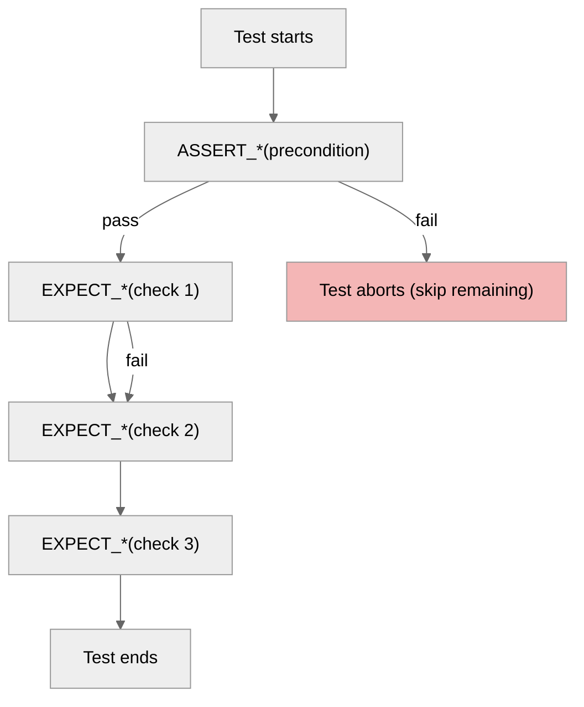
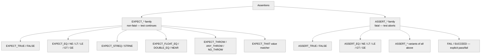
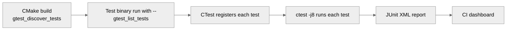
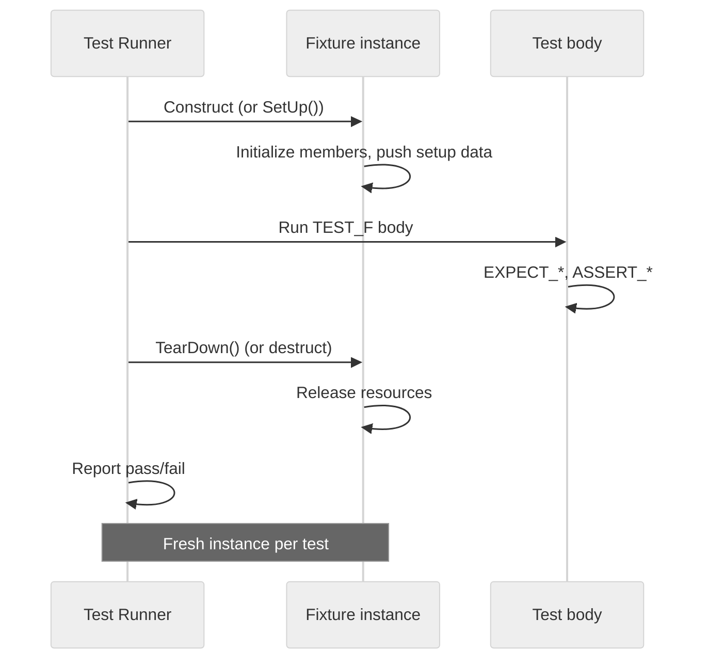

# 2. Google Test

> [!info] Where this fits
> This note is the operational manual for **Google Test** (a.k.a. `gtest`), the most widely used C++ test framework. It assumes you have read [[1. Testing Concepts]] for the vocabulary (unit test, AAA, TDD). For comparison and BDD syntax, see [[3. Catch2]]. For mocking, see [[4. Mocking with gMock]] — `gmock` ships with `gtest` and the two are designed to interoperate.

## Why This Matters

Google Test is the lingua franca of C++ testing. It is the framework used by the LLVM project, the Abseil libraries, Chromium, OpenCV, Protocol Buffers, and the C++ Standard Library implementations at libstdc++ and libc++. If you contribute to any major C++ project, you will encounter `gtest`. Knowing it is not optional.

The framework's design reflects two strong opinions:

1. **Assertions are macros.** This makes line-number reporting trivial (the macro expands to `__FILE__`, `__LINE__`) but produces ugly compiler errors when assertions fail to compile.
2. **Tests should be isolated.** `gtest` creates a fresh fixture instance per test by default. There is no shared mutable state across tests, which eliminates an entire class of flakiness.

The macro-heavy design is sometimes mocked as "C with classes", but it solves a real problem: C++ has weak reflection, so test discovery and assertion reporting must rely on the preprocessor. The result is a framework that is portable across compilers, embedded-friendly (with care), and produces structured XML/JSON output that every CI system understands.

## Background

Google Test was released in 2008 by Zhanyong Wan based on internal Google use dating back to ~2004. It was originally coupled to Google's internal build system and gradually open-sourced. The companion **gMock** was merged into the same repository around 2015. As of 2022, the project lives at `github.com/google/googletest` and ships as a single combined library.

Key historical milestones:
- **2008:** First public release.
- **2010:** `TEST_P` parameterized tests.
- **2013:** `TYPED_TEST` and `TYPED_TEST_P` for type-parameterized tests.
- **2015:** gMock merged into the same repository.
- **2018:** `GTEST_SKIP()` macro for runtime skips.
- **2021:** Header refactor (`gtest/gtest.h` now strictly contains what it needs; `gmock/` is separate).
- **2023:** C++14 minimum required (C++11 dropped).

The framework's evolution has been deliberately conservative. Breaking changes are rare; the test suite you wrote in 2015 will likely still compile today.

## Main Content

### The `TEST()` macro

The simplest test is one macro call:

```cpp
#include <gtest/gtest.h>

int Add(int a, int b) { return a + b; }

TEST(AddTest, HandlesPositiveNumbers) {
    EXPECT_EQ(Add(2, 3), 5);
}

TEST(AddTest, HandlesNegativeNumbers) {
    EXPECT_EQ(Add(-1, -1), -2);
}

TEST(AddTest, HandlesZero) {
    EXPECT_EQ(Add(0, 0), 0);
    EXPECT_EQ(Add(5, 0), 5);
}
```

The first argument to `TEST()` is the **test suite name** (formerly "test case name"); the second is the **test name**. Together they form a fully-qualified identifier `TestSuiteName.TestName`. The framework reports each test individually, so a failure in `AddTest.HandlesNegativeNumbers` does not affect `AddTest.HandlesZero`.

Naming conventions:
- Suite name: usually the class or function under test (`AddTest`, `CartService`).
- Test name: the behavior being verified, phrased as a sentence (`HandlesZero`, `ReturnsErrorOnEmptyInput`).

### Assertions: `EXPECT_*` vs `ASSERT_*`

`gtest` provides two families of assertions:

| Family        | Behavior on failure                                  | Use case                          |
| ------------- | ---------------------------------------------------- | --------------------------------- |
| `EXPECT_*`    | Records failure, continues executing the test.       | Multiple independent checks.      |
| `ASSERT_*`    | Records failure, immediately aborts the test.        | Pre-conditions; later asserts depend on this. |

```cpp
TEST(VectorTest, PushBackGrowsVector) {
    std::vector<int> v;
    ASSERT_TRUE(v.empty());        // precondition: if this fails, the rest is meaningless
    v.push_back(42);
    EXPECT_EQ(v.size(), 1);        // check 1
    EXPECT_EQ(v[0], 42);           // check 2 — both run even if check 1 fails
}
```

A useful heuristic: **`ASSERT_*` for setup, `EXPECT_*` for assertions.** If a setup step fails (e.g., the file could not be opened), all downstream assertions would crash; `ASSERT_*` prevents that.



### Common assertion macros

| Macro                            | Checks                                |
| -------------------------------- | ------------------------------------- |
| `EXPECT_TRUE(x)`                 | `x` is truthy                         |
| `EXPECT_FALSE(x)`                | `x` is falsy                          |
| `EXPECT_EQ(a, b)`                | `a == b`                              |
| `EXPECT_NE(a, b)`                | `a != b`                              |
| `EXPECT_LT(a, b)`                | `a < b`                               |
| `EXPECT_LE(a, b)`                | `a <= b`                              |
| `EXPECT_GT(a, b)`                | `a > b`                               |
| `EXPECT_GE(a, b)`                | `a >= b`                              |
| `EXPECT_STREQ(a, b)`             | C-strings equal                       |
| `EXPECT_STRNE(a, b)`             | C-strings not equal                   |
| `EXPECT_FLOAT_EQ(a, b)`          | Floats nearly equal (4 ULPs)          |
| `EXPECT_DOUBLE_EQ(a, b)`         | Doubles nearly equal (4 ULPs)         |
| `EXPECT_NEAR(a, b, abs_error)`   | `|a-b| <= abs_error`                  |
| `EXPECT_THROW(expr, ExceptionT)` | `expr` throws `ExceptionT`            |
| `EXPECT_ANY_THROW(expr)`         | `expr` throws something               |
| `EXPECT_NO_THROW(expr)`          | `expr` does not throw                 |
| `EXPECT_THAT(value, matcher)`    | gMock matcher (very powerful)         |

There is an `ASSERT_` variant of every `EXPECT_` macro.

For floating-point, **never use `EXPECT_EQ`** on `float` or `double` — bit-exact comparison of floats almost never does what you want. Use `EXPECT_FLOAT_EQ` / `EXPECT_DOUBLE_EQ` (4-ULP tolerance) or `EXPECT_NEAR` for explicit tolerance.

### Custom failure messages

Every assertion accepts a stream-style message via `<<`:

```cpp
EXPECT_EQ(v.size(), 3) << "Expected vector of size 3, got " << v.size()
                       << "; contents: " << print(v);
```

The message appears in the failure report, which is the primary debugging artifact when CI fails. Always include enough context to localize the failure without re-running.

### Test fixtures: `TEST_F()`

A **fixture** is a class that holds setup logic shared across multiple tests. Each test gets a fresh instance of the fixture class.

```cpp
class StackTest : public ::testing::Test {
protected:
    void SetUp() override {
        s_.push(1);
        s_.push(2);
        s_.push(3);
    }

    void TearDown() override {
        // Cleanup if needed (RAII usually handles it)
    }

    Stack<int> s_;
};

TEST_F(StackTest, TopReturnsLastPushed) {
    EXPECT_EQ(s_.top(), 3);
}

TEST_F(StackTest, PopReducesSize) {
    s_.pop();
    EXPECT_EQ(s_.size(), 2);
}

TEST_F(StackTest, PopReturnsLastPushed) {
    EXPECT_EQ(s_.pop(), 3);
    EXPECT_EQ(s_.pop(), 2);
}
```

The contract:
- `SetUp()` runs **before** the body of every `TEST_F`.
- `TearDown()` runs **after** the body of every `TEST_F`, even if the test throws or asserts.
- A fresh instance of the fixture class is constructed for each test — no shared mutable state.

> [!note] Constructor vs SetUp
> Modern style prefers the constructor for setup. `SetUp()` exists for historical reasons (early `gtest` did not support exceptions in constructors). Use the constructor for resource acquisition; `TearDown()` (or the destructor) for release.

### Parameterized tests: `TEST_P`

When you want to run the same test logic against many inputs, hand-writing 30 `TEST()` blocks is repetitive. `TEST_P` lets you write the logic once and feed it a list of inputs.

```cpp
#include <gtest/gtest.h>

struct AddCase {
    int a, b, expected;
};

class AddParamTest : public ::testing::TestWithParam<AddCase> {};

TEST_P(AddParamTest, ReturnsCorrectSum) {
    auto [a, b, expected] = GetParam();
    EXPECT_EQ(Add(a, b), expected);
}

INSTANTIATE_TEST_SUITE_P(
    BasicAdds,
    AddParamTest,
    ::testing::Values(
        AddCase{2, 3, 5},
        AddCase{-1, -1, -2},
        AddCase{0, 0, 0},
        AddCase{INT_MAX, 0, INT_MAX},
        AddCase{INT_MAX, 1, INT_MIN}   // signed overflow — UB in real code
    )
);
```

Each value in `Values(...)` produces a separate test instance with a name like `BasicAdds/AddParamTest.ReturnsCorrectSum/2` (index 2 = the `{0,0,0}` case). All test runners (CTest, Bazel, IDE plugins) treat them as distinct tests.

`TEST_P` is the right tool for:
- **Table-driven tests** where the input space is enumerable.
- **Cross-platform verification** where the same logic runs on multiple backends.
- **Regression coverage** of historical bugs (each bug = one parameter set).

### Type-parameterized tests: `TYPED_TEST`

`TYPED_TEST` runs the same logic across multiple types. Useful for testing template specializations or container polymorphism.

```cpp
template <typename T>
class Container;

using ContainerTypes = ::testing::Types<
    std::vector<int>,
    std::deque<int>,
    std::list<int>
>;

template <typename T>
class ContainerTest : public ::testing::Test {};
TYPED_TEST_SUITE(ContainerTest, ContainerTypes);

TYPED_TEST(ContainerTest, PushBackIncreasesSize) {
    TypeParam c;
    c.push_back(42);
    EXPECT_EQ(c.size(), 1u);
}

TYPED_TEST(ContainerTest, EmptyByDefault) {
    TypeParam c;
    EXPECT_TRUE(c.empty());
}
```

For type-parameterized tests where the type list is built up across multiple translation units (rare), use `TYPED_TEST_P` plus `REGISTER_TYPED_TEST_SUITE_P` and `INSTANTIATE_TYPED_TEST_SUITE_P`.

### Death tests

A **death test** verifies that a piece of code terminates the process (with a specific exit code or signal). The canonical use is asserting that `assert()` or `DCHECK()` fires under bad inputs.

```cpp
#include <gtest/gtest.h>

TEST(LinkedListTest, FrontOnEmptyListAborts) {
    LinkedList<int> list;   // empty
    EXPECT_DEATH(list.front(), "front\\(\\) called on empty list");
}
```

`EXPECT_DEATH(statement, regex)` forks a subprocess, runs `statement`, and asserts that:
1. The process terminates abnormally (non-zero exit or signal).
2. stderr matches the regex.

This is useful but slow (forks per test) and platform-limited (no-fork mode is supported on Linux with `EXPECT_DEATH_IF_SUPPORTED`).

### `gtest_main`

By default, every test binary needs a `main()` that calls `RUN_ALL_TESTS()`. `gtest_main` provides this for you, so a one-file test program needs no `main`:

```cmake
add_executable(my_tests test.cpp)
target_link_libraries(my_tests PRIVATE gtest_main)
```

If you need custom `main` (e.g., to parse flags before tests run), link `gtest` instead and write:

```cpp
#include <gtest/gtest.h>

int main(int argc, char** argv) {
    ::testing::InitGoogleTest(&argc, argv);
    // custom setup: init logging, parse app flags, seed RNG
    return RUN_ALL_TESTS();
}
```

### Filtering and shuffling

`gtest` reads command-line flags:

```bash
./my_tests                                # run all
./my_tests --gtest_filter=AddTest.*       # run only AddTest suite
./my_tests --gtest_filter=-*Death*        # exclude death tests
./my_tests --gtest_repeat=1000            # repeat (flushes flakiness)
./my_tests --gtest_shuffle                # random order
./my_tests --gtest_random_seed=42         # reproducible random order
./my_tests --gtest_brief=1                # suppress success output
./my_tests --gtest_output=xml:report.xml  # machine-readable output
```

Filtering is invaluable when one test fails and you want to iterate locally without running the full suite.

### CTest integration

CMake's `CTest` discovers tests via either:
1. **`add_test`** (manual, verbose).
2. **`gtest_discover_tests`** (preferred — runs the test binary at build time, queries its test list, registers each as a CTest test).

```cmake
include(GoogleTest)
add_executable(unit_tests
    test_calculator.cpp
    test_stack.cpp
)
target_link_libraries(unit_tests PRIVATE gtest_main calculator_lib)
gtest_discover_tests(unit_tests)
```

```bash
cmake -B build -DCMAKE_BUILD_TYPE=Debug
cmake --build build -j
cd build && ctest --output-on-failure -j8
```

CTest then exposes individual tests:

```
Test  #1: AddTest.HandlesPositiveNumbers
Test  #2: AddTest.HandlesNegativeNumbers
Test  #3: AddTest.HandlesZero
...
```

You can run a single test with `ctest -R 'HandlesZero'`.

### Environment and global setup

Some setup is process-wide (e.g., starting a database container). For this, use `::testing::Environment`:

```cpp
class TestEnvironment : public ::testing::Environment {
public:
    void SetUp() override {
        db_ = start_test_database();
    }
    void TearDown() override {
        stop_test_database(db_);
    }
    Database* db_;
};

int main(int argc, char** argv) {
    ::testing::InitGoogleTest(&argc, argv);
    ::testing::AddGlobalTestEnvironment(new TestEnvironment);
    return RUN_ALL_TESTS();
}
```

Tests access the environment via a static or via a fixture that holds a pointer.

### GMock matchers (preview)

`EXPECT_THAT(value, matcher)` is the bridge between `gtest` and `gmock`. It produces much better failure messages than `EXPECT_EQ`:

```cpp
#include <gmock/gmock.h>
using ::testing::ElementsAre;
using ::testing::Contains;
using ::testing::HasSubstr;

EXPECT_THAT(v, ElementsAre(1, 2, 3));
EXPECT_THAT(v, Contains(42));
EXPECT_THAT(error_message, HasSubstr("connection refused"));
EXPECT_THAT(v, ::testing::SizeIs(3));
EXPECT_THAT(v, ::testing::Each(::testing::Gt(0)));
```

See [[4. Mocking with gMock]] for the full matcher catalog.

## Mermaid Diagrams

### Assertion hierarchy



### Test discovery and execution flow



### Fixture lifecycle



## Code Examples

### Complete project layout

```
mylib/
├── CMakeLists.txt
├── include/mylib/calculator.h
├── src/calculator.cpp
└── tests/
    ├── CMakeLists.txt
    ├── test_calculator.cpp
    └── main.cpp     # optional — gtest_main handles it
```

### `CMakeLists.txt` (top-level)

```cmake
cmake_minimum_required(VERSION 3.20)
project(mylib CXX)
set(CMAKE_CXX_STANDARD 17)
set(CMAKE_CXX_STANDARD_REQUIRED ON)

# Header-only or compiled library
add_library(calculator src/calculator.cpp)
target_include_directories(calculator PUBLIC include)

# Tests
enable_testing()
add_subdirectory(tests)

# Fetch GoogleTest (one of several options)
include(FetchContent)
FetchContent_Declare(
    googletest
    URL https://github.com/google/googletest/archive/refs/tags/v1.14.0.zip
)
FetchContent_MakeAvailable(googletest)
```

### `tests/CMakeLists.txt`

```cmake
include(GoogleTest)

add_executable(unit_tests
    test_calculator.cpp
)
target_link_libraries(unit_tests PRIVATE gtest_main calculator)
target_compile_options(unit_tests PRIVATE -Wall -Wextra -Wpedantic)

gtest_discover_tests(unit_tests
    DISCOVERY_MODE PRE_TEST    # re-discover at test time, not build time
    PROPERTIES
        LABELS "unit"
        TIMEOUT 10
)
```

### `test_calculator.cpp` — using every feature

```cpp
#include <gtest/gtest.h>
#include <gmock/gmock.h>
#include "mylib/calculator.h"

using ::testing::ElementsAre;
using ::testing::DoubleEq;

// Basic test
TEST(Calculator, AddTwoIntegers) {
    Calculator c;
    EXPECT_EQ(c.add(2, 3), 5);
}

// Fixture
class CalculatorTest : public ::testing::Test {
protected:
    Calculator calc;
};

TEST_F(CalculatorTest, AddDoesNotMutateState) {
    auto before = calc.snapshot();
    calc.add(1, 1);
    EXPECT_EQ(calc.snapshot(), before);
}

// Parameterized
struct DivCase { int a, b, expected; };
class CalculatorDivTest : public ::testing::TestWithParam<DivCase> {};

TEST_P(CalculatorDivTest, DividesCorrectly) {
    auto [a, b, expected] = GetParam();
    Calculator c;
    EXPECT_EQ(c.divide(a, b), expected);
}

INSTANTIATE_TEST_SUITE_P(
    DivCases,
    CalculatorDivTest,
    ::testing::Values(
        DivCase{10, 2, 5},
        DivCase{9,  3, 3},
        DivCase{0,  1, 0}
    )
);

TEST(Calculator, DivideByZeroThrows) {
    Calculator c;
    EXPECT_THROW(c.divide(10, 0), std::invalid_argument);
}

// Using matchers
TEST(Calculator, HistoryRecordsOperations) {
    Calculator c;
    c.add(1, 1);
    c.add(2, 2);
    EXPECT_THAT(c.history(), ElementsAre("1+1=2", "2+2=4"));
}

// Death test
TEST(Calculator, AssertsOnOverflow) {
    Calculator c;
    EXPECT_DEATH(c.add(INT_MAX, 1), "overflow");
}
```

### Running and filtering

```bash
# Run everything
./build/tests/unit_tests

# Filter
./build/tests/unit_tests --gtest_filter='Calculator.*'

# Repeat to flush flakiness
./build/tests/unit_tests --gtest_repeat=100 --gtest_shuffle

# XML for CI
./build/tests/unit_tests --gtest_output=xml:report.xml

# Via CTest
cd build && ctest -R Calculator --output-on-failure
```

## Common Pitfalls

> [!warning] Pitfalls
> - **`EXPECT_EQ` on floats.** Bit-exact comparison of `float`/`double` fails for trivially-equivalent values like `0.1 + 0.2`. Use `EXPECT_FLOAT_EQ` / `EXPECT_DOUBLE_EQ` / `EXPECT_NEAR`.
> - **Using `ASSERT_*` in helper functions.** `ASSERT_*` uses `return` internally; if you put it in a helper, it returns from the helper, not the test, and the test continues with broken state. Either pass a flag back, or use lambdas and `ASSERT_*` inside the lambda.
> - **Shared static state across tests.** `gtest` runs tests in the same process; a static singleton mutated by test A leaks into test B. Make singletons injectable or use `SetUp/TearDown` to reset them.
> - **Forgetting `gtest_main`.** A test binary with no `main()` fails to link with a cryptic "undefined reference to main" error. Link `gtest_main`, or write `main` that calls `RUN_ALL_TESTS()`.
> - **Death tests in threaded code.** `EXPECT_DEATH` forks; in multi-threaded tests, the forked child may deadlock. Run death tests in single-threaded mode, or use `EXPECT_DEATH_IF_SUPPORTED` with threads disabled.
> - **`TEST_P` instantiation typo.** Misspelling `INSTANTIATE_TEST_SUITE_P` (vs the older `INSTANTIATE_TEST_CASE_P`) silently does nothing. Compile with `-Wall` to catch the warning.
> - **Not using `gtest_discover_tests`.** The older `add_test` requires you to register each test manually; `gtest_discover_tests` queries the binary at build time. Use it.
> - **Building gtest with `-fno-exceptions`.** Possible but disables `EXPECT_THROW`. Most teams keep exceptions enabled for tests even if production builds disable them.

## Tips and Tricks

> [!tip] Tips
> - Use `EXPECT_THAT` with matchers whenever possible — failure messages are dramatically clearer than `EXPECT_EQ`.
> - Use `SCOPED_TRACE("iteration i=" << i)` inside loops to add per-iteration context to failures.
> - Use `::testing::ValuesIn(container)` for `TEST_P` when inputs come from a data file.
> - Combine parameterized and typed tests: `TEST_P` over `TYPED_TEST` for matrix testing.
> - Build with `-fsanitize=address,undefined` in CI to catch memory and UB bugs in tests themselves.
> - For TDD, use `--gtest_filter='*NewTest*'` to run only the test you are currently writing.
> - Use `ASSERT_NO_FATAL_FAILURE(helper())` to call a helper that contains `ASSERT_*` and propagate the abort.
> - Use `RecordProperty("key", value)` to attach metadata (e.g., input size) to XML reports for trend tracking.
> - Set `GTEST_COLOR=1` in CI logs to get colorized pass/fail markers — easier to scan.
> - For benchmark-style tests, look at Google Benchmark (sibling project), not `gtest`.

## Active Recall

1. What is the difference between `EXPECT_*` and `ASSERT_*`? When should each be used?
2. Write a parameterized test for `String.split(delim)` that exercises five different inputs.
3. Why does `gtest` create a fresh fixture instance per test? What property does this guarantee?
4. What does `gtest_discover_tests` do that `add_test` does not?
5. Why is `EXPECT_EQ(a, b)` the wrong macro for `float` comparison? What should you use?
6. How would you run only the tests whose names contain `Parser`?
7. What is the purpose of `EXPECT_DEATH`? What platform limitations does it have?
8. How does `TEST_P` differ from `TYPED_TEST`? When would you use each?
9. Write a fixture that initializes a `std::vector<int>` of size 100 with random values before each test.
10. Why is `ASSERT_*` inside a helper function dangerous? What is the workaround?

### googletag-based grouping and `GTEST_SKIP`

Test tags are an open issue in `gtest` (use `Naming` or comment conventions); the standard way to mark a test as belonging to a category is to embed the category in the suite name or test name. For conditional skips at runtime, `gtest` provides `GTEST_SKIP()`:

```cpp
TEST(FeatureX, WorksOnLinux) {
#if !defined(__linux__)
    GTEST_SKIP() << "Feature X is Linux-only";
#endif
    // Linux-specific assertions
}
```

`GTEST_SKIP()` records the skip in the test output (`[  SKIPPED ]`) without counting as a failure. CTest propagates the skipped status. This is preferable to wrapping the whole body in `#ifdef` because the test still appears in the listing, signaling to readers that it exists.

### Tagging via test names

Because `gtest` lacks a first-class tag system like Catch2's `[tag]`, teams adopt naming conventions: `TEST(OrderProcessing_IntegrationTest, ...)`, `TEST(OrderProcessing_SlowTest, ...)`, then filter with `--gtest_filter='*IntegrationTest*'`. Larger organizations wrap this in custom macros:

```cpp
#define INTEGRATION_TEST(suite, name) TEST(suite##IntegrationTest, name)
#define SLOW_TEST(suite, name)        TEST(suite##SlowTest, name)
```

This convention-based tagging plus CTest `LABELS` (set via `gtest_discover_tests PROPERTIES LABELS`) gives most teams what they need without framework changes.

## Active Recall (additional)

11. How do you skip a test at runtime in `gtest`?

## Next Steps

- Continue to [[3. Catch2]] for the single-header alternative — useful for projects where you cannot or do not want to depend on GoogleTest.
- Then [[4. Mocking with gMock]] — `gmock` ships with `gtest` and is the standard way to replace dependencies in tests.
- Cross-link to [[12. Build Systems and Project Structure/3. CMake Deep Dive]] for the CMake side of test discovery.
- Cross-link to [[1. Testing Concepts]] for the vocabulary this note assumes.
- Cross-link to [[18. Software Engineering Practices/7. Code Quality and Refactoring]] — `gtest` tests are what make aggressive refactoring safe.
