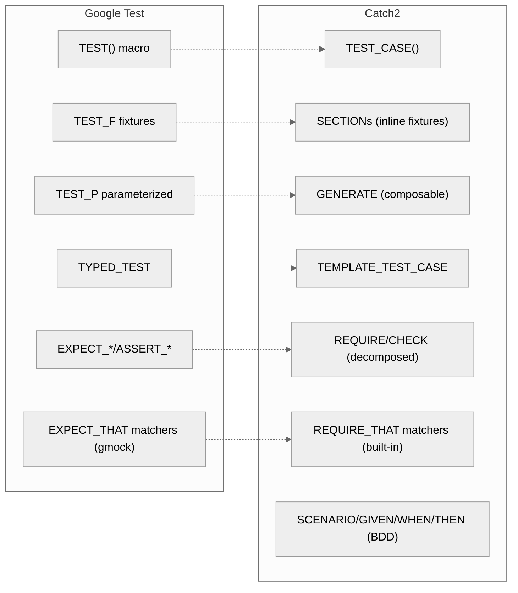
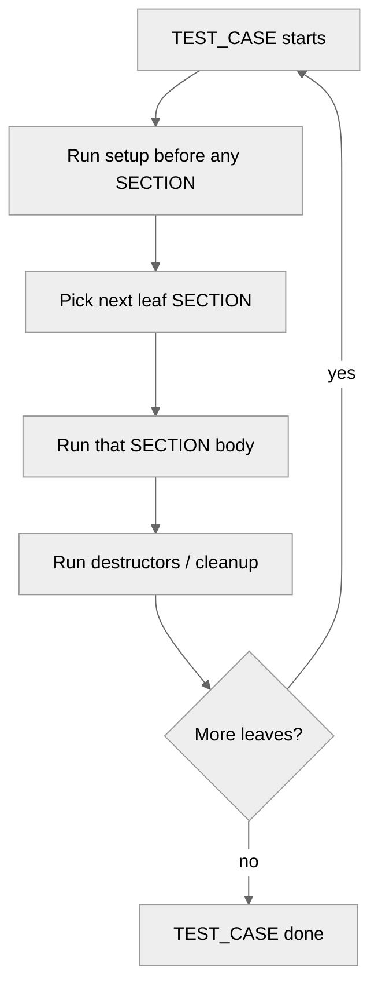
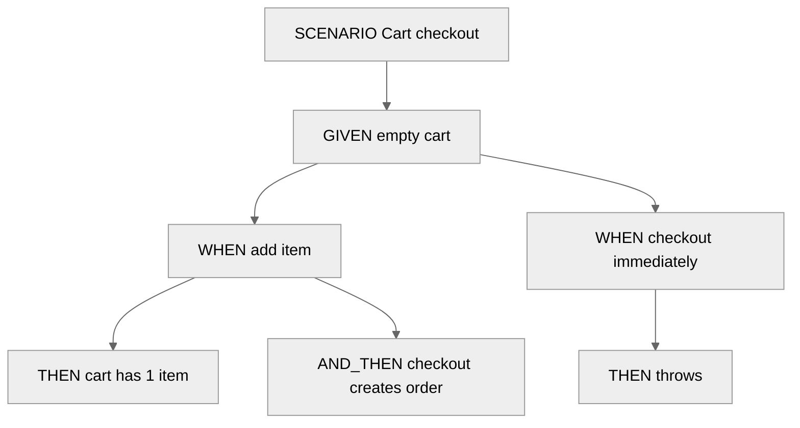

# 3. Catch2

> [!info] Where this fits
> This note is the manual for **Catch2**, the single-header test framework that competes with [[2. Google Test]]. It assumes you have read [[1. Testing Concepts]] for AAA, TDD, and BDD. After this note, [[4. Mocking with gMock]] covers mocking — note that Catch2 has its own lighter mocking (Trompeloeil) but is also commonly paired with gMock.

## Why This Matters

Google Test is excellent, but it has three persistent pain points:

1. **Heavyweight build.** GoogleTest ships as ~50k lines of code across hundreds of headers. Pulling it into a small project's build is non-trivial.
2. **Test discovery requires a build step.** `gtest_discover_tests` runs the test binary to enumerate tests; with CTest, this means tests are only discovered after the binary is built.
3. **BDD syntax is bolted on.** `gtest` is example-first; BDD-style is awkward.

Catch2 (originally "C++ Automated Test Cases in Headers", now just "Catch2") solves all three:

1. **Single header** (`catch_amalgamated.hpp`, ~20k lines but one file). Drop into your project, `#include`, done. CMake's `FetchContent` integration is also one line.
2. **Test discovery at parse time.** Catch2 self-registers tests via static initializers; no separate discovery step.
3. **BDD is first-class.** `SCENARIO` / `GIVEN` / `WHEN` / `THEN` produce readable, nested test trees.

Catch2 is the framework of choice for:
- Header-only libraries with minimal dependencies.
- Cross-platform projects where GoogleTest's build is awkward (consoles, embedded, weird toolchains).
- Teams that prefer BDD syntax.
- Projects that want generators (data-driven testing) without `TEST_P` ceremony.

It is *not* the right choice if you need deep integration with Google's internal tooling (Bazel-first projects at Google use gtest), or if you need `TYPED_TEST` over dozens of types (Catch2's `TEMPLATE_TEST_CASE` is good but gtest's type-parameterized machinery is more mature).

## Background

Catch2's predecessor, **Catch**, was created in 2010 by Phil Nash. The original design goals were:

- Single header.
- No external dependencies (not even Boost).
- Compile-time test registration (no `main()` boilerplate).
- Natural assertion syntax: `REQUIRE(x == 5)` instead of `EXPECT_EQ(x, 5)`.
- Fast compile times.

Catch2 (v2, 2017) was a rewrite that improved performance, added BDD syntax, and refined the matcher system. Catch2 v3 (2022) split the single header into a small library and a set of headers, traded some compile-time speed for runtime performance, and added C++17 minimum.

Key Catch2 milestones:
- **2010:** Catch v1 released.
- **2017:** Catch2 v2 — BDD, matchers, generators.
- **2020:** Catch2 v2.13 — the last "single header" release most projects pin.
- **2022:** Catch2 v3 — split into library + headers, C++17 minimum.

## Main Content

### Hello, Catch2

The simplest Catch2 program:

```cpp
#define CATCH_CONFIG_MAIN  // <-- generates main()
#include <catch2/catch_test_macros.hpp>

int Add(int a, int b) { return a + b; }

TEST_CASE("Add returns sum of two integers", "[math]") {
    REQUIRE(Add(2, 3) == 5);
    REQUIRE(Add(-1, 1) == 0);
}
```

That is the entire program. `#define CATCH_CONFIG_MAIN` causes the header to emit a `main()` that registers all tests and runs them. The macro should appear in **exactly one** translation unit.

With Catch2 v3, you typically link the `Catch2WithMain` library instead:

```cmake
find_package(Catch2 3 REQUIRED)
add_executable(tests test.cpp)
target_link_libraries(tests PRIVATE Catch2::Catch2WithMain)
```

### `TEST_CASE` and tags

Every test is a `TEST_CASE`:

```cpp
TEST_CASE("description", "[tag1][tag2]") {
    // ...
}
```

- The first argument is a free-form description. Catch2 displays it as-is in output.
- The second argument is an optional list of tags, comma-free, in brackets.
- Tags are used for filtering: `[math]`, `[unit]`, `[.slow]` (the dot marks it as "hidden by default").

```bash
./tests                          # run all
./tests "[math]"                 # run only tests tagged [math]
./tests "[math][unit]"           # tests with BOTH tags
./tests "[math],[unit]"          # tests with EITHER tag
./tests "~[.slow]"               # exclude slow tests
./tests "Add*"                   # tests whose name starts with "Add"
```

### `REQUIRE` vs `CHECK`

The two assertion macros differ in failure behavior:

| Macro      | On failure               |
| ---------- | ------------------------ |
| `REQUIRE`  | Abort the current test.  |
| `CHECK`    | Record failure, continue.|

```cpp
TEST_CASE("Vector operations") {
    std::vector<int> v{1, 2, 3};
    CHECK(v.size() == 3);    // if fails, continue
    CHECK(v[0] == 1);        // still runs
    REQUIRE(v.size() > 0);   // if fails, abort (because v[0] would be UB otherwise)
    CHECK(v.back() == 3);
}
```

The convention mirrors `gtest`'s `EXPECT_*` vs `ASSERT_*`: use `REQUIRE` for pre-conditions, `CHECK` for independent checks.

Decomposed assertions:

```cpp
REQUIRE(v.size() == 3);   // Catch2 captures both v.size() and 3, prints both on failure
```

This is one of Catch2's signature features. The macro overloads `==` so it can capture both operands. Failure output looks like:

```
FAILED:
  REQUIRE( v.size() == 3 )
with expansion:
  0 == 3
```

This is dramatically clearer than `EXPECT_EQ(v.size(), 3)` failing with `Expected: 3, Actual: 0`.

### `SECTION`: sub-scopes within a test

Catch2's signature feature is `SECTION`. Each `SECTION` is an independent sub-test that runs from the beginning of the `TEST_CASE` (after any setup before the section):

```cpp
TEST_CASE("Stack operations", "[stack]") {
    Stack<int> s;
    s.push(1);
    s.push(2);

    SECTION("top returns last pushed") {
        REQUIRE(s.top() == 2);
    }

    SECTION("pop returns last pushed") {
        REQUIRE(s.pop() == 2);
        REQUIRE(s.pop() == 1);
    }

    SECTION("size reflects pushes") {
        REQUIRE(s.size() == 2);
        s.pop();
        REQUIRE(s.size() == 1);
    }
}
```

Catch2 executes the `TEST_CASE` **once per SECTION**. The setup before any section runs each time; only one section's body runs per execution. Conceptually, it's like having three separate tests that share a common "given" preamble.

This is the same problem `TEST_F` solves in gtest via fixtures, but the Catch2 approach is more flexible because:
- Setup can be intermixed with sections.
- Sections can nest: a `SECTION` inside a `SECTION` creates a tree of execution paths.
- The test reads top-to-bottom like a story.

#### Nested sections

```cpp
TEST_CASE("Cart checkout", "[cart]") {
    Cart cart;

    SECTION("with empty cart") {
        REQUIRE_THROWS(cart.checkout());   // cannot checkout empty cart

        SECTION("after adding one item") {
            cart.add(Item{"book", 1, 1299});
            auto order = cart.checkout();
            REQUIRE(order.total_cents() == 1299);
            REQUIRE(cart.is_empty());
        }
    }

    SECTION("with pre-existing items") {
        cart.add(Item{"pen", 3, 99});
        // ...
    }
}
```

Catch2 explores every leaf path through the section tree, re-running the test from the top each time. With N nested sections each having two branches, you get 2^N executions. Beware of combinatorial explosion.

### BDD syntax: `SCENARIO`, `GIVEN`, `WHEN`, `THEN`

For BDD-style tests, Catch2 provides aliases:

```cpp
SCENARIO("Cart checkout", "[cart]") {
    GIVEN("an empty cart") {
        Cart cart;

        WHEN("the user adds an item") {
            cart.add(Item{"Book", 1, 1299});

            THEN("the cart contains the item") {
                REQUIRE(cart.size() == 1);
                REQUIRE(cart.total_cents() == 1299);
            }

            AND_THEN("checking out produces an order") {
                auto order = cart.checkout();
                REQUIRE(order.total_cents() == 1299);
                REQUIRE(cart.is_empty());
            }
        }

        WHEN("the user checks out immediately") {
            REQUIRE_THROWS(cart.checkout());
        }
    }
}
```

The output of `SCENARIO` is human-readable:

```
Scenario: Cart checkout
  Given: an empty cart
    When: the user adds an item
      Then: the cart contains the item
      And: checking out produces an order
```

`SCENARIO` is just `TEST_CASE` with a "Scenario: " prefix; `GIVEN`/`WHEN`/`THEN`/`AND_WHEN`/`AND_THEN` are aliases for `SECTION`. The output formatting is the only difference.

### Exceptions

```cpp
REQUIRE_THROWS(expr);                       // any exception
REQUIRE_THROWS_AS(expr, std::invalid_argument);  // specific type
REQUIRE_THROWS_WITH(expr, "expected message");    // message matches (string)
REQUIRE_THROWS_MATCHES(expr, std::runtime_error,
    Catch::Matchers::Message("contains this"));
REQUIRE_NOTHROW(expr);                      // no exception
```

The `CHECK_` variants exist for non-fatal versions.

### Matchers

```cpp
using namespace Catch::Matchers;

REQUIRE_THAT(str, Equals("hello"));
REQUIRE_THAT(str, Contains("ell"));
REQUIRE_THAT(str, StartsWith("he"));
REQUIRE_THAT(str, EndsWith("lo"));
REQUIRE_THAT(v, VectorContains(42));
REQUIRE_THAT(v, Contains(42));              // works for any iterable
REQUIRE_THAT(v, SizeIs(3));
REQUIRE_THAT(v, AllMatch(Predicate<int>([](int x){ return x > 0; })));
REQUIRE_THAT(str, WithinAbs(3.14, 0.001));  // floats
```

Custom matchers are easy:

```cpp
struct EvenMatcher : Catch::Matchers::MatcherGenericBase {
    bool match(int x) const { return x % 2 == 0; }
    std::string describe() const override {
        return "is even";
    }
};

auto IsEven() { return EvenMatcher{}; }

REQUIRE_THAT(4, IsEven());   // passes
REQUIRE_THAT(5, IsEven());   // fails: "Expected: is even"
```

### Generators

Generators are Catch2's answer to `gtest`'s `TEST_P`. They are more flexible — you can have multiple generators in the same test, and they compose.

```cpp
#include <catch2/generators/catch_generators.hpp>

TEST_CASE("Fibonacci grows", "[fib]") {
    int n = GENERATE(1, 2, 3, 4, 5, 10, 20, 30);
    INFO("n = " << n);
    REQUIRE(fib(n) >= fib(n - 1));
}
```

This produces 8 tests, one per value of `n`. The `INFO` macro prints context on failure.

Generator composition:

```cpp
TEST_CASE("Vector index access", "[vec]") {
    std::vector<int> v{10, 20, 30, 40, 50};
    size_t i = GENERATE(range(0u, v.size()));
    int expected = GENERATE(10, 20, 30, 40, 50);
    INFO("i = " << i << ", expected = " << expected);
    // This runs 5 * 5 = 25 times (cross-product)
}
```

Useful built-in generators:
- `GENERATE(1, 2, 3)` — explicit values.
- `GENERATE(range(0, 100))` — range.
- `GENERATE(table<int, std::string>({{1, "one"}, {2, "two"}}))` — table-driven.
- `GENERATE(random(-100, 100))` — random.
- `GENERATE(values({1, 2, 3}))` — from a container.
- `GENERATE_COPY(x)` — when the value is non-copyable or must be evaluated per-iteration.
- `GENERATE(take(100, random(...)))` — limit a stream.

### Logging: `INFO`, `WARN`, `FAIL`

- `INFO("msg")` — printed only if the test fails. Use for per-iteration context.
- `WARN("msg")` — printed immediately, test continues.
- `FAIL("msg")` — abort the test with a message.
- `FAIL_CHECK("msg")` — record failure, continue.
- `CAPTURE(x, y, z)` — shorthand for `INFO(#x = " << x << ", " << #y << " = " << y)`.

```cpp
TEST_CASE("String reverse") {
    std::string s = GENERATE(as<std::string>{}, "abc", "hello", "C++");
    CAPTURE(s);
    REQUIRE(reverse(s).size() == s.size());
}
```

### Floating point

```cpp
REQUIRE(a == Approx(b));              // default tolerance ~ 1e-5
REQUIRE(a == Approx(b).epsilon(0.01)); // 1% tolerance
REQUIRE(a == Approx(b).margin(0.5));   // absolute tolerance
```

`Approx` is the Catch2 way to compare floats. It is more flexible than gtest's `EXPECT_FLOAT_EQ` because you control both relative (`epsilon`) and absolute (`margin`) tolerance.

### Events and listeners

Catch2 dispatches events to "listeners" — useful for integrating with custom test runners or adding per-suite hooks:

```cpp
struct MyListener : Catch::EventListenerBase {
    using EventListenerBase::EventListenerBase;

    void testCaseStarting(Catch::TestCaseInfo const& info) override {
        std::cerr << "Starting: " << info.name << "\n";
    }
    void testCaseEnded(Catch::TestCaseStats const& stats) override {
        std::cerr << (stats.totals.assertions.allPassed() ? "PASS" : "FAIL") << "\n";
    }
};
CATCH_REGISTER_LISTENER(MyListener)
```

### CMake integration

```cmake
# Option 1: FetchContent
include(FetchContent)
FetchContent_Declare(
    Catch2
    GIT_REPOSITORY https://github.com/catchorg/Catch2.git
    GIT_TAG        v3.5.0
)
FetchContent_MakeAvailable(Catch2)

# Option 2: find_package (if installed system-wide)
# find_package(Catch2 3 REQUIRED)

add_executable(unit_tests
    test_calculator.cpp
)
target_link_libraries(unit_tests PRIVATE Catch2::Catch2WithMain)

# Register tests with CTest
include(Catch)
catch_discover_tests(unit_tests)
```

`catch_discover_tests` works analogously to `gtest_discover_tests` — runs the binary at build time, queries its test list, registers each with CTest.

## Mermaid Diagrams

### Catch2 vs Google Test comparison



### SECTION execution model



### BDD nesting as a tree



## Code Examples

### Complete test file

```cpp
#include <catch2/catch_test_macros.hpp>
#include <catch2/matchers/catch_matchers_vector.hpp>
#include <catch2/generators/catch_generators.hpp>
#include <vector>
#include <string>
#include "mylib/calculator.h"

using namespace Catch::Matchers;

TEST_CASE("Calculator add", "[math][add]") {
    Calculator c;
    REQUIRE(c.add(2, 3) == 5);
    REQUIRE(c.add(-1, 1) == 0);
    REQUIRE(c.add(0, 0) == 0);
}

TEST_CASE("Calculator divide", "[math][divide]") {
    Calculator c;
    SECTION("divides evenly") {
        REQUIRE(c.divide(10, 2) == 5);
    }
    SECTION("divides with remainder truncated") {
        REQUIRE(c.divide(7, 2) == 3);
    }
    SECTION("throws on divide by zero") {
        REQUIRE_THROWS_AS(c.divide(10, 0), std::invalid_argument);
    }
}

SCENARIO("Cart operations", "[cart]") {
    GIVEN("an empty cart") {
        Cart cart;
        REQUIRE(cart.is_empty());

        WHEN("an item is added") {
            cart.add(Item{"book", 1, 1299});
            THEN("the cart contains that item") {
                REQUIRE(cart.size() == 1);
                REQUIRE_THAT(cart.items(),
                    VectorContains(Item{"book", 1, 1299}));
            }
            AND_WHEN("the cart is checked out") {
                auto order = cart.checkout();
                THEN("an order is produced and the cart empties") {
                    REQUIRE(order.total_cents() == 1299);
                    REQUIRE(cart.is_empty());
                }
            }
        }
    }
}

// Generator-driven test
TEST_CASE("Fibonacci is monotonic", "[fib][property]") {
    int n = GENERATE(range(2, 30));
    REQUIRE(fib(n) >= fib(n - 1));
}

// Table-driven test
TEST_CASE("Roman numerals", "[roman]") {
    auto [value, expected] = GENERATE(table<int, std::string>({
        {1,    "I"},
        {4,    "IV"},
        {9,    "IX"},
        {40,   "XL"},
        {90,   "XC"},
        {400,  "CD"},
        {900,  "CM"},
        {2024, "MMXXIV"},
    }));
    CAPTURE(value, expected);
    REQUIRE(to_roman(value) == expected);
}

// Custom matcher
struct IsEven : Catch::Matchers::MatcherGenericBase {
    bool match(int x) const { return x % 2 == 0; }
    std::string describe() const override { return "is even"; }
};
auto IsEvenMatcher() { return IsEven{}; }

TEST_CASE("Even numbers", "[matchers]") {
    REQUIRE_THAT(4, IsEvenMatcher());
    REQUIRE_THAT(2, IsEvenMatcher());
}
```

### CMake setup

```cmake
cmake_minimum_required(VERSION 3.20)
project(catch2_demo CXX)
set(CMAKE_CXX_STANDARD 17)

include(FetchContent)
FetchContent_Declare(
    Catch2
    GIT_REPOSITORY https://github.com/catchorg/Catch2.git
    GIT_TAG v3.5.0
)
FetchContent_MakeAvailable(Catch2)

add_executable(unit_tests test.cpp)
target_link_libraries(unit_tests PRIVATE Catch2::Catch2WithMain)

list(APPEND CMAKE_MODULE_PATH ${catch2_SOURCE_DIR}/extras)
include(Catch)
catch_discover_tests(unit_tests
    REPORTER junit
    OUTPUT_DIR ${CMAKE_BINARY_DIR}/test_reports
    OUTPUT_PREFIX catch2_
    OUTPUT_SUFFIX .xml
)
```

### Running tests

```bash
# Run all
./unit_tests

# Filter by tag
./unit_tests "[math]"

# Exclude slow
./unit_tests "~[.slow]"

# Filter by name
./unit_tests "Cart*"

# Specify reporter
./unit_tests --reporter=console
./unit_tests --reporter=junit --out=report.xml

# Repeat
./unit_tests --retry 3             # retry failed tests up to 3 times
./unit_tests --order rand          # random order
./unit_tests --benchmark-samples 100  # if benchmarks enabled

# List tests
./unit_tests --list-tests
./unit_tests --list-tags
```

## Common Pitfalls

> [!warning] Pitfalls
> - **`#define CATCH_CONFIG_MAIN` in multiple TUs.** Produces multiple `main()` definitions and a link error. Define it in exactly one TU, or link `Catch2WithMain`.
> - **SECTION abuse.** Nesting too many `SECTION`s creates an exponential tree of test executions. If a `TEST_CASE` takes 5 seconds to run, check whether you have `2^N` leaves.
> - **Heavy work in `GIVEN`.** The body of `GIVEN`/`WHEN`/`THEN` runs once per leaf path. Expensive setup (DB connection) should be cached in a static or moved to a fixture-style helper.
> - **Comparing floats with `==`.** `REQUIRE(a == b)` is bit-exact. Use `Approx` for floats.
> - **Generators with side effects.** A `GENERATE` inside a `SECTION` may execute differently than expected. Put generators at the top of the `TEST_CASE` unless you need per-section values.
> - **Silent skip via `[.]` tag.** Tests tagged with `[.]` are excluded by default. Useful for slow/integration tests but easy to forget — they will not run in CI unless explicitly invoked.
> - **Compile times.** Even though Catch2 is "single header", it is a big header. Precompile it (`include/catch2/catch_all.hpp`) or use the v3 split headers to reduce per-TU cost.
> - **Linking the wrong library.** `Catch2::Catch2` (no main) vs `Catch2::Catch2WithMain` (with main). Pick the right one.

## Tips and Tricks

> [!tip] Tips
> - Use `INFO`/`CAPTURE` liberally — failure messages become self-documenting.
> - Use `SCENARIO` for tests that benefit from BDD narration; use plain `TEST_CASE` for low-level unit tests. Mixing both is fine.
> - Catch2's `~[tag]` exclusion syntax is cleaner than `gtest`'s negative filters.
> - Use `GENERATE` even for single-value tests — easy to extend later.
> - For benchmark-style timing, use Catch2's built-in `BENCHMARK` macro (requires `CATCH_CONFIG_ENABLE_BENCHMARKING` in v2, default in v3).
> - Use `--reporter=console::out=stdout::colour-mode=ansi` to force color in CI logs.
> - For data-driven testing, prefer `table` generator over multiple `TEST_CASE`s — the test count in CI is more honest.
> - Use `TEMPLATE_TEST_CASE` to test the same logic across types: `TEMPLATE_TEST_CASE("Vector push_back", "[vec]", std::vector<int>, std::deque<int>, std::list<int>) { ... }`.
> - Catch2 supports `--durations` to print the slowest N tests — invaluable for keeping the suite fast.
> - For mock-heavy tests, combine Catch2 with **Trompeloeil** (header-only mocking) or **gMock**; the choice is largely stylistic.

### Benchmark support

Catch2 v3 includes a micro-benchmarking framework (a successor to the standalone Nonius library). It lets you measure the cost of small code paths with the same `TEST_CASE` ergonomics, useful for spotting regressions in hot loops.

```cpp
#include <catch2/benchmark/catch_benchmark.hpp>
#include <vector>
#include <algorithm>

TEST_CASE("std::sort vs std::stable_sort", "[benchmark]") {
    std::vector<int> data;
    for (int i = 0; i < 10'000; ++i) data.push_back(rand());

    BENCHMARK("std::sort") {
        auto copy = data;
        std::sort(copy.begin(), copy.end());
        return copy;
    };

    BENCHMARK("std::stable_sort") {
        auto copy = data;
        std::stable_sort(copy.begin(), copy.end());
        return copy;
    };
}
```

Catch2 runs each benchmark for a configurable number of iterations, computes mean and standard deviation, and reports outliers. For more rigorous benchmarking, prefer Google Benchmark, but Catch2's integration is convenient when you already have a Catch2 test binary and want occasional perf checks alongside functional tests.

### Event listeners and custom reporters

Catch2's reporter system lets you plug into the test execution pipeline. Built-in reporters: `console` (default), `junit` (CI-friendly XML), `xml`, `compact`, `tap` (Test Anything Protocol). You can write a custom reporter by subclassing `Catch::EventListenerBase` and overriding hooks like `testRunStarting`, `testCaseStarting`, `sectionStarting`, `assertionEnded`, `testCaseEnded`, `testRunEnded`. This is useful for integrating Catch2 with non-standard CI dashboards or for emitting coverage-tool-friendly output. Custom listeners are registered with `CATCH_REGISTER_LISTENER(ListenerType)` and are notified alongside the active reporter.

## Active Recall

1. What are the three structural advantages Catch2 has over Google Test?
2. What is the difference between `REQUIRE` and `CHECK`? When should you use each?
3. Explain how `SECTION` works. What does Catch2 do differently from a normal function call?
4. Write a `SCENARIO` with `GIVEN`/`WHEN`/`THEN` for a login function that fails after 3 wrong attempts.
5. What does `GENERATE(1, 2, 3)` produce? How many times does the surrounding test body execute?
6. Why is `REQUIRE(a == b)` better for floats with `Approx` than direct equality?
7. How do you exclude tests tagged `[.slow]` from the default run?
8. What does `CAPTURE(x, y)` do that `INFO` does not?
9. Write a custom matcher that checks whether a string is a valid email address.
10. How does `catch_discover_tests` differ from `gtest_discover_tests`?

## Next Steps

- Continue to [[4. Mocking with gMock]] — mocking works with both Google Test and Catch2 (gMock can be used standalone).
- Cross-link to [[1. Testing Concepts]] — the vocabulary (AAA, TDD, BDD) is the same.
- Cross-link to [[2. Google Test]] — many teams use both frameworks in different parts of the same monorepo.
- Cross-link to [[12. Build Systems and Project Structure/3. CMake Deep Dive]] for FetchContent patterns.
- For property-based testing integration, see [[1. Testing Concepts]] (RapidCheck works with Catch2 too).
