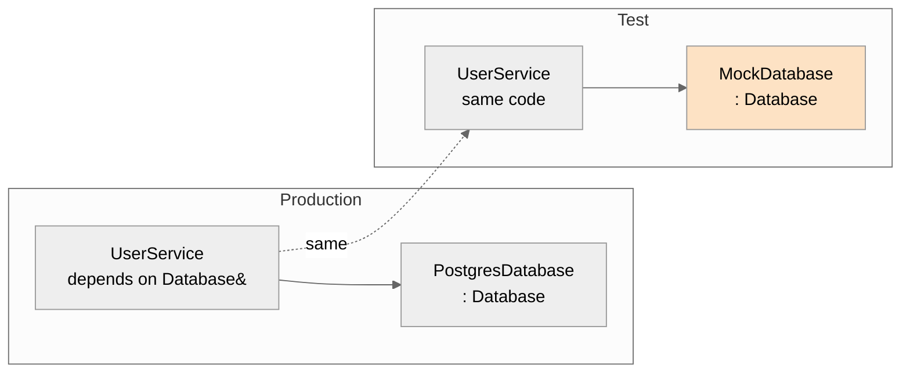
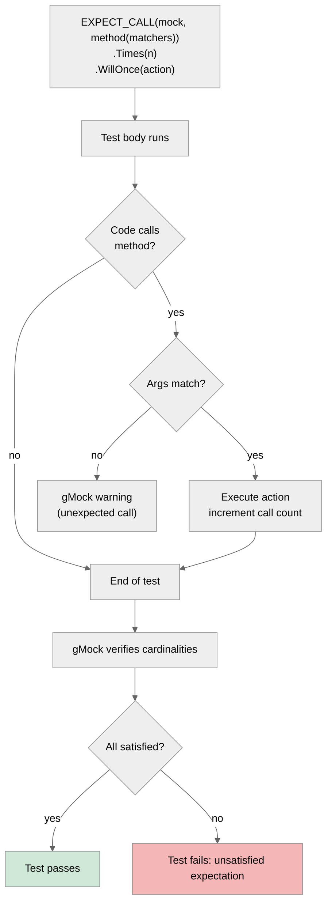
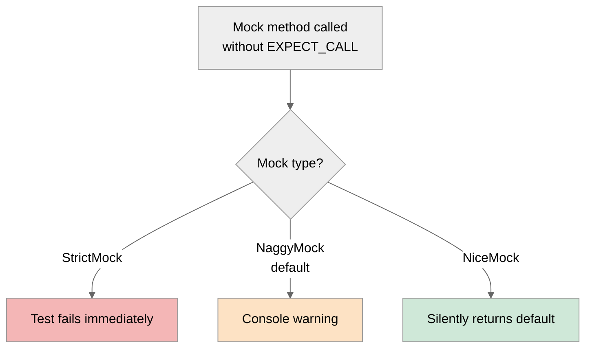

# 4. Mocking with gMock

> [!info] Where this fits
> This note is the manual for **gMock**, Google's C++ mocking framework, which ships bundled with [[2. Google Test]] but can also be used standalone with [[3. Catch2]] or any other framework. It assumes the vocabulary from [[1. Testing Concepts]] (test doubles, isolation). For broader test design, see [[1. Testing Concepts]].

## Why This Matters

Real code depends on things that are slow, unreliable, or impossible to use in a unit test:
- A database that requires a running PostgreSQL instance.
- A clock that returns the real wall-clock time.
- A network client that calls a remote service.
- A random number generator.
- A filesystem.

If you do not replace these dependencies with controllable stand-ins, your unit tests are actually integration tests — slow, flaky, and coupled to the environment. The standard solution is **dependency injection**: design your classes so that their collaborators are passed in (typically via an interface), and in tests, substitute a **mock** — a programmable object whose behavior and interactions you control.

`gMock` is the dominant mocking framework in C++. It is bundled with GoogleTest (no extra dependency), works across all major compilers, and provides a fluent API for setting up expectations, verifying interactions, and customizing behavior. Other options exist (Trompeloeil is the main competitor, with a different aesthetic and stricter compile-time checking), but gMock's market share makes it the default choice.

Mocking is also a **design pressure**: if a class is hard to mock, it is hard to use. The friction you feel when writing mocks is the same friction real callers feel. Learning gMock therefore also teaches you how to write testable (and therefore maintainable) C++.

## Background

### Test double taxonomy

The term "mock" is colloquially used for any kind of test double, but the literature (Gerard Meszaros, *xUnit Test Patterns*, 2007) distinguishes:

| Type        | Behavior                                                          | Verification focus  |
| ----------- | ----------------------------------------------------------------- | ------------------- |
| **Dummy**   | Passed but never used. Just fills a parameter list.               | None                |
| **Fake**    | A working but simplified implementation (in-memory DB).           | State               |
| **Stub**    | Returns canned answers to calls.                                 | State               |
| **Spy**     | Wraps the real object and records calls.                          | Interactions        |
| **Mock**    | Programmable object with expectations about which calls happen.   | Interactions        |

`gMock` is primarily a **mock** framework — it lets you specify what calls you expect, with what arguments, in what order, how many times, and what they should return. It can also be used as a stub (just configure return values without verifying call counts).

### Why mocking requires interfaces

C++ does not have built-in "interface" keyword, but the equivalent — a class with only pure virtual methods — is the standard mocking seam:

```cpp
// Interface
class Database {
public:
    virtual ~Database() = default;
    virtual std::optional<User> find_user(int id) = 0;
    virtual void save_user(const User&) = 0;
};

// Production implementation
class PostgresDatabase : public Database { /* ... */ };

// Mock
class MockDatabase : public Database {
public:
    MOCK_METHOD(std::optional<User>, find_user, (int id), (override));
    MOCK_METHOD(void, save_user, (const User&), (override));
};
```

The class under test depends on `Database&` or `std::shared_ptr<Database>`, not on `PostgresDatabase` directly. In production, you inject a `PostgresDatabase`. In tests, you inject a `MockDatabase`. This is **dependency injection via polymorphism** — the simplest and most C++-idiomatic form.

### The MOCK_METHOD macro

```cpp
MOCK_METHOD(return_type, method_name, (arg_types), (qualifiers));
```

- `return_type`: the method's return type.
- `method_name`: the method's name.
- `(arg_types)`: a parenthesized comma-separated list of argument types. Note: even for a single arg, you must use parentheses: `(int id)`, not `int id`.
- `(qualifiers)`: optional, parenthesized: `const`, `override`, `noexcept`, `final`, or combinations `(const, noexcept)`.

Historical note: gMock v1 used `MOCK_METHOD0`, `MOCK_METHOD1`, etc., where the number indicated the argument count. This was deprecated because it limited you to 10 args. The modern `MOCK_METHOD` form has no limit.

## Main Content

### Setting up expectations: `EXPECT_CALL`

```cpp
TEST(UserServiceTest, FindUserReturnsUserFromDatabase) {
    MockDatabase db;
    UserService svc{db};

    EXPECT_CALL(db, find_user(42))
        .WillOnce(Return(User{42, "alice"}));

    auto user = svc.get_user_name(42);
    EXPECT_EQ(user, "alice");
}
```

When the test ends, gMock verifies that all `EXPECT_CALL`s were satisfied. If `find_user(42)` was never called, the test fails. If it was called with a different argument, the test fails.

### Cardinities: how many times?

By default, an `EXPECT_CALL` expects the call to happen exactly once. You can change this with cardinality modifiers:

| Modifier                       | Meaning                                  |
| ------------------------------ | ---------------------------------------- |
| `Times(1)`                     | Exactly once (default).                  |
| `Times(n)`                     | Exactly `n` times.                       |
| `Times(AtLeast(n))`            | At least `n` times.                      |
| `Times(AtMost(n))`             | At most `n` times.                       |
| `Times(AnyNumber())`           | Zero or more times (a "stub").           |
| `Times(Between(m, n))`         | Between `m` and `n` times, inclusive.    |
| `Times(0)`                     | Must never be called.                    |

```cpp
EXPECT_CALL(db, save_user(_))
    .Times(AtLeast(1))
    .WillRepeatedly(Return());
```

The `_` matcher matches any value of the argument's type.

### Actions: what should the call do?

| Action                                  | Behavior                                     |
| --------------------------------------- | -------------------------------------------- |
| `Return(x)`                             | Return `x` (by copy).                        |
| `ReturnRef(x)`                          | Return a reference to `x`.                   |
| `ReturnRefOfCopy(x)`                    | Return a reference to a copy of `x`.         |
| `Return(ByMove(...))`                   | Return a move-only type.                     |
| `ReturnNew<T>(args...)`                 | `return new T(args...)`.                     |
| `ReturnNull()`                          | Return `nullptr`.                            |
| `Invoke(f)`                             | Call `f` with the same arguments.            |
| `Invoke(obj, &Class::method)`           | Call `obj.method` with the arguments.        |
| `InvokeWithoutArgs(f)`                  | Call `f` with no arguments.                  |
| `InvokeArgument<N>(args...)`            | Call the Nth argument (for callbacks).       |
| `WithArg<N>(action)`                    | Apply action to Nth arg only.                |
| `DoAll(a1, a2, ...)`                    | Execute all actions in sequence.             |
| `SetArgReferee<N>(value)`               | Set the Nth argument (by reference) to value.|
| `SetArgPointee<N>(value)`               | Set what the Nth arg points to.              |
| `Throw(exception)`                      | Throw the exception.                         |
| `Assign(&var, value)`                   | Assign value to var.                         |

```cpp
EXPECT_CALL(db, find_user(_))
    .WillOnce(Return(User{1, "alice"}))
    .WillOnce(Return(User{2, "bob"}))
    .WillOnce(Return(std::nullopt));   // third call returns no user
```

For multiple actions on a single call (e.g., set an out-param AND return a value):

```cpp
EXPECT_CALL(parser, parse(_, _))
    .WillOnce(DoAll(
        SetArgReferee<1>(ParseResult{42}),
        Return(true)
    ));
```

### Argument matchers

`EXPECT_CALL(mock, method(matchers))` accepts matchers for each argument:

| Matcher           | Matches                                  |
| ----------------- | ---------------------------------------- |
| `_`               | Anything (wildcard).                     |
| `Eq(x)` / `x`     | Equal to `x`.                            |
| `Ne(x)`           | Not equal.                               |
| `Lt(x)`, `Gt(x)`  | Less/greater than.                       |
| `Le(x)`, `Ge(x)`  | Less-or-equal / greater-or-equal.        |
| `IsNull()`        | `nullptr`.                               |
| `NotNull()`       | Not null.                                |
| `StrEq(s)`        | String equal.                            |
| `Contains(s)`     | String or container contains.            |
| `HasSubstr(s)`    | String contains substring.               |
| `StartsWith(s)`   | String starts with.                      |
| `ElementsAre(...)`| Container with specific elements in order. |
| `SizeIs(n)`       | Container of size n.                     |
| `Field(&T::field, m)` | Object whose field matches matcher.  |
| `Property(&T::method, m)` | Object whose getter matches.       |
| `ResultOf(f, m)`  | Result of `f(arg)` matches `m`.          |
| `AllOf(m1, m2, …)`| All matchers match.                      |
| `AnyOf(m1, m2, …)`| Any matcher matches.                     |
| `Not(m)`          | Negation.                                |

```cpp
using ::testing::_;
using ::testing::AllOf;
using ::testing::Field;
using ::testing::HasSubstr;

EXPECT_CALL(db, save_user(
    AllOf(
        Field(&User::id, Gt(0)),
        Field(&User::name, HasSubstr("ali"))
    )
)).Times(1);
```

### Order: sequences and expectations

By default, gMock does **not** enforce call order across different `EXPECT_CALL`s. To enforce order, use `InSequence`:

```cpp
using ::testing::InSequence;

TEST(OrderedTest, LogsInCorrectOrder) {
    InSequence seq;
    MockLogger logger;

    EXPECT_CALL(logger, info(HasSubstr("start")));
    EXPECT_CALL(logger, info(HasSubstr("process")));
    EXPECT_CALL(logger, info(HasSubstr("done")));
}
```

All `EXPECT_CALL`s in the same `InSequence` scope must be invoked in declaration order. Multiple sequences can coexist (independent orderings).

### Strict vs nice mocks

By default, gMock warns on **uninteresting calls** — calls to mock methods that have no `EXPECT_CALL`. Two alternatives:

- **`NiceMock<MockX>`**: silently ignores uninteresting calls. Useful when you set up only the calls you care about and don't want noise.
- **`StrictMock<MockX>`**: fails the test on any uninteresting call. Useful when you want to verify that the code only calls what you expect.

```cpp
TEST(Strict, OnlyExpectedCalls) {
    StrictMock<MockDatabase> db;
    EXPECT_CALL(db, find_user(42)).WillOnce(Return(std::nullopt));
    // If code calls save_user(), test fails: "uninteresting mock function call"
}

TEST(Nice, IgnoreUninteresting) {
    NiceMock<MockDatabase> db;
    EXPECT_CALL(db, find_user(42)).WillOnce(Return(std::nullopt));
    // Code may call other methods; they are silently default-returned.
}
```

Default behavior: `MockDatabase db;` (no Nice or Strict wrapper) is **the "naggy" default** — uninteresting calls produce warnings but don't fail the test.

### Verification: implicit vs explicit

gMock verifies `EXPECT_CALL`s at **mock destruction time** (the end of the test, typically). It also provides explicit verification:

```cpp
using ::testing::Mock;

TEST(Verify, MidTestVerification) {
    MockDatabase db;
    EXPECT_CALL(db, find_user(42)).Times(1);

    do_something_with(db);

    Mock::VerifyAndClearExpectations(&db);
    // From here, all previous expectations are cleared.

    EXPECT_CALL(db, save_user(_)).Times(1);
    do_more_with(db);
}
```

`Mock::VerifyAndClearExpectations` is useful when the mock is shared across multiple phases of a test, or when you want to fail fast if an early phase did not satisfy its expectations.

### Mocking free functions and static methods

gMock only mocks virtual methods. For free functions or static methods, you must refactor:
- **Wrap the call in a virtual method** of an injectable interface.
- **Use a template parameter** for the function (compile-time DI).
- **Use `EXPECT_CALL` on a `Mock` that delegates** to the real static (rare).

This is one of the few real friction points in C++ mocking. Languages with monkey-patching (Python, Ruby) avoid it; C++'s static dispatch makes refactoring mandatory.

### Mocking templates

```cpp
template <typename T>
class MockRepository : public Repository<T> {
public:
    MOCK_METHOD(std::vector<T>, find_all, (), (override));
    MOCK_METHOD(void, save, (const T&), (override));
};
```

This works for any type `T`. Combined with `TYPED_TEST` (in gtest) or `TEMPLATE_TEST_CASE` (in Catch2), you can test generic code against any mock backend.

### OnCall: stubbing without verification

When you do not care about call counts (you just want a default return value), use `ON_CALL` instead of `EXPECT_CALL`:

```cpp
ON_CALL(db, find_user(_))
    .WillByDefault(Return(std::nullopt));

// Code may call find_user any number of times; no verification happens.
```

`ON_CALL` sets the default behavior. `EXPECT_CALL` sets expectations (which include behavior). If both are present, `EXPECT_CALL` wins for the matching arguments.

### Using gMock with Catch2

gMock's assertions (`EXPECT_CALL` failures) integrate with any framework via `::testing::InitGoogleMock`. For Catch2:

```cpp
#define CATCH_CONFIG_MAIN
#include <catch2/catch_test_macros.hpp>
#include <gmock/gmock.h>

int main(int argc, char* argv[]) {
    ::testing::InitGoogleMock(&argc, argv);
    int result = Catch::Session().run(argc, argv);
    return result;
}
```

Then use `EXPECT_CALL` inside `TEST_CASE` blocks. gMock's failures report as test failures.

Alternatively, **Trompeloeil** is a header-only mock framework designed for Catch2 with stricter compile-time checking and a slightly different syntax (`REQUIRE_CALL` vs `EXPECT_CALL`). For greenfield projects with no GoogleTest dependency, it is worth evaluating.

## Mermaid Diagrams

### Dependency injection for testability



### gMock expectation lifecycle



### Strict vs Nice vs Naggy



## Code Examples

### Full mocked test

```cpp
#include <gmock/gmock.h>
#include <gtest/gtest.h>
#include <optional>
#include <string>

using ::testing::_;
using ::testing::Return;
using ::testing::Throw;
using ::testing::NiceMock;
using ::testing::StrictMock;
using ::testing::InSequence;
using ::testing::HasSubstr;
using ::testing::AtLeast;

// Interface
class Database {
public:
    virtual ~Database() = default;
    virtual std::optional<User> find_user(int id) = 0;
    virtual void save_user(const User&) = 0;
};

// Mock
class MockDatabase : public Database {
public:
    MOCK_METHOD(std::optional<User>, find_user, (int id), (override));
    MOCK_METHOD(void, save_user, (const User&), (override));
};

// Class under test
class UserService {
    Database& db_;
public:
    explicit UserService(Database& db) : db_{db} {}

    std::string get_user_name(int id) {
        auto user = db_.find_user(id);
        if (!user) throw std::runtime_error("not found");
        return user->name;
    }

    void rename_user(int id, std::string new_name) {
        auto user = db_.find_user(id);
        if (!user) throw std::runtime_error("not found");
        user->name = std::move(new_name);
        db_.save_user(*user);
    }
};

// Tests

TEST(UserServiceTest, GetUserNameReturnsNameFromDb) {
    MockDatabase db;
    UserService svc{db};

    EXPECT_CALL(db, find_user(42))
        .WillOnce(Return(User{42, "alice"}));

    EXPECT_EQ(svc.get_user_name(42), "alice");
}

TEST(UserServiceTest, GetUserNameThrowsIfNotFound) {
    MockDatabase db;
    UserService svc{db};

    EXPECT_CALL(db, find_user(999))
        .WillOnce(Return(std::nullopt));

    EXPECT_THROW(svc.get_user_name(999), std::runtime_error);
}

TEST(UserServiceTest, RenameUserFetchesThenSaves) {
    InSequence seq;
    MockDatabase db;
    UserService svc{db};

    EXPECT_CALL(db, find_user(42))
        .WillOnce(Return(User{42, "alice"}));
    EXPECT_CALL(db, save_user(Field(&User::name, "Alicia")))
        .Times(1);

    svc.rename_user(42, "Alicia");
}

TEST(UserServiceTest, UsesNiceMockToIgnoreUninteresting) {
    NiceMock<MockDatabase> db;
    ON_CALL(db, find_user(_)).WillByDefault(Return(std::nullopt));
    // Code can call save_user too; NiceMock silently accepts.
}

TEST(UserServiceTest, StrictMockFailsOnUnexpected) {
    StrictMock<MockDatabase> db;
    EXPECT_CALL(db, find_user(1)).WillOnce(Return(std::nullopt));
    // If code calls any other method, test fails.
}
```

### Mock with side effects (out-params)

```cpp
class Parser {
public:
    virtual bool parse(const std::string& input, ParseResult& out) = 0;
};

class MockParser : public Parser {
public:
    MOCK_METHOD(bool, parse, (const std::string&, ParseResult&), (override));
};

TEST(ParserTest, ReturnsTrueAndSetsResult) {
    MockParser p;
    EXPECT_CALL(p, parse("hello", _))
        .WillOnce(DoAll(
            SetArgReferee<1>(ParseResult{42, "ok"}),
            Return(true)
        ));

    ParseResult result;
    bool ok = p.parse("hello", result);
    EXPECT_TRUE(ok);
    EXPECT_EQ(result.code, 42);
}
```

### Mocking a callback

```cpp
class Worker {
public:
    virtual void run(std::function<void(int)> callback) = 0;
};

class MockWorker : public Worker {
public:
    MOCK_METHOD(void, run, (std::function<void(int)>), (override));
};

TEST(CallbackTest, InvokesCallbackWithResult) {
    MockWorker w;
    EXPECT_CALL(w, run(_))
        .WillOnce(InvokeArgument<0>(42));

    int captured = -1;
    w.run([&](int x) { captured = x; });
    EXPECT_EQ(captured, 42);
}
```

### CMake setup

```cmake
include(FetchContent)
FetchContent_Declare(
    googletest
    URL https://github.com/google/googletest/archive/refs/tags/v1.14.0.zip
)
FetchContent_MakeAvailable(googletest)

add_executable(unit_tests
    test_user_service.cpp
)
target_link_libraries(unit_tests PRIVATE gtest gmock gtest_main)
```

`gmock` is a separate library but is included in the GoogleTest repository. Link it explicitly alongside `gtest`.

## Common Pitfalls

> [!warning] Pitfalls
> - **Mocking concrete classes.** If your class is not polymorphic, you cannot mock it without refactoring. Plan for testability from day one: define interfaces, inject them.
> - **Mocking value types.** Mocks require virtual dispatch, so they are reference types. Value semantics and gMock do not mix well; refactor to inject references or `shared_ptr<Interface>`.
> - **Excessive mocking.** If every test sets up 20 expectations, the test is brittle: any small change in production breaks the test even if behavior is correct. Prefer state-based assertions over interaction-based.
> - **Mocking third-party classes you do not own.** You cannot add `MOCK_METHOD` to a class you did not write. Wrap the third-party class in your own interface and mock that.
> - **Forgetting `override`.** A mock method without `override` may not actually override the base (e.g., signature mismatch). Compile with `-Wsuggest-override` to catch this.
> - **`Return(x)` for move-only types.** Use `Return(ByMove(...))` or `Return(std::optional<T>{...})` for `std::unique_ptr`, `std::future`, etc.
> - **Mocking destructors.** If your base class has a virtual destructor (good practice), the mock inherits it. You do not need to `MOCK_METHOD` the destructor; gMock handles it.
> - **`EXPECT_CALL` after the call happens.** Expectations must be set before the call. Setting them after has no effect — the call was already unexpected.
> - **StrictMock in tests with shared setup.** Strict mocks fail on any unexpected call, including setup helpers. Use them sparingly, only in tests that specifically verify call count.
> - **Memory leaks in mocks.** `ReturnNew<T>()` returns a raw `new T`. If the caller does not delete it, you have a leak. Use `Return(ByMove(std::make_unique<T>()))` for ownership clarity.

## Tips and Tricks

> [!tip] Tips
> - **Mock at architectural seams, not class boundaries.** Mocking every class leads to brittle tests. Mock at the boundaries between subsystems (DB, network, filesystem).
> - **Prefer `ON_CALL` over `EXPECT_CALL` when you do not care about call count.** Less brittle.
> - **Use `NiceMock` by default; switch to `StrictMock` only when you specifically want to verify "no other calls happened".**
> - **Custom matchers** are easy to write and dramatically improve test readability:
>   ```cpp
>   MATCHER(IsEven, "") { return (arg % 2) == 0; }
>   EXPECT_CALL(m, foo(IsEven()));
>   ```
> - **Use `Matches` matcher to verify a value against a matcher outside `EXPECT_CALL`:** `EXPECT_THAT(x, Gt(5))`.
> - **Save action arguments** for later inspection with `SaveArg<N>(&var)`.
> - **Use `WithArg<N>(Invoke(...))` to transform arguments** before invoking a lambda.
> - **For async tests, use `Invoke` to invoke a continuation**, or pair gMock with `std::promise`/`std::future` to synchronize.
> - **Compile with `-Wall -Wextra -Wpedantic -Wsuggest-override`** to catch signature drift between mock and interface.
> - **Use `MOCK_METHOD` over the legacy `MOCK_METHODn` macros.** The new form is unlimited and clearer.
> - **Read the error messages.** gMock's failure output is verbose but precise: it tells you which expectation was violated, which arguments were received, and which cardinality was off. Learning to read it pays off fast.

## Active Recall

1. Distinguish dummy, fake, stub, spy, and mock. Which one is gMock?
2. Why does C++ mocking require polymorphism? What languages avoid this constraint and how?
3. Write a `MOCK_METHOD` declaration for `virtual std::string format(int, const std::string&) const = 0;`.
4. What is the difference between `EXPECT_CALL` and `ON_CALL`?
5. When would you use `StrictMock` vs `NiceMock` vs the default?
6. What does `Times(Between(2, 4))` mean?
7. How do you verify that two methods are called in a specific order?
8. Write an `EXPECT_CALL` that returns different values on three successive calls.
9. How would you mock a free function that calls `std::filesystem::remove`?
10. Why is "mocking everything" considered a code smell? What is the alternative?

### Mocking abstract classes with multiple pure-virtual methods

When a class has many pure-virtual methods, writing `MOCK_METHOD` for each is tedious. Two strategies help. First, group pure-virtual methods into smaller, cohesive interfaces (Interface Segregation Principle — see [[5. SOLID Principles]]); mock each smaller interface, not the god-interface. Second, for the methods you actually use in a given test, prefer `ON_CALL` defaults plus targeted `EXPECT_CALL`s on the few calls you care about — `NiceMock` suppresses warnings for the uninteresting rest. Third, consider `MOCK_METHOD` on an aggregate mock class that multiply-inherits several small interfaces; gMock handles the overrides cleanly across base classes.

## Active Recall (additional)

11. How does `Invoke` differ from `Return` for an `EXPECT_CALL` action?

## Next Steps

- This is the final note in the Testing chapter. Loop back to [[1. Testing Concepts]] to consolidate the vocabulary.
- Cross-link to [[2. Google Test]] for the assertion framework gMock ships with.
- Cross-link to [[3. Catch2]] — gMock can be used with Catch2 via a small adapter, or you can use Trompeloeil.
- Cross-link to [[18. Software Engineering Practices/5. SOLID Principles]] — the Dependency Inversion Principle is what makes mocking possible.
- Cross-link to [[18. Software Engineering Practices/6. Software Architecture]] — architectural seams are the natural places to inject mocks.
