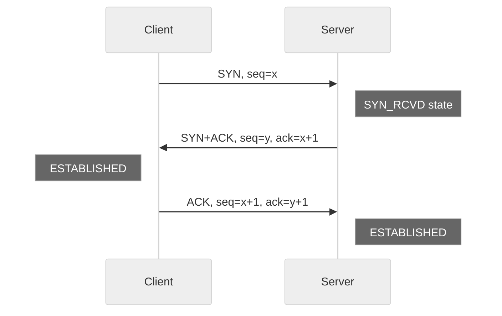
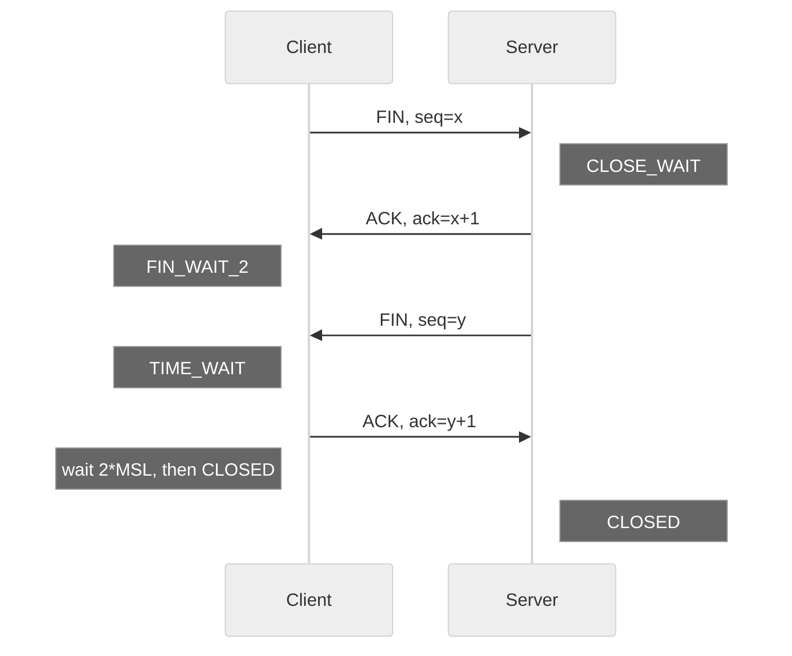
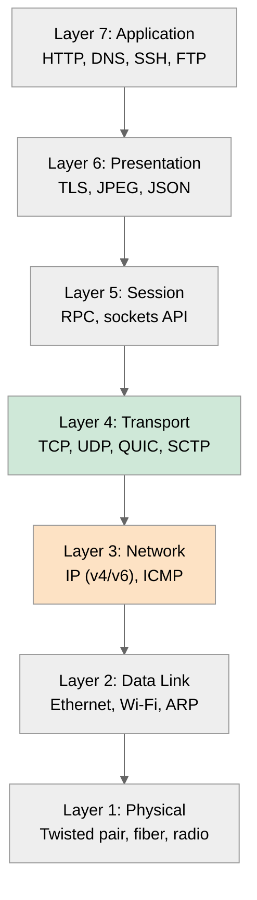
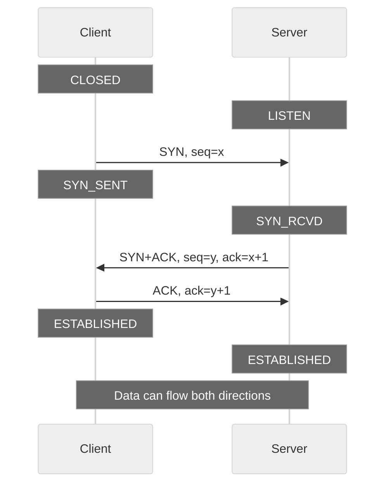
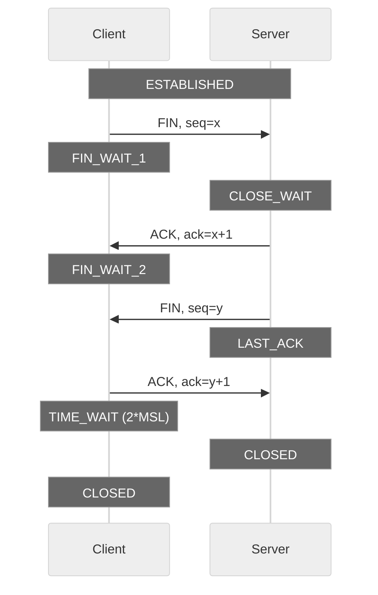
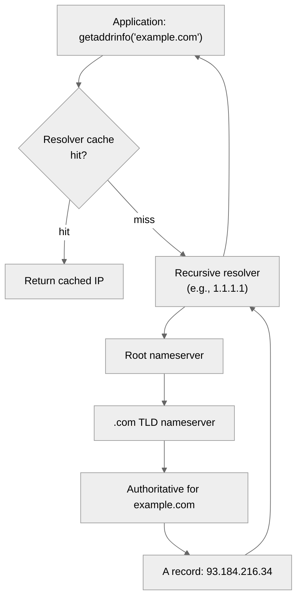
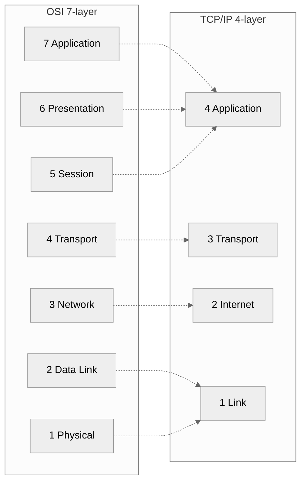

# 1. Network Fundamentals

> [!info] Where this fits
> This note is the conceptual foundation for the entire Networking chapter. After this, the chapter moves from theory to practice: [[2. Sockets in C++]] (the POSIX API), [[3. TCP Server and Client]] (a working echo server), [[4. UDP Communication]] (connectionless), [[5. Non-blocking I-O and epoll]] (scalability), and [[6. Boost.Asio Overview]] (a modern C++ wrapper).

## Why This Matters

Almost every interesting C++ program eventually needs to talk to something else — another process on the same machine, a database on a different rack, a web service on a different continent. Networking is the substrate that makes "interesting" possible at scale. A game server, a trading engine, an HTTP API, a chat application, a database — all are networked.

Networking is also the part of C++ where the standard library gives you the least help. As of C++23, there is still no standard networking library (the proposal was dropped from C++23 and is on hold). To write network code, you must reach for **POSIX sockets** (Linux/macOS), **Winsock** (Windows), or a wrapper library like **Boost.Asio**. Understanding the underlying abstractions — packets, addresses, ports, protocols — is the difference between writing code that works on your laptop and writing code that survives contact with a real network.

This note gives you the vocabulary. The next five notes apply it.

## Background

### A very brief history of computer networking

- **1969:** ARPANET, the first packet-switched network, goes live with four nodes (UCLA, SRI, UCSB, Utah).
- **1974:** Vint Cerf and Bob Kahn publish *"A Protocol for Packet Network Intercommunication"*, introducing TCP.
- **1981:** RFC 791 (IPv4) and RFC 793 (TCP) published.
- **1983:** January 1, the ARPANET switches from NCP to TCP/IP — the "flag day". The modern Internet is born.
- **1989:** Tim Berners-Lee invents the World Wide Web at CERN.
- **1991:** RFC 1323 introduces "TCP high performance options" (window scaling, timestamps).
- **1995:** HTTP/1.0 (RFC 1945).
- **1999:** HTTP/1.1 (RFC 2616) — persistent connections, pipelining.
- **2007:** The **C10K problem** essay by Dan Kegel popularizes the need for event-driven servers.
- **2015:** HTTP/2 (RFC 7540) — multiplexed binary streams.
- **2022:** HTTP/3 (RFC 9114) — runs over QUIC, which runs over UDP.

The 50-year arc is from "two computers talking" to "billions of devices talking at high speed with cryptographic guarantees." The conceptual abstractions have been remarkably stable; the engineering has gotten brutal.

### The OSI 7-layer model

The **Open Systems Interconnection** model (ISO/IEC 7498-1, 1984) is a theoretical seven-layer reference model. No real system implements it cleanly, but it is the canonical mental model for discussing networks.

| Layer | Name        | Responsibility                                  | Example protocols / devices  |
| ----- | ----------- | ----------------------------------------------- | ---------------------------- |
| 7     | Application | User-facing semantics                           | HTTP, FTP, SMTP, DNS, SSH    |
| 6     | Presentation| Data format, encryption, compression            | TLS, JPEG, ASCII             |
| 5     | Session     | Dialog control, session management              | RPC, NetBIOS                 |
| 4     | Transport   | End-to-end delivery, reliability, flow control  | TCP, UDP, SCTP, QUIC         |
| 3     | Network     | Routing between hosts                           | IP, ICMP, routers            |
| 2     | Data Link   | Frame delivery between adjacent nodes           | Ethernet, Wi-Fi, switches    |
| 1     | Physical    | Bit transmission over wire/radio                | 1000BASE-T, 802.11ac         |

Mnemonic (top to bottom): **A**ll **P**eople **S**eem **T**o **N**eed **D**ata **P**rocessing.

A common shortcut: layers 5-7 are lumped as "application", and the model collapses to the TCP/IP 4-layer model.

### The TCP/IP 4-layer model

The model that actually matches the Internet:

| Layer | Name          | OSI equivalent |
| ----- | ------------- | -------------- |
| 4     | Application   | 5, 6, 7        |
| 3     | Transport     | 4              |
| 2     | Internet      | 3              |
| 1     | Link          | 1, 2           |

When you write a C++ network program, you almost always work at Layer 4 (Transport — TCP or UDP). The OS handles Layers 1-3.

### IP, ports, sockets

**IP address** — a 32-bit (IPv4) or 128-bit (IPv6) number that identifies a network interface. Examples:
- IPv4: `192.0.2.42`
- IPv6: `2001:db8::1`

**Port** — a 16-bit number (0–65535) that identifies a specific process or service on a host. Ports 0-1023 are "well-known" (require root/admin to bind on Unix). Ports 1024-49151 are "registered". Ports 49152-65535 are "ephemeral" (used for outgoing connections).

**Socket** — the OS abstraction. A socket is an endpoint of a communication channel. It is identified by a 5-tuple:
```
{ protocol, local IP, local port, remote IP, remote port }
```
Two sockets on the same host can share local IP and port if the remote endpoints differ — this is how a single server port handles thousands of simultaneous connections.

### DNS resolution

Humans remember names (`example.com`); the network uses IP addresses. **DNS** (Domain Name System, RFC 1035) maps names to addresses through a hierarchical, distributed, cached lookup system.

The lookup process:
1. Application calls `getaddrinfo("example.com", "80", ...)`.
2. The resolver library checks local cache (nscld, systemd-resolved, etc.).
3. If not cached, it queries the configured recursive resolver (often the ISP's, or 1.1.1.1 / 8.8.8.8).
4. The recursive resolver walks the DNS tree: root → TLD (`.com`) → authoritative for `example.com`.
5. The result (an `A` or `AAAA` record) is cached at multiple levels with a TTL.

In C++, the modern API is `getaddrinfo()`, which replaces the deprecated `gethostbyname()` and supports IPv6 out of the box. See [[2. Sockets in C++]] for code.

### TCP handshake

TCP establishes a connection with a **three-way handshake**:

1. **SYN** — Client sends a segment with the SYN flag set and a random sequence number `x`.
2. **SYN-ACK** — Server responds with SYN+ACK, acknowledging `x+1` and providing its own sequence `y`.
3. **ACK** — Client sends ACK with `ack = y+1`. Connection is established.



The handshake carries one RTT of latency. For short transfers (a single request/response), this is significant — one reason HTTP/2 and HTTP/3 multiplex multiple requests over a single connection.

### TCP teardown

Either side may close. The standard teardown is a **four-way handshake** with FIN+ACK segments:



The **TIME_WAIT** state (typically 60-120 seconds, 2x the Maximum Segment Lifetime) exists to absorb stray segments from a closed connection so they cannot corrupt a future connection that reuses the same 5-tuple. This is why servers can run out of ports under heavy connection churn — every closed client connection lingers in TIME_WAIT on the server side. The fix is `SO_REUSEADDR` (see [[3. TCP Server and Client]]).

### UDP characteristics

**UDP** (User Datagram Protocol) is the "send it and hope" protocol:
- No connection establishment (no handshake).
- No reliability (packets may be lost, duplicated, reordered).
- No flow control (you can flood the receiver).
- No congestion control (you can flood the network).
- Small header (8 bytes vs TCP's 20+).

UDP is preferred when:
- Latency is more important than reliability (VoIP, video streaming, gaming).
- The application has its own reliability layer (QUIC, WebRTC, TFTP).
- The data is small and frequent (DNS queries — 1 request, 1 response, no need for TCP's handshake).
- Multicast or broadcast is needed (UDP supports both; TCP does not).

### Application layer protocols

| Protocol  | Transport | Default port | Notes                                  |
| --------- | --------- | ------------ | -------------------------------------- |
| HTTP/1.x  | TCP       | 80           | Text-based, request/response.          |
| HTTPS     | TCP+TLS   | 443          | HTTP over TLS.                         |
| HTTP/2    | TCP+TLS   | 443          | Binary, multiplexed streams.           |
| HTTP/3    | UDP+QUIC  | 443          | TLS 1.3 integrated into QUIC.          |
| DNS       | UDP/TCP   | 53           | UDP for normal queries, TCP for zone transfers / large responses. |
| SSH       | TCP       | 22           | Encrypted remote shell.                |
| SMTP      | TCP       | 25, 587      | Mail transfer.                         |
| FTP       | TCP       | 21 (+20)     | Legacy file transfer.                  |
| WebSocket | TCP       | 80/443       | Bidirectional over HTTP upgrade.       |

### HTTP evolution

- **HTTP/1.0 (1996):** One request per TCP connection. Simple but slow (handshake per request).
- **HTTP/1.1 (1997):** Persistent connections (`Connection: keep-alive`), pipelining (rarely used due to head-of-line blocking), chunked transfer encoding.
- **HTTP/2 (2015):** Binary framing, multiplexed streams (multiple requests on one connection, no head-of-line blocking at the HTTP level), header compression (HPACK), server push.
- **HTTP/3 (2022):** Runs over **QUIC**, which runs over UDP. Eliminates TCP head-of-line blocking at the transport level. Faster connection establishment (1 RTT vs 2-3 for TCP+TLS).

**QUIC** (RFC 9000) is the big architectural shift of the last decade: it moves the transport layer into the application, in userspace, over UDP. This allows rapid iteration without OS updates. HTTP/3, HTTP/3 DNS, and many VPN protocols now use QUIC.

### The C10K problem

Dan Kegel's 1999 essay framed the question: "It's time for web servers to handle ten thousand clients simultaneously." The classic thread-per-connection model (one OS thread per client) fails around 10k connections due to memory and context-switching overhead. The solutions are:

- **Event-driven** (epoll, kqueue, IOCP) — a single thread manages thousands of sockets.
- **Async I/O** (Boost.Asio, libuv) — the same idea, abstracted.
- **Coroutine-based** (C++20 coroutines + Asio) — async code that looks synchronous.

See [[5. Non-blocking I-O and epoll]] for the implementation.

## Mermaid Diagrams

### OSI 7-layer model with examples



### TCP three-way handshake



### TCP four-way teardown



### DNS resolution flow



### TCP/IP vs OSI



## Code Examples

### Address inspection (POSIX)

```cpp
#include <netdb.h>
#include <arpa/inet.h>
#include <iostream>

int main() {
    addrinfo hints{};
    hints.ai_family = AF_UNSPEC;       // IPv4 or IPv6
    hints.ai_socktype = SOCK_STREAM;   // TCP

    addrinfo* res = nullptr;
    int rc = getaddrinfo("example.com", "80", &hints, &res);
    if (rc != 0) {
        std::cerr << "getaddrinfo: " << gai_strerror(rc) << "\n";
        return 1;
    }

    for (addrinfo* p = res; p != nullptr; p = p->ai_next) {
        char ipstr[INET6_ADDRSTRLEN];
        void* addr = nullptr;
        if (p->ai_family == AF_INET) {
            auto* sa = reinterpret_cast<sockaddr_in*>(p->ai_addr);
            addr = &sa->sin_addr;
        } else {
            auto* sa = reinterpret_cast<sockaddr_in6*>(p->ai_addr);
            addr = &sa->sin6_addr;
        }
        inet_ntop(p->ai_family, addr, ipstr, sizeof(ipstr));
        std::cout << "Address: " << ipstr << "\n";
    }
    freeaddrinfo(res);
    return 0;
}
```

### Byte order conversion

Network byte order is **big-endian**. Host byte order varies (x86/ARM are little-endian; older MIPS/SPARC were big-endian). Use the standard conversion functions:

```cpp
#include <netinet/in.h>

uint16_t host_port = 8080;
uint16_t net_port = htons(host_port);   // host-to-network-short
uint32_t net_addr = htonl(0xC0A80101);  // host-to-network-long

uint16_t back_to_host = ntohs(net_port);
uint32_t back_to_host_addr = ntohl(net_addr);
```

**Always** use these functions when constructing or parsing structures that cross the host boundary (e.g., wire protocols). Hard-coding big-endian bytes is non-portable.

### Inspecting interfaces

```cpp
#include <ifaddrs.h>
#include <net/if.h>
#include <arpa/inet.h>
#include <iostream>

int main() {
    ifaddrs* ifap = nullptr;
    if (getifaddrs(&ifap) != 0) {
        perror("getifaddrs");
        return 1;
    }
    for (ifaddrs* p = ifap; p; p = p->ifa_next) {
        if (!p->ifa_addr) continue;
        char buf[INET6_ADDRSTRLEN];
        if (p->ifa_addr->sa_family == AF_INET) {
            auto* sa = reinterpret_cast<sockaddr_in*>(p->ifa_addr);
            inet_ntop(AF_INET, &sa->sin_addr, buf, sizeof(buf));
            std::cout << p->ifa_name << ": " << buf << "\n";
        } else if (p->ifa_addr->sa_family == AF_INET6) {
            auto* sa = reinterpret_cast<sockaddr_in6*>(p->ifa_addr);
            inet_ntop(AF_INET6, &sa->sin6_addr, buf, sizeof(buf));
            std::cout << p->ifa_name << ": " << buf << "\n";
        }
    }
    freeifaddrs(ifap);
    return 0;
}
```

### Checking if a port is in use

```bash
# Linux/macOS
ss -tlnp | grep :8080
lsof -iTCP:8080 -sTCP:LISTEN
netstat -an | grep LISTEN | grep 8080

# Windows
netstat -ano | findstr :8080
```

## Common Pitfalls

> [!warning] Pitfalls
> - **Forgetting byte order.** Hard-coding `port = 8080` into a `sockaddr_in` without `htons()` works on big-endian machines and silently fails on little-endian. Always use `htons`/`htonl`.
> - **Assuming IPv4-only.** Code that uses `sockaddr_in` directly cannot accept IPv6 connections. Modern code uses `getaddrinfo` and `sockaddr_storage` to be protocol-agnostic.
> - **Trusting DNS to be fast.** A single `getaddrinfo` call can take seconds. In latency-sensitive code, cache results or use a resolver library (c-ares, dnsutils).
> - **TIME_WAIT exhaustion.** A server that opens and closes many short-lived connections can exhaust the ephemeral port range. Use `SO_REUSEADDR` and connection pooling.
> - **Believing TCP is "reliable".** TCP guarantees delivery of bytes you write, but not that the application on the other end is alive. A process can crash mid-stream; the TCP stack may finish delivering buffered data, then signal EOF.
> - **Conflating HTTP with TCP.** HTTP runs over TCP (or QUIC). Tools like `curl` use HTTP; raw TCP tools like `nc` do not. The semantics differ wildly.
> - **Forgetting the five-tuple.** A "connection" is `{proto, local-IP, local-port, remote-IP, remote-port}`. Two clients cannot share all five; the server distinguishes them by remote IP+port.
> - **Treating localhost as production.** `127.0.0.1` has zero RTT, zero packet loss, and infinite bandwidth. Bugs that hide on localhost explode in production. Test with `tc` (traffic control) and `tc netem` to simulate real conditions.
> - **Hard-coded ports.** Always make ports configurable. Port 80 requires root; containers may map 80→8080.

## Tips and Tricks

> [!tip] Tips
> - Use `getaddrinfo`, not `gethostbyname`. The former is IPv6-aware and thread-safe.
> - Use `sockaddr_storage` for any variable that holds an address of unknown family. It is large enough for any address family.
> - Set `SO_REUSEADDR` on servers; set `SO_KEEPALIVE` on long-lived clients to detect dead peers.
> - For TCP servers, set `TCP_NODELAY` to disable Nagle's algorithm if you are sending small, frequent messages (otherwise the OS waits 200ms to coalesce).
> - For UDP, set `SO_RCVBUF` and `SO_SNDBUF` to large values if you expect bursts; default buffers are small (a few hundred KB) and cause packet drops.
> - Use `Wireshark` to actually see what is on the wire. Reading protocol specs is necessary; seeing the bytes is irreplaceable.
> - Use `nc` (netcat) for quick interactive debugging: `nc localhost 8080` connects, you type, you see responses.
> - Use `tcpdump` for low-level capture: `tcpdump -i any -n 'tcp port 80'`.
> - Test IPv6 explicitly. Set up an IPv6-only test network. Many codebases have IPv6 bugs that hide until a user with an IPv6-only network (common on mobile) hits them.
> - For modern C++ code, prefer [[6. Boost.Asio Overview]] over raw POSIX sockets. It is cross-platform, supports coroutines, and handles edge cases (cancellation, timeouts) that raw sockets do not.

## Active Recall

1. Name the 7 OSI layers from top to bottom.
2. How does the TCP/IP 4-layer model map to OSI?
3. Describe the TCP three-way handshake in detail. Why does it use random sequence numbers?
4. Why does TCP have a TIME_WAIT state? Why is it 2*MSL?
5. Give three reasons an application would choose UDP over TCP.
6. What does `getaddrinfo` do that `gethostbyname` does not?
7. Why is hard-coding a port as a `uint16_t` into a `sockaddr_in` wrong without `htons`?
8. What is QUIC, and why does HTTP/3 use it instead of TCP?
9. Why is `127.0.0.1` a poor test environment for production network code?
10. What is the C10K problem? What is the modern answer to it?

### Network diagnostic tools you should know

Beyond `ping`, `traceroute`, `netstat`, `ss`, `lsof`, and `tcpdump` (all covered briefly above), every network programmer should be comfortable with `Wireshark` for protocol-level inspection, `curl -v` for HTTP debugging, `nc` (netcat) for interactive socket tests, `dig` for DNS troubleshooting, and `nmap` for port scanning and host discovery. On Linux, `tc` (traffic control) with `netem` is irreplaceable for simulating packet loss, latency, and reordering — features that localhost cannot reproduce. `iperf3` measures raw TCP/UDP throughput between two hosts. Finally, `strace -e network` reveals the exact syscalls a program makes, which is invaluable when a library is doing something mysterious with sockets under the hood. Mastering this toolkit is the difference between guessing at network problems and measuring them.

## Active Recall (additional)

11. Which diagnostic tool would you use to (a) see HTTP headers, (b) capture all TCP packets, (c) simulate 10% packet loss?

## Next Steps

- Continue to [[2. Sockets in C++]] for the POSIX socket API.
- Then [[3. TCP Server and Client]] for a working echo server.
- Then [[4. UDP Communication]] for connectionless messaging.
- Then [[5. Non-blocking I-O and epoll]] for scalability to thousands of connections.
- Then [[6. Boost.Asio Overview]] for a modern C++ abstraction.
- Cross-link to [[14. Concurrency and Multithreading]] — high-performance servers combine event loops with thread pools.
- Cross-link to [[13. Error Handling and Exceptions]] — network calls fail constantly; error handling is 70% of network code.
