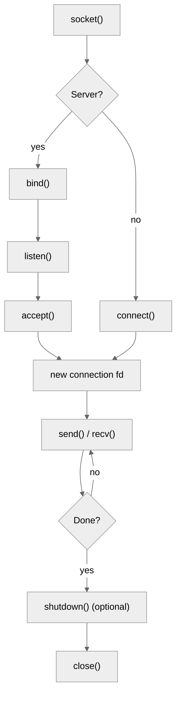
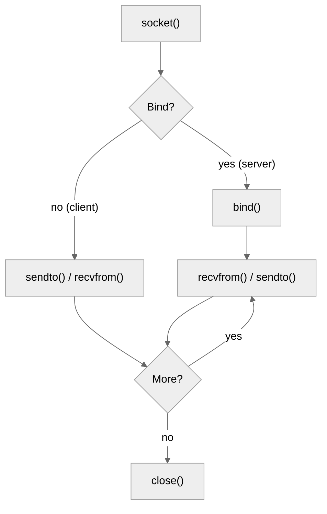
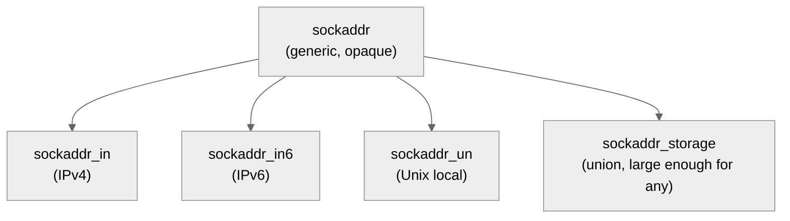

# 2. Sockets in C++

> [!info] Where this fits
> This note is the POSIX socket API reference. After [[1. Network Fundamentals]] gave you the vocabulary (layers, addresses, ports), this note shows you the actual function calls. The next notes apply them: [[3. TCP Server and Client]] builds a full TCP echo server, [[4. UDP Communication]] builds a UDP echo server, [[5. Non-blocking I-O and epoll]] scales to thousands of clients, and [[6. Boost.Asio Overview]] wraps it all in modern C++.

## Why This Matters

The POSIX socket API is one of the oldest and most stable APIs in computing. Its core functions — `socket`, `bind`, `listen`, `accept`, `connect`, `send`, `recv` — date to 4.2BSD in 1983 and have been essentially unchanged for 40 years. The same API works on Linux, macOS, iOS, Android, the BSDs, and (with minor differences) Windows via Winsock. If you understand POSIX sockets, you can write networked code on any platform.

The API's age is both its strength and its weakness:
- **Strength:** ubiquitous, well-documented, no dependencies, no abstractions to learn.
- **Weakness:** C-style, error-prone, requires manual resource management, and you must deal with platform differences (Winsock headers, signal handling, partial reads/writes).

Modern C++ code that needs to be cross-platform or production-grade usually wraps POSIX sockets in a library like Boost.Asio. But:
1. Asio itself uses POSIX sockets under the hood; understanding the raw API helps you debug Asio code.
2. Embedded systems, kernels, and resource-constrained environments often cannot use Asio.
3. The raw API is the lingua franca of network programming literature; if you cannot read `man 2 accept`, you cannot learn from classic sources.

This note is your reference card. The next notes show you how to use it.

## Background

### The socket abstraction

A **socket** is a file-descriptor-like handle (on POSIX systems, it actually *is* a file descriptor — a small integer) that represents one endpoint of a network communication channel. The kernel maintains the state machine behind it; you make system calls to advance that state machine.

The lifecycle of a TCP socket:
1. **Create** — `socket()` returns a fresh file descriptor.
2. **Bind** (server only) — `bind()` associates it with a local address and port.
3. **Listen** (server only) — `listen()` marks the socket as passive (willing to accept connections).
4. **Accept** (server only) — `accept()` blocks until a client connects, returning a new socket for that connection.
5. **Connect** (client only) — `connect()` initiates a TCP handshake with a remote address.
6. **Send / receive** — `send()`, `recv()`, `read()`, `write()` exchange data.
7. **Close** — `close()` (POSIX) or `closesocket()` (Windows) tears down the connection and releases the descriptor.

The lifecycle of a UDP socket is simpler — no listen, accept, or connect:
1. **Create** — `socket()`.
2. **Bind** (optional) — for servers that need a known port.
3. **Sendto / recvfrom** — exchange datagrams with explicit addresses.
4. **Close**.

### Address structures

POSIX uses a hierarchy of address structures:
- `sockaddr` — the generic, opaque structure (just `sa_family` + 14 bytes of data). Every address-family-specific structure can be cast to `sockaddr*`.
- `sockaddr_in` — IPv4 address: `sin_family` (`AF_INET`), `sin_port` (network byte order), `sin_addr` (`in_addr`).
- `sockaddr_in6` — IPv6 address: `sin6_family` (`AF_INET6`), `sin6_port`, `sin6_addr`, `sin6_flowinfo`, `sin6_scope_id`.
- `sockaddr_storage` — a union-like structure large enough to hold any address family. Use this when you do not know the family in advance.

The structures are designed to be `memset` to zero, then populated. The classic mistake is forgetting to clear the structure, leaving garbage in fields the kernel reads.

### Name resolution: `getaddrinfo`

```cpp
struct addrinfo* res = nullptr;
struct addrinfo hints{};
hints.ai_family = AF_UNSPEC;        // IPv4 or IPv6
hints.ai_socktype = SOCK_STREAM;    // TCP

int rc = getaddrinfo("example.com", "http", &hints, &res);
if (rc != 0) {
    std::cerr << gai_strerror(rc) << "\n";
    return;
}

// res is a linked list of address candidates. Iterate to find one that works.
for (struct addrinfo* p = res; p != nullptr; p = p->ai_next) {
    int fd = socket(p->ai_family, p->ai_socktype, p->ai_protocol);
    if (fd < 0) continue;
    if (connect(fd, p->ai_addr, p->ai_addrlen) == 0) {
        // success!
        break;
    }
    close(fd);
}
freeaddrinfo(res);
```

`getaddrinfo` is the modern, thread-safe, IPv6-aware successor to `gethostbyname`. Always use it.

### `inet_pton` and `inet_ntop`

For converting between presentation (string) and network (binary) forms of addresses:

```cpp
#include <arpa/inet.h>

// String to binary
in_addr addr;
if (inet_pton(AF_INET, "192.168.1.1", &addr) != 1) {
    std::cerr << "Invalid address\n";
}

// Binary to string
char str[INET_ADDRSTRLEN];
inet_ntop(AF_INET, &addr, str, sizeof(str));
// str == "192.168.1.1"
```

`inet_pton` returns 1 on success, 0 on invalid input, -1 on bad address family. `inet_ntop` returns the destination pointer on success or NULL on failure.

### Byte order

Network byte order is **big-endian**. Host byte order is whatever the CPU uses (x86 and ARM are little-endian; some MIPS and SPARC were big-endian). The standard conversion functions:

| Function   | Converts                          |
| ---------- | --------------------------------- |
| `htons(x)` | `uint16_t` host → network         |
| `htonl(x)` | `uint32_t` host → network         |
| `ntohs(x)` | `uint16_t` network → host         |
| `ntohl(x)` | `uint32_t` network → host         |

On a big-endian host, these are no-ops. On a little-endian host, they byte-swap. Always use them; never assume.

For 64-bit values, there is no standard function. Use `htobe64`/`be64toh` (BSD, Linux `<endian.h>`) or write your own.

### Error handling

POSIX socket functions return -1 on error and set `errno`. Standard practice:

```cpp
#include <cerrno>
#include <cstring>
#include <iostream>

int fd = socket(AF_INET, SOCK_STREAM, 0);
if (fd < 0) {
    std::cerr << "socket: " << std::strerror(errno) << "\n";
    return 1;
}

// Or use perror, which writes "prefix: error message\n" to stderr:
if (fd < 0) {
    perror("socket");
    return 1;
}
```

For `getaddrinfo` (which is not a system call), the error code is returned directly — use `gai_strerror`.

Common socket errors:

| Error           | Meaning                                                |
| --------------- | ------------------------------------------------------ |
| `ECONNREFUSED`  | No process is listening at the remote port.            |
| `ETIMEDOUT`     | Connect or send timed out (kernel gave up).            |
| `ECONNRESET`    | Peer sent a RST (crashed, closed uncleanly).           |
| `EPIPE`         | Wrote to a socket whose read end is closed (SIGPIPE).  |
| `EAGAIN`/`EWOULDBLOCK` | Non-blocking socket would block.              |
| `EINTR`         | Interrupted by signal; retry the call.                 |
| `EADDRINUSE`    | Bind failed: address already in use.                   |
| `EADDRNOTAVAIL` | Bind failed: address not on this host.                 |
| `ENOTCONN`      | Operation requires an established connection.          |

### `SIGPIPE`

When you `send()` to a socket whose peer has closed, the kernel raises `SIGPIPE`, which by default terminates the process. This is almost never what you want in a server. Two fixes:

1. **Ignore the signal globally:** `signal(SIGPIPE, SIG_IGN);` at program start.
2. **Per-call:** pass `MSG_NOSIGNAL` flag to `send()`: `send(fd, buf, len, MSG_NOSIGNAL);`.

Always do one of these in any C++ network program. The third option — installing a no-op handler — is also valid but less common.

## Main Content

### `socket()`

```cpp
#include <sys/socket.h>

int fd = socket(int domain, int type, int protocol);
```

- **domain**: `AF_INET` (IPv4), `AF_INET6` (IPv6), `AF_UNIX` (local), `AF_BLUETOOTH`, etc.
- **type**: `SOCK_STREAM` (TCP), `SOCK_DGRAM` (UDP), `SOCK_RAW` (raw IP), `SOCK_SEQPACKET`.
- **protocol**: usually `0` to let the system pick based on domain+type; sometimes explicit (`IPPROTO_TCP`, `IPPROTO_UDP`, `IPPROTO_SCTP`).

Returns a non-negative file descriptor on success, -1 on error.

```cpp
int tcp_fd = socket(AF_INET6, SOCK_STREAM, 0);   // IPv6 TCP
int udp_fd = socket(AF_INET,  SOCK_DGRAM,  0);   // IPv4 UDP
```

### `bind()`

```cpp
int bind(int fd, const struct sockaddr* addr, socklen_t addrlen);
```

Associates the socket with a local address. Servers must `bind` to a known port; clients usually let the OS pick an ephemeral port (skip `bind`).

```cpp
sockaddr_in6 addr{};
addr.sin6_family = AF_INET6;
addr.sin6_port   = htons(8080);
addr.sin6_addr   = in6addr_any;   // ::, listen on all interfaces

if (bind(fd, reinterpret_cast<sockaddr*>(&addr), sizeof(addr)) < 0) {
    perror("bind");
    return 1;
}
```

`in6addr_any` (`::`) listens on all IPv6 interfaces. The IPv4 equivalent is `INADDR_ANY` (`0.0.0.0`). On a dual-stack system, binding to `::` with `IPV6_V6ONLY=0` (the default on Linux) also accepts IPv4-mapped connections.

### `listen()`

```cpp
int listen(int fd, int backlog);
```

Marks the socket as passive — willing to accept connections. `backlog` is the maximum length of the queue of pending connections (clients that have completed SYN-ACK but not yet been `accept()`ed). The kernel caps this to `net.core.somaxconn` (Linux) or `kern.ipc.somaxconn` (BSD).

```cpp
if (listen(fd, 128) < 0) { perror("listen"); return 1; }
```

Modern Linux (5.4+) allows large values; older systems silently cap. Set the `backlog` to at least `128` for production servers; `1024` is reasonable for high-traffic.

### `accept()`

```cpp
int accept(int fd, struct sockaddr* addr, socklen_t* addrlen);
```

Blocks (by default) until a client connects, then returns a **new** file descriptor for that connection. The original `fd` continues to listen; the new fd is for talking to this one client.

```cpp
sockaddr_storage client_addr{};
socklen_t client_len = sizeof(client_addr);
int conn_fd = accept(fd, reinterpret_cast<sockaddr*>(&client_addr), &client_len);
if (conn_fd < 0) { perror("accept"); return 1; }
```

If `addr` is NULL, the client address is not returned.

### `connect()`

```cpp
int connect(int fd, const struct sockaddr* addr, socklen_t addrlen);
```

Initiates a TCP handshake. Blocks (by default) until the handshake completes (or fails).

```cpp
addrinfo hints{};
hints.ai_family = AF_UNSPEC;
hints.ai_socktype = SOCK_STREAM;
addrinfo* res = nullptr;
getaddrinfo("example.com", "80", &hints, &res);

for (addrinfo* p = res; p; p = p->ai_next) {
    int fd = socket(p->ai_family, p->ai_socktype, p->ai_protocol);
    if (fd < 0) continue;
    if (connect(fd, p->ai_addr, p->ai_addrlen) == 0) {
        // success; use fd
        break;
    }
    close(fd);
}
freeaddrinfo(res);
```

### `send()` and `recv()`

```cpp
ssize_t send(int fd, const void* buf, size_t len, int flags);
ssize_t recv(int fd, void* buf, size_t len, int flags);
```

For TCP. Both return the number of bytes transferred, or -1 on error. **Critical:** for TCP, a single `send` may not transfer all bytes; you must loop.

```cpp
ssize_t send_all(int fd, const void* buf, size_t len) {
    size_t total = 0;
    const char* p = static_cast<const char*>(buf);
    while (total < len) {
        ssize_t n = send(fd, p + total, len - total, MSG_NOSIGNAL);
        if (n < 0) {
            if (errno == EINTR) continue;
            return -1;
        }
        if (n == 0) break;
        total += n;
    }
    return total;
}
```

Common flags:
- `MSG_NOSIGNAL` — do not raise `SIGPIPE` on broken pipe (Linux).
- `MSG_DONTWAIT` — non-blocking for this call only.
- `MSG_MORE` (Linux) — coalesce with subsequent sends (similar to Nagle's algorithm but explicit).
- `MSG_PEEK` (recv) — peek at the data without consuming it.
- `MSG_WAITALL` (recv) — block until all `len` bytes are received (only if the connection stays open).

### `sendto()` and `recvfrom()`

For UDP, where each message has its own destination:

```cpp
ssize_t sendto(int fd, const void* buf, size_t len, int flags,
               const struct sockaddr* dest, socklen_t destlen);

ssize_t recvfrom(int fd, void* buf, size_t len, int flags,
                 struct sockaddr* src, socklen_t* srclen);
```

```cpp
sockaddr_in6 dest{};
dest.sin6_family = AF_INET6;
dest.sin6_port = htons(53);
inet_pton(AF_INET6, "2001:4860:4860::8888", &dest.sin6_addr);

const char* query = "\x00\x01hello";
ssize_t n = sendto(udp_fd, query, 6, 0,
                   reinterpret_cast<sockaddr*>(&dest), sizeof(dest));
```

### `close()`

```cpp
#include <unistd.h>
int close(int fd);
```

Releases the file descriptor. For TCP sockets, this initiates the FIN handshake (graceful close). The kernel may buffer remaining data for a while.

For Windows, use `closesocket()` (not `close()`).

### `shutdown()`

For half-close — close one direction but not the other:

```cpp
int shutdown(int fd, int how);
// how: SHUT_RD (no more reads), SHUT_WR (no more writes), SHUT_RDWR (both)
```

Useful when you want to signal "I am done sending, but I still want to read your response" (e.g., HTTP/1.0 client after sending a request):

```cpp
shutdown(fd, SHUT_WR);
// now read the response
char buf[4096];
while (recv(fd, buf, sizeof(buf), 0) > 0) { /* ... */ }
close(fd);
```

### Socket options: `setsockopt`

```cpp
int setsockopt(int fd, int level, int optname, const void* optval, socklen_t optlen);
int getsockopt(int fd, int level, int optname, void* optval, socklen_t* optlen);
```

Common options (level `SOL_SOCKET`):

| Option           | Type     | Effect                                                  |
| ---------------- | -------- | ------------------------------------------------------- |
| `SO_REUSEADDR`   | int      | Allow bind to a port in TIME_WAIT (servers MUST set).   |
| `SO_KEEPALIVE`   | int      | Send keepalive probes; detect dead peers.               |
| `SO_RCVBUF`      | int      | Receive buffer size (bytes).                            |
| `SO_SNDBUF`      | int      | Send buffer size (bytes).                               |
| `SO_RCVTIMEO`    | timeval  | Receive timeout (alternative to non-blocking).          |
| `SO_SNDTIMEO`    | timeval  | Send timeout.                                           |
| `SO_BROADCAST`   | int      | Allow broadcast (UDP).                                  |
| `SO_LINGER`      | linger   | Control close behavior when data is unsent.             |

Level `IPPROTO_TCP`:

| Option           | Effect                                                          |
| ---------------- | --------------------------------------------------------------- |
| `TCP_NODELAY`    | Disable Nagle's algorithm (send small packets immediately).    |
| `TCP_KEEPIDLE`   | Seconds of idle before first keepalive probe.                  |
| `TCP_KEEPINTVL`  | Seconds between probes.                                          |
| `TCP_KEEPCNT`    | Number of unacked probes before giving up.                      |

Example:

```cpp
int yes = 1;
setsockopt(fd, SOL_SOCKET, SO_REUSEADDR, &yes, sizeof(yes));

int one = 1;
setsockopt(conn_fd, IPPROTO_TCP, TCP_NODELAY, &one, sizeof(one));

timeval tv{.tv_sec = 5, .tv_usec = 0};
setsockopt(conn_fd, SOL_SOCKET, SO_RCVTIMEO, &tv, sizeof(tv));
```

### Cross-platform: Winsock differences

On Windows, sockets are `SOCKET` (a `UINT_PTR`), not `int`. Invalid is `INVALID_SOCKET` (~0), not -1. Errors are reported via `WSAGetLastError()`, not `errno`. Closes are `closesocket()`, not `close()`. The API requires `WSAStartup()` before any socket call and `WSACleanup()` at exit.

Modern approach: a thin abstraction layer:

```cpp
#ifdef _WIN32
  #include <winsock2.h>
  #include <ws2tcpip.h>
  #pragma comment(lib, "ws2_32.lib")
  using socket_t = SOCKET;
  constexpr socket_t kInvalidSocket = INVALID_SOCKET;
  inline int close_socket(socket_t s) { return closesocket(s); }
  inline int last_error() { return WSAGetLastError(); }
#else
  #include <sys/socket.h>
  #include <netinet/in.h>
  #include <arpa/inet.h>
  #include <netdb.h>
  #include <unistd.h>
  using socket_t = int;
  constexpr socket_t kInvalidSocket = -1;
  inline int close_socket(socket_t s) { return ::close(s); }
  inline int last_error() { return errno; }
#endif
```

For new C++ projects, prefer Boost.Asio — it abstracts these differences entirely.

## Mermaid Diagrams

### Socket lifecycle (TCP)



### Socket lifecycle (UDP)



### Address family hierarchy



## Code Examples

### TCP client (full)

```cpp
#include <sys/socket.h>
#include <netdb.h>
#include <unistd.h>
#include <cstring>
#include <iostream>
#include <stdexcept>

class TcpClient {
public:
    TcpClient(const std::string& host, const std::string& port) {
        addrinfo hints{};
        hints.ai_family = AF_UNSPEC;
        hints.ai_socktype = SOCK_STREAM;
        addrinfo* res = nullptr;
        int rc = getaddrinfo(host.c_str(), port.c_str(), &hints, &res);
        if (rc != 0) throw std::runtime_error(gai_strerror(rc));

        for (addrinfo* p = res; p; p = p->ai_next) {
            fd_ = socket(p->ai_family, p->ai_socktype, p->ai_protocol);
            if (fd_ < 0) continue;
            if (connect(fd_, p->ai_addr, p->ai_addrlen) == 0) {
                freeaddrinfo(res);
                return;
            }
            close(fd_);
            fd_ = -1;
        }
        freeaddrinfo(res);
        throw std::runtime_error("connect failed");
    }

    ~TcpClient() { if (fd_ >= 0) close(fd_); }

    TcpClient(const TcpClient&) = delete;
    TcpClient& operator=(const TcpClient&) = delete;

    void send_all(const std::string& s) {
        size_t sent = 0;
        while (sent < s.size()) {
            ssize_t n = send(fd_, s.data() + sent, s.size() - sent, MSG_NOSIGNAL);
            if (n < 0) {
                if (errno == EINTR) continue;
                throw std::runtime_error(std::strerror(errno));
            }
            sent += n;
        }
    }

    std::string recv_line() {
        std::string line;
        char c;
        while (true) {
            ssize_t n = recv(fd_, &c, 1, 0);
            if (n <= 0) break;
            line.push_back(c);
            if (c == '\n') break;
        }
        return line;
    }

private:
    int fd_ = -1;
};

int main() {
    signal(SIGPIPE, SIG_IGN);
    TcpClient c("example.com", "80");
    c.send_all("GET / HTTP/1.0\r\nHost: example.com\r\n\r\n");
    std::cout << c.recv_line();
}
```

### UDP echo server (minimal)

```cpp
#include <sys/socket.h>
#include <netinet/in.h>
#include <unistd.h>
#include <cstring>
#include <iostream>

int main() {
    int fd = socket(AF_INET6, SOCK_DGRAM, 0);
    if (fd < 0) { perror("socket"); return 1; }

    int v6only = 0;
    setsockopt(fd, IPPROTO_IPV6, IPV6_V6ONLY, &v6only, sizeof(v6only));

    sockaddr_in6 addr{};
    addr.sin6_family = AF_INET6;
    addr.sin6_port = htons(9000);
    addr.sin6_addr = in6addr_any;

    if (bind(fd, reinterpret_cast<sockaddr*>(&addr), sizeof(addr)) < 0) {
        perror("bind"); return 1;
    }

    char buf[1500];
    while (true) {
        sockaddr_storage src{};
        socklen_t srclen = sizeof(src);
        ssize_t n = recvfrom(fd, buf, sizeof(buf), 0,
                             reinterpret_cast<sockaddr*>(&src), &srclen);
        if (n < 0) { perror("recvfrom"); continue; }
        sendto(fd, buf, n, 0, reinterpret_cast<sockaddr*>(&src), srclen);
    }
    close(fd);
}
```

### Setting common socket options

```cpp
void configure_listening_socket(int fd) {
    int yes = 1;
    setsockopt(fd, SOL_SOCKET, SO_REUSEADDR, &yes, sizeof(yes));

    int bufsize = 1 << 20;  // 1 MB
    setsockopt(fd, SOL_SOCKET, SO_RCVBUF, &bufsize, sizeof(bufsize));
    setsockopt(fd, SOL_SOCKET, SO_SNDBUF, &bufsize, sizeof(bufsize));

    // Listen backlog
    if (listen(fd, 1024) < 0) { perror("listen"); }
}

void configure_connection_socket(int fd) {
    int one = 1;
    setsockopt(fd, IPPROTO_TCP, TCP_NODELAY, &one, sizeof(one));

    int keepalive = 1;
    setsockopt(fd, SOL_SOCKET, SO_KEEPALIVE, &keepalive, sizeof(keepalive));

    int idle = 60;     // seconds
    setsockopt(fd, IPPROTO_TCP, TCP_KEEPIDLE, &idle, sizeof(idle));
    int intvl = 10;
    setsockopt(fd, IPPROTO_TCP, TCP_KEEPINTVL, &intvl, sizeof(intvl));
    int cnt = 3;
    setsockopt(fd, IPPROTO_TCP, TCP_KEEPCNT, &cnt, sizeof(cnt));

    timeval tv{.tv_sec = 30, .tv_usec = 0};
    setsockopt(fd, SOL_SOCKET, SO_RCVTIMEO, &tv, sizeof(tv));
}
```

## Common Pitfalls

> [!warning] Pitfalls
> - **Forgetting `htons`/`htonl`.** Ports and addresses are silently wrong on little-endian machines. The code "works" on big-endian dev machines and fails in production.
> - **Not handling partial `send`/`recv`.** TCP does not guarantee that a single call transfers all bytes. You must loop.
> - **Not handling `EINTR`.** Any blocking socket call can be interrupted by a signal. Check for `errno == EINTR` and retry.
> - **Ignoring `SIGPIPE`.** One write to a broken connection kills the process. Always install `SIG_IGN` or use `MSG_NOSIGNAL`.
> - **Leaking file descriptors.** Every `socket()`, `accept()`, and `dup()` produces an fd that must be `close()`d. Use RAII wrappers.
> - **Not setting `SO_REUSEADDR` on servers.** Restarting a server immediately after kill fails with "Address already in use" because of TIME_WAIT.
> - **Assuming `recv` returns complete messages.** TCP is a byte stream, not a message protocol. You must implement framing (length-prefix, delimiter, or fixed-size).
> - **Using `gethostbyname` in 2024.** It is not thread-safe and does not support IPv6. Use `getaddrinfo`.
> - **`accept`-ing in a loop without concurrency.** A single-threaded `accept` server handles one client at a time; the rest wait. Use threads, processes, or event loops (see [[5. Non-blocking I-O and epoll]]).
> - **Calling POSIX socket functions on Windows without `WSAStartup`.** Every Winsock call fails with `WSANOTINITIALISED`.

## Tips and Tricks

> [!tip] Tips
> - Wrap sockets in RAII. A `unique_ptr` with a custom deleter works: `auto fd = std::unique_ptr<int, decltype(&close)>(new int{::socket(...)}, &close);` — though a custom class is cleaner.
> - Use `sockaddr_storage` for any variable that may hold either IPv4 or IPv6 addresses.
> - Set `SO_REUSEADDR` on servers; also set `SO_REUSEPORT` (Linux 3.9+) if you want multiple processes/threads to bind the same port for load balancing.
> - For long-lived connections (chat, RPC), enable `SO_KEEPALIVE` and tune `TCP_KEEPIDLE`/`TCP_KEEPINTVL`/`TCP_KEEPCNT`. Default keepalive is 2 hours, far too long.
> - For latency-sensitive apps, set `TCP_NODELAY` (disables Nagle). For throughput-sensitive bulk transfer, leave Nagle on.
> - Use `strace -e network` to watch the system calls your program actually makes.
> - Use `ss -tnp` to see live TCP connections and their owning processes.
> - For servers, log `accept()`'d client addresses. You will need this when debugging "why did that client get disconnected?"
> - For testing, use `nc -l 8080` (listen) and `nc localhost 8080` (connect) as a quick interactive client/server.
> - For modern C++ code, reach for [[6. Boost.Asio Overview]] before raw sockets. The complexity you save is significant.

## Active Recall

1. List the lifecycle of a TCP server socket from creation to close.
2. Why is `getaddrinfo` preferred over `gethostbyname`?
3. What does `SO_REUSEADDR` do, and why is it mandatory for servers?
4. Write a `send_all` function that handles partial sends and `EINTR`.
5. What is `SIGPIPE`, and how do you prevent it from killing your server?
6. Why does `recv` not guarantee to return a complete "message"?
7. What is the difference between `close()` and `shutdown()`?
8. Name three socket options you would set on a production TCP server.
9. What are the Winsock equivalents of `errno`, `close()`, and `-1`?
10. Why is `sockaddr_storage` preferred over `sockaddr_in` for holding arbitrary addresses?

## Next Steps

- Continue to [[3. TCP Server and Client]] for a complete working TCP echo server and client.
- Then [[4. UDP Communication]] for connectionless messaging.
- Then [[5. Non-blocking I-O and epoll]] for handling thousands of connections.
- Then [[6. Boost.Asio Overview]] for a modern C++ abstraction.
- Cross-link to [[1. Network Fundamentals]] for the conceptual background.
- Cross-link to [[14. Concurrency and Multithreading]] for thread-pool-based servers.
- Cross-link to [[13. Error Handling and Exceptions]] for the failure modes of network code.
