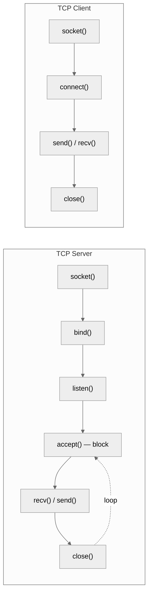
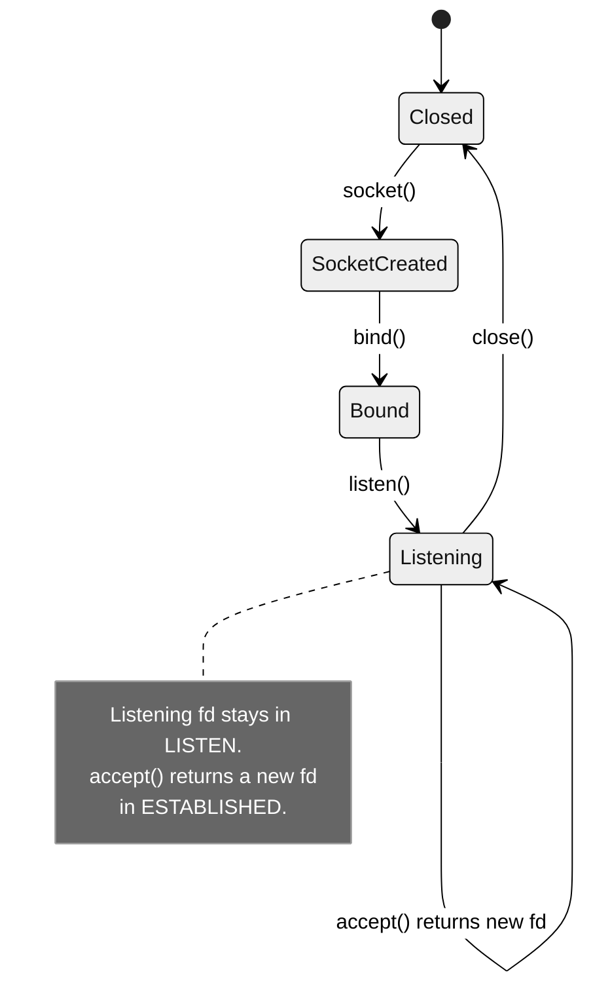
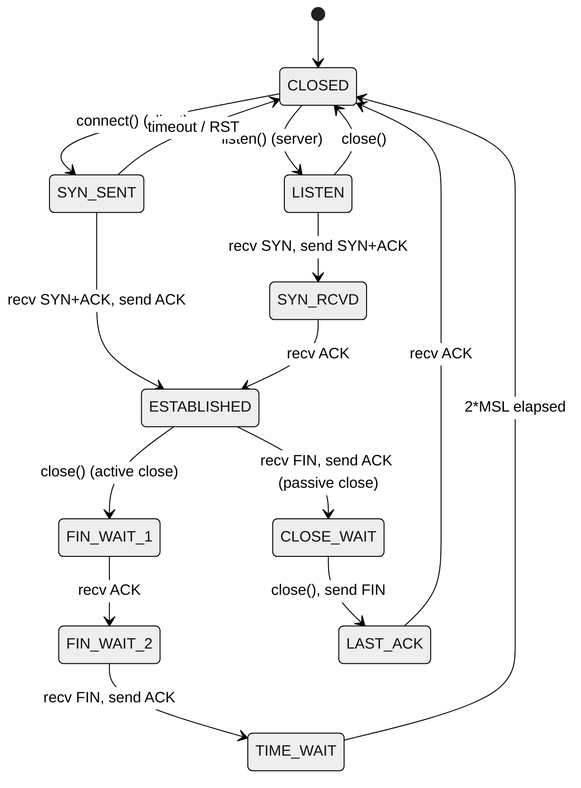
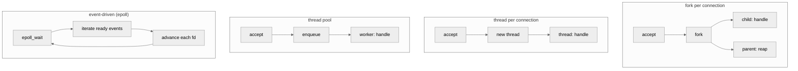

# 3. TCP Server and Client

> [!info] Where this fits
> This note applies the POSIX socket API from [[2. Sockets in C++]] to build a complete TCP echo server and client. Subsequent notes cover [[4. UDP Communication]] (connectionless), [[5. Non-blocking I-O and epoll]] (scalability), and [[6. Boost.Asio Overview]] (modern C++ wrapper). The conceptual background is in [[1. Network Fundamentals]].

## Why This Matters

A working TCP echo server is the "Hello, World" of network programming. It is small enough to fit on one screen, complete enough to exercise every part of the socket API, and a faithful microcosm of every real server you will ever write. The patterns you learn here — listen loop, accept loop, connection handling, framing, clean shutdown — scale up to HTTP servers, database servers, and game servers.

The two complexities that surprise newcomers:

1. **TCP is a byte stream, not a message protocol.** `send(buf, 100)` may transfer anywhere from 1 to 100 bytes. The receiver may need many `recv` calls to get all 100. If your application deals in messages, you must add **framing** (length-prefix, delimiter, or fixed-size headers).
2. **A single server must handle many connections simultaneously.** The naive `accept → handle → close` loop serves one client at a time. Real servers use threads, processes, or event loops. The choice of concurrency model is the most important architectural decision in server design.

This note covers both: a minimal sequential server, then the four classic concurrency models (fork, thread-per-connection, thread pool, event-driven). The next note ([[5. Non-blocking I-O and epoll]]) deep-dives the event-driven model.

## Background

### Server flow vs client flow



The asymmetry is fundamental: the server binds to a known port and waits; the client knows the server's address and initiates. The server's listening socket is separate from its connected sockets — `accept()` returns a new fd for each client.

### `SO_REUSEADDR`

When a TCP server closes a connection, the socket enters TIME_WAIT for 60-120 seconds. If the server restarts and tries to `bind()` to the same port during that window, the bind fails with `EADDRINUSE`. The fix:

```cpp
int yes = 1;
setsockopt(listen_fd, SOL_SOCKET, SO_REUSEADDR, &yes, sizeof(yes));
```

`SO_REUSEADDR` allows binding to a port that has sockets in TIME_WAIT. Every TCP server should set it before `bind()`.

Linux 3.9+ also has `SO_REUSEPORT`, which allows multiple sockets (even in different processes) to bind the same port. The kernel load-balances incoming connections across them. This is the foundation of pre-fork server architectures like nginx.

### Framing: turning a byte stream into messages

TCP delivers bytes. If you `send("hello")` then `send("world")`, the receiver may see `helloworld` in one `recv`, or `hel` then `loworld`, or any other partition. To exchange messages, you need a protocol on top of TCP.

Common framing strategies:

1. **Fixed-size messages.** Every message is exactly N bytes. Simple, wasteful for variable-size data.
2. **Length-prefix.** Each message starts with a fixed-size length field (4-byte big-endian uint32, say), followed by that many bytes of payload. The most common approach in binary protocols (gRPC, Thrift, AMQP).
3. **Delimiter.** Messages end with a special byte or sequence (`\n` for line-based protocols like HTTP headers, Redis, SMTP). Inefficient if the payload can contain the delimiter unless escaped.
4. **Self-describing format.** JSON, Protobuf, etc. — but you still need one of the above to know where the JSON ends.

For our echo server, we use a length-prefix: 4-byte big-endian length + payload. The receiver reads exactly that many bytes.

## Main Content

### Sequential TCP echo server

```cpp
#include <sys/socket.h>
#include <netinet/in.h>
#include <netinet/tcp.h>
#include <unistd.h>
#include <arpa/inet.h>
#include <cstring>
#include <iostream>
#include <csignal>

static ssize_t recv_all(int fd, void* buf, size_t len) {
    size_t total = 0;
    char* p = static_cast<char*>(buf);
    while (total < len) {
        ssize_t n = recv(fd, p + total, len - total, 0);
        if (n < 0) {
            if (errno == EINTR) continue;
            return -1;
        }
        if (n == 0) return 0;  // peer closed
        total += n;
    }
    return total;
}

static ssize_t send_all(int fd, const void* buf, size_t len) {
    size_t total = 0;
    const char* p = static_cast<const char*>(buf);
    while (total < len) {
        ssize_t n = send(fd, p + total, len - total, MSG_NOSIGNAL);
        if (n < 0) {
            if (errno == EINTR) continue;
            return -1;
        }
        total += n;
    }
    return total;
}

static void handle_client(int conn_fd) {
    int one = 1;
    setsockopt(conn_fd, IPPROTO_TCP, TCP_NODELAY, &one, sizeof(one));

    while (true) {
        uint32_t net_len;
        if (recv_all(conn_fd, &net_len, 4) <= 0) break;
        uint32_t len = ntohl(net_len);
        if (len == 0 || len > (1u << 20)) break;  // sanity

        std::string payload(len, '\0');
        if (recv_all(conn_fd, payload.data(), len) <= 0) break;

        // Echo back
        if (send_all(conn_fd, &net_len, 4) < 0) break;
        if (send_all(conn_fd, payload.data(), len) < 0) break;
    }
    close(conn_fd);
}

int main() {
    std::signal(SIGPIPE, SIG_IGN);

    int listen_fd = socket(AF_INET6, SOCK_STREAM, 0);
    if (listen_fd < 0) { perror("socket"); return 1; }

    int yes = 1;
    setsockopt(listen_fd, SOL_SOCKET, SO_REUSEADDR, &yes, sizeof(yes));

    int v6only = 0;
    setsockopt(listen_fd, IPPROTO_IPV6, IPV6_V6ONLY, &v6only, sizeof(v6only));

    sockaddr_in6 addr{};
    addr.sin6_family = AF_INET6;
    addr.sin6_port = htons(9000);
    addr.sin6_addr = in6addr_any;

    if (bind(listen_fd, reinterpret_cast<sockaddr*>(&addr), sizeof(addr)) < 0) {
        perror("bind"); return 1;
    }

    if (listen(listen_fd, 128) < 0) { perror("listen"); return 1; }

    std::cout << "Listening on [::]:9000\n";

    while (true) {
        sockaddr_storage client_addr{};
        socklen_t client_len = sizeof(client_addr);
        int conn_fd = accept(listen_fd,
            reinterpret_cast<sockaddr*>(&client_addr), &client_len);
        if (conn_fd < 0) {
            if (errno == EINTR) continue;
            perror("accept"); continue;
        }

        char ipstr[INET6_ADDRSTRLEN];
        auto* sa = reinterpret_cast<sockaddr_in6*>(&client_addr);
        inet_ntop(AF_INET6, &sa->sin6_addr, ipstr, sizeof(ipstr));
        std::cout << "Connection from " << ipstr << "\n";

        handle_client(conn_fd);
    }
    close(listen_fd);
    return 0;
}
```

This server handles one client at a time. While it is busy with client A, client B's `connect()` sits in the listen backlog (up to 128, as configured). For an echo server this is fine; for a real server, this is unacceptable.

### TCP echo client

```cpp
#include <sys/socket.h>
#include <netdb.h>
#include <unistd.h>
#include <cstring>
#include <iostream>
#include <string>
#include <stdexcept>

class TcpConnection {
public:
    TcpConnection(const std::string& host, int port) {
        addrinfo hints{};
        hints.ai_family = AF_UNSPEC;
        hints.ai_socktype = SOCK_STREAM;

        std::string port_str = std::to_string(port);
        addrinfo* res = nullptr;
        int rc = getaddrinfo(host.c_str(), port_str.c_str(), &hints, &res);
        if (rc != 0) throw std::runtime_error(gai_strerror(rc));

        for (addrinfo* p = res; p; p = p->ai_next) {
            fd_ = socket(p->ai_family, p->ai_socktype, p->ai_protocol);
            if (fd_ < 0) continue;
            if (connect(fd_, p->ai_addr, p->ai_addrlen) == 0) {
                freeaddrinfo(res);
                return;
            }
            close(fd_);
            fd_ = -1;
        }
        freeaddrinfo(res);
        throw std::runtime_error("connect failed");
    }

    ~TcpConnection() { if (fd_ >= 0) close(fd_); }

    void send_message(const std::string& msg) {
        uint32_t net_len = htonl(static_cast<uint32_t>(msg.size()));
        send_all(&net_len, 4);
        send_all(msg.data(), msg.size());
    }

    std::string recv_message() {
        uint32_t net_len;
        if (recv_all(&net_len, 4) <= 0) throw std::runtime_error("disconnected");
        uint32_t len = ntohl(net_len);
        std::string buf(len, '\0');
        if (recv_all(buf.data(), len) <= 0) throw std::runtime_error("disconnected");
        return buf;
    }

private:
    void send_all(const void* buf, size_t len) {
        size_t total = 0;
        const char* p = static_cast<const char*>(buf);
        while (total < len) {
            ssize_t n = send(fd_, p + total, len - total, MSG_NOSIGNAL);
            if (n < 0) {
                if (errno == EINTR) continue;
                throw std::runtime_error(std::strerror(errno));
            }
            total += n;
        }
    }

    ssize_t recv_all(void* buf, size_t len) {
        size_t total = 0;
        char* p = static_cast<char*>(buf);
        while (total < len) {
            ssize_t n = recv(fd_, p + total, len - total, 0);
            if (n < 0) {
                if (errno == EINTR) continue;
                return -1;
            }
            if (n == 0) return 0;
            total += n;
        }
        return total;
    }

    int fd_ = -1;
};

int main(int argc, char** argv) {
    if (argc < 3) {
        std::cerr << "Usage: " << argv[0] << " <host> <port>\n";
        return 1;
    }
    TcpConnection conn(argv[1], std::stoi(argv[2]));

    for (int i = 0; i < 5; ++i) {
        std::string msg = "hello " + std::to_string(i);
        conn.send_message(msg);
        std::string echo = conn.recv_message();
        std::cout << "Echo: " << echo << "\n";
    }
}
```

### Concurrency model 1: fork (process per connection)

The classic Unix approach. Each `accept()` returns a new fd; the server forks a child to handle it.

```cpp
#include <sys/wait.h>

while (true) {
    int conn_fd = accept(listen_fd, nullptr, nullptr);
    if (conn_fd < 0) continue;

    pid_t pid = fork();
    if (pid == 0) {
        // Child: close listen_fd, handle the client, exit.
        close(listen_fd);
        handle_client(conn_fd);
        _exit(0);
    } else if (pid > 0) {
        // Parent: close conn_fd, continue accepting.
        close(conn_fd);
        // Reap zombies periodically
        while (waitpid(-1, nullptr, WNOHANG) > 0) {}
    } else {
        perror("fork");
        close(conn_fd);
    }
}
```

**Pros:** Robust isolation — a crash in one child does not affect others. Simple to reason about. No shared state, no locks.

**Cons:** Fork is expensive (~1-10ms per fork on Linux). Each child has its own memory, so no in-process caching. Zombies must be reaped (SIGCHLD handler). Pre-forking (a pool of children waiting on `accept`) is the standard mitigation.

Apache's prefork MPM uses this model. nginx, Postgres, and sshd use pre-fork variants.

### Concurrency model 2: thread per connection

```cpp
#include <thread>
#include <vector>

while (true) {
    int conn_fd = accept(listen_fd, nullptr, nullptr);
    if (conn_fd < 0) continue;

    std::thread([conn_fd] { handle_client(conn_fd); }).detach();
}
```

**Pros:** Cheaper than fork (microseconds). Shared address space — caching is easy.

**Cons:** Memory overhead per thread (~8MB stack by default, tunable). Context-switch overhead at high connection counts. Race conditions on shared state. A crash in one thread kills the whole process.

The thread-per-connection model breaks down at ~10k connections due to memory and scheduler overhead (the C10K problem). It remains the right answer for low- to medium-traffic servers and for code that wants simplicity.

### Concurrency model 3: thread pool

```cpp
#include <thread>
#include <vector>
#include <queue>
#include <mutex>
#include <condition_variable>
#include <functional>

class ThreadPool {
public:
    explicit ThreadPool(size_t n) {
        for (size_t i = 0; i < n; ++i) {
            workers_.emplace_back([this] {
                while (true) {
                    std::function<void()> task;
                    {
                        std::unique_lock lock(mtx_);
                        cv_.wait(lock, [this] { return !queue_.empty() || stop_; });
                        if (stop_ && queue_.empty()) return;
                        task = std::move(queue_.front());
                        queue_.pop();
                    }
                    task();
                }
            });
        }
    }
    void submit(std::function<void()> f) {
        {
            std::lock_guard lock(mtx_);
            queue_.push(std::move(f));
        }
        cv_.notify_one();
    }
private:
    std::vector<std::thread> workers_;
    std::queue<std::function<void()>> queue_;
    std::mutex mtx_;
    std::condition_variable cv_;
    bool stop_ = false;
};

// In main:
ThreadPool pool(std::thread::hardware_concurrency() * 2);
while (true) {
    int conn_fd = accept(listen_fd, nullptr, nullptr);
    if (conn_fd < 0) continue;
    pool.submit([conn_fd] { handle_client(conn_fd); });
}
```

**Pros:** Bounded thread count. Lower memory overhead. Reuses threads.

**Cons:** A long-running client (slow reader) monopolizes a worker; you must either close slow clients or use non-blocking I/O inside the handler. The pool size must be tuned to workload.

This is the model used by most modern database connection pools and many web app servers.

### Concurrency model 4: event-driven (single-threaded + non-blocking)

The C10K solution. A single thread uses `select`/`poll`/`epoll` to watch thousands of sockets simultaneously, advancing each one whenever the kernel reports it ready.

```cpp
// Sketch — see [[5. Non-blocking I-O and epoll]] for the full implementation
int conn_fd = accept(listen_fd, nullptr, nullptr);
set_nonblocking(conn_fd);
epoll_ctl(epfd, EPOLL_CTL_ADD, conn_fd, &event);

while (true) {
    int n = epoll_wait(epfd, events, max_events, -1);
    for (int i = 0; i < n; ++i) {
        if (events[i].data.fd == listen_fd) {
            // new connection: accept, set non-blocking, add to epoll
        } else {
            // existing connection: try recv/send, advance state machine
        }
    }
}
```

**Pros:** Scales to hundreds of thousands of connections per thread. No context-switch overhead. Memory-efficient (no per-thread stacks).

**Cons:** Code is callback- or state-machine-driven, harder to read. Cannot block on disk I/O in the event thread (offload to a thread pool). Debugging is harder.

nginx, Redis, memcached, and Node.js use this model. It is the basis of [[6. Boost.Asio Overview]].

### Hybrid: event loop + thread pool

For workloads mixing I/O with CPU work (e.g., HTTP servers that do request parsing in the event loop and image processing in a thread pool), the standard architecture is:

- One event loop per core (or one event loop + N worker threads).
- I/O happens in the event loop (fast, non-blocking).
- CPU-bound work is dispatched to a thread pool.
- Results are posted back to the event loop for response generation.

This is what Boost.Asio's `io_context` + `strand` is designed for, and what most production C++ servers use.

## Mermaid Diagrams

### TCP server state machine



### TCP connection state machine (full)



### Concurrency models comparison



## Code Examples

### Setting non-blocking mode

```cpp
#include <fcntl.h>

void set_nonblocking(int fd) {
    int flags = fcntl(fd, F_GETFL, 0);
    if (flags < 0) { perror("fcntl F_GETFL"); return; }
    if (fcntl(fd, F_SETFL, flags | O_NONBLOCK) < 0) {
        perror("fcntl F_SETFL");
    }
}
```

### Concurrent server with `SO_REUSEPORT` (Linux 3.9+)

```cpp
int yes = 1;
setsockopt(listen_fd, SOL_SOCKET, SO_REUSEPORT, &yes, sizeof(yes));

// Now multiple processes can bind the same port; the kernel
// load-balances incoming connections across them.
//
// Pre-forked server:
for (int i = 0; i < std::thread::hardware_concurrency(); ++i) {
    if (fork() == 0) {
        // Each child has its own epoll loop on the same listen_fd.
        event_loop(listen_fd);
        _exit(0);
    }
}
// Parent waits for SIGTERM/SIGINT, signals children, reaps them.
```

### Clean shutdown via signals

```cpp
#include <atomic>
#include <csignal>

std::atomic<bool> g_running{true};

void on_signal(int) { g_running = false; }

int main() {
    std::signal(SIGINT, on_signal);
    std::signal(SIGTERM, on_signal);

    int listen_fd = /* ... */;

    // Make accept non-blocking so we can check g_running periodically
    set_nonblocking(listen_fd);

    while (g_running) {
        int conn_fd = accept(listen_fd, nullptr, nullptr);
        if (conn_fd < 0) {
            if (errno == EAGAIN || errno == EWOULDBLOCK) {
                std::this_thread::sleep_for(std::chrono::milliseconds(50));
                continue;
            }
            if (errno == EINTR) continue;
            perror("accept");
            continue;
        }
        // handle conn_fd...
    }

    close(listen_fd);
    std::cout << "Server shut down cleanly\n";
}
```

### Testing with `nc` (netcat)

```bash
# Terminal 1: start the server
./server

# Terminal 2: connect and send raw bytes
nc localhost 9000

# Send a length-prefixed message via printf:
printf '\x00\x00\x00\x05hello' | nc localhost 9000
```

### Load testing with Apache Bench

```bash
ab -n 10000 -c 100 http://localhost:9000/
# -n: total requests
# -c: concurrency
```

## Common Pitfalls

> [!warning] Pitfalls
> - **Forgetting `SO_REUSEADDR`.** Restarting the server fails with `EADDRINUSE` while previous connections drain TIME_WAIT.
> - **Not handling partial sends.** `send` may transfer fewer bytes than requested. Always loop or check the return value.
> - **Reading 0 bytes from `recv` and looping.** A return of 0 means "peer closed connection." Treat it as EOF, not as "no data, retry."
> - **Blocking accept in a single-threaded server.** No new clients can be served while one is being handled.
> - **Thread-per-connection with no thread limit.** A slowloris attacker can exhaust your threads. Always cap the thread count or use a thread pool / event loop.
> - **Race conditions in shared state.** In a threaded server, every mutable global is a race. Use mutexes, atomics, or thread-local storage.
> - **Forgetting to close client fds in the parent (fork model).** The parent leaks fds for every accept. Always close conn_fd in the parent after fork.
> - **Zombie processes.** Forked children become zombies when they exit. Install a `SIGCHLD` handler that calls `waitpid(-1, nullptr, WNOHANG)` in a loop.
> - **Blocking DNS in the event loop.** `getaddrinfo` blocks. Cache results or use a thread pool / async resolver (c-ares).
> - **Not setting `TCP_NODELAY` for request-response protocols.** Nagle's algorithm adds up to 200ms of latency for small interactive messages.

## Tips and Tricks

> [!tip] Tips
> - Always wrap sockets in RAII to guarantee close even on exceptions.
> - Set `SO_KEEPALIVE` with aggressive timeouts (`TCP_KEEPIDLE=60`, `TCP_KEEPINTVL=10`, `TCP_KEEPCNT=3`) to detect dead peers within 90 seconds, not 2 hours.
> - For high-traffic servers, set `SO_REUSEPORT` and run one event loop per core. The kernel distributes connections; cache locality is excellent.
> - Log connection accepts and disconnects with timestamps and peer addresses. You will need this when diagnosing "why did that client time out?"
> - For long-running handlers in a thread pool, set an inactivity timeout (close the socket after N seconds of no progress).
> - Use `strace -p <pid> -e trace=network` to watch a running server's socket calls.
> - Use `ss -tnp | grep :9000` to see live connections on your port.
> - For graceful shutdown: stop `accept()`-ing, drain existing connections (close after they finish their current request), then close the listen socket.
> - For load testing, use `wrk`, `ab`, or `vegeta` — not just `nc`. A single `nc` cannot expose concurrency bugs.
> - For modern C++ servers, skip raw sockets and use [[6. Boost.Asio Overview]]. It handles all of these edge cases (cancellation, timeouts, buffer management) for you.

## Active Recall

1. List the seven socket calls a TCP server makes in order.
2. Why is `SO_REUSEADDR` mandatory for production servers?
3. Why does TCP require framing on top of the byte stream? Give three framing strategies.
4. Write a `recv_all` function that handles partial reads and `EINTR`.
5. Compare fork-per-connection vs thread-per-connection: when is each preferable?
6. What is the C10K problem? Which concurrency model solves it?
7. Why is the parent process's `close(conn_fd)` essential after `fork()`?
8. What is the difference between `SO_REUSEADDR` and `SO_REUSEPORT`?
9. Why does a 0 return from `recv()` mean EOF, while -1 with `EAGAIN` means "try again"?
10. How would you implement graceful shutdown of a server handling 1000 active connections?

## Next Steps

- Continue to [[4. UDP Communication]] for connectionless messaging.
- Then [[5. Non-blocking I-O and epoll]] for the event-driven model in detail.
- Then [[6. Boost.Asio Overview]] for a modern C++ wrapper.
- Cross-link to [[2. Sockets in C++]] for the underlying API.
- Cross-link to [[14. Concurrency and Multithreading]] for thread pool implementation details.
- Cross-link to [[13. Error Handling and Exceptions]] for the failure modes that network servers must handle.
