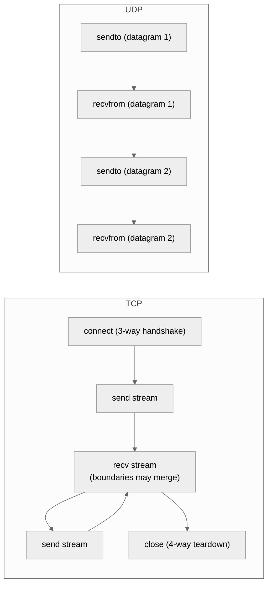
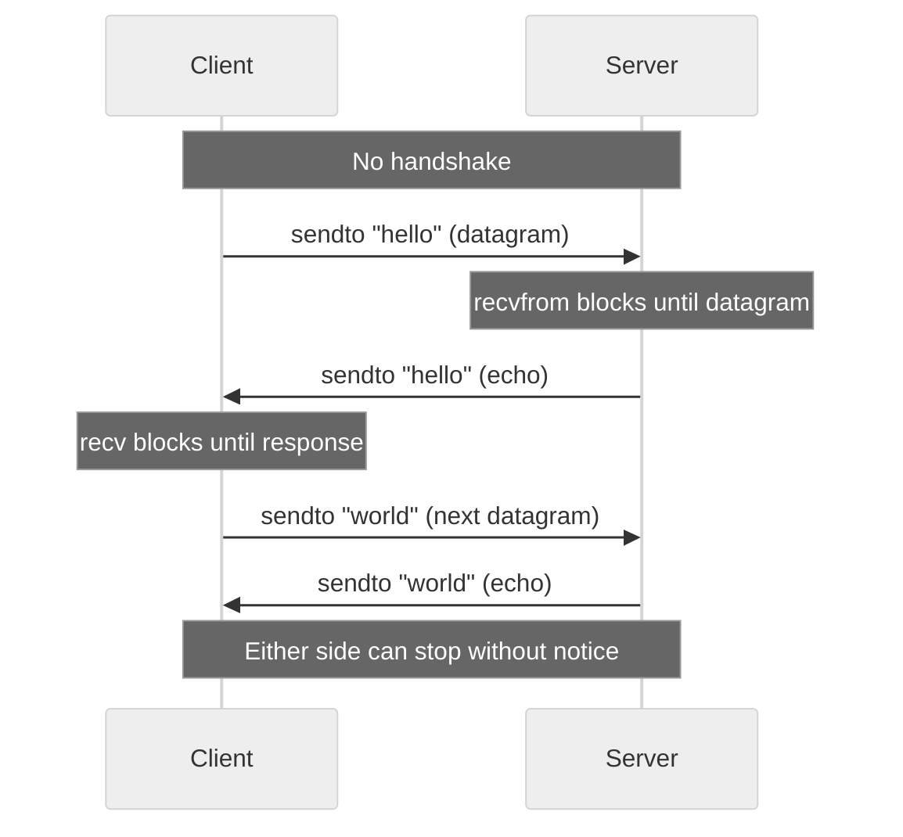
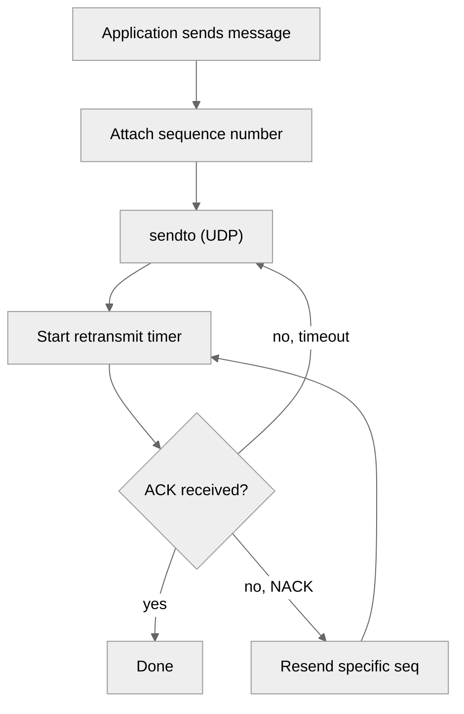

# 4. UDP Communication

> [!info] Where this fits
> This note covers the **connectionless** side of network programming. It builds on [[2. Sockets in C++]] and parallels [[3. TCP Server and Client]]. The next notes cover [[5. Non-blocking I-O and epoll]] (which applies to UDP too) and [[6. Boost.Asio Overview]] (modern C++ wrapper). The conceptual background is in [[1. Network Fundamentals]].

## Why This Matters

UDP is the "send and hope" protocol. It gives you no reliability, no ordering, no flow control, and no congestion control. In exchange, it gives you:
- **No handshake latency.** A single datagram can carry a request and a response in two packets, with one RTT total. TCP would need at least three packets just to set up the connection.
- **No head-of-line blocking.** A lost packet does not stall subsequent packets. TCP's reliability guarantee means one lost byte stalls everything until retransmission succeeds; UDP has no such constraint.
- **Multicast and broadcast.** A single send can reach many receivers. TCP is strictly point-to-point.
- **A foundation for user-space protocols.** QUIC, WebRTC, HTTP/3, TFTP, and many VPN protocols build their own reliability layer on top of UDP, in user space, iterating faster than the kernel.

UDP is the right choice when:
- **Latency dominates reliability.** Voice/video calls tolerate a few lost frames but not 200ms stalls. Online games tolerate dropped position updates but not TCP's retransmission.
- **The application has its own reliability.** DNS is one request, one response — if you don't get a response, retry. QUIC implements its own ACK/retransmission.
- **Multicast or broadcast is needed.** Service discovery (mDNS), streaming media, financial market data feeds.
- **The data is small and frequent.** A 50-byte DNS query is wasteful to send over TCP (handshake overhead).

UDP is the wrong choice when:
- You need every byte to arrive. Use TCP.
- You need data in order. Use TCP (or build ordering on UDP).
- You are transferring large amounts of data and want the kernel to handle congestion. TCP's congestion control is sophisticated; rolling your own is hard.
- You are behind a NAT and need inbound connections. TCP works through NAT; UDP requires TURN/STUN gymnastics (which is why WebRTC exists).

## Background

### UDP header

A UDP datagram has an 8-byte header:

```
 0      7 8     15 16    23 24    31
+--------+--------+--------+--------+
|     Source      |   Destination   |
|      Port       |      Port       |
+--------+--------+--------+--------+
|                 |                |
|     Length       |   Checksum     |
+--------+--------+--------+--------+
|                                   |
|             data ...              |
+-----------------------------------+
```

- Source port: optional (0 if not used).
- Destination port: required.
- Length: total length of header + data, in bytes. Maximum is 65535, but in practice the IP layer limits payloads to ~65507 bytes (65535 minus IP header minus UDP header), and many firewalls drop anything over 1472 (the Ethernet MTU minus IP/UDP headers).
- Checksum: covers the UDP header, data, and a pseudo-header including source/destination IPs. Enabled by default on IPv6 (mandatory).

### UDP vs TCP at a glance

| Property               | TCP                       | UDP                          |
| ---------------------- | ------------------------- | ---------------------------- |
| Connection             | Yes (handshake)           | No                           |
| Reliability            | Yes (ACKs, retransmit)    | No                           |
| Ordering               | Yes (in-order delivery)   | No                           |
| Flow control           | Yes (sliding window)      | No                           |
| Congestion control     | Yes (slow start, etc.)    | No                           |
| Header size            | 20+ bytes                 | 8 bytes                      |
| Boundary preservation  | No (byte stream)          | Yes (datagrams)              |
| Broadcast / multicast  | No                        | Yes                          |
| Handshake latency      | 1 RTT                     | 0                            |
| Head-of-line blocking  | Yes                       | No                           |
| Typical use            | HTTP, SSH, SMTP, databases| DNS, VoIP, video, games, QUIC|

### Boundary preservation

Unlike TCP, where `send` and `recv` are byte-stream operations that may split or coalesce data, **each UDP datagram is atomic**. One `sendto` produces one `recvfrom` on the other side (if it arrives at all). The kernel preserves message boundaries.

This means:
- You do not need to add framing.
- You cannot send a 10KB message in one datagram (it will likely be fragmented or dropped).
- The maximum safe payload is 1472 bytes over Ethernet (1500 MTU - 20 IP header - 8 UDP header). Above this, IP fragmentation kicks in, and loss of any fragment loses the whole datagram.

### The "no reliability" caveat

UDP's lack of reliability is more aggressive than people expect:

- **Packets can be lost.** A burst of traffic can overflow router queues; a single dropped datagram is silently discarded.
- **Packets can be duplicated.** Rare, but possible (link-layer retransmissions, NAT confusion).
- **Packets can arrive out of order.** Different datagrams may take different routes; a later send may arrive first.
- **Packets can be delivered to the wrong application.** If you don't verify the source, anyone can send to your port. Always authenticate (HMAC, TLS-DTLS, etc.) if the data matters.
- **The sender has no idea.** `sendto` returns success when the kernel queues the packet for transmission. The packet may be lost in the network, and you will never know.

If you need any of reliability, ordering, or flow control, you must build them yourself or use a library (QUIC, ENet, KCP, UDT).

## Main Content

### UDP server: minimal echo

```cpp
#include <sys/socket.h>
#include <netinet/in.h>
#include <unistd.h>
#include <cstring>
#include <iostream>
#include <array>

int main() {
    int fd = socket(AF_INET6, SOCK_DGRAM, 0);
    if (fd < 0) { perror("socket"); return 1; }

    int v6only = 0;
    setsockopt(fd, IPPROTO_IPV6, IPV6_V6ONLY, &v6only, sizeof(v6only));

    sockaddr_in6 addr{};
    addr.sin6_family = AF_INET6;
    addr.sin6_port = htons(9000);
    addr.sin6_addr = in6addr_any;

    if (bind(fd, reinterpret_cast<sockaddr*>(&addr), sizeof(addr)) < 0) {
        perror("bind"); return 1;
    }

    // Increase receive buffer to absorb bursts
    int bufsize = 1 << 20;  // 1 MB
    setsockopt(fd, SOL_SOCKET, SO_RCVBUF, &bufsize, sizeof(bufsize));

    std::cout << "UDP echo server on [::]:9000\n";

    std::array<char, 1500> buf{};
    while (true) {
        sockaddr_storage src{};
        socklen_t srclen = sizeof(src);
        ssize_t n = recvfrom(fd, buf.data(), buf.size(), 0,
                             reinterpret_cast<sockaddr*>(&src), &srclen);
        if (n < 0) {
            if (errno == EINTR) continue;
            perror("recvfrom"); continue;
        }

        char ipstr[INET6_ADDRSTRLEN];
        auto* sa = reinterpret_cast<sockaddr_in6*>(&src);
        inet_ntop(AF_INET6, &sa->sin6_addr, ipstr, sizeof(ipstr));
        std::cout << "From " << ipstr << ":" << ntohs(sa->sin6_port)
                  << " (" << n << " bytes)\n";

        // Echo back to sender
        sendto(fd, buf.data(), n, 0,
               reinterpret_cast<sockaddr*>(&src), srclen);
    }
    close(fd);
}
```

### UDP client: minimal echo

```cpp
#include <sys/socket.h>
#include <netdb.h>
#include <unistd.h>
#include <cstring>
#include <iostream>
#include <string>

int main(int argc, char** argv) {
    if (argc < 3) {
        std::cerr << "Usage: " << argv[0] << " <host> <port>\n";
        return 1;
    }
    const char* host = argv[1];
    const char* port = argv[2];

    addrinfo hints{};
    hints.ai_family = AF_UNSPEC;
    hints.ai_socktype = SOCK_DGRAM;
    addrinfo* res = nullptr;
    int rc = getaddrinfo(host, port, &hints, &res);
    if (rc != 0) { std::cerr << gai_strerror(rc) << "\n"; return 1; }

    int fd = -1;
    for (addrinfo* p = res; p; p = p->ai_next) {
        fd = socket(p->ai_family, p->ai_socktype, p->ai_protocol);
        if (fd >= 0) {
            // Save peer address for sendto
            // (No connect needed for UDP, but we can "connect" to set a default peer.)
            break;
        }
    }
    freeaddrinfo(res);
    if (fd < 0) { std::cerr << "socket failed\n"; return 1; }

    // Option A: use sendto with explicit address
    // Option B: "connect" the UDP socket — sets default peer, allows send()/recv()
    if (connect(fd, res->ai_addr, res->ai_addrlen) == 0) {
        // Now send() and recv() work without specifying address.
    }

    std::string msg = "hello, UDP";
    send(fd, msg.data(), msg.size(), 0);

    std::array<char, 1500> buf{};
    ssize_t n = recv(fd, buf.data(), buf.size(), 0);
    if (n > 0) {
        std::cout << "Echo: " << std::string(buf.data(), n) << "\n";
    }
    close(fd);
}
```

### "Connected" UDP

The `connect` call on a UDP socket does **not** send any packets. It just records the peer address in the kernel, so that:
- `send()` and `recv()` work without specifying an address.
- The kernel filters incoming datagrams: only datagrams from the connected peer are delivered.
- You get `ECONNREFUSED` if a previous send triggered an ICMP "port unreachable" — useful for detecting that the peer has no listener.

This is a common idiom for UDP clients that talk to a single server.

### Receiving from multiple peers

A server using `recvfrom` gets the source address with each datagram and can reply with `sendto`. This is the natural model for stateless request-response servers (DNS, NTP).

For stateful servers (e.g., a game server tracking each player), maintain a map of `Address → SessionState`. On each `recvfrom`, look up (or create) the session and dispatch.

### Multicast

UDP supports multicast — one send, many receivers. Useful for service discovery (mDNS), financial market data, and streaming media.

```cpp
// Receiver joins the multicast group 224.0.0.1 (IPv4)
int fd = socket(AF_INET, SOCK_DGRAM, 0);
int reuse = 1;
setsockopt(fd, SOL_SOCKET, SO_REUSEADDR, &reuse, sizeof(reuse));

sockaddr_in addr{};
addr.sin_family = AF_INET;
addr.sin_port = htons(5000);
addr.sin_addr.s_addr = htonl(INADDR_ANY);
bind(fd, reinterpret_cast<sockaddr*>(&addr), sizeof(addr));

ip_mreq mreq{};
mreq.imr_multiaddr.s_addr = inet_addr("239.0.0.1");
mreq.imr_interface.s_addr = htonl(INADDR_ANY);
setsockopt(fd, IPPROTO_IP, IP_ADD_MEMBERSHIP, &mreq, sizeof(mreq));

// Now recvfrom() gets datagrams sent to 239.0.0.1:5000 by any sender.
```

For IPv6, use `IPV6_ADD_MEMBERSHIP` with `ipv6_mreq` and a `sockaddr_in6` address.

### Broadcast

Broadcast is a deprecated but still-supported feature where one packet reaches every host on a subnet:

```cpp
int bcast = 1;
setsockopt(fd, SOL_SOCKET, SO_BROADCAST, &bcast, sizeof(bcast));

sockaddr_in dest{};
dest.sin_family = AF_INET;
dest.sin_port = htons(5000);
dest.sin_addr.s_addr = htonl(INADDR_BROADCAST);  // 255.255.255.255

sendto(fd, "hello", 5, 0, reinterpret_cast<sockaddr*>(&dest), sizeof(dest));
```

Broadcast is being phased out in favor of multicast, which is more efficient (routers can prune groups with no listeners).

### Reliability considerations

If your application needs reliability over UDP, you must build it. Common patterns:

1. **Sequence numbers.** Each datagram carries an incrementing sequence number. Receivers detect gaps (lost packets) and duplicates.
2. **ACKs.** The receiver sends back an ACK for each received datagram (or batch). The sender retransmits unacked datagrams after a timeout.
3. **Negative ACKs (NACKs).** The receiver explicitly requests retransmission of missing datagrams. More efficient than positive ACKs for high-loss links.
4. **Forward Error Correction (FEC).** Send redundant data so the receiver can reconstruct lost packets without retransmission. Used in QUIC, WebRTC, satellite links.
5. **Congestion control.** Implement TCP-friendly rate control (TFRC) or a modern algorithm like BBR. Without this, UDP floods the network.

Standard libraries that provide reliable UDP:
- **QUIC** (RFC 9000) — the modern standard, used by HTTP/3.
- **ENet** — game-focused reliable UDP.
- **KCP** — popular in Chinese game development.
- **UDT** — for high-BDP networks.
- **WebRTC's SRTP** — for media.

### When UDP is preferred

| Use case                         | Why UDP                                       |
| -------------------------------- | --------------------------------------------- |
| DNS queries                      | 1 request, 1 response. TCP's handshake is wasteful. |
| VoIP, video conferencing         | Latency > reliability. A lost frame is fine; a stalled frame is not. |
| Online games                     | Same as above. Position updates can be missed; stale data is useless. |
| Multicast streaming              | One sender, many receivers. TCP cannot do this. |
| Service discovery (mDNS)         | Multicast on the local network. |
| QUIC / HTTP/3                    | User-space transport with HTTP/2-like multiplexing and TLS 1.3. |
| IoT telemetry                    | Small, frequent, low-power. TCP keepalives drain battery. |
| Financial market data feeds      | Multicast to many subscribers; lost ticks are acceptable. |

## Mermaid Diagrams

### TCP vs UDP communication flow



### UDP echo flow



### Reliability layer (user-space)



## Code Examples

### Length-prefixed UDP protocol

```cpp
// Each datagram: [uint32_t seq][uint32_t len][payload...]

struct UdpHeader {
    uint32_t seq;
    uint32_t len;
};

void send_message(int fd, const sockaddr* dest, socklen_t destlen,
                  uint32_t seq, const std::string& payload) {
    std::vector<char> buf(sizeof(UdpHeader) + payload.size());
    UdpHeader h{htonl(seq), htonl(static_cast<uint32_t>(payload.size()))};
    std::memcpy(buf.data(), &h, sizeof(h));
    std::memcpy(buf.data() + sizeof(h), payload.data(), payload.size());
    sendto(fd, buf.data(), buf.size(), 0, dest, destlen);
}

bool recv_message(int fd, sockaddr* src, socklen_t* srclen,
                  uint32_t& seq, std::string& payload) {
    std::array<char, 1500> buf{};
    ssize_t n = recvfrom(fd, buf.data(), buf.size(), 0, src, srclen);
    if (n < static_cast<ssize_t>(sizeof(UdpHeader))) return false;
    UdpHeader h;
    std::memcpy(&h, buf.data(), sizeof(h));
    seq = ntohl(h.seq);
    uint32_t len = ntohl(h.len);
    if (len > buf.size() - sizeof(UdpHeader)) return false;
    payload.assign(buf.data() + sizeof(h), len);
    return true;
}
```

### DNS query over UDP (sketch)

```cpp
#include <sys/socket.h>
#include <netdb.h>
#include <unistd.h>
#include <cstring>
#include <iostream>

// Build a minimal DNS query for "example.com" type A
std::string build_dns_query() {
    std::string q;
    q.push_back('\x12'); q.push_back('\x34');  // ID
    q.push_back('\x01'); q.push_back('\x00');  // flags: standard query, recursion desired
    q.push_back('\x00'); q.push_back('\x01');  // 1 question
    q.push_back('\x00'); q.push_back('\x00');  // 0 answers
    q.push_back('\x00'); q.push_back('\x00');  // 0 authority
    q.push_back('\x00'); q.push_back('\x00');  // 0 additional
    // QNAME: \x07example\x03com\x00
    q += "\x07example\x03com\x00";
    // QTYPE: A (1)
    q.push_back('\x00'); q.push_back('\x01');
    // QCLASS: IN (1)
    q.push_back('\x00'); q.push_back('\x01');
    return q;
}

int main() {
    int fd = socket(AF_INET, SOCK_DGRAM, 0);

    sockaddr_in dest{};
    dest.sin_family = AF_INET;
    dest.sin_port = htons(53);
    inet_pton(AF_INET, "8.8.8.8", &dest.sin_addr);

    std::string query = build_dns_query();
    sendto(fd, query.data(), query.size(), 0,
           reinterpret_cast<sockaddr*>(&dest), sizeof(dest));

    std::array<char, 1500> buf{};
    ssize_t n = recv(fd, buf.data(), buf.size(), 0);
    std::cout << "Got " << n << " bytes back\n";
    close(fd);
}
```

### Timeout on `recvfrom`

```cpp
timeval tv{.tv_sec = 2, .tv_usec = 0};
setsockopt(fd, SOL_SOCKET, SO_RCVTIMEO, &tv, sizeof(tv));

ssize_t n = recvfrom(fd, buf, sizeof(buf), 0, nullptr, nullptr);
if (n < 0 && (errno == EAGAIN || errno == EWOULDBLOCK)) {
    std::cout << "Timeout — no response\n";
}
```

### Multicast sender

```cpp
int fd = socket(AF_INET, SOCK_DGRAM, 0);

sockaddr_in dest{};
dest.sin_family = AF_INET;
dest.sin_port = htons(5000);
dest.sin_addr.s_addr = inet_addr("239.0.0.1");

// Set TTL (default 1 = local subnet only)
unsigned char ttl = 5;
setsockopt(fd, IPPROTO_IP, IP_MULTICAST_TTL, &ttl, sizeof(ttl));

const char* msg = "multicast hello";
sendto(fd, msg, strlen(msg), 0,
       reinterpret_cast<sockaddr*>(&dest), sizeof(dest));
```

## Common Pitfalls

> [!warning] Pitfalls
> - **Sending huge datagrams.** Anything above 1472 bytes (Ethernet MTU minus headers) gets IP-fragmented. Loss of any fragment loses the whole datagram. Stay under 1472, or use a smaller safe value like 1024.
> - **Assuming delivery.** UDP makes no delivery guarantees. If your application needs reliability, you must build it.
> - **Assuming ordering.** Two `sendto` calls may arrive in the opposite order. Use sequence numbers.
> - **No flow control.** A UDP sender can flood a slow receiver. The kernel's `SO_RCVBUF` is finite; once full, packets are silently dropped.
> - **Trusting the source address.** Anyone can spoof a UDP source address. For security, authenticate via HMAC, DTLS, or a token in the payload.
> - **Forgetting `SO_RCVBUF` on high-throughput receivers.** Default buffer is a few hundred KB. Bursts cause drops.
> - **Forgetting to handle ICMP errors.** A previous `sendto` to a closed port triggers an ICMP "port unreachable". The next `recvfrom` may return -1 with `ECONNREFUSED` (on connected UDP sockets). On unconnected sockets, the error is silently ignored.
> - **Mixing blocking `recvfrom` with timeout logic in the same thread.** Use `SO_RCVTIMEO` or non-blocking mode + `select`/`poll`/`epoll`.
> - **Confusing broadcast with multicast.** Broadcast is subnet-wide; multicast is group-based. Modern networks prefer multicast.
> - **Expecting NAT traversal to "just work".** UDP NAT traversal requires STUN/TURN/ICE (the basis of WebRTC). It is complex.

## Tips and Tricks

> [!tip] Tips
> - For request-response protocols, use a connected UDP socket — you get ICMP errors for free.
> - For servers, log source address + port + size of every datagram. Invaluable when debugging "why is client X not getting responses?"
> - Set `SO_RCVBUF` to the largest value your kernel allows. UDP bursts are brutal.
> - For high-throughput receivers, use `recvmmsg` (Linux) to batch-receive multiple datagrams in one syscall.
> - For high-throughput senders, use `sendmmsg` (Linux) to batch-send.
> - For testing packet loss, use `tc netem` on Linux: `tc qdisc add dev lo root netem loss 10%` adds 10% loss to loopback.
> - For testing ordering, `tc netem delay 100ms 50ms` adds variable delay.
> - For QUIC in C++, use `quiche` (Cloudflare) or `msquic` (Microsoft). Both are mature.
> - For DTLS (TLS over UDP), use OpenSSL's DTLS API or `mbedTLS`.
> - For modern C++ code, prefer [[6. Boost.Asio Overview]] over raw UDP — it handles the platform differences and integrates cleanly with coroutines.

## Active Recall

1. Why does UDP not require a handshake?
2. What is the maximum safe UDP payload on Ethernet? Why?
3. Explain boundary preservation in UDP. How does this differ from TCP?
4. What are the four ways UDP packets can be lost, duplicated, or reordered?
5. What does "connecting" a UDP socket do? Does it send any packets?
6. Write a UDP server that handles multiple peers concurrently.
7. Why is multicast preferred over broadcast in modern networks?
8. List three use cases where UDP is the right choice over TCP.
9. What does `SO_RCVBUF` control on a UDP socket? Why should you increase it?
10. How would you test packet loss on localhost?

## Next Steps

- Continue to [[5. Non-blocking I-O and epoll]] — UDP sockets also benefit from non-blocking I/O and event-driven architectures.
- Then [[6. Boost.Asio Overview]] for the modern C++ wrapper that handles UDP and TCP uniformly.
- Cross-link to [[2. Sockets in C++]] for the underlying API.
- Cross-link to [[3. TCP Server and Client]] for the connection-oriented counterpart.
- Cross-link to [[1. Network Fundamentals]] for the conceptual background.
- Cross-link to [[18. Software Engineering Practices/6. Software Architecture]] — protocol design is an architectural concern.
