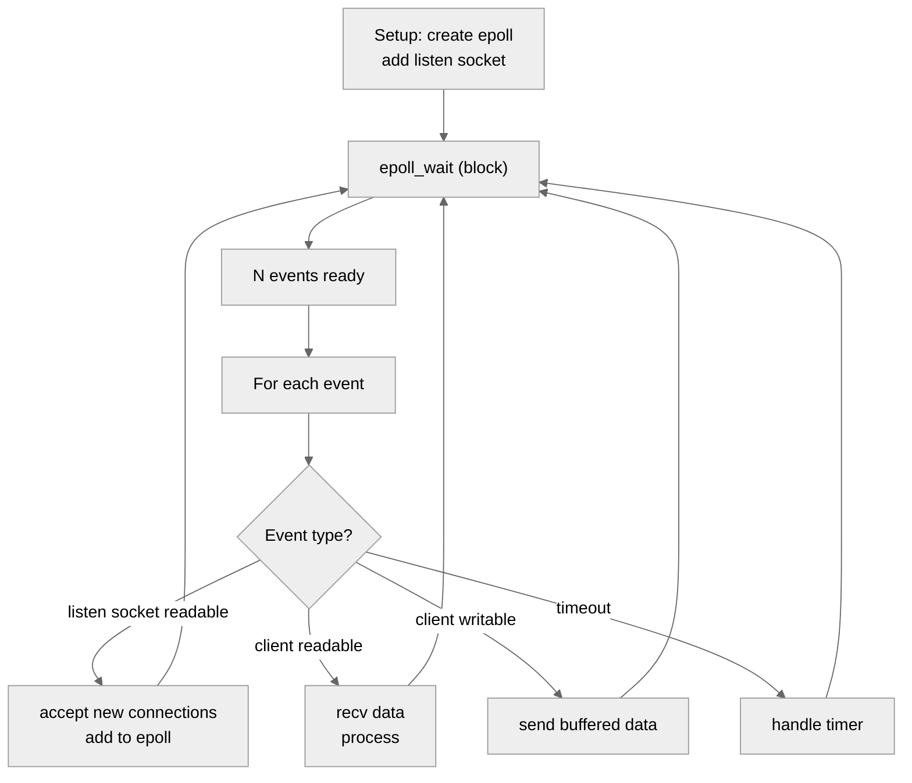
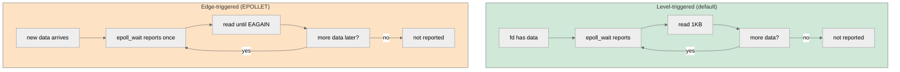

# 5. Non-blocking I-O and epoll

> [!info] Where this fits
> This note is the scalability layer. It builds on the blocking-socket patterns from [[2. Sockets in C++]] and [[3. TCP Server and Client]], and it provides the foundation for understanding [[6. Boost.Asio Overview]] (which uses `epoll` on Linux, `kqueue` on BSD/macOS, and IOCP on Windows under the hood). The conceptual background is in [[1. Network Fundamentals]].

## Why This Matters

A blocking socket is simple: `recv(fd, buf, n, 0)` blocks until data arrives. One thread per socket is the natural model. This works fine for 100 concurrent connections. It works at 1,000. It starts to break at 10,000:

- Each thread has a stack (default 8 MB on Linux, often tunable down to 64 KB but still non-trivial).
- 10,000 threads × 1 MB stack = 10 GB of address space. The kernel scheduler thrashes.
- Context switches — saving/restoring registers, TLB flushes — become the dominant cost.
- Cache locality is destroyed.

The **C10K problem** (Dan Kegel, 1999) framed this clearly: web servers needed to handle 10,000 concurrent clients, and the thread-per-connection model could not. The solution is **event-driven I/O**: a single thread watches many sockets simultaneously using a kernel-provided multiplexing syscall.

This note covers the three mainstream multiplexing APIs (`select`, `poll`, `epoll`) plus the BSD and Windows equivalents (`kqueue`, `IOCP`), the difference between edge-triggered and level-triggered modes, and how to structure an event loop in C++. These are the building blocks of every high-performance network server: nginx, Redis, memcached, Envoy, HAProxy, and Boost.Asio all use them.

## Background

### Blocking vs non-blocking sockets

A socket is blocking by default. Every I/O call (`recv`, `send`, `accept`, `connect`) blocks the calling thread until it completes or fails.

A socket becomes non-blocking when you set `O_NONBLOCK`:

```cpp
int flags = fcntl(fd, F_GETFL, 0);
fcntl(fd, F_SETFL, flags | O_NONBLOCK);
```

On a non-blocking socket:
- `recv` returns immediately. If data is available, it returns the bytes. If not, it returns -1 with `errno == EAGAIN` (or `EWOULDBLOCK`).
- `send` returns immediately. If the kernel send buffer has room, it accepts some bytes. If not, it returns -1 with `EAGAIN`.
- `accept` returns immediately. If a connection is pending, it returns the new fd. If not, it returns -1 with `EAGAIN`.
- `connect` returns immediately. Usually -1 with `errno == EINPROGRESS` (the handshake is in progress in the background).

A non-blocking socket by itself is not useful — you would just busy-loop calling `recv` until it succeeds, burning CPU. The value comes from combining it with a multiplexing syscall that tells you **which** sockets are ready.

### The multiplexing syscalls

| Syscall   | OS                  | Fixed FD limit? | Time complexity per call | Memory |
| --------- | ------------------- | --------------- | ------------------------ | ------ |
| `select`  | POSIX (everywhere)  | Yes (`FD_SETSIZE`, default 1024) | O(n) scan | small |
| `poll`    | POSIX               | No              | O(n) scan                | O(n) per call |
| `epoll`   | Linux 2.6+          | No              | O(1) per ready event     | O(active) |
| `kqueue`  | BSD, macOS          | No              | O(1) per ready event     | O(active) |
| `IOCP`    | Windows             | No              | O(1) per completion      | O(active) |
| `io_uring`| Linux 5.1+          | No              | O(1) per completion      | O(active) |

The progression from `select` to `epoll`/`kqueue` is the C10K story. The progression from `epoll` to `io_uring` is the C10M story.

## Main Content

### `select`

The oldest multiplexing API (4.2BSD, 1983).

```cpp
#include <sys/select.h>

fd_set readfds;
FD_ZERO(&readfds);
FD_SET(fd1, &readfds);
FD_SET(fd2, &readfds);

int max_fd = std::max(fd1, fd2) + 1;

timeval tv{.tv_sec = 1, .tv_usec = 0};
int rc = select(max_fd, &readfds, nullptr, nullptr, &tv);
if (rc < 0) { perror("select"); }
else if (rc == 0) { /* timeout */ }
else {
    if (FD_ISSET(fd1, &readfds)) { /* fd1 is readable */ }
    if (FD_ISSET(fd2, &readfds)) { /* fd2 is readable */ }
}
```

**Limitations:**
- `FD_SETSIZE` is typically 1024. You can recompile your libc with a larger value, but it is invasive.
- Every call requires you to rebuild and pass the full fd set. The kernel iterates all of them. O(n) per call, even if only one is ready.
- The return value tells you "some fd is ready" but not which. You must re-scan the set.
- The `tv` is modified on return; you must reset it each iteration.

`select` is appropriate for small fd counts (< 100) and for code that must run on ancient systems. For new code, prefer `poll` or `epoll`.

### `poll`

```cpp
#include <poll.h>

std::vector<pollfd> fds;
fds.push_back({fd1, POLLIN, 0});
fds.push_back({fd2, POLLIN, 0});

int rc = poll(fds.data(), fds.size(), 1000);  // 1s timeout
if (rc < 0) { perror("poll"); }
else if (rc == 0) { /* timeout */ }
else {
    for (auto& pfd : fds) {
        if (pfd.revents & POLLIN) { /* read */ }
        if (pfd.revents & POLLHUP) { /* closed */ }
        if (pfd.revents & POLLERR) { /* error */ }
    }
}
```

**Improvements over `select`:**
- No `FD_SETSIZE` limit. The `fds` vector can be any size.
- Slightly cleaner interface — events and revents are fields of the struct, not bitsets.
- `POLLHUP`, `POLLERR`, `POLLNVAL` provide more granular status.

**Still bad:**
- O(n) scan per call. The kernel walks the entire array every time.
- You rebuild the array on each iteration.

`poll` is acceptable for fd counts in the low thousands. Above 10k, the kernel time per call dominates.

### `epoll`

Linux's answer (2.6, 2003). The key insight: separate "register interest" from "wait for events".

```cpp
#include <sys/epoll.h>

// 1. Create an epoll instance
int epfd = epoll_create1(0);

// 2. Register interest in some fds
epoll_event ev{};
ev.events = EPOLLIN | EPOLLET;  // edge-triggered read
ev.data.fd = listen_fd;
epoll_ctl(epfd, EPOLL_CTL_ADD, listen_fd, &ev);

// 3. Wait for events
std::array<epoll_event, 64> events;
while (true) {
    int n = epoll_wait(epfd, events.data(), events.size(), -1);
    for (int i = 0; i < n; ++i) {
        int fd = events[i].data.fd;
        if (fd == listen_fd) {
            // accept new connection, add to epoll
        } else {
            // handle data on existing connection
        }
    }
}
```

**Why `epoll` is fast:**
- **O(1) per ready event.** `epoll_wait` returns only the ready fds; no scan of all registered fds.
- **State is kept in the kernel.** You register once; the kernel maintains interest across calls.
- **Edge or level triggered.** You choose per fd.

The trade-off: `epoll` is Linux-specific. For cross-platform code, use `kqueue` on BSD/macOS or a wrapper library (libevent, libev, libuv, Boost.Asio).

### Level-triggered vs edge-triggered

This is the most confusing part of `epoll`. The two modes:

**Level-triggered (default, `EPOLLIN`)**: `epoll_wait` keeps reporting the fd as ready as long as the condition holds (e.g., data is available to read). You can read just a few bytes and leave the rest; the next `epoll_wait` will report it again.

**Edge-triggered (`EPOLLIN | EPOLLET`)**: `epoll_wait` reports the fd only when state **changes** — when new data arrives. If you read only a few bytes, the next `epoll_wait` will not report the fd (because no new data arrived).

#### When to use which

- **Level-triggered** is simpler and safer. You can read just one buffer's worth per iteration; the kernel will tell you again if there's more. The downside is potentially more `epoll_wait` calls.
- **Edge-triggered** is more efficient (fewer `epoll_wait` wakeups) but requires you to drain the socket completely (`read` until `EAGAIN`). Forgetting to drain means you miss events. Combined with non-blocking sockets, this is the recipe for high-performance servers.

A common edge-triggered read loop:

```cpp
void handle_read_et(int fd) {
    while (true) {
        char buf[4096];
        ssize_t n = recv(fd, buf, sizeof(buf), 0);
        if (n > 0) {
            // process buf
            continue;
        }
        if (n == 0) {
            // peer closed
            close(fd);
            return;
        }
        if (errno == EAGAIN || errno == EWOULDBLOCK) {
            // drained for now; wait for next edge
            return;
        }
        if (errno == EINTR) continue;
        // real error
        close(fd);
        return;
    }
}
```

The drain loop is **mandatory** in edge-triggered mode. Without it, you leave data in the kernel buffer and never get another notification.

### `EPOLLOUT` and writable sockets

You usually want to know when a socket is **readable** (`EPOLLIN`). You rarely want to know when it is writable, because writable is the default state (the kernel send buffer has room).

The exception: when `send` returns `EAGAIN` because the send buffer is full, you need to know when room frees up. The pattern is:

1. Try `send`. If it succeeds or partial-sends, fine.
2. If `EAGAIN`, buffer the unsent data and register `EPOLLOUT` on the fd.
3. When `epoll_wait` reports `EPOLLOUT`, attempt `send` again. If you drain the buffer, deregister `EPOLLOUT`.

This is exactly what every async I/O library does internally. It is fiddly; Boost.Asio handles it for you.

### `EPOLLEXCLUSIVE` and thundering herd

When multiple threads/epolls wait on the same listening socket (the `SO_REUSEPORT` pattern), every `accept`-ready event wakes every thread, but only one of them succeeds in `accept` — the rest get `EAGAIN`. This is the **thundering herd** problem.

`EPOLLEXCLUSIVE` (Linux 4.5+) tells the kernel to wake only one thread per event. Combined with `SO_REUSEPORT`, this gives excellent multi-core scaling.

### `kqueue` (BSD/macOS)

The BSD equivalent of `epoll`. More general — it can watch sockets, files, signals, timers, processes, and more in a unified API. Often considered more elegant than `epoll`:

```cpp
#include <sys/event.h>

int kq = kqueue();

struct kevent change;
EV_SET(&change, fd, EVFILT_READ, EV_ADD | EV_CLEAR, 0, 0, nullptr);
kevent(kq, &change, 1, nullptr, 0, nullptr);

std::array<struct kevent, 64> events;
while (true) {
    int n = kevent(kq, nullptr, 0, events.data(), events.size(), nullptr);
    for (int i = 0; i < n; ++i) {
        int fd = static_cast<int>(events[i].ident);
        // handle
    }
}
```

`EV_CLEAR` is the equivalent of `EPOLLET` (edge-triggered).

### IOCP (Windows)

Windows uses a fundamentally different model: **I/O Completion Ports**. Instead of "tell me when this fd is ready", IOCP is "tell me when this I/O operation completed".

The difference is significant:
- `epoll` is **readiness notification**: "fd is readable, you do the read."
- IOCP is **completion notification**: "I did the read for you, here are the bytes."

IOCP is closer to the model of true async I/O. The downside is that on Windows, you must issue overlapped I/O operations (`WSARecv`, `WSASend` with `OVERLAPPED` structures) before you can wait for completion. Boost.Asio abstracts this: on Linux it uses `epoll` (readiness), on Windows it uses IOCP (completion), and the API you write is the same.

### `io_uring` (Linux 5.1+)

The newest Linux I/O interface. A pair of ring buffers (submission queue + completion queue) shared between user space and kernel. You submit I/O operations by writing to the SQ; the kernel completes them and writes to the CQ. No syscalls in the fast path.

`io_uring` is faster than `epoll` for I/O-heavy workloads because:
- Submission and completion are lock-free ring operations.
- Batched submission is trivial — multiple operations per syscall.
- It supports both file and network I/O uniformly.

As of 2024, `io_uring` is mature for file I/O but still maturing for network I/O. Boost.Asio added `io_uring` support in recent versions. For new high-performance servers, it is worth evaluating.

### The C10K problem and beyond

Dan Kegel's 1999 essay framed the question of how to handle 10,000 concurrent connections. The answer (event-driven, `epoll`/`kqueue`) is now mainstream.

The next frontier was **C10M** — 10 million concurrent connections per server. The techniques:
- `io_uring` for I/O.
- `SO_REUSEPORT` with one event loop per core.
- Kernel bypass (DPDK) for ultra-low-latency networking.
- Custom TCP stacks in user space (mTCP, F-Stack).

For 99% of applications, `epoll` or `kqueue` + a thread pool is sufficient. The remaining 1% is specialized infrastructure.

### Structuring an event loop

A typical event loop:

```cpp
class EventLoop {
public:
    void add_fd(int fd, uint32_t events, std::function<void(int, uint32_t)> cb) {
        epoll_event ev{};
        ev.events = events;
        ev.data.fd = fd;
        epoll_ctl(epfd_, EPOLL_CTL_ADD, fd, &ev);
        callbacks_[fd] = std::move(cb);
    }

    void run() {
        std::array<epoll_event, 64> events;
        while (running_) {
            int n = epoll_wait(epfd_, events.data(), events.size(), -1);
            if (n < 0) {
                if (errno == EINTR) continue;
                break;
            }
            for (int i = 0; i < n; ++i) {
                int fd = events[i].data.fd;
                callbacks_[fd](fd, events[i].events);
            }
        }
    }

private:
    int epfd_ = epoll_create1(0);
    std::unordered_map<int, std::function<void(int, uint32_t)>> callbacks_;
    bool running_ = true;
};
```

In practice, you also need:
- A way to run deferred callbacks (e.g., for cross-thread communication): a `pipe` or `eventfd` that wakes up `epoll_wait`.
- Timers: `timerfd_create` (Linux) or `kqueue`'s `EVFILT_TIMER`.
- Signal handling: `signalfd` (Linux) to convert signals into readable fds.
- A buffer management strategy: per-connection buffers that grow as needed.

## Mermaid Diagrams

### select vs poll vs epoll

```mermaid
%%{init: {'theme':'neutral'}}%%
flowchart TD
    subgraph Select["select"]
        S1["User builds fd_set<br/>every call"] --> S2["Kernel scans all fds<br/>O(n)"]
        S2 --> S3["User re-scans bitset<br/>O(n)"]
    end
    subgraph Poll["poll"]
        P1["User passes pollfd array<br/>every call"] --> P2["Kernel scans all<br/>O(n)"]
        P2 --> P3["User iterates array<br/>O(n)"]
    end
    subgraph Epoll["epoll"]
        E1["Register fd once<br/>epoll_ctl"] --> E2["epoll_wait<br/>returns ready only"]
        E2 --> E3["O(1) per ready event"]
    end
    style Select fill:#f4b6b6
    style Poll fill:#fde2c4
    style Epoll fill:#cfe8d8
```



### Event loop architecture



### Edge-triggered vs level-triggered



## Code Examples

### Full edge-triggered echo server with `epoll`

```cpp
#include <sys/socket.h>
#include <sys/epoll.h>
#include <netinet/in.h>
#include <unistd.h>
#include <fcntl.h>
#include <cstring>
#include <iostream>
#include <unordered_map>
#include <vector>
#include <array>
#include <csignal>

static void set_nonblocking(int fd) {
    int flags = fcntl(fd, F_GETFL, 0);
    fcntl(fd, F_SETFL, flags | O_NONBLOCK);
}

struct ConnectionState {
    std::vector<char> inbuf;
    std::vector<char> outbuf;
    bool want_write = false;
};

int main() {
    std::signal(SIGPIPE, SIG_IGN);

    int listen_fd = socket(AF_INET6, SOCK_STREAM, 0);
    int yes = 1;
    setsockopt(listen_fd, SOL_SOCKET, SO_REUSEADDR, &yes, sizeof(yes));
    int v6only = 0;
    setsockopt(listen_fd, IPPROTO_IPV6, IPV6_V6ONLY, &v6only, sizeof(v6only));

    sockaddr_in6 addr{};
    addr.sin6_family = AF_INET6;
    addr.sin6_port = htons(9000);
    addr.sin6_addr = in6addr_any;
    bind(listen_fd, reinterpret_cast<sockaddr*>(&addr), sizeof(addr));
    listen(listen_fd, 1024);
    set_nonblocking(listen_fd);

    int epfd = epoll_create1(0);
    epoll_event ev{};
    ev.events = EPOLLIN | EPOLLET;
    ev.data.fd = listen_fd;
    epoll_ctl(epfd, EPOLL_CTL_ADD, listen_fd, &ev);

    std::unordered_map<int, ConnectionState> conns;
    std::array<epoll_event, 64> events;

    while (true) {
        int n = epoll_wait(epfd, events.data(), events.size(), -1);
        if (n < 0) {
            if (errno == EINTR) continue;
            perror("epoll_wait"); break;
        }
        for (int i = 0; i < n; ++i) {
            int fd = events[i].data.fd;
            uint32_t evs = events[i].events;

            if (fd == listen_fd) {
                // Drain the accept queue (edge-triggered)
                while (true) {
                    int conn_fd = accept(listen_fd, nullptr, nullptr);
                    if (conn_fd < 0) {
                        if (errno == EAGAIN || errno == EWOULDBLOCK) break;
                        if (errno == EINTR) continue;
                        break;
                    }
                    set_nonblocking(conn_fd);
                    conns[conn_fd] = {};
                    epoll_event cev{};
                    cev.events = EPOLLIN | EPOLLET | EPOLLOUT;
                    cev.data.fd = conn_fd;
                    epoll_ctl(epfd, EPOLL_CTL_ADD, conn_fd, &cev);
                }
                continue;
            }

            ConnectionState& cs = conns[fd];

            if (evs & (EPOLLERR | EPOLLHUP)) {
                close(fd);
                conns.erase(fd);
                continue;
            }

            if (evs & EPOLLIN) {
                while (true) {
                    char buf[4096];
                    ssize_t r = recv(fd, buf, sizeof(buf), 0);
                    if (r > 0) {
                        cs.inbuf.insert(cs.inbuf.end(), buf, buf + r);
                        // Echo: move inbuf to outbuf
                        cs.outbuf.insert(cs.outbuf.end(),
                                         cs.inbuf.begin(), cs.inbuf.end());
                        cs.inbuf.clear();
                        cs.want_write = !cs.outbuf.empty();
                        continue;
                    }
                    if (r == 0) {
                        close(fd);
                        conns.erase(fd);
                        break;
                    }
                    if (errno == EAGAIN || errno == EWOULDBLOCK) break;
                    if (errno == EINTR) continue;
                    close(fd);
                    conns.erase(fd);
                    break;
                }
            }

            if (evs & EPOLLOUT && cs.want_write) {
                while (!cs.outbuf.empty()) {
                    ssize_t s = send(fd, cs.outbuf.data(), cs.outbuf.size(),
                                     MSG_NOSIGNAL);
                    if (s > 0) {
                        cs.outbuf.erase(cs.outbuf.begin(),
                                        cs.outbuf.begin() + s);
                        continue;
                    }
                    if (s < 0 && (errno == EAGAIN || errno == EWOULDBLOCK)) {
                        break;
                    }
                    if (s < 0 && errno == EINTR) continue;
                    close(fd);
                    conns.erase(fd);
                    break;
                }
                cs.want_write = !cs.outbuf.empty();
            }
        }
    }
    close(epfd);
    close(listen_fd);
}
```

### Cross-thread wake-up with `eventfd`

```cpp
#include <sys/eventfd.h>

int wake_fd = eventfd(0, EFD_NONBLOCK | EFD_CLOEXEC);

// Register in epoll
epoll_event ev{};
ev.events = EPOLLIN | EPOLLET;
ev.data.fd = wake_fd;
epoll_ctl(epfd, EPOLL_CTL_ADD, wake_fd, &ev);

// Another thread wants to wake the loop:
uint64_t one = 1;
write(wake_fd, &one, sizeof(one));

// In the loop, read to clear:
uint64_t val;
read(wake_fd, &val, sizeof(val));
// now process deferred work
```

### Timer with `timerfd`

```cpp
#include <sys/timerfd.h>

int tfd = timerfd_create(CLOCK_MONOTONIC, TFD_NONBLOCK | TFD_CLOEXEC);

itimerspec spec{};
spec.it_interval.tv_sec = 1;   // 1 second repeat
spec.it_value.tv_sec = 1;      // first fire in 1 second
timerfd_settime(tfd, 0, &spec, nullptr);

// Register in epoll as EPOLLIN; each fire produces an 8-byte uint64
// count of how many times it expired since last read.
```

## Common Pitfalls

> [!warning] Pitfalls
> - **Forgetting to drain edge-triggered sockets.** If you read just one buffer's worth and leave data in the kernel, you will never get another notification for that data. Drain until `EAGAIN`.
> - **Using blocking sockets with `epoll`.** Once `epoll` says "readable", you call `recv`, but the data could already be consumed by another thread. The `recv` then blocks. Always set sockets non-blocking.
> - **Busy-loop in level-triggered mode.** If you don't read all data, the next `epoll_wait` returns immediately with the same fd. Your CPU spikes to 100%.
> - **Forgetting `EPOLLRDHUP`** to detect peer half-close. Add it to your event mask.
> - **Modifying the fd set during iteration.** Adding/removing fds while iterating `epoll`'s returned events is safe (modifications take effect on the next `epoll_wait`), but you must be careful with your own data structures.
> - **Starvation in edge-triggered servers.** If one connection sends a huge burst, draining it starves all other connections. Apply fairness (e.g., process at most N bytes per event per connection).
> - **`ECONNRESET` not handled.** When the peer sends RST, `recv` returns -1 with `ECONNRESET`. Treat it as a clean close, not an error to log loudly.
> - **Cross-platform code using `epoll` directly.** Will not work on macOS or Windows. Use Boost.Asio or libevent/libuv.
> - **Mixing `select` and large fd numbers.** `select` cannot handle fds >= `FD_SETSIZE` (typically 1024). It silently corrupts memory.
> - **Not handling `EINTR`.** Signals (including SIGCHLD from forked children) interrupt `epoll_wait`. Always check `errno == EINTR` and retry.

## Tips and Tricks

> [!tip] Tips
> - For new code, do not write raw `epoll` — use Boost.Asio (see [[6. Boost.Asio Overview]]). It handles edge cases (cancellation, partial writes, EOF detection, timer management) that are easy to get wrong.
> - If you must write raw `epoll`, use edge-triggered mode + non-blocking sockets + drain loops. It is harder to write but scales better.
> - Use `EPOLLEXCLUSIVE` on listening sockets to avoid thundering herd when multiple workers wait on the same port.
> - Use `eventfd` (Linux) or `pipe` (portable) for cross-thread wake-ups.
> - Use `timerfd` (Linux) for timers — it integrates cleanly with the event loop.
> - Use `signalfd` (Linux) to handle signals as readable fds — avoids signal-handler reentrancy.
> - Set `SO_REUSEPORT` and run one event loop per core for multi-core scaling.
> - Profile with `perf top` to see where the kernel time goes. A well-tuned server should spend < 5% in syscalls.
> - For ultra-high performance, consider `io_uring` (Linux 5.1+) — it eliminates syscalls in the fast path.
> - Read the `epoll` man pages (`man 7 epoll`) end to end. The "possible pitfalls" section is gold.

## Active Recall

1. Why does the thread-per-connection model fail at 10,000 concurrent connections?
2. List three limitations of `select` that `poll` fixes, and three that `epoll` fixes.
3. What is the difference between level-triggered and edge-triggered? Why does edge-triggered require you to drain the socket?
4. Write the canonical "drain until EAGAIN" read loop for an edge-triggered socket.
5. What is `EPOLLOUT` used for? When would you enable it?
6. What is the thundering herd problem? How do `EPOLLEXCLUSIVE` and `SO_REUSEPORT` solve it?
7. How does `kqueue` differ from `epoll`? What about IOCP?
8. What is `io_uring` and why is it faster than `epoll`?
9. How would you implement a timer in an event loop without polling?
10. Why should production servers prefer Boost.Asio over hand-rolled `epoll` code?

## Next Steps

- Continue to [[6. Boost.Asio Overview]] for the modern C++ wrapper that handles all of this portably and integrates with coroutines.
- Cross-link to [[2. Sockets in C++]] for the underlying API.
- Cross-link to [[3. TCP Server and Client]] and [[4. UDP Communication]] for the patterns this note scales up.
- Cross-link to [[1. Network Fundamentals]] for the C10K problem context.
- Cross-link to [[14. Concurrency and Multithreading]] — event loops + thread pools is the standard production architecture.
