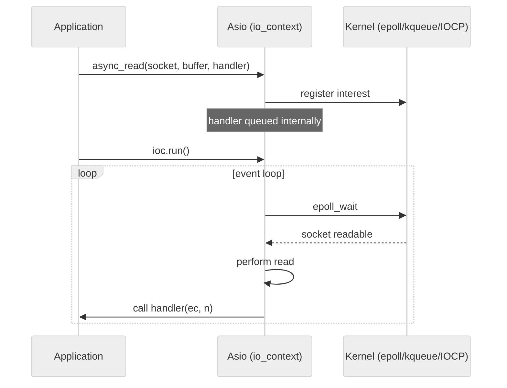
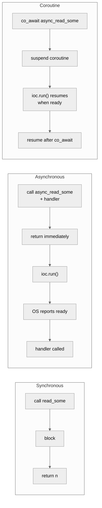
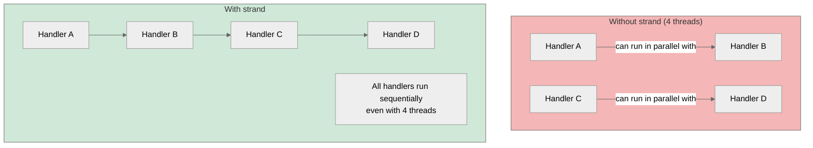

# 6. Boost.Asio Overview

> [!info] Where this fits
> This note is the capstone of the Networking chapter. It wraps the raw POSIX sockets from [[2. Sockets in C++]] and the event-driven patterns from [[5. Non-blocking I-O and epoll]] into a modern, cross-platform C++ library. The earlier notes in the chapter — [[1. Network Fundamentals]], [[3. TCP Server and Client]], [[4. UDP Communication]] — give you the context to understand what Asio does for you.

## Why This Matters

The C++ standard library does not include networking. The original plan was to ship networking in C++23, based on Boost.Asio; this was deferred indefinitely. As of 2024, if you want to write portable, production-grade network code in C++ without reinventing the wheel, **Boost.Asio is the default choice**. The standalone version, **Asio** (the same library, without Boost dependencies), is also available.

Boost.Asio's value proposition:

1. **Cross-platform.** The same code runs on Linux (epoll), macOS/BSD (kqueue), and Windows (IOCP). The platform-specific multiplexing is hidden.
2. **Modern C++.** Templates, move semantics, lambdas, coroutines (C++20). No `void*` user data, no macro soup.
3. **Synchronous and asynchronous.** You can write blocking code for a quick CLI tool, then convert to async for a high-throughput server, using the same library.
4. **Strands for serialization.** A first-class mechanism for "run these operations without concurrency" without resorting to mutexes.
5. **Coroutines.** C++20 coroutines make async code look synchronous. Asio's `co_await` support is mature.
6. **Composability.** Timers, sockets, serial ports, signals — all use the same async model.

Boost.Asio is used by Hivebot, rttr, Mara, and many others. It is the foundation of the **Beast** HTTP library and the proposed C++26 networking standard. Learning it is not optional for a modern C++ network programmer.

The library's two big ideas are:
- The **`io_context`** is the event loop. You submit work to it; it runs and dispatches completions.
- **Asynchronous operations** are initiated by Asio and completed by the `io_context` when ready. You provide a completion handler (lambda or function); Asio calls it.

## Background

Boost.Asio was created by Christopher Kohlhoff in 2003, accepted into Boost in 2005. The original design was influenced by the ACE framework but with a more modern, template-heavy style. The standalone Asio project tracks Boost.Asio closely — the only differences are the namespace (`asio::` vs `boost::asio::`) and the absence of Boost dependencies.

Key milestones:
- **2003:** First version.
- **2005:** Accepted into Boost 1.35.
- **2008:** Buffers and streams redesign.
- **2017:** Executors proposal — Asio's executor model became the basis for `std::executor` (later removed).
- **2020:** C++20 coroutine support (`co_await`).
- **2023:** `any_io_executor` and `experimental::awaitable_operators`.
- **2024:** `io_uring` support (experimental).

The library is large (~50k lines) but the surface area for everyday use is small: `io_context`, `ip::tcp::socket`, `ip::tcp::acceptor`, `ip::udp::socket`, `steady_timer`, `buffer`, `strand`, `co_spawn`, `awaitable`.

## Main Content

### The `io_context`

`io_context` is the heart of Asio. It is the event loop, the work queue, and the dispatcher all in one.

```cpp
#include <boost/asio.hpp>
namespace asio = boost::asio;

int main() {
    asio::io_context ioc;
    // ... set up some async operations ...
    ioc.run();  // blocks until all work is done
}
```

`ioc.run()` blocks while there is pending work. When all operations complete (and no timers are pending), `run()` returns. To keep the loop alive even with no work, use a `executor_work_guard`:

```cpp
auto guard = asio::make_work_guard(ioc);
ioc.run();  // runs forever, even if no async ops are pending
```

This is useful for servers that should stay alive between connections.

### Synchronous TCP client

```cpp
#include <boost/asio.hpp>
#include <iostream>

namespace asio = boost::asio;
using asio::ip::tcp;

int main() {
    asio::io_context ioc;
    tcp::resolver r(ioc);
    tcp::socket sock(ioc);

    auto endpoints = r.resolve("example.com", "80");
    asio::connect(sock, endpoints);

    std::string request = "GET / HTTP/1.0\r\nHost: example.com\r\n\r\n";
    asio::write(sock, asio::buffer(request));

    char reply[4096];
    size_t len = sock.read_some(asio::buffer(reply));
    std::cout.write(reply, len);
}
```

This looks like blocking POSIX code, but Asio handles the platform differences, error codes, and partial writes for you.

### Asynchronous TCP client (callback style)

```cpp
#include <boost/asio.hpp>
#include <iostream>

namespace asio = boost::asio;
using asio::ip::tcp;

class HttpClient {
public:
    HttpClient(asio::io_context& ioc, const std::string& host, const std::string& port)
        : resolver_(ioc), socket_(ioc)
    {
        resolver_.async_resolve(host, port,
            [this](auto ec, auto endpoints) {
                if (ec) { std::cerr << "resolve: " << ec.message() << "\n"; return; }
                asio::async_connect(socket_, endpoints,
                    [this](auto ec, auto) {
                        if (ec) { std::cerr << "connect: " << ec.message() << "\n"; return; }
                        send_request();
                    });
            });
    }

private:
    void send_request() {
        const std::string req = "GET / HTTP/1.0\r\nHost: example.com\r\n\r\n";
        asio::async_write(socket_, asio::buffer(req),
            [this](auto ec, size_t) {
                if (ec) { std::cerr << "write: " << ec.message() << "\n"; return; }
                read_response();
            });
    }

    void read_response() {
        socket_.async_read_some(asio::buffer(buf_),
            [this](auto ec, size_t n) {
                if (ec) {
                    if (ec != asio::error::eof) std::cerr << "read: " << ec.message() << "\n";
                    return;
                }
                std::cout.write(buf_.data(), n);
                read_response();  // recurse for more data
            });
    }

    tcp::resolver resolver_;
    tcp::socket socket_;
    std::array<char, 4096> buf_;
};

int main() {
    asio::io_context ioc;
    HttpClient client(ioc, "example.com", "80");
    ioc.run();
}
```

This is the classic "callback pyramid of doom." Each async step takes a lambda that calls the next step. For three steps it is readable; for ten it is a nightmare. This is why C++20 coroutines are a game-changer (see below).

### Asynchronous TCP client (coroutine style, C++20)

```cpp
#include <boost/asio.hpp>
#include <iostream>

namespace asio = boost::asio;
using asio::ip::tcp;
using asio::awaitable;
using asio::co_spawn;
using asio::use_awaitable;

awaitable<void> fetch_page() {
    auto executor = co_await asio::this_coro::executor;
    tcp::resolver resolver(executor);
    tcp::socket socket(executor);

    auto endpoints = co_await resolver.async_resolve("example.com", "80", use_awaitable);
    co_await asio::async_connect(socket, endpoints, use_awaitable);

    std::string req = "GET / HTTP/1.0\r\nHost: example.com\r\n\r\n";
    co_await asio::async_write(socket, asio::buffer(req), use_awaitable);

    std::array<char, 4096> buf;
    while (true) {
        size_t n = co_await socket.async_read_some(asio::buffer(buf), use_awaitable);
        std::cout.write(buf.data(), n);
    }
}

int main() {
    try {
        asio::io_context ioc;
        co_spawn(ioc, fetch_page, asio::detached);
        ioc.run();
    } catch (std::exception& e) {
        std::cerr << "Exception: " << e.what() << "\n";
    }
}
```

This is the same logic as the callback version, but it reads top-to-bottom like synchronous code. `co_await` suspends the coroutine until the async operation completes; the `io_context` resumes it when ready. There is no callback pyramid, no manual state machine, no nested lambdas.

### Asynchronous TCP echo server (coroutine style)

```cpp
#include <boost/asio.hpp>
#include <iostream>

namespace asio = boost::asio;
using asio::ip::tcp;
using asio::awaitable;
using asio::co_spawn;
using asio::use_awaitable;
using asio::detached;
using asio::redirect_error;

awaitable<void> echo(tcp::socket socket) {
    std::array<char, 4096> buf;
    while (true) {
        auto [ec, n] = co_await socket.async_read_some(
            asio::buffer(buf), redirect_error(use_awaitable, ec));
        if (ec == asio::error::eof) break;
        if (ec) co_return;
        co_await asio::async_write(socket, asio::buffer(buf, n), use_awaitable);
    }
}

awaitable<void> listener() {
    auto executor = co_await asio::this_coro::executor;
    tcp::acceptor acceptor(executor, {tcp::v6(), 9000});

    while (true) {
        tcp::socket socket = co_await acceptor.async_accept(use_awaitable);
        co_spawn(executor, echo(std::move(socket)), detached);
    }
}

int main() {
    try {
        asio::io_context ioc;
        co_spawn(ioc, listener, detached);
        ioc.run();
    } catch (std::exception& e) {
        std::cerr << e.what() << "\n";
    }
}
```

This is roughly 30 lines of code for a concurrent echo server that scales to thousands of connections. The coroutine-per-connection model gives you the readability of thread-per-connection with the performance of an event loop.

### Strands: no-concurrent-execution guarantee

A **strand** is an executor that guarantees its handlers do not run concurrently. Even if multiple threads are running the `io_context`, handlers posted through the same strand are serialized.

```cpp
asio::strand<asio::io_context::executor_type> strand(ioc.get_executor());

asio::post(strand, [] { std::cout << "A start\n"; });
asio::post(strand, [] { std::cout << "A end\n"; });
asio::post(strand, [] { std::cout << "B\n"; });
```

Even if you call `ioc.run()` from 4 threads, the three handlers above run sequentially — never interleaved. This is the Asio alternative to a mutex: instead of locking data, you ensure all access goes through the same strand.

For per-connection state in a server, derive the socket's executor from a strand:

```cpp
auto strand = asio::make_strand(ioc);
tcp::socket socket(strand);
// All handlers for this socket use the strand — no concurrent execution.
```

### Buffers

Asio uses a buffer abstraction to avoid copies:

- `asio::const_buffer` — read-only view: pointer + length.
- `asio::mutable_buffer` — writable view.
- `asio::buffer(container)` — creates a buffer view over a `std::vector`, `std::array`, raw array, or `std::string`.

```cpp
std::vector<char> buf(4096);
asio::async_read(socket, asio::buffer(buf),
    [](auto ec, size_t n) { /* ... */ });

// Multiple buffers in one operation (scatter/gather):
std::array<asio::mutable_buffer, 2> bufs = {
    asio::buffer(header_buf),
    asio::buffer(body_buf)
};
asio::async_read(socket, bufs, [](auto ec, size_t) { /* ... */ });
```

For dynamic buffers (which grow as needed), use `asio::dynamic_buffer`:

```cpp
std::string data;
auto dbuf = asio::dynamic_buffer(data);
asio::async_read_until(socket, dbuf, "\r\n\r\n",
    [](auto ec, size_t n) { /* headers received */ });
```

`async_read_until` is the canonical "read until delimiter" operation — used for HTTP headers, Redis responses, line-based protocols.

### Timers

```cpp
#include <boost/asio/steady_timer.hpp>

asio::steady_timer timer(ioc, std::chrono::seconds(5));
timer.async_wait([](auto ec) {
    if (!ec) std::cout << "Timer fired\n";
});
```

Or with coroutines:

```cpp
asio::steady_timer timer(executor);
timer.expires_after(std::chrono::seconds(5));
co_await timer.async_wait(use_awaitable);
```

Timers integrate with the event loop — they do not spawn threads. They are the basis for timeout implementation: start a timer, start an async_read, and whichever completes first cancels the other.

### Cancellation

Asio supports cancellation of async operations. Cancellation happens when:
- The `socket.cancel()` is called.
- The socket is closed.
- A `cancellation_signal` is triggered.

```cpp
asio::cancellation_signal sig;
asio::async_compose<...>(..., sig.slot());

// Later, from another thread:
sig.emit(asio::cancellation_type::total);
```

For coroutines, `co_await` integrates with `asio::cancellation_state` automatically. Use `cancel()` on the socket or close it to cancel all pending operations.

### Error handling

Asio overloads every async function to take either:
- A handler that takes `(error_code, ...)` — you handle the error.
- A handler that takes only `(...)` — on error, Asio throws.

For coroutines, `use_awaitable` throws on error; `redirect_error(use_awaitable, ec)` returns the error in `ec` instead.

```cpp
// Throwing style:
try {
    size_t n = co_await socket.async_read_some(asio::buffer(buf), use_awaitable);
} catch (const std::system_error& e) {
    if (e.code() == asio::error::eof) {
        // peer closed
    } else {
        // other error
    }
}

// Non-throwing style:
asio::error_code ec;
size_t n = co_await socket.async_read_some(asio::buffer(buf),
    redirect_error(use_awaitable, ec));
if (ec == asio::error::eof) { /* ... */ }
```

### Other Asio features

- **UDP sockets**: `ip::udp::socket`. Same `async_receive_from` / `async_send_to` API.
- **UNIX domain sockets**: `local::stream_protocol::socket`, `local::datagram_protocol::socket`.
- **Serial ports**: `serial_port` (POSIX).
- **SSL/TLS**: `ssl::stream<tcp::socket>` (via Boost.Beast or standalone OpenSSL wrapper).
- **Signal handling**: `signal_set` — convert signals to async events.
- **File I/O**: `random_access_file`, `stream_file` (Asio 1.30+, uses `io_uring` on Linux).
- **Post / dispatch**: schedule arbitrary functions onto the event loop.
- **`any_io_executor`**: type-erased executor for cross-module APIs.

### Multi-threaded event loops

```cpp
asio::io_context ioc;
auto work = asio::make_work_guard(ioc);

std::vector<std::thread> threads;
int n = std::thread::hardware_concurrency();
for (int i = 0; i < n; ++i) {
    threads.emplace_back([&ioc] { ioc.run(); });
}

// All threads pull work from the same io_context.
// Strands ensure per-connection handlers are serialized.

for (auto& t : threads) t.join();
```

This is the standard production architecture: N threads, one `io_context`, strands for serialization. Boost.Asio handles the locking internally.

### Beast: HTTP on top of Asio

Boost.Beast is a header-only HTTP and WebSocket library built on Asio. It is the de facto C++ HTTP library for new projects:

```cpp
#include <boost/beast.hpp>
#include <boost/asio.hpp>

namespace beast = boost::beast;
namespace http = beast::http;
namespace asio = boost::asio;
using tcp = asio::ip::tcp;

awaitable<void> http_get() {
    auto executor = co_await asio::this_coro::executor;
    beast::tcp_stream stream(executor);

    tcp::resolver resolver(executor);
    auto endpoints = co_await resolver.async_resolve("example.com", "80", asio::use_awaitable);
    co_await stream.async_connect(endpoints, asio::use_awaitable);

    http::request<http::string_body> req{http::verb::get, "/", 11};
    req.set(http::field::host, "example.com");
    co_await http::async_write(stream, req, asio::use_awaitable);

    beast::flat_buffer buf;
    http::response<http::string_body> res;
    co_await http::async_read(stream, buf, res, asio::use_awaitable);

    std::cout << res.body() << "\n";
}
```

## Mermaid Diagrams

### Boost.Asio async call flow



### Synchronous vs asynchronous call paths



### Strand serialization



## Code Examples

### CMake integration

```cmake
cmake_minimum_required(VERSION 3.20)
project(asio_demo CXX)
set(CMAKE_CXX_STANDARD 20)
set(CMAKE_CXX_STANDARD_REQUIRED ON)

# Option 1: Boost.Asio (with Boost)
find_package(Boost 1.83 REQUIRED COMPONENTS system)
add_executable(server server.cpp)
target_link_libraries(server PRIVATE Boost::system)
target_compile_definitions(server PRIVATE BOOST_ASIO_NO_DEPRECATED)

# Option 2: standalone Asio (header-only)
# FetchContent_Declare(asio GIT_REPOSITORY https://github.com/chriskohlhoff/asio.git)
# FetchContent_MakeAvailable(asio)
# target_link_libraries(server PRIVATE asio)
```

### Full echo server (coroutine, with timeout)

```cpp
#include <boost/asio.hpp>
#include <iostream>

namespace asio = boost::asio;
using asio::ip::tcp;
using asio::awaitable;
using asio::co_spawn;
using asio::use_awaitable;
using asio::detached;
using namespace std::chrono;

awaitable<void> echo(tcp::socket socket) {
    auto executor = co_await asio::this_coro::executor;
    asio::steady_timer timeout(executor);

    std::array<char, 4096> buf;
    while (socket.is_open()) {
        timeout.expires_after(30s);

        // Race read vs timeout
        asio::cancellation_signal cs;
        co_spawn(executor,
            [&]() -> awaitable<void> {
                timeout.async_wait([&](auto ec) {
                    if (!ec) cs.emit(asio::cancellation_type::total);
                });
                co_return;
            }, detached);

        try {
            auto [ec, n] = co_await socket.async_read_some(
                asio::buffer(buf),
                asio::redirect_error(use_awaitable, ec));
            if (ec) co_return;
            co_await asio::async_write(socket,
                asio::buffer(buf, n), use_awaitable);
        } catch (...) {
            break;
        }
        timeout.cancel();
    }
}

awaitable<void> listener() {
    auto executor = co_await asio::this_coro::executor;
    tcp::acceptor acceptor(executor, {tcp::v6(), 9000});
    for (;;) {
        auto socket = co_await acceptor.async_accept(use_awaitable);
        co_spawn(executor, echo(std::move(socket)), detached);
    }
}

int main() {
    try {
        asio::io_context ioc;
        asio::signal_set signals(ioc, SIGINT, SIGTERM);
        signals.async_wait([&](auto, auto) { ioc.stop(); });
        co_spawn(ioc, listener, detached);
        ioc.run();
    } catch (std::exception& e) {
        std::cerr << e.what() << "\n";
    }
}
```

### HTTP client with Beast

```cpp
#include <boost/beast.hpp>
#include <boost/asio.hpp>
#include <iostream>

namespace beast = boost::beast;
namespace http  = beast::http;
namespace asio  = boost::asio;
using tcp = asio::ip::tcp;

int main() {
    asio::io_context ioc;
    tcp::resolver r(ioc);
    beast::tcp_stream stream(ioc);

    auto endpoints = r.resolve("example.com", "80");
    stream.connect(endpoints);

    http::request<http::string_body> req{http::verb::get, "/", 11};
    req.set(http::field::host, "example.com");
    req.set(http::field::user_agent, "Beast/1.0");

    http::write(stream, req);

    beast::flat_buffer buf;
    http::response<http::string_body> res;
    http::read(stream, buf, res);

    std::cout << res.result_int() << "\n"
              << res.body() << "\n";

    beast::error_code ec;
    stream.socket().shutdown(tcp::socket::shutdown_both, ec);
}
```

## Common Pitfalls

> [!warning] Pitfalls
> - **Forgetting to call `ioc.run()`.** All the async operations are queued; nothing happens until the event loop runs.
> - **Letting `io_context` run out of work.** If no async ops are pending, `run()` returns. Use `make_work_guard` to keep it alive.
> - **Lifetime issues with buffers.** `asio::buffer(ptr, n)` does not copy the data. If `ptr` is freed before the async op completes, you have a use-after-free. Capture buffers in the lambda or use `shared_ptr`.
> - **Lifetime issues with the socket itself.** If a coroutine captures `socket` by reference and the surrounding scope exits, the coroutine resumes on a dangling reference. Capture by value (move) or use `shared_ptr<tcp::socket>`.
> - **Mixing sync and async on the same socket.** A sync call blocks the event loop, defeating the purpose. Use async (or coroutines) everywhere.
> - **Not using strands for shared state.** Two handlers running concurrently on different threads will race on shared data. Wrap them in a strand.
> - **Catching exceptions across coroutine boundaries.** An uncaught exception in a coroutine terminates the process. Always wrap top-level coroutines in try/catch.
> - **Using `use_awaitable` without `co_await`.** The async function returns an `awaitable`; if you don't `co_await` it, the operation never starts.
> - **Forgetting to set `BOOST_ASIO_NO_DEPRECATED`.** Old APIs (io_context::work, raw `asio::io_service`) are deprecated. Define this to get compile-time warnings.
> - **Not reading the error code.** `eof` is a normal close, not an error. Check `ec == asio::error::eof` before logging "read failed".

## Tips and Tricks

> [!tip] Tips
> - Use **C++20 coroutines** for all new async code. They are dramatically more readable than callbacks.
> - Use `asio::detached` for fire-and-forget coroutines; `asio::awaitable<T>` for coroutines that need a return value.
> - Use `co_spawn(ioc, my_coro(args), asio::detached)` to start a top-level coroutine.
> - Use `asio::experimental::parallel_group` (or the `awaitable_operators` from Asio 1.80+) to race multiple operations: `co_await (async_read || timeout)`.
> - For high-throughput servers, run the `io_context` on N threads (N = core count) and use `make_strand` per connection.
> - Use `asio::stream_file` for file I/O (Asio 1.79+) — supports `io_uring` on Linux.
> - For HTTP, use Boost.Beast. For HTTPS, use Beast's SSL stream. For WebSocket, use Beast's `websocket::stream`.
> - For TCP-based RPC, consider gRPC (which uses its own I/O but is the industry standard) or simple length-prefixed protocols on Beast.
> - For per-connection state in a server, create a `shared_ptr<Session>` and capture it in the coroutine. The session is destroyed automatically when the coroutine ends.
> - Profile with `perf` and Asio's `handler_tracking` (define `BOOST_ASIO_ENABLE_HANDLER_TRACKING`) to find which handlers are slow.
> - Use the standalone Asio if you don't want Boost as a dependency. The API is identical; just `asio::` instead of `boost::asio::`.
> - For modern code, prefer `asio::any_io_executor` for type-erased executors when crossing API boundaries.

## Active Recall

1. What is `io_context`? What does `ioc.run()` do?
2. Convert a synchronous `asio::read` call to its asynchronous coroutine equivalent.
3. What is a strand, and when would you use one?
4. Why must you be careful with buffer lifetimes in async operations?
5. Write a 30-line coroutine-based TCP echo server.
6. How does Asio abstract over `epoll` (Linux), `kqueue` (BSD/macOS), and IOCP (Windows)?
7. What does `co_spawn(ioc, my_coro, detached)` do?
8. How would you implement a per-connection timeout in a coroutine-based server?
9. What is Boost.Beast, and when would you use it?
10. Why is the standalone Asio library preferred by some projects over Boost.Asio?

## Next Steps

- This is the final note in the Networking chapter. Loop back to [[1. Network Fundamentals]] to consolidate the conceptual model.
- Cross-link to [[2. Sockets in C++]] for the raw API Asio wraps.
- Cross-link to [[5. Non-blocking I-O and epoll]] for the underlying event-driven model Asio uses.
- Cross-link to [[14. Concurrency and Multithreading]] — Asio's strand model is a concurrency primitive.
- Cross-link to [[8. Modern C++/9. C++20 and C++23 New Features]] — Asio coroutines depend on C++20.
- Cross-link to [[18. Software Engineering Practices/6. Software Architecture]] — the architecture of an Asio server (event loop + thread pool + per-connection state) is a real-world example of architectural patterns.
