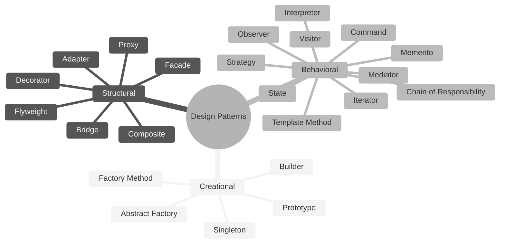
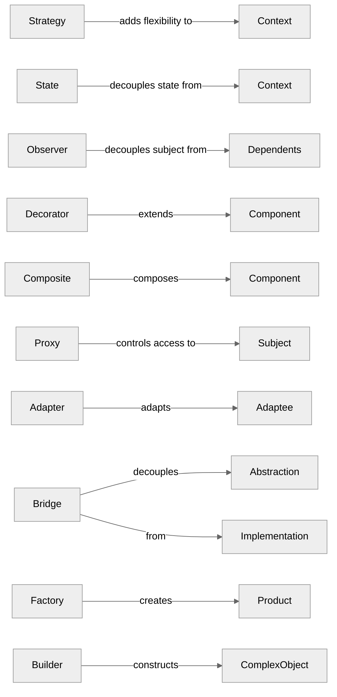
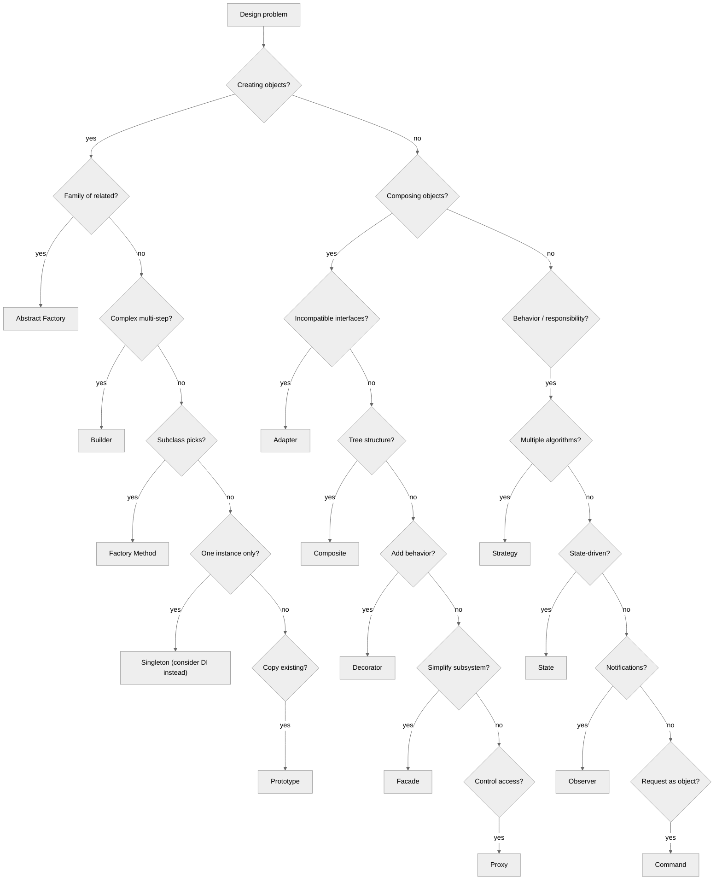

# 1. Design Patterns Overview

> [!info] Where this fits
> This note is the umbrella for the entire SWE chapter's patterns sub-series. The next three notes drill into specific pattern categories: [[2. Creational Patterns]], [[3. Structural Patterns]], [[4. Behavioral Patterns]]. The remaining notes cover principles ([[5. SOLID Principles]]), high-level architecture ([[6. Software Architecture]]), and continuous improvement ([[7. Code Quality and Refactoring]]).

## Why This Matters

A **design pattern** is a named, reusable solution to a recurring design problem. The phrase sounds academic, but the practice is concrete: when you say "Observer" to a colleague, they immediately know you mean "an object that broadcasts notifications to a list of subscribers." Patterns compress communication. Instead of describing a 200-line mechanism, you name it.

The value of patterns is not the patterns themselves — most are obvious in hindsight — but the **shared vocabulary** they create. A team that has internalized the GoF vocabulary spends less time describing mechanisms and more time discussing trade-offs. A team that has not is forever reinventing the Singleton (badly) or describing the Strategy pattern by drawing it on a whiteboard every sprint.

C++ is the language the GoF patterns were written for. The original 1994 book uses C++ and Smalltalk for examples; the patterns fit C++'s class model, virtual dispatch, and template metaprogramming naturally. Some patterns have even been absorbed into the language: `std::function` is the Strategy pattern, `std::variant` is a closed-polymorphism replacement, `std::shared_ptr` is a reference-counted handle that solves problems the patterns used to address manually.

This note covers what patterns are, where they came from, the three categories (creational, structural, behavioral), their criticisms, and how they look in modern C++. The next three notes go into each pattern with code.

## Background

### The Gang of Four

In 1994, Erich Gamma, Richard Helm, Ralph Johnson, and John Vlissides published *"Design Patterns: Elements of Reusable Object-Oriented Software"* (Addison-Wesley). The authors became known as the **Gang of Four** (GoF). The book cataloged 23 patterns organized into three categories:

- **Creational** (5 patterns): how objects are created.
- **Structural** (7 patterns): how classes and objects are composed into larger structures.
- **Behavioral** (11 patterns): how objects communicate and divide responsibilities.

The book was a synthesis of design experience from the late 1980s and early 1990s. It was influenced by Christopher Alexander's work on patterns in architecture (*A Pattern Language*, 1977), Kent Beck's work on Smalltalk patterns, and the authors' own experience with frameworks like ET++.

The GoF book is one of the most influential programming books ever written. Its terminology — Singleton, Observer, Strategy, Adapter, Factory — is now standard across every object-oriented language. Even languages that did not exist in 1994 (Java, C#, Python, Ruby, Go) use the same vocabulary.

### What makes something a "pattern"

A pattern is more than a clever trick. The GoF defined a pattern as having four essential elements:

1. **Pattern name.** A short, evocative word or phrase. "Observer" is better than "publish-subscribe list of dependent objects with notify-on-state-change."
2. **Problem.** When to apply the pattern. What context, what forces, what constraints.
3. **Solution.** The abstract description of the design: classes, objects, relationships, responsibilities.
4. **Consequences.** The trade-offs. What the pattern makes easy, what it makes hard, what it costs.

A pattern without a stated "problem" is just a snippet. A pattern without "consequences" is propaganda. The GoF's discipline on these four elements is what made the book durable.

### Pattern categories

```mermaid
%%{init: {'theme':'neutral'}}%%
flowchart TD
    GoF["GoF Patterns (23)"]
    GoF --> C["Creational (5)"]
    GoF --> S["Structural (7)"]
    GoF --> B["Behavioral (11)"]
    C --> C1["Abstract Factory"]
    C --> C2["Builder"]
    C --> C3["Factory Method"]
    C --> C4["Prototype"]
    C --> C5["Singleton"]
    S --> S1["Adapter"]
    S --> S2["Bridge"]
    S --> S3["Composite"]
    S --> S4["Decorator"]
    S --> S5["Facade"]
    S --> S6["Flyweight"]
    S --> S7["Proxy"]
    B --> B1["Chain of Responsibility"]
    B --> B2["Command"]
    B --> B3["Interpreter"]
    B --> B4["Iterator"]
    B --> B5["Mediator"]
    B --> B6["Memento"]
    B --> B7["Observer"]
    B --> B8["State"]
    B --> B9["Strategy"]
    B --> B10["Template Method"]
    B --> B11["Visitor"]
```



#### Creational patterns

Deal with object creation. They abstract the instantiation process so that a system is decoupled from how its objects are created, composed, and represented. The recurring theme: "delegate construction to a method or class rather than calling `new` directly."

Why this matters: `new` is a compile-time dependency on a specific concrete class. If your code says `new Foo()`, you cannot substitute `MockFoo` for testing, or `OptimizedFoo` for production, without changing the code. Creational patterns let you centralize that coupling in one place.

#### Structural patterns

Deal with class and object composition. They describe how classes and objects are combined into larger structures. The recurring themes: "use composition over inheritance," "adapt interfaces," "add behavior without modifying the original class."

Why this matters: inheritance is rigid (you commit at compile time to a hierarchy), brittle (changes ripple), and limited (you cannot combine two unrelated base classes). Composition is flexible, runtime-polymorphic, and combinable. Most structural patterns are clever uses of composition.

#### Behavioral patterns

Deal with object interaction and responsibility assignment. They describe how objects collaborate without being tightly coupled. The recurring themes: "encapsulate the algorithm," "decouple the sender from the receiver," "distribute behavior across objects."

Why this matters: object-oriented code's biggest risk is god-objects — classes that do everything. Behavioral patterns show how to split responsibilities cleanly so each class has one reason to change.

### Patterns in the C++ context

C++ is the language the GoF patterns were designed for. The original book uses C++ for most examples, and the patterns fit C++'s features naturally:

- **Virtual functions** implement Strategy, State, Template Method.
- **Templates** can implement Strategy at compile time (policy-based design).
- **References and pointers** enable composition patterns.
- **Smart pointers** (`std::shared_ptr`, `std::unique_ptr`) handle object lifetimes that patterns used to manage manually.
- **`std::function`** is a first-class Strategy pattern.
- **`std::variant`** is a closed-set polymorphism that replaces some uses of State and Visitor.
- **`std::any`** is a type-erased container, useful in some patterns.
- **Concepts (C++20)** enable compile-time interface contracts.

Modern C++ also reduces the need for some patterns:

- **Singleton** is widely considered an anti-pattern (see [[2. Creational Patterns]]).
- **Iterator** is built into the STL; you rarely write your own.
- **Observer** is sometimes replaced by signals/slots libraries (Qt) or RxCpp.
- **Visitor** is sometimes replaced by `std::variant` + `std::visit`.
- **Strategy** via virtual functions is sometimes replaced by `std::function` or templates.

But the underlying problems persist: you still need to create objects without coupling, compose classes flexibly, and divide responsibilities cleanly. The patterns are tools; modern C++ gives you more tools, but the patterns are still useful.

## Main Content

### Pattern catalog (overview)

A one-line summary of each GoF pattern. See the dedicated note for code and trade-offs.

#### Creational
- **Abstract Factory** — create families of related objects without specifying concrete classes.
- **Builder** — separate construction of a complex object from its representation.
- **Factory Method** — define an interface for creating an object, but let subclasses decide which class to instantiate.
- **Prototype** — create new objects by copying a prototype instance.
- **Singleton** — ensure a class has only one instance and provide a global point of access to it.

#### Structural
- **Adapter** — convert the interface of a class into another interface clients expect.
- **Bridge** — decouple an abstraction from its implementation so they can vary independently.
- **Composite** — compose objects into tree structures to represent part-whole hierarchies.
- **Decorator** — attach additional responsibilities to an object dynamically.
- **Facade** — provide a unified interface to a set of interfaces in a subsystem.
- **Flyweight** — use sharing to support large numbers of fine-grained objects efficiently.
- **Proxy** — provide a surrogate or placeholder for another object to control access to it.

#### Behavioral
- **Chain of Responsibility** — decouple sender from receiver by passing a request along a chain.
- **Command** — encapsulate a request as an object.
- **Interpreter** — define a representation for a grammar and an interpreter for it.
- **Iterator** — provide a way to access the elements of an aggregate sequentially.
- **Mediator** — centralize complex communication between objects.
- **Memento** — capture and externalize an object's internal state for later restoration.
- **Observer** — define a one-to-many dependency so that when one object changes, all dependents are notified.
- **State** — allow an object to alter its behavior when its internal state changes.
- **Strategy** — define a family of algorithms, encapsulate each, and make them interchangeable.
- **Template Method** — define the skeleton of an algorithm, deferring some steps to subclasses.
- **Visitor** — represent an operation to be performed on the elements of an object structure.

### Why patterns are useful

1. **Shared vocabulary.** "Use a Strategy here" is faster than describing the design.
2. **Tested solutions.** Patterns have been used in production for 30+ years. The trade-offs are known.
3. **Refactoring targets.** When you see a "switch on type" code smell, the refactoring is to Strategy or State. When you see "complex constructor with many parameters," the refactoring is to Builder.
4. **Documentation.** Naming a class `OrderFactory` tells the reader what it does without comments.
5. **Onboarding.** A new hire who knows the patterns can read your codebase faster.

### Criticisms of patterns

Patterns are not without criticism:

1. **Overuse.** Some programmers apply patterns reflexively, producing architectures with seven layers of indirection where a simple function would do. "When all you have is a hammer, everything looks like a Singleton."
2. **Language-specific.** Many patterns work around limitations of C++/Java that do not exist in other languages. In Python, the Strategy pattern is "just pass a function." In Haskell, the Visitor pattern is "just pattern matching." The GoF patterns are a sign of missing language features.
3. **Singleton is an anti-pattern.** It introduces global state, makes testing harder, and couples code. See [[2. Creational Patterns]].
4. **Patterns obscure simplicity.** A 50-line Strategy-based design that could be 10 lines of `std::function` is worse.
5. **Pattern fundamentalism.** Teams that mandate patterns ("every class must have an interface") produce over-engineered codebases. Patterns are tools, not laws.

The mature view: learn the patterns, recognize the problems they solve, apply them when the problem actually fits, and prefer language features (lambdas, `std::variant`, templates) where they replace the pattern more cleanly.

### Pattern categories beyond GoF

The GoF is the most famous pattern catalog, but not the only one:

- **Concurrency patterns**: Producer-Consumer, Reader-Writer Lock, Monitor, Active Object, Half-Sync/Half-Async, Leader-Followers, Reactor, Proactor. (See [[14. Concurrency and Multithreading]] and [[17. Networking/5. Non-blocking I-O and epoll]] for the Reactor pattern.)
- **Architectural patterns**: Layered, MVC, MVP, MVVM, Microservices, Event-Driven, CQRS. (See [[6. Software Architecture]].)
- **Enterprise integration patterns**: Publish-Subscribe, Request-Reply, Message Broker, Content-Based Router. (Hohpe & Woolf, 2003.)
- **DDD patterns**: Aggregate, Repository, Factory, Value Object, Domain Event. (See [[6. Software Architecture]].)
- **Functional patterns**: Functor, Monad, Monoid. (Less common in C++, but `std::optional` is a Monad in spirit.)

### Patterns vs idioms vs principles

- **Idiom**: a language-specific pattern. "Rule of Five" is a C++ idiom; "pimpl" is a C++ idiom. Idioms are smaller and more concrete than patterns.
- **Pattern**: a language-agnostic design solution. Larger, more abstract.
- **Principle**: a rule of thumb. SOLID (see [[5. SOLID Principles]]) is a set of principles. DRY, KISS, YAGNI are principles. Principles guide design; patterns implement it.

The relationship: principles guide you toward patterns. "Dependency Inversion Principle" pushes you toward Dependency Injection, which is implemented via Factory, Abstract Factory, or a DI container. "Open-Closed Principle" pushes you toward Strategy, State, or Template Method.

## Mermaid Diagrams

### GoF pattern taxonomy



### Pattern relationship map



### When to use patterns (decision tree)



## Code Examples

### Pattern: Strategy (modern C++ with `std::function`)

```cpp
#include <functional>
#include <iostream>
#include <vector>

class Sorter {
public:
    using Comparator = std::function<bool(int, int)>;
    explicit Sorter(Comparator c) : cmp_(std::move(c)) {}

    void sort(std::vector<int>& v) {
        std::sort(v.begin(), v.end(), cmp_);
    }
private:
    Comparator cmp_;
};

int main() {
    std::vector<int> v{3, 1, 4, 1, 5, 9, 2, 6};

    Sorter ascending([](int a, int b) { return a < b; });
    ascending.sort(v);
    for (int x : v) std::cout << x << " ";
    std::cout << "\n";

    Sorter descending([](int a, int b) { return a > b; });
    descending.sort(v);
    for (int x : v) std::cout << x << " ";
}
```

This is the Strategy pattern in modern C++: a `std::function` member that holds the strategy. No virtual functions, no class hierarchy. The pattern is implicit in the language.

### Pattern: Observer (signals-and-slots style)

```cpp
#include <functional>
#include <vector>
#include <string>
#include <iostream>

template <typename... Args>
class Signal {
public:
    using Slot = std::function<void(Args...)>;
    void connect(Slot s) { slots_.push_back(std::move(s)); }
    void emit(Args... args) {
        for (auto& s : slots_) s(args...);
    }
private:
    std::vector<Slot> slots_;
};

class Button {
public:
    Signal<> onClick;
    void click() { onClick.emit(); }
};

int main() {
    Button b;
    b.onClick.connect([] { std::cout << "Clicked!\n"; });
    b.onClick.connect([] { std::cout << "Logging click\n"; });
    b.click();
}
```

### Pattern: Builder (fluent interface)

```cpp
#include <string>
#include <stdexcept>

class HttpRequest {
public:
    class Builder {
    public:
        Builder& method(std::string m) { m_ = std::move(m); return *this; }
        Builder& url(std::string u)    { u_ = std::move(u); return *this; }
        Builder& header(std::string k, std::string v) {
            headers_.emplace_back(std::move(k), std::move(v));
            return *this;
        }
        Builder& body(std::string b)   { b_ = std::move(b); return *this; }
        HttpRequest build() {
            if (u_.empty()) throw std::runtime_error("url required");
            return HttpRequest{std::move(m_), std::move(u_),
                               std::move(headers_), std::move(b_)};
        }
    private:
        std::string m_ = "GET", u_, b_;
        std::vector<std::pair<std::string, std::string>> headers_;
    };

    const std::string& method() const { return m_; }
    const std::string& url() const    { return u_; }
private:
    HttpRequest(std::string m, std::string u,
                std::vector<std::pair<std::string, std::string>> h,
                std::string b)
        : m_(std::move(m)), u_(std::move(u)),
          headers_(std::move(h)), b_(std::move(b)) {}
    std::string m_, u_, b_;
    std::vector<std::pair<std::string, std::string>> headers_;
};

int main() {
    auto req = HttpRequest::Builder()
        .method("POST")
        .url("https://api.example.com/users")
        .header("Content-Type", "application/json")
        .body(R"({"name":"alice"})")
        .build();
}
```

## Common Pitfalls

> [!warning] Pitfalls
> - **Pattern fundamentalism.** "Every class must have an interface, every interface needs a Factory, every Factory needs an Abstract Factory." This is over-engineering, not design.
> - **Singleton abuse.** Singletons become hidden global state. Test setups are painful. Prefer dependency injection. (See [[2. Creational Patterns]].)
> - **Patterns as documentation.** Naming your class `UserFactory` when it just constructs `User` instances adds no value. Use the pattern name only if the pattern is actually applied.
> - **Misapplying patterns.** Using Visitor when the structure rarely changes (Visitor is painful when you add new element types). Using State when a simple `enum` would do.
> - **Forgetting the consequences.** Every pattern has trade-offs. Decorator adds layers of indirection. Observer introduces implicit control flow. Strategy fragments algorithms. Read the GoF "Consequences" section.
> - **Cargo-culting from other languages.** Java-style Abstract Factory with reflection is awkward in C++. Use templates or `std::variant` where they fit better.
> - **Pattern tunnel vision.** Sometimes the answer is a function, not a pattern. "I need a Strategy" → "Maybe I just need to pass a lambda."

## Tips and Tricks

> [!tip] Tips
> - Read the GoF book once. Skim it again every few years. The trade-off discussions age well.
> - Read *"Head First Design Patterns"* (Freeman et al.) for a friendlier introduction.
> - For modern C++, read *C++ Software Design* (Klaus Iglberger, 2022) — it covers patterns with C++17/20 idioms.
> - Look at the STL: `std::function` (Strategy), `std::shared_ptr` (Reference Counting + Proxy), iterators (Iterator), `std::variant` (Visitor).
> - When refactoring, name the smell and the pattern: "This switch-on-type smell should become a Strategy." This makes the refactoring deliberate, not accidental.
> - When you find yourself applying a pattern, write a comment naming it: `// Adapter for legacy DB client`. Future readers will thank you.
> - The 23 GoF patterns are not the only patterns. Look at concurrency patterns (Active Object, Reactor), architectural patterns (Layered, Hexagonal), and DDD patterns (Repository, Aggregate).
> - Some patterns have modern replacements: Visitor → `std::variant`+`std::visit`; Singleton → DI; Iterator → ranges; Observer → signals/slots.
> - When designing a new system, start without patterns. Add them when a clear need emerges. Premature patterns are worse than premature optimization.
> - Cross-link patterns to SOLID: each pattern tends to support specific principles. Strategy supports Open/Closed. Dependency Injection supports Dependency Inversion. Naming the principle alongside the pattern reinforces both.

## Active Recall

1. Who were the Gang of Four? When was their book published?
2. What are the four essential elements of a pattern (according to GoF)?
3. Name the three categories of GoF patterns. How many patterns are in each?
4. List all 5 creational patterns from memory.
5. List all 7 structural patterns from memory.
6. List all 11 behavioral patterns from memory.
7. Why is Singleton considered an anti-pattern by many?
8. How does `std::function` implement the Strategy pattern? What advantage does it have over a virtual-function-based Strategy?
9. How does `std::variant` replace the Visitor pattern in some cases?
10. Give an example of a non-GoF pattern (concurrency, architectural, etc.).

## Next Steps

- Continue to [[2. Creational Patterns]] for the 5 creational patterns with code.
- Then [[3. Structural Patterns]] for the 7 structural patterns.
- Then [[4. Behavioral Patterns]] for the 11 behavioral patterns.
- Then [[5. SOLID Principles]] — the principles that guide pattern application.
- Then [[6. Software Architecture]] for higher-level patterns (MVC, microservices, event-driven).
- Then [[7. Code Quality and Refactoring]] for how patterns emerge from refactoring.
- Cross-link to [[9. Object-Oriented Programming]] — patterns are tools of OOP.
- Cross-link to [[10. Templates and Metaprogramming]] — some patterns can be implemented at compile time.
