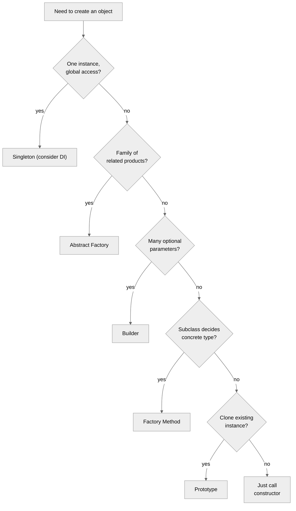
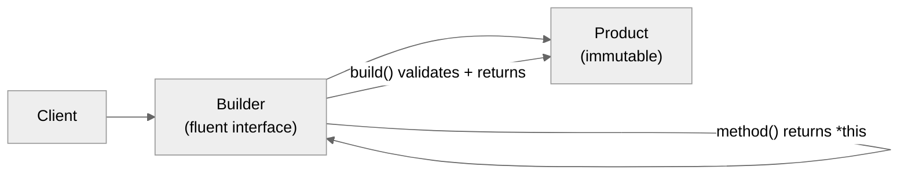

# 2. Creational Patterns

> [!info] Where this fits
> This note covers the 5 creational patterns from the GoF catalog. It builds on [[1. Design Patterns Overview]]. The next two notes cover [[3. Structural Patterns]] and [[4. Behavioral Patterns]]. Modern alternatives to some patterns (dependency injection, `std::variant`) appear in [[6. Software Architecture]] and [[8. Modern C++/9. C++20 and C++23 New Features]].

## Why This Matters

Object creation sounds trivial — `new Foo()` — but it is one of the most consequential decisions in design. Every `new` is:
1. A **compile-time dependency** on a specific concrete class.
2. A **lifetime decision** (when does it get destroyed?).
3. A **coupling point** (you cannot substitute `Foo` for `MockFoo` in tests without changing the code).

Creational patterns push these decisions to the edges of your system. Instead of `new Foo()` scattered across 50 source files, you have one Factory that knows about concrete classes. The rest of the code talks to abstract interfaces.

This matters even more in C++ than in garbage-collected languages because C++ also forces you to decide on **ownership**: who owns the object, when is it destroyed, who is responsible for cleanup. Creational patterns in C++ are as much about ownership as about abstraction.

The 5 creational patterns:

1. **Singleton** — one instance, global access. (Mostly an anti-pattern in modern code.)
2. **Factory Method** — define a creation interface, let subclasses decide what to instantiate.
3. **Abstract Factory** — create families of related objects.
4. **Builder** — separate construction of a complex object from its representation.
5. **Prototype** — create new objects by copying an existing instance.

## Background

### The `new` problem

Consider:

```cpp
class OrderProcessor {
public:
    void process(const Order& o) {
        auto repo = new PostgresOrderRepository();  // bad: hardcoded
        auto notifier = new SmtpNotifier();         // bad: hardcoded
        repo->save(o);
        notifier->notify(o);
        delete repo;
        delete notifier;
    }
};
```

This code cannot be tested without a real PostgreSQL database and SMTP server. The coupling to concrete classes is at the point of use, not at the point of injection. The fix is dependency injection:

```cpp
class OrderProcessor {
public:
    OrderProcessor(OrderRepository& repo, Notifier& notifier)
        : repo_(repo), notifier_(notifier) {}

    void process(const Order& o) {
        repo_.save(o);
        notifier_.notify(o);
    }
private:
    OrderRepository& repo_;
    Notifier& notifier_;
};
```

Now the caller decides what to inject. In production: `PostgresOrderRepository` and `SmtpNotifier`. In tests: `MockOrderRepository` and `MockNotifier`. The creational patterns formalize the place where this decision is made.

### Ownership in C++

C++ forces ownership decisions that garbage-collected languages punt on:
- Who owns the object?
- When is it destroyed?
- Is it shared (`std::shared_ptr`) or unique (`std::unique_ptr`)?

A Factory in C++ typically returns a `std::unique_ptr<Interface>`. This expresses:
- Ownership transfers to the caller.
- The caller is responsible for destruction (handled automatically by `unique_ptr`).
- The concrete type is hidden behind the interface.

For shared ownership, return `std::shared_ptr<Interface>`. For value semantics, consider returning by value (if the interface is small and copyable) or using `std::variant` (for closed polymorphism).

## Main Content

### 1. Singleton

The Singleton pattern ensures a class has only one instance and provides a global access point.

```cpp
class Logger {
public:
    static Logger& instance() {
        static Logger inst;   // Meyers' singleton — thread-safe in C++11+
        return inst;
    }

    void log(const std::string& msg) { /* ... */ }

    Logger(const Logger&) = delete;
    Logger& operator=(const Logger&) = delete;
private:
    Logger() = default;
};
```

#### Why it is an anti-pattern

Singleton combines three problems:

1. **Global state.** Anyone, anywhere, can call `Logger::instance()`. The dependency is invisible in the class's interface. You cannot tell that `OrderProcessor` depends on `Logger` without reading its body.
2. **Testing pain.** You cannot substitute a mock logger without modifying production code (or using link-time seam tricks). Tests that need different logger configurations interfere with each other because the singleton is shared.
3. **Lifetime coupling.** The singleton lives for the entire program. This makes ordering of destruction implicit and can produce "static deinitialization order" bugs.

#### When Singleton is appropriate

Rarely. Acceptable cases:
- A truly global resource that has exactly one instance by definition (e.g., the process's signal handler registry).
- Constant, immutable state (e.g., a configuration table loaded at startup).
- Logging, where the global access is the point (though even then, dependency-injected loggers are better).

#### Modern alternative: dependency injection

```cpp
class Service {
public:
    explicit Service(Logger& log) : log_(log) {}
    void do_work() { log_.log("working"); }
private:
    Logger& log_;
};

// In main:
Logger logger;
Service svc(logger);
svc.do_work();
```

DI makes dependencies explicit, testable, and configurable. Use a DI framework (e.g., `boost::di`) for very large dependency graphs; for most projects, manual construction in `main` is enough.

### 2. Factory Method

Define an interface for creating an object, but let subclasses decide which class to instantiate.

```cpp
class Document {
public:
    virtual ~Document() = default;
    virtual void open() = 0;
};

class PdfDocument : public Document {
public:
    void open() override { /* ... */ }
};

class TextDocument : public Document {
public:
    void open() override { /* ... */ }
};

class Application {
public:
    virtual ~Application() = default;
    std::unique_ptr<Document> create_document() {
        auto doc = make_document();
        doc->open();
        return doc;
    }
protected:
    virtual std::unique_ptr<Document> make_document() = 0;
};

class PdfApplication : public Application {
    std::unique_ptr<Document> make_document() override {
        return std::make_unique<PdfDocument>();
    }
};
```

`Application` defines the algorithm (create then open). The subclass decides which concrete document type to create. The factory method (`make_document`) is the customization point.

#### Modern alternative: `std::function` factory

If you don't need a full subclass hierarchy:

```cpp
class Application {
public:
    using DocFactory = std::function<std::unique_ptr<Document>()>;
    explicit Application(DocFactory f) : factory_(std::move(f)) {}

    std::unique_ptr<Document> create_document() {
        auto doc = factory_();
        doc->open();
        return doc;
    }
private:
    DocFactory factory_;
};

Application app([] { return std::make_unique<PdfDocument>(); });
```

### 3. Abstract Factory

Create families of related objects without specifying concrete classes.

```cpp
class Button {
public:
    virtual ~Button() = default;
    virtual void render() = 0;
};

class Checkbox {
public:
    virtual ~Checkbox() = default;
    virtual void render() = 0;
};

class WindowsButton : public Button {
public:
    void render() override { std::cout << "Windows button\n"; }
};

class WindowsCheckbox : public Checkbox {
public:
    void render() override { std::cout << "Windows checkbox\n"; }
};

class MacButton : public Button {
public:
    void render() override { std::cout << "Mac button\n"; }
};

class MacCheckbox : public Checkbox {
public:
    void render() override { std::cout << "Mac checkbox\n"; }
};

class UIFactory {
public:
    virtual ~UIFactory() = default;
    virtual std::unique_ptr<Button> make_button() = 0;
    virtual std::unique_ptr<Checkbox> make_checkbox() = 0;
};

class WindowsUIFactory : public UIFactory {
public:
    std::unique_ptr<Button> make_button() override { return std::make_unique<WindowsButton>(); }
    std::unique_ptr<Checkbox> make_checkbox() override { return std::make_unique<WindowsCheckbox>(); }
};

class MacUIFactory : public UIFactory {
public:
    std::unique_ptr<Button> make_button() override { return std::make_unique<MacButton>(); }
    std::unique_ptr<Checkbox> make_checkbox() override { return std::make_unique<MacCheckbox>(); }
};

// Usage:
void build_form(UIFactory& factory) {
    auto btn = factory.make_button();
    auto cb = factory.make_checkbox();
    btn->render();
    cb->render();
}
```

Abstract Factory ensures that the family of objects created is consistent — you cannot accidentally pair a Windows Button with a Mac Checkbox.

#### When to use

- The system should be independent of how its products are created.
- The system should be configured with one of multiple families of products.
- You want to enforce consistency across a family.

#### When NOT to use

- If you have only one product family, Factory Method is simpler.
- If products don't relate to each other, you don't need the family abstraction.

### 4. Builder

Separate the construction of a complex object from its representation, so the same construction process can create different representations.

```cpp
class HttpRequest {
public:
    std::string method, url, body;
    std::vector<std::pair<std::string, std::string>> headers;
};

class HttpRequestBuilder {
public:
    HttpRequestBuilder& method(std::string m) { req_.method = std::move(m); return *this; }
    HttpRequestBuilder& url(std::string u)    { req_.url = std::move(u); return *this; }
    HttpRequestBuilder& header(std::string k, std::string v) {
        req_.headers.emplace_back(std::move(k), std::move(v));
        return *this;
    }
    HttpRequestBuilder& body(std::string b)   { req_.body = std::move(b); return *this; }

    HttpRequest build() && {
        if (req_.url.empty()) throw std::invalid_argument("url required");
        return std::move(req_);
    }
private:
    HttpRequest req_;
};

// Usage:
auto req = HttpRequestBuilder()
    .method("POST")
    .url("/api/users")
    .header("Content-Type", "application/json")
    .body(R"({"name":"alice"})")
    .build();
```

#### Why Builder

- **Readability.** Named parameters (C++ doesn't have them natively; Builder emulates them).
- **Validation.** The `build()` method enforces invariants before returning.
- **Immutability.** The built object can be immutable; only the builder is mutable.
- **Optional fields.** Easy to leave fields at defaults.

#### Variants

- **Fluent Builder** (above) — methods return `*this`.
- **Director** — a separate class that drives the builder through a known sequence: `director.construct_admin_request(builder)`.
- **Composite Builder** — multiple builders for different aspects (e.g., `HttpReqBuilder{}.method().url()` + `AuthBuilder{}.token()`).

#### Modern alternative: aggregate initialization + designated initializers (C++20)

For simple value types:

```cpp
struct HttpRequest {
    std::string method = "GET";
    std::string url;
    std::string body;
    std::vector<std::pair<std::string, std::string>> headers;
};

HttpRequest req{
    .method = "POST",
    .url = "/api/users",
    .body = R"({"name":"alice"})",
    .headers = {{"Content-Type", "application/json"}}
};
```

This is cleaner than Builder for simple cases. Use Builder when validation or multi-step construction is needed.

### 5. Prototype

Create new objects by copying a prototype instance.

```cpp
class Shape {
public:
    virtual ~Shape() = default;
    virtual std::unique_ptr<Shape> clone() const = 0;
    virtual void draw() = 0;
};

class Circle : public Shape {
public:
    Circle(double r) : radius_(r) {}
    std::unique_ptr<Shape> clone() const override {
        return std::make_unique<Circle>(*this);
    }
    void draw() override { std::cout << "Circle r=" << radius_ << "\n"; }
private:
    double radius_;
};

class Rectangle : public Shape {
public:
    Rectangle(double w, double h) : w_(w), h_(h) {}
    std::unique_ptr<Shape> clone() const override {
        return std::make_unique<Rectangle>(*this);
    }
    void draw() override { std::cout << "Rect " << w_ << "x" << h_ << "\n"; }
private:
    double w_, h_;
};

// Usage:
std::vector<std::unique_ptr<Shape>> prototypes;
prototypes.push_back(std::make_unique<Circle>(5));
prototypes.push_back(std::make_unique<Rectangle>(3, 4));

auto cloned = prototypes[0]->clone();
cloned->draw();
```

#### When to use

- When creation is expensive (e.g., parsing a config file) and you want pre-built templates.
- When subclasses differ only in their state, not their class.
- When you want to add new types at runtime without modifying existing code (clone from a registry).

#### When NOT to use

- If you can just call a constructor, do that. Prototype is for cases where construction is non-trivial.
- C++ value semantics already do this for value types — `auto copy = original;` is a prototype clone.

### Modern C++ alternatives

#### `std::variant` for closed polymorphism

If your set of types is known at compile time, `std::variant` is often cleaner than a class hierarchy:

```cpp
using Shape = std::variant<Circle, Rectangle, Triangle>;

struct DrawVisitor {
    void operator()(const Circle& c)    { std::cout << "Circle r=" << c.r << "\n"; }
    void operator()(const Rectangle& r) { std::cout << "Rect " << r.w << "x" << r.h << "\n"; }
    void operator()(const Triangle& t)  { std::cout << "Triangle\n"; }
};

Shape s = Circle{5};
std::visit(DrawVisitor{}, s);
```

No virtual functions, no heap allocation, no `clone()` method. The trade-off: adding a new shape requires updating the variant and all visitors (closed polymorphism). Adding a new visitor is easy.

#### Dependency Injection

The modern replacement for Singleton and Factory Method. Inject dependencies as constructor parameters; the call site (often `main`) decides what to inject:

```cpp
class OrderService {
public:
    OrderService(OrderRepo& repo, Notifier& notifier, Clock& clock)
        : repo_(repo), notifier_(notifier), clock_(clock) {}
    // ...
};

// main.cpp
PostgresOrderRepo repo{config};
SmtpNotifier notifier{config};
SystemClock clock;
OrderService svc{repo, notifier, clock};
```

No factory needed; no singleton needed. The wiring happens once, at the composition root.

For larger applications, a DI framework like **boost::di** automates the wiring:

```cpp
auto injector = di::make_injector(
    di::bind<IOrderRepo>.to<PostgresOrderRepo>(),
    di::bind<INotifier>.to<SmtpNotifier>(),
    di::bind<IClock>.to<SystemClock>()
);
auto svc = injector.create<OrderService>();
```

## Mermaid Diagrams

### Creational pattern relationships



### Builder pattern structure



### Abstract Factory structure

```mermaid
%%{init: {'theme':'neutral'}}%%
flowchart TD
    Client --> Factory["AbstractFactory"]
    Factory -.->.|"make_A()"| ProductA["AbstractProductA"]
    Factory -.->.|"make_B()"| ProductB["AbstractProductB"]
    ConcreteFactory1["ConcreteFactory1<br/>(Windows)"] -- inherits --> Factory
    ConcreteFactory2["ConcreteFactory2<br/>(Mac)"] -- inherits --> Factory
    ConcreteFactory1 -.->.|"creates"| CA1["WinButton"]
    ConcreteFactory1 -.->.|"creates"| CB1["WinCheckbox"]
    ConcreteFactory2 -.->.|"creates"| CA2["MacButton"]
    ConcreteFactory2 -.->.|"creates"| CB2["MacCheckbox"]
    CA1 -- inherits --> ProductA
    CA2 -- inherits --> ProductA
    CB1 -- inherits --> ProductB
    CB2 -- inherits --> ProductB
```

## Code Examples

### Modern Factory returning `std::unique_ptr`

```cpp
#include <memory>
#include <string>
#include <unordered_map>
#include <functional>

class Shape {
public:
    virtual ~Shape() = default;
    virtual double area() const = 0;
};

class Circle : public Shape {
public:
    explicit Circle(double r) : r_(r) {}
    double area() const override { return 3.14159 * r_ * r_; }
private:
    double r_;
};

class Square : public Shape {
public:
    explicit Square(double s) : s_(s) {}
    double area() const override { return s_ * s_; }
private:
    double s_;
};

class ShapeFactory {
public:
    using Creator = std::function<std::unique_ptr<Shape>(double)>;
    static ShapeFactory& registry() {
        static ShapeFactory f;
        return f;
    }
    void register_type(const std::string& name, Creator c) {
        creators_[name] = std::move(c);
    }
    std::unique_ptr<Shape> create(const std::string& name, double arg) {
        auto it = creators_.find(name);
        if (it == creators_.end()) return nullptr;
        return it->second(arg);
    }
private:
    std::unordered_map<std::string, Creator> creators_;
};

// Registration (could be in main or at namespace scope)
static bool circle_registered = [] {
    ShapeFactory::registry().register_type("circle",
        [](double r) { return std::make_unique<Circle>(r); });
    return true;
}();
static bool square_registered = [] {
    ShapeFactory::registry().register_type("square",
        [](double s) { return std::make_unique<Square>(s); });
    return true;
}();

int main() {
    auto c = ShapeFactory::registry().create("circle", 5);
    auto s = ShapeFactory::registry().create("square", 4);
    std::cout << c->area() << " " << s->area() << "\n";
}
```

### Builder with validation

```cpp
class DatabaseConfig {
public:
    std::string host;
    int port;
    std::string database;
    std::string username;
    std::string password;
    int pool_size = 10;
    int timeout_seconds = 30;

    class Builder {
    public:
        Builder& host(std::string h)         { cfg_.host = std::move(h); return *this; }
        Builder& port(int p)                 { cfg_.port = p; return *this; }
        Builder& database(std::string d)     { cfg_.database = std::move(d); return *this; }
        Builder& username(std::string u)     { cfg_.username = std::move(u); return *this; }
        Builder& password(std::string p)     { cfg_.password = std::move(p); return *this; }
        Builder& pool_size(int n)            { cfg_.pool_size = n; return *this; }
        Builder& timeout(int s)              { cfg_.timeout_seconds = s; return *this; }

        DatabaseConfig build() && {
            if (cfg_.host.empty())  throw std::invalid_argument("host required");
            if (cfg_.port <= 0)     throw std::invalid_argument("port required");
            if (cfg_.database.empty()) throw std::invalid_argument("database required");
            if (cfg_.pool_size < 1) throw std::invalid_argument("pool_size >= 1");
            return std::move(cfg_);
        }
    private:
        DatabaseConfig cfg_;
    };
};

int main() {
    auto cfg = DatabaseConfig::Builder()
        .host("db.example.com")
        .port(5432)
        .database("orders")
        .username("app")
        .password("secret")
        .pool_size(20)
        .build();
}
```

### Prototype registry

```cpp
class Monster {
public:
    virtual ~Monster() = default;
    virtual std::unique_ptr<Monster> clone() const = 0;
    virtual std::string describe() const = 0;

    int health = 100;
    int attack = 10;
};

class Goblin : public Monster {
public:
    std::unique_ptr<Monster> clone() const override {
        return std::make_unique<Goblin>(*this);
    }
    std::string describe() const override {
        return "Goblin hp=" + std::to_string(health) + " atk=" + std::to_string(attack);
    }
};

class Dragon : public Monster {
public:
    std::unique_ptr<Monster> clone() const override {
        return std::make_unique<Dragon>(*this);
    }
    std::string describe() const override {
        return "Dragon hp=" + std::to_string(health) + " atk=" + std::to_string(attack);
    }
};

class MonsterRegistry {
public:
    void register_prototype(const std::string& name, std::unique_ptr<Monster> p) {
        prototypes_[name] = std::move(p);
    }
    std::unique_ptr<Monster> spawn(const std::string& name) {
        auto it = prototypes_.find(name);
        if (it == prototypes_.end()) return nullptr;
        return it->second->clone();
    }
private:
    std::unordered_map<std::string, std::unique_ptr<Monster>> prototypes_;
};

int main() {
    MonsterRegistry reg;
    auto weak_goblin = std::make_unique<Goblin>();
    weak_goblin->health = 50;
    reg.register_prototype("weak_goblin", std::move(weak_goblin));

    auto boss_dragon = std::make_unique<Dragon>();
    boss_dragon->health = 500;
    boss_dragon->attack = 50;
    reg.register_prototype("boss_dragon", std::move(boss_dragon));

    auto m1 = reg.spawn("weak_goblin");
    auto m2 = reg.spawn("boss_dragon");
    std::cout << m1->describe() << "\n" << m2->describe() << "\n";
}
```

## Common Pitfalls

> [!warning] Pitfalls
> - **Singleton as global state.** Invisibly couples every class that uses it. Prefer DI.
> - **Singleton destruction order.** If Singleton A's destructor uses Singleton B, and B is destroyed first, you crash. Use `std::shared_ptr` or `std::weak_ptr` to express dependencies, or accept leaked singletons (deletion at process exit is automatic).
> - **Factory returning raw pointers.** Callers must remember to `delete`. Return `std::unique_ptr<Interface>` and let RAII handle it.
> - **Builder that doesn't validate.** `build()` should enforce invariants; otherwise it is just a verbose constructor.
> - **Builder `build()` as lvalue.** Returning `*this` from `build()` allows accidental reuse; mark `build() &&` to require rvalue (call chain).
> - **Abstract Factory explosion.** Each new product requires adding a method to the abstract factory AND every concrete factory. With many products, this is high-churn. Consider a generic `make<Product>()` template.
> - **Prototype with shallow copy.** If the prototype owns pointers, `clone()` must deep-copy. The default copy constructor is shallow.
> - **Factory method that does too much.** A factory should construct; it should not also configure, validate, register, etc. Compose with Builder if needed.
> - **Over-engineering.** If you have one concrete type, you don't need a Factory. If you have one parameter, you don't need a Builder.
> - **Mixing ownership.** A factory that sometimes returns owned pointers, sometimes references, sometimes borrowed pointers is a footgun. Pick one (typically `std::unique_ptr`).

## Tips and Tricks

> [!tip] Tips
> - Prefer dependency injection to Singleton in new code. The wiring cost in `main` is paid once; the testability benefit compounds.
> - Return `std::unique_ptr<Interface>` from factories. It expresses ownership clearly and supports polymorphism.
> - For Builder, mark `build()` as `&&` so `Builder().x().y().build()` works but `Builder b; b.build(); b.build();` fails to compile.
> - For Abstract Factory in modern C++, consider a variadic template: `template<class T> std::unique_ptr<T> make();`. Each concrete factory specializes.
> - Use designated initializers (C++20) for simple value types; reach for Builder when validation is needed.
> - For prototype, the copy constructor + a virtual `clone()` returning `std::unique_ptr<Derived>` (covariant return) is the canonical C++ form.
> - For testing, factories that take a "factory function" parameter (`std::function<std::unique_ptr<Interface>()>`) are easy to mock.
> - Use a **registry** (singleton map of name → creator) for plugin systems, but be aware of static initialization order fiasco. Use ` Meyer's singleton` (function-local static) to avoid it.
> - For very large dependency graphs, evaluate `boost::di`. For small ones, manual wiring in `main` is clearer.
> - Cross-link to [[5. SOLID Principles]] — Dependency Inversion is the principle behind Factory and DI.

## Active Recall

1. List the 5 creational patterns from memory.
2. Why is Singleton considered an anti-pattern? What is the modern alternative?
3. What is the difference between Factory Method and Abstract Factory?
4. Write a Builder for a `ConnectionConfig` with host, port, timeout, and pool_size, validating that host is non-empty.
5. When would you use Prototype over a regular constructor?
6. Why should Factory methods return `std::unique_ptr<Interface>` instead of raw pointers?
7. What is "Meyers' Singleton"? Why is it thread-safe in C++11?
8. How does `std::variant` provide an alternative to some creational patterns?
9. Write an Abstract Factory for a UI toolkit with two platforms (Mac, Windows) and two products (Button, Checkbox).
10. What is the static deinitialization order fiasco? How do you avoid it?

## Next Steps

- Continue to [[3. Structural Patterns]] for Adapter, Bridge, Composite, Decorator, Facade, Flyweight, Proxy.
- Then [[4. Behavioral Patterns]] for the 11 behavioral patterns.
- Cross-link to [[1. Design Patterns Overview]] for the broader context.
- Cross-link to [[5. SOLID Principles]] — Dependency Inversion is the principle behind DI and Factory.
- Cross-link to [[8. Modern C++/9. C++20 and C++23 New Features]] for `std::variant`, `std::any`, designated initializers.
- Cross-link to [[9. Object-Oriented Programming/4. Polymorphism and Virtual Functions]] — most creational patterns rely on polymorphism.
