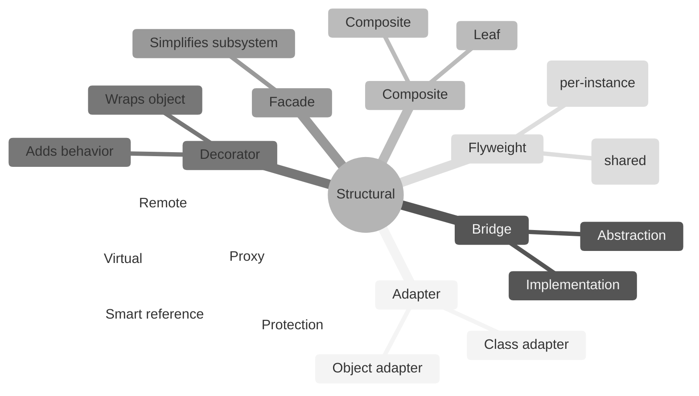
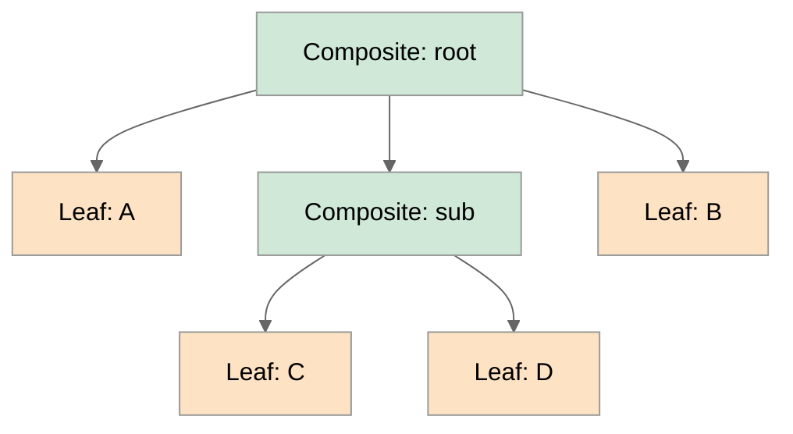
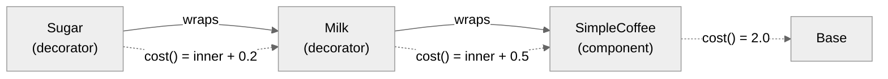

# 3. Structural Patterns

> [!info] Where this fits
> This note covers the 7 structural patterns from the GoF catalog. It builds on [[1. Design Patterns Overview]] and follows [[2. Creational Patterns]]. The next note covers [[4. Behavioral Patterns]].

## Why This Matters

Structural patterns are about **composition**: how classes and objects are combined to form larger structures. They answer questions like:
- "I have a class with the wrong interface. How do I use it without rewriting it?" (Adapter)
- "I have an abstraction with multiple implementations. How do I avoid an explosion of subclasses?" (Bridge)
- "I have a tree of objects that should be treated uniformly. How?" (Composite)
- "I want to add behavior to an object without subclassing. How?" (Decorator)
- "I want to simplify a complex subsystem. How?" (Facade)
- "I have thousands of small objects that share most of their state. How do I save memory?" (Flyweight)
- "I want to control access to an object. How?" (Proxy)

The recurring theme: **composition over inheritance**. Inheritance is rigid (committed at compile time), brittle (changes ripple), and limited (no multiple inheritance of state). Composition is flexible, runtime-polymorphic, and combinable. Almost every structural pattern is a clever use of composition to solve a problem that inheritance solves badly.

In C++ specifically, structural patterns are where modern C++ idioms shine: smart pointers for object lifetime, templates for compile-time composition, `std::variant` for closed polymorphism, concepts for contracts.

## Background

### The inheritance trap

Object-oriented programming encourages inheritance as the primary reuse mechanism. But inheritance has well-known problems:

1. **Compile-time commitment.** You cannot change a class's base class at runtime.
2. **Brittleness.** Changing the base class affects every derived class. The "fragile base class" problem.
3. **Single inheritance of state.** Java and C# forbid multiple inheritance of state; C++ allows it but it is painful (virtual inheritance).
4. **Liskov violations.** It is easy to derive a class that does not actually satisfy the base class's contract.

The GoF book's most quoted advice is: **"Favor object composition over class inheritance."** Structural patterns embody this advice. They show how to compose objects to achieve what inheritance seems to offer, with more flexibility.

### Composition in C++

A composed object holds its collaborators by reference or value:

```cpp
class Service {
private:
    std::shared_ptr<Database> db_;     // by shared ownership
    std::unique_ptr<Logger> logger_;   // by exclusive ownership
    Config& config_;                    // by reference (lifetime external)
};
```

C++ gives you fine-grained control over ownership via `std::unique_ptr`, `std::shared_ptr`, and references. Structural patterns in C++ use these to express ownership cleanly.

## Main Content

### 1. Adapter

Convert the interface of a class into another interface clients expect.

```cpp
// Target interface (what clients want)
class Logger {
public:
    virtual ~Logger() = default;
    virtual void log(const std::string& msg) = 0;
};

// Adaptee (what we have — third-party, incompatible)
class LegacyLogger {
public:
    void write_line(const char* text, int severity) {
        std::cout << "[" << severity << "] " << text << "\n";
    }
};

// Adapter
class LegacyLoggerAdapter : public Logger {
public:
    explicit LegacyLoggerAdapter(LegacyLogger& l) : legacy_(l) {}
    void log(const std::string& msg) override {
        legacy_.write_line(msg.c_str(), 1);  // severity 1 = info
    }
private:
    LegacyLogger& legacy_;
};

// Usage:
LegacyLogger legacy;
LegacyLoggerAdapter adapter(legacy);
adapter.log("Hello");  // calls legacy.write_line("Hello", 1)
```

#### Variants

- **Class Adapter** (uses multiple inheritance): the adapter inherits from both Target and Adaptee. Less common in C++ because of MI complexity.
- **Object Adapter** (above): the adapter holds an Adaptee instance. More flexible; preferred.

#### When to use

- You want to use an existing class, but its interface does not match what your code needs.
- You want to create a reusable class that cooperates with unrelated or unforeseen classes.
- (Object adapter) you want to adapt several adaptees; (class adapter) you want to override some adaptee behavior.

### 2. Bridge

Decouple an abstraction from its implementation so that the two can vary independently.

```cpp
// Implementation interface
class Renderer {
public:
    virtual ~Renderer() = default;
    virtual void render_circle(double x, double y, double r) = 0;
};

class VectorRenderer : public Renderer {
public:
    void render_circle(double, double, double) override {
        std::cout << "Drawing a vector circle\n";
    }
};

class RasterRenderer : public Renderer {
public:
    void render_circle(double, double, double) override {
        std::cout << "Drawing a raster circle\n";
    }
};

// Abstraction
class Shape {
public:
    Shape(std::shared_ptr<Renderer> r) : renderer_(std::move(r)) {}
    virtual ~Shape() = default;
    virtual void draw() = 0;
protected:
    std::shared_ptr<Renderer> renderer_;
};

class Circle : public Shape {
public:
    Circle(double x, double y, double r, std::shared_ptr<Renderer> rend)
        : Shape(std::move(rend)), x_(x), y_(y), r_(r) {}
    void draw() override {
        renderer_->render_circle(x_, y_, r_);
    }
private:
    double x_, y_, r_;
};

// Usage:
auto vector_r = std::make_shared<VectorRenderer>();
auto raster_r = std::make_shared<RasterRenderer>();

Circle c1(0, 0, 5, vector_r);   // vector circle
Circle c2(0, 0, 5, raster_r);   // raster circle
c1.draw();
c2.draw();
```

Without Bridge, you would need `VectorCircle`, `RasterCircle`, `VectorSquare`, `RasterSquare`, etc. (M×N classes). With Bridge, you have M shape classes + N renderer classes (M+N total).

#### When to use

- You want to avoid a permanent binding between an abstraction and its implementation.
- Both the abstraction and the implementation should be extensible by subclassing.
- Changes in the implementation should not impact clients.

### 3. Composite

Compose objects into tree structures. Let clients treat individual objects and compositions uniformly.

```cpp
class Component {
public:
    virtual ~Component() = default;
    virtual void operation() = 0;
    virtual void add(std::unique_ptr<Component>) {}
    virtual void remove(const Component&) {}
};

class Leaf : public Component {
public:
    explicit Leaf(std::string n) : name_(std::move(n)) {}
    void operation() override {
        std::cout << "Leaf " << name_ << "\n";
    }
private:
    std::string name_;
};

class Composite : public Component {
public:
    explicit Composite(std::string n) : name_(std::move(n)) {}
    void operation() override {
        std::cout << "Composite " << name_ << ":\n";
        for (auto& child : children_) {
            child->operation();
        }
    }
    void add(std::unique_ptr<Component> c) override {
        children_.push_back(std::move(c));
    }
private:
    std::string name_;
    std::vector<std::unique_ptr<Component>> children_;
};

// Usage:
auto root = std::make_unique<Composite>("root");
root->add(std::make_unique<Leaf>("A"));
auto sub = std::make_unique<Composite>("sub");
sub->add(std::make_unique<Leaf>("B"));
sub->add(std::make_unique<Leaf>("C"));
root->add(std::move(sub));
root->operation();
```

#### When to use

- You want to represent part-whole hierarchies.
- You want clients to ignore the difference between individual objects and compositions.
- Filesystems, UI trees, organization charts, ASTs.

### 4. Decorator

Attach additional responsibilities to an object dynamically, without subclassing.

```cpp
class Coffee {
public:
    virtual ~Coffee() = default;
    virtual double cost() const = 0;
    virtual std::string description() const = 0;
};

class SimpleCoffee : public Coffee {
public:
    double cost() const override { return 2.0; }
    std::string description() const override { return "Coffee"; }
};

class CoffeeDecorator : public Coffee {
public:
    explicit CoffeeDecorator(std::unique_ptr<Coffee> c) : coffee_(std::move(c)) {}
    double cost() const override { return coffee_->cost(); }
    std::string description() const override { return coffee_->description(); }
protected:
    std::unique_ptr<Coffee> coffee_;
};

class Milk : public CoffeeDecorator {
public:
    using CoffeeDecorator::CoffeeDecorator;
    double cost() const override { return coffee_->cost() + 0.5; }
    std::string description() const override {
        return coffee_->description() + ", milk";
    }
};

class Sugar : public CoffeeDecorator {
public:
    using CoffeeDecorator::CoffeeDecorator;
    double cost() const override { return coffee_->cost() + 0.2; }
    std::string description() const override {
        return coffee_->description() + ", sugar";
    }
};

// Usage:
auto c = std::make_unique<Sugar>(
    std::make_unique<Milk>(
        std::make_unique<SimpleCoffee>()));
std::cout << c->description() << ": $" << c->cost() << "\n";
// Output: "Coffee, milk, sugar: $2.7"
```

#### When to use

- To add responsibilities to individual objects dynamically, without affecting other objects.
- When extension by subclassing is impractical (would produce a class explosion).
- UI theming, logging, caching, validation, compression.

#### Modern alternative: std::variant + visitor, or template policies

For some Decorator use cases, `std::variant` of behaviors or template policies are more efficient (no virtual dispatch, no heap allocation).

### 5. Facade

Provide a unified interface to a set of interfaces in a subsystem. Define a higher-level interface that makes the subsystem easier to use.

```cpp
class CPU {
public:
    void freeze() { std::cout << "CPU freeze\n"; }
    void jump(int addr) { std::cout << "CPU jump " << addr << "\n"; }
    void execute() { std::cout << "CPU execute\n"; }
};

class Memory {
public:
    void load(int addr, const std::string& data) {
        std::cout << "Memory load '" << data << "' at " << addr << "\n";
    }
};

class HardDrive {
public:
    std::string read(int sector) {
        return "boot_data_from_sector_" + std::to_string(sector);
    }
};

// Facade
class Computer {
public:
    void start() {
        cpu_.freeze();
        auto data = hd_.read(0);
        memory_.load(0, data);
        cpu_.jump(0);
        cpu_.execute();
    }
private:
    CPU cpu_;
    Memory memory_;
    HardDrive hd_;
};

// Usage:
Computer c;
c.start();  // one call instead of five
```

#### When to use

- You want to provide a simple interface to a complex subsystem.
- There are many dependencies between clients and the implementation classes of an abstraction.
- You want to layer your subsystems.

### 6. Flyweight

Use sharing to support large numbers of fine-grained objects efficiently.

```cpp
class TreeType {  // intrinsic (shared) state
public:
    TreeType(std::string n, std::string c, std::string t)
        : name_(std::move(n)), color_(std::move(c)), texture_(std::move(t)) {}
    const std::string& name() const { return name_; }
    const std::string& color() const { return color_; }
private:
    std::string name_, color_, texture_;
};

class TreeTypeFactory {
public:
    std::shared_ptr<TreeType> get(const std::string& name,
                                  const std::string& color,
                                  const std::string& texture) {
        auto key = name + color + texture;
        auto it = types_.find(key);
        if (it != types_.end()) return it->second;
        auto t = std::make_shared<TreeType>(name, color, texture);
        types_[key] = t;
        return t;
    }
private:
    std::unordered_map<std::string, std::shared_ptr<TreeType>> types_;
};

class Tree {  // extrinsic (per-instance) state
public:
    Tree(int x, int y, std::shared_ptr<TreeType> t)
        : x_(x), y_(y), type_(std::move(t)) {}
    void draw() const {
        std::cout << "Tree " << type_->name() << " (" << type_->color()
                  << ") at (" << x_ << "," << y_ << ")\n";
    }
private:
    int x_, y_;
    std::shared_ptr<TreeType> type_;
};

// Usage: render a forest with millions of trees, but only 3 shared TreeTypes.
TreeTypeFactory factory;
std::vector<Tree> forest;
for (int i = 0; i < 1000000; ++i) {
    auto type = factory.get("Oak", "green", "oak_bark.png");
    forest.emplace_back(i % 100, i / 100, type);
}
```

#### When to use

- An application uses a large number of objects.
- Storage costs are high because of the sheer quantity.
- Most object state can be made extrinsic.
- Many groups of objects may be replaced by relatively few shared objects.

#### Real-world examples

- String interning (Java/Python intern short strings).
- `std::shared_ptr<T>` with `make_shared` (the control block is shared).
- Texture atlases in game engines.
- Font glyphs in text rendering.

### 7. Proxy

Provide a surrogate or placeholder for another object to control access to it.

```cpp
class Image {
public:
    virtual ~Image() = default;
    virtual void draw() = 0;
};

class RealImage : public Image {
public:
    explicit RealImage(const std::string& filename) : filename_(filename) {
        load_from_disk();
    }
    void draw() override { std::cout << "Drawing " << filename_ << "\n"; }
private:
    void load_from_disk() {
        std::cout << "Loading " << filename_ << " from disk\n";
    }
    std::string filename_;
};

class ProxyImage : public Image {
public:
    explicit ProxyImage(const std::string& filename) : filename_(filename) {}
    void draw() override {
        if (!real_) real_ = std::make_unique<RealImage>(filename_);
        real_->draw();
    }
private:
    std::string filename_;
    std::unique_ptr<RealImage> real_;
};

// Usage:
ProxyImage img("big.png");
std::cout << "Image created (not loaded yet)\n";
img.draw();   // loads on first call
img.draw();   // uses cached
```

#### Variants

- **Virtual Proxy** (above): lazy initialization.
- **Remote Proxy**: local representative for an object in a different address space (RPC stubs).
- **Protection Proxy**: controls access based on permissions.
- **Smart Reference**: replaces a plain pointer with one that does additional housekeeping (reference counting = `std::shared_ptr`).
- **Caching Proxy**: caches results of expensive operations.

#### Modern C++ alternatives

- `std::shared_ptr` is a smart-reference proxy with reference counting.
- `std::unique_ptr` is a proxy for exclusive ownership.
- Lazy initialization can use `std::optional<T>` or `std::once_flag`.

## Mermaid Diagrams

### Structural pattern overview



### Composite tree structure



### Decorator wrapping



### Bridge decomposition

```mermaid
%%{init: {'theme':'neutral'}}%%
flowchart TD
    subgraph WithoutBridge["Without Bridge (M*N classes)"]
        W1["VectorCircle"]
        W2["RasterCircle"]
        W3["VectorSquare"]
        W4["RasterSquare"]
    end
    subgraph WithBridge["With Bridge (M+N classes)"]
        B1["Shape (abstraction)"]
        B1 -.->.|"uses"| B2["Renderer (impl)"]
        B3["Circle"] -- inherits --> B1
        B4["Square"] -- inherits --> B1
        B5["VectorRenderer"] -- inherits --> B2
        B6["RasterRenderer"] -- inherits --> B2
    end
```

## Code Examples

### Adapter for C-style API

```cpp
#include <vector>
#include <cstring>

// C-style API (cannot modify)
struct point { double x, y; };
extern "C" void c_draw_polygon(point* pts, int n);

// Modern C++ interface
class Canvas {
public:
    virtual ~Canvas() = default;
    virtual void draw_polygon(const std::vector<std::pair<double, double>>&) = 0;
};

// Adapter
class CCanvasAdapter : public Canvas {
public:
    void draw_polygon(const std::vector<std::pair<double, double>>& pts) override {
        std::vector<point> raw(pts.size());
        for (size_t i = 0; i < pts.size(); ++i) {
            raw[i] = {pts[i].first, pts[i].second};
        }
        c_draw_polygon(raw.data(), static_cast<int>(raw.size()));
    }
};
```

### Composite with filesystem-like API

```cpp
#include <memory>
#include <vector>
#include <string>
#include <iostream>

class FsNode {
public:
    virtual ~FsNode() = default;
    virtual std::string name() const = 0;
    virtual size_t size() const = 0;
    virtual void list(int indent = 0) const = 0;
};

class File : public FsNode {
public:
    File(std::string n, size_t sz) : name_(std::move(n)), size_(sz) {}
    std::string name() const override { return name_; }
    size_t size() const override { return size_; }
    void list(int indent) const override {
        std::cout << std::string(indent, ' ') << name_ << " (" << size_ << " bytes)\n";
    }
private:
    std::string name_;
    size_t size_;
};

class Directory : public FsNode {
public:
    Directory(std::string n) : name_(std::move(n)) {}
    std::string name() const override { return name_; }
    size_t size() const override {
        size_t total = 0;
        for (auto& c : children_) total += c->size();
        return total;
    }
    void list(int indent) const override {
        std::cout << std::string(indent, ' ') << name_ << "/\n";
        for (auto& c : children_) c->list(indent + 2);
    }
    void add(std::unique_ptr<FsNode> c) {
        children_.push_back(std::move(c));
    }
private:
    std::string name_;
    std::vector<std::unique_ptr<FsNode>> children_;
};

int main() {
    auto root = std::make_unique<Directory>("root");
    root->add(std::make_unique<File>("readme.md", 1024));
    auto src = std::make_unique<Directory>("src");
    src->add(std::make_unique<File>("main.cpp", 4096));
    src->add(std::make_unique<File>("utils.cpp", 2048));
    root->add(std::move(src));
    root->list();
    std::cout << "Total size: " << root->size() << " bytes\n";
}
```

### Decorator for logging

```cpp
#include <memory>
#include <iostream>

class Repository {
public:
    virtual ~Repository() = default;
    virtual void save(const std::string& key, const std::string& value) = 0;
};

class LoggingRepository : public Repository {
public:
    LoggingRepository(std::unique_ptr<Repository> inner, std::ostream& log)
        : inner_(std::move(inner)), log_(log) {}
    void save(const std::string& key, const std::string& value) override {
        log_ << "[repo] save key=" << key << " value=" << value << "\n";
        inner_->save(key, value);
    }
private:
    std::unique_ptr<Repository> inner_;
    std::ostream& log_;
};

class TimedRepository : public Repository {
public:
    TimedRepository(std::unique_ptr<Repository> inner)
        : inner_(std::move(inner)) {}
    void save(const std::string& key, const std::string& value) override {
        auto start = std::chrono::steady_clock::now();
        inner_->save(key, value);
        auto end = std::chrono::steady_clock::now();
        std::cerr << "[timer] save took "
                  << std::chrono::duration_cast<std::chrono::microseconds>(end - start).count()
                  << "us\n";
    }
private:
    std::unique_ptr<Repository> inner_;
};

// Usage: stack decorators
auto repo = std::make_unique<TimedRepository>(
    std::make_unique<LoggingRepository>(
        std::make_unique<PostgresRepository>(conn),
        std::cerr));
```

### Facade for configuration system

```cpp
class ConfigLoader {
public:
    std::string load_file(const std::string& path) { /* ... */ return {}; }
};

class ConfigParser {
public:
    std::unordered_map<std::string, std::string> parse(const std::string& text) {
        return {}; /* ... */
    }
};

class ConfigValidator {
public:
    bool validate(const std::unordered_map<std::string, std::string>&) {
        return true;
    }
};

class ConfigFacade {
public:
    std::optional<std::unordered_map<std::string, std::string>>
    load(const std::string& path) {
        auto text = loader_.load_file(path);
        auto config = parser_.parse(text);
        if (!validator_.validate(config)) return std::nullopt;
        return config;
    }
private:
    ConfigLoader loader_;
    ConfigParser parser_;
    ConfigValidator validator_;
};
```

## Common Pitfalls

> [!warning] Pitfalls
> - **Adapter that adds behavior.** Adapter should only translate interfaces, not add functionality. Use Decorator for adding behavior.
> - **Bridge over-engineered.** If you have only one implementation, you do not need Bridge. Add it when you have multiple implementations or anticipate them.
> - **Composite with safety vs transparency trade-off.** Should `add` be on the base `Component` (transparent, but allows adding to leaves) or only on `Composite` (safe, but requires type-checking)? Pick one and document it.
> - **Decorator stack explosion.** Ten nested decorators is unreadable. Use a single Decorator with a configurable behavior set, or a different pattern.
> - **Facade that hides too much.** A facade should simplify, not bury. If clients need to reach the underlying objects, expose them.
> - **Flyweight applied to non-shared state.** If the extrinsic state is large (per-instance), Flyweight saves nothing. The intrinsic state must be a small, shared fraction of total state.
> - **Proxy that adds behavior.** Like Adapter, Proxy should control access, not add functionality. Use Decorator instead.
> - **Smart pointer misuse.** `std::shared_ptr` solves many Proxy use cases. Don't reinvent it.
> - **Inheritance-based structural patterns in C++.** Prefer composition; use templates for compile-time composition.

## Tips and Tricks

> [!tip] Tips
> - In C++, the Adapter pattern is often a thin wrapper class that holds a reference to the adaptee and forwards calls.
> - For Bridge, use `std::shared_ptr<Impl>` — the implementation may outlive the abstraction in some setups.
> - For Composite, expose `add`/`remove` on the base class only if you want transparency. Otherwise put them only on `Composite` and use `dynamic_cast` in clients.
  - Better: use `std::variant<Leaf, Composite>` for closed hierarchies.
> - For Decorator, derive decorators from the same base as the concrete component. The decorator holds a `std::unique_ptr<Component>` and forwards all calls (with modifications).
> - For Facade, the facade can be a free function. A class is needed only if it carries state.
> - For Flyweight, prefer `std::shared_ptr<IntrinsicState>` over raw interning — `shared_ptr` gives you automatic cleanup when the last user is gone.
> - For Proxy, prefer `std::optional<T>` for lazy initialization. It expresses the "may not be loaded yet" semantics clearly.
> - Modern C++ reduces the need for some structural patterns: `std::function` is a Strategy + Adapter; `std::variant` is a closed Composite + Visitor; `std::shared_ptr` is a reference-counting Proxy.
> - Look at the STL: `std::stack` is an Adapter over a container; `std::vector<bool>` is a Proxy; `std::shared_ptr` is a Flyweight for control blocks.

## Active Recall

1. List the 7 structural patterns from memory.
2. What is the difference between Adapter and Proxy? Both wrap an object.
3. When would you use Bridge instead of inheritance?
4. Write a Composite for a filesystem (files and directories) where `size()` works on both.
5. Write a Decorator that adds logging to a `Repository` interface.
6. What is the difference between Facade and Adapter?
7. Explain intrinsic vs extrinsic state in Flyweight. Give a real-world example.
8. List four variants of Proxy and give a use case for each.
9. How does `std::shared_ptr` relate to the Proxy pattern?
10. Why does the GoF say "favor composition over inheritance"? Give an example.

## Next Steps

- Continue to [[4. Behavioral Patterns]] for the 11 behavioral patterns.
- Cross-link to [[1. Design Patterns Overview]] for the broader taxonomy.
- Cross-link to [[2. Creational Patterns]] for object creation.
- Cross-link to [[5. SOLID Principles]] — the Open/Closed Principle is supported by Decorator, the Liskov Substitution Principle is supported by Bridge.
- Cross-link to [[8. Modern C++/7. std optional, std variant, std any]] — `std::variant` replaces some structural patterns.
- Cross-link to [[9. Object-Oriented Programming/4. Polymorphism and Virtual Functions]] — most structural patterns use polymorphism.
