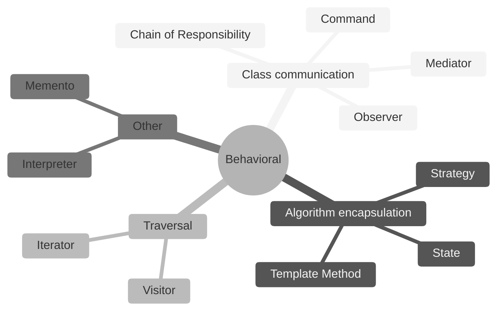
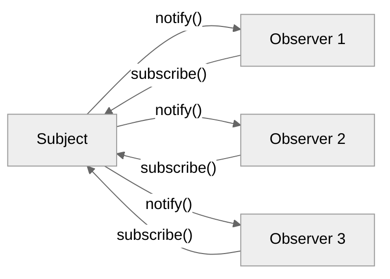
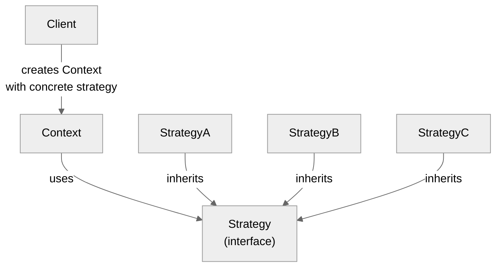
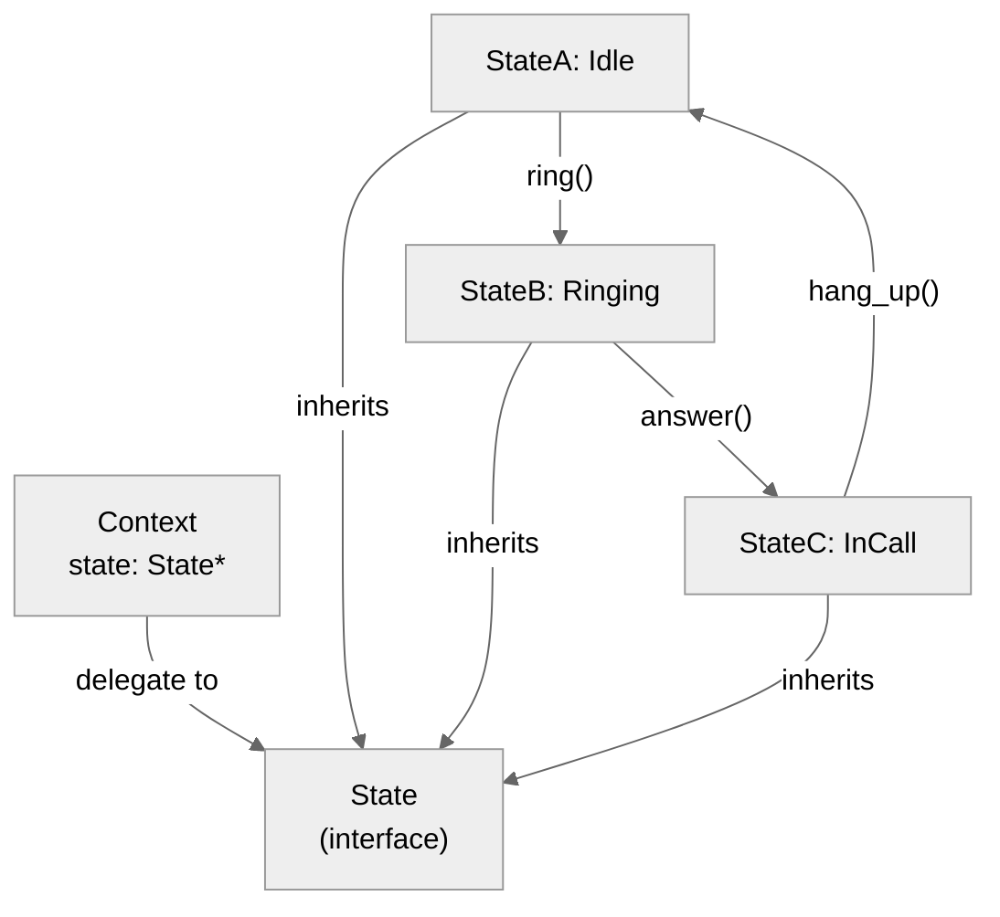
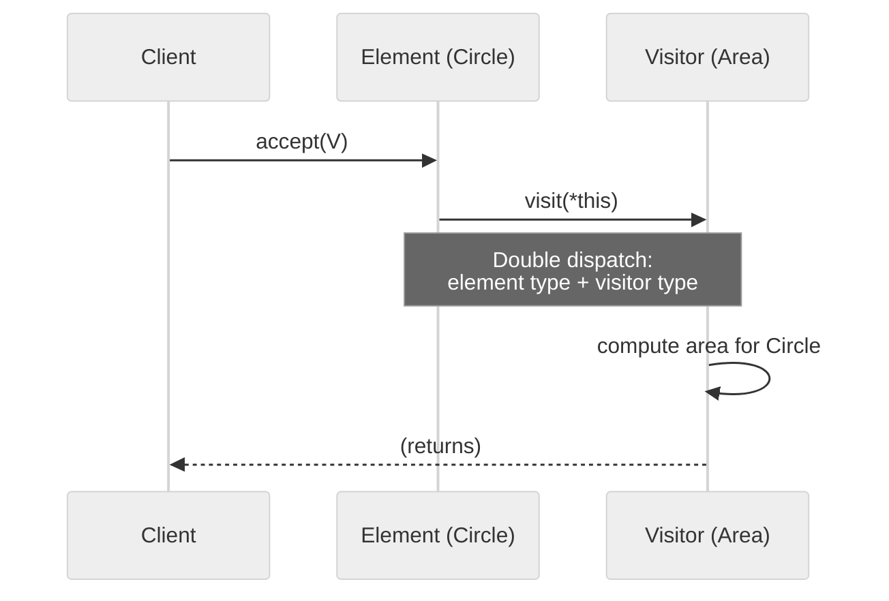

# 4. Behavioral Patterns

> [!info] Where this fits
> This note covers the 11 behavioral patterns from the GoF catalog. It builds on [[1. Design Patterns Overview]], [[2. Creational Patterns]], and [[3. Structural Patterns]]. After this, [[5. SOLID Principles]] connects patterns to principles, and [[6. Software Architecture]] zooms out to system-level patterns.

## Why This Matters

Behavioral patterns are about **responsibility assignment** and **object interaction**. They answer:
- How does object A tell object B that something happened, without A knowing B's concrete type? (Observer)
- How do I encapsulate an algorithm with customizable steps? (Template Method)
- How do I let a client pick one of several algorithms at runtime? (Strategy)
- How do I let an object change behavior when its state changes? (State)
- How do I encapsulate a request as an object? (Command)
- How do I traverse a collection without exposing its representation? (Iterator)
- How do I add operations to a class hierarchy without modifying it? (Visitor)

The recurring theme: **decoupling the requester from the performer**. When the requester (caller) is decoupled from the performer (callee), you can:
- Substitute different performers (Strategy, State).
- Add new performers without changing the requester (Observer).
- Defer or queue requests (Command).
- Reorder or compose operations (Chain of Responsibility, Visitor).

In C++, behavioral patterns use virtual functions, `std::function`, templates, `std::variant`, and coroutines. Modern C++ often replaces classic patterns with language features — but the underlying problems persist.

This note covers all 11 patterns with code. Some get more space because they are more common (Strategy, Observer, State, Visitor); others get shorter treatment because they are less common in modern code (Interpreter, Memento).

## Background

### Algorithm encapsulation

The Strategy pattern's core idea — encapsulate an algorithm behind an interface — is one of the most reusable in programming. The STL is built on it: every algorithm takes a callable (function, lambda, functor) that defines the operation. `std::sort(v.begin(), v.end(), cmp)` is Strategy: `cmp` is the strategy.

In OOP, the classic form is:

```cpp
class SortStrategy {
public:
    virtual ~SortStrategy() = default;
    virtual void sort(std::vector<int>&) = 0;
};

class QuickSort : public SortStrategy { /* ... */ };
class MergeSort : public SortStrategy { /* ... */ };
```

In modern C++, we usually write:

```cpp
using Comparator = std::function<bool(int, int)>;
void sort(std::vector<int>& v, Comparator cmp);
```

The pattern is the same; the implementation is lighter. Knowing both forms lets you pick the right one for the situation.

### State-driven behavior

The State pattern models objects whose behavior changes based on internal state. A vending machine in "idle" state behaves differently than one in "dispensing" state. State transitions are first-class.

The classic implementation uses a class per state, with the context delegating to the current state object. In modern C++, `std::variant<StateA, StateB, StateC>` plus `std::visit` is often cleaner.

### Events and notifications

The Observer pattern (a.k.a. publish-subscribe) decouples the source of an event from its consumers. A subject maintains a list of observers; when the subject changes, it notifies all observers. The observers register and deregister dynamically.

This is the foundation of:
- GUI frameworks (Qt's signals/slots, wxWidgets' event handlers).
- Reactive programming (RxCpp, Reactive Extensions).
- Event-driven architectures (see [[6. Software Architecture]]).

In modern C++, a small Signal class (a few dozen lines) implements Observer cleanly.

## Main Content

### 1. Chain of Responsibility

Decouple a request's sender from its receiver by giving more than one object a chance to handle the request.

```cpp
#include <memory>
#include <iostream>

class Handler {
public:
    virtual ~Handler() = default;
    void set_next(std::unique_ptr<Handler> n) { next_ = std::move(n); }
    virtual void handle(int request) {
        if (next_) next_->handle(request);
    }
protected:
    std::unique_ptr<Handler> next_;
};

class AuthHandler : public Handler {
public:
    void handle(int request) override {
        if (request == 1) std::cout << "Auth: handle login\n";
        else Handler::handle(request);
    }
};

class LogHandler : public Handler {
public:
    void handle(int request) override {
        if (request == 2) std::cout << "Log: handle log request\n";
        else Handler::handle(request);
    }
};

class DefaultHandler : public Handler {
public:
    void handle(int request) override {
        std::cout << "Default: cannot handle " << request << "\n";
    }
};

// Usage:
auto chain = std::make_unique<AuthHandler>();
auto log = std::make_unique<LogHandler>();
auto def = std::make_unique<DefaultHandler>();
log->set_next(std::move(def));
chain->set_next(std::move(log));
chain->handle(1);  // Auth
chain->handle(2);  // Log
chain->handle(99); // Default
```

Use cases: HTTP middleware (Express, ASP.NET), exception handlers, event bubbling in UIs, servlet filters.

### 2. Command

Encapsulate a request as an object. Lets you parameterize clients with different requests, queue or log requests, and support undoable operations.

```cpp
#include <functional>
#include <memory>
#include <vector>
#include <iostream>

class Command {
public:
    virtual ~Command() = default;
    virtual void execute() = 0;
    virtual void undo() {}
};

class Light {
public:
    void on()  { std::cout << "Light ON\n"; }
    void off() { std::cout << "Light OFF\n"; }
};

class LightOnCommand : public Command {
public:
    explicit LightOnCommand(Light& l) : light_(l) {}
    void execute() override { light_.on(); }
    void undo() override    { light_.off(); }
private:
    Light& light_;
};

class LightOffCommand : public Command {
public:
    explicit LightOffCommand(Light& l) : light_(l) {}
    void execute() override { light_.off(); }
    void undo() override    { light_.on(); }
private:
    Light& light_;
};

class RemoteControl {
public:
    void submit(std::unique_ptr<Command> cmd) {
        cmd->execute();
        history_.push_back(std::move(cmd));
    }
    void undo_last() {
        if (!history_.empty()) {
            history_.back()->undo();
            history_.pop_back();
        }
    }
private:
    std::vector<std::unique_ptr<Command>> history_;
};

// Usage:
Light light;
RemoteControl rc;
rc.submit(std::make_unique<LightOnCommand>(light));
rc.submit(std::make_unique<LightOffCommand>(light));
rc.undo_last();  // light back on
rc.undo_last();  // light off
```

#### Modern C++ alternative: `std::function`

```cpp
using Command = std::function<void()>;

std::vector<Command> history;
history.push_back([&] { light.on(); });
history.push_back([&] { light.off(); });
for (auto& cmd : history) cmd();
```

For undo support, use a `std::pair<std::function<void()>, std::function<void()>>`.

### 3. Interpreter

Given a language, define a representation for its grammar and an interpreter that uses the representation to interpret sentences in the language.

This is rarely implemented as a class hierarchy in modern C++ (parsers are usually written with parser generators or combinator libraries). The pattern is conceptually important: it explains how to structure recursive-descent parsers as object trees.

```cpp
#include <memory>
#include <map>
#include <string>

class Context {
public:
    std::map<std::string, int> variables;
};

class Expression {
public:
    virtual ~Expression() = default;
    virtual int interpret(const Context& ctx) = 0;
};

class Number : public Expression {
public:
    explicit Number(int v) : value_(v) {}
    int interpret(const Context&) override { return value_; }
private:
    int value_;
};

class Variable : public Expression {
public:
    explicit Variable(std::string n) : name_(std::move(n)) {}
    int interpret(const Context& ctx) override {
        return ctx.variables.at(name_);
    }
private:
    std::string name_;
};

class Add : public Expression {
public:
    Add(std::unique_ptr<Expression> l, std::unique_ptr<Expression> r)
        : left_(std::move(l)), right_(std::move(r)) {}
    int interpret(const Context& ctx) override {
        return left_->interpret(ctx) + right_->interpret(ctx);
    }
private:
    std::unique_ptr<Expression> left_, right_;
};

// Usage: interpret "x + 5" with x = 10
Context ctx;
ctx.variables["x"] = 10;
auto expr = std::make_unique<Add>(
    std::make_unique<Variable>("x"),
    std::make_unique<Number>(5));
std::cout << expr->interpret(ctx) << "\n";  // 15
```

### 4. Iterator

Provide a way to access the elements of an aggregate object sequentially without exposing its underlying representation.

The STL iterator model is the canonical C++ implementation. Custom iterators require implementing `operator*`, `operator++`, `operator==`, and the iterator traits.

```cpp
#include <iterator>

template <typename T>
class Range {
public:
    Range(T begin, T end, T step = 1)
        : current_(begin), end_(end), step_(step) {}

    class Iterator {
    public:
        using iterator_category = std::input_iterator_tag;
        using value_type = T;
        using difference_type = std::ptrdiff_t;
        using pointer = const T*;
        using reference = T;

        Iterator(T v, T step) : value_(v), step_(step) {}
        reference operator*() const { return value_; }
        Iterator& operator++() { value_ += step_; return *this; }
        bool operator==(const Iterator& o) const { return value_ == o.value_; }
        bool operator!=(const Iterator& o) const { return !(*this == o); }
    private:
        T value_, step_;
    };

    Iterator begin() const { return Iterator(current_, step_); }
    Iterator end()   const { return Iterator(end_, step_); }

private:
    T current_, end_, step_;
};

// Usage:
for (int x : Range<int>(0, 10, 2)) {
    std::cout << x << " ";  // 0 2 4 6 8
}
```

For most code, prefer the STL iterators or range-based for. Write custom iterators only for unusual containers.

### 5. Mediator

Define an object that encapsulates how a set of objects interact. Promotes loose coupling by keeping objects from referring to each other explicitly.

```cpp
#include <string>
#include <memory>
#include <iostream>

class Dialog;  // forward

class Widget {
public:
    virtual ~Widget() = default;
    explicit Dialog* mediator_ = nullptr;
    virtual void changed() { if (mediator_) mediator_->widget_changed(this); }
};

class ListBox : public Widget {
public:
    void select(const std::string& item) {
        selection_ = item;
        changed();
    }
    const std::string& selection() const { return selection_; }
private:
    std::string selection_;
};

class Entry : public Widget {
public:
    void set_text(const std::string& t) { text_ = t; }
    const std::string& text() const { return text_; }
private:
    std::string text_;
};

class Button : public Widget {
public:
    bool enabled_ = false;
    void set_enabled(bool e) { enabled_ = e; }
};

class Dialog {
public:
    Dialog() {
        listbox_.mediator_ = this;
        entry_.mediator_ = this;
        button_.mediator_ = this;
    }
    void widget_changed(Widget* w) {
        if (w == &listbox_) {
            entry_.set_text(listbox_.selection());
            button_.set_enabled(true);
        }
    }
    ListBox& listbox() { return listbox_; }
    Entry&   entry()   { return entry_; }
    Button&  button()  { return button_; }
private:
    ListBox listbox_;
    Entry entry_;
    Button button_;
};

// Usage:
Dialog d;
d.listbox().select("Hello");
std::cout << d.entry().text() << "\n";      // "Hello"
std::cout << d.button().enabled_ << "\n";   // 1
```

Use cases: UI frameworks (a dialog mediates its widgets), chat rooms (a room mediates users), air traffic control (tower mediates planes).

### 6. Memento

Capture and externalize an object's internal state so that the object can be restored to that state later, without violating encapsulation.

```cpp
#include <string>
#include <vector>

class Editor {
public:
    void type(const std::string& words) { text_ += words; }
    void delete_last(size_t n) {
        if (n > text_.size()) text_.clear();
        else text_.erase(text_.size() - n);
    }
    const std::string& content() const { return text_; }

    struct Memento {
        std::string state;
    };
    Memento snapshot() const { return {text_}; }
    void restore(const Memento& m) { text_ = m.state; }

private:
    std::string text_;
};

// Usage:
Editor e;
e.type("Hello, ");
e.type("world!");
auto snap = e.snapshot();
e.delete_last(6);  // "Hello, "
e.restore(snap);   // "Hello, world!"
```

Use cases: undo systems (text editors, drawing apps), transaction rollback, game save states.

### 7. Observer

Define a one-to-many dependency between objects so that when one object changes state, all its dependents are notified.

```cpp
#include <functional>
#include <vector>
#include <string>
#include <iostream>

template <typename... Args>
class Signal {
public:
    using Slot = std::function<void(Args...)>;
    int connect(Slot s) {
        slots_.push_back({next_id_, std::move(s)});
        return next_id_++;
    }
    void disconnect(int id) {
        slots_.erase(std::remove_if(slots_.begin(), slots_.end(),
            [id](const auto& p) { return p.first == id; }), slots_.end());
    }
    void emit(Args... args) {
        for (const auto& [id, s] : slots_) s(args...);
    }
private:
    std::vector<std::pair<int, Slot>> slots_;
    int next_id_ = 0;
};

class Subject {
public:
    Signal<int> on_value_changed;
    void set_value(int v) {
        if (v != value_) {
            value_ = v;
            on_value_changed.emit(value_);
        }
    }
private:
    int value_ = 0;
};

// Usage:
Subject s;
s.on_value_changed.connect([](int v) { std::cout << "A: " << v << "\n"; });
s.on_value_changed.connect([](int v) { std::cout << "B: " << v << "\n"; });
s.set_value(42);  // both observers called
```

#### Variants

- **Push model** (above): subject sends data to observers.
- **Pull model**: subject sends a "changed" notification; observers query the subject for details.
- **Weak references**: observers auto-disconnect when destroyed. Use `std::weak_ptr` to observers or track lifetimes explicitly.

### 8. State

Allow an object to alter its behavior when its internal state changes. The object will appear to change its class.

```cpp
#include <memory>
#include <iostream>

class Phone {
public:
    Phone();
    void ring();
    void answer();
    void hang_up();

    class State {
    public:
        virtual ~State() = default;
        virtual void ring(Phone&)    { std::cout << "Already ringing\n"; }
        virtual void answer(Phone&)  { std::cout << "Cannot answer — not ringing\n"; }
        virtual void hang_up(Phone&) { std::cout << "Not in a call\n"; }
    };

    void set_state(std::unique_ptr<State> s) { state_ = std::move(s); }
    State& state() { return *state_; }

private:
    std::unique_ptr<State> state_;
};

class Idle : public Phone::State {
public:
    void ring(Phone& p) override {
        std::cout << "Phone starts ringing!\n";
        // transition to Ringing
    }
};

// ... (Ringing, InCall states)

Phone::Phone() : state_(std::make_unique<Idle>()) {}
void Phone::ring()    { state_->ring(*this); }
void Phone::answer()  { state_->answer(*this); }
void Phone::hang_up() { state_->hang_up(*this); }

// Usage:
Phone p;
p.answer();   // Cannot answer — not ringing
p.ring();     // Phone starts ringing!
// (transition logic omitted for brevity)
```

#### Modern alternative: `std::variant`

```cpp
#include <variant>

struct Idle {};
struct Ringing { int volume; };
struct InCall { std::string caller; };

using PhoneState = std::variant<Idle, Ringing, InCall>;

struct RingVisitor {
    PhoneState operator()(Idle) { return Ringing{5}; }
    PhoneState operator()(Ringing r) { return r; }  // already ringing
    PhoneState operator()(InCall c) { return c; }   // ignore
};

struct AnswerVisitor {
    PhoneState operator()(Idle) { return Idle{}; }
    PhoneState operator()(Ringing r) { return InCall{"unknown"}; }
    PhoneState operator()(InCall c) { return c; }
};

PhoneState state = Idle{};
state = std::visit(RingVisitor{}, state);   // -> Ringing{5}
state = std::visit(AnswerVisitor{}, state); // -> InCall{"unknown"}
```

`std::variant` is closed (you must list all states) but is more efficient (no heap allocation, no virtual dispatch) and the compiler enforces exhaustiveness in `std::visit`.

### 9. Strategy

Define a family of algorithms, encapsulate each, and make them interchangeable. Strategy lets the algorithm vary independently from clients that use it.

```cpp
#include <functional>
#include <vector>
#include <algorithm>
#include <iostream>

// Classic OOP form
class SortStrategy {
public:
    virtual ~SortStrategy() = default;
    virtual void sort(std::vector<int>& v) = 0;
};

class QuickSort : public SortStrategy {
public:
    void sort(std::vector<int>& v) override { std::sort(v.begin(), v.end()); }
};

class ReverseSort : public SortStrategy {
public:
    void sort(std::vector<int>& v) override { std::sort(v.rbegin(), v.rend()); }
};

class Sorter {
public:
    explicit Sorter(std::unique_ptr<SortStrategy> s) : strategy_(std::move(s)) {}
    void sort(std::vector<int>& v) { strategy_->sort(v); }
private:
    std::unique_ptr<SortStrategy> strategy_;
};

// Modern form: std::function
class ModernSorter {
public:
    using Strategy = std::function<void(std::vector<int>&)>;
    explicit ModernSorter(Strategy s) : strategy_(std::move(s)) {}
    void sort(std::vector<int>& v) { strategy_(v); }
private:
    Strategy strategy_;
};

// Usage:
std::vector<int> v{3, 1, 4, 1, 5, 9};

Sorter classic(std::make_unique<QuickSort>());
classic.sort(v);  // 1 1 3 4 5 9

ModernSorter modern([](std::vector<int>& v) {
    std::sort(v.rbegin(), v.rend());
});
modern.sort(v);   // 9 5 4 3 1 1
```

Use cases: sorting/comparison strategies, pricing/discount strategies, rendering strategies, payment processing strategies.

### 10. Template Method

Define the skeleton of an algorithm in an operation, deferring some steps to subclasses. Template Method lets subclasses redefine certain steps without changing the algorithm's structure.

```cpp
#include <iostream>
#include <string>

class Game {
public:
    virtual ~Game() = default;
    void play() {
        initialize();
        start_play();
        end_play();
    }
protected:
    virtual void initialize() = 0;
    virtual void start_play() = 0;
    virtual void end_play() = 0;
};

class Chess : public Game {
protected:
    void initialize() override { std::cout << "Chess setup\n"; }
    void start_play() override { std::cout << "Chess played\n"; }
    void end_play() override   { std::cout << "Chess finished\n"; }
};

class Monopoly : public Game {
protected:
    void initialize() override { std::cout << "Monopoly setup\n"; }
    void start_play() override { std::cout << "Monopoly played\n"; }
    void end_play() override   { std::cout << "Monopoly finished\n"; }
};

// Usage:
Chess c;
c.play();
Monopoly m;
m.play();
```

#### Modern alternative: policy-based design (templates)

```cpp
template <typename GamePolicy>
void play_game() {
    GamePolicy::initialize();
    GamePolicy::start_play();
    GamePolicy::end_play();
}

struct ChessPolicy {
    static void initialize() { std::cout << "Chess setup\n"; }
    static void start_play() { std::cout << "Chess played\n"; }
    static void end_play()   { std::cout << "Chess finished\n"; }
};

play_game<ChessPolicy>();
```

Templates give you the same structure with no virtual function overhead.

### 11. Visitor

Represent an operation to be performed on the elements of an object structure. Lets you define a new operation without changing the classes of the elements.

```cpp
#include <memory>
#include <vector>
#include <iostream>
#include <variant>

// Classic OOP form
class Circle;
class Rectangle;
class Triangle;

class ShapeVisitor {
public:
    virtual ~ShapeVisitor() = default;
    virtual void visit(const Circle&)    = 0;
    virtual void visit(const Rectangle&) = 0;
    virtual void visit(const Triangle&)  = 0;
};

class Shape {
public:
    virtual ~Shape() = default;
    virtual void accept(ShapeVisitor& v) const = 0;
};

class Circle : public Shape {
public:
    explicit Circle(double r) : r_(r) {}
    double radius() const { return r_; }
    void accept(ShapeVisitor& v) const override { v.visit(*this); }
private:
    double r_;
};

class Rectangle : public Shape {
public:
    Rectangle(double w, double h) : w_(w), h_(h) {}
    double width() const { return w_; }
    double height() const { return h_; }
    void accept(ShapeVisitor& v) const override { v.visit(*this); }
private:
    double w_, h_;
};

class AreaCalculator : public ShapeVisitor {
public:
    void visit(const Circle& c) override {
        area_ += 3.14159 * c.radius() * c.radius();
    }
    void visit(const Rectangle& r) override {
        area_ += r.width() * r.height();
    }
    double area() const { return area_; }
private:
    double area_ = 0;
};

// Usage:
std::vector<std::unique_ptr<Shape>> shapes;
shapes.push_back(std::make_unique<Circle>(5));
shapes.push_back(std::make_unique<Rectangle>(3, 4));
AreaCalculator calc;
for (const auto& s : shapes) s->accept(calc);
std::cout << "Total area: " << calc.area() << "\n";
```

#### Modern alternative: `std::variant` + `std::visit`

```cpp
struct Circle { double r; };
struct Rectangle { double w, h; };
using Shape = std::variant<Circle, Rectangle>;

struct AreaVisitor {
    double operator()(const Circle& c)    { return 3.14159 * c.r * c.r; }
    double operator()(const Rectangle& r) { return r.w * r.h; }
};

std::vector<Shape> shapes = {Circle{5}, Rectangle{3, 4}};
double total = 0;
for (const auto& s : shapes) total += std::visit(AreaVisitor{}, s);
```

The trade-off:
- **Visitor (OOP)**: easy to add new operations; hard to add new element types.
- **`std::variant`**: easy to add new element types (just add to the variant); the compiler enforces that all visitors handle every type.

Pick the one that matches your expected axis of change.

## Mermaid Diagrams

### Behavioral pattern overview



### Observer pattern



### Strategy pattern



### State pattern



### Visitor double dispatch



## Code Examples

### Complete Strategy example (text formatter)

```cpp
#include <functional>
#include <string>
#include <vector>
#include <iostream>

class TextFormatter {
public:
    using Strategy = std::function<std::string(const std::vector<std::string>&)>;
    explicit TextFormatter(Strategy s) : strategy_(std::move(s)) {}
    std::string format(const std::vector<std::string>& lines) {
        return strategy_(lines);
    }
private:
    Strategy strategy_;
};

int main() {
    std::vector<std::string> lines = {"hello", "world", "of", "C++"};

    TextFormatter csv([](const std::vector<std::string>& ls) {
        std::string out;
        for (size_t i = 0; i < ls.size(); ++i) {
            if (i) out += ",";
            out += ls[i];
        }
        return out;
    });

    TextFormatter html([](const std::vector<std::string>& ls) {
        std::string out = "<ul>\n";
        for (const auto& l : ls) out += "  <li>" + l + "</li>\n";
        out += "</ul>";
        return out;
    });

    TextFormatter md([](const std::vector<std::string>& ls) {
        std::string out;
        for (const auto& l : ls) out += "- " + l + "\n";
        return out;
    });

    std::cout << "CSV: " << csv.format(lines) << "\n";
    std::cout << "HTML:\n" << html.format(lines);
    std::cout << "Markdown:\n" << md.format(lines);
}
```

### Complete Observer example (event bus)

```cpp
#include <functional>
#include <unordered_map>
#include <string>
#include <any>
#include <iostream>

class EventBus {
public:
    template <typename E>
    int subscribe(std::function<void(const E&)> handler) {
        int id = next_id_++;
        handlers_[typeid(E).hash_code()].push_back({id, [handler](const std::any& e) {
            handler(std::any_cast<const E&>(e));
        }});
        return id;
    }

    template <typename E>
    void publish(const E& event) {
        auto it = handlers_.find(typeid(E).hash_code());
        if (it == handlers_.end()) return;
        for (const auto& [id, h] : it->second) {
            h(event);
        }
    }
private:
    using Handler = std::function<void(const std::any&)>;
    std::unordered_map<size_t, std::vector<std::pair<int, Handler>>> handlers_;
    int next_id_ = 0;
};

// Usage:
struct UserCreated { std::string name; };
struct UserDeleted { int id; };

int main() {
    EventBus bus;
    bus.subscribe<UserCreated>([](const UserCreated& e) {
        std::cout << "Welcome, " << e.name << "!\n";
    });
    bus.subscribe<UserCreated>([](const UserCreated& e) {
        std::cout << "[audit] user created: " << e.name << "\n";
    });
    bus.subscribe<UserDeleted>([](const UserDeleted& e) {
        std::cout << "User " << e.id << " deleted\n";
    });

    bus.publish(UserCreated{"alice"});
    bus.publish(UserDeleted{42});
}
```

### State with `std::variant` (vending machine)

```cpp
#include <variant>
#include <iostream>
#include <string>

struct Idle {};
struct HasCoin { int coin_count; };
struct Dispensing { std::string product; };

using VendingState = std::variant<Idle, HasCoin, Dispensing>;

struct InsertCoinVisitor {
    VendingState operator()(Idle) { return HasCoin{1}; }
    VendingState operator()(HasCoin s) { return HasCoin{s.coin_count + 1}; }
    VendingState operator()(Dispensing s) { return s; }
};

struct SelectProductVisitor {
    std::string product;
    VendingState operator()(Idle) {
        std::cout << "Insert coin first\n";
        return Idle{};
    }
    VendingState operator()(HasCoin s) {
        if (s.coin_count >= 1) {
            std::cout << "Dispensing " << product << "\n";
            return Dispensing{product};
        }
        return s;
    }
    VendingState operator()(Dispensing s) {
        std::cout << "Already dispensing\n";
        return s;
    }
};

int main() {
    VendingState state = Idle{};
    state = std::visit(InsertCoinVisitor{}, state);
    state = std::visit(SelectProductVisitor{"Soda"}, state);
}
```

## Common Pitfalls

> [!warning] Pitfalls
> - **Observer without disconnect.** Observers held by `std::function` are kept alive. If a subscriber object dies but did not disconnect, the next `emit` calls a dead handler. Use weak references or explicit disconnect.
> - **Strategy chosen at every call.** Choosing a strategy per call adds overhead. Pick once and reuse.
> - **State pattern with too many states.** Each state is a class. 20 states = 20 classes. Consider `std::variant` if the state set is closed.
> - **Visitor modifying the structure.** The Visitor pattern assumes a stable structure. Adding a new element type forces changes to all visitors.
> - **Template Method with too many hooks.** A 10-step algorithm with 7 customization points is hard to follow. Extract strategy objects for the customizable parts.
> - **Iterator with invalidation.** If the container changes during iteration, the iterator may dangle. STL iterators document invalidation rules; custom iterators should too.
> - **Chain of Responsibility without a default.** A request that no handler accepts is silently dropped. Always have a default handler that logs or errors.
> - **Command without undo.** If your Command has `execute()`, it should usually have `undo()`. Otherwise, just use a function.
> - **Mediator becoming a god object.** A mediator that knows about 50 widgets is itself a problem. Split per-screen or per-feature.
> - **Interpreter for non-trivial languages.** Hand-written interpreters are slow and verbose. Use a parser generator (ANTLR, Bison) or a combinator library (Boost.Spirit) for real languages.

## Tips and Tricks

> [!tip] Tips
> - For Strategy, prefer `std::function` over virtual-function hierarchies. It is lighter and integrates with lambdas.
> - For Observer, implement a small Signal class. Don't use a heavy framework unless you need cross-thread dispatch.
> - For State with closed state set, prefer `std::variant` + `std::visit`. The compiler enforces exhaustiveness.
> - For Visitor with stable element types, `std::variant` + `std::visit` is usually cleaner than the classic GoF Visitor.
> - For Iterator, conform to STL iterator categories. Your iterator will work with all STL algorithms.
> - For Command, use `std::function` for simple cases. Reserve class-based Command for undo/redo or queued execution.
> - For Template Method, use CRTP (`Curiously Recurring Template Pattern`) for compile-time customization without virtual dispatch.
> - For Chain of Responsibility, use `std::vector<std::function<bool(Request)>>` and stop at the first that returns true.
> - For Mediator, define the mediator interface explicitly. Don't let widgets reach into each other directly.
> - For Interpreter, use Boost.Spirit for parser combinators. It is far more maintainable than hand-rolled class hierarchies.

## Active Recall

1. List the 11 behavioral patterns from memory.
2. What is the difference between Strategy and State?
3. How does Observer decouple subjects from observers? What is the lifetime issue?
4. Write a `Signal<T>` class that supports `connect`, `disconnect`, and `emit`.
5. When would you use Visitor over `std::variant` + `std::visit`?
6. How does Command support undo?
7. What is the difference between Chain of Responsibility and a sequence of `if` statements?
8. Write a custom iterator for a `Range<int>` that yields `start, start+step, ..., end`.
9. How does Template Method differ from Strategy?
10. When is the Interpreter pattern useful? When should you avoid it?

## Next Steps

- This completes the patterns sub-series. Loop back to [[1. Design Patterns Overview]] to consolidate.
- Continue to [[5. SOLID Principles]] — the principles behind the patterns.
- Then [[6. Software Architecture]] for system-level patterns (MVC, microservices, event-driven).
- Then [[7. Code Quality and Refactoring]] — patterns emerge from refactoring.
- Cross-link to [[9. Object-Oriented Programming/4. Polymorphism and Virtual Functions]] — most behavioral patterns use polymorphism.
- Cross-link to [[8. Modern C++/7. std optional, std variant, std any]] — `std::variant` replaces several patterns.
- Cross-link to [[14. Concurrency and Multithreading]] — concurrent behavioral patterns (Active Object, Half-Sync/Half-Async).
